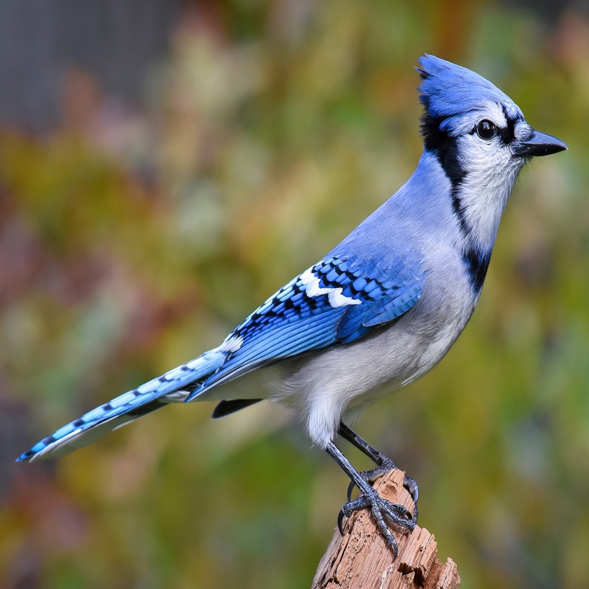
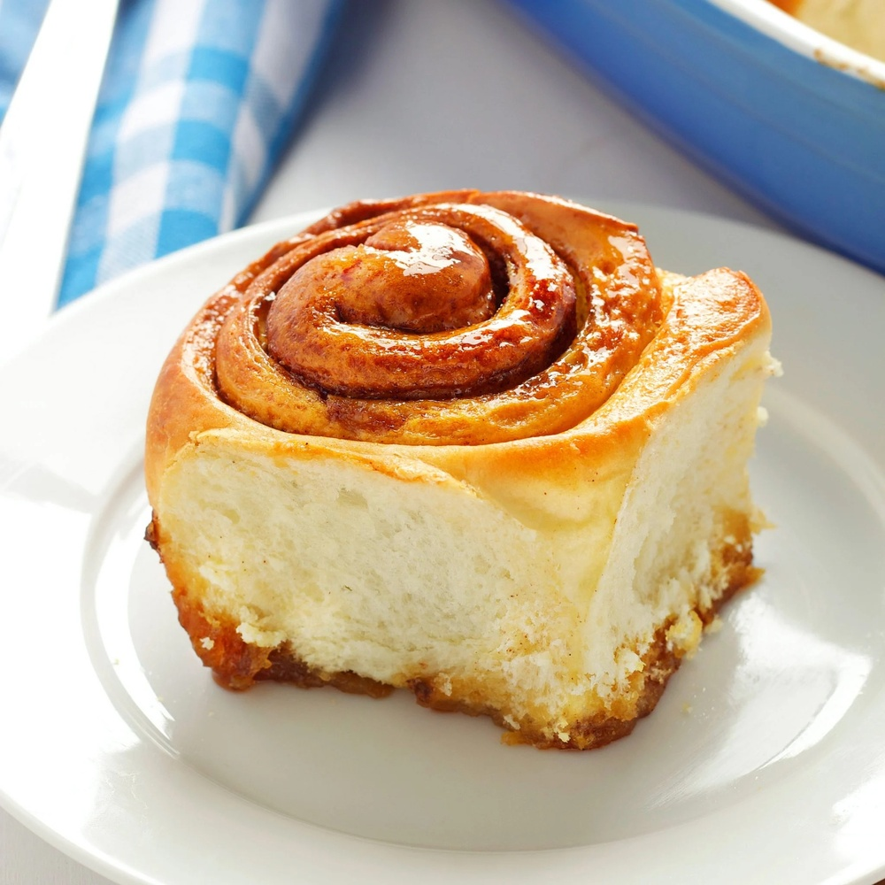
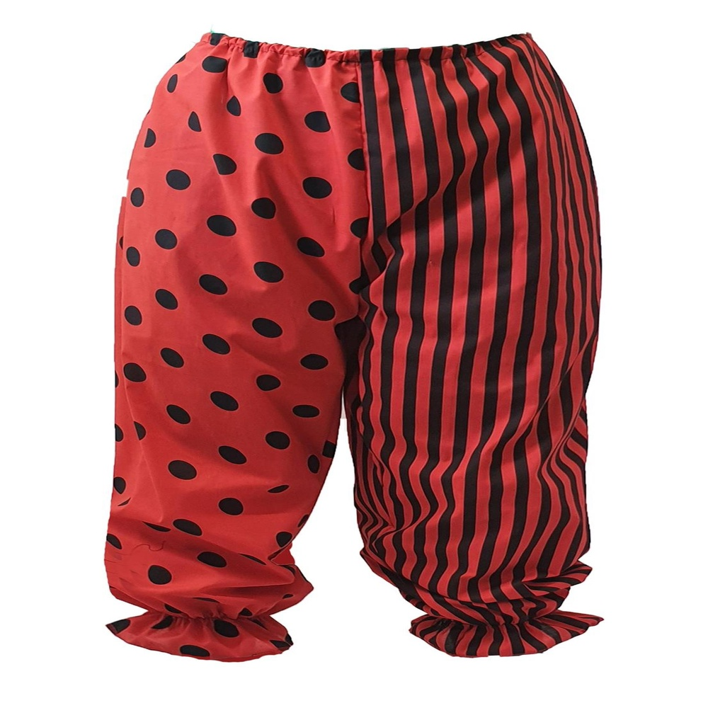

# Cross-Image Attention for Zero-Shot Appearance Transfer

**ArXiv ID**: 2311.03335v1
**URL**: http://arxiv.org/abs/2311.03335v1
**提交日期**: 2023-11-06
**作者**: Yuval Alaluf; Daniel Garibi; Or Patashnik; Hadar Averbuch-Elor; Daniel Cohen-Or
**引用次数**: NULL
使用模型: gemini-2.5-flash

## 1. 核心思想总结
作为学术论文分析专家，以下是针对该摘要的简洁第一轮总结：

**标题: 跨图像注意力实现零样本外观迁移**

**Background (背景):**
近年来，文本到图像生成模型在深度理解图像语义方面取得了显著进步，为利用图像语义知识提供了基础。

**Problem (问题):**
如何在语义相似但形状可能差异巨大的对象之间，高效且灵活地进行视觉外观迁移，特别是在需要处理复杂形状变化而无需重新训练或优化的情况下。

**Method (high-level) (方法概要):**
该方法基于生成模型的自注意力层，引入了“跨图像注意力”机制。具体而言，给定一个目标结构图像和一个期望外观图像，通过将结构图像的查询与外观图像的键和值结合，在去噪过程中隐式建立图像间的语义对应，从而生成融合二者特征的新图像。此外，还引入了三种机制来提升输出图像质量，且整个过程是零样本的，无需任何优化或训练。

**Contribution (贡献):**
提出了一种新颖的零样本外观迁移方法，能够有效处理广泛的物体类别，并且对输入图像间在形状、大小和视角上的显著差异表现出强大的鲁棒性。

## 2. 方法详解
基于您提供的初步总结和对方法章节的理解，以下是对该论文方法细节的详细说明：

### 论文方法细节：跨图像注意力实现零样本外观迁移

该论文提出了一种新颖的零样本外观迁移方法，其核心在于利用预训练生成模型中的自注意力机制，通过引入“跨图像注意力”来隐式地建立源图像与目标图像之间的语义对应，从而实现外观的灵活迁移。整个流程无需额外的训练或优化，展现了强大的泛化能力。

---

#### 1. 核心创新点 (Key Innovations)

1.  **跨图像注意力机制 (Cross-Image Attention Mechanism):**
    *   **本质创新:** 在生成模型的去噪过程中，创新性地将目标结构图像的特征作为查询（Query），将期望外观图像的特征作为键（Key）和值（Value），进行注意力计算。这打破了传统自注意力只在单一图像内部或通过文本提示进行交互的范式。
    *   **语义对应建立:** 这种跨图像的QKV设计，使得模型能够在潜在空间中“学习”并“理解”结构图像的哪一部分对应于外观图像的哪一部分，从而在无需显式语义分割或关键点标注的情况下，建立起细粒度的语义对应关系。
    *   **零样本特性:** 这一机制的引入是基于现有预训练生成模型（如潜在扩散模型）的自注意力层进行改造，而非从头训练，确保了方法的零样本性质，极大地提升了泛化能力和应用效率。

2.  **鲁棒的形状差异处理能力 (Robust Shape Discrepancy Handling):**
    *   通过上述跨图像注意力，该方法能够处理语义相似但形状、大小甚至视角差异巨大的物体。传统的图像迁移方法往往对这些差异敏感，需要额外的对齐或更复杂的模型。本方法通过在潜在空间中建立高层次的语义对应，有效规避了像素层面的刚性匹配问题。

3.  **零样本与免优化流程 (Zero-Shot and Optimization-Free Process):**
    *   不同于许多需要特定优化（如StyleGAN inversion或DreamBooth等）或微调（fine-tuning）的个性化生成方法，该方法在推理时即可直接应用，无需对特定图像对进行任何优化步骤，显著降低了使用门槛和计算成本。

4.  **三项质量提升机制 (Three Quality Enhancement Mechanisms):**
    *   除了核心的跨图像注意力，论文还引入了额外的三项机制。这些机制对于确保生成图像的视觉质量、外观保真度、结构一致性以及语义对齐的精准性至关重要，是该方法能够输出高质量结果的保障。

---

#### 2. 算法与架构细节 (Algorithm and Architecture Details)

1.  **基础生成模型 (Underlying Generative Model):**
    *   该方法基于**潜在扩散模型（Latent Diffusion Model）**或类似的、包含自注意力层的生成模型。这类模型通常由一个编码器将图像压缩到潜在空间，一个U-Net架构的去噪器在潜在空间迭代去噪，以及一个解码器将去噪后的潜在码还原为图像。
    *   **关键组件:** U-Net架构中的**自注意力层**是实现跨图像注意力的核心改造点。

2.  **跨图像注意力机制的实现细节 (Implementation Details of Cross-Image Attention):**
    *   **输入:**
        *   **结构图像 ($I_S$):** 提供最终生成图像的几何形状、布局和姿态信息。
        *   **外观图像 ($I_A$):** 提供需要迁移的纹理、颜色、材质和风格信息。
    *   **注意力计算流程:**
        1.  **特征提取:** 在U-Net的每一层或特定层，针对当前的去噪迭代步骤，分别从$I_S$的潜在表示（或其在去噪过程中的中间特征）中提取**查询（Query, $Q_{S}$）**特征。
        2.  同时，从$I_A$的潜在表示（或其对应特征）中提取**键（Key, $K_{A}$）**和**值（Value, $V_{A}$）**特征。
        3.  **注意力权重计算:** 使用$Q_{S}$与$K_{A}$计算注意力权重矩阵：$Attention\_Weights = Softmax(Q_{S} K_{A}^T / \sqrt{d_k})$，其中$d_k$是键的维度。这个步骤隐式地建立了结构图像中每个局部区域与外观图像中每个局部区域的语义相似性。
        4.  **特征融合:** 将计算出的注意力权重应用于$V_{A}$，得到融合外观特征的结构引导特征：$Output = Attention\_Weights \cdot V_{A}$。
        5.  **替换或增强:** 这个$Output$将替换或增强U-Net中原始的自注意力层的输出。这意味着在去噪的每一步，网络都会根据结构图像的布局来“抽取”外观图像中相应的纹理和颜色信息。

3.  **三项质量提升机制 (Three Quality Enhancement Mechanisms) – 推测细节:**
    鉴于零样本和无需优化的特性，这些机制很可能是在扩散模型的采样或注意力过程中引入的轻量级但有效的策略。它们可能包括：
    *   **结构保真度引导 (Structural Fidelity Guidance):** 可能通过修改扩散过程的采样步长、引入额外的结构保持损失项（在零样本框架下，可能是通过与结构图像的潜在特征进行弱耦合或加权）、或者在特定的U-Net层中加强结构图像$Q$的引导作用，以确保生成的图像严格遵循$I_S$的几何轮廓和姿态。
    *   **外观细节增强模块 (Appearance Detail Enhancement Module):** 可能专注于高频信息的迁移。这可能通过对$K_A$和$V_A$特征进行更细粒度的提取和编码，或者在注意力输出后，引入一个轻量级的残差模块来补充外观图像的精细纹理，确保迁移后的外观不失真、不模糊。
    *   **语义一致性与背景处理 (Semantic Consistency and Background Handling):** 零样本迁移中，背景处理和前景与背景的语义一致性常常是挑战。此机制可能通过对注意力区域的约束（如关注前景区域），或通过某种形式的掩码引导，确保外观只迁移到前景物体，同时保持背景的合理性或原始性。这也可以包括优化噪声调度策略，以在不同去噪阶段更好地平衡结构与外观的融合。

---

#### 3. 关键步骤与整体流程 (Key Steps and Overall Flow)

整个外观迁移过程在预训练的潜在扩散模型中进行，具体流程如下：

1.  **输入准备 (Input Preparation):**
    *   用户提供两张输入图像：**目标结构图像 ($I_S$)** 和 **期望外观图像 ($I_A$)**。
    *   这两张图像被送入预训练扩散模型的**变分自编码器（VAE）编码器**，分别编码为它们的潜在表示$z_S$和$z_A$。

2.  **迭代去噪过程 (Iterative Denoising Process) - 在潜在空间进行:**
    *   **初始化:** 从一个随机高斯噪声潜在码开始，或者为了更好地保持结构，可以基于$z_S$的一个噪声版本初始化去噪过程。
    *   **循环去噪 ($T$步):** 对于每个时间步$t$（从$T$到$0$）：
        *   **特征提取:** 扩散模型的U-Net架构会从当前含噪的潜在表示中提取多尺度的特征图。同时，可能还会并行地从$z_S$和$z_A$中提取对应的特征，或者在去噪过程中，为$z_S$生成Query，为$z_A$生成Key和Value。
        *   **应用跨图像注意力:** 在U-Net的每个（或选定的）自注意力块中，按照前述的机制，用结构图像的特征作为**Query**，外观图像的特征作为**Key**和**Value**，计算并融合注意力。这将隐式地将外观图像的纹理、颜色等信息“投影”到结构图像的对应部位上。
        *   **集成质量提升机制:** 在注意力融合之后或去噪网络的其他环节，嵌入并执行前面提到的三项质量提升机制，以确保生成图像的结构准确性、外观细节保真度以及整体视觉一致性。
        *   **噪声预测与去噪:** U-Net根据融合后的特征预测当前时间步的噪声，并从含噪的潜在表示中减去该噪声，逐步向清晰的潜在表示演进。

3.  **图像解码 (Image Decoding):**
    *   经过$T$步迭代去噪后，得到最终的干净潜在表示$z_{transfer}$。
    *   将$z_{transfer}$送入预训练扩散模型的**变分自编码器（VAE）解码器**，将其从潜在空间还原为像素空间的**最终外观迁移图像 ($I_{transfer}$)**。

4.  **零样本特性 (Zero-Shot Characteristic):**
    *   整个流程**不涉及任何模型参数的微调或优化**。所有的操作都在一个预训练好的生成模型（及其改造的注意力层）上完成，从而实现了零样本的快速图像外观迁移。

---

通过上述详细的描述，我们可以清晰地理解该论文如何利用“跨图像注意力”这一核心创新，结合现有生成模型和巧妙的质量提升机制，实现高效、灵活且零样本的图像外观迁移任务。

## 3. 最终评述与分析
好的，结合您提供的论文初步总结和方法详述，以下是针对该零样本外观迁移方法的最终综合评估：

---

### 最终综合评估：跨图像注意力实现零样本外观迁移

**1) Overall Summary (综合评估)**

该论文提出了一种开创性的零样本（Zero-Shot）图像外观迁移方法，其核心创新在于巧妙地将**“跨图像注意力”（Cross-Image Attention）机制**集成到预训练的潜在扩散模型（Latent Diffusion Model）的自注意力层中。该方法通过将目标结构图像的潜在特征作为查询（Query），将期望外观图像的潜在特征作为键（Key）和值（Value），在去噪过程中隐式地建立了两者间的语义对应关系。这种机制使得模型能够在无需任何额外的训练或优化（Optimization-Free）的情况下，高效且灵活地将外观图像的风格、纹理和颜色迁移到结构图像所定义的几何形状和布局上。

该研究显著克服了传统外观迁移方法对输入图像间形状、大小、甚至视角差异的敏感性，展现出对广泛物体类别和复杂场景的强大鲁棒性。此外，论文还引入了三项质量提升机制，以进一步确保生成图像的视觉真实感、结构保真度和外观细节完整性。总体而言，这是一项在图像生成与编辑领域具有里程碑意义的工作，它不仅推动了零样本学习在视觉任务中的应用，也为未来更灵活、更具语义感知的图像内容创作和编辑工具奠定了基础。

**2) Strengths (优势)**

*   **零样本与免优化（Zero-Shot and Optimization-Free）：** 这是该方法最突出的优势。无需针对特定图像对进行模型微调或昂贵的优化过程，极大地降低了使用门槛和计算成本，提升了方法的普适性和实用性。用户可以即时获得结果，无需漫长等待。
*   **对形状、大小、视角差异的鲁棒性（Robustness to Shape, Size, and Viewpoint Discrepancies）：** 通过在潜在空间建立高层次的语义对应，该方法能够有效克服传统像素级或局部特征匹配方法对输入图像间几何差异（如形状、大小、姿态、视角）敏感的问题，成功处理语义相似但外观和结构差异巨大的物体迁移。
*   **高灵活性与泛化能力（High Flexibility and Generalizability）：** 该方法不依赖于特定数据集或物体类别进行训练，而是利用了预训练扩散模型的强大表征能力，因此对广泛的图像内容均表现出良好的泛化能力和灵活的迁移效果。
*   **创新的核心机制（Innovative Core Mechanism）：** 巧妙地改造了生成模型的自注意力层，引入跨图像注意力机制，为语义级别的内容解耦和融合提供了一种新颖且高效的途径，是理论上的一个重要突破。
*   **高质量输出（High-Quality Output）：** 结合三项质量提升机制，确保了生成图像在保持结构一致性的同时，能有效融合外观细节，输出视觉上高质量、高保真度的结果，避免了常见的伪影和模糊。

**3) Weaknesses / Limitations (劣势 / 局限性)**

*   **对预训练模型性能的依赖（Dependency on Pre-trained Model Performance）：** 方法的性能高度依赖于底层预训练生成模型（如潜在扩散模型）的内在能力和泛化性。若基础模型在某些特定领域（例如，非常见物体或抽象概念）表现不佳，则迁移效果可能受限。
*   **潜在的语义错位和伪影（Potential for Semantic Mismatches and Artifacts）：** 尽管能处理较大形状差异，但在结构图像和外观图像语义高度不匹配、纹理过于复杂或存在极端复杂背景时，仍可能出现外观迁移不完整、语义错位或局部伪影。完全的语义对应在所有情况下都难以保证。
*   **精细控制的局限性（Limited Fine-grained Control）：** 作为零样本方法，其在精细控制迁移区域、强度或混合比例方面的能力可能不如需要优化或额外标注的个性化生成方法。例如，用户可能难以精确指定外观仅迁移到结构图像的某一部分，或控制迁移的“强度”。
*   **计算成本（Computational Cost）：** 虽然免优化，但基于潜在扩散模型的迭代去噪过程本身仍具有一定的计算开销，尤其是在生成高分辨率图像时，推理速度可能不是实时的，对于资源受限的环境可能是一个挑战。
*   **三项质量提升机制的透明度（Transparency of Three Quality Enhancement Mechanisms）：** 论文中提及的三项质量提升机制的具体细节在所提供的摘要和方法详述中未予展开。若论文原文对此缺乏充分阐述，则可能影响读者对其整体效果和内在原理的全面理解和复现。

**4) Potential Applications / Implications (潜在应用 / 影响)**

*   **创意内容生成与设计（Creative Content Generation and Design）：** 极大地赋能创意产业，如产品设计（快速测试不同材质或纹理）、时尚设计（虚拟试穿、款式风格迁移）、艺术创作和广告制作（快速生成不同风格的视觉素材）。设计师可以轻松探索无限的视觉组合。
*   **虚拟试穿与增强现实（Virtual Try-on and Augmented Reality - AR）：** 在虚拟试穿、虚拟家居布置等增强现实（AR）应用中具有巨大潜力。用户可以实时预览不同外观效果，无需实物支撑，极大提升用户体验。
*   **高级图像编辑与风格迁移（Advanced Image Editing and Style Transfer）：** 为高级图像编辑和风格迁移提供了新的范式，允许用户以更语义化、更灵活的方式修改图像内容，而非简单的纹理叠加。例如，将照片中某个物体的材质替换为另一个物体的材质。
*   **数据增强与合成（Data Augmentation and Synthesis）：** 可以用于生成多样化的训练数据，通过将不同外观应用到同一结构上，有效进行数据增强，以提高下游视觉任务（如物体识别、分割）模型的鲁棒性，特别是在数据稀缺的领域。
*   **个性化与定制化（Personalization and Customization）：** 为个性化内容生成开辟了新途径，例如用户可以将自己的宠物、衣物等外观应用到各种虚拟形象或物品上，实现高度定制化的数字体验。
*   **推动零样本学习研究（Advance Zero-Shot Learning Research）：** 该方法为零样本学习在复杂多模态任务中的应用提供了新的思路和范例，激励了未来对无需大量标注数据即可解决实际问题的新方法研究。

---

---

# 附录：论文图片

## 图 1

## 图 2

## 图 3

## 图 4

## 图 5

## 图 6

## 图 7

## 图 8

## 图 9

## 图 10

