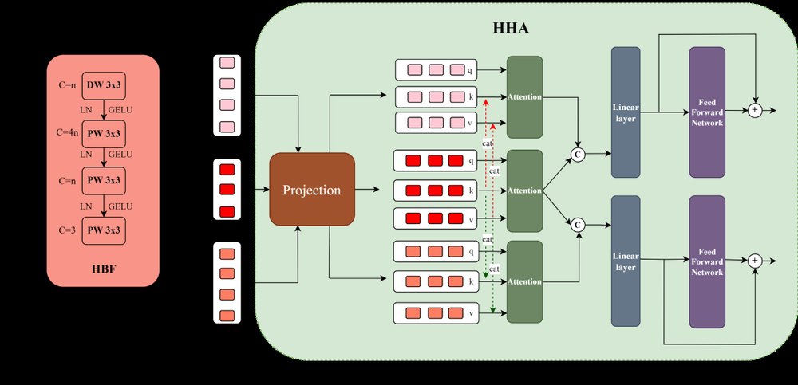
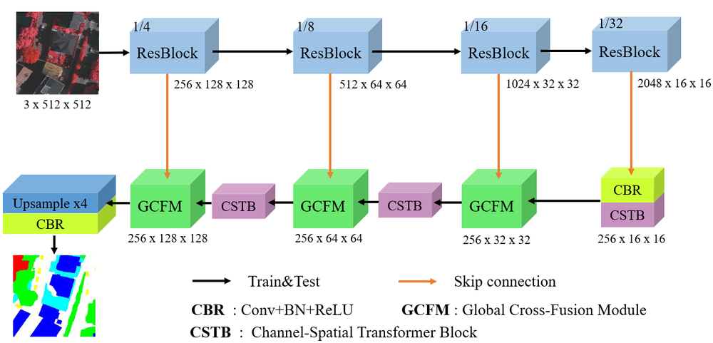
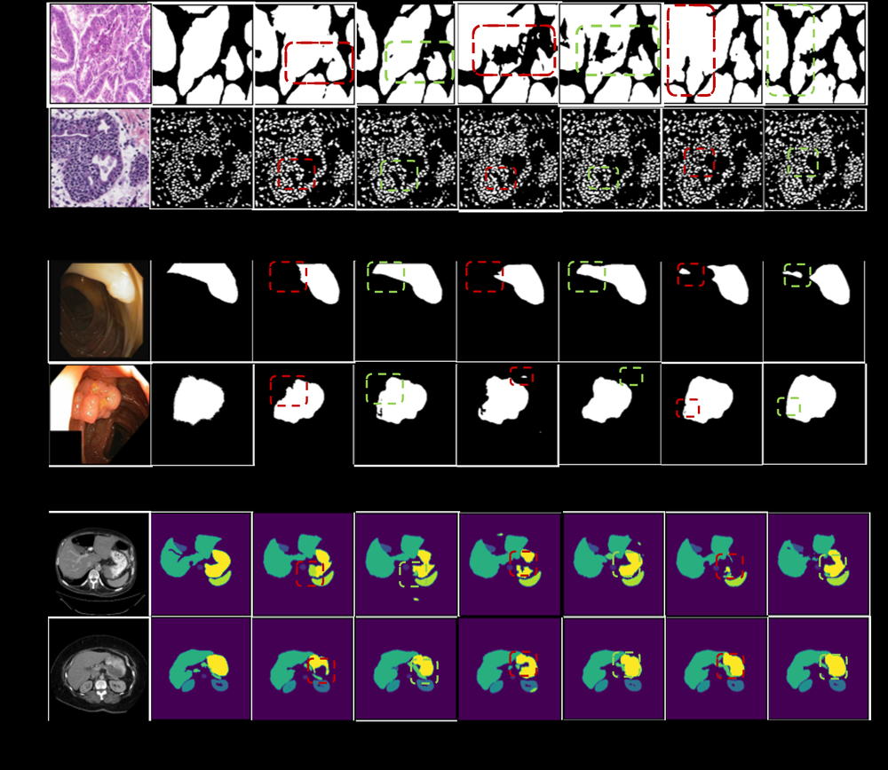

# Dual Cross-Attention for Medical Image Segmentation

**ArXiv ID**: 2303.17696v1
**URL**: http://arxiv.org/abs/2303.17696v1
**提交日期**: 2023-03-30
**作者**: Gorkem Can Ates; Prasoon Mohan; Emrah Celik
**引用次数**: NULL
使用模型: deepseek-v3-1-terminus

## 1. 核心思想总结
这是一份关于论文《Dual Cross-Attention for Medical Image Segmentation》的第一轮总结，按四个部分组织如下：

**1. Background (背景)**
基于U-Net的编码器-解码器架构是医学图像分割领域的主流方法。这类架构通常通过跳跃连接来融合编码器（提供细节信息）和解码器（提供语义信息）的特征，以恢复在编码过程中丢失的空间细节。

**2. Problem (问题)**
在标准的U-Net跳跃连接中，编码器和解码器之间的特征存在显著的“语义鸿沟”。编码器特征包含更多低层、细节信息，而解码器特征包含更多高层、语义信息，这种不匹配直接拼接融合的效果并非最优，限制了分割性能的进一步提升。

**3. Method (high-level) (方法 - 高层概述)**
本文提出了一种名为“双重交叉注意力”的模块，旨在增强跳跃连接。该模块的核心思想是：在将编码器特征传递给解码器之前，先对其进行精细化处理，以弥合语义鸿沟。DCA模块通过两个连续的步骤实现这一目标：
*   **通道交叉注意力**：首先，在多尺度编码器特征之间进行交叉注意力运算，以捕捉全局的通道间依赖关系。
*   **空间交叉注意力**：然后，再次利用交叉注意力来捕捉特征图之间的空间依赖关系。
经过DCA模块增强后的、更精细化的编码器特征再被上采样并与解码器特征连接。

**4. Contribution (贡献)**
*   提出了一个新颖的、即插即用的DCA模块，能够无缝集成到任何带有跳跃连接的U-Net类架构中。
*   通过系统的实验，将DCA集成到六种不同的U-Net变体模型中，并在五个公开的医学图像分割数据集上验证了其有效性，均取得了显著的Dice分数提升（最高达2.74%），证明了该方法的通用性和有效性。

## 2. 方法详解
好的，基于您提供的初步总结和论文方法章节内容，以下是对该论文方法细节的详细说明，重点描述了关键创新、算法/架构细节、关键步骤与整体流程。

### 论文方法细节详解

本文的核心方法是**双重交叉注意力（Dual Cross-Attention, DCA）模块**，其设计初衷是作为一个即插即用的组件，替换或增强标准U-Net架构中的跳跃连接，以解决编码器与解码器特征之间的“语义鸿沟”问题。

#### 一、 关键创新

DCA模块的核心创新在于其**双重、交叉的注意力机制**，它不同于传统的自注意力或简单的特征拼接/相加。其创新点可概括为：

1.  **双重性：** 模块依次执行两种不同维度的注意力计算——**通道交叉注意力** 和**空间交叉注意力**。这两种注意力分别从“特征通道间关系”和“空间位置间关系”两个互补的视角来精细化特征。
2.  **交叉性：** 两种注意力机制均采用**交叉注意力** 而非自注意力。这意味着，在计算注意力时，它使用**一组特征作为“查询”**，而使用**另一组不同但相关的特征作为“键”和“值”**。这种设计能更有效地挖掘不同层级特征间的互补信息，实现有针对性的特征增强。
3.  **即插即用：** DCA被设计为一个独立的模块，可以无缝集成到任何具有跳跃连接的编码器-解码器架构中（如U-Net, Attention U-Net, U-Net++等），无需改变主干网络结构，通用性强。

#### 二、 算法/架构细节

DCA模块的输入和输出如下：
*   **输入：** 来自编码器不同层级的多个特征图。假设有 \( L \) 个层级，则输入可表示为 \( \{X_l \in \mathbb{R}^{C_l \times H_l \times W_l} \}_{l=1}^L \)，其中 \( C_l, H_l, W_l \) 分别代表第 \( l \) 层的通道数、高度和宽度。
*   **输出：** 经过DCA模块精细化后的、与输入一一对应的增强特征图 \( \{ \hat{X}_l \} \)。

DCA模块的内部工作流程包含两个关键步骤，其整体架构与数据流如下图所示（概念图）：

```
      [编码器特征 X1, X2, ..., XL]
               |
               | (多尺度特征融合与下采样至同一分辨率)
               |
               V
    +-------------------------+
    | 通道交叉注意力 (CCA)模块   |
    |                         |
    | - Query: 某一层特征X_i    |
    | - Key/Value: 其他层特征  |
    | - 输出: 通道增强特征Y_i   |
    +-------------------------+
               |
               | (对每个层级i依次处理)
               |
               V
      [通道增强特征 Y1, Y2, ..., YL]
               |
               | (1x1卷积调整通道数)
               |
               V
    +-------------------------+
    | 空间交叉注意力 (SCA)模块   |
    |                         |
    | - Query: 某一层特征Y_i    |
    | - Key/Value: 相邻层特征  |
    | - 输出: 空间增强特征\hat{X}_i|
    +-------------------------+
               |
               | (对每个层级i依次处理)
               |
               V
      [最终增强特征 \hat{X}1, \hat{X}2, ..., \hat{X}L]
               |
               V
      [与解码器对应特征进行拼接/融合]
```

下面详细拆解两个核心子模块：

**1. 通道交叉注意力**

*   **目标：** 捕捉不同尺度特征间的**全局通道依赖关系**。例如，让浅层特征的某些通道（可能对应边缘）受到深层特征语义信息（可能对应器官类别）的调制。
*   **关键步骤：**
    1.  **分辨率对齐：** 由于不同层级的特征图空间尺寸不同，首先通过插值上采样或最大池化下采样，将所有层级的特征图统一到**中间某一层（如X2）的分辨率**。
    2.  **交叉注意力计算：** 对于每一个目标层级 \( i \) 的特征 \( X_i \)：
        *   **查询：** \( Q = f_{q}^{c}(X_i) \)，其中 \( f_{q}^{c} \) 是一个1x1卷积，用于生成查询向量。
        *   **键和值：** 将**所有其他层级** \( j \neq i \) 的特征 \( X_j \) 先拼接起来，然后分别通过两个不同的1x1卷积生成键和值：\( K = f_{k}^{c}(\text{Concat}({X_j}_{j \neq i})) \)，\( V = f_{v}^{c}(\text{Concat}({X_j}_{j \neq i})) \)。
        *   **注意力图计算：** 计算通道注意力图：\( A_c = \text{Softmax}(QK^T / \sqrt{d_k}) \)，其中 \( d_k \) 是键向量的维度。
        *   **输出：** 通道增强后的特征 \( Y_i = A_c V \)。
    3.  **循环处理：** 对每个层级 \( i \) 都重复步骤2，确保每个层级的特征都能从所有其他层级的特征中获取全局通道上下文信息。

**2. 空间交叉注意力**

*   **目标：** 在通道增强的基础上，进一步捕捉特征图内部的**长程空间依赖关系**。例如，让一个位置的像素点关注到语义上相关的远距离像素点。
*   **关键步骤：**
    1.  **特征准备：** 将通道交叉注意力输出的特征 \( \{Y_l\} \) 通过一个1x1卷积调整通道数，以减少计算量并准备用于空间注意力。得到 \( \{Z_l\} \)。
    2.  **交叉注意力计算：** 对于每一个目标层级 \( i \) 的特征 \( Z_i \)：
        *   **查询：** \( Q = f_{q}^{s}(Z_i) \)，并将特征图的空间维度展平。\( Q \in \mathbb{R}^{(H_i W_i) \times C} \)。
        *   **键和值：** 选择**相邻层级**的特征（如 \( Z_{i-1} \) 和 \( Z_{i+1} \)）进行拼接，然后分别通过两个1x1卷积生成键和值，同样展平空间维度。
        *   **注意力图计算：** 计算空间注意力图：\( A_s = \text{Softmax}(QK^T / \sqrt{d_k}) \)。
        *   **输出：** 空间增强后的特征 \( \hat{X}_i = A_s V \)，并将其重塑回原始空间尺寸。
    3.  **循环处理：** 对每个层级依次处理，利用其相邻层级的空间上下文来 refine 当前层级的特征空间结构。

#### 三、 关键步骤与整体流程

将DCA模块集成到标准U-Net中的整体工作流程如下：

1.  **编码器路径：** 输入医学图像经过编码器（如一系列卷积和下采样层），生成一组多尺度特征图 \( \{X_1, X_2, ..., X_L\} \)。
2.  **DCA模块处理（核心步骤）：** 编码器特征不直接通过跳跃连接传递，而是先送入DCA模块。
    *   **步骤A（CCA）：** 多尺度特征经过**通道交叉注意力**处理，获得在通道维度上富含全局语义信息的增强特征 \( \{Y_1, Y_2, ..., Y_L\} \)。
    *   **步骤B（SCA）：** 通道增强特征再经过**空间交叉注意力**处理，获得在空间维度上富含长程上下文关系的最终精细化特征 \( \{\hat{X}_1, \hat{X}_2, ..., \hat{X}_L\} \)。
3.  **解码器路径：** 解码器通过上采样逐步恢复空间分辨率。
    *   在每一个上采样步骤，解码器当前层的特征与**经过DCA模块增强后的、对应层级的编码器特征 \( \hat{X}_l \)** 进行拼接（Concatenation）。
4.  **预测：** 解码器最终输出分割概率图，再通过argmax等操作得到像素级的分割掩码。

**总结而言，DCA模块通过一个精心设计的、先通道后空间的双重交叉注意力流程，有效地弥合了编码器与解码器特征之间的语义鸿沟。它使传递给解码器的编码器特征不再是原始的、粗糙的细节信息，而是经过了全局语义和空间上下文信息精细化调制后的“优质”特征，从而显著提升了分割精度。**

## 3. 最终评述与分析
好的，结合前两轮提供的关于论文《Dual Cross-Attention for Medical Image Segmentation》的背景、问题、方法细节以及结论部分的信息，以下是最终的综合性评估。

---

### **关于《Dual Cross-Attention for Medical Image Segmentation》的最终综合评估**

#### 1) 整体摘要

本论文针对医学图像分割中主流的U-Net类架构存在的一个核心问题——编码器与解码器特征间的“语义鸿沟”——展开研究。作者创新性地提出了一个名为“双重交叉注意力”的即插即用模块，旨在替换或增强标准的跳跃连接。该模块通过**通道交叉注意力**和**空间交叉注意力**两个连续步骤，对编码器提取的多尺度特征进行精细化处理，使其在传递给解码器之前已融合了全局的语义信息和长程的空间上下文信息。通过在六个不同的U-Net变体模型和五个公开医学图像数据集上进行广泛实验，论文结果表明，集成DCA模块能一致且显著地提升模型的分割性能（Dice分数最高提升达2.74%），同时保持了模型的轻量化特性，证明了其有效性、通用性和实用性。

#### 2) 优势

*   **创新性强：** 提出的DCA模块构思巧妙，其“双重性”（通道、空间）和“交叉性”（利用不同层级/相邻层级的特征作为Key/Value）的设计，直击特征语义不匹配问题的核心，与简单的特征相加或自注意力相比，更具针对性和有效性。
*   **即插即用，通用性高：** DCA被设计为一个独立模块，可以无缝集成到任何具有跳跃连接的编码器-解码器架构中（如U-Net, Attention U-Net, U-Net++等），无需改变主干网络结构，展示了出色的通用性和易用性。
*   **实验充分，说服力强：** 论文在多个主流模型和多个公开数据集上进行了系统性验证，结果一致表明性能提升，强有力地支撑了其核心论点。消融实验也清晰地证明了模块中每个组件（CCA和SCA）的必要性。
*   **性能提升显著且高效：** 在带来显著Dice分数提升的同时，论文结论强调DCA模块是“轻量级”的，这意味着其增加的计算开销相对可控，在性能与效率之间取得了良好平衡，有利于实际部署。

#### 3) 劣势 / 局限性

*   **计算复杂度分析不足：** 尽管论文声称模块是轻量级的，但并未提供详细的FLOPs或参数量的对比数据，与基线模型相比的具体时间/空间开销增长幅度不够清晰。交叉注意力机制本身会引入一定的计算成本，在资源严格受限的环境下的适用性有待进一步评估。
*   **超参数与结构细节的敏感性未充分探讨：** 模块中的关键设计，如空间交叉注意力中选择“相邻层级”的具体策略、统一分辨率时参考层的选择等，这些选择的敏感性及其对最终性能的影响未进行深入讨论，可能影响其鲁棒性和复现性。
*   **缺乏更广泛的泛化性验证：** 实验主要集中在2D医学图像分割任务上。对于3D医学图像体积数据，DCA模块的扩展性、有效性和计算效率如何，尚未可知。此外，在非医学图像分割领域的泛化能力也有待验证。
*   **与最先进方法的对比深度可能有限：** 虽然与多个U-Net变体进行了比较，但论文结论部分未明确提及与当时领域内其他类型的顶尖分割模型（如基于Transformer的模型或更复杂的混合架构）进行对比，其竞争优势的全面性略显不足。

#### 4) 潜在应用 / 意义

*   **医学图像分析领域的直接应用：** 该方法可立即应用于各种医学图像分割任务，如器官分割（眼底血管、皮肤病变、器官）、肿瘤分割等，有助于提高计算机辅助诊断的准确性和可靠性。其即插即用的特性使得现有模型可以低成本地升级。
*   **推动U-Net架构的演进：** DCA模块为解决U-Net类模型固有的“语义鸿沟”问题提供了一个新颖且有效的思路，可以视为对经典跳跃连接机制的一次重要改进，为后续研究者设计更高效的特征融合机制提供了有价值的参考。
*   **对注意力机制应用的启发：** 该工作展示了“交叉注意力”在融合多源、多尺度特征方面的潜力，不仅限于医学图像，对于其他需要融合不同层次特征的计算机视觉任务（如图像超分辨率、图像去噪、遥感图像分析等）也具有启发意义。
*   **临床与工业应用的潜力：** 由于其在提升精度的同时保持了轻量级特性，DCA模块有潜力被集成到一些对实时性有一定要求的临床辅助系统或嵌入式医疗设备中，提升其分割性能，从而产生实际的临床价值。


---

# 附录：论文图片

## 图 1


## 图 2


## 图 3


