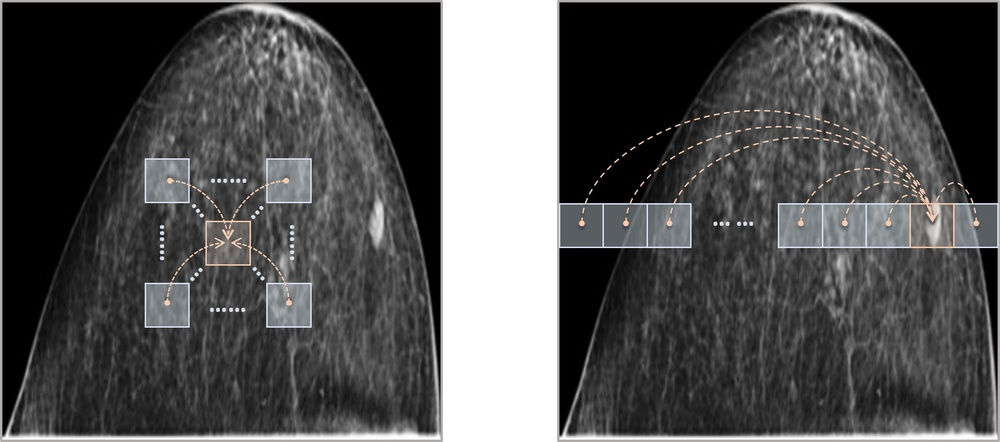
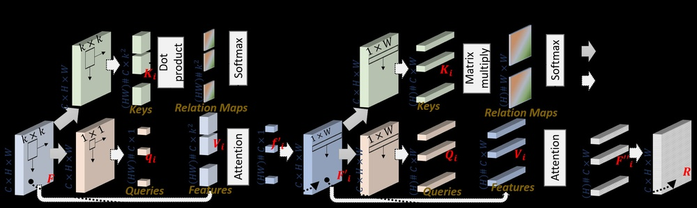
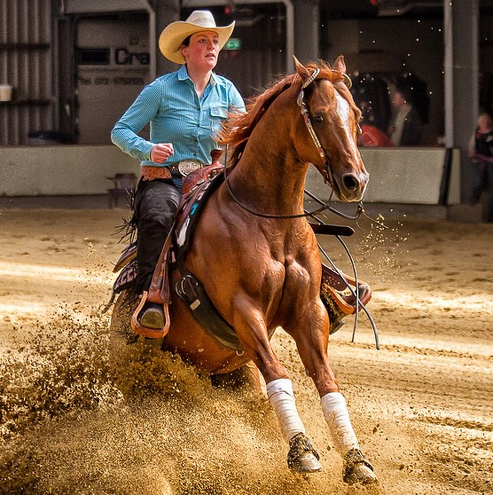
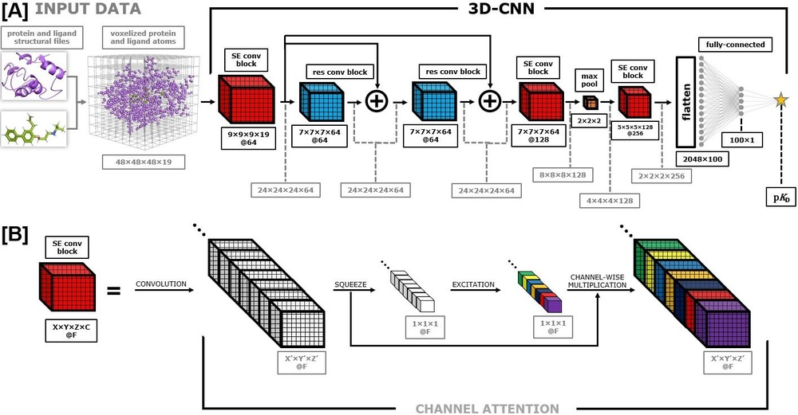

# Dual-view Correlation Hybrid Attention Network for Robust Holistic Mammogram Classification

**URL**: https://www.semanticscholar.org/paper/60d375a1cae56997ab85d171cbbb00d85d14cbba
**提交日期**: 2023-06-19
**作者**: Zhiwei Wang; Junlin Xian; Kangyi Liu; Xin Li; Qiang Li; Xin Yang
**引用次数**: 8
使用模型: deepseek-v3-1-terminus

## 1. 核心思想总结
好的，这是一份根据您提供的论文标题和摘要整理的第一轮总结。

**论文标题：** Dual-view Correlation Hybrid Attention Network for Robust Holistic Mammogram Classification

**简洁总结：**

*   **背景 (Background):** 乳腺X光影像（ mammogram ）是乳腺癌筛查的重要手段，通常以双视图（头尾位CC和内外斜位MLO）形式获取，以为临床决策提供互补信息。
*   **问题 (Problem):** 现有方法大多独立学习CC和MLO两个视图的特征，这违背了临床知识，忽略了双视图间相关性在特征学习中的重要性。
*   **方法 (Method - high-level):** 本文提出了一种双视图相关性混合注意力网络（DCHA-Net）。该网络的核心是设计了一个混合注意力模块（包含局部关系和非局部注意力块）来缓解双视图空间不对齐的问题，并引入了一种双视图相关性损失函数，旨在最大化两个视图中对应条状区域（与胸壁等距）之间的特征相似性。
*   **贡献 (Contribution):** 实验结果表明，DCHA-Net能够有效保持和最大化跨视图的特征相关性，在公开数据集INbreast和CBIS-DDSM上，其整体乳腺X光影像良恶性分类性能优于已有的先进方法。

## 2. 方法详解
好的，基于您提供的初步总结和论文方法章节的内容，以下是对该论文方法细节的详细说明。

### **论文方法详解：双视图相关性混合注意力网络（DCHA-Net）**

本方法的整体目标是解决全乳腺X光影像分类中，如何有效利用CC和MLO双视图间互补且相关的信息。其核心思想是**模拟放射科医生的阅片流程**，即同时观察、对比两个视图，寻找对应区域的关联性以做出诊断。DCHA-Net通过一个精心设计的网络架构和损失函数来实现这一目标。

#### **一、 整体流程与架构概述**

DCHA-Net的整体流程可以概括为以下四个关键步骤：

1.  **特征提取：** 分别使用一个共享权重的卷积神经网络（如ResNet）作为主干网络，从输入的CC视图和MLO视图中提取高级特征图。
2.  **双视图特征交互与增强：** 将两个视图的特征图输入到**混合注意力模块（Hybrid Attention Module, HAM）** 中。该模块是本文的关键创新，旨在解决双视图空间不对齐问题，并增强特征表示。
3.  **双视图相关性学习：** 在混合注意力模块之后，引入**双视图相关性损失函数（Dual-view Correlation Loss）**。该损失函数强制网络学习两个视图中对应解剖区域（条状区域）的特征之间的相似性。
4.  **分类决策：** 将经过HAM增强后的两个视图的特征图进行融合（例如拼接），然后通过全连接层进行最终的良恶性分类。

整个网络的架构如下图所示（此处为文字描述，可想象其结构）：
`[CC视图图像] -> [共享权重CNN] -> [特征图A] --\`  
`                                                      --> [混合注意力模块HAM] --> [相关性损失] --> [特征融合与分类]`  
`[MLO视图图像] -> [共享权重CNN] -> [特征图B] --/`

---

#### **二、 关键创新与核心模块细节**

##### **创新一：混合注意力模块（Hybrid Attention Module, HAM）**

**要解决的问题：** 由于拍摄角度和乳房受压变形，CC和MLO视图之间存在严重的**空间不对齐**。直接融合两个视图的特征是次优的。

**解决方案：** HAM结合了局部关系和非局部注意力机制，以自适应地校准和增强双视图特征。

1.  **局部关系注意力块（Local Relation Attention Block, LRA）：**
    *   **目标：** 捕捉图像局部区域内的细微结构和纹理特征。这对于发现微钙化簇等细小病灶至关重要。
    *   **实现细节：**
        *   该块基于“局部关系”思想，即一个像素点的特征应由其邻近像素点的特征加权聚合而来。
        *   与传统卷积使用固定权重不同，LRA中的权重是**自适应生成**的。它通过计算特征图中每个位置与其局部邻域内其他位置的**特征相似性**（例如点积或余弦相似度）来生成注意力权重。
        *   公式简化表示：`输出特征(i) = Σ_{j∈邻域(i)} [相似度(特征(i), 特征(j)) * 特征(j)]`
        *   这样，网络可以更灵活地聚焦于与当前像素点语义上相关的局部上下文，增强了特征对局部细节的刻画能力。

2.  **非局部注意力块（Non-local Attention Block, NLA）：**
    *   **目标：** 捕捉整个特征图范围内的长程依赖关系。这对于理解大规模肿块的整体形态和与周围组织的关系非常重要。
    *   **实现细节：**
        *   该块借鉴了经典的非局部神经网络思想，允许特征图中的任何一个位置与其他所有位置进行交互。
        *   具体操作是：将输入特征图通过三个不同的1x1卷积层，生成Query（Q）、Key（K）和Value（V）三个矩阵。
        *   通过计算Q和K的矩阵乘法，得到一个全局的注意力图（Attention Map），该图表示了所有位置之间的关联强度。
        *   然后将这个注意力图与V相乘，得到最终的输出。公式为：`输出 = Softmax(Q * K^T) * V`
        *   这样，即使病灶在两个视图中的位置相差很远，NLA也能帮助建立它们之间的关联。

**HAM的工作流程：** 输入的两个视图的特征图会**并行地**分别通过LRA和NLA两个支路。每个支路的输出都经过了特征增强。最后，将两个支路的输出特征图进行**相加或拼接融合**，得到经过HAM增强后的最终特征图。这个过程分别应用于CC和MLO的特征图。

##### **创新二：双视图相关性损失函数（Dual-view Correlation Loss）**

**要解决的问题：** 如何显式地引导网络学习CC和MLO视图之间的内在解剖相关性，而不是仅仅独立学习特征。

**解决方案：** 设计一个专门的损失函数，直接最大化两个视图中对应区域的特征相似性。

*   **关键概念：条状区域（Strip-like Regions）：**
    *   受临床知识启发（如胸壁是固定的参考点），论文假设：在CC和MLO视图中，**与胸壁等距的条状区域**可能包含相同的解剖组织。
    *   因此，网络将每个视图的特征图在空间上划分成若干个连续的条状区域（例如，沿着从胸壁到乳头的方向）。

*   **损失函数计算步骤：**
    1.  **区域划分：** 将HAM输出的CC视图特征图和MLO视图特征图，分别沿特定方向（如高度维度）平均划分为N个条带（Strip），得到 `{S_cc^1, S_cc^2, ..., S_cc^N}` 和 `{S_mlo^1, S_mlo^2, ..., S_mlo^N}`。
    2.  **特征聚合：** 对每个条带内的所有空间位置的特征进行全局平均池化（GAP），得到每个条带的代表向量，即一个一维特征 `v_cc^i` 和 `v_mlo^i`。
    3.  **计算相似性：** 计算第i个条带在CC和MLO视图中的代表向量之间的余弦相似度：`sim(i) = cosine_similarity(v_cc^i, v_mlo^i)`。
    4.  **构建损失：** 双视图相关性损失的目标是**最大化对应条带间的相似性**。因此，损失函数被定义为最小化这些相似度的负值或使用对比学习的思想。一个简单的形式是：
        `L_correlation = - (1/N) * Σ_{i=1 to N} sim(i)`
        这意味着，在训练过程中，通过反向传播，网络参数会被调整，以使得 `v_cc^i` 和 `v_mlo^i` 越来越相似。

*   **最终的总损失函数：**
    最终的训练目标由两部分组成：主任务的分类损失和辅助的相关性损失。
    `L_total = L_classification + λ * L_correlation`
    其中，`L_classification` 是标准的交叉熵损失函数，用于良恶性分类；`λ` 是一个超参数，用于平衡两项损失的贡献。

### **总结**

DCHA-Net方法的精髓在于其**端到端地整合了特征增强和相关性学习**。

*   **混合注意力模块（HAM）** 作为“特征增强器”，从局部和全局两个尺度精炼特征表示，为解决空间不对齐提供了基础。
*   **双视图相关性损失函数** 作为“学习指导器”，从损失函数层面直接施加约束，迫使网络在提取特征时必须有意识地建立和维护两个视图间的解剖对应关系。

这两大创新点相辅相成，共同确保了网络能够学习到既具有判别性又符合临床双视图相关性的强大特征，从而实现了鲁棒且准确的全乳腺X光影像分类。

## 3. 最终评述与分析
好的，基于前两轮关于论文《Dual-view Correlation Hybrid Attention Network for Robust Holistic Mammogram Classification》的方法细节与初步总结，并结合其结论部分，现提供最终的综合评估如下：

### **最终综合评估**

#### 1) 整体总结

本论文针对全乳腺X光影像的良恶性分类任务，提出了一种新颖的双视图相关性混合注意力网络（DCHA-Net）。该研究的核心出发点是解决现有深度学习模型通常独立处理头尾位（CC）和内外斜位（MLO）视图，而忽略了二者间固有解剖相关性的问题。DCHA-Net通过两大核心创新点来模拟放射科医生的对比阅片流程：**一是**设计了混合注意力模块（HAM），结合局部与非局部注意力机制，以缓解双视图空间不对齐问题并增强特征表示；**二是**引入了双视图相关性损失函数，显式地引导网络学习两个视图中对应解剖区域（条状区域）的特征相似性。在公开数据集INbreast和CBIS-DDSM上的实验结果表明，该方法在分类性能上超越了多种先进方法，验证了其有效性。论文结论强调了该方法在提升乳腺癌计算机辅助诊断（CAD）性能方面的潜力。

#### 2) 优势

*   **贴合临床先验：** 该方法的核心思想直接借鉴了放射科医生的实际诊断流程，即同时观察并对比CC和MLO视图以寻找一致性或互补性证据，这使得模型的设计具有坚实的临床基础。
*   **创新性的架构设计：** 混合注意力模块（HAM）的设计巧妙，通过局部关系注意力块（LRA）捕捉细微结构（如微钙化），通过非局部注意力块（NLA）捕捉长程依赖（如肿块形态），共同应对了双视图分析中最具挑战性的空间不对齐问题。
*   **有效的相关性约束：** 双视图相关性损失函数是一个重要的机制创新。它不是在特征融合阶段进行简单拼接，而是在特征学习过程中直接施加约束，迫使网络从底层就开始关注并建立跨视图的解剖对应关系，从而学习到更具判别力和鲁棒性的特征。
*   **充分的实验验证：** 论文在多个公开数据集上进行了验证，并与其他先进方法进行了比较，结果一致表明DCHA-Net的优越性，增强了结论的可信度。消融实验也有效地证明了HAM和相关性损失函数各自的价值。

#### 3) 局限性与不足

*   **条状区域划分的假设可能过于简化：** 该方法的核心假设是“与胸壁等距的条状区域包含相同解剖组织”。虽然这符合基本解剖常识，但乳房作为一个三维器官在二维投影下的变形是复杂的，这种均匀划分可能无法精确匹配所有病例中真实的、非线性的组织对应关系。
*   **对数据质量和对齐的潜在依赖：** 尽管HAM旨在解决不对齐问题，但其效果可能仍在一定程度上依赖于预处理（如图像裁剪、胸壁检测）的准确性。如果预处理步骤引入较大误差，可能会影响后续相关性学习的效果。
*   **泛化能力需进一步验证：** 实验仅在两个公开数据集上进行。虽然结果积极，但其在不同来源、不同设备、不同人群的更大规模和多中心数据集上的泛化能力，仍有待未来研究的检验。
*   **计算复杂度：** 引入HAM模块，特别是其中的非局部注意力操作，可能会增加模型的计算开销和训练时间，在应用于大规模筛查或资源受限的环境时需要权衡性能与效率。

#### 4) 潜在应用与启示

*   **临床辅助诊断：** 该方法可直接应用于乳腺癌筛查的CAD系统，作为“第二双眼睛”辅助放射科医生提高诊断的准确性和一致性，特别是在减少假阴性（漏诊）方面具有重要价值。
*   **医学影像分析范式推广：** 本方法所提出的“双视图相关性学习”框架具有广泛的启示意义。它可以被借鉴到其他同样依赖多视图、多序列或多时间点影像进行诊断的领域，例如肺部CT（冠状面、矢状面、横断面）、脑部MRI（T1, T2, DWI等序列）的联合分析。
*   **可解释性研究的起点：** 通过分析HAM产生的注意力图以及不同条带的相关性强度，有可能为医生提供模型决策的线索，揭示模型在哪些区域、哪些特征上进行了重点比对，从而增强模型的可解释性，推动可信AI在医疗领域的发展。
*   **未来研究方向：** 本工作的局限性也为未来研究指明了方向，例如：探索更精细、可学习的非刚性区域对应关系而非固定条带；将方法扩展到三维乳腺断层摄影（DBT）的多切片分析；以及研究如何进一步降低模型复杂度以利于临床部署。

---

# 附录：论文图片

## 图 1

## 图 2

## 图 3

## 图 4

## 图 5

## 图 6

## 图 7

## 图 8

## 图 9

## 图 10

