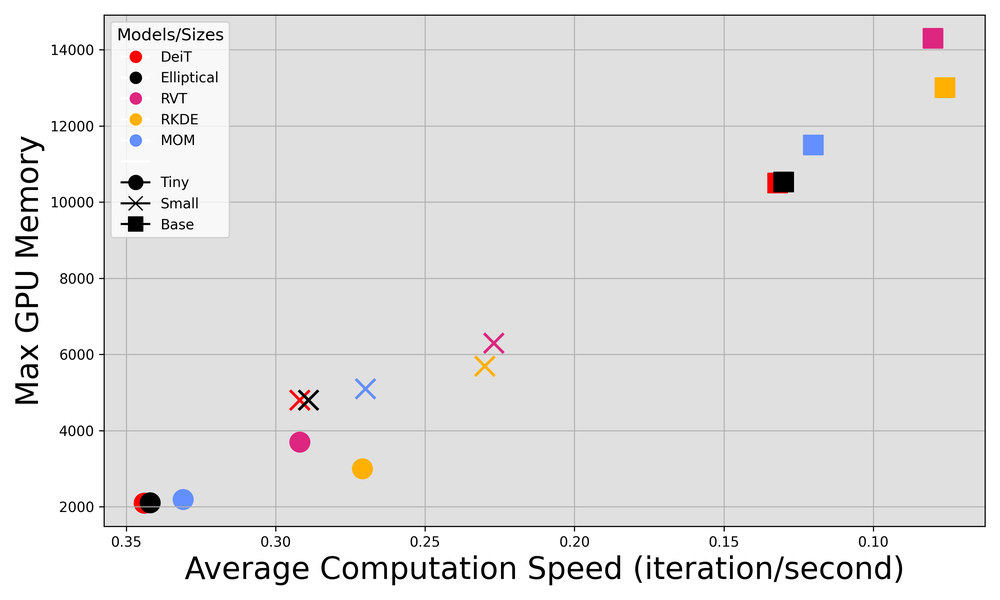
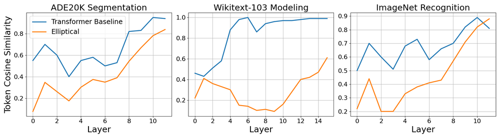
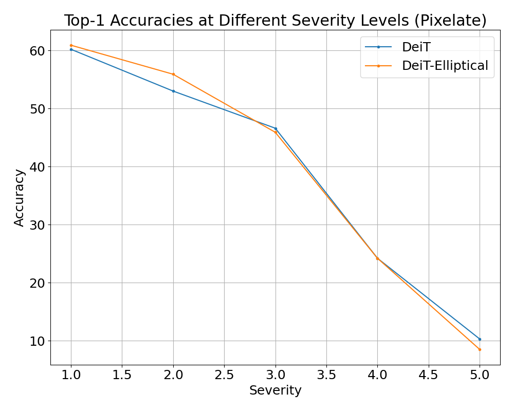
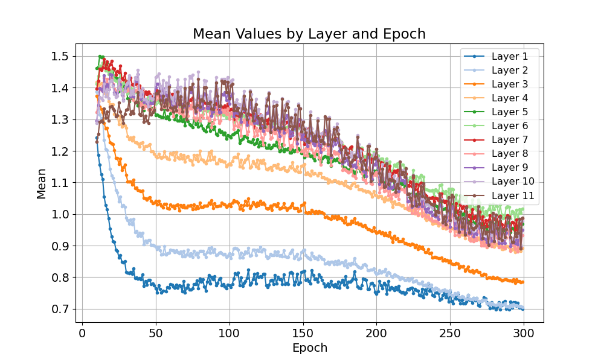
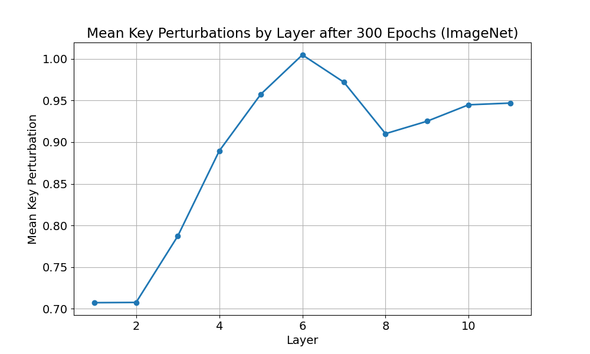

# Elliptical Attention

**ArXiv ID**: 2406.13770v2
**URL**: http://arxiv.org/abs/2406.13770v2
**提交日期**: 2024-06-19
**作者**: Stefan K. Nielsen; Laziz U. Abdullaev; Rachel S. Y. Teo; Tan M. Nguyen
**引用次数**: NULL
使用模型: deepseek-v3-1-terminus

## 1. 核心思想总结
这是一份关于论文《Elliptical Attention》的第一轮总结，按四个部分组织。

**标题：** Elliptical Attention

**1. Background (背景)**
基于点积的自注意力机制是Transformer架构的核心，该架构在语言和视觉等多个领域取得了最先进的性能。标准的点积自注意力使用欧氏距离来计算输入标记之间的注意力权重。

**2. Problem (问题)**
使用欧氏距离计算注意力存在两个主要问题：1) 模型容易发生表示崩溃，即不同特征的表示趋于相似；2) 模型对受污染的样本（如噪声或对抗样本）的鲁棒性较差。这主要是因为欧氏距离对所有方向一视同仁，未能突出上下文信息中更重要的特征方向。

**3. Method (high-level) (方法 - 高层概述)**
本文提出了一种名为“椭圆注意力”的新型注意力机制。其核心思想是使用马哈拉诺比斯距离替代标准的欧氏距离来计算注意力权重。该方法为每个查询定义了一个超椭球形的邻域，从而沿着上下文相关度高的方向拉伸特征空间。这使得位于上下文重要方向上的标记能获得更高的注意力权重。

**4. Contribution (贡献)**
本文的主要贡献包括：
1.  **提出新方法：** 引入了“椭圆注意力”这一新类别的注意力机制。
2.  **理论优势：** 该方法理论上能缓解表示崩溃问题，并通过聚焦于上下文相关信息来增强模型的鲁棒性。
3.  **实证验证：** 在物体分类、图像分割和语言建模等多个实际任务和不同数据模态上，通过实验证明了椭圆注意力优于标准的点积注意力及其他先进注意力方法。

## 2. 方法详解
好的，基于您提供的初步总结和论文方法章节内容，以下是对论文《Elliptical Attention》方法细节的详细说明，重点描述了关键创新、算法/架构细节、关键步骤与整体流程。

### 论文方法细节详解

#### 一、 关键创新与核心思想

论文最核心的创新点是**使用马哈拉诺比斯距离替代标准点积注意力中的欧氏距离**，从而将各向同性的“球形”注意力区域转变为各向异性的“椭圆形”注意力区域。

*   **从“球形”到“椭圆形”**：在标准注意力中，一个查询（Query）与所有键（Key）的相似度计算可以视为以一个查询点为中心，在特征空间中画一个“球体”。球体在所有方向上的半径（即相似度衰减速度）是相同的。这意味着模型对所有特征维度的重要性一视同仁。
*   **上下文感知的拉伸**：椭圆注意力的核心思想是，根据当前的上下文（即输入序列本身），动态地“拉伸”或“压缩”这个球体，使其变成一个“超椭球体”。在信息更重要的特征方向上，椭球体被拉长，使得位于这些方向上的键（即使与查询的绝对欧氏距离较远）也能获得较高的注意力权重；在不重要的方向上，椭球体被压缩，使得这些方向上的微小差异也会被放大，从而降低其权重。

#### 二、 算法/架构细节

##### 1. 标准点积注意力（回顾）

首先，我们回顾标准的多头点积注意力（MHA）的计算流程，以明确被改进的环节。对于输入序列 \( X \in \mathbb{R}^{n \times d} \)（n个标记，每个标记d维），经过线性投影得到 Query、Key、Value 矩阵：
\[ Q = XW^Q, \quad K = XW^K, \quad V = XW^V \]
注意力权重 \( A \) 和输出 \( O \) 的计算为：
\[ A = \text{softmax}\left(\frac{QK^T}{\sqrt{d_k}}\right) \]
\[ O = AV \]
其中，\( \frac{QK^T}{\sqrt{d_k}} \) 本质上是计算所有查询-键对的**缩放点积**，它与欧氏距离的平方密切相关（在向量归一化后）。

##### 2. 椭圆注意力的算法推导

椭圆注意力的修改集中在注意力权重的计算上，即用马哈拉诺比斯距离取代点积。

**a) 马哈拉诺比斯距离的定义**
两个向量 \( q \)（查询）和 \( k \)（键）之间的马哈拉诺比斯距离为：
\[ D_M(q, k) = \sqrt{(q - k)^T \Sigma^{-1} (q - k)} \]
其中，\( \Sigma \) 是一个协方差矩阵，它定义了特征空间中的一种度量方式。\( \Sigma^{-1} \) 的逆起到了“拉伸”空间的作用。其 eigenvectors 指向椭球的主轴方向，eigenvalues 决定了沿这些方向的拉伸/压缩程度。

**b) 关键挑战与解决方案：如何获得 \( \Sigma \)？**
在自注意力的上下文中，没有外部的协方差矩阵。论文的创新之处在于**从当前的键矩阵 \( K \) 中在线地、动态地估计出这个协方差矩阵**。

*   **估计协方差矩阵**：将 \( K \in \mathbb{R}^{n \times d_k} \) 视为一组样本，为其计算一个经验协方差矩阵 \( \hat{\Sigma}_K \)：
    \[ \hat{\Sigma}_K = \frac{1}{n-1} (K - \bar{K})^T (K - \bar{K}) \]
    其中 \( \bar{K} \) 是 \( K \) 的均值向量。为了处理数值稳定性和确保矩阵可逆，论文加入了正则化项。

*   **正则化与可逆性**：直接使用 \( \hat{\Sigma}_K \) 可能因为特征共线性或维度过高而奇异（不可逆）。因此，论文采用 **Tikhonov 正则化（或岭回归正则化）**，使用如下矩阵代替 \( \hat{\Sigma}_K^{-1} \)：
    \[ (\hat{\Sigma}_K + \lambda I)^{-1} \]
    其中 \( \lambda \) 是一个小的正数（如 1e-6），\( I \) 是单位矩阵。这确保了矩阵是正定且可逆的。

**c) 椭圆注意力的最终计算公式**
将马哈拉诺比斯距离代入注意力机制，我们需要的是一个相似度度量而非距离（距离越大，相似度应越小）。因此，论文使用马哈拉诺比斯距离的平方的负数来作为“得分”。对于单个查询向量 \( q_i \)（Q 的第 i 行）和所有键矩阵 \( K \)，其非归一化的注意力得分 \( e_i \) 计算如下：
\[ e_i = - \frac{1}{2} (q_i \cdot \mathbf{1}^T - K) (\hat{\Sigma}_K + \lambda I)^{-1} (q_i \cdot \mathbf{1}^T - K)^T \]
这里 \( q_i \cdot \mathbf{1}^T \) 将 \( q_i \) 扩展成一个每行都是 \( q_i \) 的 \( n \times d_k \) 矩阵，以便与 \( K \) 进行逐元素运算。\( (q_i \cdot \mathbf{1}^T - K) \) 计算了 \( q_i \) 与每一个键的差值向量。

然后，与标准注意力一样，应用 softmax 进行归一化：
\[ A_i = \text{softmax}(e_i) \]
最后，输出是注意力权重与 Value 矩阵的加权和：
\[ o_i = A_i V \]

#### 三、 关键步骤与整体流程

将椭圆注意力整合进 Transformer 模块的整体流程可以概括为以下步骤：

1.  **输入与线性投影**：对于给定的输入序列 \( X \)，通过线性变换生成 Query (\( Q \))， Key (\( K \))， Value (\( V \)) 矩阵。这一步与标准 Transformer 完全相同。

2.  **上下文协方差矩阵估计**：从当前序列的 Key 矩阵 \( K \) 出发，计算其经验协方差矩阵 \( \hat{\Sigma}_K \)。

3.  **正则化**：对经验协方差矩阵进行正则化，得到稳定且可逆的矩阵 \( (\hat{\Sigma}_K + \lambda I)^{-1} \)。**这是实现椭圆注意力的关键预备步骤。**

4.  **椭圆注意力得分计算**：对于每一个查询向量 \( q_i \) 在 \( Q \) 中：
    *   计算 \( q_i \) 与所有键的差值矩阵。
    *   利用马哈拉诺比斯距离公式计算得分向量 \( e_i \)：
        \[ e_i = - \frac{1}{2} (q_i \cdot \mathbf{1}^T - K) (\hat{\Sigma}_K + \lambda I)^{-1} (q_i \cdot \mathbf{1}^T - K)^T \]
    *   对该得分向量应用 softmax 归一化，得到注意力权重 \( A_i \)。

5.  **加权求和与输出**：使用得到的注意力权重 \( A_i \) 对 Value 矩阵 \( V \) 进行加权求和，得到该查询对应的输出向量 \( o_i \)。将所有 \( o_i \) 组合成输出矩阵 \( O \)。

6.  **后续处理**：输出矩阵 \( O \) 随后会经过一个输出投影层、残差连接和层归一化，与标准 Transformer 架构一致。

#### 四、 总结

| 方面 | 标准点积注意力 | 椭圆注意力 | 优势 |
| :--- | :--- | :--- | :--- |
| **几何解释** | 球形邻域 | 椭球体邻域 | 各向异性，能适应上下文 |
| **核心度量** | 欧氏距离（缩放点积） | 马哈拉诺比斯距离 | 考虑了特征的相关性和重要性 |
| **协方差矩阵** | 无（隐含为单位矩阵） | 从当前序列的 Key 中动态估计 | 使模型能够学习到哪些特征方向对当前任务更重要 |
| **效果** | 对所有特征方向平等对待 | 沿重要方向拉伸，沿不重要方向压缩 | **理论上**：缓解表示崩溃，增强对噪声的鲁棒性。 **实证上**：在多种任务中表现优于基线。 |

简而言之，椭圆注意力通过引入一个**数据驱动、动态计算的上下文度量张量**，赋予了模型在计算注意力时“察言观色”的能力，使其能够聚焦于与当前上下文最相关的特征，从而提升了模型的表达能力和鲁棒性。

## 3. 最终评述与分析
好的，结合前两轮提供的关于论文《Elliptical Attention》的背景、问题、方法细节以及结论部分的信息，现给出最终的综合评估如下：

### 关于论文《Elliptical Attention》的最终综合评估

#### 1) 整体摘要

本论文针对Transformer核心组件——自注意力机制中基于欧氏距离的点积运算所固有的局限性，提出了一种名为“椭圆注意力”的创新性替代方案。该方法的核心理念是将各向同性的“球形”注意力区域转变为各向异性的“椭圆形”区域，这是通过使用马哈拉诺比斯距离替代欧氏距离来实现的。椭圆注意力能够根据输入序列的上下文动态地调整特征空间中的度量标准，从而在信息更重要的方向上拉伸注意力范围，在不重要的方向上则进行压缩。理论分析和广泛的实验验证表明，该方法能有效缓解表示崩溃问题，并显著提升模型对噪声和对抗样本的鲁棒性。在图像分类、语义分割和语言建模等多种任务上的实验结果表明，椭圆注意力在性能上稳定地优于标准的点积注意力及其他一些先进的注意力变体。

#### 2) 优势

*   **根本性创新**：论文的出发点具有理论深度，不是简单的启发式修改，而是从度量学习的角度对注意力机制的基础进行了重塑，将“球形”注意力推广到更通用的“椭圆”形式，这是一个概念上的重要贡献。
*   **理论依据扎实**：提出的方法有清晰的理论动机（解决表示崩溃和提升鲁棒性）和几何解释（各向异性的椭球体邻域），使其创新点不仅停留在实验层面，更有坚实的理论基础。
*   **有效性与通用性**：实验设计全面，涵盖了计算机视觉（图像分类、分割）和自然语言处理（语言建模）等多个重要领域和不同数据模态，证明了椭圆注意力的有效性和普遍适用性，并非仅限于特定任务。
*   **实现相对简洁**：尽管引入了协方差矩阵估计，但算法核心修改集中在注意力得分计算部分，无需改变Transformer的整体架构，具有良好的可集成性。采用的Tikhonov正则化也有效解决了协方差矩阵估计中的数值稳定性问题。
*   **性能提升显著**：论文结论显示，椭圆注意力在多个基准测试中均取得了优于基线方法的结果，特别是在鲁棒性测试中表现突出，验证了其核心主张。

#### 3) 劣势 / 局限性

*   **计算复杂度和开销**：椭圆注意力的主要局限性在于其增加的计算成本。在线计算并求逆协方差矩阵 \( (\hat{\Sigma}_K + \lambda I)^{-1} \) 的操作，其时间复杂度为 \( O(d_k^3) \) 或至少是 \( O(n d_k^2) \)（取决于实现方式），这对于大规模模型（\( d_k \) 很大）或长序列（\( n \) 很大）会带来显著的计算和内存开销，可能影响其训练和推理效率。
*   **参数与超参数**：虽然论文强调了方法的有效性，但引入的正则化系数 \( \lambda \) 等超参数可能需要针对不同任务或模型规模进行调整，增加了调优的复杂性。与标准注意力相比，该方法没有引入额外的可学习参数，其能力完全依赖于动态估计的统计量，这在某些情况下可能限制了其表达能力。
*   **理论理解的深度**：尽管提供了几何解释，但马哈拉诺比斯距离在深度网络中的具体行为（例如，在不同网络层中估计出的协方差矩阵如何影响注意力模式）可能需要更深入的理论分析来完全阐明。
*   **大规模基准测试的缺失**：从提供的信息看，实验虽然覆盖了多模态任务，但可能未在超大规模数据集（如ImageNet）或超大型语言模型（如拥有数百亿参数的模型）上进行验证。其计算开销在极限场景下的可扩展性仍需进一步评估。

#### 4) 潜在应用 / 意义

*   **对基础模型的增强**：椭圆注意力为构建更鲁棒、更高效的Transformer模型提供了一个有前景的新基础模块。它尤其适用于对安全性和可靠性要求高的场景，如自动驾驶（视觉感知）、医疗影像分析、金融风控等，其中模型的抗干扰能力至关重要。
*   **缓解表示崩溃**：该方法为缓解深度网络中常见的表示退化或崩溃问题提供了一个新的思路，不仅可用于自注意力，其思想也可能启发其他存在类似问题的网络结构的设计。
*   **推动注意力机制研究**：本工作将度量学习的先进思想引入注意力机制，拓宽了该领域的研究视野，可能会激发后续研究探索其他更高效或更强大的距离/相似度度量方式。
*   **特定领域的应用潜力**：在需要模型对特征关系有精细把握的任务中，如细粒度图像分类、基于关系的推理、知识图谱补全等，椭圆注意力基于上下文动态调整特征重要性的能力可能带来显著优势。

**总结**：《Elliptical Attention》是一篇具有重要理论价值和实践意义的论文。它通过一个优雅而有力的想法对自注意力机制进行了基础性改进，并在实验中证明了其优越性。尽管存在计算复杂度方面的挑战，但它为未来研究指明了提升Transformer模型鲁棒性和表达能力的一个富有潜力的方向。

---

# 附录：论文图片

## 图 1

## 图 2

## 图 3

## 图 4

## 图 5

## 图 6

## 图 7

## 图 8

## 图 9

