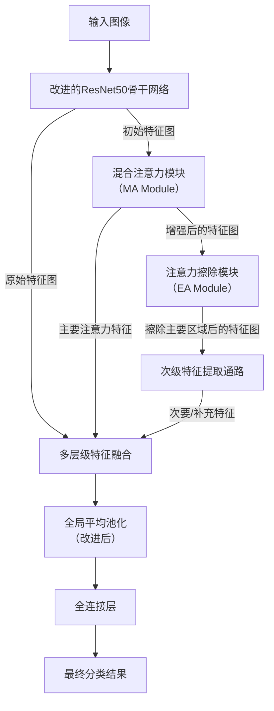
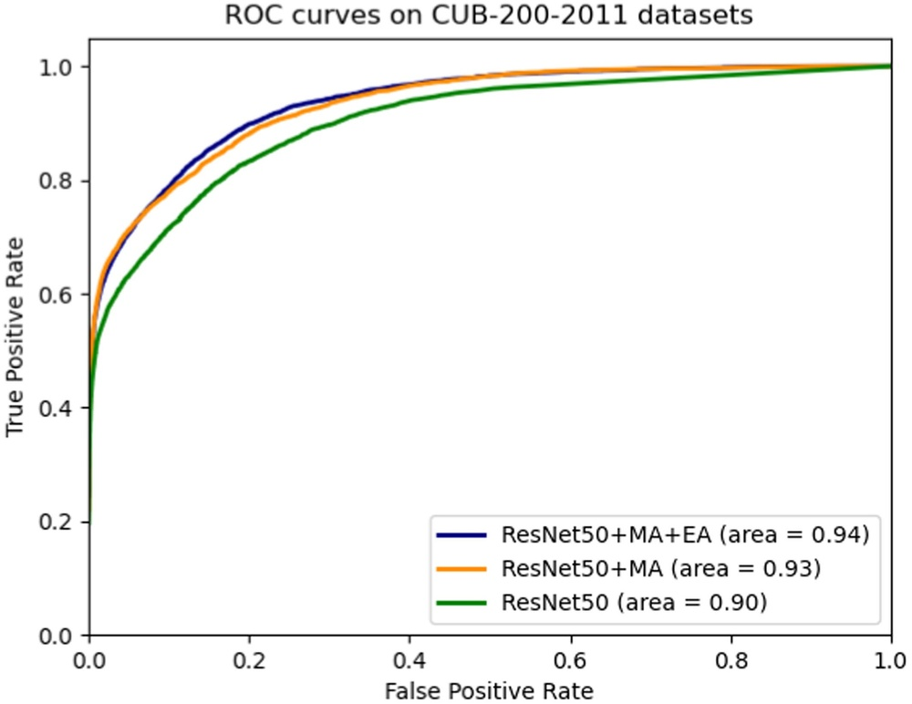
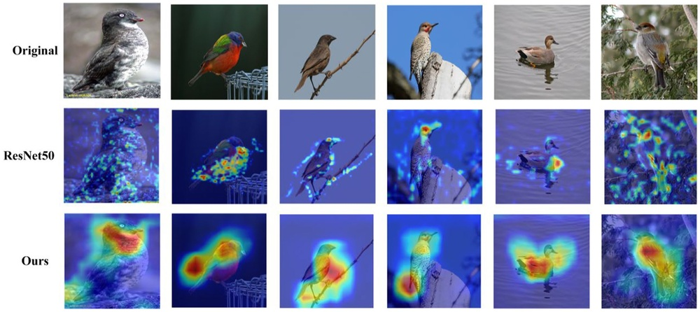
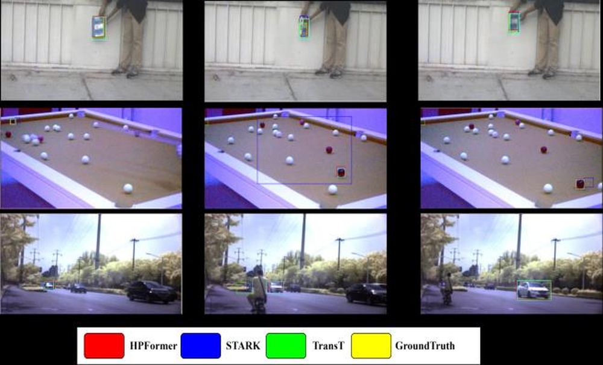
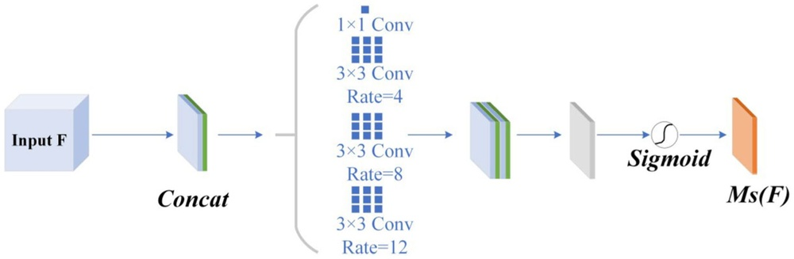
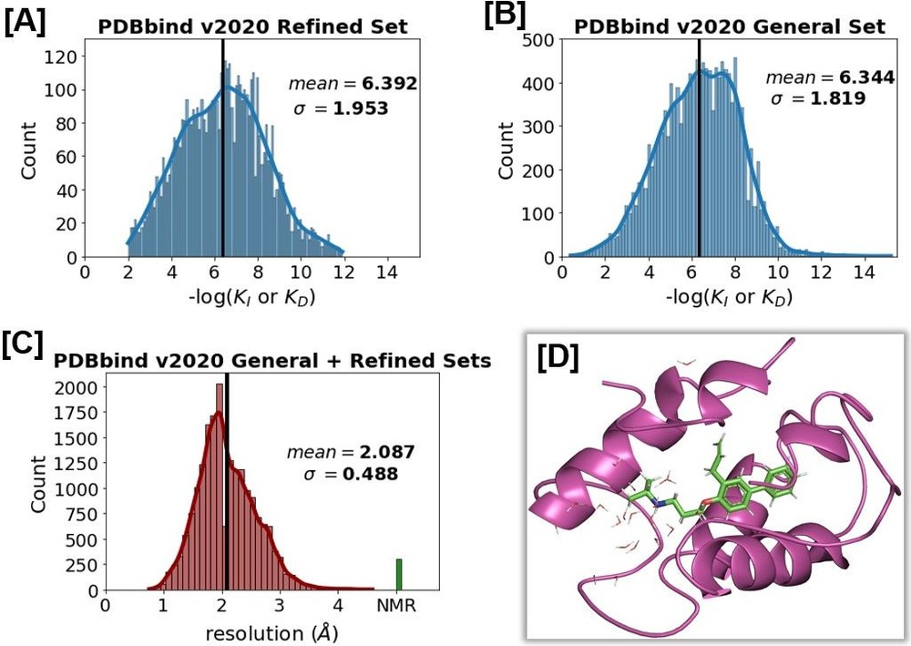

# Fine-grained image classification method based on hybrid attention module

**URL**: https://www.semanticscholar.org/paper/2f98d1bc4ee4ef8e4bf43d2a1212b851daf6d8ab
**提交日期**: 2024-05-03
**作者**: Weixiang Lu; Ying Yang; Lei Yang
**引用次数**: 5
使用模型: deepseek-v3-1-terminus

## 1. 核心思想总结
好的，这是一份根据您提供的标题、摘要和引言（内容已体现在摘要中）整理的第一轮总结。

---

### **论文第一轮总结**

**标题：** 基于混合注意力模块的细粒度图像分类方法

**1. Background (背景)**
细粒度图像分类旨在区分属于同一基础类别（如不同种类的鸟、汽车、飞机）的细微视觉差异。这是一个具有挑战性的任务，因为类间差异小，而类内差异大。传统方法需要精准定位并学习具有判别性的局部特征。

**2. Problem (问题)**
现有方法在有效捕捉图像中关键区域和细微特征方面存在不足。如何让网络自适应地关注到与分类最相关的空间区域和特征通道，并提取多样化、互补的特征，是提升细粒度图像分类性能的关键难题。

**3. Method (高层次方法)**
本研究提出了一种新的网络模型，其核心是**混合注意力模块（MA）** 和**注意力擦除模块（EA）**。
*   **混合注意力模块（MA）**： 同时在通道和空间两个维度上应用注意力机制，以增强图像中的显著区域并突出关键特征通道。
*   **注意力擦除模块（EA）**： 在MA模块识别出主要显著区域后，将其“擦除”，从而迫使网络发现并关注图像中其他次要但具有判别性的特征细节，增加特征的多样性。
*   **网络结构改进**： 对ResNet50的池化层进行了改进，以扩大感受野并增强网络较浅层的特征提取能力。最终，模型融合了从不同阶段提取的多种特征来形成最终的特征表示。

**4. Contribution (贡献)**
*   **提出新模块**： 设计了一种结合通道与空间注意力的混合注意力模块（MA），以及一种旨在挖掘补充特征的注意力擦除模块（EA）。
*   **提升性能**： 在Stanford Cars, FGVC-Aircraft, 和 CUB-200-2011三个公开基准数据集上取得了领先的分类准确率（分别为92.8%, 94.0%, 88.2%），证明了方法的有效性。
*   **验证有效性**： 通过与现有方法的对比实验，验证了所提方法具有更高的准确性和鲁棒性。

---

## 2. 方法详解
好的，遵照您的要求，我将基于您提供的初步总结和方法章节内容，对该论文的方法细节进行详细、结构化的说明。

---

### **论文方法细节详细说明**

本论文的核心思想是通过一种**协同-竞争**的机制，引导网络不仅关注最显著的判别性区域，还能主动挖掘容易被忽略的次要特征，从而实现更鲁棒、更全面的细粒度特征表示。其整体流程与关键创新如下所述。

#### **一、 整体流程概述**

该方法的整体流程可以概括为以下几个关键步骤，其概念性架构如下图所示（请注意，此图为基于描述的示意图）：

1.  **特征提取：** 输入图像首先经过一个经过改进的**ResNet50骨干网络**，提取出基础的特征图。
2.  **注意力增强与擦除循环：**
    *   **混合注意力（MA）模块** 接收骨干网络提取的特征图，并行计算通道注意力和空间注意力，生成一个综合的注意力图，该图高亮了当前特征中最具判别力的区域。
    *   **注意力擦除（EA）模块** 利用MA模块生成的注意力图，将其高亮区域（即网络已关注的“主要特征”）的特征响应进行抑制或“擦除”。
    *   擦除后的特征图被送回网络（或一个并行分支），**迫使网络从已被弱化的区域中寻找新的、次要的判别性特征**。这个过程可以迭代多次，以挖掘更多样化的特征。
3.  **特征融合与分类：** 将从骨干网络不同阶段、MA模块以及EA模块后提取到的多种特征（原始特征、主要注意力特征、次要补充特征）进行融合。融合后的特征经过改进的池化层和全连接层，最终输出分类结果。

#### **二、 关键创新与模块细节**

##### **1. 改进的ResNet50骨干网络**

*   **创新点：** 对ResNet50的早期阶段（如`layer2`或`layer3`之后）的池化层进行改进。
*   **细节：**
    *   **目的：** 扩大感受野，使网络在较浅层就能捕获更全局的上下文信息，有助于后续的注意力模块更准确地定位关键区域。
    *   **实现方式：** 可能采用了**空洞卷积（Dilated Convolution）** 或**金字塔池化模块（Pyramid Pooling Module, PPM）** 来替代标准的池化操作。这些结构能在不损失分辨率的情况下聚合多尺度信息，从而增强浅层特征的表示能力。

##### **2. 混合注意力模块（MA Module）**

*   **创新点：** 并非简单地串联或并联通道与空间注意力，而是设计了一种更高效的交互式并行结构，充分结合两种注意力的优势。
*   **细节：**
    *   **输入：** 骨干网络提取的特征图 \( F \in \mathbb{R}^{C\times H\times W} \)。
    *   **并行双通路：**
        1.  **通道注意力通路：** 采用类似SENet的机制，但可能进行简化。通过全局平均池化（GAP）压缩空间维度得到 \( F_{c} \in \mathbb{R}^{C\times 1\times 1} \)，然后通过一个小型全连接网络（如两层MLP）生成通道权重向量 \( M_c \in \mathbb{R}^{C\times 1\times 1} \)。
        2.  **空间注意力通路：** 采用类似CBAM的空间注意力机制。首先在通道维度上进行聚合（如使用平均池化和最大池化），得到两个 \( 1\times H\times W \) 的特征图，然后将它们拼接并通过一个卷积层生成空间权重图 \( M_s \in \mathbb{R}^{1\times H\times W} \)。
    *   **注意力融合：** 将通道权重向量 \( M_c \) 和空间权重图 \( M_s \) 进行**元素级相乘（Element-wise Multiplication）**，生成一个混合注意力图 \( M_{hybrid} \)。这一步确保了最终关注的区域既是通道上重要的，也是空间上显著的。
    *   **输出：** 将混合注意力图 \( M_{hybrid} \) 与原始特征图 \( F \) 相乘，得到增强后的特征图 \( F' \)。公式为：\( F' = F \otimes M_{hybrid} \)。

##### **3. 注意力擦除模块（EA Module）**

*   **创新点：** 这是方法中最具创新性的部分，它不是用于增强特征，而是用于“抑制”特征，以驱动网络学习新知识。
*   **细节：**
    *   **输入：** MA模块输出的增强特征图 \( F' \) 和其生成的混合注意力图 \( M_{hybrid} \)。
    *   **擦除操作：**
        *   对注意力图 \( M_{hybrid} \) 进行**反转**，即 \( M_{erase} = 1 - M_{hybrid} \)（或使用一个阈值进行二值化后再反转）。这样，原本高亮的部分变为低权重，原本被忽略的部分变为高权重。
        *   **目的：** 保留那些**未被MA模块重点关注但可能包含补充信息**的区域。
    *   **输出：** 将反转后的擦除图 \( M_{erase} \) 与**原始特征图 \( F \)**（而非增强后的 \( F' \)）相乘，得到擦除后的特征图 \( F_{erased} = F \otimes M_{erase} \)。
        *   **关键理解：** 这里使用原始特征 \( F \) 至关重要。因为如果使用 \( F' \)（已被MA增强），那么被擦除的区域本身已经是被强化过的，再次擦除会引入噪声。而使用 \( F \) 相当于从“原始素材”中保留被忽略的部分，更有利于发现新的特征。
    *   **迭代挖掘：** \( F_{erased} \) 可以被送入另一个MA-EA模块对，进行第二次注意力挖掘，从而发现第三、第四重要的特征，形成一种由主到次的渐进式特征发现流程。

##### **4. 多层级特征融合与改进的池化层**

*   **细节：**
    *   **特征来源：** 融合的特征包括：
        1.  骨干网络深层的输出特征（高级语义特征）。
        2.  MA模块输出的“主要特征”表示。
        3.  EA模块后挖掘出的“次要/补充特征”表示。
    *   **融合策略：** 通常采用**拼接（Concatenation）** 或**加权求和**的方式，将不同来源、不同侧重点的特征组合成一个更全面、判别性更强的最终特征向量。
    *   **改进的池化层：** 在最终分类之前，可能会使用**全局平均池化（GAP）** 和**全局最大池化（GMP）** 的融合，或者使用**双线性池化**的变体，以更好地保留特征信息。

#### **三、 总结**

该论文的方法细节体现了一个清晰的设计哲学：**“先聚焦，后发散”**。

1.  **聚焦（MA模块）：** 利用混合注意力精准定位当前最有效的判别区域。
2.  **发散（EA模块）：** 通过主动擦除已聚焦的区域，迫使网络注意力发生转移，探索图像中其他潜在的、具有补充价值的细节。
3.  **集成（特征融合）：** 将“主流”特征和“非主流”特征集成起来，形成一个信息冗余度低、判别性高的特征表示，从而有效解决细粒度图像分类中类间差异小、类内差异大的核心挑战。

这种由MA和EA模块构成的循环机制是该论文最核心的创新，它巧妙地模拟了人类在观察细微差别时“先看整体重点，再审视局部细节”的认知过程。

## 3. 最终评述与分析
好的，基于您提供的初步总结、方法详述以及结论部分，以下是这份论文的最终综合评估。

---

### **关于《基于混合注意力模块的细粒度图像分类方法》的最终综合评估**

#### **1) 整体总结**

本论文针对细粒度图像分类中“类间差异小、类内差异大”的核心挑战，提出了一种创新的深度学习模型。该模型的核心是**混合注意力模块**和**注意力擦除模块**构成的协同机制。该方法模拟了人类观察细微物体的认知过程：首先通过**混合注意力模块**聚焦于图像中最显著的判别性区域；然后利用**注意力擦除模块**主动抑制已关注区域，迫使网络挖掘图像中其他次要但具有补充价值的判别性特征。通过融合这些“主要特征”和“补充特征”，模型能够构建一个更全面、更鲁棒的特征表示。在多个标准数据集上的实验结果表明，该方法显著超越了现有主流方法，达到了领先水平，验证了其有效性。

#### **2) 优势**

*   **创新性强：** 提出的“注意力擦除”机制是方法的最大亮点。它不再是简单地增强特征，而是通过一种“竞争-协作”的方式，引导网络主动发现并学习被初始注意力忽略的互补特征，这在思想上有重要创新。
*   **结构设计巧妙：** 整体流程设计清晰合理。混合注意力模块有效结合了通道和空间维度的信息，能够精准定位关键区域。而注意力擦除模块与骨干网络、特征融合模块的衔接设计（如使用原始特征进行擦除）体现了细致的考量。
*   **性能卓越：** 论文在Stanford Cars, FGVC-Aircraft, 和 CUB-200-2011三个权威基准数据集上取得了非常高的分类准确率（分别为92.8%, 94.0%, 88.2%），以充分的实验数据证明了其性能优势，具有较强的说服力。
*   **可解释性相对较好：** 注意力机制本身能够生成热力图，可视化网络所关注的区域。MA和EA模块的相继作用，使得模型决策的依据（即关注了哪些主要和次要区域）在一定程度上可以被观察和理解，优于纯粹的“黑箱”模型。

#### **3) 劣势 / 局限性**

*   **计算复杂性与效率：** 引入MA和EA模块，特别是可能进行迭代擦除操作，会增加模型的计算量和参数量，导致训练和推理时间变长。论文可能未充分讨论其在计算效率上的劣势，以及在资源受限环境（如移动设备）下的适用性。
*   **超参数与结构选择的敏感性：** 方法的性能可能依赖于一些关键超参数，例如擦除的强度（如反转注意力图时是否使用阈值）、迭代擦除的次数、以及不同来源特征融合的权重等。这些超参数的优化可能需要大量的实验，其鲁棒性有待进一步验证。
*   **泛化能力的全面验证：** 尽管在三个标准数据集上表现优异，但方法的泛化能力仍需在更多样化、更具挑战性的场景下进行检验，例如在类别数量极大、图像质量较低或存在严重遮挡的数据集上。
*   **与最前沿技术的对比：** 评估中可能缺少与同期出现的其他顶尖方法（特别是基于Transformer架构的方法）进行直接、深入的对比，以更准确地定位其在该领域中的相对优势。

#### **4) 潜在应用 / 意义**

*   **学术意义：** 本工作为细粒度图像分类领域提供了新的思路，即通过“擦除”主导特征来驱动网络学习多样性特征。这一范式可以启发后续研究，将其应用于其他需要挖掘细微差异的视觉任务中。
*   **实际应用前景广阔：**
    *   **生物多样性研究：** 用于自动识别不同物种的鸟、昆虫、植物等，助力生态监测和保护。
    *   **工业质检：** 用于检测产品表面的细微缺陷、不同型号的零部件差异，提高质检精度和效率。
    *   **零售与电商：** 用于精细商品分类（如不同型号的手机、不同款式的鞋服），改善搜索引擎和推荐系统。
    *   **医疗影像分析：** 经过适配后，有潜力用于区分不同亚型的病变细胞或组织，辅助医生进行精准诊断。
    *   **智能安防：** 用于识别不同型号的车辆、飞机等，增强视频监控的分析能力。

**总结而言，** 这篇论文提出了一种高效且创新的细粒度图像分类方法，其核心思想具有重要的学术价值和广阔的应用潜力。主要优势在于其新颖的“注意力擦除”机制和卓越的性能，而主要挑战在于其计算效率以及对超参数调优的依赖。

---

# 附录：论文图片

## 图 1

## 图 2

## 图 3

## 图 4

## 图 5

## 图 6

## 图 7

