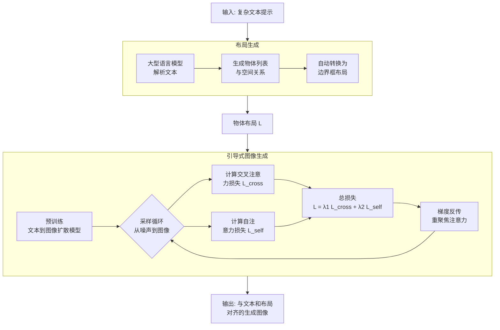
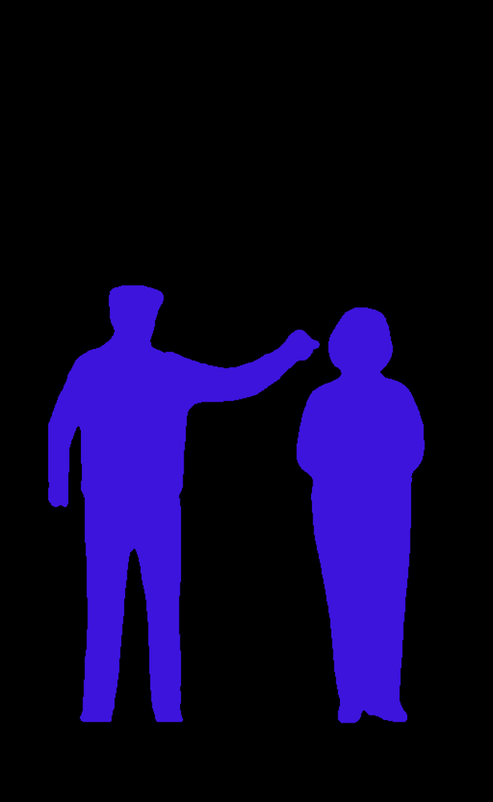
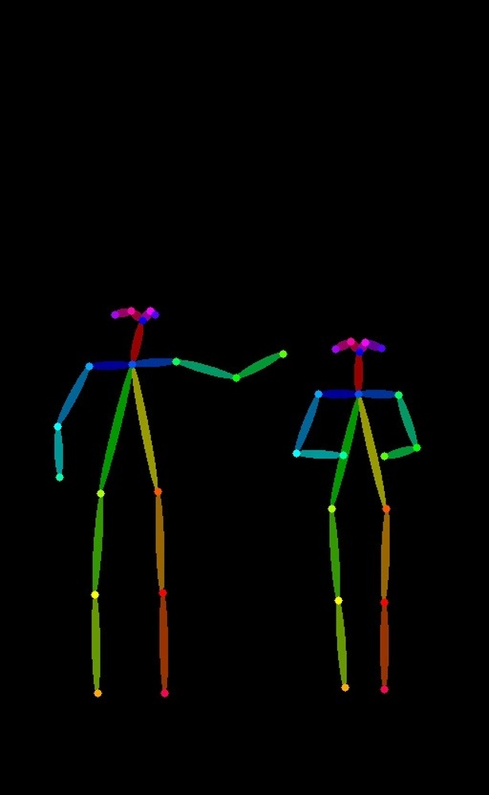
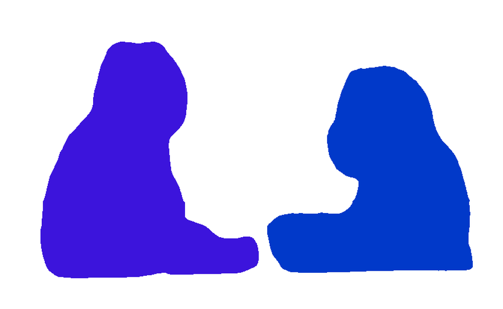
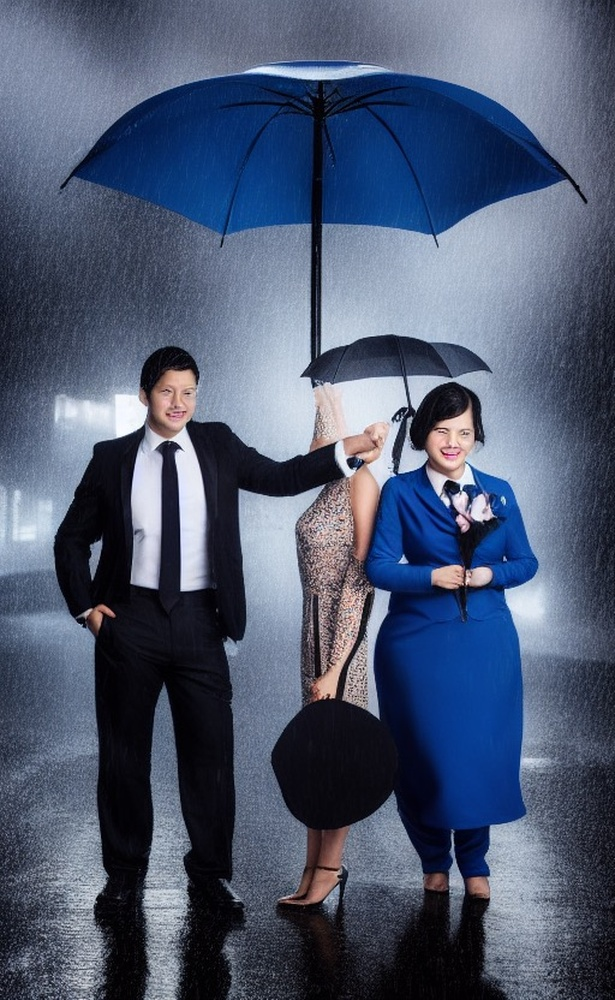

# Grounded Text-to-Image Synthesis with Attention Refocusing

**ArXiv ID**: 2306.05427v2
**URL**: http://arxiv.org/abs/2306.05427v2
**提交日期**: 2023-06-08
**作者**: Quynh Phung; Songwei Ge; Jia-Bin Huang
**引用次数**: NULL
使用模型: deepseek-v3-1-terminus

## 1. 核心思想总结
好的，这是一份根据您提供的论文标题、摘要和引言部分整理的简洁第一轮总结。

### 论文第一轮总结

**标题：** 《基于注意力重聚焦的接地文本到图像合成》

**1. Background (背景)**
*   基于大规模数据集训练的可扩展扩散模型，文本到图像合成技术已经取得了令人瞩目的成果。

**2. Problem (问题)**
*   然而，当文本提示涉及多个物体、属性或复杂空间关系时，现有模型仍难以精确遵循提示要求，导致生成图像与文本描述不符。

**3. Method (high-level) (方法 - 高层概述)**
*   本文揭示了问题在扩散模型的交叉注意力和自注意力层中的潜在原因。
*   核心方法是提出两种新颖的损失函数，在图像生成（采样）过程中，根据给定的物体空间布局来“重聚焦”注意力图，使其更符合预期。
*   为了自动生成所需布局，论文探索利用大型语言模型来产生这些布局信息。

**4. Contribution (贡献)**
*   提出了通过注意力重聚焦来增强现有模型可控性的有效方法。
*   在多个基准（DrawBench, HRS, TIFA）上的实验表明，该方法能有效提升生成图像与文本提示（尤其是空间构成）的对齐精度。

## 2. 方法详解
好的，基于您提供的初步总结和论文方法章节，以下是对该论文方法细节的详细说明。

### 论文方法细节详解

#### 一、 核心问题诊断与创新思路

**1. 问题根源分析：**
论文首先深入诊断了现有文本到图像扩散模型在处理复杂空间关系时失效的根本原因。关键在于模型内部的**注意力机制**。
*   **交叉注意力**：负责将文本提示中的单词（如“猫”、“桌子”、“上面”）与图像中的相应区域关联起来。当提示复杂时，注意力图可能变得**模糊或错位**。例如，“猫”的注意力可能错误地扩散到“桌子”的区域。
*   **自注意力**：负责生成图像内部不同区域/块之间的视觉关系。错误的交叉注意力会传递错误的关联信号给自注意力层，导致其无法正确建模物体间的空间结构（如“猫在桌子上”与“桌子在猫上”的混淆）。

**2. 核心创新思路：**
论文的核心思想不是重新训练一个模型，而是**在预训练扩散模型的生成（采样）过程中，施加一种引导**。这种引导基于用户提供的或自动生成的**物体空间布局**（例如，边界框或分割掩码），目的是“重聚焦”模型内部的注意力图，使其更精确地对应到布局指定的区域。

#### 二、 关键创新：两种注意力重聚焦损失函数

这是论文最核心的贡献。这两种损失函数在每一步去噪采样迭代中计算，并作为梯度信号反向传播，以微调解码器中的特征图，从而动态调整注意力。

**1. 交叉注意力重聚焦损失**
*   **目标**：确保每个物体的文本token的交叉注意力图，精确地集中在布局指定的对应区域。
*   **关键步骤**：
    1.  **获取真实注意力图**：在采样步骤 `t`，对于文本提示中代表某个物体（如“猫”）的token，模型会自然生成一个交叉注意力图 `A_obj`。
    2.  **创建目标注意力图**：根据提供的布局（如“猫”的边界框），生成一个二值掩码 `M_obj`。在框内的区域值为1，框外为0。
    3.  **计算损失**：损失函数旨在最小化真实注意力图 `A_obj` 与目标掩码 `M_obj` 之间的差异。论文可能采用了类似**二元交叉熵**或**均方误差**的损失函数：
        `L_cross = BCE(A_obj, M_obj)`
    4.  **作用**：这个损失会“惩罚”那些落在指定区域之外的注意力，迫使模型在下一步迭代中将“猫”的视觉特征更集中地生成在边界框内。

**2. 自注意力重聚焦损失**
*   **目标**：确保图像中不同物体区域之间的自注意力关系与文本描述的空间关系（如“在上面”、“在左边”）一致。
*   **关键步骤**：
    1.  **获取自注意力图**：提取模型解码器中某个层的自注意力图。该图反映了图像中不同块（patch）之间的关联强度。
    2.  **定义空间关系约束**：根据布局和文本提示，定义期望的空间关系。例如，对于“猫在桌子上”，期望是“猫”区域内的块应该与“桌子”区域内的块有较强的关联，但“猫”区域块与“地面”区域块的关联应该较弱。
    3.  **创建关系目标矩阵**：基于布局掩码，构建一个理想的关系矩阵 `R`。例如，`R[i, j]` 表示块 `i` 和块 `j` 是否**应该**有强关联（如同属一个物体或具有“在上面”的关系）。
    4.  **计算损失**：计算实际的自注意力图 `S` 与目标关系矩阵 `R` 之间的差异：
        `L_self = Distance(S, R)`
    5.  **作用**：这个损失引导模型在生成过程中，强化符合文本关系的物体间的视觉交互，弱化不符合的交互，从而正确体现“在上面”等空间逻辑。

#### 三、 整体流程与关键步骤

论文的完整工作流程可以分为三个阶段，下图清晰地展示了这一过程：

**阶段一：布局规划**
*   **输入**：复杂文本提示（例如，“一只猫坐在一张桌子上，桌子左边有一个花瓶”）。
*   **过程**：利用大型语言模型强大的逻辑推理能力，将文本解析为结构化的物体和关系列表。例如：
    *   物体: [猫， 桌子， 花瓶]
    *   关系: [猫 在 桌子 上面], [花瓶 在 桌子 左边]
*   **输出**：LLM进一步将这些关系自动转换为一个粗略的**边界框布局** `L`，指定了每个物体在画布上的大致位置和大小。这步解决了用户手动标注布局的不便，实现了“纯文本”控制。

**阶段二：引导式图像生成**
这是方法的核心执行阶段，它是一个迭代的去噪过程。
1.  **初始化**：从随机噪声开始，并输入文本提示。
2.  **迭代采样循环**：对于每个采样步数 `t`：
    a. **前向传播**：扩散模型执行一次标准的前向计算，得到当前步的噪声预测和中间特征（包括交叉注意力图和自注意力图）。
    b. **损失计算**：利用阶段一生成的布局 `L`，计算上述两种注意力重聚焦损失 `L_cross` 和 `L_self`。总损失为它们的加权和：`L_total = λ1 * L_cross + λ2 * L_self`（λ1 和 λ2 是超参数）。
    c. **梯度引导**：将总损失反向传播到扩散模型的解码器特征图。**请注意，这里不是更新模型权重，而是通过梯度来微调当前步的特征图本身**。这个过程类似于Classifier-Free Guidance，但引导信号来自于注意力图与布局的差异。
    d. **更新图像**：使用经过梯度引导调整后的特征图，进行当前步的去噪更新，得到下一步的降噪图像。
3.  **循环结束**：重复步骤2，直到完成所有采样步骤，生成最终的高清图像。

#### 四、 总结：方法特点与优势

*   **即插即用**：该方法不需要对预训练扩散模型进行任何微调或重新训练，是一种高效的**推理阶段引导技术**，可以轻松应用于各种现有模型（如Stable Diffusion）。
*   **精准控制**：通过直接操作模型内部最关键的注意力机制，实现了对生成内容空间构成的像素级精准控制。
*   **自动化与灵活性**：结合LLM自动生成布局，降低了用户的使用门槛；同时，方法也支持用户手动输入精确布局，提供了灵活性。
*   **效果显著**：通过“重聚焦”机制，有效解决了物体混淆、位置错误、关系颠倒等生成问题，显著提升了文本-图像对齐度。

## 3. 最终评述与分析
好的，结合前两轮关于论文背景、方法细节以及最终的结论部分，现提供一份完整的综合评估如下：

### 论文《基于注意力重聚焦的接地文本到图像合成》综合评估

#### 1) 总体摘要

本论文针对现有文本到图像生成模型在处理包含多个物体及复杂空间关系的提示时，经常出现物体属性混淆、位置错误和关系颠倒的核心难题，提出了一种创新性的“即插即用”式解决方案。该方法的核心洞察在于诊断出问题的根源是模型内部的**交叉注意力**和**自注意力**机制失效。为此，论文没有选择重新训练模型，而是巧妙地在**推理阶段**引入引导信号，通过两种新颖的注意力重聚焦损失函数，依据物体空间布局来动态调整和修正模型的注意力图。此外，论文还探索了利用大型语言模型自动从文本提示中解析并生成所需布局，从而实现了从纯文本到精准生成图像的全自动化流程。在多个权威基准上的实验证明，该方法能显著提升生成图像与文本描述，尤其是空间关系的一致性。

#### 2) 优势

1.  **精准的问题诊断与创新的解决思路**：论文没有停留在表面现象，而是深入模型内部机制，将生成错误归因于注意力图的模糊与错位，并提出了直接对注意力机制进行“重聚焦”的治本之策，思路新颖且切中要害。
2.  **高效的“即插即用”特性**：该方法作为一种推理时引导技术，无需对预训练好的扩散模型进行任何微调或更改权重，计算开销相对较小，可以轻松且灵活地应用于现有的主流模型（如Stable Diffusion），具有很强的实用性和可推广性。
3.  **双管齐下的损失函数设计**：所提出的**交叉注意力损失**和**自注意力损失**分别从文本-图像对齐和图像内部结构关系两个层面进行约束，形成了互补的引导体系，实现了像素级和关系级的协同控制。
4.  **自动化与用户友好性**：通过集成大型语言模型来自动生成空间布局，有效降低了用户的使用门槛，使得普通用户无需具备专业标注知识也能实现对复杂场景的精确生成，实现了“所想即所得”的终极目标。
5.  **实验充分，验证全面**：在DrawBench、HRS、TIFA等多个具有挑战性的基准上进行定量和定性评估，结果均表明该方法在提升文本-图像对齐度方面显著优于基线模型，证明了其有效性和鲁棒性。

#### 3) 劣势 / 局限性

1.  **对布局生成质量的依赖**：方法的最终效果在很大程度上依赖于第一阶段LLM生成的布局的准确性。如果LLM错误地解析了文本中的空间关系（例如，将“左边”误判为“右边”），那么这个错误会直接传递并影响最终图像的生成结果。
2.  **生成速度的潜在影响**：由于在每一个采样步骤中都需要计算额外的损失函数并进行梯度反传以调整特征，尽管无需更新模型权重，但相比标准的生成过程，必然会引入额外的计算时间，可能导致生成速度变慢。
3.  **布局信息的粒度限制**：该方法目前主要依赖于边界框等**粗糙的**空间布局。对于需要更精细控制（如物体的具体形状、姿态、复杂遮挡关系）的场景，当前方法的控制能力可能不足。边界框内的具体内容生成仍完全依赖于原始扩散模型，可能无法解决框内物体的细节错误。
4.  **通用性的边界**：该方法主要专注于解决物体间的**空间关系**问题。对于其他类型的文本对齐挑战，如颜色、纹理、材质属性绑定到特定物体，该方法可能不是最优解，其优势主要体现在空间构成上。

#### 4) 潜在应用 / 意义

1.  **实用工具增强**：可直接集成到现有的文生图工具和创意软件中（如Photoshop插件、在线生成平台），作为一项高级功能，为用户提供对生成画面构图和物体位置的精确控制能力，极大提升创作效率和作品质量。
2.  **专业内容创作**：在游戏场景设计、电影分镜制作、广告创意插图等专业领域，该方法可以帮助创作者快速生成符合严格构图要求的图像草稿，减少反复修改的次数，加速创作流程。
3.  **多模态交互研究**：本工作成功展示了LLM（负责逻辑规划和布局）与扩散模型（负责视觉内容生成）协同工作的潜力，为未来更复杂的多模态AI系统（如根据故事脚本自动生成漫画或视频分镜）提供了重要的技术思路和范式。
4.  **模型可解释性研究**：通过主动干预和引导注意力机制，该方法也为研究者提供了一个独特的“显微镜”，用以观察和理解扩散模型内部是如何建立文本与视觉概念的关联的，有助于推动生成模型的可解释性研究。
5.  **推动可控生成技术发展**：论文提出的“推理时注意力引导”框架本身是一个重要的技术贡献，可以启发后续研究将其应用于解决其他类型的可控生成问题，例如通过引导注意力来实现对风格、光照、动作等更细粒度属性的控制。

---

# 附录：论文图片

## 图 1

## 图 2

## 图 3

## 图 4

## 图 5

## 图 6

## 图 7

## 图 8

## 图 9

## 图 10

