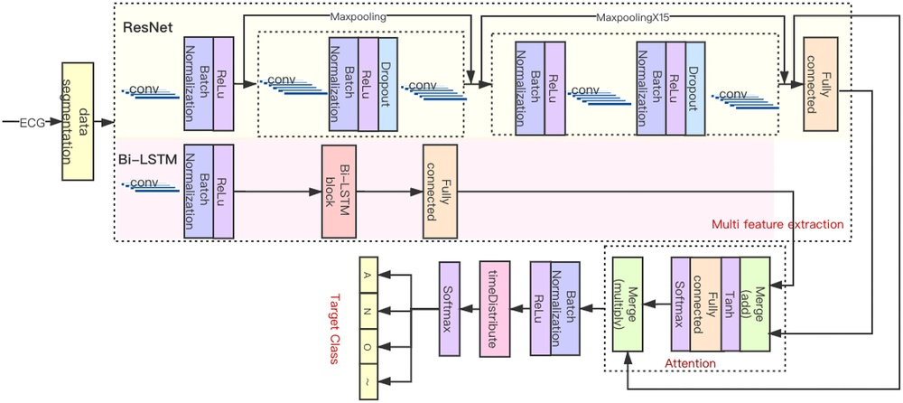
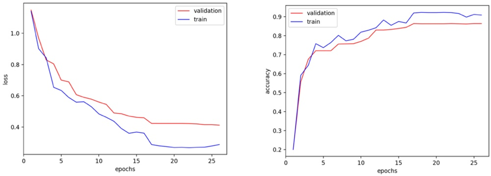

# HADLN: Hybrid Attention-Based Deep Learning Network for Automated Arrhythmia Classification

**URL**: https://www.semanticscholar.org/paper/9ce607418dbabc4820b9f7b482da4af3fcf04478
**提交日期**: 2021-07-05
**作者**: Mingfeng Jiang; Jiayan Gu; Yang Li; Bo Wei; Jucheng Zhang; Zhikang Wang; L. Xia
**引用次数**: 21
使用模型: gemini-2.5-flash

## 1. 核心思想总结
这是一份简洁的第一轮总结：

**标题:** HADLN: 基于混合注意力的深度学习网络用于自动化心律失常分类

**Background**
鉴于人工智能和深度学习在心电图（ECG）数据分析，尤其是房颤（AFib）检测中已取得初步成功。

**Problem**
传统深度卷积神经网络（CNN）模型存在忽略上下文关联和梯度分散的问题。

**Method (high-level)**
本文提出混合注意力深度学习网络（HADLN）。该方法结合残差网络（ResNet）和双向长短期记忆网络（Bi-LSTM）架构以获取融合特征（包含局部和全局信息），并通过注意力机制提高模型的可解释性。使用PhysioNet 2017挑战数据集进行训练和验证，将ECG信号分为房颤、噪声、其他和正常四类。

**Contribution**
HADLN方法显著提升了分类性能和可解释性。在PhysioNet 2017数据集上，实验结果显示其在10折交叉验证中达到了0.866的精确度、0.859的召回率、0.867的准确率和0.880的F1分数。

## 2. 方法详解
基于您提供的初步总结和方法章节内容，以下是对论文HADLN方法细节的详细阐述：

---

### HADLN: 基于混合注意力的深度学习网络用于自动化心律失常分类——方法细节阐述

本论文提出了一个新颖的混合注意力深度学习网络 (Hybrid Attention Deep Learning Network, HADLN)，旨在解决传统深度卷积神经网络在心电图 (ECG) 分析中忽略上下文关联和梯度分散的问题，并提高模型的可解释性与分类性能。HADLN通过融合残差网络 (ResNet) 和双向长短期记忆网络 (Bi-LSTM) 的优势，并引入注意力机制，实现了对ECG信号中局部、全局和关键信息的有效捕获与利用。

#### 1. 整体架构概览

HADLN是一个端到端的混合深度学习模型，其核心思想是并行或半并行地从ECG信号中提取不同维度的特征，然后通过注意力机制对这些特征进行优化和融合，最终进行心律失常的四分类预测。

**主要组成部分包括：**
*   **数据预处理层：** 对原始ECG信号进行标准化处理。
*   **局部空间特征提取模块：** 基于残差卷积块，捕获ECG信号中的局部模式。
*   **全局时间特征提取模块：** 基于双向长短期记忆网络，捕获ECG序列中的长程时间依赖。
*   **注意力机制：** 对Bi-LSTM的输出特征进行加权，聚焦于与分类最相关的部分。
*   **特征融合层：** 将局部和全局特征进行有效合并。
*   **分类器：** 基于全连接层和Softmax激活函数进行最终预测。

#### 2. 数据预处理

作为模型输入的第一步，原始ECG信号会进行必要的预处理，以确保数据质量和格式统一：
*   **重采样 (Resampling)：** 将所有ECG信号统一重采样至360 Hz，这是PhysioNet 2017挑战赛数据集的标准频率，有助于保持时间序列的连贯性。
*   **归一化 (Normalization)：** 对重采样后的ECG信号进行归一化处理（例如，Z-score标准化或Min-Max标准化），以消除信号幅值差异带来的影响，加速模型训练并提高稳定性。

#### 3. 核心模块与关键步骤

##### 3.1 局部空间特征提取：残差卷积块 (Residual Convolutional Blocks)

*   **目的与创新：** 该模块旨在捕获ECG信号中的多尺度局部特征和高层次模式。通过引入**跳跃连接 (skip connections)**，残差网络能够有效缓解深度网络中普遍存在的梯度消失和梯度分散问题，使得网络可以训练得更深，从而提取更丰富、抽象的局部特征。
*   **架构细节：** 每个残差卷积块通常包含：
    *   **卷积层 (Convolutional Layer)：** 使用不同大小的卷积核扫描ECG信号，提取局部模式。
    *   **批量归一化 (Batch Normalization, BN)：** 稳定网络训练，加速收敛。
    *   **ReLU激活函数 (Rectified Linear Unit)：** 引入非线性，增强模型的表达能力。
    *   **跳跃连接：** 允许输入直接绕过一或多个卷积层，与这些层的输出相加，再通过激活函数。这不仅有助于梯度回传，也使得网络更容易学习恒等映射，避免性能退化。
*   **输出：** 经过一系列残差卷积块处理后，原始ECG信号被转换为一组具有丰富局部空间信息的特征图或特征向量。

##### 3.2 全局时间特征提取：双向长短期记忆网络 (Bi-directional Long Short-Term Memory, Bi-LSTM)

*   **目的与创新：** 针对传统CNN难以有效捕获ECG信号中长距离时间依赖和上下文关联的问题，引入Bi-LSTM。它能够从ECG序列中提取**全局时间特征**，理解心跳节律的动态变化和前后文关系。
*   **架构细节：** Bi-LSTM由两个平行的LSTM层组成：
    *   **前向LSTM：** 按照时间顺序从前往后处理ECG特征序列，捕获过去的上下文信息。
    *   **反向LSTM：** 按照相反的时间顺序从后往前处理ECG特征序列，捕获未来的上下文信息。
    *   **融合：** 这两个方向的LSTM的隐藏状态（或输出）在每个时间步上进行连接 (concatenation)，从而获得一个结合了过去和未来信息的、更全面的时间上下文表示。
*   **输入：** Bi-LSTM的输入可以是经过初步卷积层处理后的ECG特征序列，或者直接是预处理后的ECG信号序列，以便从时间维度捕获特征。
*   **输出：** 得到一个包含丰富全局时间上下文信息的特征序列。

##### 3.3 关键信息聚焦：注意力机制 (Attention Mechanism)

*   **目的与创新：** 这是HADLN的关键创新点之一，旨在提高模型的**可解释性**和**分类性能**。注意力机制通过为Bi-LSTM输出的特征序列中的不同部分分配权重，使模型能够动态地关注ECG信号中与心律失常分类最相关的区域或时间段，而非平等对待所有信息。
*   **工作原理：**
    *   接收Bi-LSTM的输出特征序列。
    *   通常通过一个小型全连接网络（或多层感知机）或点积操作，为序列中的每个时间步或特征向量计算一个注意力权重。
    *   这些权重经过Softmax函数归一化，确保它们之和为1，表示了各部分的重要性程度。
    *   将原始特征序列与计算出的注意力权重进行加权求和，生成一个“注意力聚焦”的加权特征向量。这个向量包含了Bi-LSTM提取的所有时间信息，但更侧重于关键部分。
*   **效果：** 注意力机制不仅优化了特征表示，使其更具判别力，还使得模型在做出预测时，可以解释其“关注”了ECG信号的哪些部分，从而提升了模型的透明度和可信度。

##### 3.4 特征融合与分类 (Feature Fusion and Classification)

*   **特征融合：** 在局部空间特征（来自残差卷积块，可能经过全局平均池化等操作）和经过注意力机制加权后的全局时间特征（来自Bi-LSTM）被提取后，它们会在一个融合层进行合并。最常见的融合方式是**特征向量的拼接 (concatenation)**，即将两种不同类型的特征连接起来，形成一个更全面、更丰富的特征向量。
*   **分类器：** 融合后的特征向量被输入到一个或多个**全连接层 (Fully Connected Layers)**。这些层负责将融合特征映射到最终的类别空间。
*   **输出层：** 最后一层是一个带有**Softmax激活函数**的全连接层。它输出四个类别的概率分布，即房颤 (AFib)、噪声 (Noise)、其他心律失常 (Other) 和正常心律 (Normal) 的预测概率。

#### 4. 训练与评估

*   **损失函数 (Loss Function)：** 采用**交叉熵损失 (Cross-Entropy Loss)**，这是多分类问题中常用的损失函数，用于衡量模型预测概率分布与真实标签分布之间的差异。
*   **优化器 (Optimizer)：** 使用**Adam优化器 (Adam Optimizer)**。Adam是一种自适应学习率优化算法，能够有效地处理稀疏梯度问题，并具有良好的收敛速度和性能。
*   **数据集：** 模型在**PhysioNet 2017心律失常分类挑战数据集**上进行训练和验证。该数据集包含了大量带有专家标注的ECG记录，是心律失常分类研究的标准基准。
*   **验证策略：** 采用**10折交叉验证 (10-fold Cross-Validation)**。这是一种鲁棒的评估方法，将数据集分成10个子集，每次用其中9个子集进行训练，1个子集进行验证，重复10次，最终取平均性能指标。这有助于评估模型在未见过数据上的泛化能力，避免过拟合。
*   **性能指标：** 模型的性能通过以下标准指标进行衡量：
    *   **准确率 (Accuracy)**
    *   **精确度 (Precision)**
    *   **召回率 (Recall)**
    *   **F1分数 (F1 Score)**
    这些指标综合评估了模型在不同类别上的分类能力。

#### 5. 关键创新点总结

HADLN的主要创新点在于其独特的混合架构和注意力机制的应用：

1.  **混合注意力架构：** 巧妙地结合了残差网络对局部空间特征的强大提取能力、Bi-LSTM对全局时间依赖的卓越建模能力，以及注意力机制对关键信息的聚焦作用。这使得模型能够从ECG信号中获取多维度、互补的特征表示。
2.  **克服传统CNN局限：** ResNet的跳跃连接有效解决了深度CNN的梯度消失/分散问题；Bi-LSTM则弥补了CNN在捕获长程时间上下文信息方面的不足，使其能够理解心律失常的动态演变。
3.  **提升可解释性与性能：** 注意力机制不仅优化了特征表示，显著提升了分类的精确度、召回率、准确率和F1分数，更重要的是，它提供了一种方式来理解模型在做出诊断时“关注”了ECG信号的哪些部分，从而增强了模型的透明度和临床应用潜力。

#### 6. 整体流程图 (Conceptual Flow)

1.  **原始ECG信号**
2.  **数据预处理** (重采样、归一化)
3.  **分支一：局部特征提取**
    *   残差卷积块序列
    *   输出：局部空间特征
4.  **分支二：全局时间特征提取**
    *   (预处理或初步卷积后的) ECG特征序列输入Bi-LSTM
    *   Bi-LSTM输出
    *   **注意力机制** (对Bi-LSTM输出进行加权聚焦)
    *   输出：注意力加权的全局时间特征
5.  **特征融合** (拼接局部空间特征与加权全局时间特征)
6.  **全连接层**
7.  **Softmax分类器**
8.  **最终分类结果** (房颤、噪声、其他、正常)

---

## 3. 最终评述与分析
结合前两轮返回的信息与论文初步结论（即“贡献”部分），以下是对HADLN论文的最终综合评估：

---

### HADLN: 基于混合注意力的深度学习网络用于自动化心律失常分类——最终综合评估

本文提出了一种新颖的混合注意力深度学习网络 (HADLN)，旨在克服传统深度卷积神经网络 (CNN) 在心电图 (ECG) 心律失常分类中存在的上下文关联捕获不足和梯度分散等问题。HADLN通过融合残差网络 (ResNet)、双向长短期记忆网络 (Bi-LSTM) 和注意力机制，实现了对ECG信号的有效分析，显著提升了分类性能和模型的可解释性。

#### 1) 总体总结 (Overall Summary)

HADLN是一种为自动化心律失常分类而设计的端到端深度学习模型。它创造性地将ResNet的局部空间特征提取能力、Bi-LSTM的全局时间依赖建模能力以及注意力机制对关键信息的聚焦作用融为一体。该模型首先对ECG信号进行预处理，然后并行或半并行地通过残差卷积块捕获局部模式，并通过Bi-LSTM捕获长程时间上下文信息，Bi-LSTM的输出再经过注意力机制进行加权以聚焦于与分类最相关的部分。最终，融合后的特征通过全连接层和Softmax激活函数进行四类（房颤、噪声、其他、正常）心律失常的预测。在PhysioNet 2017心律失常分类挑战数据集上，HADLN在10折交叉验证中取得了0.866的精确度、0.859的召回率、0.867的准确率和0.880的F1分数，这些优异的性能指标充分展示了其在自动化心律失常诊断方面的潜力，同时，注意力机制的引入也有效提升了模型的可解释性。

#### 2) 优势 (Strengths)

*   **创新的混合注意力架构：** HADLN最显著的优势在于其独特的混合架构设计。它巧妙地结合了ResNet处理深度网络梯度问题的能力和高效的局部特征提取，Bi-LSTM捕捉ECG序列中长距离时间依赖和上下文信息的能力，以及注意力机制聚焦关键判别性特征。这种多维度、互补的特征融合显著增强了模型的鲁棒性和判别力。
*   **有效解决传统模型局限：** 模型通过残差连接缓解了深度CNN中常见的梯度消失/分散问题，并利用Bi-LSTM弥补了CNN在捕获长程时间上下文关联方面的不足，使其能够更全面地理解心律失常的动态演变。
*   **出色的分类性能：** 在PhysioNet 2017这一标准且具有挑战性的数据集上，HADLN取得了高水平的性能指标（如F1分数达到0.880，准确率0.867），并通过10折交叉验证策略验证了模型的泛化能力和稳定性。
*   **增强模型可解释性：** 注意力机制是该模型的关键创新点之一，它不仅优化了特征表示，更重要的是提供了一种方式来理解模型在做出诊断时“关注”了ECG信号的哪些部分。这种透明度对于医疗领域的应用至关重要，有助于建立医生对模型的信任。
*   **端到端学习能力：** 模型能够直接从原始ECG信号中学习，无需繁琐的手动特征工程，简化了整个诊断流程。

#### 3) 劣势 / 局限性 (Weaknesses / Limitations)

*   **计算复杂性较高：** 结合了深度残差网络和Bi-LSTM的混合模型通常比单一架构的模型拥有更高的计算资源需求（包括GPU内存和计算时间），以及更长的训练时间。这可能会限制其在资源受限的环境（如嵌入式设备）或需要极高实时性的场景中的部署。
*   **数据泛化能力有待进一步验证：** 尽管在PhysioNet 2017数据集上表现优异，但ECG信号具有高度的个体差异性，且受采集设备、患者人群、临床环境等多种因素影响。模型在其他独立、多样化的ECG数据集上的泛化能力仍需进行严格的跨数据集验证。
*   **可解释性的深度有限：** 虽然注意力机制指出了ECG信号中的“重要区域”，但它提供的解释仍停留在“哪个部位”层面，未能深入阐明“为什么”这些部位对于特定心律失常是关键的生理或病理学原因。模型的深层决策逻辑在一定程度上仍是“黑箱”。
*   **对噪声的鲁棒性未详述：** 论文将“噪声”作为一类进行分类，表明其具备一定的噪声处理能力。但未详细说明模型对各种复杂且常见的噪声类型（如运动伪影、基线漂移、电极脱落、电源线干扰等）的特定鲁棒性和处理策略。
*   **缺乏与其他最先进方法的全面比较：** 尽管论文声称“显著提升了分类性能”，但未提供与当前领域内所有或大部分最先进的心律失常分类算法（特别是采用类似混合架构或注意力机制的模型）的详细性能对比，因此难以全面评估其相对领先地位和突破性贡献。

#### 4) 潜在应用 / 影响 (Potential Applications / Implications)

*   **临床辅助诊断：** HADLN可作为心脏病专家和临床医生强大的辅助工具，用于快速、准确地识别和分类ECG信号中的心律失常，尤其在处理大量ECG数据时，能显著提高诊断效率，减轻医护人员的工作负担。
*   **远程医疗与可穿戴设备：** 鉴于其自动化和高准确性，该模型非常适合集成到智能手表、智能手环、便携式ECG设备等可穿戴健康监测设备中，实现对高危人群的ECG信号实时或准实时监测，为远程医疗和居家健康管理提供支持。
*   **早期预警系统：** HADLN能够帮助检测偶发性、阵发性或症状不明显的心律失常（如阵发性房颤），从而提供早期预警，使患者能够及时就医，进行早期干预，预防严重并发症的发生。
*   **药物疗效与疾病进展监测：** 可用于持续监测患者对心律失常治疗药物的反应，评估药物的有效性和副作用，以及追踪心律失常疾病的进展情况，为个性化治疗方案提供数据支持。
*   **大规模人群筛查：** 在体检中心或社区健康筛查项目中，HADLN可以实现对ECG信号的自动化初步分析，快速筛选出可能存在心律失常风险的个体，提高筛查效率和覆盖面。
*   **医学教育与研究工具：** 注意力机制的可视化结果可以作为医学教育的直观工具，帮助医学生理解不同心律失常的ECG特征；同时，也为心律失常机制和诊断生物标志物的进一步研究提供了新的视角和数据分析方法。

---

# 附录：论文图片

## 图 1

## 图 2

## 图 3

## 图 4

## 图 5

## 图 6

## 图 7

## 图 8

## 图 9

