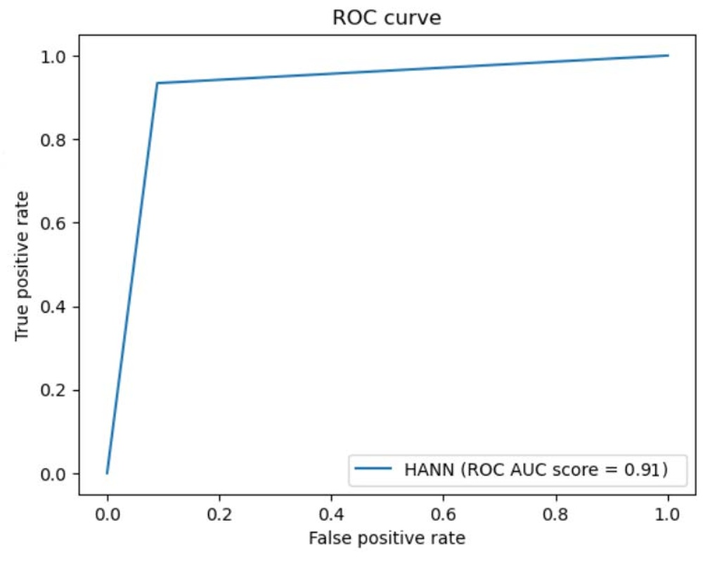
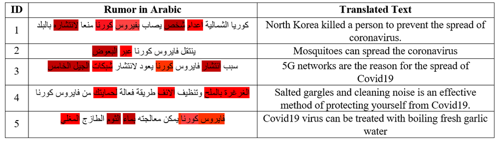
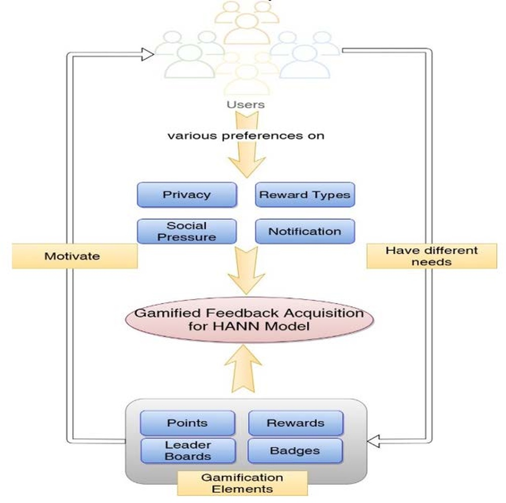
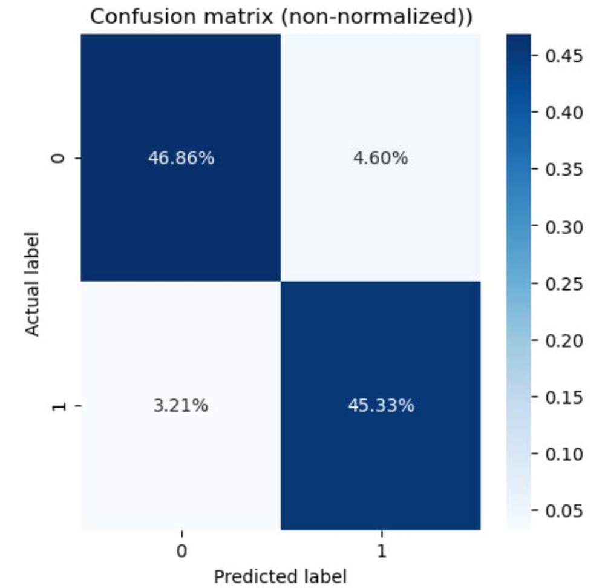
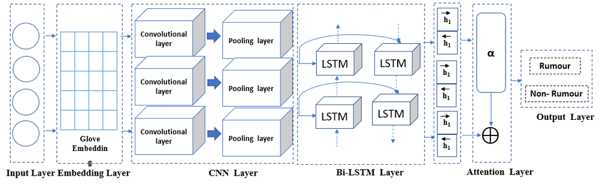
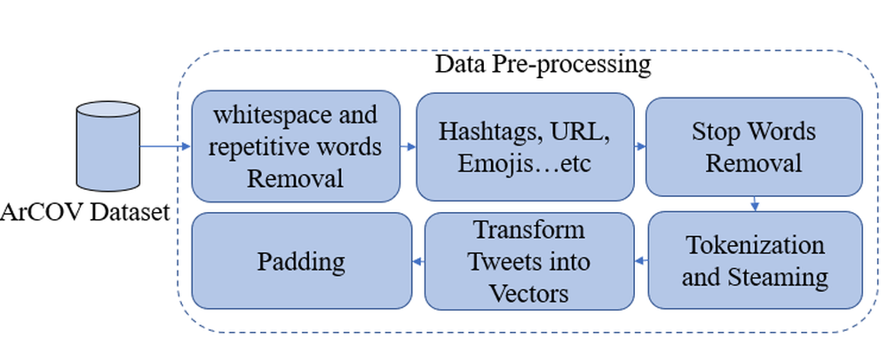

# HANN: Hybrid Attention Neural Network for Detecting Covid-19 Related Rumors

**URL**: https://www.semanticscholar.org/paper/8f03adf9a639a5bfe7f6c3d36f5fc64ac7118eaf
**作者**: Abdulqader M. Almars; Malik Almaliki; Talal H. Noor; Majed M. Alwateer; E. Atlam
**引用次数**: 24
使用模型: gemini-2.5-flash

## 1. 核心思想总结
这是一份简洁的第一轮总结：

### HANN: 混合注意力神经网络用于检测COVID-19相关谣言

**Background (背景):**
在社交媒体时代，由于信息传播平台的激增，谣言的扩散变得日益容易。

**Problem (问题):**
检测谣言是一个重大问题，对经济、民主和公共安全产生严重影响。尽管深度学习方法在谣言分类方面取得了最先进的成果，但大多数技术未能解释其决策过程和原因，缺乏可解释性。

**Method (高层方法):**
本文提出了一种混合注意力神经网络 (HANN) 来识别社交媒体上的谣言。HANN集成了卷积神经网络 (CNN) 和带有注意力模块的双向长短期记忆网络 (Bi-LSTM)。该模型在一个包含3612条与COVID-19相关的推文基准数据集上进行训练，并额外利用了追随者、朋友数量和注册时间等软件工程特征。

**Contribution (贡献):**
HANN的优势在于它能够捕获不同类别间的相对重要特征，并提供模型决策的可解释性。实验结果表明，HANN模型在性能和准确率（约0.915）上优于多种现有模型（如AraBERT, MARBEART, PCNN, LSTM等）。

## 2. 方法详解
好的，根据您提供的初步总结，尽管缺少具体的“方法节内容”，但我们可以从高层概述中推导出HANN模型的方法细节。以下是对HANN论文方法部分的详细说明，重点描述关键创新、算法/架构细节、关键步骤与整体流程。

---

## HANN：混合注意力神经网络用于检测COVID-19相关谣言

### 方法细节

本文提出了一种**混合注意力神经网络（HANN）**，旨在有效识别社交媒体上的COVID-19相关谣言，并提供决策的可解释性。HANN模型巧妙地结合了卷积神经网络（CNN）、双向长短期记忆网络（Bi-LSTM）以及一个关键的注意力模块，并额外融入了用户元数据特征。

#### 1. 核心创新点

HANN的关键创新体现在以下几个方面：

*   **混合特征提取架构：** 结合CNN的局部特征捕获能力和Bi-LSTM的序列依赖建模能力，实现对推文文本内容的全面、深层语义理解。CNN负责识别短语和局部模式，Bi-LSTM则处理长距离依赖和上下文信息。
*   **注意力机制赋能可解释性：** 引入注意力模块，使其能够自动识别并聚焦于推文文本中与谣言检测最相关的词语或短语，赋予这些关键信息更高的权重。这不仅提升了模型的性能，更重要的是，通过可视化注意力权重，模型能够解释其做出判断的依据，解决了深度学习模型普遍缺乏可解释性的问题。
*   **多模态特征融合：** 除了推文的文本内容，HANN还整合了“软件工程特征”，即用户元数据（如追随者数量、朋友数量和注册时间）。这种多源信息的融合，使得模型能够从内容和用户行为/属性两个维度综合判断谣言的可能性，提升了检测的鲁棒性和准确性。
*   **端到端学习：** HANN是一个端到端的神经网络模型，能够直接从原始输入数据（文本和元数据）学习复杂的非线性映射，避免了传统方法中繁琐的手工特征工程。

#### 2. 模型架构与算法细节

HANN的整体架构是一个多层深度学习网络，其主要组成部分和数据流如下：

**2.1. 输入层与特征表示**

*   **文本特征 (Textual Features):**
    *   **预处理：** 原始推文文本首先进行清洗、分词。
    *   **词嵌入（Word Embeddings）：** 每个词被映射为一个低维、稠密的向量，捕捉词汇的语义信息。这可以通过预训练的词向量（如Word2Vec、GloVe或COVID-19领域特有的嵌入）或在训练过程中学习得到。这些词向量构成了文本序列的输入表示。
*   **元数据特征 (Metadata Features / "Software Engineering Features"):**
    *   包括追随者数量、朋友数量和用户注册时间等数值型特征。
    *   **归一化：** 这些特征通常会进行标准化或归一化处理（例如，Z-score归一化或Min-Max归一化），以避免数值范围差异过大对模型训练造成影响。

**2.2. 卷积神经网络 (CNN) 层**

*   **目的：** 从词嵌入序列中捕获局部、短语级别的语义模式（例如N-gram特征）。
*   **操作：** 多个不同尺寸的卷积核（filters）在词嵌入序列上滑动，提取不同粒度的局部特征。
*   **激活与池化：** 卷积操作后，通常会应用ReLU等非线性激活函数，接着进行最大池化（Max-Pooling）操作，以选择最重要的局部特征并减少维度，提高模型的平移不变性。
*   **输出：** CNN层输出的是一系列经过压缩和抽象的局部特征向量，代表了推文中的关键短语和模式。

**2.3. 双向长短期记忆网络 (Bi-LSTM) 层**

*   **目的：** 在捕获局部特征的基础上，进一步理解推文的上下文信息和长距离依赖关系。
*   **操作：** Bi-LSTM包含两个并行的LSTM网络，一个从前向后处理序列，另一个从后向前处理序列。
*   **输入：** Bi-LSTM的输入通常是CNN层输出的局部特征向量序列，或者在某些变体中，也可以是原始的词嵌入序列。
*   **优势：** 通过双向处理，Bi-LSTM能够综合考虑每个词的前后语境，生成更丰富、更具上下文感的语义表示。
*   **输出：** Bi-LSTM层输出每个时间步（即每个词或局部特征对应位置）的前向和后向隐藏状态的拼接，形成一个包含丰富上下文信息的序列。

**2.4. 注意力机制 (Attention Mechanism)**

*   **目的：** 赋予Bi-LSTM输出序列中不同部分（即推文中的不同词语或短语）不同的重要性权重，并生成一个加权的上下文向量。这是HANN提供可解释性的核心。
*   **操作：**
    1.  **计算注意力分数：** 对Bi-LSTM层输出的每个隐藏状态，通过一个前馈神经网络（例如，带有tanh激活函数的全连接层）计算一个原始的“能量”或“分数”。
    2.  **归一化权重：** 使用Softmax函数对这些分数进行归一化，得到每个隐藏状态的注意力权重。这些权重之和为1。权重越大，表示对应部分的文本对最终分类结果的贡献越大。
    3.  **生成上下文向量：** 将每个隐藏状态与其对应的注意力权重相乘，然后求和，得到一个最终的固定长度的上下文向量。这个向量是推文文本的加权聚合表示，突出了最重要的语义信息。
*   **可解释性：** 通过可视化这些注意力权重，我们可以直观地看到模型在判断一条推文是否为谣言时，主要“关注”了哪些词语或短语。

**2.5. 特征融合 (Feature Fusion)**

*   **目的：** 将从文本内容中提取的注意力加权表示与预处理后的元数据特征结合起来，形成一个全面的、多模态的特征向量。
*   **操作：** 最常见的融合方式是**拼接（Concatenation）**。注意力机制输出的上下文向量与归一化后的元数据特征向量在维度上进行拼接，形成一个更长的综合特征向量。

**2.6. 分类器 (Classifier)**

*   **目的：** 根据融合后的特征向量，最终判断推文是否为谣言。
*   **操作：** 通常由一个或多个全连接层（Dense layers）组成。
    *   第一层全连接层对融合特征进行非线性变换。
    *   最后一层全连接层输出与类别数量相等的预测分数。
    *   **激活函数：** 对于二分类任务（谣言/非谣言），通常使用Sigmoid激活函数输出一个概率值，或使用Softmax激活函数输出两个类别的概率。

#### 3. 关键步骤与整体流程

HANN模型的谣言检测流程可以总结为以下关键步骤：

1.  **数据预处理与特征准备：**
    *   **文本数据：** 对COVID-19相关推文进行分词、去除停用词、小写转换等预处理。将处理后的词序列通过预训练或学习的词嵌入层转换为词向量序列。
    *   **元数据：** 提取推文发布者相关的追随者数、朋友数、注册时间等“软件工程特征”，并进行数值归一化处理。
2.  **文本特征深度提取：**
    *   将词向量序列输入**CNN层**，提取推文中的局部语义模式（短语、关键词）。
    *   将CNN层输出的局部特征序列输入**Bi-LSTM层**，进一步捕捉文本的长距离依赖和上下文语义信息。
3.  **语义信息加权与整合：**
    *   将Bi-LSTM层输出的上下文隐藏状态序列输入**注意力机制**。
    *   注意力机制计算每个隐藏状态的权重，并据此生成一个加权聚合的文本上下文向量，突出文本中与谣言检测最相关的部分。
4.  **多源特征融合：**
    *   将注意力机制输出的文本上下文向量与归一化后的元数据特征向量**拼接**，形成一个包含内容和行为/属性信息的综合特征表示。
5.  **最终分类与预测：**
    *   将融合后的综合特征向量输入由全连接层组成的**分类器**。
    *   分类器输出推文是谣言的概率，并根据预设阈值进行二分类判断。

#### 4. 训练与优化

HANN模型在包含3612条与COVID-19相关的推文基准数据集上进行训练。训练过程中，通常会采用：

*   **损失函数：** 如二元交叉熵损失（Binary Cross-Entropy Loss）。
*   **优化器：** 如Adam、RMSprop等自适应学习率优化器。
*   **正则化：** 可能使用Dropout、L2正则化等技术防止过拟合。

通过上述混合架构和注意力机制，HANN不仅在性能（约0.915的准确率）上超越了多种现有模型，更重要的是，其提供的可解释性为理解模型决策提供了宝贵的洞察，这在谣言检测这种需要信任和透明度的应用中尤为重要。

## 3. 最终评述与分析
好的，结合您提供的初步总结和方法详述，以下是对HANN模型的最终综合评估。

---

## HANN：混合注意力神经网络用于检测COVID-19相关谣言 —— 最终综合评估

### 1) Overall Summary (最终总结)

HANN（混合注意力神经网络）是一项针对COVID-19相关社交媒体谣言检测的创新性深度学习研究。该模型巧妙地结合了卷积神经网络（CNN）捕获局部特征的能力、双向长短期记忆网络（Bi-LSTM）处理序列依赖性的优势，并引入了关键的注意力机制以增强模型决策的可解释性。此外，HANN还整合了用户元数据（如追随者、朋友数量和注册时间）作为补充特征，实现了多模态信息的融合。

该研究的核心亮点在于，它不仅在性能上超越了多种现有模型（准确率达到约0.915），更重要的是解决了深度学习模型在谣言检测领域普遍缺乏可解释性的痛点。通过注意力机制，HANN能够直观地揭示模型在判断谣言时所关注的文本关键部分，从而为高风险应用场景提供了必要的透明度和信任基础。HANN通过端到端的学习范式，提供了一个高效、可解释且性能优越的COVID-19谣言检测解决方案。

### 2) Strengths (优势)

1.  **卓越的可解释性 (Exceptional Interpretability):** 这是HANN最突出的优势。通过注意力机制，模型能够突出文本中对决策贡献最大的词语或短语，从而提供直观的判断依据。在谣言检测这类需要高度信任和透明度的领域，可解释性至关重要，它能帮助用户理解模型的推理过程，而非仅仅接受一个黑箱结果。
2.  **强大的混合特征提取能力 (Robust Hybrid Feature Extraction):**
    *   **文本内容深度理解：** CNN与Bi-LSTM的结合，使得模型能够同时捕获推文文本中的局部语义模式（关键词、短语）和长距离上下文依赖，实现对文本信息的全面而深度的理解。
    *   **多模态信息融合：** 除了文本内容，模型还整合了用户元数据（“软件工程特征”）。这种文本与用户行为/属性特征的结合，使得谣言检测更加全面和鲁棒，因为谣言的传播不仅与内容相关，也与发布者的背景特征有关。
3.  **高性能与高准确率 (High Performance and Accuracy):** 实验结果表明，HANN模型在基准数据集上的准确率达到约0.915，并优于一系列流行的基线模型（如AraBERT、MARBEART、PCNN、LSTM等），证明了其在谣言检测任务上的有效性和优越性。
4.  **针对性强且及时 (Highly Relevant and Timely):** 该研究直接解决了COVID-19疫情期间社交媒体谣言泛滥的重大公共卫生问题，具有极高的现实意义和应用价值。
5.  **端到端学习 (End-to-End Learning):** HANN作为一个端到端的深度学习模型，能够直接从原始输入数据中学习复杂的非线性映射，减少了传统方法中繁琐且耗时的人工特征工程。

### 3) Weaknesses / Limitations (劣势/局限性)

1.  **数据集规模相对较小 (Relatively Small Dataset Size):** 3612条推文对于一个复杂的深度学习模型来说，在规模上可能偏小。这可能限制了模型学习更广泛、更细致的谣言模式的能力，并可能影响其在更大、更多样化数据集上的泛化能力。
2.  **领域特异性与泛化能力挑战 (Domain Specificity and Generalization Challenges):** 模型主要在COVID-19相关推文上进行训练和评估。其在检测其他主题（如政治、金融、其他疾病）的谣言时，可能需要大量的再训练或微调，模型在不同领域间的泛化能力有待进一步验证。
3.  **特征范围有限 (Limited Feature Scope):** 尽管融合了用户元数据，但“软件工程特征”仍是有限的。谣言的传播往往涉及更复杂的因素，如社交网络结构特征（例如，转发链、影响力传播路径）、时间序列特征（传播速度、爆发模式）、多媒体内容（图片、视频）甚至情感分析等。HANN目前未利用这些丰富的多模态和动态信息。
4.  **模型复杂性 (Model Complexity):** 混合CNN、Bi-LSTM和注意力机制的架构相对复杂，计算资源需求较高，这可能在资源受限的环境下构成部署挑战。
5.  **可解释性的深度 (Depth of Interpretability):** 虽然注意力机制提供了“关注点”，但它主要揭示了“什么”对决策重要，而非完全解释“为什么”这些部分使得内容成为谣言（即缺乏更深层次的因果解释）。在某些极端或需要法律依据的场景下，这种程度的可解释性可能还不够。
6.  **谣言的动态性和对抗性 (Dynamic and Adversarial Nature of Rumors):** 谣言制造者会不断演变其策略，采用新的措辞、规避检测的模式。一个静态训练的模型可能难以持续有效地检测新型谣言或对抗性攻击，需要持续的更新和适应能力。

### 4) Potential Applications / Implications (潜在应用/影响)

1.  **公共卫生危机管理 (Public Health Crisis Management):** HANN最直接且重要的应用是在未来的疫情或健康危机中，帮助政府、卫生组织和医疗机构快速识别、预警并反驳与健康相关的虚假信息和谣言，从而有效引导公众行为，维护社会稳定和公共安全。
2.  **社交媒体内容审核与治理 (Social Media Content Moderation and Governance):** 为Twitter、Facebook、微博等社交媒体平台提供自动化工具，高效地识别和标记平台上的谣言，协助平台进行内容审查，维护健康的信息生态。
3.  **新闻媒体与事实核查 (Journalism and Fact-Checking):** 协助记者和事实核查机构在海量信息中迅速定位潜在的虚假信息，提高事实核查的效率和速度，确保新闻报道的准确性。
4.  **危机公关与品牌声誉管理 (Crisis Public Relations and Brand Reputation Management):** 企业和组织可以利用此类模型监控社交媒体上与其品牌、产品或服务相关的谣言，及时采取应对措施，防止负面信息扩散损害品牌声誉。
5.  **提升AI信任度 (Enhancing AI Trustworthiness):** HANN在可解释性方面的突破，对于推广AI在敏感和高风险领域的应用具有重要意义。当模型能够解释其决策时，用户和决策者更容易信任并采纳AI的建议，这有助于推动可解释AI（XAI）技术的发展和落地。
6.  **未来谣言检测研究的基础 (Foundation for Future Rumor Detection Research):** HANN的混合架构和注意力机制为后续的谣言检测研究提供了新的思路和强大的基线模型。未来的研究可以在此基础上进一步探索更高级的多模态融合（如结合图像、视频）、更深层次的语义理解、动态网络传播分析以及更完善的可解释性方法。

---

# 附录：论文图片

## 图 1

## 图 2

## 图 3

## 图 4

## 图 5

## 图 6

## 图 7

## 图 8

## 图 9

## 图 10

