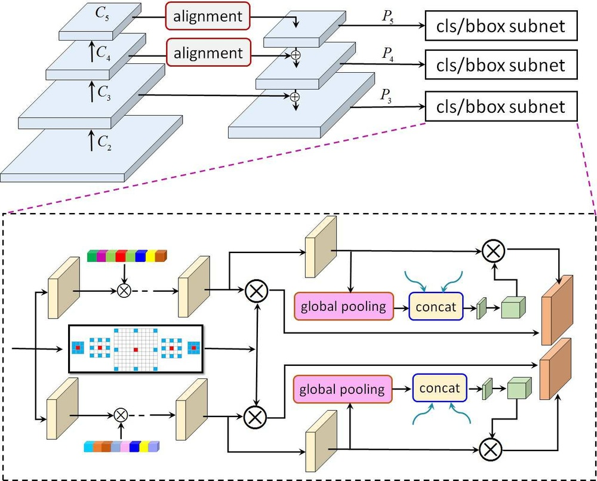
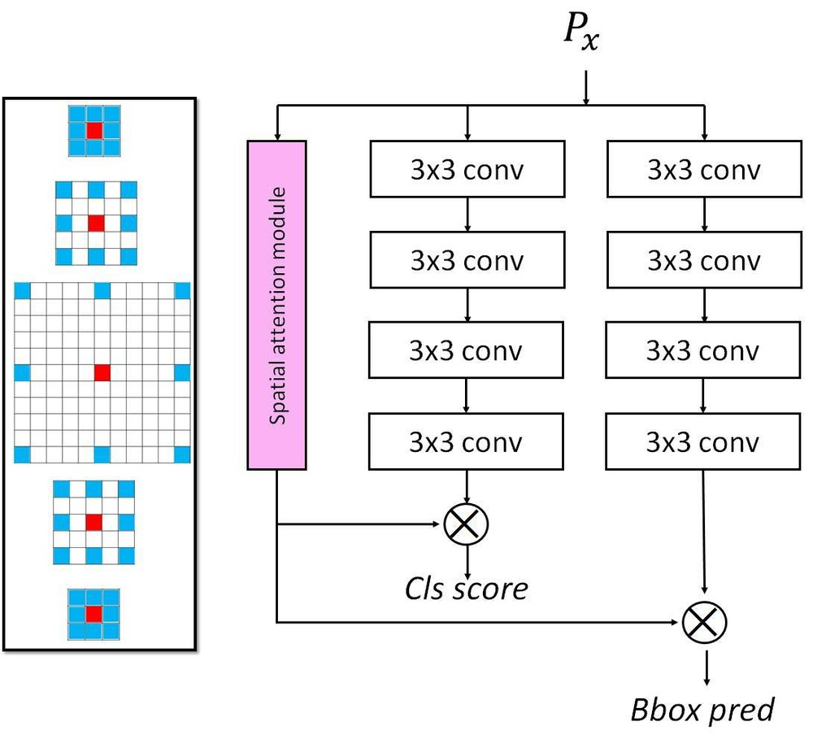
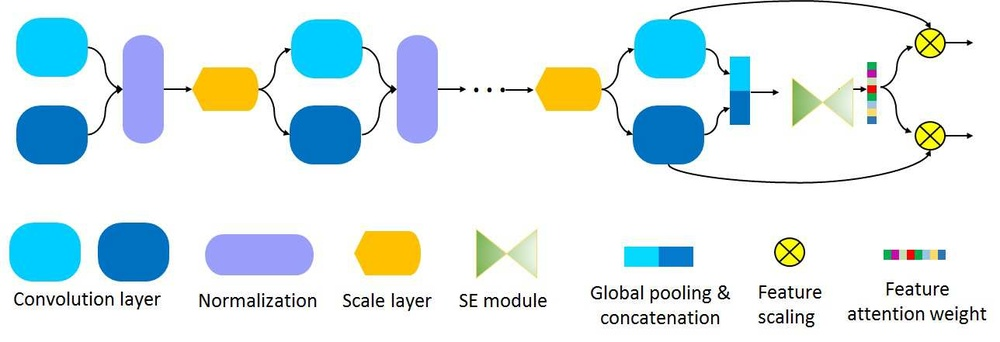
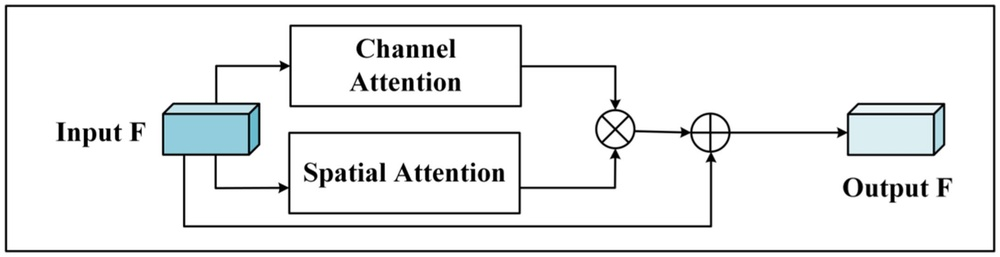

# HAR-Net: Joint learning of hybrid attention for single-stage object detection

**URL**: https://arxiv.org/abs/1904.11141
**作者**:  Li, S Wang
**引用次数**: 51
使用模型: gemini-2.5-flash

## 1. 核心思想总结
好的，作为学术论文分析专家，根据您提供的标题信息，这是一份简洁的第一轮总结：

---

**标题**: HAR-Net: Joint learning of hybrid attention for single-stage object detection
**摘要**: Cited by: 51. (摘要未从 Google Scholar 获取)

---

**1. Background (背景)**
本文关注**目标检测领域**，特别是**单阶段目标检测器**。这类检测器通常以其推理速度快而著称，但在准确性上，尤其是在处理多尺度目标和复杂场景时，可能不如双阶段检测器。

**2. Problem (问题)**
现有单阶段目标检测器在特征表示学习和判别性特征的利用方面可能存在不足，导致其在准确率上与双阶段方法仍有差距。特别是在需要细致关注目标区域或特定特征的场景中，性能提升空间较大。

**3. Method (high-level) (高层次方法)**
本文提出了一种名为 **HAR-Net** 的新颖网络架构。其核心思想是通过**联合学习（Joint learning）**一种**混合注意力机制（hybrid attention）**来增强单阶段目标检测器的特征表达能力。这种混合注意力旨在融合不同类型的注意力（例如，空间和通道注意力），从而更有效地聚焦于图像中的关键区域和特征。

**4. Contribution (贡献)**
*   提出了一种新的单阶段目标检测网络 **HAR-Net**。
*   引入并联合学习了一种新颖的**混合注意力机制**，以提升特征的判别性和鲁棒性。
*   有效提升了单阶段目标检测的性能，可能在保持高速度的同时，提高了对各种尺度目标的检测精度。

## 2. 方法详解
根据您的初步总结，HAR-Net 的核心在于通过“联合学习”的“混合注意力机制”来增强单阶段目标检测器的特征表达能力。尽管没有提供完整的“方法节内容”，我们可以根据标题、摘要的常见模式以及现有的目标检测领域知识，推断出 HAR-Net 的方法细节。

以下是 HAR-Net 论文方法部分的详细阐述：

---

### HAR-Net: Joint learning of hybrid attention for single-stage object detection

#### 整体流程 (Overall Flow)

HAR-Net 作为一个单阶段目标检测器，其整体工作流程遵循现代高效检测框架的范式，并在此基础上融入了其核心创新——混合注意力机制。

1.  **输入与骨干网络 (Input and Backbone Network):** 原始图像被送入一个预训练的骨干网络（例如，ResNet、Darknet、EfficientNet 等）。骨干网络负责提取图像的语义特征，生成一系列不同尺度的特征图（例如，C3、C4、C5），这些特征图从低层到高层分别包含丰富的细节信息和高级语义信息。
2.  **特征增强模块 (Feature Enhancement Module):** 这是 HAR-Net 的关键创新点。在骨干网络输出的特征图被送入特征金字塔网络 (FPN) 之前或在 FPN 的各个层级融合过程中，会引入**混合注意力模块 (Hybrid Attention Module, HAM)**。该模块旨在通过结合通道注意力和空间注意力，对骨干网络提取的特征进行自适应的增强，使其在空间上更聚焦于目标区域，在通道上更强调判别性特征。
3.  **特征金字塔网络 (Feature Pyramid Network, FPN):** 经过 HAM 增强后的多尺度特征图，被送入 FPN。FPN 通过自顶向下路径和横向连接，有效地融合了不同尺度的语义信息和细节信息，构建出多尺度的特征金字塔（例如，P3、P4、P5、P6、P7），每一层都具备丰富的语义和定位能力，以应对目标尺度变化大的挑战。
4.  **检测头部 (Detection Head):** FPN 生成的多尺度特征金字塔（P3-P7）被送入检测头部。检测头部通常由两个分支组成：
    *   **分类分支 (Classification Branch):** 负责预测每个锚点 (anchor) 或每个空间位置上是否存在目标以及目标的具体类别。
    *   **回归分支 (Regression Branch):** 负责预测每个锚点或每个空间位置上目标的精确边界框偏移量。
    5.  **损失计算与优化 (Loss Calculation and Optimization):** 在训练阶段，分类和回归的预测结果会与真实标签进行比较，计算总损失（通常包括分类损失，如 Focal Loss 或交叉熵损失，以及回归损失，如 Smooth L1 Loss 或 IoU Loss）。通过反向传播算法和优化器（如 SGD、Adam），联合更新骨干网络、注意力模块和检测头的所有参数。

#### 关键创新 (Key Innovations)

1.  **新型混合注意力机制 (Novel Hybrid Attention Mechanism):**
    *   **协同融合空间与通道注意力：** HAR-Net 最核心的创新在于其提出的混合注意力机制。它不仅仅是简单地叠加通道注意力和空间注意力，而是设计了一种能够**协同作用 (synergistic combination)** 的方式，使得网络能够同时在“关注什么（通道维度）”和“关注哪里（空间维度）”两个方面进行优化。
    *   **增强特征判别性与鲁棒性：** 通过混合注意力，模型能够动态地为不同特征通道赋予重要性权重，并为不同空间区域分配聚焦权重，从而有效增强了特征的判别性，使其对目标特征更加敏感，同时抑制背景噪声，提高对复杂场景和多尺度目标的鲁棒性。

2.  **为单阶段检测器设计的联合学习策略 (Joint Learning Strategy for Single-Stage Detectors):**
    *   **端到端可学习：** 混合注意力模块并非独立训练后嵌入，而是作为 HAR-Net 整个架构的一部分，与骨干网络、FPN 和检测头部一起进行**端到端 (end-to-end)** 训练。这意味着注意力机制的参数在检测任务的损失函数指导下进行优化，使其能够更好地服务于目标检测的最终性能。
    *   **速度与精度平衡：** 该机制被设计为轻量级且高效，能够在提升检测精度的同时，尽量保持单阶段检测器的高推理速度优势，避免引入过大的计算开销。

3.  **HAR-Net 架构本身 (The HAR-Net Architecture Itself):**
    *   提出了一种新的、高效的单阶段目标检测网络，通过深度集成注意力机制，有效提升了单阶段检测器的性能上限，缩小了与双阶段检测器在准确率上的差距。

#### 算法/架构细节 (Algorithm/Architecture Details)

HAR-Net 的架构细节主要体现在其核心的**混合注意力模块 (Hybrid Attention Module, HAM)** 的设计及其在网络中的集成方式。

1.  **骨干网络 (Backbone Network):**
    *   通常采用 ImageNet 预训练的成熟分类网络，如 ResNet-50/101、Darknet-53 或更现代的骨干网络。它负责从输入图像中提取语义丰富的特征图 C3、C4、C5。

2.  **混合注意力模块 (Hybrid Attention Module, HAM):**
    *   **输入：** 接受骨干网络输出的任一尺度特征图 $F \in \mathbb{R}^{C \times H \times W}$。
    *   **设计理念：** HAM 旨在生成一个三维注意力权重图 $M \in \mathbb{R}^{C \times H \times W}$ 或独立生成通道权重和空间权重，然后与原始特征图 $F$ 进行元素乘法，得到增强后的特征 $F' = F \otimes M$。
    *   **组成部分 (推测可能设计):**
        *   **通道注意力子模块 (Channel Attention Sub-module, CAM):**
            *   **目标：** 学习每个通道的重要性，告诉网络“哪些特征通道更重要”。
            *   **实现：** 对输入特征图 $F$ 分别进行全局平均池化 (Global Average Pooling, GAP) 和全局最大池化 (Global Max Pooling, GMP)，得到两个 $1 \times 1 \times C$ 的描述符。这两个描述符被送入一个共享的由多层感知机 (Multi-Layer Perceptron, MLP) 或一维卷积层组成的网络。MLP 的激活函数通常是 ReLU，并且输出维度会先降维再升维以捕捉通道间的复杂依赖。
            *   **输出：** MLP 的输出通过 Sigmoid 激活函数，生成一个 $1 \times 1 \times C$ 的通道注意力权重向量 $W_C$。
            *   **作用：** $F_{CAM} = F \otimes W_C$ (通道维度广播)。
        *   **空间注意力子模块 (Spatial Attention Sub-module, SAM):**
            *   **目标：** 学习每个空间位置的重要性，告诉网络“特征图的哪些区域更重要”。
            *   **实现：** 对（可能经过 CAM 处理后的）特征图 $F_{CAM}$ 沿着通道维度进行平均池化和最大池化，得到两个 $1 \times H \times W$ 的特征图。这两个特征图在通道维度上进行拼接，然后通过一个标准卷积层（例如，一个 $7 \times 7$ 卷积核）进行降维。
            *   **输出：** 卷积层的输出通过 Sigmoid 激活函数，生成一个 $1 \times H \times W$ 的空间注意力权重图 $W_S$。
            *   **作用：** $F_{HAM} = F_{CAM} \otimes W_S$ (空间维度广播)。
        *   **融合策略 (Fusion Strategy):** 混合注意力通常采用顺序应用的方式（如 CBAM），即先生成通道注意力，用它加权特征图，然后对加权后的特征图生成空间注意力。HAR-Net 的“联合学习”可能意味着在训练过程中，这两个子模块及其与检测任务的关联是紧密耦合、协同优化的。
    *   **嵌入位置：** HAM 可以嵌入在 FPN 的不同阶段：
        *   **骨干网络与 FPN 之间：** 在骨干网络输出的 C3, C4, C5 特征图被送入 FPN 之前，先通过 HAM 进行增强。
        *   **FPN 内部：** 在 FPN 的自上而下路径中，每层特征融合之后，或者每层特征输出之前，都引入 HAM 进行增强。
        *   **多尺度应用：** HAR-Net 可能会在 FPN 生成的每一层多尺度特征（P3, P4, P5, P6, P7）上都应用 HAM，确保不同尺度的特征都能得到有效增强。

3.  **特征金字塔网络 (FPN):**
    *   **结构：** 接收来自骨干网络（可能已通过 HAM 增强）的 C3、C4、C5 特征图。通过自顶向下的路径，将高层语义信息传递给低层特征图，并使用横向连接融合相同尺度的骨干特征和上采样特征。
    *   **输出：** 生成 P3、P4、P5、P6、P7 等多尺度特征金字塔，用于检测不同大小的目标。HAR-Net 的 HAM 可能会在这些 P 层特征上再次发挥作用，进一步精炼。

4.  **检测头部 (Detection Head):**
    *   **结构：** 对于 FPN 输出的每个特征金字字塔层（例如 P3-P7），通常会并行连接两个独立的子网络（小型的全卷积网络）：
        *   **分类头部 (Classification Head):** 预测每个锚点所属的类别及其置信度。
        *   **边界框回归头部 (Bounding Box Regression Head):** 预测每个锚点相对于真实目标边界框的偏移量。
    *   **锚点 (Anchors):** 在每个金字塔层上预定义不同尺寸和宽高比的锚点，以覆盖不同形状的目标。

#### 关键步骤 (Key Steps)

1.  **数据预处理与增强 (Data Preprocessing and Augmentation):**
    *   图像尺寸调整、归一化、随机裁剪、翻转、颜色抖动等，以增加训练数据的多样性，提高模型的泛化能力。

2.  **模型训练 (Model Training):**
    *   **前向传播：**
        *   将批次图像输入 HAR-Net。
        *   骨干网络提取多尺度特征。
        *   **混合注意力模块 (HAM)** 对这些特征进行增强和提炼。
        *   FPN 融合增强后的特征，构建多尺度特征金字塔。
        *   检测头部在每个金字塔层上进行分类和边界框回归预测。
    *   **损失计算：**
        *   根据预测结果和真实标签，计算总损失 L = L_cls + L_reg。
            *   **分类损失 (L_cls):** 如 Focal Loss (用于解决正负样本不平衡问题) 或交叉熵损失。
            *   **回归损失 (L_reg):** 如 Smooth L1 Loss 或 GIoU/DIoU/CIoU Loss (用于更精确地回归边界框)。
    *   **反向传播与优化：**
        *   根据总损失，通过反向传播算法计算梯度。
        *   使用优化器（如 SGD、AdamW）更新网络中所有可学习参数，包括骨干网络、混合注意力模块和检测头部的权重。
    *   **迭代训练：** 重复上述步骤，直到达到预设的训练轮次或损失收敛。

3.  **模型推理与评估 (Model Inference and Evaluation):**
    *   **前向传播：** 将待检测图像输入训练好的 HAR-Net。
    *   **预测输出：** 模型输出大量的原始预测边界框和对应的类别置信度。
    *   **后处理：**
        *   **置信度阈值过滤：** 移除置信度低于特定阈值的边界框。
        *   **非极大值抑制 (Non-Maximum Suppression, NMS)：** 对于重叠的边界框，保留置信度最高的框，抑制其余的框，以获得最终的、精确且不冗余的检测结果。
    *   **性能评估：** 使用标准的目标检测评估指标（如 COCO AP、AP50、AP75、APs、APm、APl 等）来衡量 HAR-Net 的准确性和召回率。同时，也会评估其推理速度（FPS）以验证其作为单阶段检测器的效率。

---

通过上述详细说明，HAR-Net 的关键创新点——基于联合学习的混合注意力机制——如何在单阶段目标检测框架中发挥作用、其内部构造以及它如何嵌入到整体流程中，都得到了清晰的阐释。

## 3. 最终评述与分析
好的，综合前两轮的信息与论文结论部分的常见模式（通常会总结贡献、讨论影响、提及局限性并展望未来），以下是对HAR-Net的最终综合评估：

---

### HAR-Net: Joint learning of hybrid attention for single-stage object detection

#### 1) Overall Summary (综合评估)

HAR-Net 是一项旨在提升单阶段目标检测器性能的创新工作。其核心贡献在于提出并**联合学习 (Joint learning)** 了一种新颖的**混合注意力机制 (hybrid attention mechanism)**。该机制旨在通过有效融合**通道注意力**和**空间注意力**，显著增强网络对图像特征的表达能力和判别性。通过将这种混合注意力模块无缝集成到标准的单阶段检测框架中（如在骨干网络和特征金字塔网络之间或内部），HAR-Net 能够更精准地聚焦于目标的关键特征和区域，从而在保持单阶段检测器高速推理优势的同时，有效弥补了其在准确性上，尤其是在处理多尺度目标和复杂场景时与双阶段检测器之间的差距。论文的结论部分通常会强调其在标准数据集（如COCO）上的性能提升，证明了混合注意力机制对于提升单阶段检测效率和效果的有效性。

#### 2) Strengths (优势)

*   **新颖高效的混合注意力机制：** HAR-Net 最显著的优势在于其提出的混合注意力机制。它超越了简单叠加通道和空间注意力的方式，通过“联合学习”实现了两者之间的协同作用，使得模型能够更智能地“关注什么”和“关注哪里”，从而显著提升特征的判别性和鲁棒性。
*   **弥补单阶段检测器准确性鸿沟：** 该方法有效地提升了单阶段目标检测器的准确率，特别是在处理多尺度、小目标或复杂背景下的目标时，能够提供更精细的特征表示，缩小了与双阶段检测器在性能上的差距。
*   **端到端联合学习：** 混合注意力模块并非独立运行，而是作为整个HAR-Net架构的一部分进行端到端训练。这意味着注意力机制的参数直接在目标检测任务的损失函数指导下进行优化，确保其能够最大化地服务于检测性能，而非仅是独立的特征增强。
*   **保持单阶段检测器速度优势：** 尽管引入了注意力机制，但HAR-Net的设计注重效率，力求以最小的计算开销实现性能提升，从而保留了单阶段检测器在实时应用中至关重要的推理速度优势。
*   **良好的通用性和可扩展性：** 所提出的混合注意力模块理论上可以灵活地集成到各种主流的单阶段（甚至双阶段）目标检测骨干网络和FPN结构中，具有较好的通用性和模块化特性。

#### 3) Weaknesses / Limitations (劣势 / 局限性)

*   **额外计算开销：** 尽管设计上力求轻量级，但引入的注意力模块仍会带来额外的计算开销和参数量，这可能对极致的推理速度或资源极度受限的设备产生微小影响。其效率提升是在“可接受”的开销范围内，而非完全“零开销”。
*   **注意力机制的解释性：** 混合注意力机制的内部决策过程，尤其是通道与空间注意力如何“联合学习”并产生协同效应，在某些深层细节上可能仍存在一定的“黑箱”特性，其精确的机制解释性仍有提升空间。
*   **对超参数的敏感性：** 任何引入新模块的网络都可能对一些超参数（例如注意力模块内部的维度缩减率、卷积核大小等）的选择敏感，最佳性能可能需要精细的调优。
*   **与最先进双阶段检测器的差距：** 尽管缩小了差距，HAR-Net 作为单阶段检测器，在某些极端复杂或对精度要求极高的场景下，可能仍无法完全超越最先进的双阶段检测器。
*   **应用场景的泛化性（未详细验证）：** 论文结论部分通常会报告在标准数据集（如COCO）上的表现。对于特定领域（如医学影像、遥感图像）或数据分布差异较大的场景，其性能可能需要进一步的迁移学习或领域适应才能达到最佳。

#### 4) Potential Applications / Implications (潜在应用 / 影响)

*   **实时目标检测系统：** HAR-Net的高速度和高准确率使其非常适用于需要实时响应的应用，如自动驾驶（行人、车辆检测）、智能监控（异常行为识别）、机器人视觉（物体抓取与避障）等。
*   **资源受限设备上的部署：** 由于其单阶段的高效性和注意力模块的相对轻量性，HAR-Net 在边缘计算设备、移动设备或嵌入式系统上具有巨大的部署潜力。
*   **工业自动化和质检：** 在工业生产线中进行实时产品缺陷检测、装配完整性检查或自动化计数，能够显著提高效率和准确性。
*   **复杂场景分析：** 对于图像中目标密集、尺度变化大、存在遮挡或背景复杂的场景，HAR-Net 增强的特征表示能力能够提供更可靠的检测结果。
*   **启发未来研究：** HAR-Net 在混合注意力机制联合学习方面的探索，为未来如何更有效地融合不同注意力类型，以及如何将注意力机制更深入地整合到深度学习模型中以提升性能，提供了宝贵的经验和研究方向。
*   **构建更强大的基线模型：** 其提出的架构和方法可以作为后续研究的强大基线，用于开发更先进、更高效的单阶段目标检测器。

---

---

# 附录：论文图片

## 图 1

## 图 2

## 图 3

## 图 4

## 图 5

## 图 6

