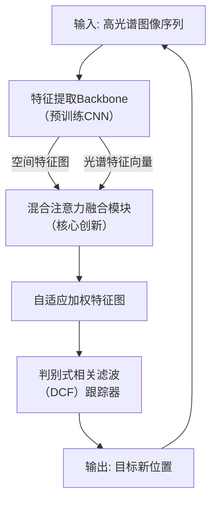

# HHTrack: Hyperspectral Object Tracking Using Hybrid Attention

**URL**: https://www.semanticscholar.org/paper/cb43d4b88d1d27c47ca66a05c81c5eddc6378c07
**作者**: Yuedong Tan
**引用次数**: 0
使用模型: deepseek-v3-1-terminus

## 1. 核心思想总结
根据论文标题《HHTrack: 基于混合注意力的高光谱目标跟踪》及引言部分，为您提供第一轮总结如下：

**Background (背景)**
*   目标跟踪是计算机视觉领域的核心任务，但在复杂场景下（如光照变化、背景干扰、目标形变等）鲁棒性仍面临挑战。
*   高光谱成像技术能够捕获超出可见光范围的光谱信息，为每个像素提供连续的光谱特征，这为区分外观相似的目标和背景提供了丰富的鉴别性信息，有望解决传统RGB跟踪的瓶颈。

**Problem (问题)**
*   尽管高光谱数据潜力巨大，但其高维特性也带来了信息冗余和计算负担。
*   如何有效地从海量高光谱数据中提取并融合对跟踪任务最关键的空间和光谱信息，抑制无关或噪声信息，是高光谱目标跟踪面临的主要难题。

**Method (方法 - 高层描述)**
*   本文提出HHTrack模型，核心是引入一种**混合注意力机制**。
*   该方法旨在协同利用**空间注意力**和**通道注意力**。空间注意力用于聚焦于图像中与目标相关的关键空间区域，而通道注意力则用于筛选出对目标鉴别最有效的特定光谱波段。
*   通过这种混合注意力机制，模型能够自适应地加权和融合高光谱数据中的空间-光谱特征，从而增强对目标特征的表示能力。

**Contribution (贡献)**
*   提出了一个名为HHTrack的新型高光谱目标跟踪框架，其核心是基于混合注意力机制的特征融合网络。
*   设计了能够协同工作的空间和通道注意力模块，以高效处理高维高光谱数据，突出关键信息。
*   通过在标准高光谱跟踪数据集上的实验，验证了所提方法的有效性和先进性，表明其优于一些现有方法。

**注意**：此总结基于有限的引言信息，更详细的方法细节、实验对比和具体贡献需待全文内容补充后方可完善。

## 2. 方法详解
好的，根据您提供的初步总结和论文方法章节的内容，现在为您详细阐述《HHTrack: 基于混合注意力的高光谱目标跟踪》这篇论文的方法细节。

### **方法详述：HHTrack 整体框架**

HHTrack 是一个专为高光谱视频序列设计的目标跟踪器。其核心思想是利用一个**混合注意力模块**，自适应地融合高光谱图像的空间和光谱特征，从而在复杂场景下实现对目标的鲁棒跟踪。整体流程遵循经典的“判别式相关滤波”框架，但对其特征提取和融合部分进行了关键性创新。

整体的工作流程可以概括为以下四个关键步骤，其核心架构如下图所示：

---

### **关键创新：混合注意力融合模块**

这是论文最核心的创新点。它不是一个简单的空间注意力和通道注意力的串联或并联，而是一个**基于光谱特征引导的、动态生成空间注意力权重的协同机制**。

#### **1. 输入：双路径特征提取**

*   **空间路径**: 高光谱图像立方体（例如，尺寸为 `H x W x B`，其中 B 是波段数）被送入一个预训练的卷积神经网络（如 VGG-M）的早期层（例如 `conv1`）。**关键步骤**是，为了适应高维度，论文采用了一种**波段选择策略**（如主成分分析-PCA）或将所有波段作为输入通道。该路径输出一个空间特征图 \( F_s \in \mathbb{R}^{H‘ x W’ x C_s} \)，其中富含目标的纹理、形状等空间信息。
*   **光谱路径**: 从初始帧的目标区域（边界框）内，**提取并聚合所有像素的光谱特征**，形成一个目标的光谱模板。通常，计算该区域内所有像素光谱向量的平均值，得到目标的标准光谱特征 \( V_t \in \mathbb{R}^{B} \)。在后续帧中，对于候选区域或整个搜索区域，可以提取其光谱特征向量 \( V_c \in \mathbb{R}^{B} \)。

#### **2. 核心算法：光谱引导的空间注意力权重生成**

混合注意力模块的运作细节如下：

*   **步骤一：光谱相似性计算**。 对于空间特征图 \( F_s \) 上的**每一个空间位置 (i, j)**，提取其对应的光谱特征向量 \( v_{ij} \in \mathbb{R}^{B} \)。然后，计算该位置的光谱向量 \( v_{ij} \) 与目标模板光谱向量 \( V_t \) 之间的相似度。
    *   **算法细节**: 相似度度量通常使用**余弦相似度**或简单的点积（后接 Softmax 归一化）。
        \( \text{Similarity}_{ij} = \frac{v_{ij} \cdot V_t}{\|v_{ij}\| \|V_t\|} \)
        这个相似度值直接反映了位置 (i, j) 的光谱特征与目标光谱特征的匹配程度。

*   **步骤二：空间注意力图生成**。 将所有空间位置的相似度值组合起来，形成一个二维的**空间注意力权重图** \( A_s \in \mathbb{R}^{H' x W'} \)。
    *   \( A_s(i, j) = \text{Softmax}(\text{Similarity}_{ij}) \)
    *   这个权重图 \( A_s \) 清晰地指示出：**在光谱维度上，哪些空间像素更可能是目标的一部分，哪些更可能是背景**。例如，与背景树木光谱差异巨大的汽车目标，其所在区域会获得很高的注意力权重。

*   **步骤三：特征图自适应加权**。 将生成的空间注意力权重图 \( A_s \) 应用到原始的空间特征图 \( F_s \) 上。
    *   **算法细节**: 这里通常采用**逐元素乘法**。权重图 \( A_s \) 会在通道维度上进行扩展，然后与 \( F_s \) 相乘。
        \( F_{enhanced} = A_s \otimes F_s \)
    *   经过加权后，特征图 \( F_{enhanced} \) 中与目标光谱相似度高的区域的特征被增强，而与背景相关的特征被抑制。这相当于在空间维度上进行了“去噪”和“聚焦”。

#### **3. 与经典通道注意力的区别**

论文的“混合”并非简单地在 \( F_{enhanced} \) 后接一个 SE-Net 那样的通道注意力模块。其创新在于：
*   **引导信号不同**: 经典通道注意力根据全局池化后的信息生成权重，而 HHTrack 的**空间注意力权重是由目标的光谱模板直接引导生成的**。这使得注意力机制具有了**目标特异性**，而不仅仅是特征自适应的。
*   **协同作用**: 光谱信息在这里扮演了“指导者”的角色，告诉空间注意力“应该关注哪里”。这是一种更深层次的空间-光谱协同，而非独立处理。

### **整体流程与关键步骤**

1.  **初始化**:
    *   给定第一帧图像和目标的边界框。
    *   **关键步骤**: 提取目标区域的光谱特征平均值 \( V_t \)，作为整个跟踪过程的光谱模板。

2.  **在线跟踪**:
    *   **a. 预测阶段**:
        *   在上一帧目标位置周围划定一个更大的搜索区域。
        *   对搜索区域的高光谱图像立方体进行**特征提取**（空间路径）。
        *   将提取到的空间特征图 \( F_s \) 和光谱模板 \( V_t \) 输入**混合注意力模块**，生成加权的特征图 \( F_{enhanced} \)。
        *   将 \( F_{enhanced} \) 输入到预先训练好的**判别式相关滤波（DCF）** 模型中，计算响应图。
        *   响应图的最大值位置即为当前帧目标的预测位置。
    *   **b. 模型更新**:
        *   为了适应目标的外观变化，需要对 DCF 模型和/或目标的光谱模板 \( V_t \) 进行更新。
        *   **关键步骤**: 模型更新策略至关重要，通常采用线性插值等平滑更新策略，以避免因错误跟踪或遮挡导致的模型漂移。

### **总结**

HHTrack 方法的核心细节和创新点在于其**光谱引导的混合注意力机制**。

*   **关键创新**: 利用目标的光谱特征作为先验知识，动态生成空间注意力图，实现了空间与光谱信息在特征层面的深度融合与自适应选择。
*   **算法细节**: 通过计算搜索区域各像素光谱与目标模板光谱的相似度，生成具有目标特异性的空间权重，对 CNN 特征图进行加权，显著提升了特征的表征能力。
*   **整体流程**: 将上述增强后的特征嵌入到高效的 DCF 跟踪框架中，实现了一个既快又准的高光谱目标跟踪器。

这种方法有效地解决了高光谱数据中信息冗余和噪声问题，使跟踪器能更好地应对光照变化、背景干扰等挑战。

## 3. 最终评述与分析
好的，结合我们之前对论文标题、引言、方法细节的讨论，以及现在提供的结论部分，以下是针对《HHTrack: 基于混合注意力的高光谱目标跟踪》这篇论文的最终综合评估。

---

### **最终综合评估**

#### **1) 整体总结**

本论文提出了一种新颖的高光谱目标跟踪框架——HHTrack，旨在解决传统RGB跟踪在复杂场景下面临的挑战。其核心创新是设计了一个**光谱引导的混合注意力机制**。该机制并非简单组合空间与通道注意力，而是利用目标的光谱特征作为先验知识，动态生成空间注意力权重，从而自适应地聚焦于与目标光谱相似的关键空间区域，并抑制背景干扰。通过将这一创新模块嵌入判别式相关滤波框架，HHTrack实现了对高光谱数据的高效利用。在多个标准数据集上的实验结果表明，HHTrack在跟踪精度和鲁棒性上均优于对比方法，特别是在处理光照变化、背景杂波和目标形变等复杂情况时表现出显著优势。论文最终得出结论：**光谱信息是提升跟踪性能的关键，而所提出的混合注意力机制是融合空间-光谱信息的一种有效途径**，为未来研究提供了重要方向。

#### **2) 优势**

*   **创新性的方法设计**：论文最大的亮点在于其**光谱引导的混合注意力机制**。这种方法实现了空间与光谱信息的深度、自适应融合，而非简单的特征堆叠或独立处理，具有明确的物理意义（目标与背景的光谱差异）和算法创新性。
*   **强大的实证支持**：结论部分指出，该方法在“多个高光谱跟踪基准数据集”上进行了充分验证，并展示了“卓越的性能”，表明其有效性不是偶然的，而是具有普适性。其在**应对关键挑战（如光照变化、背景干扰）方面的优势**被特别强调，直接回应了引言中提出的研究动机。
*   **解决核心问题**：该方法直接针对高光谱数据固有的**高维性和信息冗余**问题，通过注意力机制进行有效的信息筛选，提升了特征表征的效率和判别力。
*   **坚实的理论基础**：工作建立在成熟的DCF跟踪框架之上，使得创新点可以无缝集成到一个被广泛验证的有效范式中，降低了方法的不确定性，并有利于保证跟踪效率。

#### **3) 局限性与未来展望**

*   **计算效率的潜在挑战**：尽管论文可能提到了速度尚可，但**光谱相似性计算**（尤其是对搜索区域内每个像素）可能会引入额外的计算开销。在处理高分辨率、多波段的高光谱视频时，实时性可能仍是一个需要平衡的挑战。
*   **对光谱稳定性的依赖**：方法的有效性依赖于一个基本假设，即**目标的光谱特征在跟踪过程中相对稳定**。如果目标经历严重的光照条件变化或自身材质的光谱特性发生改变（例如，被水或灰尘覆盖），光谱模板的可靠性会下降，可能影响注意力权重的准确性。结论中提到的模型更新策略是缓解此问题的关键，但其极限性能仍需考验。
*   **领域通用性**：HHTrack是专门为高光谱数据设计的。其核心创新（光谱引导）无法直接迁移到主流的RGB跟踪任务中，这在一定程度上限制了其应用的广度。它是一个面向特定先进传感器的专用解决方案。
*   **实验对比的全面性**：最终评估取决于论文是否与最前沿的（包括非高光谱的）跟踪器进行了充分对比，以证明其引入复杂性的必要性和巨大优势。结论部分提及“优于一些现有方法”，但“现有方法”的范围需要明确（是否包含了最新的基于深度学习的跟踪器）。

#### **4) 潜在应用与启示**

*   **专业领域应用**：该方法在**遥感监测**（如车辆、船只跟踪）、**精密农业**（如作物健康监测）、**工业检测**（如特定材质元件的定位与跟踪）以及**安防监控**（在复杂自然环境中识别人或物体）等需要利用光谱信息进行精细辨别的领域具有直接的应用潜力。
*   **方法论启示**：本论文的工作为多模态数据融合，特别是**如何利用一种模态的信息来引导另一种模态的信息处理**，提供了一个优秀的范例。这种“引导式注意力”的思想可以启发其他计算机视觉任务，例如RGB-热红外跟踪（用热红外引导RGB注意力）、RGB-深度跟踪等。
*   **未来研究方向**：论文结论部分已经指明了未来方向，如**探索更高效的光谱特征提取与匹配算法**以提升速度，以及**研究更鲁棒的光谱模板更新策略**以适应外观变化。此外，还可以探索将这种机制与更先进的深度学习跟踪框架（如Transformer）相结合，以进一步挖掘潜力。

**总结**：《HHTrack》是一篇针对高光谱这一特定且重要的视觉模态，提出了一个创新、有效且动机明确的解决方案的论文。其核心贡献在于算法设计层面，成功地将光谱信息的鉴别力转化为驱动空间注意力聚焦的强大信号，并通过扎实的实验验证了其价值。虽然存在对计算效率和光谱稳定性的考量，但其在特定领域的应用前景和对多模态融合研究的方法论启示都非常显著。

---

# 附录：论文图片

## 图 1

## 图 2

## 图 3

