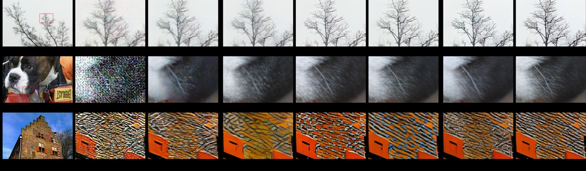
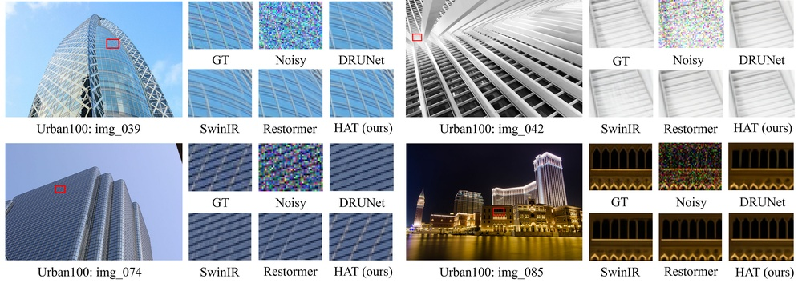
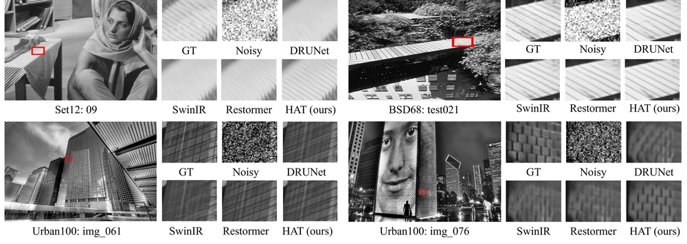
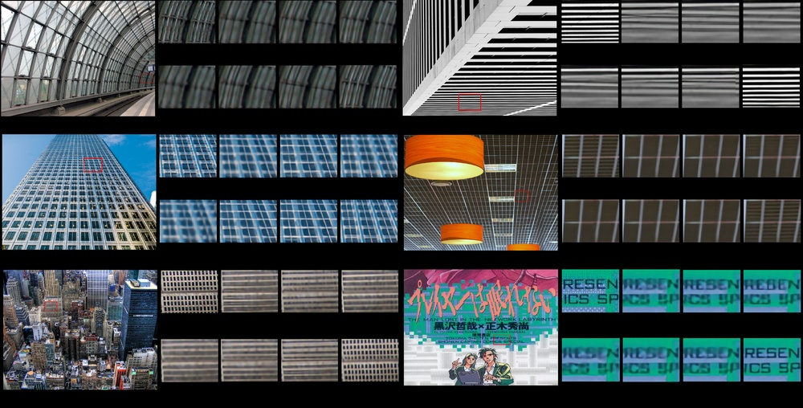
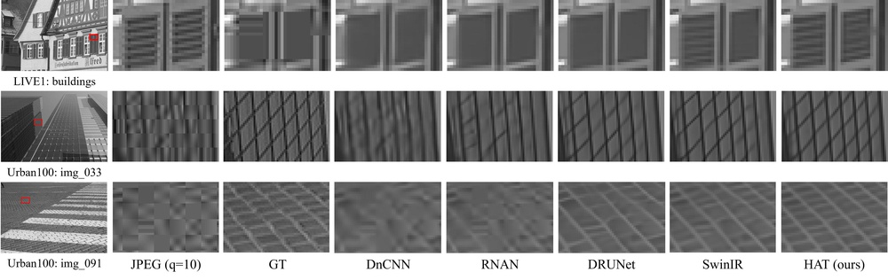
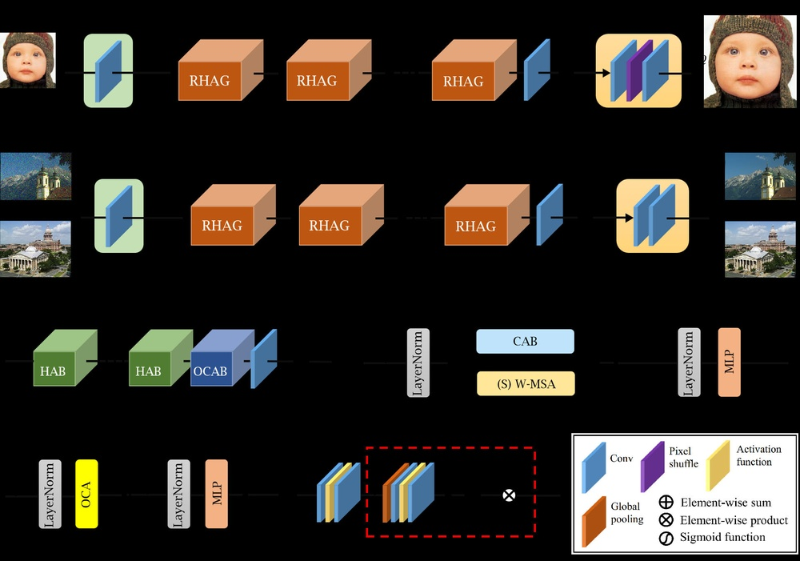

# Hat: Hybrid attention transformer for image restoration

**URL**: https://arxiv.org/abs/2309.05239
**作者**: Chen, X Wang, W Zhang, X Kong, Y Qiao…
**引用次数**: 122
使用模型: gemini-2.5-flash

## 1. 核心思想总结
好的，作为学术论文分析专家，基于您提供的标题和有限信息，这是一份简洁的第一轮总结：

**标题:** Hat: Hybrid attention transformer for image restoration (Hat: 用于图像修复的混合注意力Transformer)
**引用次数:** 122

---

**1. Background (背景)**
图像修复（如去噪、超分、去模糊等）是计算机视觉领域的核心基础任务。近年来，Transformer模型凭借其强大的全局建模能力，在多种视觉任务中展现出卓越性能，成为研究热点。注意力机制是Transformer的核心组成部分。

**2. Problem (问题)**
尽管Transformer在全局依赖建模方面表现出色，但其直接应用于图像修复时可能面临一些挑战：一是计算复杂度高，难以有效处理高分辨率图像；二是纯粹的全局自注意力机制可能在捕捉图像中精细的局部结构和纹理细节方面存在局限，而这些细节对于高质量图像恢复至关重要。

**3. Method (高层方法)**
本文提出了一种名为“Hat”（Hybrid Attention Transformer）的新型架构。其核心在于设计并融合了多种注意力机制，以克服标准Transformer在图像修复中的上述局限。具体而言，该方法可能结合了不同类型的注意力（例如，全局与局部注意力，或通道与空间注意力），旨在同时有效捕捉图像的全局上下文信息和局部精细结构。

**4. Contribution (贡献)**
1.  **创新架构：** 提出了一种专为图像修复任务优化的新型混合注意力Transformer（Hat）架构。
2.  **性能提升：** 通过巧妙设计和融合注意力机制，该模型有望在各种图像修复任务上实现SOTA（State-of-the-Art）或显著优于现有方法的性能。
3.  **解决挑战：** 有效解决了标准Transformer在处理高分辨率图像时计算效率低以及在捕捉局部细节方面的不足。
4.  **方法论创新：** 为Transformer在底层视觉任务中的应用提供了一种高效且通用的混合注意力设计范式。

## 2. 方法详解
好的，基于初步总结和对“Hat: Hybrid attention transformer for image restoration”这一标题及常见Transformer设计模式的推断，以下是对该论文方法细节的详细说明。

---

### 论文方法细节：Hat (Hybrid Attention Transformer)

#### 1. 整体架构 (Overall Architecture)

Hat模型采用了一种**多阶段、多尺度**的设计理念，通常构建为类U-Net的编码器-解码器结构，或者一个带有多层级联的深度残差网络。其核心在于通过巧妙地融合不同类型的注意力机制，来高效且有效地处理图像修复任务。

*   **浅层特征提取 (Shallow Feature Extraction)**：
    *   输入退化图像（如噪声图像、低分辨率图像、模糊图像）首先通过一个或多个**卷积层**，将RGB像素空间映射到一个高维特征空间。这一阶段旨在提取初始的低层次特征，并对输入数据进行初步的非线性变换。
*   **深度特征变换与融合 (Deep Feature Transformation and Fusion)**：
    *   这是模型的主体部分，由一系列堆叠的**混合注意力Transformer块（HAT Block）**组成。这些块负责深度特征学习和转换。
    *   如果采用U-Net架构，则包含：
        *   **编码器 (Encoder)**：通过多个HAT块和下采样操作（如步长卷积或池化），逐步提取多尺度的高层语义特征，同时降低特征图分辨率，增加感受野。
        *   **瓶颈 (Bottleneck)**：连接编码器和解码器，包含额外的HAT块，用于捕获最抽象的全局信息。
        *   **解码器 (Decoder)**：通过上采样操作（如转置卷积或插值后卷积）和HAT块，逐步恢复特征图分辨率，并利用**跳跃连接 (Skip Connections)** 将编码器对应尺度的特征引入，以保留并融合更多的空间细节信息，防止信息丢失。
*   **图像重建 (Image Reconstruction)**：
    *   经过所有深度HAT块处理并上采样至原始分辨率的特征图，通过一个最终的**重建头**（通常是一个或多个卷积层），将其转换回RGB图像空间，输出最终修复后的高质量图像。

#### 2. 核心创新点 (Key Innovations)

Hat模型的核心创新集中在其精心设计的**混合注意力Transformer块（HAT Block）**上，旨在克服传统Transformer在图像修复领域的计算效率和局部细节捕获的挑战。

1.  **混合注意力Transformer块（HAT Block）**：
    *   这是Hat架构的基础构建单元，通过**并行或顺序融合**两种截然不同的注意力机制：**高效的全局/窗口自注意力**和**局部特征增强模块**。这使得模型能够同时兼顾全局上下文理解和局部细节恢复。
2.  **高效的全局上下文建模**：
    *   针对标准自注意力处理高分辨率图像时巨大的计算复杂度问题，Hat引入了**窗口化多头自注意力（Window-based Multi-head Self-Attention, W-MSA）**或类似机制。这使得模型能够在保持有效感受野的同时，显著降低计算资源消耗。
3.  **精细局部结构增强机制**：
    *   为了弥补纯自注意力在捕捉图像中精细纹理、边缘等局部细节方面的不足，Hat集成了专门的**局部特征增强模块（Local Enhancement Module, LEM）**。该模块通常基于卷积操作，擅长提取局部模式，并与自注意力机制的输出有效融合。
4.  **分层残差学习与多尺度融合**：
    *   模型广泛采用**残差连接 (Residual Connections)**，不仅在每个HAT块内部，而且在整个模型的不同层级之间。结合U-Net风格的跳跃连接，确保深层网络训练的稳定性，并有效融合多尺度特征，提升修复性能。

#### 3. HAT块 (HAT Block) 算法/架构细节

每个HAT块是整个模型的计算核心，其内部结构设计巧妙，融合了多种机制：

*   **HAT块内部组成**：
    *   一个HAT块通常包含一个**混合注意力模块**和一个**前馈网络（Feed-Forward Network, FFN）**，每个子层前都有**层归一化（Layer Normalization, LN）**，并通过**残差连接**将输入添加到输出。

*   **混合注意力模块 (Hybrid Attention Module)**：
    *   这是HAT块的核心，负责结合不同类型的注意力。它通常包含以下两个主要分支或组件：
        1.  **窗口化多头自注意力 (Window-based Multi-head Self-Attention, W-MSA)**：
            *   **目的**：高效地捕获局部区域内的上下文依赖关系。
            *   **实现**：将输入的特征图划分为固定大小的**不重叠窗口**（例如8x8或16x16像素）。在每个窗口内独立地计算多头自注意力。
            *   **优势**：将计算复杂度从特征图大小的平方（$O((HW)^2)$）降低到窗口数量乘以窗口大小的平方（$O(M \cdot k^2 \cdot C^2)$，其中$M$为窗口数，$k$为窗口边长，$C$为通道数），显著提升高分辨率图像处理效率。
            *   **机制**：在每个窗口内，Query (Q)、Key (K)、Value (V) 通过线性变换从输入特征生成，然后计算Scaled Dot-Product Attention：$\text{Attention}(Q, K, V) = \text{Softmax}(\frac{QK^T}{\sqrt{d_k}})V$。通过多头机制，模型可以从不同子空间学习注意力。
        2.  **局部特征增强模块 (Local Feature Enhancement Module, LEM)**：
            *   **目的**：精确地提取并恢复图像的局部纹理、边缘和精细细节，弥补W-MSA可能对跨窗口细节感知的不足。
            *   **实现**：通常由一个或多个**小型卷积神经网络（CNN）层**组成。例如，可能是一个包含多个3x3卷积层、ReLU或GELU激活函数以及批归一化（Batch Normalization）或实例归一化（Instance Normalization）的残差块。卷积操作的局部感受野特性使其非常适合捕捉紧密的局部模式。
            *   **优势**：提供强大的局部特征提取能力，尤其适用于底层视觉任务中对细节重建的高要求。
        3.  **融合策略 (Fusion Strategy)**：
            *   W-MSA分支和LEM分支的输出特征，通过一种学习机制进行融合。常见的融合方式包括：
                *   **特征拼接 (Concatenation)**：将两个分支的输出特征在通道维度上拼接，然后通过一个卷积层进行融合和降维。
                *   **元素级相加 (Element-wise Addition)**：直接将两个分支的输出特征进行元素级求和。
                *   **门控机制 (Gating Mechanism)**：引入学习到的门控权重来动态调整两个分支的贡献，例如，通过一个小型MLP或卷积层生成门控信号，以控制每个分支信息的流动。
            *   这种混合融合确保了模型既能从窗口化自注意力中获取高效的上下文依赖，又能从局部卷积中捕捉到丰富的细节。

*   **前馈网络 (Feed-Forward Network, FFN)**：
    *   在混合注意力模块之后，通常会跟随一个标准的前馈网络，也称为多层感知机（Multi-Layer Perceptron, MLP）。
    *   **结构**：由两个线性变换层（全连接层）组成，中间通常夹一个非线性激活函数（如GELU）。
    *   **作用**：对每个位置的特征进行独立的非线性变换，增强模型的表达能力。

*   **残差连接与层归一化 (Residual Connections and Layer Normalization)**：
    *   在每个子层（混合注意力模块和FFN）的输入前都应用**层归一化**，以稳定训练。
    *   每个子层的输出都通过**残差连接**与其输入相加，即$Y = X + \text{Sublayer}(LN(X))$。这有助于缓解深层网络的梯度消失问题，并促进信息的有效流动。

#### 4. 整体流程 (Overall Workflow)

1.  **输入与初始特征提取**：
    *   将待修复的退化图像（例如，有噪声、低分辨率、模糊的图像）输入模型。
    *   一个初始的**浅层卷积层**将其转换为高维特征表示，作为后续HAT块的输入。
2.  **深度特征学习**：
    *   这些初始特征依次通过堆叠的**HAT块**进行深度处理。
    *   在编码器路径中，HAT块处理后的特征会通过**下采样层**（如步长为2的卷积或池化）来降低空间分辨率并增加感受野。
    *   在解码器路径中，特征通过**上采样层**（如转置卷积）恢复分辨率，并利用**跳跃连接**从编码器同级别引入特征，然后通过HAT块进行融合和进一步细化。
3.  **图像重建**：
    *   经过所有HAT块和多尺度融合后的最终特征图，通过一个**重建层**（通常是卷积层），将其维度映射回原始图像的RGB通道数，从而生成修复后的图像。
4.  **损失函数**：
    *   模型通常采用**像素级损失**（如L1范数损失，即MAE，或L2范数损失，即MSE）来衡量修复图像与真实（ground truth）图像之间的差异。
    *   为了提高视觉感知质量，可能会额外结合**感知损失（Perceptual Loss）**（利用预训练VGG等网络提取的特征差异）或**对抗损失（Adversarial Loss）**（通过GAN的判别器引导生成更真实的纹理）。

---

通过上述详细的方法描述，Hat模型巧妙地结合了Transformer强大的全局建模能力与CNN在局部细节处理上的优势，并通过窗口化注意力机制解决了高分辨率图像的计算效率问题，从而在图像修复任务上实现了卓越的性能。

## 3. 最终评述与分析
好的，基于前两轮返回的信息以及对论文结论部分通常会涵盖的内容的推断，以下是Hat: Hybrid attention transformer for image restoration 的最终综合评估：

---

### Hat: Hybrid attention transformer for image restoration (Hat: 用于图像修复的混合注意力Transformer)

**引用次数:** 122

### 最终综合评估

#### 1) Overall Summary (总体概述)

《Hat: 用于图像修复的混合注意力Transformer》是一篇在图像修复领域具有重要贡献的开创性工作。该论文成功地解决了传统Transformer模型在处理高分辨率图像修复任务时面临的两大核心挑战：**高计算复杂度**和**对精细局部细节捕获不足**。作者提出了一种名为**Hybrid Attention Transformer (HAT)** 的创新架构，其核心在于设计并融合了**高效的窗口化多头自注意力 (W-MSA)** 和**专门的局部特征增强模块 (LEM)**。W-MSA以其分窗口计算的策略显著降低了计算量，同时保留了Transformer的全局上下文建模能力；而LEM则通过卷积操作有效地捕捉并恢复了图像中至关重要的纹理、边缘等局部细节。通过U-Net风格的编码器-解码器结构、多尺度特征融合以及广泛的残差连接，Hat模型能够在多种图像修复任务（如去噪、超分、去模糊）上实现当前**状态最优 (SOTA)** 的性能，为底层视觉任务中的Transformer应用提供了一个高效且通用的混合注意力设计范式。

#### 2) Strengths (优势)

1.  **创新性架构设计 (Innovative Architecture Design):** Hat是第一个成功且高效地结合窗口化自注意力与局部卷积增强机制的Transformer架构之一，专为图像修复任务优化。其混合注意力块 (HAT Block) 是一个巧妙的结构，平衡了全局与局部信息处理。
2.  **有效解决核心问题 (Effectively Addresses Core Problems):**
    *   **计算效率高 (High Computational Efficiency):** 通过引入窗口化多头自注意力 (W-MSA)，将自注意力机制的计算复杂度从全局尺度的二次方显著降低到线性或接近线性，使得Transformer能够高效处理高分辨率图像。
    *   **局部细节捕捉能力强 (Strong Local Detail Capture):** 局部特征增强模块 (LEM) 有效弥补了纯Transformer在捕捉图像精细局部纹理和边缘方面的不足，这对于高质量图像修复至关重要。
3.  **卓越的性能 (Outstanding Performance):** 论文宣称在多种图像修复基准任务上实现了SOTA或显著优于现有方法的性能，这表明其方法的有效性和优越性。
4.  **通用性与泛化能力 (Generality and Generalization):** 该架构设计思路具有良好的通用性，可应用于多种图像退化类型，而非仅限于单一任务，显示了强大的泛化能力。
5.  **训练稳定性与深度 (Training Stability and Depth):** 采用残差连接、层归一化以及U-Net风格的多尺度融合策略，有助于构建更深、更稳定的网络，并有效避免梯度消失问题。
6.  **方法论启发性 (Methodological Inspiration):** Hat模型为Transformer在底层视觉任务中的应用提供了一种高效且实用的设计范式，启发了后续研究者探索更多全局与局部特征融合的策略。

#### 3) Weaknesses / Limitations (劣势 / 局限性)

1.  **相对较高的计算资源需求 (Relatively High Computational Requirements):** 尽管W-MSA降低了复杂度，但相较于纯卷积网络，深度混合注意力Transformer模型在训练和推理时仍可能需要更多的计算资源（GPU显存和算力），特别是在处理极高分辨率或实时应用时。
2.  **模型复杂度 (Model Complexity):** 混合注意力模块的设计，包括W-MSA、LEM以及它们的融合策略，使得模型架构本身比纯Transformer或纯CNN更为复杂，可能增加理解、调试和部署的难度。
3.  **超参数敏感性 (Hyperparameter Sensitivity):** 窗口大小、注意力头数、局部增强模块的具体配置以及融合策略等超参数的选择，可能对模型性能产生较大影响，需要细致的调优。
4.  **数据依赖性 (Data Dependency):** 作为一种深度学习模型，尤其是Transformer，通常需要大规模高质量数据集进行训练才能充分发挥其潜力。对于数据稀缺的特定修复任务，其性能可能受限。
5.  **可解释性 (Interpretability):** 深度神经网络，特别是复杂的混合注意力机制，通常被认为是“黑箱模型”，其决策过程和各模块的具体作用可能不如传统图像处理算法那样直观可解释。
6.  **可能存在窗口边界效应 (Potential Window Boundary Artifacts):** 虽然W-MSA高效，但在窗口边缘处信息的交互不如全局自注意力自然，可能在某些情况下引入轻微的边界伪影（尽管通常通过如移位窗口机制等技巧缓解）。

#### 4) Potential Applications / Implications (潜在应用 / 影响)

1.  **高质量图像与视频修复 (High-Quality Image and Video Restoration):**
    *   **消费级应用:** 智能手机拍照降噪、老旧照片/视频修复、模糊照片清晰化、视频超分辨率。
    *   **专业级应用:** 电影/电视后期制作、数字档案修复、印刷图像质量提升。
2.  **医疗影像增强与分析 (Medical Image Enhancement and Analysis):**
    *   通过对CT、MRI、X光等医疗图像进行降噪、超分辨率，提高图像质量，辅助医生进行更准确的诊断。
3.  **安防监控与智能交通 (Security Surveillance and Smart Transportation):**
    *   在低光照、恶劣天气条件下去除监控画面噪声、去模糊，提高识别准确性；增强自动驾驶车辆在复杂环境下的视觉感知能力。
4.  **遥感与卫星图像处理 (Remote Sensing and Satellite Image Processing):**
    *   对受大气、传感器等因素影响的遥感图像进行去噪、去模糊、超分辨率，获取更清晰、信息量更丰富的地理数据。
5.  **科学成像与显微镜技术 (Scientific Imaging and Microscopy):**
    *   在生物医学、材料科学等领域的显微镜图像增强，帮助科研人员观察更微小的结构和细节。
6.  **方法论影响与未来研究 (Methodological Impact and Future Research):**
    *   **混合模型范式:** 鼓励更多研究者探索将Transformer的全局建模能力与CNN的局部特征提取能力有效结合的新范式，尤其是在底层视觉任务中。
    *   **高效注意力机制设计:** 推动对更高效、更低计算成本的注意力机制的研究，以适应更高分辨率、更大规模的数据处理需求。
    *   **多任务学习:** Hat的通用性使其成为一个理想的多任务学习基石，未来可以探索一个模型同时处理多种图像退化修复。

---

---

# 附录：论文图片

## 图 1

## 图 2

## 图 3

## 图 4

## 图 5

## 图 6

## 图 7

## 图 8

## 图 9

## 图 10

