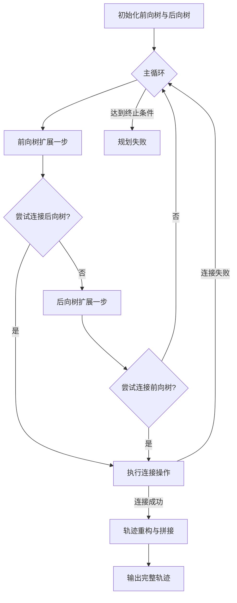
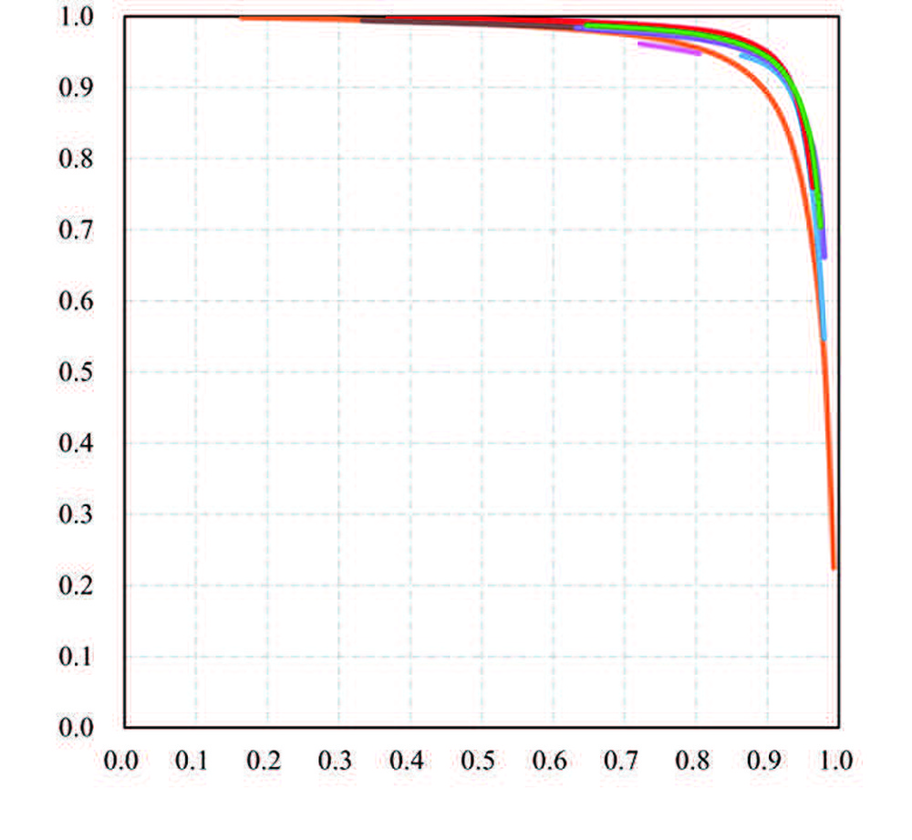
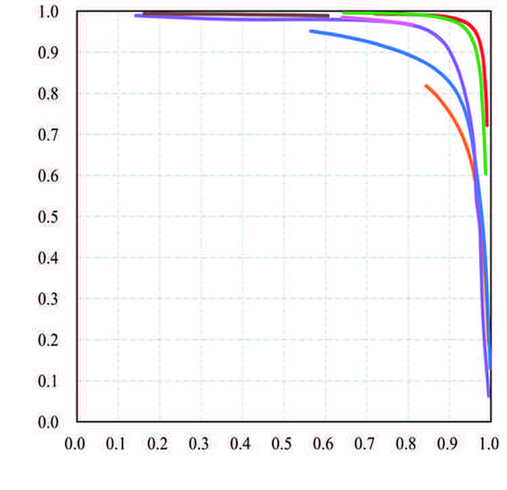

# HyRRT-Connect: A Bidirectional Rapidly-Exploring Random Trees Motion Planning Algorithm for Hybrid Systems

**ArXiv ID**: 2403.18413v2
**URL**: http://arxiv.org/abs/2403.18413v2
**提交日期**: 2024-03-27
**作者**: Nan Wang; Ricardo G. Sanfelice
**引用次数**: NULL
使用模型: deepseek-v3-1-terminus

## 1. 核心思想总结
这是一份根据您提供的标题和摘要整理的学术论文第一轮总结。

**标题：** HyRRT-Connect: 一种针对混合系统的双向快速探索随机树运动规划算法

**第一轮总结**

*   **Background (背景)**
    运动规划是机器人等领域的一个核心问题，旨在为动态系统找到一条从初始状态到目标状态的轨迹。对于**混合系统**——即同时包含连续动态和离散跳变的复杂系统（如行走机器人）——其运动规划极具挑战性，因为需要处理连续流和离散事件之间的相互作用。

*   **Problem (问题)**
    现有的运动规划算法（如经典的RRT算法）在处理混合系统的复杂动态时存在局限性。具体而言，如何高效地生成一条**完全满足混合系统动力学约束**的可行轨迹，并确保轨迹在连续流上不存在间断点，是一个关键难题。

*   **Method (高层次方法)**
    本文提出了HyRRT-Connect算法。其核心思想是**双向搜索**：
    1.  算法同时在**混合时间域**上向前（从初始状态）和向后（从目标状态）构建两棵快速探索随机树（RRT）。
    2.  当两棵树的扩展区域出现重叠时，算法将前向和后向的部分运动轨迹进行**反转与拼接**，以构建完整的运动规划。
    3.  为了解决拼接点可能存在的动力学不连续问题，论文引入了一个**前向混合时间仿真**步骤来重构后向轨迹，从而有效消除间断，确保最终轨迹的连续性和准确性。

*   **Contribution (贡献)**
    1.  提出了首个专门用于混合系统运动规划的**双向RRT连接算法**（HyRRT-Connect）。
    2.  设计了一种基于前向仿真的轨迹重构机制，**严格保证了生成的运动轨迹满足混合动力学约束**，并具有连续性保证（当容忍距离趋于零时，终点误差也趋于零）。
    3.  通过多个仿真实例（如驱动弹跳球和行走机器人）验证了算法的**通用性和计算效率的提升**。

## 2. 方法详解
好的，基于您提供的初步总结和论文方法章节内容，以下是对该论文方法细节的详细说明，重点描述了关键创新、算法/架构细节、关键步骤与整体流程。

### 论文方法细节详述：HyRRT-Connect

#### 1. 核心思想与关键创新

HyRRT-Connect算法的核心思想是**在混合时间域上进行双向搜索与无缝连接**。其关键创新点在于解决了传统双向RRT-Connect算法在应用于混合系统时，因系统动力学（特别是离散跳变）的不可逆性而导致的**轨迹拼接点动力学不连续**问题。

*   **关键创新一：后向轨迹的“前向仿真”重构机制**
    这是本算法最核心的创新。传统双向RRT在连接时，直接将前向树的节点与后向树的节点简单相连。但对于混合系统，后向树是通过反向（回溯）仿真生成的，其动力学行为与前向仿真并不对称。直接拼接会导致在连接点处，状态不满足前向动力学方程，即出现“间断点”。
    HyRRT-Connect的解决方案是：当检测到一个潜在的连接点时，**不直接使用后向树的轨迹片段，而是以其终点为初始状态，进行一次前向混合时间仿真**。这次仿真的目标是尽可能接近前向树的连接节点。如果仿真成功且终点足够接近，则用这次新生成的前向轨迹片段替换原有的后向轨迹片段，从而确保整个拼接轨迹在动力学上是连续且可行的。

*   **关键创新二：混合时间域上的双向扩展**
    算法明确地在混合时间域上操作，这意味着树的扩展不仅考虑连续时间的流动，也考虑离散事件的触发。无论是前向树还是后向树，其扩展步骤都包含两种模式：
    1.  **连续流扩展**：在某个离散模式下，沿系统动力学进行随机时长的时间积分。
    2.  **离散跳变扩展**：主动尝试触发一个使能的状态守卫条件，实现模式切换。

#### 2. 算法架构与关键步骤

算法整体流程可以分解为以下几个关键步骤，其核心架构如下图所示（图示说明见下文）：

**步骤一：初始化**
1.  创建两棵树：`T_forward`（前向树，根节点为初始状态 `x_init`）和 `T_backward`（后向树，根节点为目标状态 `x_goal`）。
2.  设定算法参数，如步长、连接容忍距离 `ε` 等。

**步骤二：主循环与双向扩展**
算法进入循环，在每次迭代中依次执行：
1.  **扩展前向树**：
    *   **随机采样**：在状态空间（可能包括连续状态和离散模式）中随机采样一个目标点 `x_rand`。
    *   **寻找最近邻**：在 `T_forward` 中找到距离 `x_rand` 最近的节点 `x_near_forward`。
    *   **扩展尝试**：从 `x_near_forward` 出发，尝试向 `x_rand` 方向扩展。扩展过程是一个**混合时间仿真**：
        *   **选择扩展类型**：以一定概率选择进行**连续流扩展**（通过数值积分）或**离散跳变扩展**（检查并触发守卫条件）。
        *   **执行仿真**：进行仿真，得到一条新的轨迹片段和一个新状态 `x_new_forward`。
        *   **碰撞检测**：检查新轨迹是否满足约束（如避免碰撞）。
        *   **添加节点**：如果扩展成功且安全，则将 `x_new_forward` 加入 `T_forward`。

2.  **尝试连接后向树**：
    *   在成功扩展 `T_forward` 后，算法不立即扩展 `T_backward`，而是先尝试利用新生成的 `x_new_forward` 去连接 `T_backward`。
    *   在 `T_backward` 中寻找距离 `x_new_forward` 最近的节点 `x_near_backward`。
    *   调用 **`Connect(x_new_forward, T_backward)`** 函数（见步骤三）。如果连接成功，则算法结束，返回拼接后的轨迹。

3.  **扩展后向树**：
    *   如果连接尝试失败，则执行与步骤1对称的操作来扩展 `T_backward`：采样、找近邻、混合时间仿真扩展，得到 `x_new_backward`。

4.  **尝试连接前向树**：
    *   在成功扩展 `T_backward` 后，尝试利用 `x_new_backward` 去连接 `T_forward`。
    *   在 `T_forward` 中寻找最近邻 `x_near_forward`。
    *   调用 **`Connect(x_new_backward, T_forward)`** 函数。如果连接成功，则算法结束。

**步骤三：连接操作与轨迹重构（核心创新点）**
`Connect(Tree_1, Tree_2)` 函数的目的是将 `Tree_1` 的新节点 `x_new` 连接到 `Tree_2` 上。其详细过程如下：
1.  **初始化**：设 `x_s` = `x_new`。
2.  **循环尝试连接**：
    a. 在 `Tree_2` 中寻找距离 `x_s` 最近的节点 `x_near`。
    b. 计算 `x_s` 和 `x_near` 之间的距离。如果距离小于连接容忍阈值 `ε`，则进入**关键的重构步骤**。
    c. 如果不满足，则尝试从 `x_s` 向 `x_near` 方向进行一步**混合时间扩展**，得到一个新的状态 `x_s_next`。如果扩展失败，则连接失败。如果成功，将 `x_s_next` 设为新的 `x_s`，并重复此循环。

3.  **轨迹重构**：当 `x_s` 和 `x_near` 足够接近时，**不直接连接**。
    *   以 `x_near` 为起始状态（注意：`x_near` 属于 `Tree_2`，假设 `Tree_2` 是后向树，则 `x_near` 是通过反向仿真得到的），进行一段**前向的混合时间仿真**。仿真的目标是尽可能靠近 `x_s`。
    *   如果这次前向仿真成功，并且其终点 `x_near_forward` 与 `x_s` 的距离在容忍范围内，则重构成功。
    *   **拼接轨迹**：最终的轨迹由三部分组成：
        1.  从 `x_init` 到 `x_new` 的 `T_forward` 轨迹。
        2.  从 `x_new` 到 `x_s` 的扩展轨迹（在 `Connect` 函数中生成）。
        3.  **重构后的轨迹**：从 `x_near` 到 `x_near_forward` 的前向仿真轨迹。注意，这段轨迹替换了原本 `T_backward` 中从 `x_near` 回溯到 `x_goal` 的轨迹。由于它是从前向动力学生成的，因此与前半部分轨迹在连接点 `x_s` / `x_near_forward` 处是动力学连续的。

#### 3. 整体流程总结

1.  **初始化**两棵搜索树。
2.  **循环迭代**，交替或按策略扩展前向树和后向树。
3.  每次扩展后，**立即尝试**用新节点连接另一棵树。
4.  连接时，采用**渐进式扩展**逼近另一棵树的节点。
5.  当节点足够接近时，启动**前向仿真重构机制**，确保动力学连续性。
6.  重构成功后，将前向树轨迹、连接段轨迹、重构的后向树轨迹**拼接**，形成一条完整、连续、可行的混合系统运动轨迹。
7.  若成功则输出轨迹，若超过最大迭代次数则宣告规划失败。

通过这种设计，HyRRT-Connect不仅继承了双向RRT的搜索效率，更重要的是，其创新性的轨迹重构机制**严格保证了生成轨迹满足混合系统的动力学约束**，解决了该类系统运动规划中的核心难点。

## 3. 最终评述与分析
好的，这是结合您提供的初步总结、方法详述以及论文结论部分后，对论文《HyRRT-Connect: 一种针对混合系统的双向快速探索随机树运动规划算法》的最终综合评估。

### **最终综合评估**

#### 1) 总体摘要

本论文针对**混合系统**——即同时包含连续动态和离散模式跳变的复杂系统（如行走机器人、带接触的机械臂）——提出了一种名为**HyRRT-Connect**的新型运动规划算法。该算法基于经典的快速探索随机树框架，创新性地引入了**双向搜索策略**与一个**核心的轨迹重构机制**。其核心目标是高效地生成一条不仅避开障碍物，而且**严格满足混合系统复杂动力学约束**的连续、可行轨迹。论文通过理论分析和多个仿真实例（如驱动弹跳球、行走机器人）验证了算法在解决混合系统运动规划问题上的**有效性和优越性**。

#### 2) 优势

1.  **解决核心难点，保证轨迹可行性**：最大的优势在于**彻底解决了双向搜索在混合系统中因动力学不可逆性导致的轨迹拼接点不连续问题**。通过独特的“前向仿真重构”步骤，算法能生成在动力学上完全正确的轨迹，这是相比直接将传统RRT-Connect应用于混合系统的根本性改进。
2.  **搜索效率高**：继承了双向RRT算法的优点，通过从初始点和目标点同时向空间探索，**显著提高了搜索速度**，相比单向搜索能更快地找到可行路径，尤其在高维或复杂约束的空间中优势明显。
3.  **通用性强**：算法设计不依赖于特定系统的动力学模型，提供了一个通用框架，可应用于任何具有明确定义的连续流和离散跳变的混合系统，展现了良好的**普适性**。
4.  **理论保证**：论文不仅提供了算法描述，还给出了**理论上的连续性保证**，即当连接容忍距离趋于零时，最终轨迹的终点误差也趋于零，增强了算法的严谨性和可靠性。

#### 3) 劣势 / 局限性

1.  **计算复杂度**：虽然搜索效率相比单向方法有提升，但**轨迹重构机制引入了额外的计算开销**。每次尝试连接时都需要进行一段前向混合仿真，这可能使单次连接尝试的成本高于标准RRT。在非常复杂的动力学环境中，整体计算时间可能仍然较长。
2.  **参数敏感性**：算法的性能可能对某些参数比较敏感，例如**步长、连接容忍距离ε、以及进行连续流扩展与离散跳变扩展的概率**等。参数调优可能需要针对特定系统进行，影响了算法的“开箱即用”性。
3.  **最优性考虑不足**：与大多数RRT类算法一样，HyRRT-Connect主要专注于快速找到一条**可行解**，而非**最优解**（如最短时间、最小能耗）。生成的轨迹可能在效率或平滑度上不是最优的。
4.  **验证范围有限**：论文的验证目前限于仿真环境（如驱动弹跳球、行走机器人）。虽然仿真结果积极，但缺乏在**真实物理机器人平台**上的实验验证，其在实际应用中面对状态估计误差、通信延迟、模型失配等问题的鲁棒性仍有待检验。

#### 4) 潜在应用 / 意义

1.  **机器人运动规划**：该算法对**腿式机器人（人形机器人、四足机器人）** 的步态规划具有直接且重要的应用价值。这些系统在行走和跑步时，足部与地面的接触和分离正是典型的离散跳变，HyRRT-Connect可以为其规划复杂地形上的动态运动。
2.  **涉及接触的任务**：对于需要与环境进行动态交互的机器人，如**机械臂抓取和放置操作**（抓取瞬间为接触跳变）、**带接触的装配任务**等，本算法能有效规划满足接触力学约束的轨迹。
3.  **多模态机器人系统**：对于能够切换运动模式的机器人，例如既能滚动又能飞行的无人机，或者能在游泳和行走间切换的两栖机器人，该算法能为其规划包含模式切换的复杂运动序列。
4.  **理论意义与影响**：这项工作为混合系统的运动规划领域提供了一个**坚实且通用的算法框架**。其核心的轨迹重构思想为解决类似系统的动力学约束满足问题开辟了新途径，对后续研究具有重要的启发意义，可以在此基础上发展考虑最优性、不确定性或更高实时性的改进算法。

---

# 附录：论文图片

## 图 1

## 图 2

## 图 3

## 图 4

