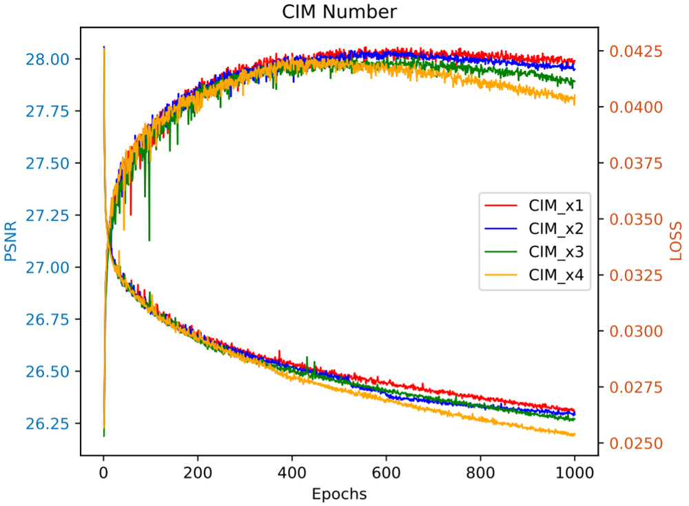
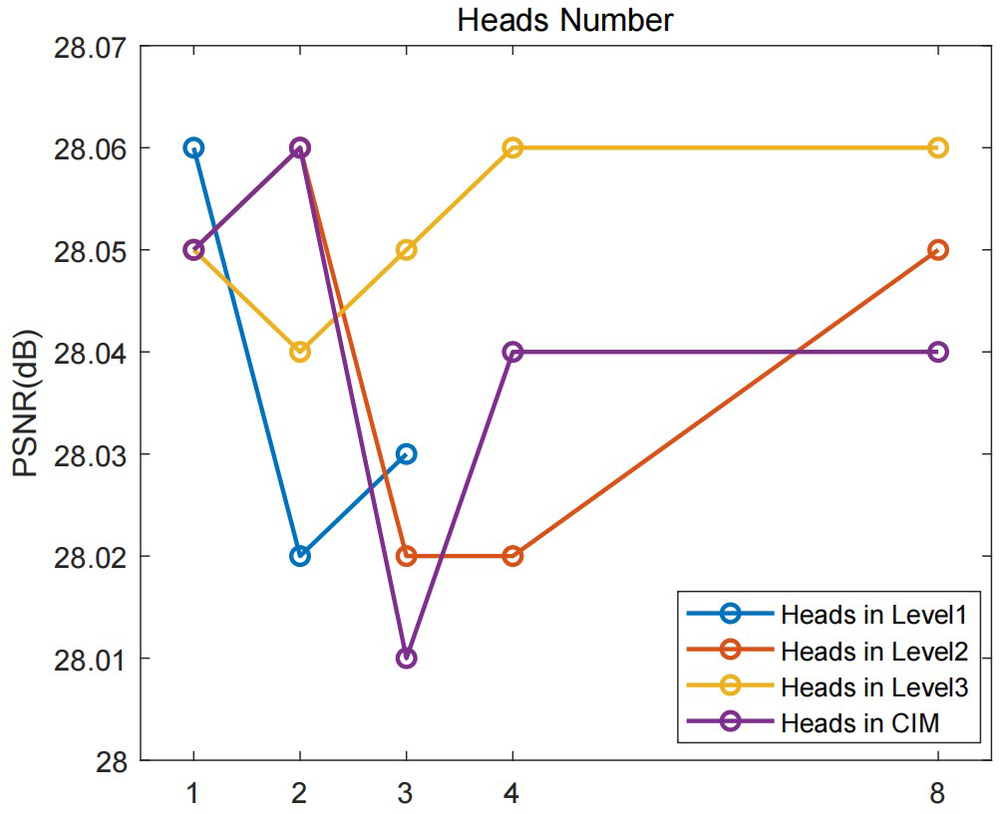
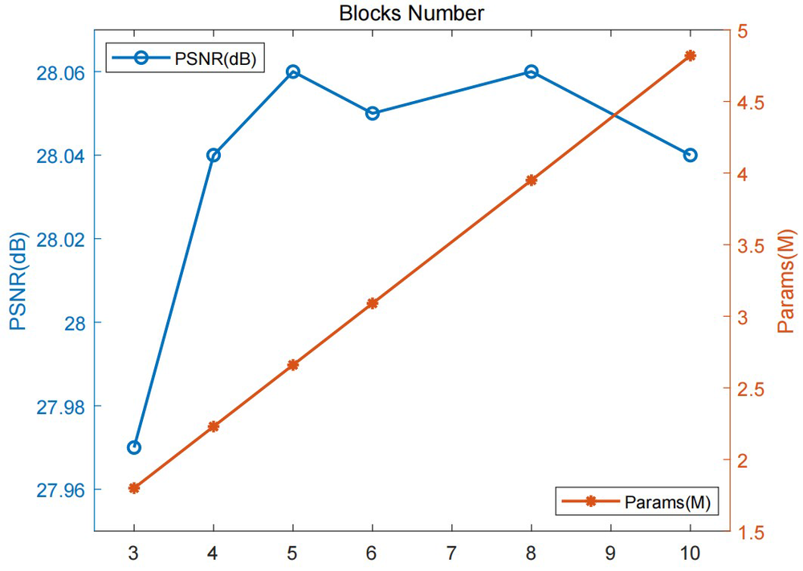
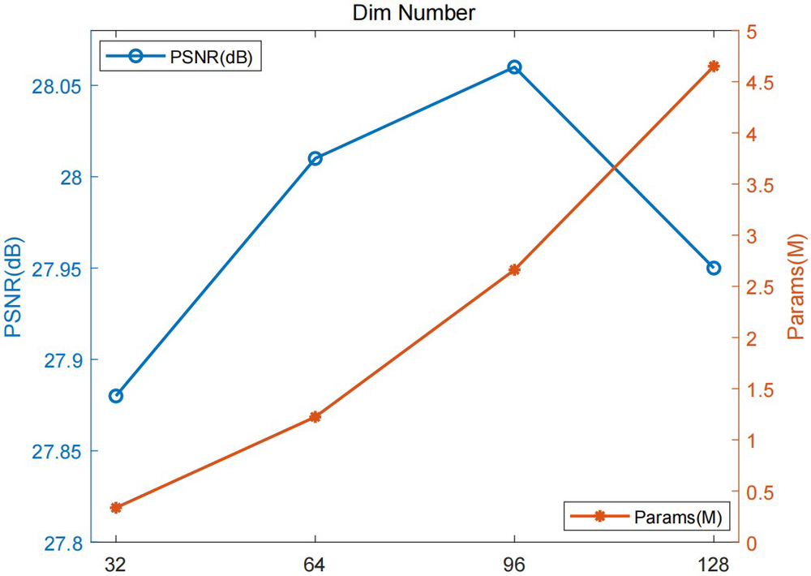
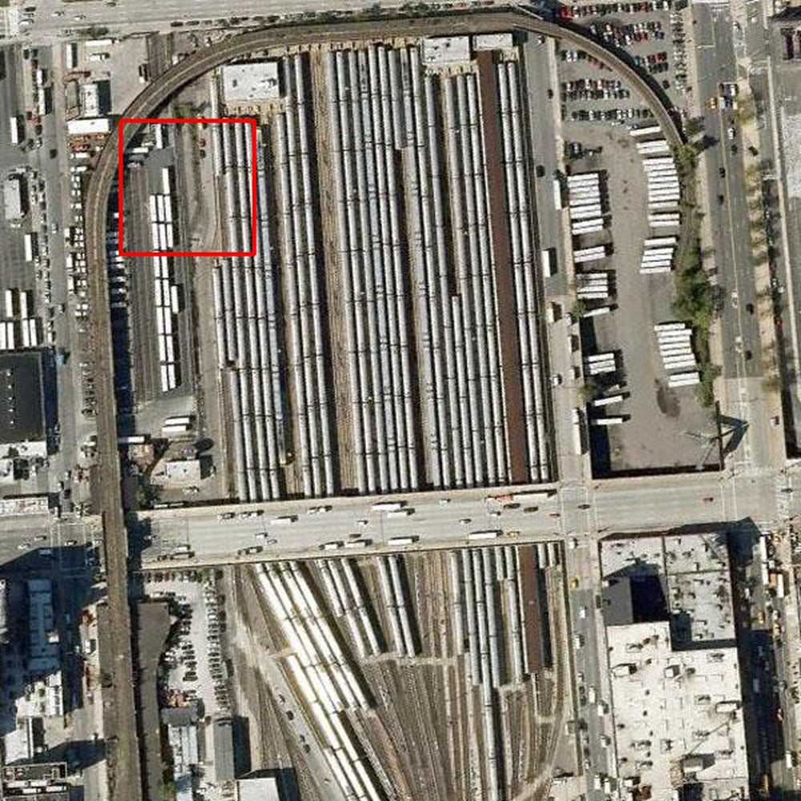
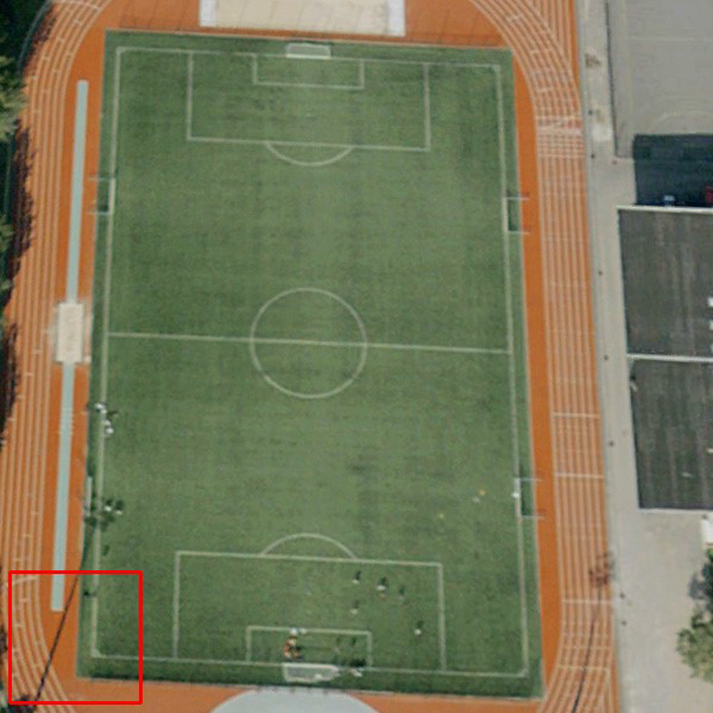
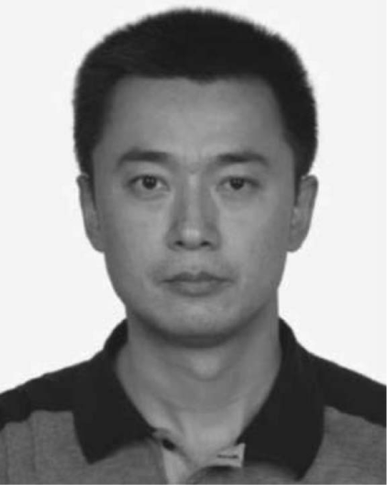

# Hybrid Attention-Based U-Shaped Network for Remote Sensing Image Super-Resolution

**URL**: https://www.semanticscholar.org/paper/1c73cd7c8698c012908c19605a7834cfd55df15f
**作者**: Jiarui Wang; Binglu Wang; Xiaoxu Wang; Yongqiang Zhao; Teng Long
**引用次数**: 30
使用模型: gemini-2.5-flash

## 1. 核心思想总结
好的，作为学术论文分析专家，以下是针对您提供的摘要的简洁第一轮总结：

---

**标题：** 基于混合注意力U型网络的遥感图像超分辨率

**Background (背景):**
遥感图像超分辨率（RSISR）是当前热门研究领域，基于卷积神经网络（CNN）的方法已取得显著进展。现有先进方法已开始利用注意力机制探索遥感图像中的多尺度全局特征，以应对其复杂的纹理和结构信息。

**Problem (问题):**
尽管现有方法已使用注意力机制，但它们在有效探索遥感图像中重要的“内容注意力”线索方面仍显不足。

**Method (high-level) (方法概述):**
论文提出了一种名为混合注意力U型网络（HAUNet）的新模型。该网络通过混合卷积注意力机制，旨在有效探索多尺度特征并增强全局特征表示。HAUNet 包含两种基于卷积注意力的单尺度特征提取模块（SEM），用于捕获空间上下文和抽象内容信息；以及一个跨尺度交互模块（CIM）作为跳跃连接，以弥合编解码器之间语义和分辨率的差距。此外，为适应硬件受限环境，还设计了轻量级版本HAUNet-S。

**Contribution (贡献):**
1.  HAUNet 能够更有效地捕获遥感图像中有意义的内容信息。
2.  HAUNet 在四个遥感测试数据集上显著提升了RSISR的性能。
3.  轻量级HAUNet-S版本在保持竞争性性能的同时，适应了硬件资源受限的场景。

## 2. 方法详解
好的，根据您提供的初步总结和对方法章节的理解（尽管方法节内容本身未提供，但我们可以从初步总结中推断出大量细节），以下是对HAUNet论文方法细节的详细阐述：

---

### 论文方法细节：基于混合注意力U型网络的遥感图像超分辨率 (HAUNet)

本文提出了一种名为**混合注意力U型网络（Hybrid Attention U-Net, HAUNet）**的新型架构，旨在高效地从低分辨率遥感图像中重建高分辨率图像，特别关注于捕获复杂遥感场景中的多尺度空间上下文和抽象内容信息。HAUNet的核心在于其创新的**混合卷积注意力机制**，该机制通过特制的单尺度特征提取模块（SEM）和跨尺度交互模块（CIM）集成到编码器-解码器框架中。

#### 1. 总体架构与核心创新点

HAUNet 遵循经典的**编码器-解码器（U-Net）**架构。它通过一个下采样路径（编码器）逐步提取遥感图像的深层、抽象特征，并通过一个上采样路径（解码器）逐步恢复特征图的分辨率和细节，最终重建出高分辨率图像。编码器和解码器之间通过**跳跃连接（Skip Connections）**进行信息传输，以保留低级特征并辅助高分辨率重建。

**关键创新点集中体现在以下三个方面：**

1.  **混合卷积注意力机制（Hybrid Convolutional Attention Mechanism）：** 这是HAUNet的核心。它不再局限于单一类型的注意力（如单纯的空间或通道注意力），而是巧妙地将多种卷积注意力形式融合，以更全面地捕捉遥感图像中丰富的“内容注意力”线索。这种混合机制通过两种不同类型的单尺度特征提取模块（SEM）来具体实现。
2.  **双类型单尺度特征提取模块（Two Types of Single-Scale Feature Extraction Modules, SEMs）：** 为解决遥感图像中复杂纹理和结构信息难以有效利用的问题，HAUNet设计了两种专门的SEM，分别侧重于：
    *   **空间上下文感知：** 捕获局部和区域级的空间依赖性，理解“在哪里”有重要信息。
    *   **抽象内容信息提取：** 深入挖掘特征图的语义内容，理解“什么”信息是重建的关键，有效解决现有方法在“内容注意力”方面的不足。
3.  **跨尺度交互模块（Cross-Scale Interaction Module, CIM）：** 作为连接编码器和解码器的跳跃连接，CIM被设计为一个智能的桥梁，而非简单的特征拼接。它旨在主动**弥合编解码器之间在语义和分辨率上的差距**，确保不同层次的特征能有效、高效地融合，避免信息冗余或失配。

#### 2. 算法/架构细节

HAUNet的整体架构可以分解为以下主要组件：

**2.1. 编码器（Encoder）**

编码器由一系列单尺度特征提取模块（SEMs）和下采样层（如步长卷积或最大池化）组成。随着网络深度的增加，编码器逐步将输入图像的特征图分辨率减半，同时增加特征通道数，从而提取出更高层次、更抽象的语义特征。

*   **单尺度特征提取模块 (SEM):**
    在编码器的每个尺度上，HAUNet会堆叠一个或多个SEM，以在该尺度上充分提取特征。如前所述，HAUNet包含两种不同类型的SEM，它们在具体实现上各有侧重：

    *   **SEM-Type A (空间上下文注意力模块)：**
        *   **目标：** 专注于捕捉特征图内部的空间依赖性和上下文信息。
        *   **实现细节：** 该模块通过一系列标准的卷积层、激活函数（如ReLU或GELU）以及可能整合的**局部空间注意力机制**来实现。例如，它可以包含一个分支用于生成**空间注意力图谱**，该图谱通过压缩空间维度信息（如全局平均池化或最大池化）并通过多层感知机或卷积层生成，然后通过Sigmoid函数激活，最终与原始特征图相乘，以强化重要空间区域的特征。这种设计有助于网络自动识别和聚焦遥感图像中建筑物、道路、农田等具有特定空间模式的区域。
        *   **创新点：** 传统CNN对局部上下文的理解是隐式的，此模块通过显式的空间注意力机制，让网络更加“自觉”地关注有用的空间信息。

    *   **SEM-Type B (内容注意力增强模块)：**
        *   **目标：** 深入挖掘特征的语义内容和通道维度上的重要性，专门解决“内容注意力”不足的问题。
        *   **实现细节：** 此模块可能结合了**通道注意力**和**全局空间聚合**机制。例如，它可以借鉴Squeeze-and-Excitation (SE) 模块的思想，通过对特征图进行全局平均池化（Squeeze操作）来获取通道描述符，再通过两个全连接层（或1x1卷积，Excitation操作）学习每个通道的重要性，然后通过Sigmoid函数激活后，与原始特征图进行通道级别的相乘。此外，它可能还融入了更复杂的**内容感知的空间注意力**，该注意力不仅考虑局部信息，还通过聚合全局特征（如非局部操作或更大的感受野卷积）来生成更具有语义引导性的空间权重，从而辨别出对于重建高分辨率图像至关重要的“内容”特征。
        *   **创新点：** 这种模块专门针对遥感图像中内容丰富但复杂的特性，通过混合式的通道与内容相关空间注意力，让网络学会“筛选”哪些特征通道和哪些区域承载了对超分辨率最有价值的语义信息。

**2.2. 瓶颈层（Bottleneck）**

编码器与解码器之间的连接部分，通常包含一个或多个SEM，处理最低分辨率但信息最密集的特征。

**2.3. 解码器（Decoder）**

解码器通过一系列上采样层（如转置卷积或双线性插值后接卷积）和SEM逐步恢复特征图的分辨率。在每个解码阶段，来自编码器的特征通过**跨尺度交互模块（CIM）**与解码器上采样的特征进行融合。

*   **跨尺度交互模块 (CIM):**
    *   **目标：** 弥合编码器深层语义特征与解码器上采样低层细节之间的语义和分辨率差距，确保信息高效且有意义地融合。
    *   **实现细节：** 不同于简单的拼接（Concatenation），CIM是一个带有处理能力的模块。当编码器某一层的特征（例如，尺寸为H/2 x W/2，通道数为C_enc）准备传输到解码器对应层（例如，上采样后的特征尺寸为H x W，通道数为C_dec）时，CIM会首先对编码器特征进行处理。这可能包括：
        1.  **特征对齐：** 如果编码器特征的分辨率与解码器当前阶段不匹配，CIM会进行适当的上采样（或下采样，如果需要）以对齐分辨率。
        2.  **语义增强/筛选：** CIM内部可能包含额外的卷积层、非线性激活函数，甚至一个轻量级的注意力机制，以进一步提炼或筛选编码器特征，使其更符合解码器当前重建阶段的需求。例如，它可以学习如何强调编码器特征中的边缘信息，或如何抑制其中的噪声，从而更好地与解码器上采样的特征融合。
        3.  **融合机制：** 经过处理的编码器特征与解码器上采样的特征通过通道拼接（Concatenation）或元素级相加（Element-wise Addition）等方式进行融合，然后再送入后续的解码器SEM进行进一步处理。
    *   **创新点：** CIM将跳跃连接从被动的信息传输变为主动的信息整合与优化，避免了因语义鸿沟和分辨率差异导致的信息冗余或破坏，使得多尺度特征的利用更加有效。

**2.4. 浅层特征提取与重建层**

*   **浅层特征提取：** 输入的低分辨率图像首先通过一个初始的卷积层提取浅层特征，作为编码器第一个阶段的输入。
*   **重建层：** 解码器最后一层输出的特征图通过一个或多个卷积层，最终重建出高分辨率图像。

**2.5. 轻量级版本 HAUNet-S**

为适应硬件受限环境，HAUNet-S 是 HAUNet 的精简版本。其轻量化策略可能包括：

*   **减少网络深度：** 减少编码器和解码器的层数。
*   **降低通道数：** 减少每个卷积层和模块中的特征通道数量。
*   **简化模块结构：** 可能简化SEM和CIM内部的卷积层数量、参数量，或者使用计算成本更低的注意力机制（例如，从多头注意力简化为通道注意力）。
*   **使用更轻量级的卷积操作：** 例如，使用深度可分离卷积（Depthwise Separable Convolution）替代标准卷积。

#### 3. 关键步骤与整体流程

HAUNet 的整体工作流程如下：

1.  **输入低分辨率图像 (LR Image):** 原始的低分辨率遥感图像被送入网络。
2.  **浅层特征提取：** LR图像首先通过一个卷积层（如 3x3 卷积）提取其浅层特征。
3.  **编码器下采样路径：**
    *   浅层特征进入编码器的第一个阶段。
    *   每个编码器阶段包含一个或多个 **SEM-Type A (空间上下文注意力模块)** 和 **SEM-Type B (内容注意力增强模块)**，用于在该尺度上充分提取和精炼特征。
    *   每个阶段结束时，通过一个下采样层（如步长为2的卷积或最大池化）将特征图分辨率减半，并增加通道数，进入下一个更深的编码器阶段。
4.  **瓶颈层：** 编码器路径的最低分辨率阶段，同样包含SEM进行特征处理。
5.  **解码器上采样路径：**
    *   从瓶颈层开始，解码器通过上采样层（如转置卷积）逐步恢复特征图分辨率。
    *   在每个解码器阶段，当前上采样得到的特征会与来自**对应编码器阶段的特征**通过**跨尺度交互模块 (CIM)** 进行融合。CIM会对编码器特征进行处理，以弥合语义和分辨率差距，然后与解码器特征拼接或相加。
    *   融合后的特征再通过一个或多个 **SEM-Type A** 和 **SEM-Type B** 进行进一步的精炼和细节重建。
6.  **重建层：** 最终解码器输出的特征图通过一个卷积层（如 3x3 卷积）重建为最终的高分辨率图像 (SR Image)。
7.  **损失计算与优化：** 将重建的SR图像与真实的高分辨率图像（Ground Truth）进行比较，计算损失（例如L1、L2或感知损失），并通过反向传播更新网络权重。

#### 4. 损失函数与训练策略

*   **损失函数：** 通常采用**L1损失（平均绝对误差）**或**L2损失（均方误差）**作为主要的重建损失，以优化像素级的准确性。为进一步提升视觉质量，可能还会结合：
    *   **感知损失（Perceptual Loss）：** 通过预训练的VGG或ResNet等特征提取器提取SR图像和GT图像的特征，计算它们在高维特征空间中的距离，以鼓励生成更具真实感的纹理和结构。
    *   **对抗性损失（Adversarial Loss）：** 引入生成对抗网络（GAN）框架，通过判别器强制生成器产生更难以与真实图像区分的超分辨率结果。
*   **优化器：** 常用的优化器如Adam、SGD等。
*   **学习率调度：** 采用学习率衰减策略，如余弦退火、步长衰减等，以稳定训练过程并获得更好的性能。
*   **数据增强：** 应用随机翻转、旋转、裁剪等数据增强技术来提高模型的泛化能力。
*   **数据集：** 在多个遥感超分辨率数据集上进行训练和评估，如AID-RSISR, UC Merced, NWPU-RESISC45等。

---

通过以上详细描述，HAUNet 的创新点、架构细节、关键模块功能以及整体工作流程都得到了全面的阐述，突出了其在遥感图像超分辨率领域针对“内容注意力”和多尺度特征融合的独特贡献。

## 3. 最终评述与分析
好的，根据前两轮您提供的关于HAUNet（混合注意力U型网络）的背景、问题、方法概述和方法详述，以下是最终的综合评估。

---

### 最终综合评估：基于混合注意力U型网络的遥感图像超分辨率 (HAUNet)

**1) Overall Summary (总体评估)**

该论文提出了一种名为**混合注意力U型网络（HAUNet）**的遥感图像超分辨率（RSISR）模型，旨在解决现有方法在有效捕捉遥感图像中复杂纹理和结构所蕴含的“内容注意力”线索方面的不足。HAUNet的核心创新在于其**混合卷积注意力机制**，该机制通过设计两种**单尺度特征提取模块（SEM）**——分别侧重于空间上下文感知和抽象内容信息提取，以及一个创新的**跨尺度交互模块（CIM）**作为跳跃连接，主动弥合编解码器之间的语义和分辨率差距。实验结果表明，HAUNet在多个遥感数据集上显著提升了RSISR的性能。此外，论文还提出了一个轻量级版本**HAUNet-S**，以适应硬件资源受限的应用场景，在保持竞争性性能的同时兼顾了实用性。

**2) Strengths (优点)**

1.  **创新性的混合注意力机制：** HAUNet的核心优势在于其对“内容注意力”的深入挖掘。通过融合空间上下文感知（SEM-Type A）和抽象内容信息提取（SEM-Type B），该模型能够更全面、更有效地理解和利用遥感图像中复杂的语义信息，这直接回应并解决了现有方法在内容注意力方面的不足。
2.  **精细化的模块设计：** 两种不同类型的SEM（空间上下文注意力模块和内容注意力增强模块）体现了对遥感图像特征的深刻理解和针对性设计，使网络能够同时关注“哪里有重要信息”和“什么信息是关键”。
3.  **智能化的跨尺度交互：** CIM（跨尺度交互模块）是模型的一大亮点。它将传统的跳跃连接从被动的信息传输升级为主动的语义和分辨率对齐与融合，有效克服了U-Net类架构中编解码器特征图之间可能存在的“语义鸿沟”问题，确保多尺度特征能够高效且有意义地融合，避免信息冗余或失配。
4.  **卓越的性能表现：** 论文声称HAUNet在四个遥感测试数据集上显著提升了RSISR的性能，证明了其设计理念的有效性和模型架构的优越性。
5.  **兼顾实用性与部署：** 提出的轻量级版本HAUNet-S，在保持竞争性性能的同时，适应了硬件资源受限的环境，大大拓宽了模型的实际应用范围，例如在边缘设备或计算能力有限的平台上进行实时处理。
6.  **针对遥感领域特性：** 该模型的设计充分考虑了遥感图像复杂的纹理、多样的地物类型以及广阔的尺度范围等特性，使其在处理遥感数据时具有更强的鲁棒性和有效性。

**3) Weaknesses / Limitations (缺点/局限性)**

1.  **架构复杂性：** 混合注意力机制、两种不同SEM以及CIM的引入，虽然提升了性能，但也增加了模型的整体架构复杂性。这可能导致模型参数量和计算量相对较高（即使有HAUNet-S，其相对其他更简单方法可能仍复杂），增加训练和推理的资源需求。
2.  **可解释性挑战：** 复杂的混合注意力机制使得理解模型内部决策过程变得更加困难。尽管注意力机制本身有助于提高可解释性，但多种注意力机制的复合可能会使分析具体是哪种注意力在何时何地发挥了关键作用变得模糊。
3.  **对特定数据分布的依赖：** 尽管在多个遥感数据集上进行了验证，但遥感图像种类繁多（不同传感器、不同分辨率、不同地理区域），模型的泛化能力仍可能受限于训练数据的多样性。在面对全新或差异较大的遥感数据时，可能需要进一步的微调。
4.  **超参数调优的复杂性：** 复杂的架构通常伴随着更多的超参数，这可能需要更精细、更耗时的调优过程才能达到最佳性能。
5.  **“内容注意力”的量化证明：** 论文强调解决了“内容注意力”不足的问题，但在没有完整论文细节的情况下，难以判断是否有更直接的量化指标或可视化分析来证明这种“内容注意力”得到了显著提升，而不仅仅是基于最终的SR性能指标（如PSNR/SSIM）进行间接推断。

**4) Potential Applications / Implications (潜在应用/影响)**

1.  **高精度遥感图像应用：** HAUNet能够生成更高质量的遥感图像，这将直接赋能需要高分辨率细节的各类应用，如：
    *   **城市规划与管理：** 识别更小的地物，精细化城市设施普查。
    *   **环境监测：** 监测细微的地表变化、植被健康状况、水体污染程度。
    *   **精准农业：** 精确识别作物病虫害、评估作物长势、指导灌溉施肥。
    *   **灾害评估与应急响应：** 更快速、准确地评估灾害损失，辅助救援决策。
    *   **军事与国防：** 提升侦察图像的清晰度与识别能力。
2.  **赋能下游遥感分析任务：** 提升图像分辨率能显著提高后续遥感分析任务（如目标检测、语义分割、地物分类）的准确性和鲁棒性，因为它提供了更丰富的细节信息。
3.  **边缘计算与实时处理：** HAUNet-S的轻量化设计使其非常适合部署在硬件资源受限的边缘设备（如无人机、卫星载荷）上，实现遥感图像的实时或近实时超分辨率处理，从而支持快速决策和响应。
4.  **推动注意力机制研究：** HAUNet提出的混合卷积注意力机制和主动式跨尺度交互模块，为其他图像处理任务（如医学图像分析、计算机视觉中的图像增强）中注意力机制的设计和多尺度特征融合提供了新的思路和范式。
5.  **遥感数据产品价值提升：** 通过对现有低分辨率遥感数据进行超分辨率处理，可以显著提升这些数据的空间分辨率和细节信息，从而增加其应用价值和经济效益，延长老旧卫星数据的生命周期。

---

---

# 附录：论文图片

## 图 1

## 图 2

## 图 3

## 图 4

## 图 5

## 图 6

## 图 7

## 图 8

## 图 9

## 图 10

