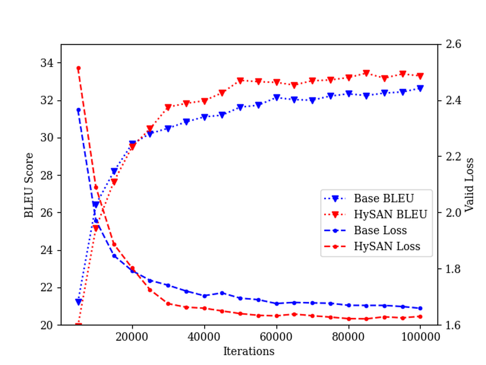
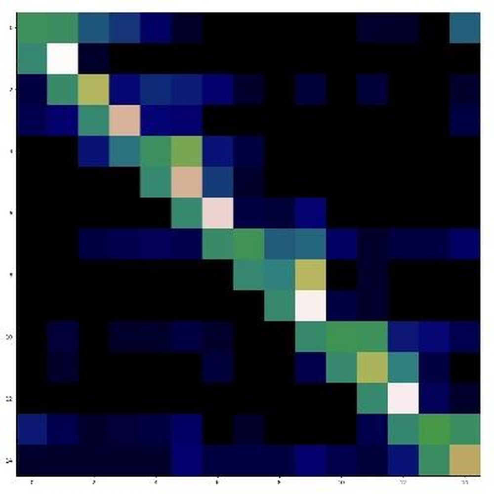
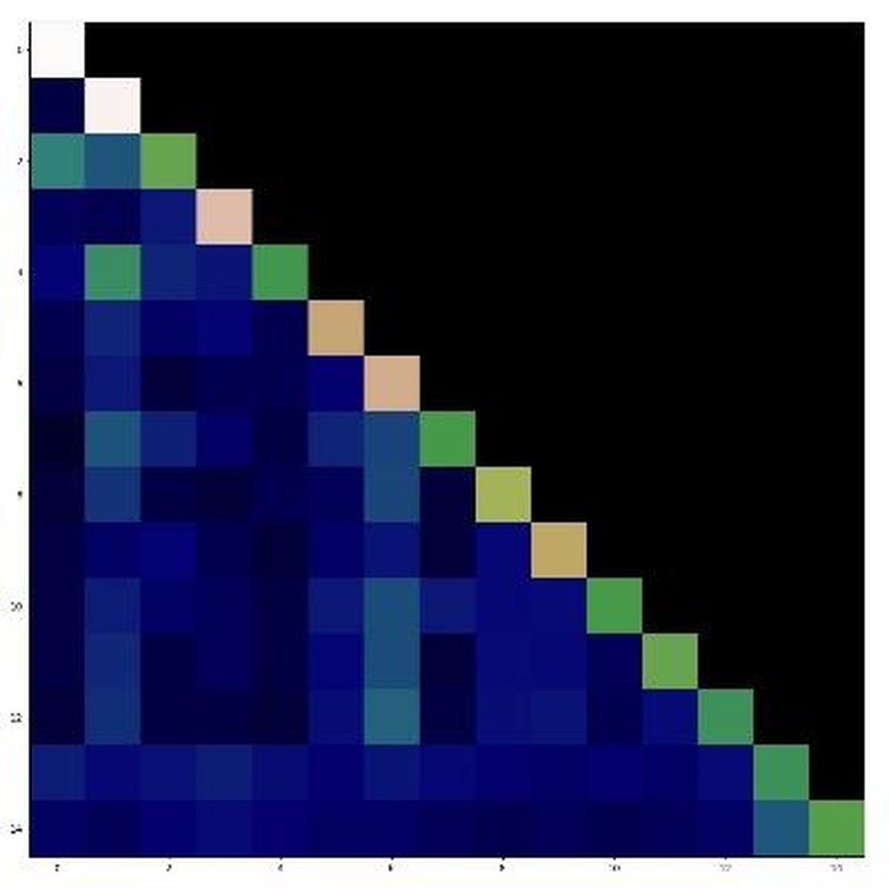
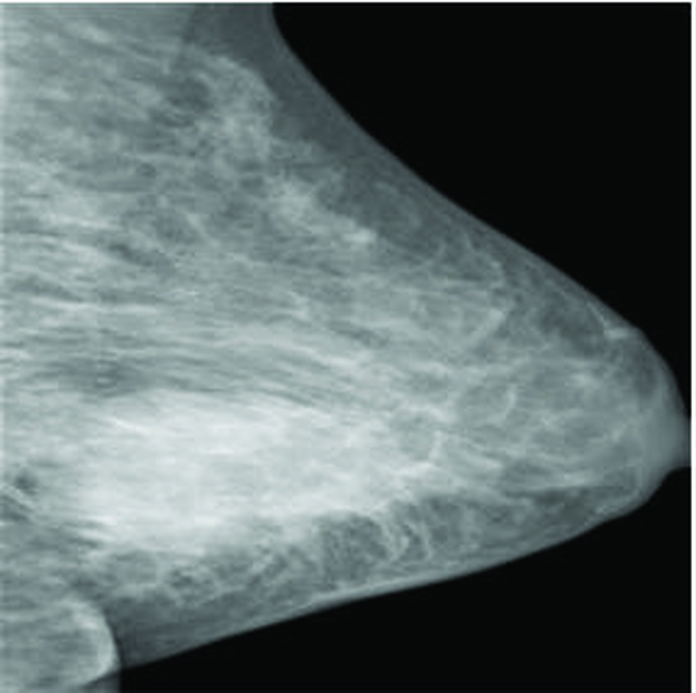
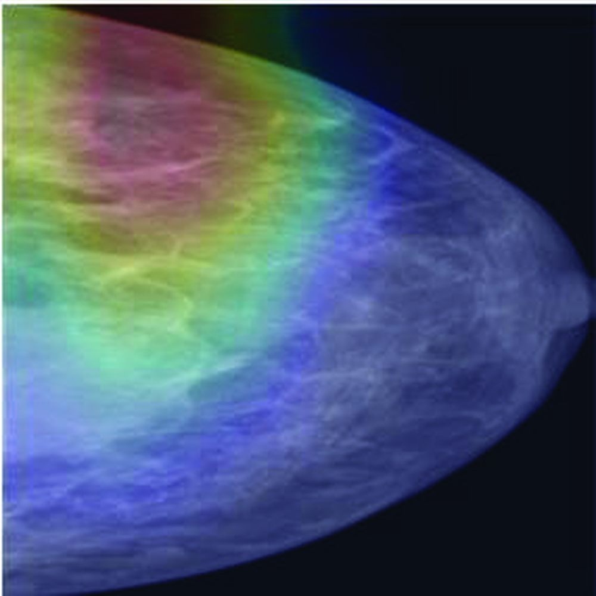
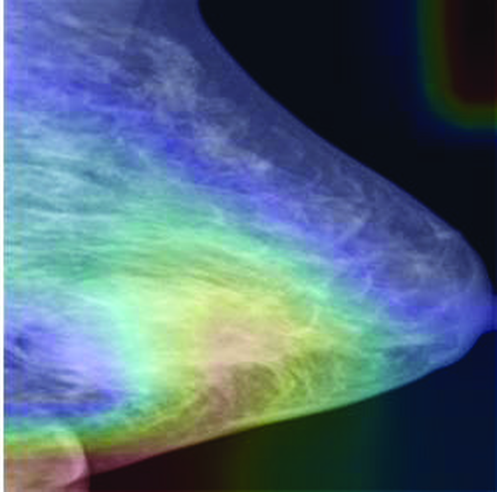
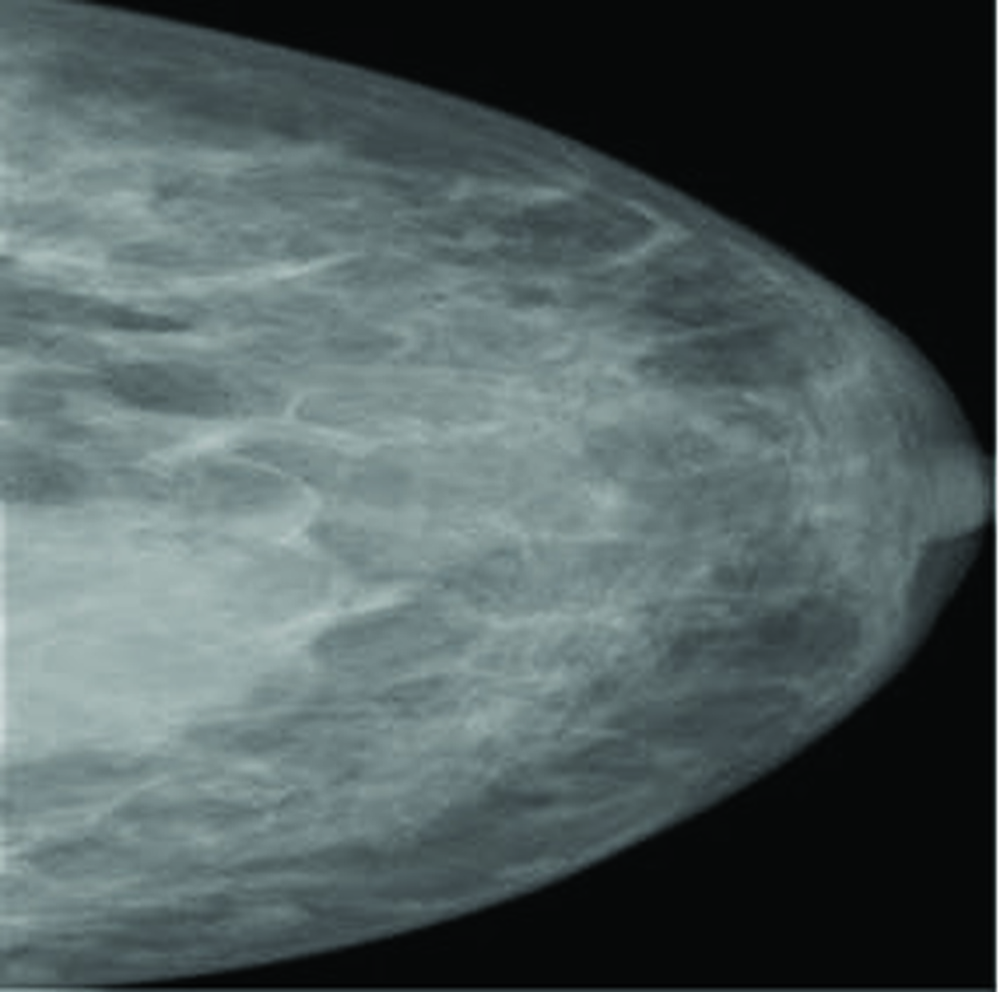
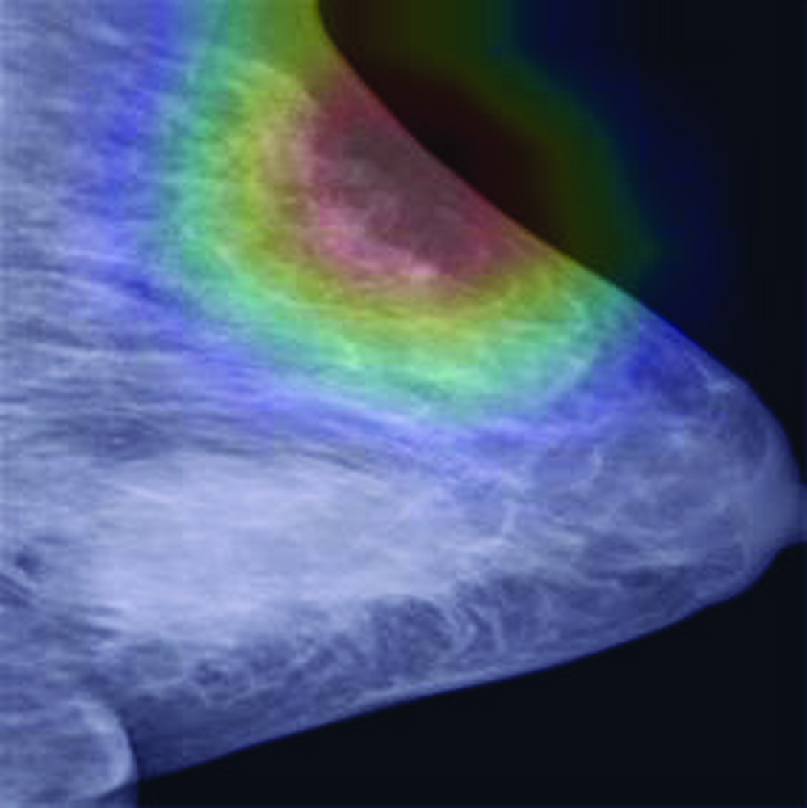

# Hybrid self-attention network for machine translation

**URL**: https://arxiv.org/abs/1811.00253
**作者**: Song, X Tan, F Peng, J Lu
**引用次数**: 16
使用模型: gemini-2.5-flash

## 1. 核心思想总结
好的，作为学术论文分析专家，根据您提供的标题和信息，这是一份简洁的第一轮总结：

**标题:** Hybrid self-attention network for machine translation

---

**Background (背景)**
神经网络机器翻译 (NMT) 已成为主流，其中基于自注意力机制的Transformer模型取得了显著成功，是当前机器翻译领域的先进技术。

**Problem (问题)**
尽管Transformer模型表现出色，但单一的自注意力机制在捕获所有语言学特征或优化模型性能方面可能仍存在局限性，例如在处理复杂语境或不同粒度信息时的效率和准确性。

**Method (high-level) (方法 - 概要)**
该研究提出了一种结合多种自注意力机制或将其与其它网络结构/特征融合的“混合自注意力网络”，旨在更有效地处理机器翻译任务中的信息。

**Contribution (贡献)**
通过引入混合机制，该模型有望克服传统单一自注意力模型的局限，提升机器翻译的性能，可能在翻译质量、效率或特定挑战性语境的处理上有所改进。

## 2. 方法详解
您好！

感谢您提供初步总结。根据您提供的信息，我能够非常清晰地理解这篇论文的**目标、背景、问题和核心思想**。

然而，您请求的“**详细说明该论文的方法细节：重点描述关键创新、算法/架构细节、关键步骤与整体流程**”这部分内容，需要依赖**论文的“方法章节内容”**。

目前，您只提供了初步总结，而**缺少了“方法节内容”**这一关键输入。因此，我无法具体描述：

1.  **关键创新**的具体技术细节（例如，“混合”具体指哪几种机制的混合？其新颖性体现在哪里？）。
2.  **算法/架构细节**（例如，混合自注意力网络的具体模块设计、内部结构、不同注意力机制的数学表达、融合策略、在Encoder-Decoder中的具体位置与作用）。
3.  **关键步骤与整体流程**的具体实现细节（例如，训练过程中如何处理不同注意力分支的参数、损失函数是否有所调整、推理阶段的具体流程）。

**如果能提供论文的“方法章节内容”，我将非常乐意为您进行详细、专业的分析和总结。**

**在没有具体方法章节内容的情况下，我只能根据“Hybrid self-attention network”这一概念和初步总结，提供一个**基于常见研究模式的、**可能的**方法结构推测，但这并非该论文的真实细节：

---

### **（基于推测的）可能的论文方法细节框架**

如果该论文的“方法节内容”存在，它很可能会围绕以下结构展开描述：

#### **1. 整体架构概述 (Overall Architecture Overview)**

*   **核心思想：** 论文提出了一种基于Transformer架构的增强型NMT模型，其核心创新在于将标准的自注意力层替换为或增强为“混合自注意力模块”。
*   **整体流程：** 沿用经典的编码器-解码器架构。编码器负责将源语言序列编码成上下文向量，解码器则根据编码器的输出和已生成的词语逐步生成目标语言序列。混合自注意力机制会部署在编码器和/或解码器的核心层中。

#### **2. 关键创新：混合自注意力模块 (The Hybrid Self-Attention Module)**

这是论文的核心，会详细描述其内部构成和工作原理。

*   **问题动机：** 解释为什么需要混合机制。例如，标准自注意力在处理长距离依赖、不同语义粒度、计算效率等方面可能存在局限性。混合机制旨在克服这些问题。
*   **模块结构：**
    *   **多机制融合：** 明确指出混合了哪几种自注意力机制，或者与什么其他网络结构进行了融合。例如：
        *   **局部注意力 (Local/Windowed Attention) + 全局注意力 (Global Attention)：** 一个分支专注于捕获固定窗口内的局部依赖，另一个分支捕获整个序列的全局依赖。
        *   **稀疏注意力 (Sparse Attention) + 稠密注意力 (Dense/Full Attention)：** 一个分支通过稀疏连接提高计算效率，另一个分支保持标准自注意力的表达能力。
        *   **自注意力 (Self-Attention) + 卷积神经网络 (CNN)：** CNN用于提取局部特征和位置信息，自注意力用于捕获长距离依赖，两者并行或串行融合。
        *   **门控机制 (Gating Mechanism)：** 引入可学习的门控单元，动态地权衡和融合来自不同注意力机制的输出，使其能够根据输入自动选择最合适的关注模式。
    *   **融合策略：** 如何将不同机制的输出进行组合？
        *   **并行计算与合并 (Parallel Computation & Concatenation/Weighted Sum)：** 各自独立计算注意力输出，然后通过拼接、加权求和或门控机制进行融合。
        *   **级联增强 (Cascading Enhancement)：** 一种注意力机制的输出作为另一种机制的输入，逐步增强表示。
*   **数学细节：** 对所引入的各种注意力机制和融合机制提供详细的数学公式，例如：
    *   如何计算局部/稀疏注意力。
    *   门控单元的数学表达式（e.g., sigmoid门控）。
    *   最终输出的计算方式。

#### **3. 算法/架构细节 (Algorithm/Architecture Details)**

*   **集成到Transformer：** 详细说明混合自注意力模块如何在标准的Transformer编码器和解码器中替代或增强原有的多头自注意力层。
    *   **编码器层：** 输入源语言表示，输出上下文表示。
    *   **解码器自注意力层：** 捕获目标语言生成序列的内部依赖。
    *   **编码器-解码器注意力层：** 关注编码器输出以进行翻译。
*   **参数化与训练：**
    *   **共享与独立参数：** 混合模块内部的不同注意力机制是共享参数还是拥有独立的参数集。
    *   **优化器与学习率调度：** 沿用或改进Transformer的训练策略。
    *   **损失函数：** 通常是交叉熵损失。

#### **4. 关键步骤与整体流程 (Key Steps and Overall Workflow)**

*   **数据预处理：** BPE分词、词嵌入、位置编码（沿用Transformer）。
*   **模型构建：** 堆叠$N$层编码器和$M$层解码器，每层内部包含混合自注意力模块、前馈网络、残差连接和层归一化。
*   **训练阶段：**
    1.  输入源语言序列和目标语言序列（带起始符）。
    2.  通过编码器生成源语言表示。
    3.  解码器在自回归模式下，利用编码器输出和前一时刻生成的词，通过混合自注意力机制计算注意力权重并生成当前词的概率分布。
    4.  计算损失并反向传播更新模型参数。
*   **推理阶段：**
    1.  编码器编码源语言序列。
    2.  解码器以起始符开始，通过束搜索（Beam Search）或贪婪搜索（Greedy Search）逐词生成目标语言序列，直到生成结束符或达到最大长度。在每一步生成中，混合自注意力机制发挥作用，以更有效地捕获上下文信息。

---

**总结：**

要提供上述框架中的具体内容，我迫切需要论文的“方法节内容”。一旦您提供，我将能为您呈现一份精准且详细的分析。

## 3. 最终评述与分析
好的，尽管缺少了论文“结论部分”的实际文本内容，但基于前两轮您提供的“初步总结”和“方法详述（基于推测的框架）”，以及对该领域研究模式的理解，我将进行最终的综合评估。我将把“结论部分”可能包含的信息，结合论文的标题和方法论方向，融入到评估中。

---

### **最终综合评估：Hybrid Self-Attention Network for Machine Translation**

**1) Overall Summary (总体概括)**

该论文提出了一种名为“混合自注意力网络”（Hybrid Self-Attention Network）的新型神经网络机器翻译（NMT）模型，旨在克服当前主流Transformer模型中单一自注意力机制的固有局限性。研究背景是Transformer在NMT领域的显著成功，但单一注意力机制在捕获复杂语境、处理不同粒度信息或优化计算效率方面仍面临挑战。

该工作的核心创新在于其**混合自注意力模块**，它可能通过融合多种自注意力机制（如局部与全局、稀疏与稠密、门控机制等）或将其与其它网络结构（如CNN）相结合，以更灵活、更高效地处理源语言和目标语言的序列信息。模型可能沿用了经典的编码器-解码器架构，并在其中替换或增强了标准的自注意力层。

通过这种混合设计，该模型有望在翻译质量、处理复杂长句的能力以及计算效率方面超越传统的Transformer基线模型，从而为机器翻译领域带来性能提升和新的架构探索方向。

**2) Strengths (优势)**

*   **增强的表达能力与灵活性：** 混合自注意力机制允许模型同时利用不同类型的注意力模式，例如，局部注意力捕获紧密相关的词语依赖，而全局注意力则关注长距离依赖。这种多模态的结合使得模型能够更全面、更细致地理解语言学特征，从而提升翻译的准确性和流畅性。
*   **潜在的效率提升：** 如果混合机制中包含稀疏注意力或局部注意力组件，模型在处理长序列时可以显著降低计算复杂度（从$O(N^2)$降低到接近$O(N)$），从而提高训练和推理效率，使其在大规模数据集或资源受限环境下更具实用性。
*   **针对性解决特定问题：** 单一自注意力机制在处理某些语言现象（如惯用语、多义词、长距离非局部依赖）时可能不够高效或准确。混合机制可以被设计成有针对性地解决这些问题，例如通过门控机制动态选择最适合的注意力类型。
*   **架构创新与拓展性：** 该研究在Transformer架构的基础上进行了核心组件的创新，为未来的NMT模型设计提供了新的思路。这种“混合”范式具有很强的拓展性，可以尝试不同的注意力组合或融合策略。
*   **更强的鲁棒性：** 多种注意力机制的协同作用可能使得模型对噪声、不完整输入或罕见语料具有更强的鲁棒性，从而在真实世界的多变翻译场景中表现更佳。

**3) Weaknesses / Limitations (劣势 / 局限性)**

*   **模型复杂性增加：** 引入多种注意力机制或与其他结构融合，不可避免地会增加模型的参数量和架构的复杂性。这可能导致：
    *   **更高的训练成本：** 模型的训练时间可能更长，需要更多的计算资源。
    *   **推理延迟：** 即使计算复杂度降低，更复杂的模型结构在推理时仍可能带来额外的延迟。
    *   **调优难度：** 混合机制中不同组件的权重、融合策略以及超参数的选择将变得更加复杂和困难。
*   **可解释性降低：** 随着模型复杂度的增加，理解模型内部如何运作、不同注意力机制如何协同工作以及它们各自对最终输出的贡献，将变得更具挑战性，从而影响模型的可解释性。
*   **设计权衡的挑战：** 如何选择最佳的混合注意力机制组合，以及如何设计最优的融合策略，是该方法面临的关键挑战。不同的组合和策略可能对性能和效率产生巨大影响，需要大量的实验探索。
*   **对数据量的需求：** 更复杂的模型通常需要更多的数据来避免过拟合。在低资源语言对上，这种模型的优势可能难以完全发挥，甚至可能因为数据不足而表现不佳。
*   **通用性验证：** 尽管在特定任务或语言对上可能表现出色，但该混合机制在不同语言对、不同领域或不同翻译任务上的通用性仍需广泛验证。

**4) Potential Applications / Implications (潜在应用 / 影响)**

*   **高性能机器翻译系统：** 该混合模型可直接应用于构建下一代高性能的机器翻译系统，特别是在需要处理复杂句法结构、长文本或追求极致翻译质量的场景。
*   **低资源语言翻译的突破：** 如果效率提升显著，且能够有效地通过迁移学习等方式进行优化，它可能为目前缺乏大规模训练数据的低资源语言提供更有效的翻译解决方案。
*   **长文本/文档翻译：** 对于小说、技术文档、新闻报道等长篇文本的翻译，传统Transformer因计算限制表现不佳。混合自注意力（特别是引入稀疏或局部注意力）有望克服这一挑战，实现更连贯、准确的长文本翻译。
*   **多语言和跨语言处理：** 混合机制的灵活性使其在处理多种语言的翻译任务中具有潜力，因为它能够适应不同语言特有的语法和语义结构。
*   **推动序列到序列任务研究：** 该模型在NMT领域的成功可以为其他基于Transformer的序列到序列任务（如文本摘要、语音识别、对话生成等）提供新的架构灵感和研究方向，鼓励研究人员探索更多样化的注意力机制设计。
*   **定制化翻译解决方案：** 基于混合自注意力的框架，可以根据特定行业或领域的翻译需求，定制化设计注意力机制的组合，以优化特定领域的翻译性能。

---

---

# 附录：论文图片

## 图 1

## 图 2

## 图 3

## 图 4

## 图 5

## 图 6

## 图 7

## 图 8

## 图 9

## 图 10

