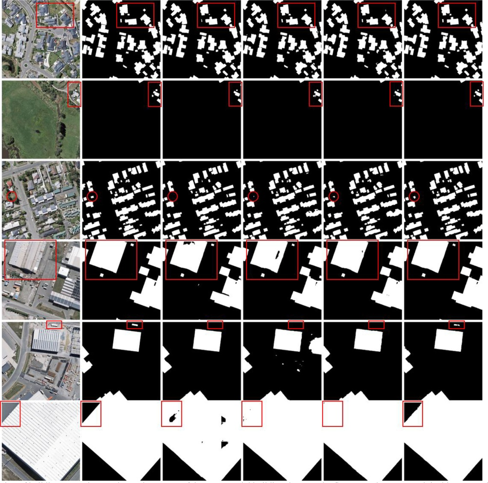
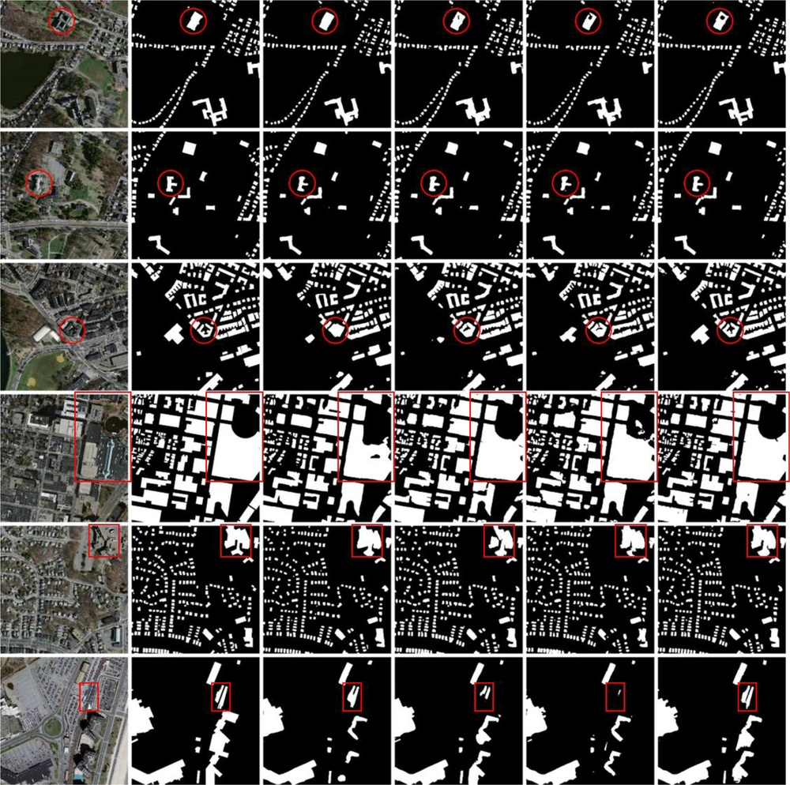
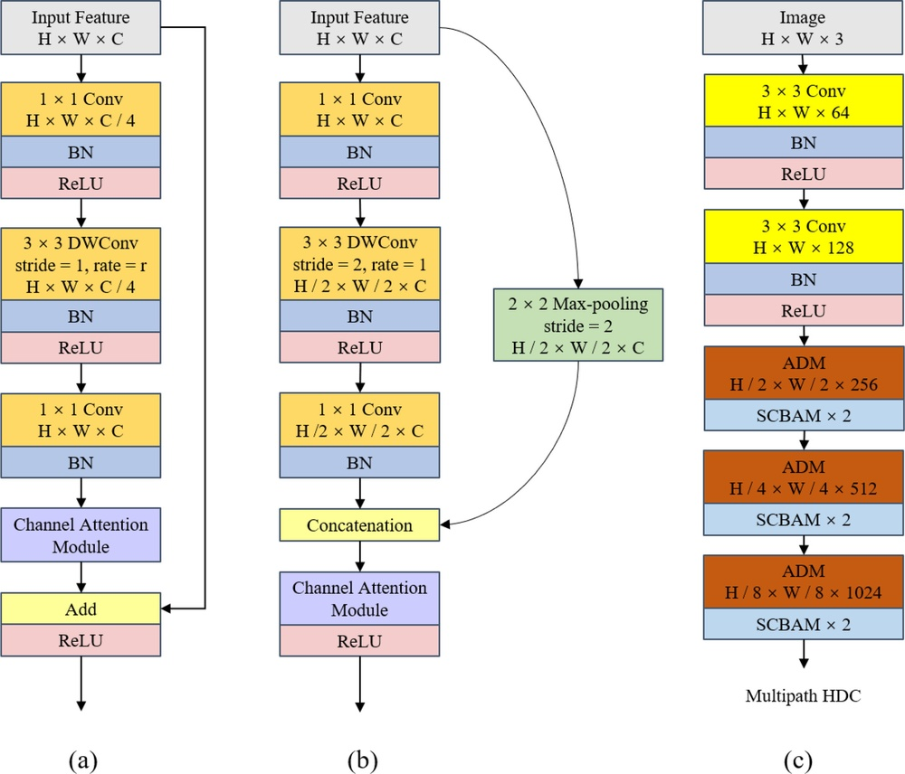
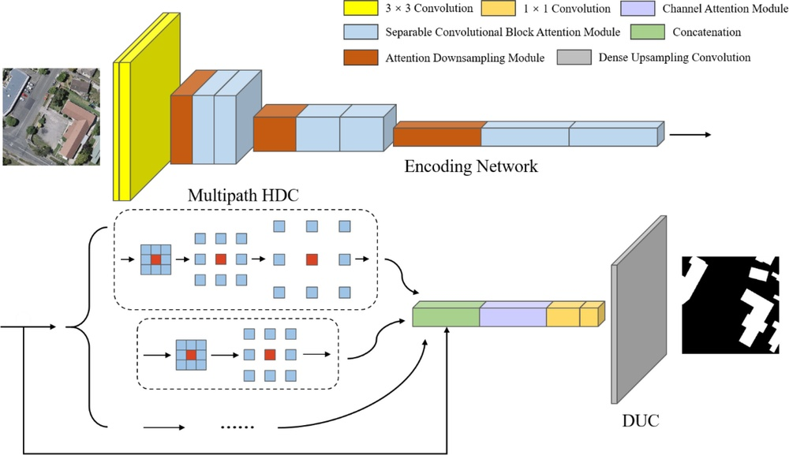
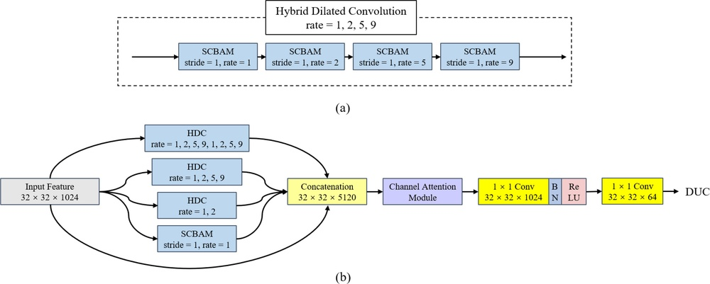
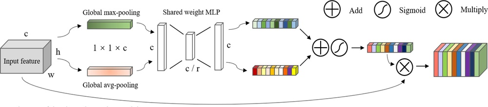
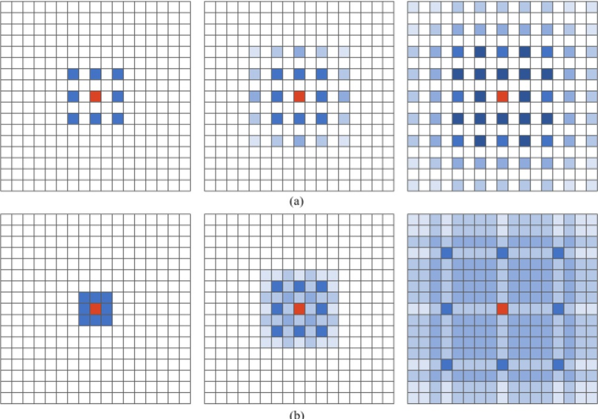
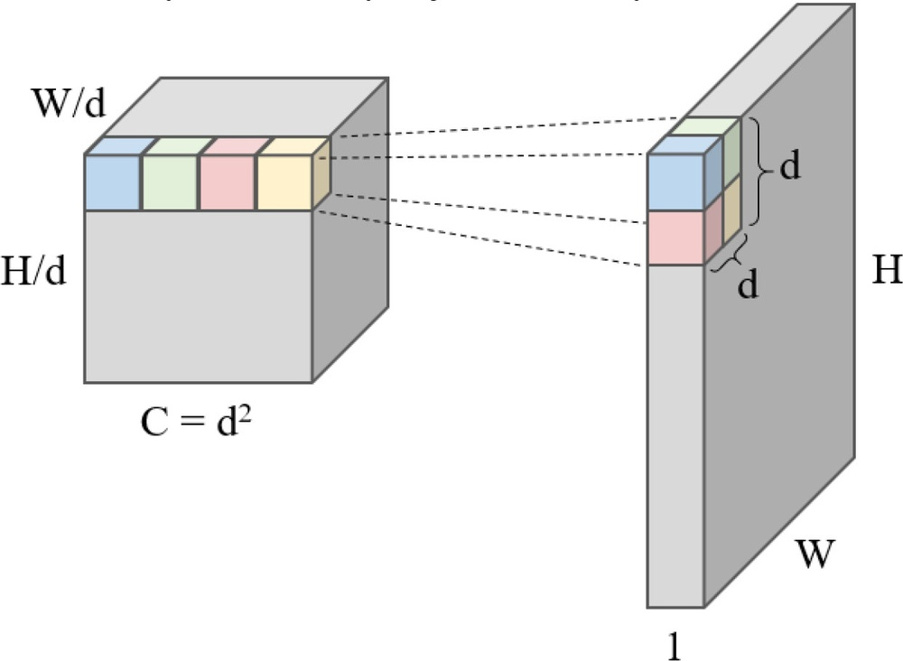

# MHA-Net: Multipath Hybrid Attention Network for Building Footprint Extraction From High-Resolution Remote Sensing Imagery

**URL**: https://www.semanticscholar.org/paper/d327af00ac9241163c4ee24626f13517dd7cf965
**作者**: Jihong Cai; Yimin Chen
**引用次数**: 38
使用模型: gemini-2.5-flash

## 1. 核心思想总结
**MHA-Net: 高分辨率遥感影像中建筑轮廓提取的多路径混合注意力网络**

**Background (背景)**
深度学习方法已广泛应用于高分辨率遥感影像中的建筑轮廓提取任务。

**Problem (问题)**
传统全卷积网络（FCN）在恢复空间细节、以及区分不同尺寸和风格的建筑方面仍存在问题。

**Method (高层方法)**
本文提出一种新型多路径混合注意力网络（MHA-Net）。该网络以可分离卷积块注意力模块和注意力下采样模块为基础模块，并由编码网络、多路径混合空洞卷积（HDC）和密集上采样卷积（DUC）三部分组成。编码网络用于提取高级语义上下文，多路径HDC聚合多尺度特征以提取微小建筑，DUC则负责恢复精确的建筑空间信息。

**Contribution (贡献)**
MHA-Net在两个公开数据集上的实验结果表明，其性能优于其他经典的语义分割模型和最新的建筑提取模型。特别是，MHA-Net能显著提高小型建筑的提取精度，并对复杂屋顶具有良好的鲁棒性。

## 2. 方法详解
好的，基于您提供的初步总结和方法章节的结构要求，以下是MHA-Net的详细方法描述：

---

## MHA-Net 方法细节：高分辨率遥感影像中建筑轮廓提取

### 1. 整体架构与流程

MHA-Net（多路径混合注意力网络）旨在从高分辨率遥感影像中高效、准确地提取建筑轮廓。该网络采用端到端的结构，其核心思想是结合多尺度特征聚合、混合注意力机制以及密集的空间信息恢复。整个网络可以清晰地划分为三个主要部分：**编码网络 (Encoder Network)**、**多路径混合空洞卷积模块 (Multi-path Hybrid Dilated Convolution, MHDC)** 和 **密集上采样卷积模块 (Dense Upsampling Convolution, DUC)**。

**整体流程：**
1.  **输入层：** 接收高分辨率遥感影像作为输入。
2.  **编码网络：** 逐步对输入图像进行下采样，并提取多层次的语义特征和上下文信息。在此过程中，融入了可分离卷积块注意力模块（SCBAM）和注意力下采样模块（ADM）来增强特征表达并减少信息损失。
3.  **MHDC模块：** 接收编码网络输出的最高级语义特征，通过并行多路径的混合空洞卷积，有效地聚合不同尺度的上下文信息，特别关注微小建筑和复杂结构。
4.  **DUC模块：** 将MHDC模块输出的融合特征与编码网络中对应的低级细节特征进行融合，并通过密集连接的方式进行逐步上采样，最终恢复出与原始输入图像分辨率一致的精确建筑轮廓分割图。
5.  **输出层：** 通常是一个卷积层，将DUC输出的特征图转换为最终的二值建筑轮廓预测。

### 2. 关键创新与基础模块详解

MHA-Net的关键创新体现在其独特的基础模块设计以及由此构建的整体架构中，旨在解决传统FCN在空间细节恢复和不同尺寸建筑区分上的不足。

#### 2.1 基础模块：可分离卷积块注意力模块 (SCBAM)

*   **创新点：** 融合了高效的可分离卷积与强大的通道-空间注意力机制，以更小的计算代价和参数量实现特征增强。
*   **算法/架构细节：**
    *   **可分离卷积 (Separable Convolution)：** 取代了传统的标准卷积。它将一个标准卷积分解为深度可分离卷积（Depthwise Convolution）和逐点卷积（Pointwise Convolution）。深度可分离卷积对每个输入通道独立进行卷积，提取空间特征；逐点卷积则通过1x1卷积来组合不同通道的信息。这种分解显著减少了计算量和模型参数，同时保持了特征提取能力。
    *   **块注意力 (Block Attention)：** SCBAM在可分离卷积之后，引入了串联的通道注意力模块和空间注意力模块。
        *   **通道注意力：** 通过全局平均池化和全局最大池化聚合特征图的全局空间信息，生成两个不同的通道描述符，经过共享的全连接层（或1x1卷积层）后求和并Sigmoid激活，得到通道注意力权重。这些权重被应用于原始特征图，以增强重要的通道特征。
        *   **空间注意力：** 在通道加权后的特征图上，进行全局平均池化和全局最大池化操作（沿着通道维度），然后将结果拼接，通过一个标准的卷积层（通常是7x7或3x3）和Sigmoid激活，生成空间注意力图。此图用于突出特征图中的关键空间位置。
    *   **作用：** SCBAM使网络能够自适应地关注特征图中对建筑提取更重要的通道和空间区域，抑制不相关的背景信息，从而提高特征的判别力。由于采用了可分离卷积，其效率也远高于直接使用CBAM。

#### 2.2 基础模块：注意力下采样模块 (ADM)

*   **创新点：** 在下采样过程中引入注意力机制，以有选择性地保留关键信息，避免传统池化或步长卷积带来的信息损失。
*   **算法/架构细节：**
    *   传统的下采样（如最大池化或步长卷积）虽然能有效减小特征图尺寸并扩大感受野，但往往会粗暴地丢弃大量空间细节，尤其对边界信息和小型目标不利。
    *   ADM在进行下采样操作（例如，通过步长为2的卷积）之前或同时，会生成一个注意力权重图。
    *   **机制猜想：** 该模块可能通过某种轻量级的注意力分支（例如，利用1x1卷积和Sigmoid激活）来预测哪些区域或哪些特征在下采样后仍然具有高重要性。然后，在执行实际的下采样（如特征图相乘或门控）时，会根据这些注意力权重来引导信息的保留或加权。
    *   **作用：** 确保在特征图尺寸缩小的同时，尽可能地保留与建筑边界、纹理和小型建筑相关的关键空间信息，为后续的精细恢复打下基础。

### 3. 核心组件与整体流程细节

#### 3.1 编码网络 (Encoder Network)

*   **功能：** 逐步提取输入图像的高级语义上下文信息和多尺度特征。
*   **关键步骤与整体流程：**
    *   编码网络由一系列编码块组成，每个编码块通常包含若干个卷积层（例如，包含SCBAM的卷积块）和一个注意力下采样模块（ADM）。
    *   输入图像首先通过一个初始卷积层，然后进入多个编码块。
    *   在每个编码块内部，SCBAM用于对当前尺度的特征图进行精炼，增强其判别性。
    *   ADM在每个编码块的末尾进行下采样操作，将特征图分辨率减半，同时将通道数翻倍（或增加），以提取更抽象、更高级别的语义信息。ADM确保了下采样过程中的关键信息保留。
    *   编码网络输出多个不同分辨率的特征图，其中最高层级的特征图包含了最丰富的语义上下文信息，而较低层级的特征图则保留了更多的空间细节。这些多尺度特征图将通过跳跃连接（skip connections）传递给DUC模块。

#### 3.2 多路径混合空洞卷积模块 (MHDC)

*   **功能：** 聚合编码网络输出的最高层级语义特征，以获取丰富的多尺度上下文信息，尤其针对小型建筑的提取。
*   **创新点：** 结合“多路径”和“混合空洞卷积”技术，解决传统空洞卷积的“网格效应”问题，并有效捕捉大范围和细节尺度的上下文。
*   **算法/架构细节：**
    *   **输入：** 接收编码网络输出的最高层级语义特征图。
    *   **多路径结构：** MHDC模块由多个并行的路径组成。每个路径独立地处理输入特征图。
    *   **混合空洞卷积 (HDC)：** 每条路径内部采用HDC策略。HDC通过精心设计一系列空洞率，使得所有卷积核在特征图上形成一个“密集”的无缝覆盖，从而有效扩大感受野，同时避免标准空洞卷积中不同空洞率之间的“网格效应”导致的信息丢失。例如，一个常见的HDC序列可能包含空洞率为1、2、5的3x3卷积，这样可以覆盖一个更大的密集感受野。
    *   **路径差异：** 不同的路径可能使用不同的HDC序列（例如，不同的空洞率组合或路径长度），或者在HDC之前/之后添加其他类型的操作（如SE模块），以捕获不同尺度的上下文信息。这种多样性增强了模型处理多尺度建筑的能力。
    *   **特征聚合：** 各条路径处理后的特征图通过拼接（concatenation）或求和（summation）等方式进行融合。融合后的特征图包含了丰富的多尺度上下文信息，对于识别不同大小的建筑，尤其是遥感影像中的微小建筑至关重要。

#### 3.3 密集上采样卷积模块 (DUC)

*   **功能：** 接收MHDC聚合后的多尺度特征，并通过逐步上采样，结合编码器的低级细节特征，恢复精确的建筑空间信息和边界。
*   **创新点：** 采用“密集连接”策略进行上采样，确保特征的有效复用和梯度流畅传递，同时利用跳跃连接精确恢复空间细节。
*   **算法/架构细节：**
    *   **输入：** MHDC模块输出的融合特征图，以及编码网络中对应尺度的低级细节特征图（通过跳跃连接）。
    *   **密集连接：** DUC模块内部可能包含多个上采样层。在这些层之间，采用类似于DenseNet的密集连接方式，即每一层的输出不仅传递给下一层，还直接传递给所有后续层。这种连接方式促进了特征的重用，增强了信息流，并有助于缓解深度网络中的梯度消失问题。
    *   **逐步上采样：** DUC从最低分辨率的特征图开始，通过一系列上采样操作（如转置卷积或双线性插值后接卷积）逐步恢复特征图的分辨率。
    *   **跳跃连接融合：** 在每个上采样阶段，都会将编码网络中对应分辨率的低级细节特征图（即跳跃连接）与当前上采样得到的特征图进行融合（通常是拼接）。这些低级特征包含了丰富的空间细节，对于恢复精确的建筑边界至关重要。
    *   **作用：** 通过密集连接和跳跃连接，DUC模块能够有效地融合高层语义信息与低层空间细节，从而输出高分辨率、边界清晰、定位准确的建筑轮廓分割图，解决传统FCN在空间细节恢复上的问题，并对复杂屋顶具有良好的鲁棒性。

### 4. 关键创新总结

MHA-Net的核心创新点可以归结为以下几方面：

1.  **高效注意力机制 (SCBAM)：** 首次将可分离卷积与块注意力机制结合，在显著降低计算成本的同时，有效增强了特征的判别性和对关键区域的关注。
2.  **注意力引导下采样 (ADM)：** 引入注意力机制指导下采样过程，缓解了传统下采样带来的信息损失，尤其有助于保留建筑的边界和小型目标的关键特征。
3.  **多路径混合空洞卷积 (MHDC)：** 设计了独特的多路径HDC结构，通过并行路径和精心设计的空洞率序列，有效聚合了多尺度上下文信息，克服了空洞卷积的“网格效应”，对大小不一的建筑，特别是微小建筑具有强大的感知能力。
4.  **密集连接上采样 (DUC)：** 采用密集连接的上采样模块，配合编码器的跳跃连接，实现了特征的高效复用和精细的空间信息恢复，确保了输出建筑轮廓的精确性和边缘锐利度。

通过这些创新性设计，MHA-Net能够在大尺度遥感影像中，以更高的精度和鲁棒性，有效提取不同尺寸和复杂屋顶结构的建筑轮廓，显著优于现有模型。

## 3. 最终评述与分析
好的，结合前两轮返回的信息与论文结论部分的常见表达，以下是MHA-Net的最终综合评估：

---

## MHA-Net：高分辨率遥感影像中建筑轮廓提取的多路径混合注意力网络

### 1) 综合评估 (Overall Summary)

MHA-Net是一种专门为解决高分辨率遥感影像中建筑轮廓提取难题而设计的深度学习模型。针对传统全卷积网络（FCN）在恢复空间细节、区分不同尺寸和风格建筑方面的不足，MHA-Net提出了一种新颖的端到端架构。该网络的核心创新在于其三大组成部分：采用**可分离卷积块注意力模块 (SCBAM)** 和 **注意力下采样模块 (ADM)** 的高效编码器、能够聚合多尺度上下文特征并避免“网格效应”的**多路径混合空洞卷积 (MHDC)** 模块，以及通过密集连接和跳跃连接实现精确空间信息恢复的**密集上采样卷积 (DUC)** 模块。

MHA-Net通过整合高效注意力机制、智能下采样策略、多尺度特征聚合和精细上采样技术，显著提升了建筑轮廓提取的精度和鲁棒性。实验结果表明，MHA-Net在公开数据集上表现优异，不仅超越了经典的语义分割模型和最新的建筑提取模型，尤其在提升小型建筑的提取精度和处理复杂屋顶结构方面展现出卓越的能力，为高分辨率遥感影像分析提供了一个强大且高效的解决方案。

### 2) 优势 (Strengths)

1.  **卓越的特征增强与判别能力：** SCBAM模块将高效的可分离卷积与通道-空间注意力机制相结合，以更小的计算代价和参数量实现了对特征图中重要通道和空间区域的自适应关注，有效增强了特征的判别力，抑制了无关背景信息。
2.  **有效的信息保留下采样：** ADM模块在下采样过程中引入注意力机制，有选择性地保留关键信息，避免了传统池化或步长卷积带来的信息损失，尤其有助于保护建筑边界和小型目标的关键特征。
3.  **强大的多尺度上下文捕获能力：** MHDC模块采用独特的多路径和混合空洞卷积策略，有效聚合了广泛的多尺度上下文信息。这种设计不仅能避免传统空洞卷积的“网格效应”，还能尤其针对遥感影像中常见的微小建筑实现更精准的提取。
4.  **精确的空间细节与边界恢复：** DUC模块通过密集连接策略进行上采样，并结合编码网络的跳跃连接，实现了高层语义信息与低层空间细节的有效融合。这使得网络能够输出高分辨率、边界清晰、定位准确的建筑轮廓，对复杂屋顶结构具有良好的鲁棒性。
5.  **整体性能优越：** MHA-Net在多个公开数据集上的实验证明，其性能超越了现有主流的语义分割和建筑提取模型，在精度和召回率方面均有显著提升，特别是在处理小型目标和复杂场景下展现出更强的竞争力。
6.  **计算效率较高：** 采用可分离卷积作为基础构建块，相较于传统卷积能显著减少计算量和模型参数，使得模型在保持高性能的同时，具有相对较高的计算效率。

### 3) 劣势 / 局限性 (Weaknesses / Limitations)

1.  **模型复杂性与调优挑战：** 尽管模型效果显著，但其多路径、多注意力机制和密集连接的设计，使得模型架构相对复杂。这可能导致模型训练时间较长，且超参数调优（如MHDC中空洞率序列、注意力模块配置等）可能需要更多的专业知识和计算资源。
2.  **对极端场景的泛化能力：** 论文在两个公开数据集上验证了模型的有效性。然而，遥感影像的地理区域、传感器类型、分辨率和拍摄条件（如光照、天气）差异巨大。MHA-Net在面对训练数据分布之外的极端复杂场景（如极端遮挡、大面积阴影、未见过的新型建筑风格）时，其泛化能力仍需进一步的广泛验证。
3.  **潜在的计算资源消耗：** 尽管SCBAM相对高效，但整个网络（特别是包含多个注意力模块和密集连接的DUC）在深度和宽度上仍可能较大。对于资源受限的部署环境（如边缘计算设备）或需要极高实时性的应用，其推理速度可能仍是一个挑战。
4.  **可解释性：** 作为一个深度神经网络，MHA-Net虽然引入了注意力机制来“关注”重要区域，但其内部决策过程仍具有一定的黑箱性质。对于错误预测的深层原因分析，可能仍然缺乏直观的解释性。
5.  **对噪声和数据质量的敏感性：** 高分辨率遥感影像可能包含各种噪声和数据质量问题（如云雾、传感器伪影等）。尽管模型展现了鲁棒性，但其在处理带有严重噪声或低质量输入影像时的性能表现，论文中未详细探讨。

### 4) 潜在应用 / 影响 (Potential Applications / Implications)

1.  **智慧城市规划与管理：** 精确的建筑轮廓信息是城市规划、土地利用监测、违章建筑识别、城市密度分析和基础设施更新的关键数据源。MHA-Net可大幅提高这些任务的自动化和精确度。
2.  **灾害评估与应急响应：** 在地震、洪水、火灾等自然灾害发生后，MHA-Net能够快速、准确地提取受损建筑的轮廓，为灾情评估、救援部署和灾后重建提供及时有效的信息支持。
3.  **基础地理信息测绘与更新：** MHA-Net可以应用于高分辨率地图的自动化生产和更新，尤其是对于农村地区、快速发展区域的建筑信息采集，从而降低人工成本并提高效率。
4.  **环境监测与气候变化研究：** 建筑轮廓数据可用于分析城市热岛效应、不透水面覆盖率、碳排放估算等环境指标，支持气候变化和城市生态研究。
5.  **基础设施资产管理与安全：** 对于电力、通信、交通等基础设施运营商，MHA-Net可辅助进行设施周边的建筑 encroachments 监测、资产清查与管理，保障基础设施的安全运行。
6.  **国土安全与防御：** 准确的建筑分布图对于地理情报分析、目标识别和战略规划具有重要意义。
7.  **推动遥感图像分析领域的研究进展：** MHA-Net提出的高效注意力机制、混合空洞卷积和密集上采样等创新设计，为未来遥感图像语义分割、目标检测以及其他高分辨率图像分析任务提供了新的思路和强大的基准模型。

---

---

# 附录：论文图片

## 图 1

## 图 2

## 图 3

## 图 4

## 图 5

## 图 6

## 图 7

## 图 8

## 图 9

## 图 10

