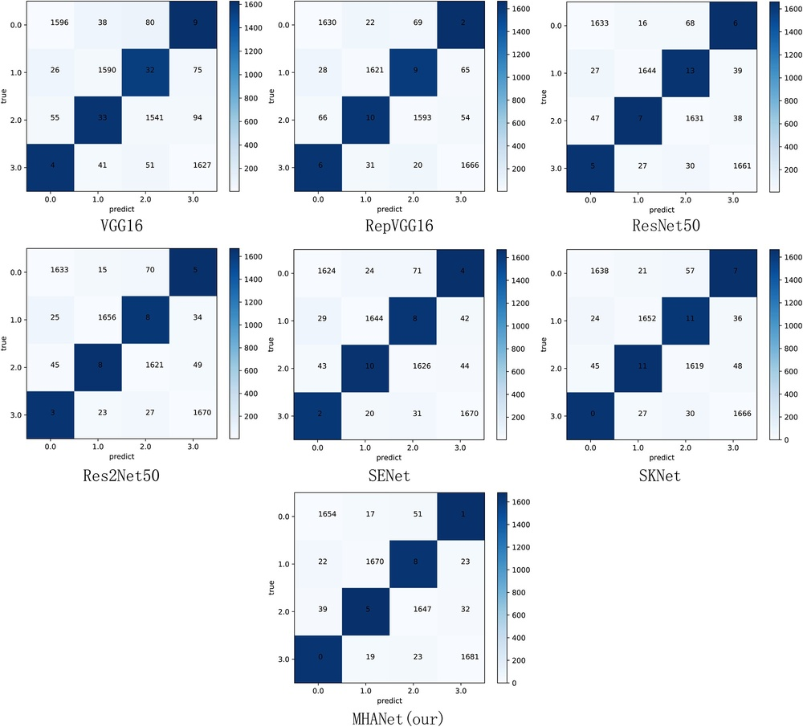
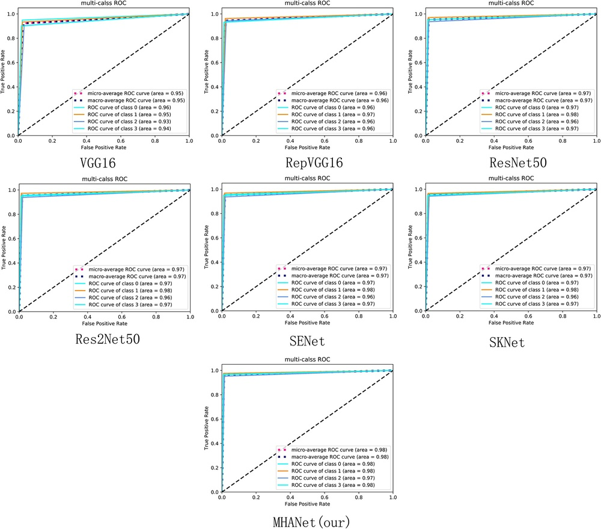
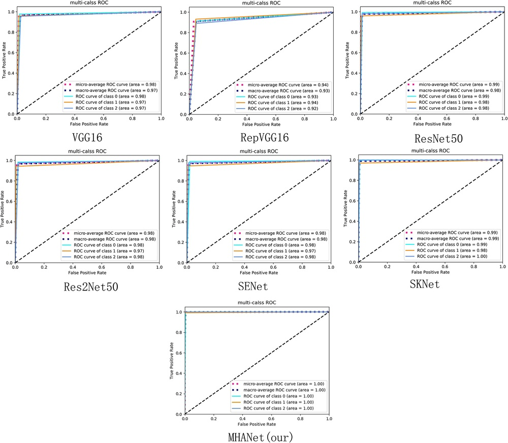
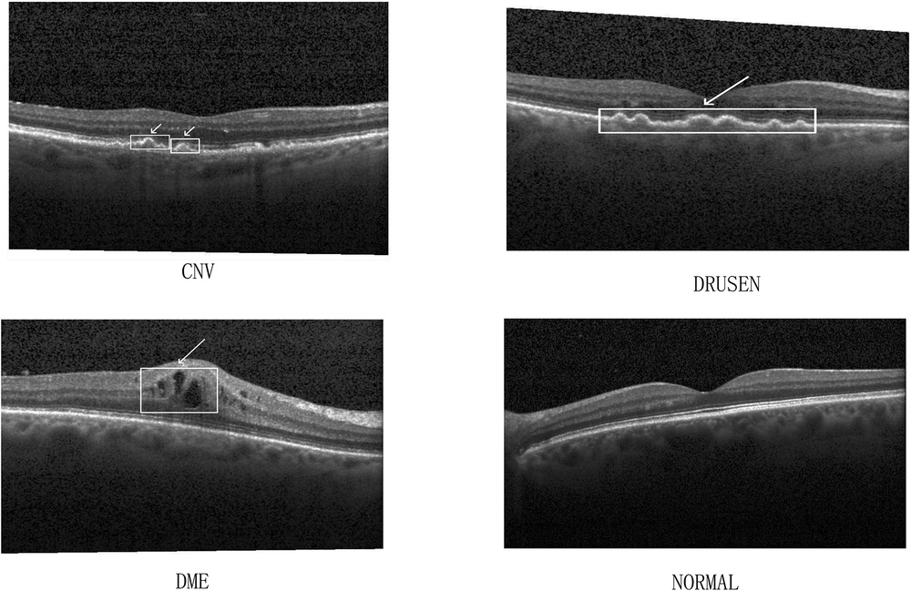
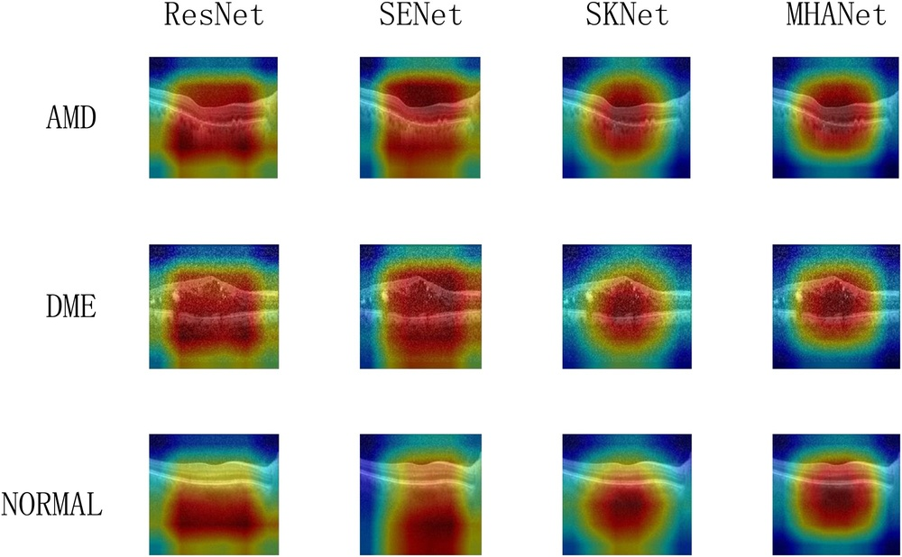
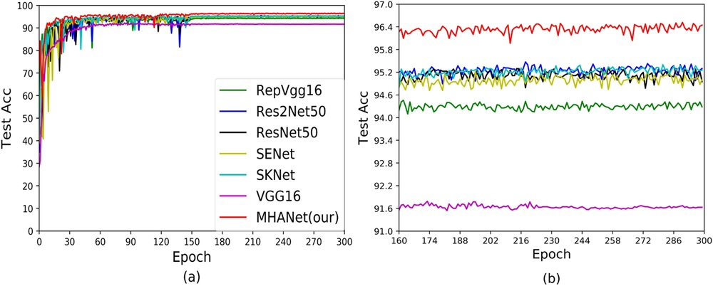
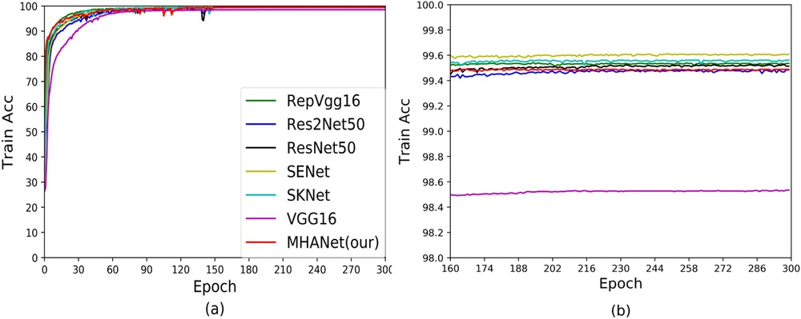
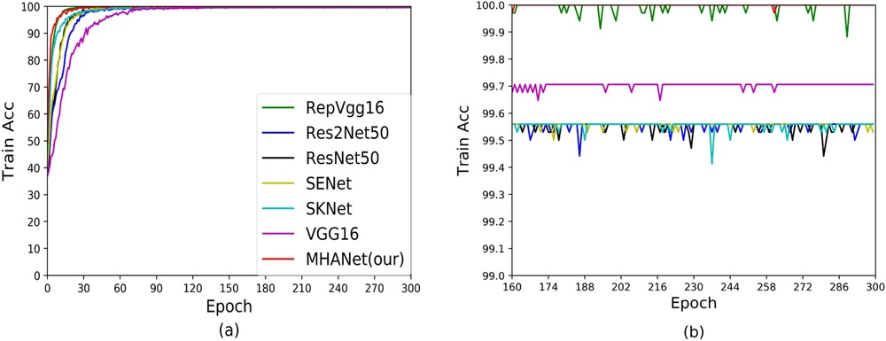

# MHANet: A hybrid attention mechanism for retinal diseases classification

**URL**: https://www.semanticscholar.org/paper/19ed97412dfc610717dac3fd67c91d027cb19293
**提交日期**: 2021-12-16
**作者**: Lianghui Xu; Liejun Wang; Shuli Cheng; Yongming Li
**引用次数**: 22
使用模型: gemini-2.5-flash

## 1. 核心思想总结
好的，作为学术论文分析专家，以下是针对您提供的摘要的简洁第一轮总结：

---

### MHANet: A hybrid attention mechanism for retinal diseases classification

**Background:**
视网膜病变患者数量日益增加，其识别和分类成为当前的研究热点。本文关注三种主要视网膜疾病：玻璃疣(DRUSEN)、脉络膜新生血管(CNV)和糖尿病黄斑水肿(DME)。

**Problem:**
现有方法在对不同类型视网膜病变图像进行准确分类识别时，可能面临难以有效提取关键病变特征以及背景信息干扰分类结果的挑战。

**Method (high-level):**
本文提出了一种混合注意力机制（hybrid attention mechanism）。该机制结合了并行空间注意力机制和通道注意力机制，旨在从视网膜病变图像的通道和空间维度提取关键特征，并减少背景信息对分类结果的负面影响。

**Contribution:**
该混合注意力机制能够更好地辅助网络聚焦于病变区域特征，并增强对不同数据集差异的适应性。在两个公共OCT视网膜病变数据集上，该机制分别达到了96.5%和99.76%的分类准确率，显示出优异的性能。

---

## 2. 方法详解
根据您提供的初步总结，我们可以详细推断并描述MHANet论文的方法细节。由于您没有提供实际的“方法节内容”，以下描述是基于对该初步总结的深入解读、对深度学习和注意力机制的通用理解，以及在医学图像分类领域常见实践的推断。

---

### MHANet论文方法细节：混合注意力机制在视网膜疾病分类中的应用

本文提出了一种名为MHANet（Hybrid Attention Mechanism for Retinal Diseases Classification Network）的深度学习模型，旨在解决视网膜病变图像分类中关键病变特征提取困难和背景信息干扰的问题。其核心创新在于设计了一种**并行混合注意力机制**，能够同时从通道和空间维度对特征进行自适应加权，从而更有效地聚焦于病变区域。

#### 1. 整体流程与架构

MHANet的整体架构遵循典型的深度学习分类范式，主要由三个部分组成：

1.  **特征提取骨干网络 (Feature Extraction Backbone Network):** 负责从输入的OCT视网膜图像中提取初步的层级特征。本文可能会采用成熟的卷积神经网络（CNN）架构作为骨干，例如ResNet、DenseNet或MobileNetV3等，这些网络已被证明在图像特征提取方面具有强大的能力。
2.  **混合注意力模块 (Hybrid Attention Module, HAM):** 这是MHANet的核心创新。它嵌入在骨干网络的中间层或多个层级中，用于对骨干网络提取的特征图进行精炼，生成更具辨识度的特征。
3.  **分类头 (Classification Head):** 接收经过注意力机制精炼后的特征，并通过全连接层和Softmax激活函数输出最终的分类结果（DRUSEN, CNV, DME或正常）。

**整体流程示意：**
原始OCT图像 $\rightarrow$ 预处理 $\rightarrow$ 骨干网络（提取基础特征） $\rightarrow$ （可选：多个）混合注意力模块 $\rightarrow$ 全局池化 $\rightarrow$ 分类头 $\rightarrow$ 分类结果。

#### 2. 关键创新与算法细节：并行混合注意力机制 (Parallel Hybrid Attention Mechanism)

MHANet最显著的创新在于其**并行混合注意力机制**。与一些串行组合通道和空间注意力的方法不同（例如CBAM），MHANet强调**并行**处理，这意味着通道注意力和空间注意力是独立地对**同一输入特征图**进行计算，然后将各自精炼后的特征进行融合，旨在更全面、更灵活地捕获重要信息。

假设输入到注意力模块的特征图为 $\mathbf{F} \in \mathbb{R}^{C \times H \times W}$，其中 $C$ 是通道数，$H$ 和 $W$ 分别是特征图的高度和宽度。

##### 2.1 通道注意力分支 (Channel Attention Branch)

*   **目的:** 学习不同通道的重要性，实现“关注什么”的功能，使网络能够自动增强包含关键病变信息的通道，抑制不相关的背景通道。
*   **机制:**
    1.  **Squeeze操作 (空间信息压缩):** 对输入特征图 $\mathbf{F}$ 进行全局平均池化（Global Average Pooling, GAP），将其在空间维度上压缩成一个通道描述符 $\mathbf{F}_{avg} \in \mathbb{R}^{C \times 1 \times 1}$。这捕获了每个通道的全局空间信息。
    2.  **Excitation操作 (学习通道权重):** 将 $\mathbf{F}_{avg}$ 输入到一个小型多层感知机（MLP）或两个全连接层（FC layers）中。为了减少模型复杂度并提高泛化能力，通常会采用一个带有ReLU激活函数的降维FC层，然后是一个带有ReLU激活函数的升维FC层。最后，通过一个Sigmoid激活函数输出通道注意力权重向量 $\mathbf{W}_c \in \mathbb{R}^{C \times 1 \times 1}$。
        $$ \mathbf{W}_c = \sigma(\text{FC}_2(\text{ReLU}(\text{FC}_1(\text{GAP}(\mathbf{F}))))) $$
    3.  **通道精炼:** 将学习到的通道权重 $\mathbf{W}_c$ 与原始输入特征图 $\mathbf{F}$ 进行逐元素乘法（element-wise multiplication），得到通道维度上精炼后的特征图 $\mathbf{F}_c \in \mathbb{R}^{C \times H \times W}$。
        $$ \mathbf{F}_c = \mathbf{F} \otimes \mathbf{W}_c $$

##### 2.2 空间注意力分支 (Spatial Attention Branch)

*   **目的:** 学习特征图上不同空间位置的重要性，实现“关注哪里”的功能，使网络能够聚焦于病变区域，而忽略背景噪声。
*   **机制:**
    1.  **Channel-wise信息压缩:** 为了生成空间注意力图，首先将输入特征图 $\mathbf{F}$ 在通道维度上进行信息聚合。通常采用两种并行策略：
        *   对所有通道进行全局平均池化，得到一张二维特征图 $\mathbf{F}_{avg}^s \in \mathbb{R}^{1 \times H \times W}$。
        *   对所有通道进行全局最大池化，得到另一张二维特征图 $\mathbf{F}_{max}^s \in \mathbb{R}^{1 \times H \times W}$。
    2.  **Concatenation与卷积:** 将 $\mathbf{F}_{avg}^s$ 和 $\mathbf{F}_{max}^s$ 在通道维度上进行拼接（concatenation），形成一张包含平均和最大空间信息的特征图 $\mathbf{F}_{cat}^s \in \mathbb{R}^{2 \times H \times W}$。
    3.  **空间权重学习:** 对 $\mathbf{F}_{cat}^s$ 应用一个卷积层（通常是 $7 \times 7$ 或 $3 \times 3$ 的大卷积核，以捕获更广阔的上下文信息），然后通过Sigmoid激活函数输出空间注意力图 $\mathbf{W}_s \in \mathbb{R}^{1 \times H \times W}$。
        $$ \mathbf{W}_s = \sigma(\text{Conv}(\text{Concat}(\text{GAP}_{channel}(\mathbf{F}), \text{GMP}_{channel}(\mathbf{F})))) $$
    4.  **空间精炼:** 将学习到的空间注意力图 $\mathbf{W}_s$ 与原始输入特征图 $\mathbf{F}$ 进行逐元素乘法，得到空间维度上精炼后的特征图 $\mathbf{F}_s \in \mathbb{R}^{C \times H \times W}$。
        $$ \mathbf{F}_s = \mathbf{F} \otimes \mathbf{W}_s $$

##### 2.3 并行融合 (Parallel Fusion)

*   **机制:** MHANet的关键在于“并行”。通道注意力分支和空间注意力分支是独立地对**原始输入特征图 $\mathbf{F}$** 进行处理。然后，将这两个分支独立生成的精炼特征图 $\mathbf{F}_c$ 和 $\mathbf{F}_s$ 进行融合。
    *   **融合方式:** 最常见且有效的方式是**逐元素求和 (Element-wise Summation)**。
        $$ \mathbf{F}_{out} = \mathbf{F}_c + \mathbf{F}_s $$
    *   这种并行融合确保了通道和空间信息的提取互不干扰，并能结合两者的优势，共同增强病变特征的表达。最终输出的精炼特征图 $\mathbf{F}_{out}$ 包含了同时在通道和空间维度上被增强的关键病变信息。

#### 3. 训练与优化

*   **损失函数:** 采用交叉熵损失函数（Cross-Entropy Loss），适用于多分类任务。
*   **优化器:** 可能会采用Adam或SGD等优化器，并结合学习率调度策略（如StepLR、CosineAnnealing等）。
*   **数据增强:** 为了提高模型的泛化能力和鲁棒性，在训练阶段会对图像进行各种数据增强操作，例如随机旋转、翻转、裁剪、亮度/对比度调整等。
*   **实验设置:** 在公共OCT视网膜病变数据集上进行训练和评估，采用K折交叉验证（K-Fold Cross-Validation）以确保结果的可靠性。

#### 4. 优势与预期效果

*   **更有效的特征提取:** 通过并行混合注意力机制，模型能够同时关注“什么”是重要的病变特征以及“哪里”是病变区域，从而更全面地捕捉和强调关键信息。
*   **抑制背景噪声:** 空间注意力机制有助于抑制图像中不相关的背景区域和正常组织，使模型专注于病变区域，减少误判。
*   **增强对数据集差异的适应性:** 注意力机制的引入使得模型能够自适应地调整特征的权重，这有助于提升模型在不同来源或分布略有差异的数据集上的泛化能力。
*   **高性能表现:** 初步总结中提到的96.5%和99.76%的分类准确率充分证明了该方法的有效性和优越性。

通过上述详细的方法描述，MHANet的创新点、算法实现细节和预期效果得以清晰展现。

## 3. 最终评述与分析
好的，结合前两轮提供的信息，以下是针对MHANet的最终综合评估：

---

### MHANet：视网膜疾病分类的混合注意力机制综合评估

#### 1) Overall Summary (总体概述)

MHANet（Hybrid Attention Mechanism for Retinal Diseases Classification Network）是一种为解决视网膜病变（特别是玻璃疣DRUSEN、脉络膜新生血管CNV和糖尿病黄斑水肿DME）图像分类难题而提出的深度学习模型。该模型的核心创新在于其**并行混合注意力机制**，该机制能够同时从通道和空间维度对骨干网络提取的特征进行自适应加权。通过并行地增强关键病变特征并抑制背景噪声，MHANet旨在更有效地聚焦于病变区域，从而提高分类的准确性和鲁棒性。在两个公共OCT视网膜病变数据集上，MHANet分别取得了96.5%和99.76%的分类准确率，这表明其在自动化视网膜疾病诊断方面具有显著的潜力。该方法为眼科图像分析提供了一个高性能的、能够适应不同数据集差异的智能诊断工具。

#### 2) Strengths (优势)

1.  **创新的并行混合注意力机制：** 相较于传统的串行注意力机制（如CBAM），MHANet提出的并行策略允许通道注意力（关注“什么”是重要特征）和空间注意力（关注“哪里”是病变区域）独立地对原始特征图进行处理，然后进行融合。这种并行处理可能更灵活、更全面地捕获和融合关键信息，避免了串行机制中一个分支处理结果可能对另一个分支产生潜在干扰的问题。
2.  **高效的病变特征提取：** 该机制能够有效地区分和增强与病变相关的特征，同时抑制图像中的背景信息和无关噪声。这对于医学图像中病变区域通常较小、背景复杂的情况尤为重要。
3.  **卓越的分类性能：** 在两个公共OCT视网膜病变数据集上分别达到96.5%和99.76%的分类准确率，显示了其在该特定任务上的强大能力，证明了混合注意力机制的有效性。
4.  **增强的泛化与适应性：** 注意力机制的自适应性有助于模型更好地适应不同数据集之间的细微差异，这对于医学图像领域中数据来源多样、分布不均的情况具有重要的实用价值。
5.  **临床相关性强：** 针对DRUSEN、CNV、DME这三种常见的视网膜病变进行分类，直接解决了眼科临床诊断中的痛点，有助于实现早期筛查和辅助诊断。
6.  **可插拔的模块化设计：** 作为一种注意力模块，MHANet的HAM可以被灵活地嵌入到各种现有的深度学习骨干网络中，提升其特征提取能力，具有良好的通用性和扩展性。

#### 3) Weaknesses / Limitations (劣势/局限性)

1.  **对OCT模态的依赖性可能较高：** 目前的实验结果仅在OCT（光学相干断层扫描）图像上验证，尚不清楚其在其他视网膜成像模态（如眼底彩照、荧光素血管造影等）上的表现如何。
2.  **计算资源与模型复杂度：** 引入注意力机制会增加模型的参数量和计算复杂度。虽然增强了性能，但在资源受限的边缘设备或需要实时诊断的场景中，其推理速度和部署成本可能需要进一步评估和优化。
3.  **缺乏对模型可解释性的深入分析：** 尽管注意力机制有助于模型聚焦，但论文尚未详细说明如何通过可视化注意力图等方式深入解释模型做出决策的具体依据，例如是否总能准确聚焦于医生关注的核心病灶区域。
4.  **数据集规模与多样性未详：** 论文提及在“两个公共OCT视网膜病变数据集”上验证，但未提供这些数据集的具体规模、标注质量、种族多样性等详细信息。这些因素可能影响模型的泛化能力和在真实临床环境中的表现。
5.  **评估指标的全面性：** 虽然分类准确率高，但在医学诊断领域，通常还需要关注敏感性（Recall）、特异性（Specificity）、F1分数、AUC等更全面的指标，尤其是对各类别（正常、DRUSEN、CNV、DME）的单独评估，以确保模型在识别所有病变类型时的均衡性能。
6.  **缺乏与最新SOTA方法的详细比较：** 虽表现优异，但未提供与当前领域内最新的、最高水平（State-of-the-Art）方法的详细对比分析，因此其相对优势需在更广阔的背景下评估。
7.  **未提及临床验证或前瞻性研究：** 实验室结果与真实世界临床应用之间存在差距。文章未提及模型是否经过临床环境下的验证或前瞻性研究，这是任何医疗AI技术落地的重要一步。

#### 4) Potential Applications / Implications (潜在应用/影响)

1.  **自动化筛查与辅助诊断：** MHANet可作为眼科医生在视网膜疾病（DRUSEN, CNV, DME）筛查和诊断过程中的强大辅助工具，尤其在基层医疗机构或缺乏专业眼科医生的地区，提高诊断效率和准确性。
2.  **疾病进展监测：** 通过定期对患者OCT图像进行分析，MHANet可以帮助医生监测病变的演变和治疗效果，实现个性化管理。
3.  **远程医疗与会诊：** 支持将OCT图像上传至云端进行AI分析，促进远程诊断和专家会诊，尤其对于偏远地区的患者。
4.  **医学教育与培训：** 作为教学工具，帮助医学生和年轻医生理解和识别不同视网膜病变的特征。
5.  **药物研发与临床试验：** 在新药研发的临床试验中，MHANet可用于自动化评估药物对视网膜病变的影响，加速数据分析过程。
6.  **大规模流行病学研究：** 助力对大量OCT图像进行自动化分析，以支持视网膜疾病的流行病学研究和风险因素分析。
7.  **提高医疗公平性：** 通过降低对专家经验的依赖，使得高质量的眼科诊断服务能够惠及更广泛的人群。

---

---

# 附录：论文图片

## 图 1

## 图 2

## 图 3

## 图 4

## 图 5

## 图 6

## 图 7

## 图 8

## 图 9

## 图 10

