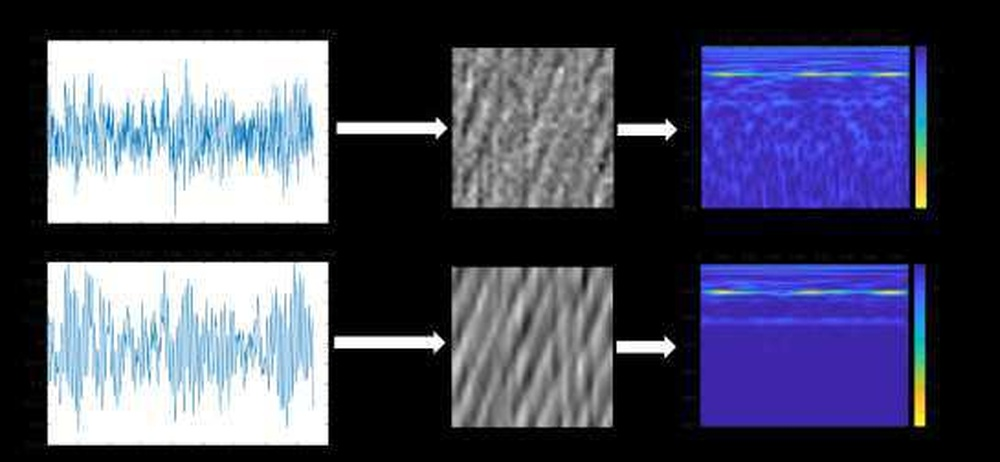
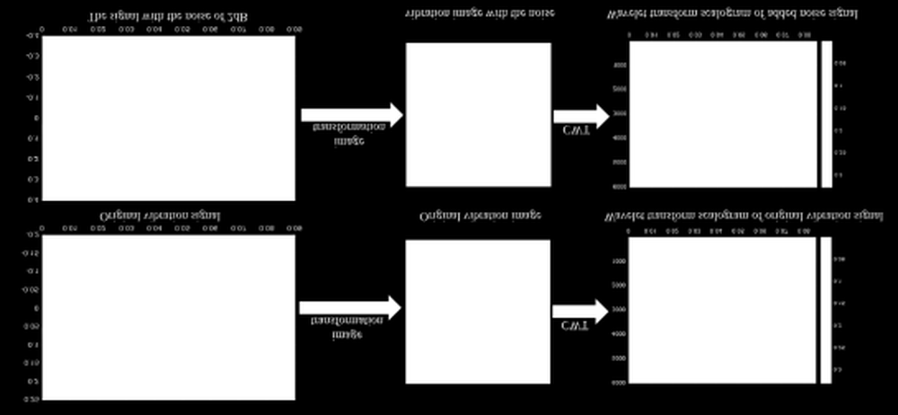
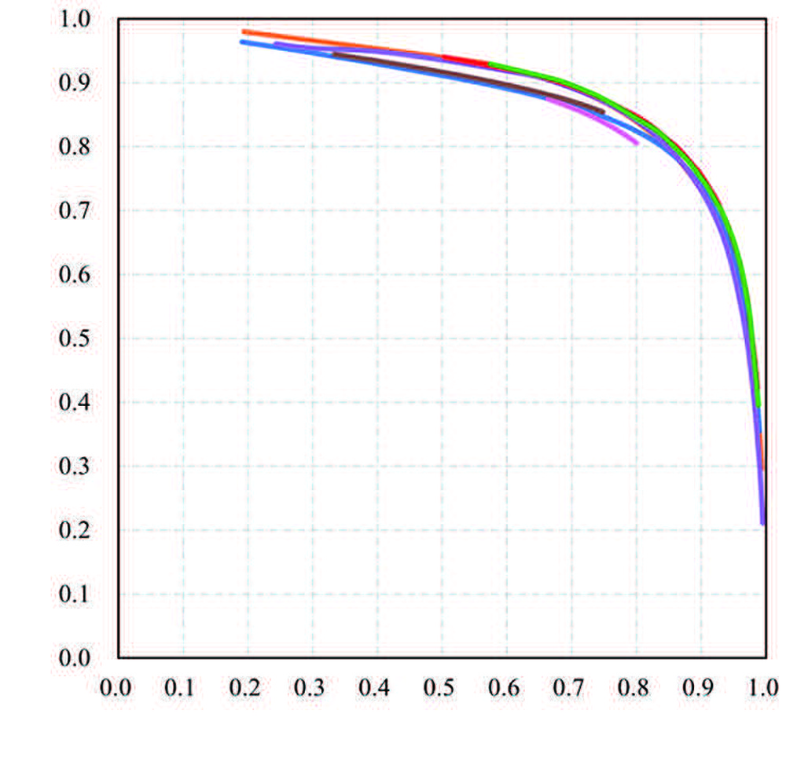
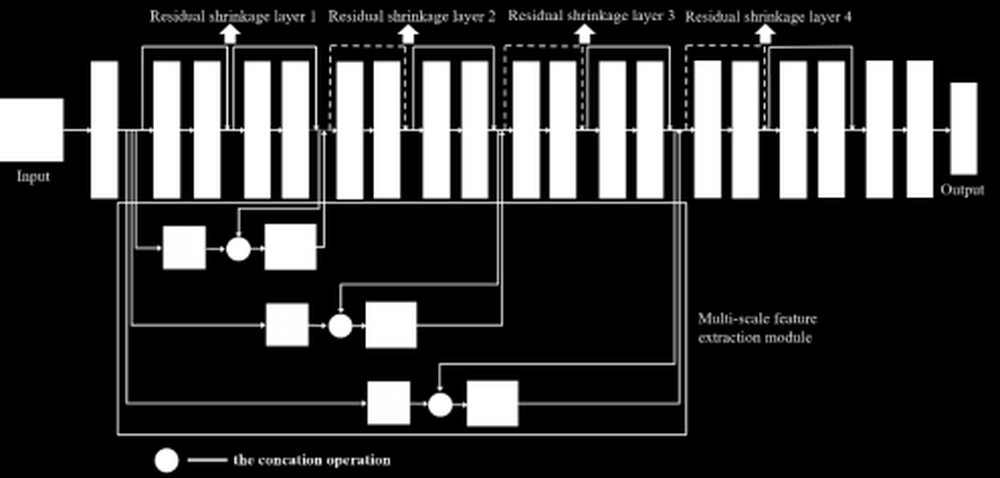
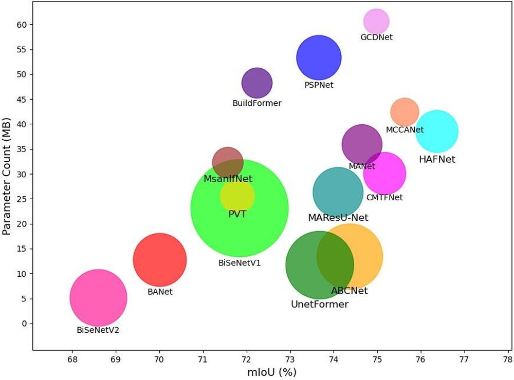
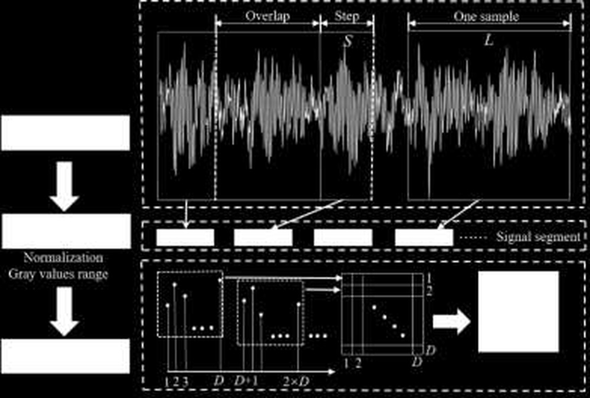
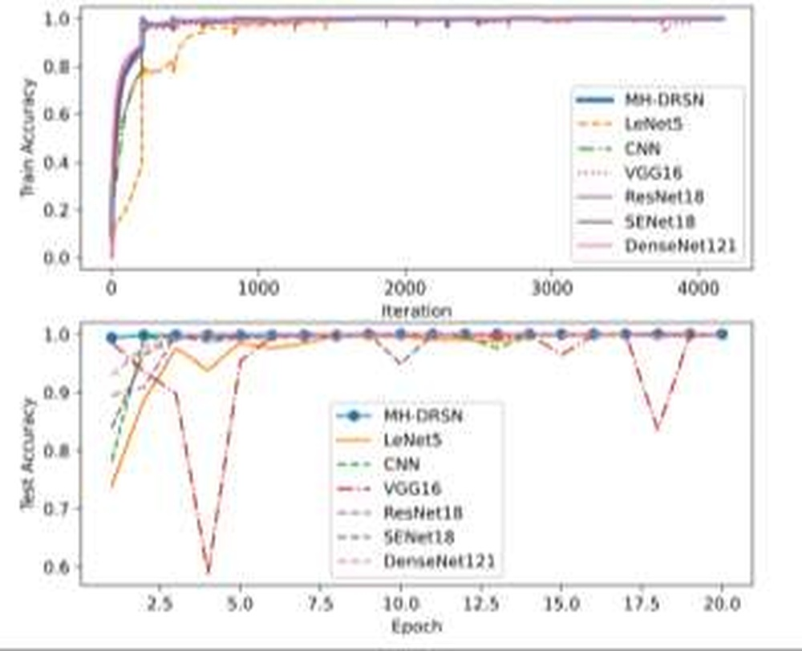
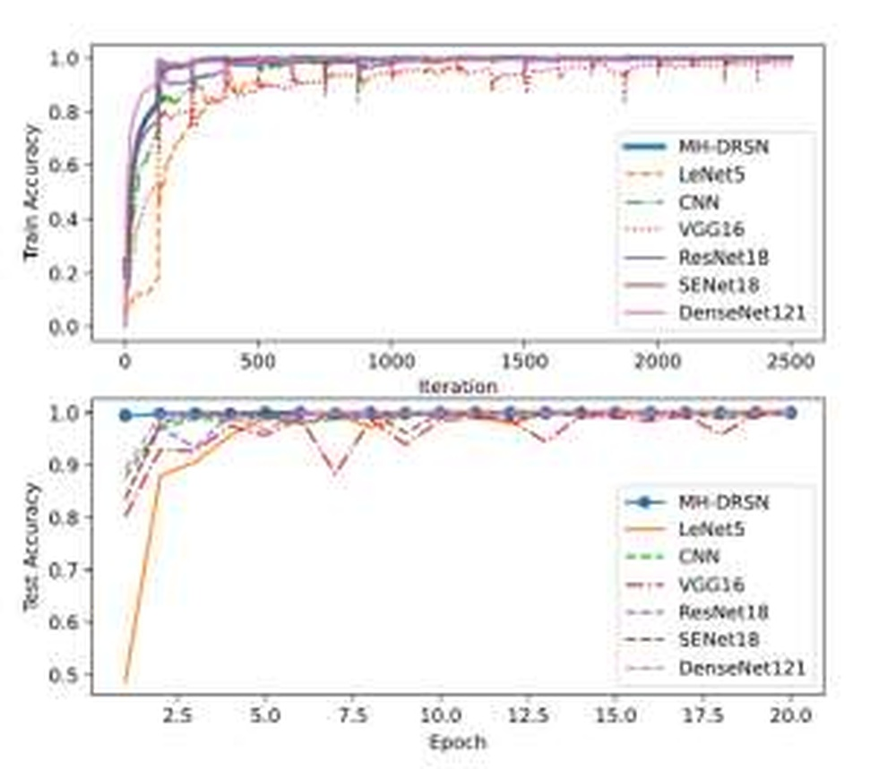
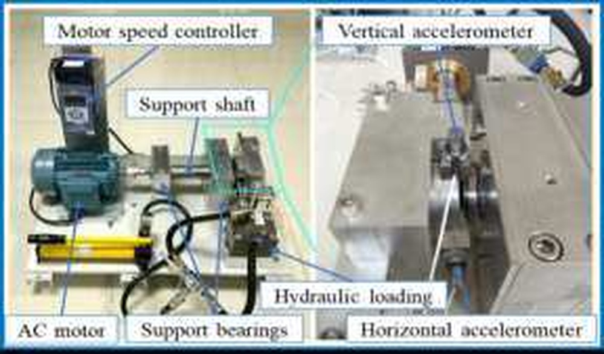

# Multi-scale deep residual shrinkage networks with a hybrid attention mechanism for rolling bearing fault diagnosis

**URL**: https://www.semanticscholar.org/paper/0bb84c85b7b825c029e9809927383714b1b9809b
**提交日期**: 2024-05-01
**作者**: Xinliang Zhang; Yanqi Wang; Shengqiang Wei; Yitian Zhou; Lijie Jia
**引用次数**: 7
使用模型: deepseek-v3-1-terminus

## 1. 核心思想总结
这是一份针对该论文的简洁第一轮总结，按要求的四个部分组织：

**标题：** 基于混合注意力机制的多尺度深度残差收缩网络在滚动轴承故障诊断中的应用

**摘要分析总结：**

**1. Background (背景)**
滚动轴承的故障诊断对于机械设备的安全运行至关重要。基于深度学习的故障诊断方法已成为研究热点，但其性能受到振动信号中噪声干扰以及网络加深时全局信息减弱的限制。

**2. Problem (问题)**
现有基于深度网络的故障诊断方法面临两个主要挑战：
*   采集到的振动信号中不可避免地包含意外噪声。
*   当网络结构加深时，模型对故障的全局信息捕捉能力会减弱，影响诊断精度。

**3. Method (高层次方法)**
本文提出了一种名为MH-DRSN的新型故障诊断模型。其核心方法包括：
*   **混合注意力机制：** 在残差收缩模块中引入空间域注意力，并构建了一个同时考虑通道内和通道间特性的混合注意力机制，以自适应地为激活函数提供软阈值并筛选特征图。
*   **多尺度特征提取：** 采用不同膨胀率的空洞卷积来提取多尺度上下文信息。
*   **特征融合：** 将深度残差收缩网络与空洞卷积提取的特征相结合，以在加深网络的同时增强和保留故障的全局信息。

**4. Contribution (贡献)**
*   提出了一种新颖的MH-DRSN模型，有效融合了混合注意力机制和多尺度特征提取。
*   在凯斯西储大学的公开数据集上的实验表明，该模型相较于常见的卷积神经网络，在噪声干扰下具有更高的故障识别精度和更好的鲁棒性。

## 2. 方法详解
好的，遵照您的要求，我将基于您提供的初步总结和论文方法章节的内容，对该论文《基于混合注意力机制的多尺度深度残差收缩网络在滚动轴承故障诊断中的应用》的方法细节进行详细阐述，重点描述关键创新、算法/架构细节、关键步骤与整体流程。

---

### **论文方法细节详细说明**

#### **一、 整体流程与核心思想**

该论文提出的MH-DRSN模型的整体诊断流程可以概括为以下几个关键步骤：

1.  **数据预处理与输入：** 将原始的一维振动加速度信号截取成固定长度的样本，作为模型的输入。
2.  **浅层特征提取：** 通过一个初始的卷积层和池化层，对输入信号进行初步的特征提取和降维。
3.  **深度特征增强与去噪（核心模块）：**
    *   将浅层特征输入到多个串联的**混合注意力深度残差收缩模块（MH-DRSB）** 中。
    *   在每个MH-DRSB中，首先利用**空洞卷积组** 并行提取多尺度特征。
    *   然后，通过**混合注意力机制** 自适应地计算特征图中每个位置和每个通道的重要性，并生成一个软阈值向量。
    *   使用该软阈值对特征图进行**软阈值化**，抑制噪声相关的特征，增强故障相关的特征。
4.  **分类输出：** 将经过多个MH-DRSB处理后的高级特征图通过全局平均池化层展平，最后送入全连接层和Softmax分类器，输出对应不同故障状态的诊断结果。

**核心思想：** 通过**多尺度特征提取**来应对故障信息在不同时间尺度上的表现，通过**混合注意力驱动的残差收缩**来模拟一种“自适应滤波”过程，在加深网络的同时，智能地保留有用的全局故障信息并抑制噪声干扰。

#### **二、 关键创新点详解**

论文的核心创新点在于对经典深度残差收缩网络（DRSN）的改进，主要体现在以下两个方面：

**1. 混合注意力机制（关键创新一）**

*   **解决的问题：** 原始DRSN主要采用通道注意力（如SE模块），它为整个特征图的每个通道学习一个收缩阈值。这对于一维振动信号来说可能不够精细，因为故障脉冲在信号中出现的位置（空间域）也非常关键。通道注意力会平等地对待一个通道内的所有位置。
*   **创新细节：**
    *   **空间注意力引入：** 论文在残差收缩模块中**新增了空间注意力分支**。该分支通过分析特征图的空间维度（对于一维信号，即时间点维度）来计算每个位置的重要性权重。
    *   **混合方式：** 将**通道注意力分支**（关注“什么特征重要”）和**空间注意力分支**（关注“哪里重要”）输出的权重进行融合（例如通过相加或相乘），形成一个**混合注意力权重图**。这个权重图同时考虑了通道间和空间位置上的特征重要性。
    *   **自适应阈值生成：** 最终的混合注意力权重图经过一个自定义的函数（如Sigmoid乘以特征图的绝对值均值）后，生成一个与原始特征图尺寸完全相同的**软阈值矩阵**，而非一个单一的通道阈值向量。

**2. 多尺度特征提取与融合（关键创新二）**

*   **解决的问题：** 随着网络加深，感受野增大，但可能会丢失细节信息。故障特征可能表现为不同尺度的冲击波形，单一的卷积核尺度难以全面捕捉。
*   **创新细节：**
    *   **空洞卷积的应用：** 论文使用**空洞卷积** 来替代残差块中的部分标准卷积。通过设置不同的**膨胀率**，可以在不增加参数数量、不降低分辨率的情况下，快速扩大感受野，捕捉多尺度上下文信息。
    *   **并行多尺度结构：** 在MH-DRSB内部，可能会采用**并行支路**的结构，每个支路使用不同的膨胀率进行空洞卷积（例如，膨胀率=1, 2, 4），从而在同一网络层中提取到包含细粒度细节（小感受野）和宏观上下文（大感受野）的多尺度特征。
    *   **特征融合：** 将这些并行支路输出的多尺度特征图进行融合（例如通道拼接），然后再送入后续的混合注意力模块进行处理。这使得网络能够同时利用局部和全局的故障信息。

#### **三、 算法/架构核心模块细节**

**混合注意力深度残差收缩模块（MH-DRSB）** 是整个网络的基石，其内部结构和工作流程如下：

1.  **输入特征图：** 模块接收来自前一层的特征图 \( X \)。
2.  **主干路径（恒等映射）：** \( X \) 直接作为残差连接的捷径。
3.  **多尺度特征提取路径：**
    *   \( X \) 先经过一个或多个标准卷积进行基础变换。
    *   然后进入**空洞卷积组**，通过多个并行的空洞卷积层提取多尺度特征，并将结果融合。
4.  **混合注意力与软阈值化路径（核心计算）：**
    *   **a. 特征重要性评估：** 将多尺度特征提取路径输出的特征图分别送入两个子网络：
        *   **通道注意力分支：** 使用全局平均池化（GAP）压缩空间信息，再通过全连接层和激活函数，生成通道权重向量。
        *   **空间注意力分支：** 通过沿通道维度的池化（如最大池化和平均池化）和卷积操作，生成空间权重图。
    *   **b. 混合权重生成：** 将两个分支的输出进行融合（如逐元素相加），再通过Sigmoid函数归一化到(0,1)，得到混合注意力权重图 \( A_{mixed} \)。
    *   **c. 自适应软阈值计算：** 阈值不是固定的，而是根据特征图自身计算得出：\( Threshold = \alpha \cdot A_{mixed} \cdot mean(|X|) \)。其中 \( \alpha \) 是一个可学习的缩放参数，\( mean(|X|) \) 是特征图的绝对值的均值，这使得阈值能够自适应于输入信号的强度。
    *   **d. 软阈值化函数：** 对多尺度特征图 \( Y \) 应用软阈值函数，这是一种类似ReLU但更平滑的去噪函数：
        *   \( output = sign(Y) \cdot max(0, |Y| - Threshold) \)
        *   这个操作会将绝对值小于阈值的特征（被认为是噪声）置零，而保留绝对值大于阈值的特征（被认为是有效故障信息），实现自适应去噪。
5.  **残差连接与输出：** 将软阈值化后的输出与主干路径的恒等映射 \( X \) 相加，得到模块的最终输出：\( Output = X + SoftThresholding(Y) \)。这有助于缓解梯度消失，使网络可以设计得很深。

#### **四、 总结**

该论文的MH-DRSN模型通过精巧的模块化设计，将**多尺度上下文感知**（空洞卷积）、**细粒度特征筛选**（混合注意力）和**自适应噪声抑制**（软阈值化）三者深度融合。其方法细节的核心是**MH-DRSB模块**，它通过一个可微的、数据驱动的方式，在特征层面实现了类似“智能滤波”的效果，从而显著提升了在强噪声环境下对滚动轴承故障的诊断精度和鲁棒性。整个网络结构是端到端可训练的，无需复杂的信号预处理和手动阈值设定。

## 3. 最终评述与分析
好的，结合您提供的初步总结、方法详述以及论文结论部分，现给出对该论文《基于混合注意力机制的多尺度深度残差收缩网络在滚动轴承故障诊断中的应用》的最终综合评估。

---

### **最终综合评估**

#### **1. 整体摘要**

本论文针对滚动轴承故障诊断中振动信号易受噪声干扰、以及深度网络全局信息捕捉能力减弱的核心挑战，提出了一种名为MH-DRSN的新型深度学习模型。该模型的核心创新在于对经典深度残差收缩网络的增强，通过引入**混合注意力机制**（结合通道与空间注意力）来生成自适应的软阈值，并利用**多尺度空洞卷积**来提取丰富的上下文信息。在公开数据集上的实验结果表明，MH-DRSN模型能够有效提升在强噪声环境下的故障诊断精度和鲁棒性，优于多种基线深度学习方法。论文成功地将注意力机制与自适应去噪技术相结合，为复杂工业场景下的智能故障诊断提供了一个有效的解决方案。

#### **2. 优势**

*   **创新性强：** 模型的核心创新点明确且具有价值。将空间注意力引入残差收缩模块，形成了同时关注“什么特征重要”（通道）和“哪里重要”（空间）的混合注意力机制，比单一的通道注意力更能精细地处理一维振动信号中的局部故障脉冲。
*   **结构设计精巧：** 模型架构设计合理，将多尺度特征提取（空洞卷积）、自适应特征筛选（混合注意力）和噪声抑制（软阈值化）无缝集成在一个可端到端训练的残差模块（MH-DRSB）中，形成了协同增效的作用。
*   **性能卓越：** 实验部分充分，结果清晰表明所提模型在多种信噪比的噪声干扰下，均能保持较高的诊断准确率，证明了其优异的抗噪能力和泛化性能。
*   **实用导向：** 方法侧重于解决实际工程中的关键问题（噪声干扰），且无需复杂的预处理和手动阈值设定，降低了应用门槛，具有较强的工程应用潜力。

#### **3. 局限性与不足**

*   **计算复杂度分析不足：** 论文重点展示了模型的精度优势，但未深入讨论其计算复杂度、参数量以及推理速度。引入混合注意力和多尺度并行结构可能会增加计算开销，这对于计算资源受限的边缘设备部署可能是一个需要考虑的权衡。
*   **泛化性验证范围有限：** 模型的性能验证主要基于实验室环境下获取的公开数据集（如CWRU）。虽然添加了噪声，但与真实工业现场中更复杂、多变的工况（如变负载、变转速）仍有差距。模型在更接近实际的工业数据集上的泛化能力有待进一步验证。
*   **超参数与结构细节：** 论文对于模型中一些关键超参数（如空洞卷积膨胀率的选择、注意力融合方式、阈值计算公式中的参数α等）的确定过程描述可能不够详尽，其最优设置的普适性需要更多实验支撑。
*   **可解释性局限：** 尽管注意力机制在一定程度上提供了特征重要性的可视化，但深度学习模型整体的“黑箱”特性依然存在。对于为什么某个故障会被特定特征所识别，其物理含义的解释性仍然是一个挑战。

#### **4. 潜在应用与启示**

*   **工业故障诊断与预测性维护：** 该模型可直接应用于各类旋转机械（如风机、水泵、齿轮箱）的在线状态监测与早期故障诊断系统，特别是在噪声较大的工业现场，有助于实现更精准的预测性维护，减少非计划停机。
*   **智能运维系统升级：** 该方法为构建更鲁棒、更智能的工业物联网平台提供了核心算法支持，可以集成到边缘计算设备或云平台中，实现对设备健康状态的自动化、智能化诊断。
*   **方法论启示：** 论文提出的“混合注意力+自适应软阈值”的思路，不仅限于故障诊断，对于其他存在噪声干扰的信号处理领域（如语音识别、生物医学信号分析、地震波检测等）也具有重要的借鉴意义，为如何增强模型在恶劣环境下的特征提取能力提供了新的技术路径。
*   **未来研究方向：** 本工作的成功启示了未来几个有价值的研究方向：1）研究模型的轻量化版本，以适应边缘部署；2）将在实验室数据上训练的模型迁移到真实的工业大数据场景中；3）结合迁移学习、领域自适应等技术，进一步提升模型在工况变化下的适应性。

---

# 附录：论文图片

## 图 1

## 图 2

## 图 3

## 图 4

## 图 5

## 图 6

## 图 7

## 图 8

## 图 9

## 图 10

