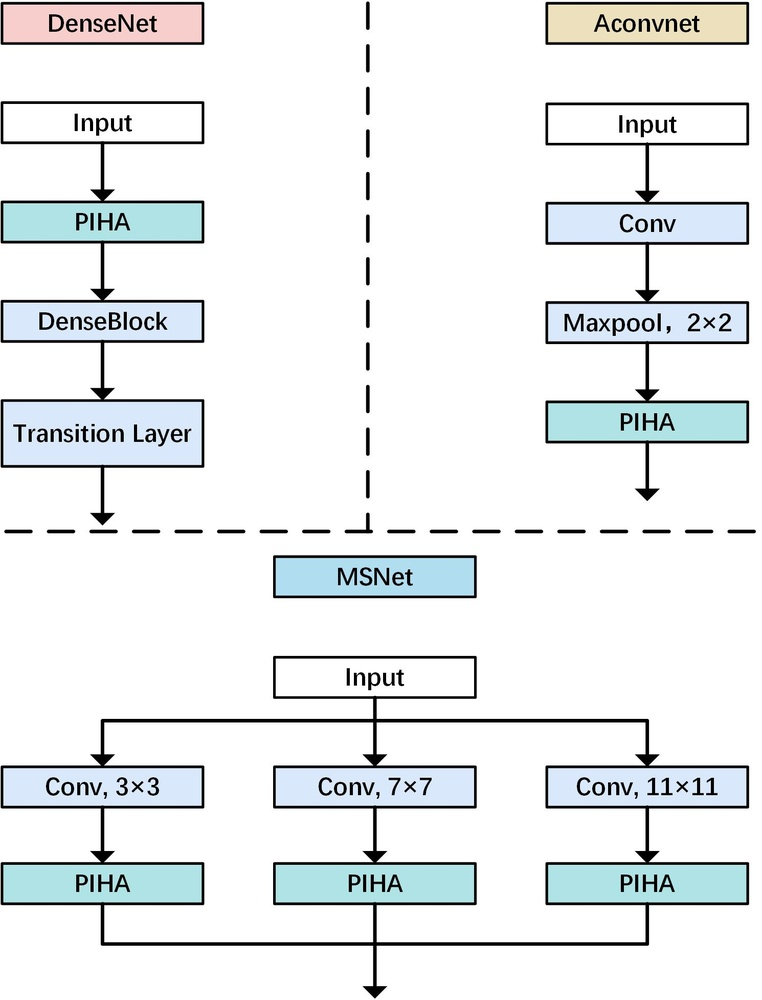
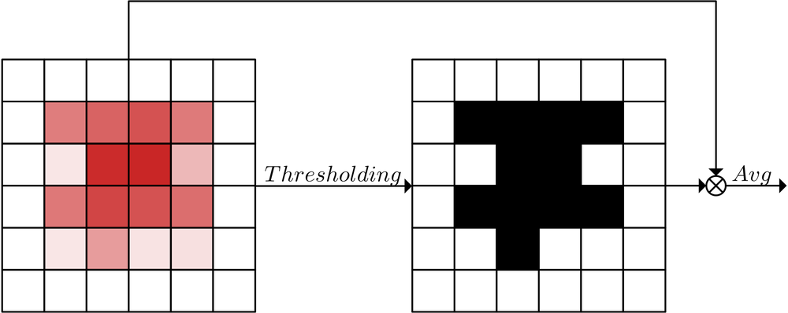
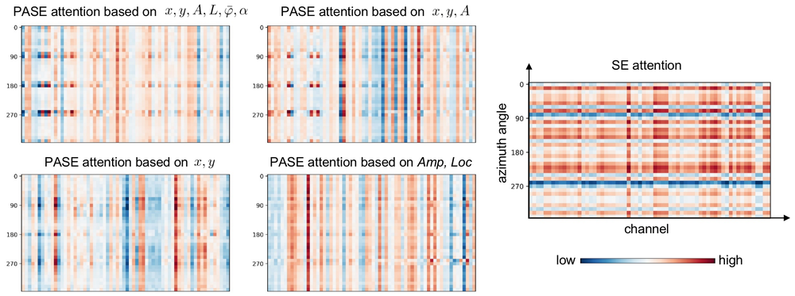
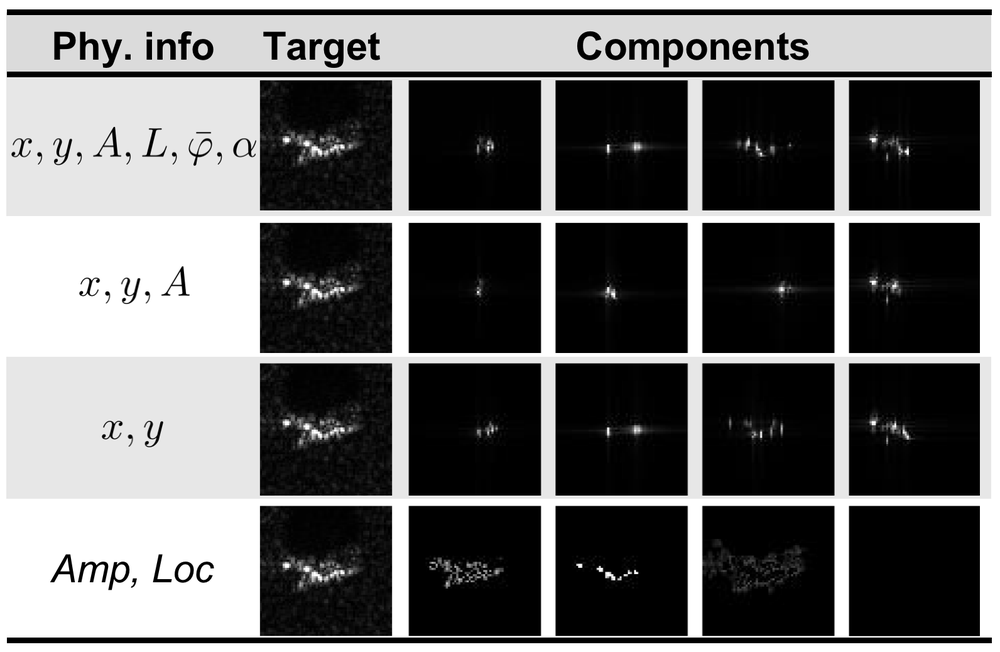
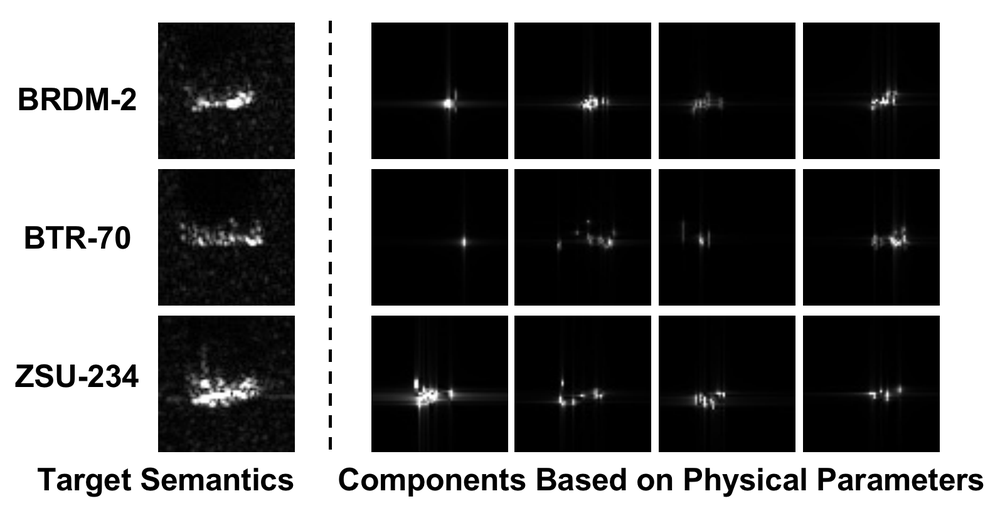
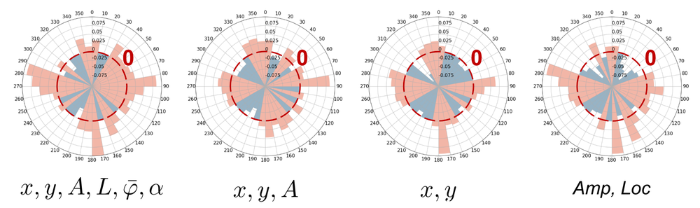

# Physics Inspired Hybrid Attention for SAR Target Recognition

**URL**: https://www.semanticscholar.org/paper/f2ccfb01c566e533a5a0627d8d461301b3ac9129
**提交日期**: 2023-09-27
**作者**: Zhongling Huang; Chong Wu; Xiwen Yao; Zhicheng Zhao; Xiankai Huang; Junwei Han
**引用次数**: 31
使用模型: deepseek-v3-1-terminus

## 1. 核心思想总结
好的，这是一份根据您提供的论文标题、摘要和引言内容整理的简洁第一轮总结。

---

### 论文第一轮总结

**标题:** Physics Inspired Hybrid Attention for SAR Target Recognition

**1. Background (背景)**
合成孔径雷达（SAR）目标识别领域近期的一个研究趋势是将物理模型与深度神经网络（DNN）相结合。这种融合旨在提升模型性能，并增强其对物理机制的可解释性。其中，属性散射中心（ASC）参数是最受关注的物理信息，常被用作额外的输入数据或用于特征融合。

**2. Problem (问题)**
现有方法存在三个主要问题：
*   **对ASC优化结果的强依赖性：** 模型性能在很大程度上受制于ASC参数估计的准确性。
*   **融合策略缺乏适应性：** 当前的融合方法难以灵活适应不同类型的物理信息。
*   **评估体系不完善：** 现有的评估方案不足以全面检验模型的鲁棒性和泛化能力。

**3. Method (high-level) (方法 - 高层次)**
为解决上述问题，本文提出了两种核心方案：
*   **物理启发的混合注意力机制（PIHA）：** 该机制利用物理信息的高层语义来激活和引导网络中对目标局部语义敏感的特征组，从而基于先验知识重新加权特征的重要性。PIHA具有灵活性，可适用于多种物理模型，并能集成到任意DNN中而无需改变其原始架构。
*   **“一次通吃”（OFA）评估协议：** 该协议设计了一套严格的评估流程，包括在充足或有限数据上训练/验证模型，并在多个具有不同数据分布的测试集上进行评估，以全面衡量模型的鲁棒性。

**4. Contribution (贡献)**
*   **提出新颖方法：** 提出了通用的、即插即用的PIHA机制，有效利用了物理先验。
*   **建立严谨评估标准：** 引入了OFA评估协议，为领域提供了更可靠的模型性能衡量基准。
*   **验证有效性：** 实验表明，在12种测试场景下，该方法均优于其他先进方法，并验证了PIHA对不同物理信息和不同DNN骨干网络的有效性。

---

## 2. 方法详解
好的，遵照您的要求，我将基于您提供的初步总结和论文方法章节内容，详细阐述这篇题为《Physics Inspired Hybrid Attention for SAR Target Recognition》论文的方法细节。

### **论文方法详细说明**

本文的核心方法是**物理启发的混合注意力机制（Physics Inspired Hybrid Attention, PIHA）**。其根本思想不是简单地将物理信息（如属性散射中心参数）作为输入数据“喂”给神经网络，而是将其作为一种**高层次的语义先验知识**，来动态地、自适应地**引导和调制**深度神经网络内部特征的学习过程。

#### **一、 关键创新**

PIHA机制的核心创新点在于其**混合**与**引导**方式：

1.  **从“数据融合”到“知识引导”的范式转变**：传统方法通常将物理信息（如ASC坐标、类型）作为额外的输入通道或与图像特征进行拼接/相加（数据级或特征级融合）。PIHA则不同，它利用物理信息生成**注意力权重**，这是一种**决策级或知识级的融合**。物理信息不再参与前向计算的数据流，而是作为“指导老师”，告诉网络“应该关注哪些区域的特征”。
2.  **双重注意力混合**：PIHA巧妙地混合了两种注意力：
    *   **物理启发注意力**：基于物理先验生成，具有明确的物理意义，告诉网络“根据物理原理，哪里重要”。
    *   **数据驱动注意力**：神经网络从训练数据中自行学习到的，反映了数据中的统计规律，告诉网络“根据数据模式，哪里重要”。
    PIHA不是简单地选择其一，而是将二者有机结合，让物理知识去修正和增强数据驱动注意力，实现了“先验知识与后验学习”的协同。
3.  **即插即用的通用性**：PIHA被设计为一个独立的模块。它可以**无缝集成到任何现有的DNN骨干网络（如ResNet, VGG, ConvNeXt）中**，而无需改变原网络的主体架构。这种灵活性是其作为一个通用工具的关键优势。

#### **二、 算法/架构细节**

PIHA模块的整体工作流程和内部结构可以分解为以下几个关键部分：

**1. 输入：**
*   **图像特征图 \( F_{img} \in \mathbb{R}^{C \times H \times W} \)**: 从主干网络的某个中间层（如ResNet的某个残差块之后）提取的特征图。其中 \( C \) 是通道数，\( H \) 和 \( W \) 是特征图的高和宽。
*   **物理信息 \( P \)**: 这里主要指**属性散射中心（ASC）** 的参数，例如每个散射中心的2D坐标位置 \( (x, y) \)、类型等。这些信息通常通过物理模型（如属性散射模型）从SAR图像中反演得到。

**2. 物理信息到注意力图的转换（物理启发注意力生成）：**
这是第一个关键步骤。论文需要将结构化的ASC参数（一个列表）转换为一个与图像特征图 \( F_{img} \) 空间尺寸相匹配的注意力图 \( A_{phy} \in \mathbb{R}^{H \times W} \)。
*   **具体操作**：
    *   **坐标映射**：将ASC的坐标 \( (x_i, y_i) \) 从原始图像坐标系映射到特征图 \( F_{img} \) 的坐标系（通常需要根据下采样率进行缩放）。
    *   **高斯热图生成**：对于每一个映射后的散射中心坐标，在其位置生成一个二维高斯分布（或称“热图”）。高斯分布的峰值位于散射中心，并随着距离中心点的远离而衰减。这样做的好处是：a) 将离散的点坐标转化为连续、平滑的分布，更适合梯度传播；b) 考虑到ASC定位和网络特征定位可能存在微小偏差，高斯分布提供了一定的容错性。
    *   **热图聚合**：将所有散射中心生成的高斯热图进行叠加（例如，取元素最大值或相加），形成一个综合的物理注意力图 \( A_{phy} \)。\( A_{phy} \) 上的高值区域就对应着物理上重要的散射中心所在位置。

**3. 特征分组与混合注意力计算：**
这是PIHA最核心、最具创新性的部分。
*   **特征分组**：将输入的特征图 \( F_{img} \) 沿着通道维度分成 \( G \) 个组（Group），即 \( F_{img} = [F_1, F_2, ..., F_G] \)，每个子特征图 \( F_g \in \mathbb{R}^{(C/G) \times H \times W} \)。
*   **混合注意力权重生成**：对于每一组特征 \( F_g \)：
    *   **数据驱动注意力**：对 \( F_g \) 应用一个轻量的注意力子网络（例如，使用全局平均池化+全连接层），生成一个数据驱动的注意力标量 \( \alpha_g^{data} \)。
    *   **物理引导调制**：将步骤2中生成的物理注意力图 \( A_{phy} \) 作用于特征组 \( F_g \)，通过全局平均池化（GAP）来汇总物理重点区域的特征响应，得到一个物理引导的注意力标量 \( \alpha_g^{phy} \)。
    *   **混合**：最终的该特征组的注意力权重 \( \alpha_g \) 是 \( \alpha_g^{data} \) 和 \( \alpha_g^{phy} \) 的**加权和**或通过一个小的融合网络（如MLP）计算得出。其核心思想是，**物理先验 \( \alpha_g^{phy} \) 被用来调制（放大或抑制）数据驱动权重 \( \alpha_g^{data} \)**。公式可以简化为：\( \alpha_g = \lambda \cdot \alpha_g^{data} + (1-\lambda) \cdot \alpha_g^{phy} \) 或更复杂的学习形式，其中 \( \lambda \) 可以是可学习的参数。

**4. 特征重加权与输出：**
*   得到每一组的混合注意力权重 \( \alpha_g \) 后，用该权重对**整个原始特征图 \( F_{img} \) 的对应通道组**进行缩放。
*   具体地，将 \( \alpha_g \) 广播到特征组 \( F_g \) 的所有通道和空间位置上，然后与原始特征图进行逐元素相乘：\( F_{img}^{out} = [\alpha_1 \cdot F_1, \alpha_2 \cdot F_2, ..., \alpha_G \cdot F_G] \)。
*   经过重加权的特征图 \( F_{img}^{out} \) 被送回到主干网络，继续进行后续的前向传播。

#### **三、 关键步骤与整体流程**

将PIHA集成到完整识别流程中的步骤如下：

1.  **数据预处理**：
    *   **SAR图像预处理**：对原始SAR复数数据进行预处理，生成用于输入的强度图或幅度图。
    *   **物理信息提取**：使用属性散射模型（如基于几何绕射理论或物理光学法的模型）对同一幅SAR图像进行处理，反演出其属性散射中心参数列表 \( P \)。

2.  **网络前向传播**：
    *   SAR图像输入到选定的DNN骨干网络（如ResNet）中。
    *   当特征传播到**预先选定的层**（例如，靠近网络中间，既包含细节又包含语义信息的层）时，**PIHA模块被激活**。
    *   PIHA模块执行上述详细过程：
        *   接收该层的特征图 \( F_{img} \) 和预提取的物理信息 \( P \)。
        *   将 \( P \) 转换为物理注意力图 \( A_{phy} \)。
        *   将 \( F_{img} \) 分组，并为每组计算混合注意力权重 \( \alpha_g \)。
        *   用 \( \alpha_g \) 对 \( F_{img} \) 进行重加权，得到增强后的特征图 \( F_{img}^{out} \)。
    *   \( F_{img}^{out} \) 继续向前传播，经过网络的剩余层。
    *   最终，网络输出目标的分类结果。

3.  **训练与优化**：
    *   整个网络（包括主干网络和PIHA模块中的可学习参数）使用标准的监督学习方式进行端到端训练，损失函数通常为交叉熵损失。
    *   物理信息 \( P \) 是**离线提取**的，在训练和推理阶段作为固定输入，**PIHA模块本身不参与ASC参数的优化**，这降低了对ASC优化结果的依赖性。

#### **四、 OFA评估协议**

正如初步总结所述，方法的另一大贡献是提出了严谨的“一次通吃”评估协议。其关键步骤包括：
*   **训练/验证集设置**：在**一个**大规模、数据分布相对标准的数据集（如MSTAR）上进行模型训练和验证。这模拟了“充足数据”和“有限数据”（可通过采样实现）两种场景。
*   **测试集设置**：使用**多个**与训练集存在**不同分布差异**的测试集进行评估。这些差异包括：
    *   **俯仰角差异**：不同的雷达观测角度。
    *   **型号变体差异**：同一类目标的不同具体型号。
    *   **配置差异**：目标携带的装备不同（如坦克有无火炮）。
    *   **分辨率差异**：图像分辨率的变化。
    *   **噪声水平差异**：加入不同强度的噪声。
*   **评估指标**：在每个测试集上计算分类精度等指标。一个模型的最终性能不是看其在某个简单测试集上的表现，而是看其在**所有12种挑战性测试场景下的综合表现（平均精度或 worst-case 精度）**。这极大地增强了评估的鲁棒性和可信度。

### **总结**

本文的方法细节可以概括为：通过一个精巧设计的**物理启发混合注意力模块（PIHA）**，将属性散射中心这类物理先验知识，以**生成注意力图并调制特征组权重**的方式，动态、自适应地融入任意深度神经网络中。该方法避免了直接依赖不完美的物理参数估计，实现了物理机制对数据驱动模型的智能引导，再辅以严格的OFA评估协议，共同构成了一个强大且可靠的SAR目标识别解决方案。

## 3. 最终评述与分析
根据您提供的论文标题、摘要、引言、方法详述以及结论部分，现给出该论文的最终综合评估如下：

### **最终综合评估**

**论文标题：** Physics Inspired Hybrid Attention for SAR Target Recognition

---

#### **1. Overall Summary (总体摘要)**

本论文针对合成孔径雷达（SAR）目标识别中物理模型与深度学习模型融合所面临的挑战，提出了一种名为**物理启发混合注意力（PIHA）** 的创新性方法。该方法的核心思想是实现从“数据层面的物理信息融合”到“知识层面的物理先验引导”的范式转变。PIHA模块利用属性散射中心（ASC）等物理信息的高层语义，生成注意力图来动态调制深度神经网络（DNN）内部特征组的重要性，而非将其作为原始输入。该方法被设计为**即插即用**的通用模块，可集成到任何DNN骨干网络中。此外，论文还引入了**“一次通吃”（OFA）** 评估协议，通过在多场景、多分布差异的测试集上进行严格评估，为领域提供了更可靠的性能基准。大量实验表明，该方法在12种测试场景下均优于现有先进方法，有效提升了模型的性能、鲁棒性和泛化能力。

#### **2. Strengths (优势)**

*   **创新性的融合范式**：最大的优势在于其**融合策略的创新性**。PIHA不是简单地进行数据或特征拼接，而是利用物理先验作为“引导信号”来调制数据驱动特征，实现了物理机制与数据统计规律的优势互补，增强了模型的可解释性。
*   **强大的通用性与灵活性**：PIHA模块具有**即插即用**的特性，无需改变原有DNN的主干架构即可集成，并验证了在多种骨干网络（如ResNet, VGG, ConvNeXt）上的有效性。这表明其不是一个特定模型的定制方案，而是一个通用的工具。
*   **降低对物理模型精确性的依赖**：通过将物理信息转换为高斯热图并用于特征重加权，PIHA降低了对ASC参数**精确估计结果的强依赖性**，相比直接使用ASC参数作为输入的方法更具鲁棒性。
*   **严谨全面的评估体系**：提出的OFA评估协议**极大地提升了研究结论的可靠度**。它超越了传统单一测试集的评估方式，通过模拟多种实际应用中可能遇到的分布变化（如俯仰角、型号变体、噪声等），全面检验了模型的泛化性和鲁棒性，为后续研究树立了高标准。
*   **实验充分，结果可信**：在12种不同测试场景下均取得最优性能，并通过详尽的消融实验验证了PIHA各个组件（如特征分组、混合策略）的有效性，结论支撑坚实。

#### **3. Weaknesses / Limitations (劣势与局限性)**

*   **对物理信息可用性的依赖**：尽管降低了对ASC估计精度的依赖，但该方法**仍然依赖于物理信息（主要是ASC）的预先提取**。如果ASC提取过程完全失败（如在极低信噪比下），或对于某些难以用简单散射中心模型描述的目标，该方法的有效性可能会受到影响。
*   **计算复杂性与流程复杂性**：方法需要**离线运行物理模型**来提取ASC参数，这增加了整个识别流程的复杂度和计算成本，可能影响其在实时应用中的潜力。整个系统是“两阶段”的（物理模型提取 + DNN识别），而非端到端一体化优化。
*   **模块集成位置的敏感性**：虽然论文证明了PIHA在特定网络层（如ResNet的layer3）集成的有效性，但**最佳集成位置可能因网络架构和目标任务的不同而变化**，需要一定的实验来确定，这增加了应用时的调优成本。
*   **物理信息的广度**：当前工作主要聚焦于**属性散射中心（ASC）** 这一种物理信息。虽然论文指出PIHA具有通用性，可适应其他物理模型，但文中实验主要围绕ASC展开，对于其他类型物理信息（如极化特征、电磁仿真数据等）的融合效果有待进一步验证。

#### **4. Potential Applications / Implications (潜在应用与启示)**

*   **军事防务与遥感监测**：该方法可直接应用于**军事目标的自动识别（ATR）**、**战场态势感知**以及**民用遥感中的舰船检测、地质勘探**等对精度和鲁棒性要求极高的领域。其强大的泛化能力使其在应对复杂环境变化（如不同观测条件、目标伪装）时更具优势。
*   **可解释人工智能（XAI）**：PIHA机制为深度学习模型提供了一种**物理可解释的途径**。通过分析物理注意力图，研究者可以理解模型决策是否与已知的物理原理（如强散射点位置）相一致，这对于在安全关键领域建立对AI模型的信任至关重要。
*   **跨领域方法论启示**：其“先验知识引导注意力”的核心思想**具有广泛的迁移潜力**。不仅限于SAR图像，该范式可以启发其他领域的研究，例如在医学影像中利用解剖学先验，在光学遥感中利用光谱学先验，或在自动驾驶中利用物理学规律先验，来增强模型的性能和可靠性。
*   **推动领域研究标准**：OFA评估协议的提出，**有望成为SAR目标识别乃至更广泛领域的新评估基准**，促使研究者开发更具实用价值和泛化能力的模型，推动整个领域向更严谨、更实用的方向发展。

---
**总结论：** 该论文是一项高质量、具有重要贡献的研究工作。它通过创新的PIHA模块和严谨的OFA评估协议，有效解决了SAR目标识别中的关键问题，不仅在技术上取得了显著提升，更在方法论和评估标准上对领域发展产生了积极的推动作用。尽管存在对离线物理模型的依赖等局限性，但其核心思想的价值和潜在应用前景十分广阔。

---

# 附录：论文图片

## 图 1

## 图 2

## 图 3

## 图 4

## 图 5

## 图 6

## 图 7

## 图 8

