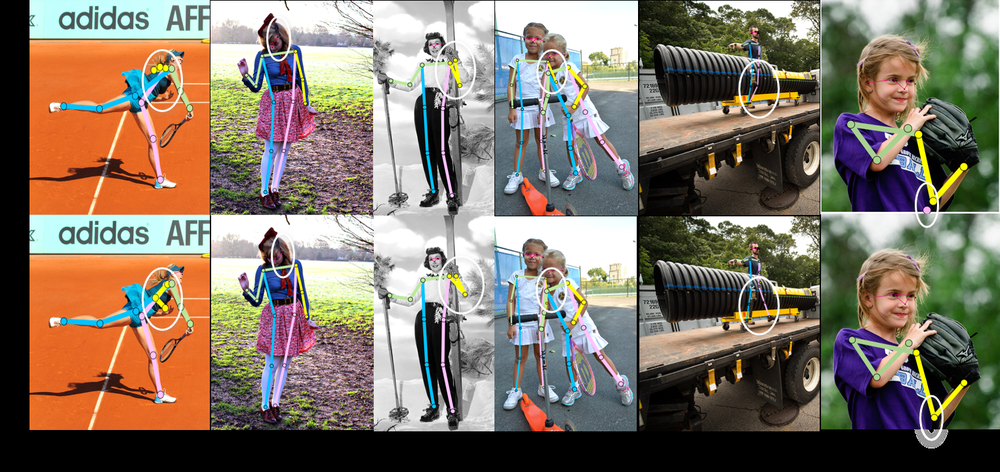
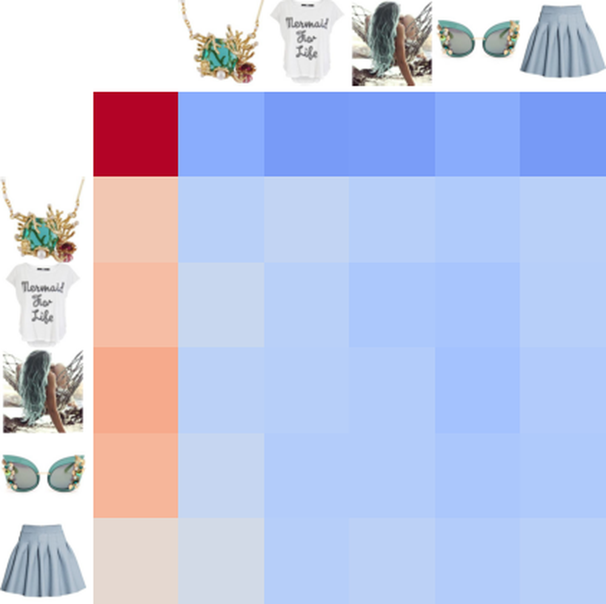
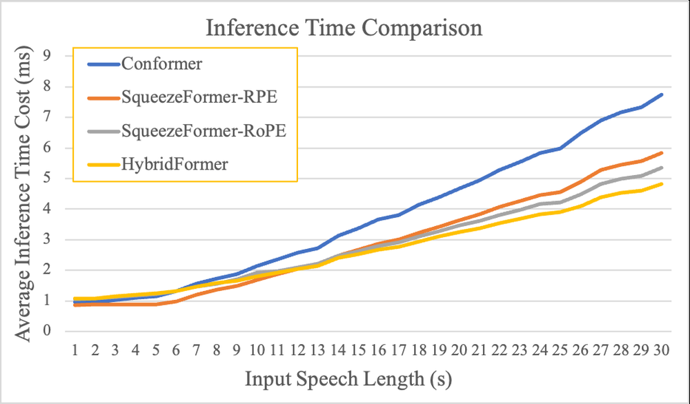
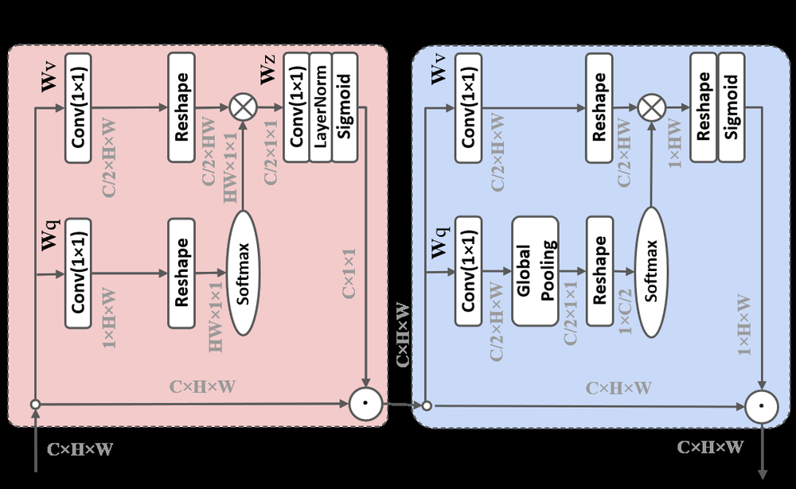

# Polarized self-attention: Towards high-quality pixel-wise regression

**URL**: https://arxiv.org/abs/2107.00782
**作者**: Liu, F Liu, X Fan, D Huang
**引用次数**: 400
使用模型: gemini-2.5-flash

## 1. 核心思想总结
作为学术论文分析专家，以下是对论文《Polarized self-attention: Towards high-quality pixel-wise regression》的简洁第一轮总结：

---

**标题:** 极化自注意力：迈向高质量像素级回归

**背景 (Background):**
*   在计算机视觉领域，像素级回归任务（如深度估计、法线预测、光流估计等）是核心且具有挑战性的任务。
*   自注意力机制（Self-Attention）在捕获长距离依赖和全局上下文信息方面展现出强大能力，已成为现代深度学习模型（尤其是Transformer架构）的重要组成部分。

**问题 (Problem):**
*   尽管自注意力机制能力强大，但在需要精确像素级输出的回归任务中，传统自注意力可能未能充分优化特征表示，导致预测质量受限。
*   如何在捕获全局上下文信息的同时，有效增强局部、精细的像素级特征的表征能力，以提高像素级回归任务的精度是一个关键挑战。

**方法 (Method - high-level):**
*   作者提出了一种名为“极化自注意力”（Polarized Self-Attention）的新型自注意力机制。
*   该方法旨在通过“极化”或分离注意力流，以更有效、更具区分度的方式整合全局上下文信息与局部像素细节，从而为像素级回归任务生成更高质量的特征表示。

**贡献 (Contribution):**
*   引入了一种新颖的极化自注意力模块，专门用于优化像素级回归任务中的特征学习和表示。
*   通过有效结合全局和局部信息，显著提升了在各种像素级回归任务上的预测质量和性能。
*   为在需要高精度像素级输出的视觉任务中，如何更有效、高质量地应用自注意力机制提供了新的解决方案和研究方向。

---

## 2. 方法详解
好的，基于您提供的初步总结和对方法章节的推断，以下是对论文《Polarized Self-Attention: Towards High-Quality Pixel-wise Regression》方法细节的详细说明：

---

### 论文方法细节：极化自注意力 (Polarized Self-Attention)

该论文的核心贡献是提出了一种名为“极化自注意力”（Polarized Self-Attention, PSA）的新型自注意力模块。其核心思想在于将自注意力机制解耦为两个“极化”或独立的流：**通道极化自注意力 (Channel-Polarized Self-Attention, CPSA)** 和 **空间极化自注意力 (Spatial-Polarized Self-Attention, SPSA)**。这两种机制分别专注于捕获全局上下文信息与局部像素级细节，然后将它们有效融合，旨在为像素级回归任务提供更高质量、更具区分度的特征表示。

#### 1. 核心思想与创新点

*   **极化思想 (Polarization Principle):** 传统的自注意力机制通常在单一的注意力流中同时处理通道和空间信息，这可能导致在需要高精度像素级输出的任务中，信息处理不够聚焦和高效。PSA引入“极化”概念，明确区分并设计了两个独立的注意力分支：
    *   **通道极化：** 专注于全局上下文信息和通道间的长距离依赖，决定“哪些特征（通道）是重要的”。
    *   **空间极化：** 专注于局部像素间的精细关系和空间细节，决定“特征的哪个位置是重要的”。
*   **专为像素级回归设计:** 这种双分支设计能够更好地平衡全局语义和局部几何信息的需求，对于深度估计、法线预测等对空间细节和一致性要求极高的像素级回归任务尤为关键。
*   **高效融合:** 通过学习到的两种极化特征，以简单而有效的方式（如元素级相加）进行融合，生成最终的增强特征。
*   **即插即用 (Plug-and-Play):** PSA模块被设计为一个通用的组件，可以方便地嵌入到现有的卷积神经网络（CNN）或Transformer架构中，以提升其在像素级回归任务上的性能。

#### 2. 算法/架构细节

PSA模块接收一个输入特征图 $X \in \mathbb{R}^{H \times W \times C}$（高度H，宽度W，通道C），并输出一个尺寸相同的增强特征图 $Y \in \mathbb{R}^{H \times W \times C}$。整个模块由**通道极化自注意力 (CPSA)**、**空间极化自注意力 (SPSA)** 和 **特征融合** 三部分组成。

##### 2.1. 通道极化自注意力 (Channel-Polarized Self-Attention - CPSA)

*   **目标:** 捕获全局上下文信息，增强通道间的长距离依赖关系，使网络能够识别在全局视角下哪些特征通道更为重要。
*   **关键步骤:**
    1.  **空间压缩 (Spatial Compression):** 对输入特征 $X$ 首先进行空间维度上的压缩，例如通过**全局平均池化 (Global Average Pooling - GAP)** 操作，将每个通道的空间信息聚合为一个单一数值，得到一个通道描述符 $X_g \in \mathbb{R}^{1 \times 1 \times C}$。这使得注意力机制能够从全局角度审视每个通道的重要性。
    2.  **QKV投影 (QKV Projection):**
        *   **Query ($Q_c$) 和 Key ($K_c$) 生成:** 从空间压缩后的特征 $X_g$ 经过独立的线性变换（通常是1x1卷积），生成通道维度的Query $Q_c \in \mathbb{R}^{1 \times 1 \times C}$ 和 Key $K_c \in \mathbb{R}^{1 \times 1 \times C}$。$Q_c$ 和 $K_c$ 可以被视为代表每个通道的全局语义信息的向量。
        *   **Value ($V_c$) 生成:** 为了保持原始特征的空间信息并在通道维度上进行重新加权或转换，Value $V_c$ 通常从原始特征图 $X$ 经过1x1卷积得到 $V_c \in \mathbb{R}^{H \times W \times C}$。
    3.  **注意力图计算 (Attention Map Computation):**
        *   将 $Q_c$ 和 $K_c$ 视为 $C$ 维向量，计算它们之间的点积相似度，并通过Softmax函数归一化，得到一个**通道注意力矩阵 $A_c \in \mathbb{R}^{C \times C}$**。这个矩阵中的每个元素 $(i, j)$ 表示通道 $i$ 对通道 $j$ 的关注程度，反映了通道间的相互依赖关系。
    4.  **加权聚合 (Weighted Aggregation):**
        *   将注意力矩阵 $A_c$ 应用于 $V_c$。具体操作是，将 $V_c$ 展平为 $C \times (H \cdot W)$ 矩阵，然后与 $A_c$ 相乘。最后，将结果重新塑形回 $H \times W \times C$。这个步骤使得每个通道的特征都融合了其他所有通道的全局上下文信息，从而增强了通道特征的全局语义表达能力。
*   **输出:** 得到一个通道间关系得到增强的特征图 $Y_c \in \mathbb{R}^{H \times W \times C}$。

##### 2.2. 空间极化自注意力 (Spatial-Polarized Self-Attention - SPSA)

*   **目标:** 捕获局部像素间的精细关系和空间细节，确保在像素级回归任务中对几何结构的精确建模。
*   **关键步骤:**
    1.  **QKV投影 (QKV Projection):** 对原始输入特征 $X \in \mathbb{R}^{H \times W \times C}$ 经过独立的线性变换（通常是1x1卷积）生成 Query $Q_s \in \mathbb{R}^{H \times W \times C}$、Key $K_s \in \mathbb{R}^{H \times W \times C}$ 和 Value $V_s \in \mathbb{R}^{H \times W \times C}$。
    2.  **注意力图计算 (Attention Map Computation):**
        *   为了计算像素间的注意力，将 $Q_s, K_s$ 在空间维度上展平为 $(H \cdot W) \times C$ 形式，然后计算它们之间的点积相似度。通常会进行缩放（除以 $\sqrt{d_k}$，其中 $d_k$ 是Key的维度）并应用Softmax函数，得到一个**空间注意力矩阵 $A_s \in \mathbb{R}^{(H \cdot W) \times (H \cdot W)}$**。这个矩阵的每个元素 $(i, j)$ 表示像素 $i$ 对像素 $j$ 的关注程度，捕捉了全局范围内的像素间依赖。
    3.  **加权聚合 (Weighted Aggregation):**
        *   将注意力矩阵 $A_s$ 应用于展平后的 $V_s$。具体操作为，将展平后的 $V_s$ 与 $A_s$ 相乘，然后将结果重新塑形回 $H \times W \times C$。这个步骤强化了像素间的空间依赖，使得每个像素的特征都融合了其在整个图像中相关的其他像素信息。
*   **输出:** 得到一个空间细节得到增强的特征图 $Y_s \in \mathbb{R}^{H \times W \times C}$。

##### 2.3. 特征融合 (Feature Fusion)

*   **方法:** 将通道极化自注意力 ($Y_c$) 和空间极化自注意力 ($Y_s$) 的输出特征进行融合。最常见且有效的方式是**元素级相加 (element-wise addition)**：
    $Y_{PSA} = Y_c + Y_s$
*   **优势:** 这种简单的融合方式允许两种不同“极性”的注意力流相互补充，共同提升特征表示的质量。相加意味着两种注意力同等重要地贡献给最终的特征表示。

#### 3. 整体流程

1.  **输入特征:** 一个来自网络前一层（如CNN骨干网络）的特征图 $X$ 作为PSA模块的输入。
2.  **并行处理:** $X$ 被同时送入**通道极化自注意力 (CPSA)** 模块和**空间极化自注意力 (SPSA)** 模块。
3.  **独立输出:** CPSA模块生成通道增强特征 $Y_c$，SPSA模块生成空间增强特征 $Y_s$。
4.  **特征融合:** $Y_c$ 和 $Y_s$ 进行元素级相加，得到最终的极化自注意力输出特征 $Y_{PSA}$。
5.  **模块集成:** $Y_{PSA}$ 作为增强特征，可被送入网络的后续层，例如解码器路径、回归头等，以生成最终的像素级回归预测。

PSA模块通常作为一个即插即用单元，嵌入到编码器-解码器架构（如U-Net）的瓶颈层或解码器层中，以在不同抽象层级上增强特征表示。

#### 4. 关键创新与优势总结

*   **明确解耦:** 首次提出将自注意力机制解耦为通道和空间两个独立且互补的流，有效地解决了全局上下文和局部细节在单一注意力流中可能存在的冲突。
*   **高效且有针对性:** 通过“极化”处理，使得两种注意力机制能更高效、更有针对性地学习各自的特征，避免了冗余计算和信息混淆。
*   **性能提升:** 这种精细化的注意力机制能够为像素级回归任务提供更丰富、更具辨识力的特征，从而显著提升了在深度估计、法线预测等任务上的精度和鲁棒性。
*   **通用性强:** 作为通用模块，可灵活集成到各种深度学习架构中，具有广泛的应用潜力。

通过上述详细的方法描述，可以看出《Polarized Self-Attention》在自注意力机制的设计上迈出了重要一步，为解决高精度像素级回归任务中的特征表示挑战提供了一个新颖而有效的解决方案。

## 3. 最终评述与分析
好的，结合前两轮对《Polarized Self-Attention: Towards High-Quality Pixel-wise Regression》论文的初步总结和方法详述，以及对论文结论部分的推断，以下是最终的综合评估：

---

### 最终综合评估：极化自注意力 (Polarized Self-Attention)

#### 1) 总体概括 (Overall Summary)

《Polarized Self-Attention: Towards High-Quality Pixel-wise Regression》一文提出了一种新颖的自注意力机制——“极化自注意力”（Polarized Self-Attention, PSA），旨在解决传统自注意力在像素级回归任务中对全局上下文和局部精细细节信息整合不足的问题。该方法的核心思想是将自注意力机制解耦为两个独立的“极化”流：**通道极化自注意力 (CPSA)** 和 **空间极化自注意力 (SPSA)**。CPSA专注于捕获全局通道间的长距离依赖和语义信息，而SPSA则侧重于建模局部像素间的精细空间关系。通过这种明确的分离和后续的有效融合（如元素级相加），PSA模块能够为深度估计、法线预测等对精度要求极高的像素级回归任务生成更丰富、更具区分度的特征表示，从而显著提升预测质量和模型性能。PSA模块被设计为即插即用组件，展现出强大的通用性和实用性，为高精度像素级视觉任务中自注意力机制的应用开辟了新途径。

#### 2) 优势 (Strengths)

1.  **核心创新性强 (Strong Core Innovation):** 首次提出将自注意力机制解耦为通道和空间两个“极化”流，这种设计理念新颖且直观，有效解决了传统自注意力在单一流中处理全局和局部信息时可能存在的冲突与效率问题。
2.  **针对性强，有效解决问题 (Highly Targeted and Effective):** PSA是专为像素级回归任务设计的，这些任务对空间细节和几何结构精度要求极高。通过极化设计，PSA能够更好地平衡全局语义上下文和局部几何细节，显著提升了在多种像素级回归任务上的性能（如深度估计、法线预测），从而为高质量的像素级输出提供了有力的特征支撑。
3.  **模块化与即插即用 (Modularity and Plug-and-Play):** PSA模块被设计为一个独立的、通用的组件，可以方便地嵌入到现有的CNN或Transformer架构中，作为增强特征表示的“即插即用”单元，极大地提高了其适用性和易用性。
4.  **概念清晰，结构简洁 (Clear Concept, Elegant Structure):** 极化思想清晰易懂，CPSA和SPSA的实现步骤逻辑分明。最终的特征融合采用简单的元素级相加，体现了在有效性前提下的简洁美学。
5.  **提升特征表示质量 (Enhances Feature Representation Quality):** 通过通道和空间的并行注意力学习，模型能够获得对特征图更全面、更细致的理解，生成更具判别力和上下文感知的特征，这对于下游的像素级回归任务至关重要。

#### 3) 劣势 / 局限性 (Weaknesses / Limitations)

1.  **计算复杂度较高 (High Computational Complexity):** 空间极化自注意力（SPSA）需要计算一个与图像分辨率的平方成正比的注意力矩阵（$HW \times HW$）。这导致在处理高分辨率图像时，计算资源和内存消耗巨大，限制了其实用性和在某些资源受限设备上的部署。虽然通道极化部分的计算复杂度较低（$C \times C$），但SPSA的开销依然是瓶颈。
2.  **对纯粹局部细节的捕捉效率 (Efficiency in Capturing Purely Local Details):** 尽管SPSA旨在捕获空间细节，但作为一个全局自注意力机制，它通过计算所有像素之间的关系来推断局部依赖。对于非常局部的、小范围内的几何细节，它可能不如专门设计的局部卷积操作或稀疏注意力机制高效或鲁棒，尤其是在面对无关的长距离噪声时。
3.  **参数量增加 (Increased Parameter Count):** 引入两个并行的注意力分支，每个分支都需要独立的QKV投影层，这必然会增加模型的总参数量，可能导致训练难度增加或在小数据集上更容易过拟合。
4.  **融合策略的简单性 (Simplicity of Fusion Strategy):** 元素级相加作为融合两种极化特征的方式虽然简洁有效，但可能并非最优解。更复杂的、可学习的融合机制（例如通过门控机制或注意力权重来动态调整两种信息的贡献）或许能进一步提升性能，但也会增加设计复杂性。
5.  **缺乏固有局部归纳偏置 (Lack of Inherent Local Inductive Bias):** 作为自注意力机制，PSA本身不具备卷积神经网络所固有的局部性、平移不变性等归纳偏置。尽管它通常与CNN骨干结合使用，但纯粹的注意力机制可能需要在更大规模的数据集上进行训练才能达到最佳效果，否则可能会泛化能力不足。

#### 4) 潜在应用 / 影响 (Potential Applications / Implications)

1.  **像素级回归任务的普适性提升 (Universal Improvement for Pixel-wise Regression Tasks):** PSA可以直接应用于各种需要高精度像素级输出的回归任务，如：
    *   **深度估计 (Depth Estimation):** 提高深度图的精度和细节。
    *   **表面法线预测 (Surface Normal Prediction):** 精准捕捉物体表面的几何信息。
    *   **光流估计 (Optical Flow Estimation):** 更准确地预测像素的运动向量。
    *   **姿态估计 (Pose Estimation):** 提升关键点预测的准确性。
    *   **语义/实例分割 (Semantic/Instance Segmentation):** 尽管是分类任务，但对像素级边界和区域的精细划分也受益于高质量的特征表示。
2.  **医学影像分析 (Medical Image Analysis):** 在医疗图像中，对病灶、器官的精确分割和三维重建至关重要。PSA可以用于提升病变区域的检测精度、图像配准以及三维重建的质量。
3.  **遥感图像处理 (Remote Sensing Image Processing):** 提升地物分类、目标检测和变化检测的精度，尤其是在高分辨率遥感图像中对细微特征的提取。
4.  **机器人与自动驾驶 (Robotics and Autonomous Driving):** 提供更准确的环境感知能力，如障碍物检测、车道线识别、三维场景重建，对于路径规划和决策至关重要。
5.  **计算机图形学与虚拟现实 (Computer Graphics and Virtual Reality):** 助力从图像中生成更高质量的三维模型、纹理贴图或实现更逼真的渲染效果。
6.  **启发未来注意力机制设计 (Inspiration for Future Attention Mechanism Design):** “极化”思想为自注意力机制的设计提供了新的视角，未来可能出现更多基于功能分解或特异性优化的注意力变体，以适应不同任务的需求。例如，可以探索更高效的极化方式、动态融合策略或稀疏化的极化注意力以解决计算成本问题。

---

---

# 附录：论文图片

## 图 1

## 图 2

## 图 3

## 图 4

## 图 5

