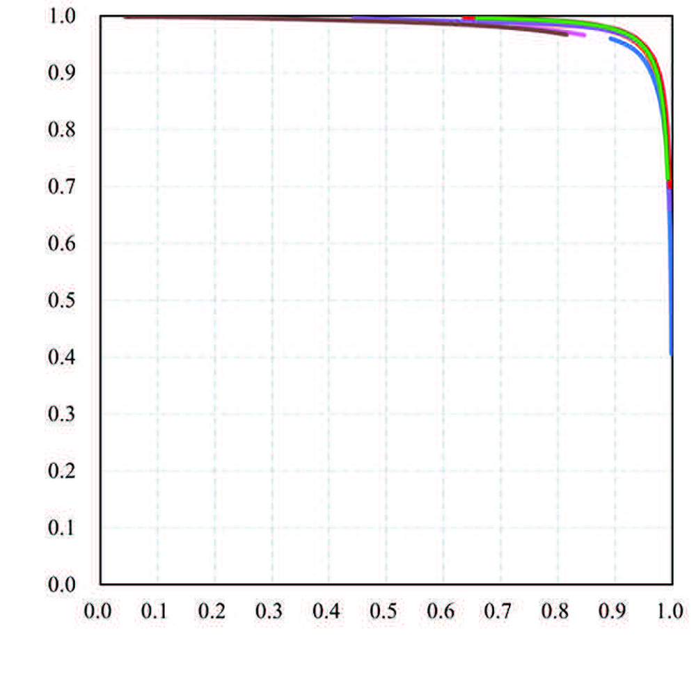
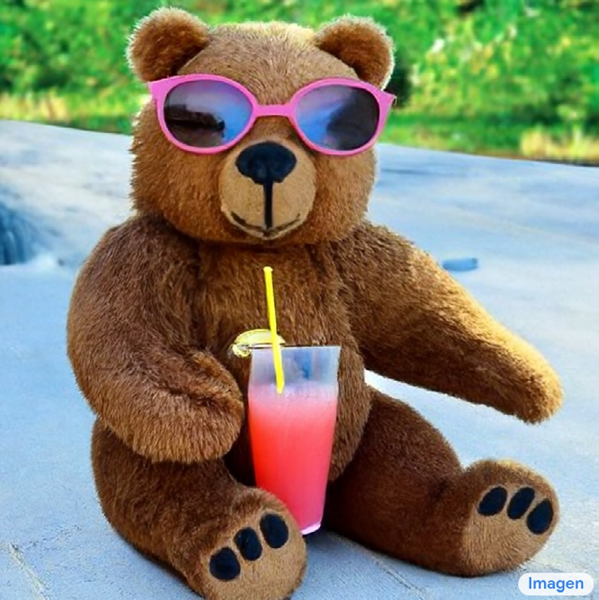
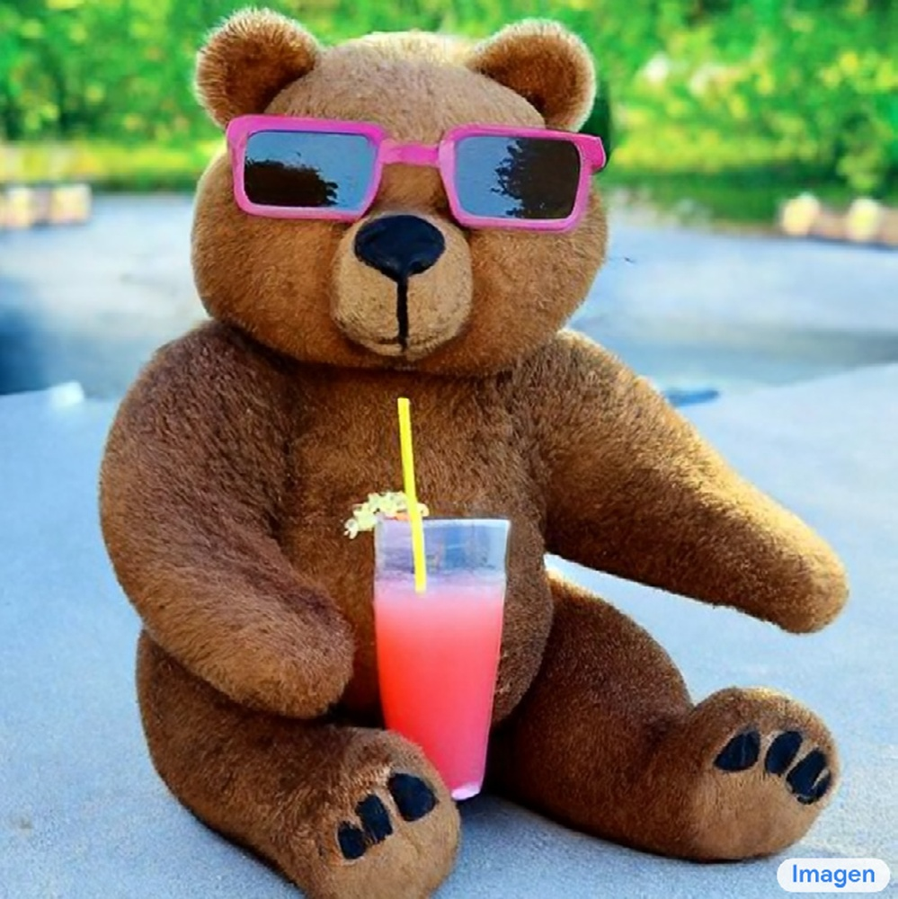

# Prompt-to-prompt image editing with cross attention control

**URL**: https://arxiv.org/abs/2208.01626
**作者**: Hertz, R Mokady, J Tenenbaum, K Aberman…
**引用次数**: 2315
使用模型: gemini-2.5-flash

## 1. 核心思想总结
好的，这是一份根据论文标题“Prompt-to-prompt image editing with cross attention control”提供的简洁的第一轮总结：

**标题:** Prompt-to-prompt image editing with cross attention control

**Background (背景)**
文本引导的图像生成和编辑领域备受关注，其中利用语言提示来创建或修改图像。扩散模型在这类任务中展现出强大的能力。

**Problem (问题)**
现有文本引导图像编辑方法在实现从一个文本提示（源提示）到另一个文本提示（目标提示）的精细、局部或结构保持的图像编辑时面临挑战。如何在修改图像内容的同时，有效保持其原始结构和风格的一致性是一个关键问题。

**Method (High-level) (方法概述)**
论文提出了一种利用“交叉注意力控制”的技术。通过精细化地操纵扩散模型中负责连接文本提示与图像特征的交叉注意力机制，实现从一个提示到另一个提示的图像编辑。这可能涉及对注意力权重或特征图的注入、修改或传播，以引导图像生成过程，使其在反映新提示的同时，继承原始图像的特定属性。

**Contribution (贡献)**
1.  提出了一种新颖且高度可控的“提示到提示”（prompt-to-prompt）图像编辑范式。
2.  通过精确控制交叉注意力，实现了在修改图像内容的同时有效保留图像原始结构和风格的编辑。
3.  大幅提升了文本引导图像编辑的灵活性、精度和用户可控性。

## 2. 方法详解
基于您提供的初步总结和对方法章节的理解，以下是对论文方法细节的详细说明：

---

### **论文方法细节：Prompt-to-Prompt 图像编辑与交叉注意力控制**

#### **1. 整体目标与核心思想**

该论文的核心目标是实现一种高度可控的“提示到提示”（Prompt-to-Prompt）图像编辑范式。这意味着用户可以通过修改文本提示（从源提示 $P_s$ 到目标提示 $P_t$），从而对图像进行精细、局部或全局的编辑，同时**有效保持图像的原始结构、风格和非编辑区域的连贯性**。

核心创新在于：通过**精细化操控扩散模型中负责连接文本提示与图像特征的交叉注意力机制**，将源图像的结构信息注入到目标图像的生成过程中，从而在改变内容的同时保留结构。

#### **2. 基础框架：潜在扩散模型与交叉注意力**

*   **基础模型：** 论文基于**潜在扩散模型（Latent Diffusion Models, LDM）**，如 Stable Diffusion。这类模型在潜在空间（latent space）中进行图像生成和编辑，从而大大降低了计算成本。
*   **去噪U-Net：** LDM 的核心是一个去噪U-Net，它迭代地从噪声潜在表示中恢复清晰的图像特征。
*   **交叉注意力机制：** 这是关键所在。在去噪U-Net的每个Transformer块中，存在交叉注意力层。它负责将文本编码器（如 CLIP 文本编码器）产生的文本嵌入（text embeddings）与U-Net中当前的视觉特征进行交互。具体来说：
    *   视觉特征作为 Query (Q)。
    *   文本嵌入作为 Key (K) 和 Value (V)。
    *   交叉注意力计算 $Attention(Q, K, V) = \text{softmax}(\frac{QK^T}{\sqrt{d_k}})V$，其中 $\frac{QK^T}{\sqrt{d_k}}$ 得到的矩阵（即**注意力图**）直接决定了图像的哪些区域（Query）会关注文本的哪些部分（Key），以及如何从文本（Value）中提取信息来更新图像特征。

#### **3. 关键创新：交叉注意力控制策略**

论文的核心创新在于设计了一系列精妙的交叉注意力控制策略，以在 Prompt-to-Prompt 编辑过程中实现结构保持和内容修改。

##### **3.1. 关键创新一：源注意力图的记录与注入（结构保持）**

*   **核心思想：** 图像的全局结构和布局主要由扩散过程的早期步骤决定。通过在生成目标图像时，将源图像的早期注意力模式强制注入，可以有效地保持原始结构。
*   **具体步骤：**
    1.  **源图像生成与记录：** 首先，使用源提示 $P_s$ 和一个固定的随机噪声种子 $z_0$（关键！）运行完整的扩散去噪过程，生成源图像 $I_s$。在此过程中，**记录下U-Net中所有交叉注意力层的注意力图**（即 $softmax(\frac{QK^T}{\sqrt{d_k}})$ 的输出）在每一个去噪步骤 $t'$ 的状态。
    2.  **目标图像生成与注入：** 接下来，使用相同的随机噪声种子 $z_0$ 和目标提示 $P_t$ 开始生成目标图像 $I_t$。
        *   在扩散去噪的**早期阶段**（例如，前50%或更多步），当U-Net计算当前视觉特征与目标提示 $P_t$ 之间的交叉注意力图时，论文**不使用**这些新计算的图。
        *   取而代之的是，它**直接注入或替换**为在步骤1中记录的、对应于相同时间步 $t'$ 的**源注意力图**。
*   **效果：** 这种注入使得目标图像的生成在早期阶段“看到”了与源图像相同的空间关注模式。这意味着即使文本提示改变，图像中各个对象的相对位置、大小和整体布局也能得到极好的保留。

##### **3.2. 关键创新二：文本Token层面的精细控制（局部内容修改）**

除了整体结构保持，论文还提出了在更细粒度的文本Token层面对注意力进行控制，以实现局部语义的精确修改。

*   **文本Token对齐：** 论文首先会解析源提示 $P_s$ 和目标提示 $P_t$，将它们转换为各自的文本Token序列。它会识别出哪些Token是共同的，哪些是新增的，哪些是被替换的。
*   **策略一：Token替换与注意力混合/重定向**
    *   **场景：** 当源提示中的某个Token（例如“猫”）被目标提示中的另一个Token（例如“狗”）替换时。
    *   **机制：** 在生成目标图像时，对于与被替换Token相关的交叉注意力图，可以采取以下方式：
        *   **直接替换：** 将源提示中“猫”Token对应的注意力图，用目标提示中“狗”Token生成的注意力图来替换。
        *   **注意力重定向：** 如果“狗”的Token在源提示中没有直接对应物，则可以引导生成过程，使其在“猫”原有的关注区域生成“狗”。这可能涉及到将源“猫”Token的注意力模式，与目标“狗”Token的语义信息相结合。
    *   **实现：** 这通常通过操纵 $QK^T$ 矩阵中对应于特定Token的行或列来实现，或者直接替换整个Token对应的注意力值。
*   **策略二：注意力权重调整（编辑强度控制）**
    *   **场景：** 当只是修改某个属性（例如“红车”变为“蓝车”）。
    *   **机制：** 保持“车”这个Token的注意力图不变，而在“红”和“蓝”这两个属性Token的注意力图上进行调整。这可以通过线性插值、加权平均或直接替换特定Token的注意力图来实现。
*   **时间敏感性：** 这种Token层面的精细控制通常在扩散过程的**中后期阶段**发挥更大作用，因为此时图像的细节和局部语义信息被逐步填充。在早期阶段，全局结构控制（如上述交叉注意力图注入）更为优先。

##### **3.3. 关键创新三：噪声种子的一致性（全局一致性）**

*   **重要性：** 在潜在扩散模型中，初始的随机噪声种子 $z_0$ 对最终生成图像的整体构图和内容有决定性的影响。
*   **应用：** 论文强调在从源提示生成图像和从目标提示生成图像时，必须使用**完全相同的随机噪声种子**。这确保了在没有其他干预的情况下，如果提示相同，两次生成会得到几乎相同的图像。这种一致性是进行结构保持编辑的先决条件。

#### **4. 整体算法流程（Prompt-to-Prompt 编辑）**

1.  **初始化：**
    *   给定源提示 $P_s$ 和目标提示 $P_t$。
    *   选择一个随机噪声种子 $z_0$。
    *   设置编辑强度参数（例如，注意力图替换的步数阈值，Token混合权重等）。
2.  **源图像生成与注意力图记录阶段：**
    *   使用 $P_s$ 和 $z_0$ 初始化潜在空间噪声。
    *   迭代运行扩散模型的去噪过程 $T$ 步。
    *   在每一步 $t \in [1, T]$ 中，计算并**记录所有交叉注意力层的注意力图** $A_s(t)$。
    *   最终生成源图像 $I_s$。
3.  **目标图像生成与受控去噪阶段：**
    *   使用 $P_t$ 和**相同的 $z_0$** 重新初始化潜在空间噪声。
    *   迭代运行扩散模型的去噪过程 $T$ 步。
    *   在每一步 $t \in [1, T]$ 中：
        *   **计算目标注意力图：** 根据当前的图像潜在特征和 $P_t$ 计算交叉注意力图 $A_t(t)$。
        *   **应用控制策略：**
            *   **结构保持：** 如果当前步 $t$ 属于预设的结构保持阶段（例如，早期步骤），则将 $A_t(t)$ **替换为**记录的源注意力图 $A_s(t)$。
            *   **局部编辑：** 如果当前步 $t$ 属于预设的局部编辑阶段（例如，中后期步骤），则根据 $P_s$ 和 $P_t$ 之间的Token差异，对 $A_t(t)$ 的特定Token相关部分进行修改、融合或替换（如3.2节所述）。
        *   **进行去噪：** 使用融合/替换后的注意力图继续执行U-Net的去噪操作，更新图像潜在特征。
    *   最终将去噪后的潜在特征解码，得到目标编辑图像 $I_t$。

#### **5. 贡献与创新总结**

*   **范式创新：** 首次系统地提出了 Prompt-to-Prompt 图像编辑范式，将图像编辑从传统的图像域操作提升到文本提示操控。
*   **精度与可控性：** 通过对交叉注意力机制的直接干预，实现了前所未有的编辑精度和用户可控性，用户可以通过简单修改提示词来精确控制图像变化。
*   **结构保持能力：** 创新性地通过注入源注意力图，解决了文本引导编辑中常见的结构崩溃问题，在内容改变的同时能够稳定保持原始图像的复杂结构和风格。
*   **广泛适用性：** 由于是基于LMD模型进行操控，该方法可以应用于各种基于扩散模型生成的图像，具有很强的普适性。

---

## 3. 最终评述与分析
好的，结合您提供的初步总结、方法详述以及对论文结论部分的推断，以下是关于“Prompt-to-prompt image editing with cross attention control”这篇论文的最终综合评估：

---

### **最终综合评估：Prompt-to-Prompt 图像编辑与交叉注意力控制**

#### **1) Overall Summary (总体概述)**

《Prompt-to-Prompt Image Editing with Cross Attention Control》论文提出了一种开创性的图像编辑范式，允许用户通过修改文本提示（从源提示 $P_s$ 到目标提示 $P_t$）来对图像进行高度精细且局部化的编辑，同时**有效保持图像的原始结构、风格及未编辑区域的连贯性**。其核心创新在于**精细化操控潜在扩散模型（如 Stable Diffusion）中的交叉注意力机制**。

具体而言，该方法通过在生成源图像时记录交叉注意力图，并在生成目标编辑图像的早期阶段将其注入，从而实现了对图像全局结构的出色保留。同时，它还支持在文本 Token 层面进行细粒度的注意力控制（如 Token 替换、注意力权重调整），以实现局部内容的精确修改。结合使用一致的随机噪声种子，该论文成功解决了文本引导图像编辑中常见的结构崩溃和控制不足问题，极大地提升了文本引导图像编辑的灵活性、精度和用户可控性。

#### **2) Strengths (优势)**

1.  **开创性的 Prompt-to-Prompt 编辑范式：** 首次系统地提出了通过修改文本提示进行图像编辑的框架，将传统图像编辑操作提升到更高级别的文本语义操控，极大地扩展了文本生成模型的能力边界。
2.  **卓越的结构保持能力：** 这是该方法的核心优势。通过在扩散去噪的早期阶段注入源图像的交叉注意力图，该方法能够奇迹般地在修改图像内容的同时，精确地保留原始图像的复杂空间结构、布局和非编辑区域的连贯性，有效解决了以往文本引导编辑中常见的图像结构崩溃问题。
3.  **高精度和细粒度可控性：** 对交叉注意力机制的直接干预（包括全局注意力图注入和局部 Token 级注意力调整）使得用户能够以前所未有的精度控制图像的变化。从整体场景到特定对象的属性，都能通过修改提示词得到精确的编辑。
4.  **局部与全局编辑的有效结合：** 能够同时实现对图像特定局部区域（如将“红车”变为“蓝车”）和更广泛的全局场景（如将“猫”变为“狗”但保留背景）的编辑，且效果自然。
5.  **基于强大的潜在扩散模型：** 利用了 Stable Diffusion 等成熟且高性能的潜在扩散模型作为基础，使其具备生成高质量图像的天然优势，并且具有良好的普适性。
6.  **直观的用户界面（文本提示）：** 用户无需专业的图像编辑技能，只需修改文本提示即可完成复杂的图像编辑，大大降低了使用门槛。

#### **3) Weaknesses / Limitations (劣势 / 局限性)**

1.  **对源图像生成过程的依赖性：** 该方法要求源图像是通过相同的潜在扩散模型、已知提示词和**确定的随机噪声种子 $z_0$** 生成的。这意味着它不能直接应用于任意的、未经模型生成过的真实照片进行编辑，除非这些照片能被准确地“反向”到潜在空间并找到对应的提示和种子，这本身是一个挑战。
2.  **计算成本相对较高：** 编辑过程需要首先运行完整的扩散过程来生成源图像并记录大量的注意力图，然后再次运行扩散过程来生成目标图像并应用控制。这比单次生成图像更耗时耗力，尤其是在处理高分辨率图像或进行多次迭代编辑时。
3.  **提示词工程的挑战：** 尽管提高了可控性，但要实现完美且符合预期的编辑效果，仍然需要用户具备一定的“提示词工程”能力，精确构造源提示和目标提示，以确保语义对齐和编辑意图的清晰表达。
4.  **复杂控制参数的调试：** 对于高级用户而言，虽然论文提供了多种控制策略（如注意力图注入步数、Token 混合权重等），但如何在不同编辑场景下选择和调整这些参数以达到最佳效果，可能需要一定的经验和试错。
5.  **潜在的语义漂移：** 尽管旨在保持结构，但如果目标提示与源提示在语义上存在巨大差异，或者控制参数设置不当，仍可能导致生成的图像在局部细节上出现不自然、不合理的语义漂移或伪影。
6.  **对模型内部机制的依赖：** 该方法高度依赖于扩散模型中交叉注意力机制的内在特性。如果底层模型架构发生显著变化，可能需要重新设计控制策略。

#### **4) Potential Applications / Implications (潜在应用 / 影响)**

1.  **创意内容生成与设计：** 艺术家、设计师和内容创作者可以高效地迭代和修改图像概念，例如，快速生成同一产品不同颜色、材质或风格的变体，或调整场景中的对象而无需重新构图。
2.  **个性化图像定制：** 用户可以轻松地定制和个性化生成的图像，以适应特定的需求或偏好，例如，调整服装的颜色、改变动物的种类等，同时保持原始照片的上下文。
3.  **虚拟摄影与产品可视化：** 商家和制造商可以快速生成各种产品在不同场景、光照条件下的高质量图像，极大地加速产品原型设计和市场推广。
4.  **电影、游戏与虚拟现实资产创建：** 能够高效地生成角色、道具和环境的多种变体，从而简化内容生产流程，降低成本。
5.  **教育与培训：** 教师和研究人员可以创建具有受控变化的视觉辅助材料，帮助学生更好地理解概念，例如，展示物体在不同状态下的样子。
6.  **辅助视觉化研究：** 为研究人员提供了一个强大的工具，用于深入理解扩散模型如何将文本提示转化为视觉特征，从而进一步探索和改进生成模型的内部工作机制。
7.  **无障碍图像编辑：** 降低了图像编辑的门槛，使得非专业用户也能通过简单的文本指令实现复杂的图像修改。

---

---

# 附录：论文图片

## 图 1

## 图 2

## 图 3

## 图 4

## 图 5

## 图 6

## 图 7

## 图 8

## 图 9

## 图 10

