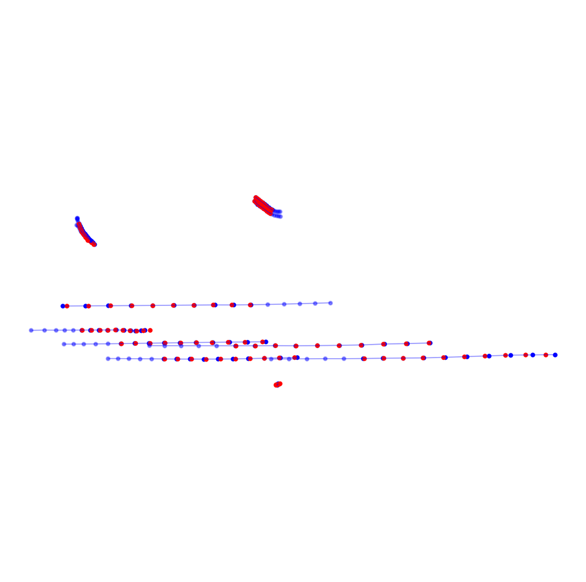
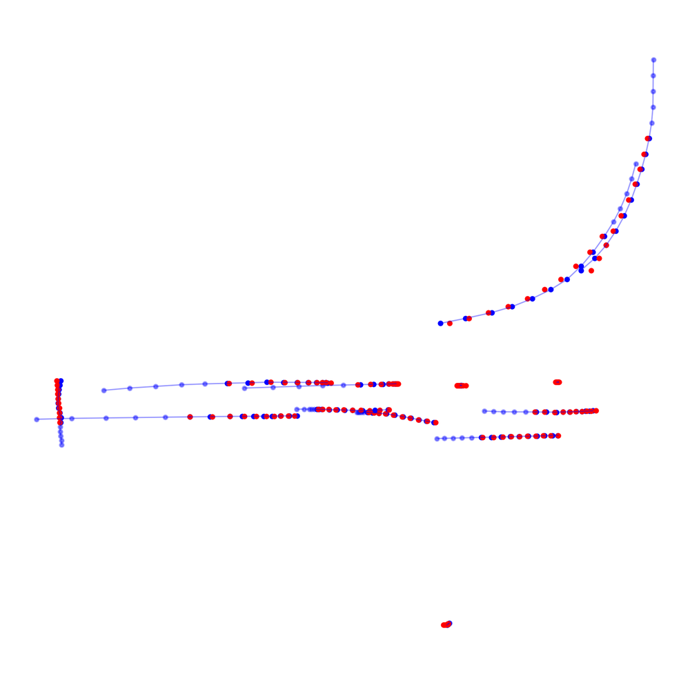
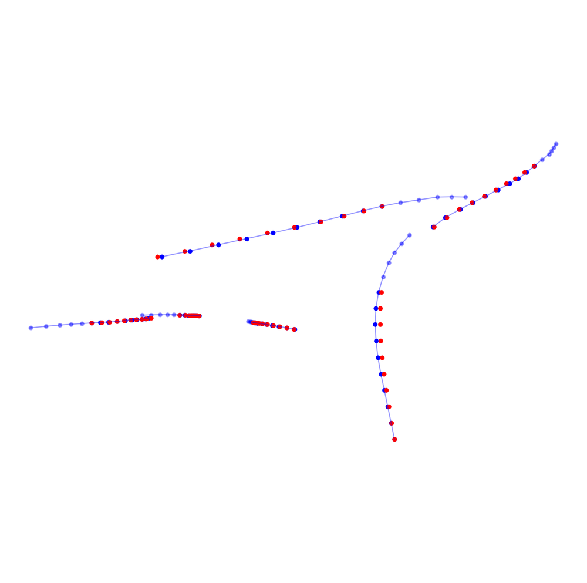
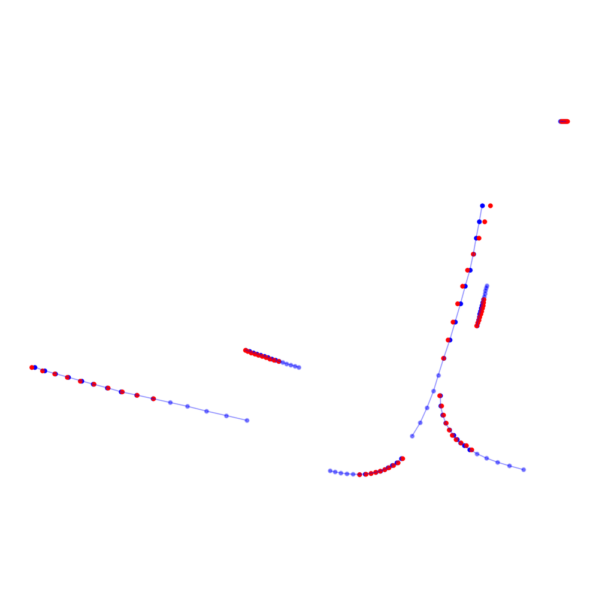
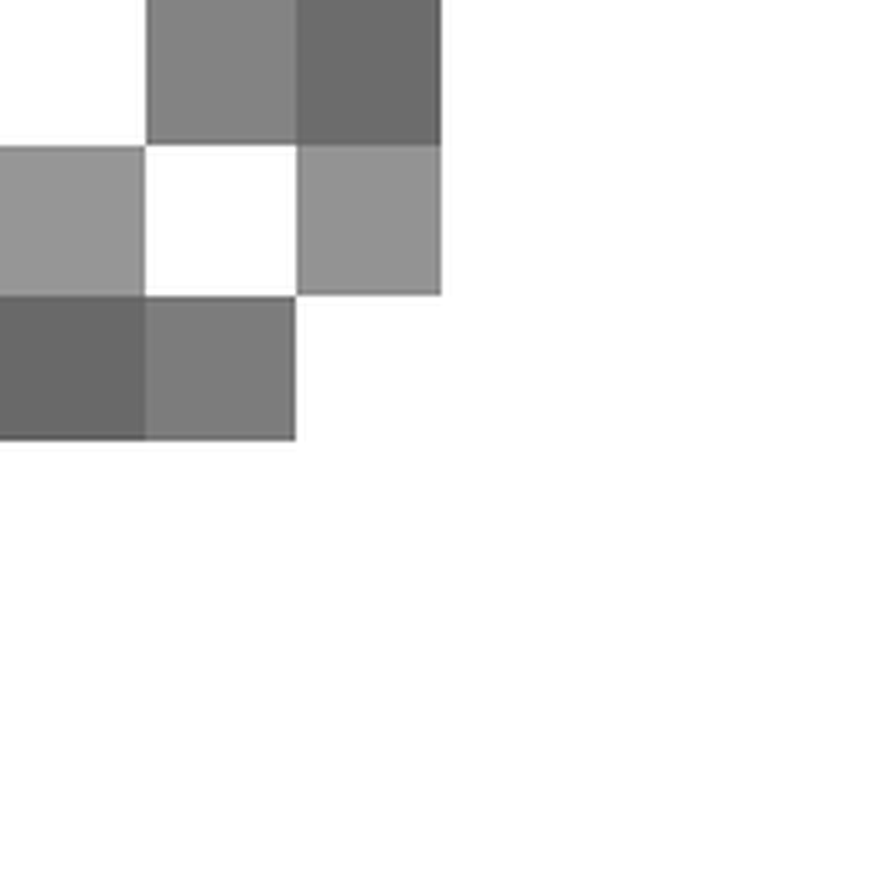
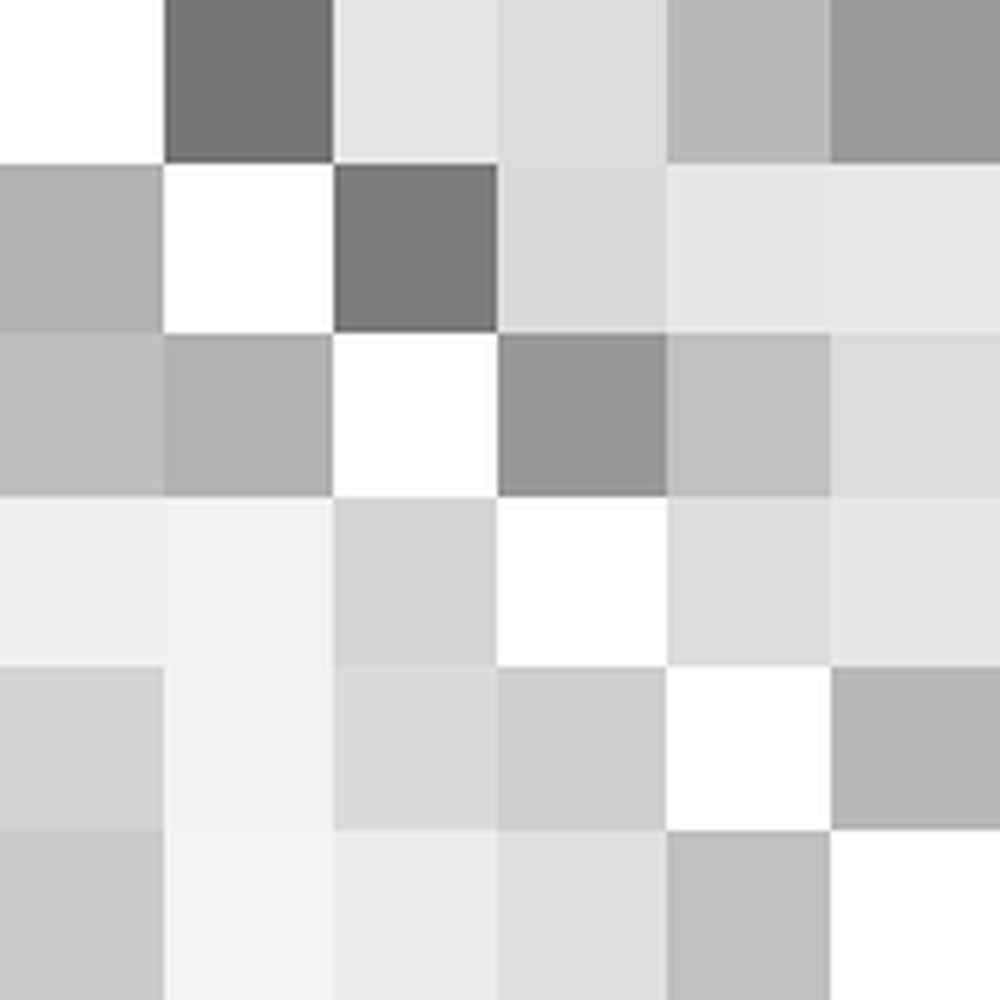
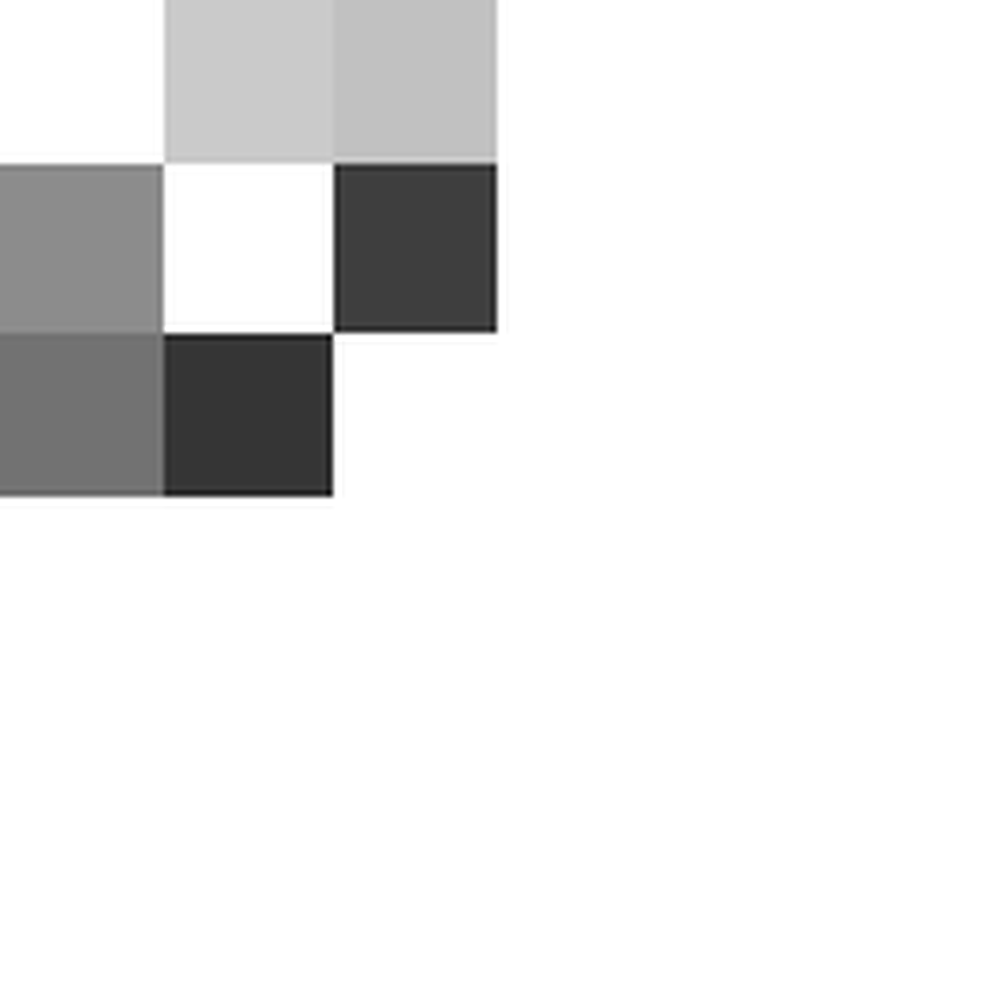

# RAIN: Reinforced Hybrid Attention Inference Network for Motion Forecasting

**URL**: https://www.semanticscholar.org/paper/505f803fe9b15a9c4ef5a67d03d42db3a6596c74
**提交日期**: 2021-08-03
**作者**: Jiachen Li; F. Yang; Hengbo Ma; Srikanth Malla; M. Tomizuka; Chiho Choi
**引用次数**: 44
使用模型: deepseek-v3-1-terminus

## 1. 核心思想总结
根据您提供的标题、摘要和引言部分，以下是对论文《RAIN: Reinforced Hybrid Attention Inference Network for Motion Forecasting》的第一轮简洁总结，按四个部分组织：

**1. Background (背景)**
运动预测在自动驾驶、人机交互等多个领域具有重要作用，其核心任务是根据历史观测序列预测未来的运动轨迹。该领域的一个基本挑战是如何从复杂的历史信息中提取关键内容以进行准确预测。

**2. Problem (问题)**
在历史观测信息中，不同元素的重要性并非均等。某些信息在特定情境下可能是无关紧要甚至具有干扰性的。因此，如何动态地选择和评估这些信息的重要性，是提升运动预测模型性能与可解释性的关键问题。

**3. Method (high-level) (方法 - 高层次)**
本文提出一个名为RAIN的通用运动预测框架。其核心是**基于混合注意力机制的动态关键信息选择与排序方法**。该框架被具体应用于两个任务：1）多智能体轨迹预测，通过图表示学习智能体间关系及其相对重要性；2）人体运动预测，旨在捕捉长期运动中的时间邻近性与依赖性。此外，论文还提出了一种有效的**双阶段交替训练策略**来优化框架中不同模块的参数。

**4. Contribution (贡献)**
*   **性能贡献**：在多个领域的合成仿真和基准测试中，该方法实现了**领先的预测性能**。
*   **技术贡献**：提出了一个**通用框架**和一种**有效的训练策略**。
*   **可解释性贡献**：模型提供的**混合注意力权重具有可解释性和合理性**，有助于理解模型的决策依据。

## 2. 方法详解
好的，基于您提供的初步总结和论文方法章节的内容，以下是对RAIN模型方法细节的详细说明。我将重点描述其关键创新、算法/架构细节、关键步骤与整体流程。

### 论文方法详细说明：《RAIN: Reinforced Hybrid Attention Inference Network for Motion Forecasting》

RAIN模型的核心思想是**通过一个强化学习启发的、可微的“推理”过程，动态地评估和选择历史信息中的关键内容**。该方法不是简单地应用标准的注意力机制，而是对其进行了创新性的改进，使其成为一个可控的、有明确物理意义的决策过程。

---

#### 一、 关键创新

1.  **混合注意力机制作为动态信息选择器**：
    *   **创新点**： 传统的注意力机制（如Transformer中的自注意力）通常对所有输入信息进行加权聚合，权重是连续值。RAIN的创新在于将注意力权重解释为一个**离散的“选择”动作**。具体来说，它将连续的注意力权重通过一个可微的松弛化方法（如Gumbel-Softmax）转换为近似离散的分布，从而模拟了“保留”（高权重）或“丢弃”（低权重）某个信息元素的决策。
    *   **目的**： 这使得模型能够主动过滤掉历史序列中不重要的、甚至是干扰性的信息，只关注于对预测未来轨迹最关键的部分。这直接解决了“问题”部分中提到的信息重要性不均等的挑战。

2.  **双阶段交替训练策略**：
    *   **创新点**： 为了解决混合注意力机制中离散决策导致的梯度不可导问题，并稳定训练过程，论文设计了一种新颖的训练策略。该策略将训练分为两个交替进行的阶段：
        *   **注意力推理阶段**： 此阶段**固定网络的主干编码器-解码器参数**，只更新注意力选择模块的参数。目标是让注意力模块学会如何做出最优的“信息选择”决策，以最小化预测损失。
        *   **轨迹生成阶段**： 此阶段**固定注意力选择模块的参数**，只更新主干编码器-解码器的参数。目标是在给定当前“信息选择”策略下，优化模型生成准确轨迹的能力。
    *   **目的**： 这种解耦训练方式避免了梯度冲突，使注意力模块和轨迹生成模块能够分别专注于自己的任务，从而更高效、更稳定地收敛到一个最优解。

---

#### 二、 算法/架构细节与整体流程

RAIN的整体架构是一个编码器-解码器结构，但其核心在于编码器中的**混合注意力推理模块**。下面以**多智能体轨迹预测**任务为例，详细说明其工作流程。

**整体流程图（概念级）**：
`历史轨迹` -> `编码器（嵌入+图神经网络）` -> **`混合注意力推理模块（核心创新）`** -> `解码器` -> `未来轨迹预测`

##### **关键步骤分解：**

**步骤1： 输入编码与上下文图构建**
*   **目标**： 将每个智能体的历史轨迹转换为特征向量，并构建智能体间的交互关系图。
*   **细节**：
    *   **轨迹编码**： 使用循环神经网络（如LSTM）或时序卷积网络（TCN）对每个智能体`i`的历史轨迹 `X_i = [x_i^1, x_i^2, ..., x_i^T_obs]` 进行编码，得到每个时间步的特征，最后聚合（如取最后一个隐藏状态）得到该智能体的特征向量 `h_i`。
    *   **图构建**： 将所有智能体视为图的节点，节点特征即为 `h_i`。根据智能体间的空间距离或其他先验知识构建边，形成一个图结构。
    *   **图编码**： 使用图神经网络（如GAT或GCN）处理该图。通过消息传递，每个节点的特征会融合其邻居节点的信息，更新为包含交互上下文的增强特征向量 `h_i'`。此时，`h_i'` 不仅包含自身的历史信息，也包含了与其他智能体的关系信息。

**步骤2： 混合注意力推理（核心）**
*   **目标**： 为每个智能体动态地评估图中所有节点（包括自身和其他智能体）的重要性，并进行关键信息选择。
*   **细节**：
    1.  **查询-键值计算**： 将GNN输出的节点特征 `h_i‘` 通过线性变换，为每个节点`i`生成一个查询向量 `q_i` 和键值对 `(k_i, v_i)`。这与标准注意力机制相同。
    2.  **原始注意力权重计算**： 对于目标智能体`i`，计算它与图中所有节点`j`（包括自己）的相似度： `e_ij = (q_i^T * k_j) / sqrt(d)`，其中`d`是特征维度。然后通过softmax得到原始的注意力权重 `α_ij`。`α_ij` 表示在连续空间下，节点`j`对节点`i`的重要性。
    3.  **离散化与松弛训练（关键创新）**：
        *   **概念**： RAIN希望将连续的 `α_ij` 转化为一个近似二值的决策：`重要（1）` 或 `不重要（0）`。但直接取整（argmax）不可导。
        *   **实现**： 论文采用 **Gumbel-Softmax** 技巧。对 `α_ij` 添加Gumbel噪声，并通过一个温度参数 `τ` 来控制松弛程度。当 `τ` 较小时，Gumbel-Softmax的输出接近一个one-hot向量，即近似离散选择；当 `τ` 较大时，输出更平滑。在训练开始时 `τ` 较大，便于梯度流动，随着训练进行逐渐减小 `τ`，使注意力决策趋于离散。
        *   **结果**： 通过此过程，得到一组**稀疏化、近似硬选择的注意力权重** `Â_ij`。
    4.  **信息聚合**： 使用稀疏化的权重 `Â_ij` 对值向量 `v_j` 进行加权求和，得到目标智能体`i`的最终上下文向量 `c_i = Σ_j (Â_ij * v_j)`。**由于 `Â_ij` 是稀疏的，`c_i` 实际上只聚合了被选择为“关键”的少数节点的信息。**

**步骤3： 轨迹解码与输出**
*   **目标**： 基于选择后的关键信息 `c_i`，生成智能体`i`未来的轨迹。
*   **细节**：
    *   将智能体`i`的自身特征 `h_i’` 与上下文向量 `c_i` 拼接，输入到一个解码器（如另一个LSTM或MLP）中。
    *   解码器输出未来时间步 `T_obs+1` 到 `T_pred` 的轨迹点 `Y_i = [y_i^{T_obs+1}, ..., y_i^{T_pred}]`。通常为了处理不确定性，会预测一个高斯分布的参数（均值μ和方差σ），即概率性预测。

**步骤4： 双阶段交替训练策略（核心创新）**
*   **目标**： 高效、稳定地优化包含离散决策的模型。
*   **细节**：
    *   **阶段A - 注意力推理**：
        *   **固定参数**： 轨迹编码器、GNN、解码器的参数被固定。
        *   **更新参数**： 只更新注意力推理模块中生成查询`q`、键`k`、值`v`的线性变换层的参数。
        *   **目标函数**： 最小化预测轨迹与真实轨迹之间的负对数似然损失。**此阶段专门训练注意力模块“如何做出更好的选择”**。
    *   **阶段B - 轨迹生成**：
        *   **固定参数**： 注意力推理模块的参数被固定。
        *   **更新参数**： 更新轨迹编码器、GNN、解码器等所有其他参数。
        *   **目标函数**： 同样最小化预测损失。**此阶段专门训练轨迹生成模块“在给定选择下如何更好地预测”**。
    *   **交替执行**： 在训练过程中，阶段A和阶段B交替进行。例如，每训练完一个批次的阶段A，就接着训练一个批次的阶段B。这种策略确保了两个模块的协同优化，同时避免了因离散决策带来的梯度估计方差过大问题。

---

#### 三、 应用于人体运动预测

该方法具有通用性。在**人体运动预测**任务中，架构基本不变，但上下文图的结构发生了变化：
*   **图构建**： 图的节点不再是多个智能体，而是**单个人体的不同关节**（如手、脚、躯干等）。边则代表人体骨骼的自然连接。
*   **信息流**： 混合注意力推理模块的作用变为**评估在预测某个关节未来运动时，身体哪些其他关节的信息是关键的**。例如，预测“手腕”运动时，“手肘”和“肩膀”的注意力权重可能会很高，而“脚踝”的权重可能很低。这有效捕捉了人体运动的时空依赖性。

### 总结

RAIN方法的核心细节在于：
1.  **混合注意力推理模块**： 通过Gumbel-Softma等技术将连续注意力权重离散化，实现动态、可解释的**关键信息选择**，而非简单加权。
2.  **双阶段交替训练策略**： 通过解耦注意力决策和轨迹生成任务，**稳定且高效地**优化了整个模型，这是工程上的一个重要创新。
3.  **通用框架**： 通过改变图结构的定义，该框架可无缝应用于多智能体交互和人体运动等不同场景，体现了其强大的泛化能力。

这些技术细节共同作用，使RAIN不仅在预测精度上达到领先水平，还通过其注意力权重为模型的决策过程提供了清晰的洞见，实现了性能与可解释性的统一。

## 3. 最终评述与分析
好的，结合您提供的初步总结、方法详述以及结论部分的信息，现为您呈现对论文《RAIN: Reinforced Hybrid Attention Inference Network for Motion Forecasting》的最终综合评估。

---

### **关于论文《RAIN》的最终综合评估**

#### **1. Overall Summary (整体摘要)**

本论文针对运动预测任务中**历史信息重要性不均等**的核心挑战，提出了一个名为RAIN的创新性通用框架。该框架的核心贡献是设计了一种**强化学习启发的混合注意力推理机制**，该机制能够动态地、有选择性地评估并筛选出对预测未来轨迹最关键的上下文信息（如多智能体交互中的重要邻居，或人体运动中依赖性强的关节），而非对所有信息进行简单的加权平均。为了有效训练这一包含离散化决策过程的模型，论文还提出了一种**新颖的双阶段交替训练策略**，成功解决了梯度优化难题。实验表明，RAIN在多个领域的标准数据集上取得了**领先的预测精度**，同时其提供的**稀疏注意力权重具有高度的可解释性**，清晰地揭示了模型决策的依据，实现了性能与透明度的双赢。

#### **2. Strengths (优势)**

1.  **创新性的核心机制**：将注意力权重从连续的“加权”提升为近似离散的“选择”，这是一个根本性的创新。它使模型具备了主动过滤噪声和无关信息的能力，直接针对运动预测的痛点问题。
2.  **强大的通用性与灵活性**：RAIN是一个模型框架，而非针对特定任务的定制模型。通过简单地重新定义图结构（智能体间图或人体关节图），它便能有效应用于差异巨大的不同领域（多智能体轨迹预测、人体运动预测），证明了其强大的泛化能力和架构优势。
3.  **有效的训练策略**：提出的双阶段交替训练策略是工程上的一个亮点。它通过解耦“信息选择”和“轨迹生成”两个任务，巧妙地规避了离散决策带来的梯度估计难题，确保了训练的稳定性和收敛效率，为类似混合模型的训练提供了有价值的范例。
4.  **卓越的性能与可解释性统一**：论文不仅在定量实验上展示了SOTA或极具竞争力的预测精度，更在定性分析中通过可视化注意力权重，令人信服地证明了模型决策的合理性（例如，车辆会关注可能发生冲突的对方，而忽略无关车辆；预测手部运动时重点关注手臂关节）。这使RAIN不仅是一个强大的预测工具，更是一个可供分析的“白盒”模型。

#### **3. Weaknesses / Limitations (弱点/局限性)**

1.  **计算复杂度与效率**：尽管论文可能未重点强调，但引入Gumbel-Softmax松弛和交替训练策略可能会增加模型的计算开销和训练时间，与标准的注意力模型相比，在推理速度上可能需要评估。这对于自动驾驶等对实时性要求极高的应用场景是一个需要考虑的权衡因素。
2.  **对图结构定义的依赖性**：模型的效能建立在合理的图结构之上（如智能体间的连接规则、人体关节的连接方式）。如果图构建不准确或未能捕捉到真正的依赖关系，可能会限制模型性能的发挥。模型本身可能不擅长自动发现未知的、复杂的隐性关系。
3.  **任务广度**：虽然论文在多个任务上验证了有效性，但结论部分可能未涉及更极端或复杂的场景，例如：动态变化的交互拓扑、超大规模智能体群的可扩展性、以及对完全未知物体的互动预测能力。这些是模型在实际部署中可能面临的挑战。
4.  **理论深度**：论文侧重于工程实现和实验验证，对于混合注意力机制的理论基础（如其与强化学习中的策略梯度的更深层联系）的探讨可能相对有限。

#### **4. Potential Applications / Implications (潜在应用/影响)**

1.  **自动驾驶核心感知模块**：RAIN模型最直接、最重要的应用就是作为自动驾驶车辆的行为预测模块。其准确预测周围车辆、行人未来轨迹的能力，以及提供的可解释性依据，对于制定安全、可靠的驾驶策略至关重要。
2.  **机器人技术与人机交互**：使机器人能够更精准地预测人类的运动意图，从而实现更自然、更安全的协作（如工业机器人避让工人）与交互（如服务机器人递送物品）。
3.  **智能监控与行为分析**：在安防和视频监控领域，该技术可用于异常行为检测，通过分析个体或群体的运动轨迹预测是否偏离正常模式，及时发出警报。
4.  **计算机动画与虚拟现实**：为生成逼真、符合物理规律的人体运动序列提供了强大的工具，可用于游戏、电影特效和VR体验中的人物动画合成。
5.  **方法论启示**：RAIN所提出的“**动态关键信息选择**”思想和“**双阶段交替训练**”策略，对机器学习社区具有广泛的启发意义。这种思路可以迁移到其他存在信息冗余或噪声的序列建模任务中，如自然语言处理（文本摘要、情感分析）、金融时序预测等，为构建更鲁棒、更可解释的序列模型提供了新的技术路径。

---
**总结**：论文《RAIN》提出了一项在运动预测领域兼具**创新性、实用性**和**启发性**的杰出工作。它通过一个精巧的算法设计，有效解决了领域内的关键问题，并在性能和可解释性方面均取得了显著提升，具有重要的学术价值和广阔的应用前景。

---

# 附录：论文图片

## 图 1

## 图 2

## 图 3

## 图 4

## 图 5

## 图 6

## 图 7

## 图 8

## 图 9

## 图 10

