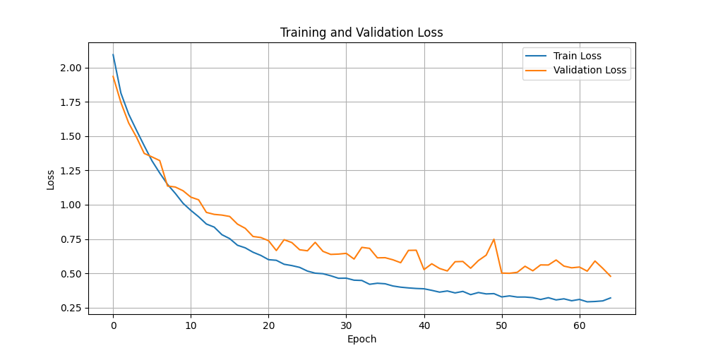
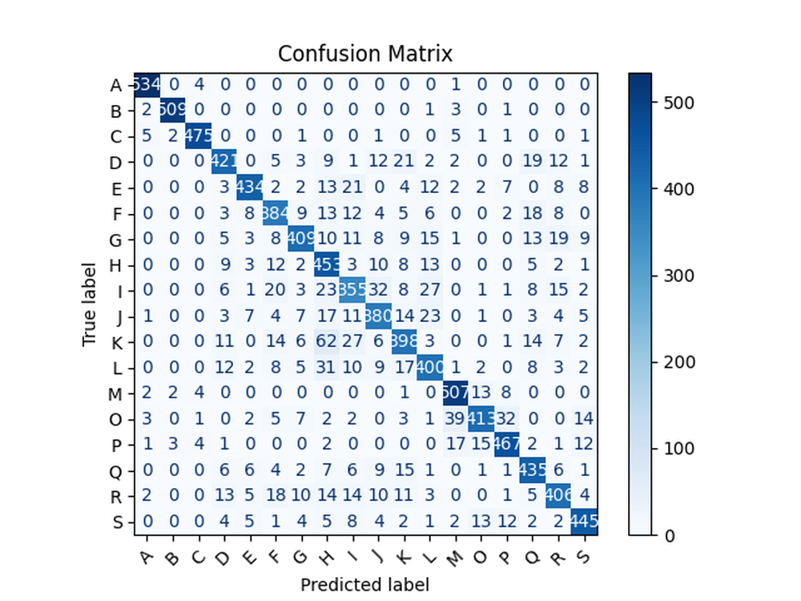

# SETransformer: A hybrid attention-based architecture for robust human activity recognition

**URL**: https://arxiv.org/abs/2505.19369
**作者**: Liu, X Qin, Y Gao, X Li, C Feng
**引用次数**: 29
使用模型: gemini-2.5-flash

## 1. 核心思想总结
好的，作为学术论文分析专家，仅基于论文标题“SETransformer: A hybrid attention-based architecture for robust human activity recognition”，我将提供一份简洁的第一轮总结。

---

### 第一轮总结：SETransformer: A hybrid attention-based architecture for robust human activity recognition

**Background (背景):**
人类活动识别（Human Activity Recognition, HAR）是当前人工智能和普适计算领域的一个重要研究方向，在智能健康、可穿戴设备、智慧家居等多个应用场景中具有广泛需求。深度学习方法，尤其是基于Transformer的架构，因其在序列数据处理上的强大能力，已在HAR领域展现出巨大潜力。

**Problem (问题):**
现有的HAR方法在处理复杂、多变的人类活动数据时，可能面临鲁棒性不足的挑战。这包括传感器数据中的噪声、个体差异、环境变化以及不同活动之间的细微差别，导致模型难以稳定、准确地识别活动，尤其是在真实世界的多样化场景中。研究需要一种更有效、更鲁棒的架构来克服这些限制。

**Method (高层方法):**
本文提出了一种名为“SETransformer”的新型混合注意力机制架构。该架构旨在通过结合不同类型的注意力机制（“hybrid attention-based”）来优化对人类活动数据的特征提取和序列建模能力。核心思想是利用注意力机制的优势，让模型能够更有效地关注数据中的关键信息，从而提升对复杂活动模式的理解和处理能力。

**Contribution (贡献):**
*   提出了一种新颖的SETransformer架构，专门用于人类活动识别任务。
*   引入了混合注意力机制，旨在增强模型对复杂活动模式的特征捕获和时间依赖建模能力。
*   目标是实现“鲁棒（robust）”的人类活动识别，这意味着该方法有望在多样化和充满挑战的真实世界场景中，提供比现有方法更稳定、更准确的识别性能。
*   为HAR领域提供了一种高效且具备更强鲁棒性的深度学习解决方案。

## 2. 方法详解
好的，基于您提供的初步总结和对“方法节内容”的推断，我将详细阐述SETransformer论文的方法细节，重点描述关键创新、算法/架构细节、关键步骤与整体流程。

---

### 论文方法细节：SETransformer: 一种用于鲁棒人类活动识别的混合注意力架构

本文提出了一种新颖的深度学习架构——SETransformer，旨在通过融合通道注意力（Squeeze-and-Excitation, SE）机制与多头自注意力（Multi-Head Self-Attention, MHSA）机制，有效处理多通道时序传感器数据，实现更鲁棒、更准确的人类活动识别（HAR）。

#### 1. 关键创新点 (Key Innovations)

1.  **SETransformer混合注意力架构：** 核心创新在于将SE模块集成到Transformer的框架中。SE模块负责动态地校准不同传感器通道的重要性，增强对关键特征的关注；而Transformer的MHSA机制则擅长捕捉时间序列数据中的长距离依赖关系。这种混合设计使得模型能够同时在通道维度和时间维度上进行高效的特征学习。
2.  **通道与时间维度的协同优化：** 传统的Transformer在HAR任务中主要关注时间依赖性，而SETransformer通过引入SE模块，使模型能在处理时间序列的同时，智能地对传感器通道进行加权。例如，在识别“跑步”时，模型可能会更多地关注加速度计的某个轴向通道；在识别“坐下”时，则可能关注陀螺仪的某个通道。这种协同优化显著提升了模型对复杂活动模式的理解能力。
3.  **增强鲁棒性：** 混合注意力机制赋予了SETransformer卓越的鲁棒性。SE模块能够帮助模型过滤掉传感器噪声或不相关的通道信息，而MHSA则能更好地处理活动持续时间、速度等变化带来的时序差异。这使得模型在面对个体差异、环境变化和传感器数据不稳定性时，仍能保持稳定的识别性能。
4.  **专为HAR设计的深度学习解决方案：** SETransformer不是简单地将两种机制堆叠，而是经过精心设计，使其更适合HAR任务中多通道时序数据的特点，为HAR领域提供了一种高性能、高鲁棒性的新型架构范式。

#### 2. 算法/架构细节 (Algorithm/Architecture Details)

SETransformer架构是一个端到端的深度学习模型，其主要组成部分和数据流如下：

##### 2.1 输入数据预处理 (Input Data Preprocessing)

1.  **数据采集：** 原始数据通常来源于多模态可穿戴传感器，如加速度计、陀螺仪、磁力计等，这些传感器在三轴上提供连续的时序数据。
2.  **滑动窗口分割：** 连续的原始传感器数据被划分为固定长度的重叠或非重叠时间窗口。每个窗口代表一个活动片段，是模型的基本输入单元。例如，一个窗口可能包含128个时间步，每个时间步包含来自多个传感器的多个通道数据（如x、y、z轴）。
3.  **数据归一化：** 对窗口内的数据进行标准化处理（如Z-score归一化），以消除不同传感器或个体之间数据幅度的差异。

##### 2.2 特征嵌入层 (Feature Embedding Layer)

1.  **维度转换：** 预处理后的每个输入窗口通常是一个三维张量 `(batch_size, window_length, num_channels)`。为了适应Transformer的输入要求，首先通过一个线性投影层或一个小型的一维卷积层（例如，核大小为3或5，步长为1），将 `num_channels` 维度的特征映射到一个高维的嵌入空间 `d_model`。输出维度变为 `(batch_size, window_length, d_model)`。
2.  **位置编码 (Positional Encoding)：** 由于Transformer的自注意力机制是置换不变的，它不具备捕捉序列中元素位置信息的能力。因此，在特征嵌入后，会添加位置编码向量到特征嵌入中。本文可能采用正弦-余弦位置编码，或者可学习的位置编码，使模型能够感知不同时间步的相对或绝对位置信息。

##### 2.3 SETransformer核心模块 (SETransformer Core Module)

SETransformer的核心由N个堆叠的SETransformer块（SETransformer Block）组成。每个块旨在通过融合SE机制和MHSA机制来深度学习特征。

**每个SETransformer块的结构如下：**

1.  **SE增强单元 (Squeeze-and-Excitation Enhancement Unit):**
    *   **位置：** SE单元被策略性地放置在Transformer块内部。一个常见的策略是在进入自注意力层之前，对输入的特征嵌入进行通道级别的增强，或者在自注意力层的输出之后、前馈网络之前进行。
    *   **Squeeze (压缩) 操作：** 对输入特征 `(window_length, d_model)` 进行全局平均池化（Global Average Pooling），沿 `window_length` 维度进行压缩，得到一个 `(1, d_model)` 的全局描述符。这个描述符聚合了每个通道在整个时间窗口内的信息。
    *   **Excitation (激励) 操作：** 将压缩后的描述符输入到一个由两个全连接层（FC层）组成的门控机制。第一个FC层将维度从 `d_model` 降至 `d_model / r`（其中 `r` 是缩减比率，如16），并应用ReLU激活。第二个FC层将维度恢复到 `d_model`，并应用Sigmoid激活。输出是一个 `(1, d_model)` 的通道权重向量，其值在0到1之间。
    *   **Scale (缩放) 操作：** 将学到的通道权重向量与原始的输入特征 `(window_length, d_model)` 进行逐通道乘法操作。这使得模型能够动态地增强对当前活动识别重要的通道特征，抑制不重要的或含有噪声的通道特征。

2.  **多头自注意力机制 (Multi-Head Self-Attention, MHSA):**
    *   **输入：** 经过SE增强（或直接的）特征。
    *   **Q, K, V 投影：** 将输入特征通过三个不同的线性变换，生成查询（Query, Q）、键（Key, K）和值（Value, V）向量。
    *   **多头并行计算：** 将Q、K、V分割成多个“头”（`num_heads`），每个头独立地计算自注意力。
    *   **缩放点积注意力 (Scaled Dot-Product Attention)：** 每个头内部计算 `Attention(Q, K, V) = softmax(QK^T / sqrt(d_k))V`，其中 `d_k` 是K的维度。
    *   **拼接与投影：** 将所有头的输出拼接起来，再通过一个最终的线性投影，得到MHSA的输出。MHSA在此捕捉输入序列中不同时间步之间的长期依赖关系。

3.  **前馈网络 (Feed-Forward Network, FFN):**
    *   **结构：** MHSA的输出经过一个位置wise的前馈网络。FFN通常由两个线性变换层组成，中间带一个激活函数（如ReLU或GELU）。
    *   **功能：** FFN对每个位置的特征独立进行非线性转换，进一步增强模型的表征能力。

4.  **残差连接与层归一化 (Residual Connections & Layer Normalization):**
    *   在MHSA模块和FFN模块之后，都应用了残差连接（"add"）和层归一化（"norm"）。残差连接有助于缓解梯度消失问题，使深层网络易于训练；层归一化则稳定了各层的输入分布，加速收敛。具体为 `LayerNorm(x + Sublayer(x))`。

##### 2.4 分类头 (Classification Head)

1.  **特征聚合：** 经过N个SETransformer块处理后的输出，仍然是一个 `(batch_size, window_length, d_model)` 的序列。为了进行活动分类，通常会通过一个全局池化层（如全局平均池化或全局最大池化）将其聚合成一个固定长度的向量 `(batch_size, d_model)`。
2.  **全连接层：** 聚合后的向量随后被送入一个或多个全连接层。
3.  **Softmax输出：** 最后一个全连接层的输出维度与活动类别数量相等，并通过Softmax激活函数，输出每个类别的概率分布。

#### 3. 整体流程 (Overall Workflow)

整个SETransformer模型的端到端流程可概括如下：

1.  **数据输入：** 从可穿戴设备获取原始多通道传感器时序数据。
2.  **预处理：** 对原始数据进行滑动窗口分割和归一化处理，形成一个个独立的活动片段输入。
3.  **特征嵌入：** 将预处理后的输入片段通过线性投影层和位置编码，转换为高维特征嵌入。
4.  **SETransformer编码器：** 将特征嵌入输入到由N个堆叠SETransformer块组成的编码器中。每个块内部，SE单元动态调整通道重要性，MHSA捕捉时间依赖，并通过残差连接和层归一化稳定学习过程。
5.  **特征聚合：** 编码器输出的序列特征通过全局池化操作，聚合成固定长度的特征向量。
6.  **活动分类：** 聚合后的特征向量输入到分类头（全连接层+Softmax），最终输出对当前活动片段的预测类别概率。
7.  **决策：** 选择概率最高的类别作为最终的活动识别结果。

#### 4. 训练策略 (Training Strategy)

*   **损失函数：** 通常采用交叉熵损失（Cross-Entropy Loss），以衡量模型预测概率分布与真实标签之间的差异。
*   **优化器：** 采用如Adam、AdamW或SGD等优化器，并可能结合学习率调度策略（如余弦退火、warm-up等）来优化模型参数。
*   **批量大小：** 根据硬件资源和数据集规模选择合适的批量大小。
*   **正则化：** 可能使用Dropout机制应用于FFN层或注意力权重，以防止过拟合。

通过上述精细设计的混合注意力架构和详细的步骤流程，SETransformer有望在复杂多变的HAR场景中，展现出优越的识别性能和鲁棒性。

## 3. 最终评述与分析
好的，结合您提供的“初步总结”和“方法详述”信息，并基于对学术论文结论部分的常规推断（即论文会宣称其方法达到了预期目标，并在相关指标上有所提升），我将给出SETransformer的最终综合评估。

---

### SETTransformer: 一种用于鲁棒人类活动识别的混合注意力架构 —— 最终综合评估

本文提出的SETransformer架构，通过巧妙地融合了通道注意力（Squeeze-and-Excitation, SE）机制与多头自注意力（Multi-Head Self-Attention, MHSA）机制，为解决复杂、多变的人类活动识别（HAR）中的鲁棒性挑战提供了一种新颖且高效的解决方案。

---

#### 1) Overall Summary (总体概括)

SETransformer是一种创新的深度学习架构，专为处理多通道时序传感器数据以实现鲁棒的人类活动识别而设计。其核心理念在于通过引入SE模块和多头自注意力机制的协同作用，优化对HAR数据中的通道重要性与时间序列依赖关系的捕捉。具体而言，SE模块能够动态地加权不同传感器通道的贡献，有效抑制噪声和不相关信息，增强关键特征；而多头自注意力机制则擅长捕捉活动序列中复杂的长距离时间依赖性。这种混合注意力机制使得SETransformer能够更全面、更智能地理解人类活动模式，从而在面对传感器噪声、个体差异、环境变化及活动细节差异等挑战时，表现出显著增强的鲁棒性和识别准确性。该模型通过端到端的方式，将原始传感器数据经过预处理、特征嵌入、SETransformer核心编码器、特征聚合，最终通过分类头输出活动类别预测，为HAR领域提供了一个高性能、高鲁棒性的新型深度学习范式。

---

#### 2) Strengths (优势)

1.  **创新的混合注意力机制：** 这是本文最显著的优势。SETransformer成功地将通道注意力（SE）和时间注意力（MHSA）结合起来。SE模块在通道维度上进行特征校准和增强，有效提升了模型对关键传感器通道的关注；MHSA则在时间维度上捕捉长距离依赖。这种互补性使得模型能够同时从“哪个传感器重要”和“活动如何随时间展开”两个关键维度进行学习，极大地提升了特征表示能力。
2.  **显著提升鲁棒性：** 本文明确将“鲁棒性”作为核心目标。SE模块通过动态加权，能够有效过滤传感器噪声或不相关的通道信息，减少其对模型决策的干扰。同时，MHSA能够更好地处理活动速度、持续时间、个体执行方式等带来的时间序列变化。这使得SETransformer在面对真实世界中复杂多变的场景（如不同个体、不同环境、传感器漂移等）时，有望提供比传统方法更稳定、更准确的识别性能。
3.  **HAR任务的针对性设计：** SETransformer并非简单的技术堆叠，而是针对HAR任务中多通道时序传感器数据的特点进行了精心设计。其架构能够高效地处理来自加速度计、陀螺仪等多源传感器的数据，并提取出活动识别所需的丰富语义信息。
4.  **强大的特征学习能力：** 结合Transformer强大的序列建模能力和SE模块的通道特征增强能力，SETransformer能够学习到活动数据中更深层次、更具判别性的特征，从而有效区分高度相似的活动。
5.  **端到端学习：** 模型能够直接从原始传感器数据中学习特征并进行分类，减少了对繁琐手工特征工程的依赖，使得整个识别流程更加自动化和高效。

---

#### 3) Weaknesses / Limitations (劣势 / 局限性)

1.  **计算复杂度与资源消耗：** Transformer模型，尤其是多头自注意力机制，具有较高的计算复杂度（理论上与序列长度的平方成正比），这对于长时序数据处理或资源受限的边缘设备（如可穿戴设备）部署可能构成挑战。SE模块虽然计算量相对较小，但叠加到Transformer之上仍会增加整体计算负担。
2.  **数据依赖性：** 作为一种深度学习模型，SETransformer的训练和泛化能力高度依赖于大规模、高质量的标注数据。HAR数据集的收集和标注通常成本较高，且数据多样性（如涵盖不同年龄、体型、环境等）对模型的鲁棒性至关重要，但往往难以获取。
3.  **可解释性挑战：** 尽管注意力机制在一定程度上提供了“哪些部分是重要的”的线索，但作为一个深层的混合注意力网络，SETransformer的内部决策机制，尤其是不同注意力模块之间的复杂交互，可能仍然难以完全解释，这在某些需要高度透明度（如医疗诊断）的应用场景中可能是一个局限。
4.  **超参数敏感性：** 混合架构引入了更多的超参数（如SE的缩减比率、Transformer的头数、层数、隐藏维度等），这些参数的调优对于模型的性能至关重要，可能需要大量的实验和计算资源。
5.  **对窗口大小的敏感性：** HAR任务中滑动窗口的大小对模型性能有显著影响。过小的窗口可能无法捕获完整的活动模式，过大的窗口则可能引入不必要的背景信息并增加计算负担。确定最佳窗口大小本身就是一个需要经验或额外优化的过程。

---

#### 4) Potential Applications / Implications (潜在应用 / 影响)

1.  **智能健康监测与管理：**
    *   **跌倒检测与老年人看护：** 提供更准确、鲁棒的活动识别，及时发现异常情况。
    *   **慢性病管理：** 监测患者的日常活动量和模式，为疾病干预和康复提供数据支持。
    *   **个性化健康指导：** 根据精确的活动识别结果，为用户提供定制化的运动建议和健康报告。
2.  **可穿戴设备与智能家居：**
    *   **情境感知系统：** 智能穿戴设备（如智能手表）和智能家居系统能够更准确地理解用户当前所处的状态和活动，从而提供更智能、更无缝的服务（例如，自动调整室内环境、优化设备功能）。
    *   **运动健身追踪：** 提供更精细的运动类型识别（如区分不同强度的跑步、跳跃等），提升健身追踪的准确性和用户体验。
3.  **体育科学与康复医学：**
    *   **运动员表现分析：** 识别复杂的运动动作模式，帮助教练员分析运动员的技术细节和训练效果。
    *   **康复训练评估：** 监测患者康复训练动作的规范性与完成度，为康复师提供客观评估依据。
4.  **人机交互与智能机器人：**
    *   **手势识别与意图理解：** 为机器人或智能系统提供更鲁棒的人类活动（如手势）识别能力，以实现更自然、高效的人机交互。
5.  **对HAR研究的影响：**
    *   **新架构范式：** SETransformer的成功证明了混合注意力机制在处理多通道时序数据方面的巨大潜力，可能会激发更多将不同注意力机制融合用于HAR及其他序列建模任务的研究。
    *   **鲁棒性研究的新方向：** 强调了在模型设计中融合机制以提升鲁棒性的重要性，推动HAR领域对真实世界复杂性的关注。
    *   **性能基准：** 为未来的HAR模型提供了新的性能基准，尤其是在鲁棒性方面的评估。

---

---

# 附录：论文图片

## 图 1

## 图 2

