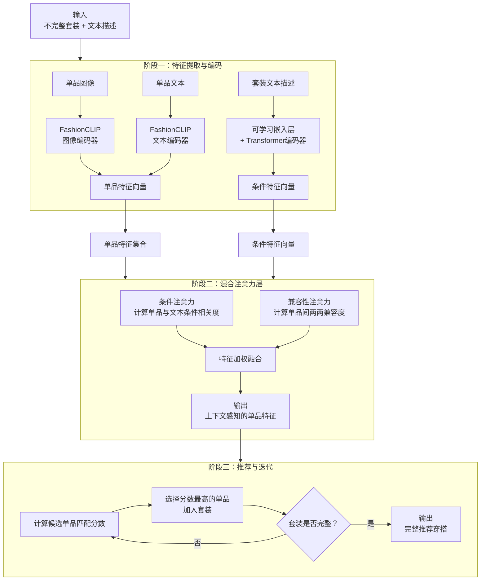
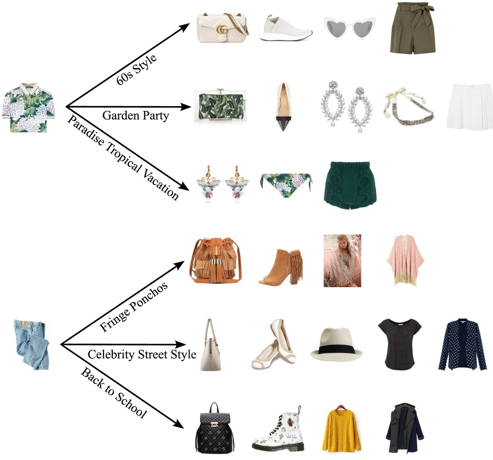
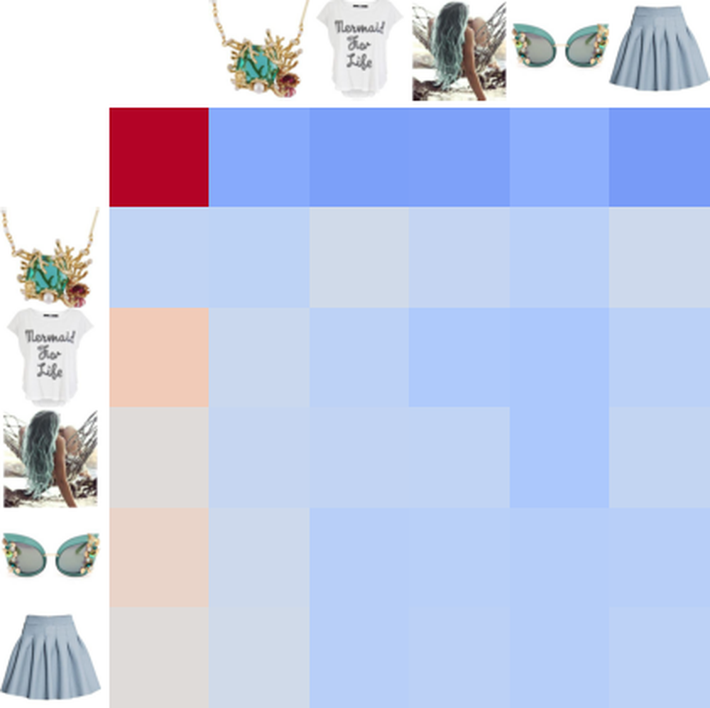
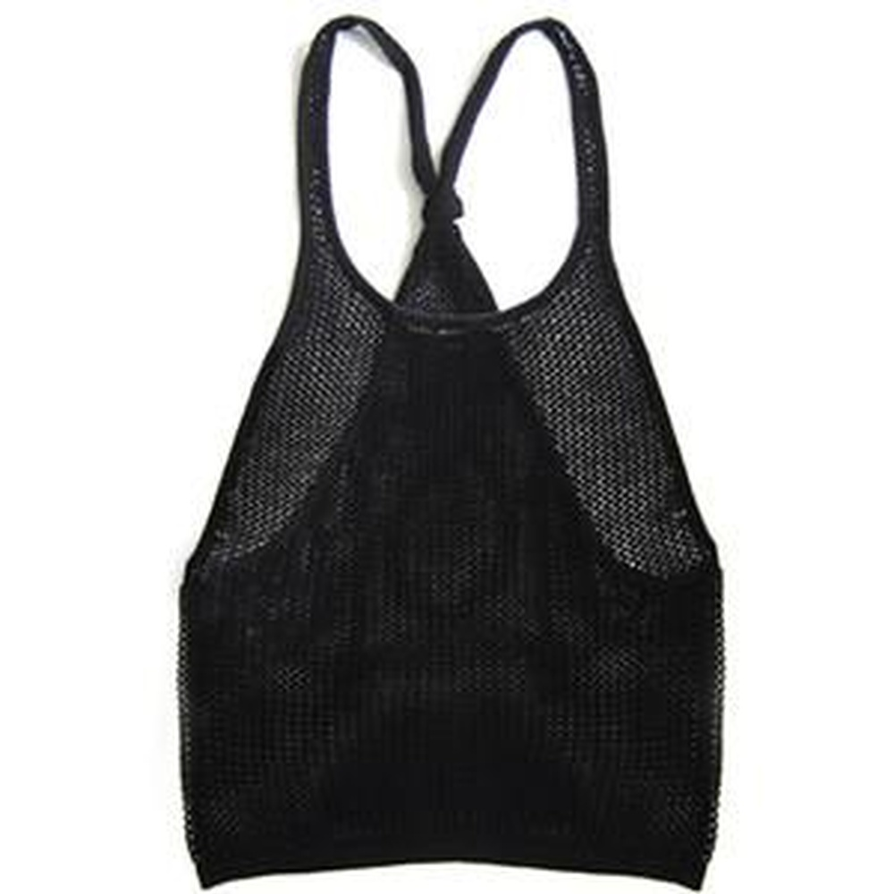
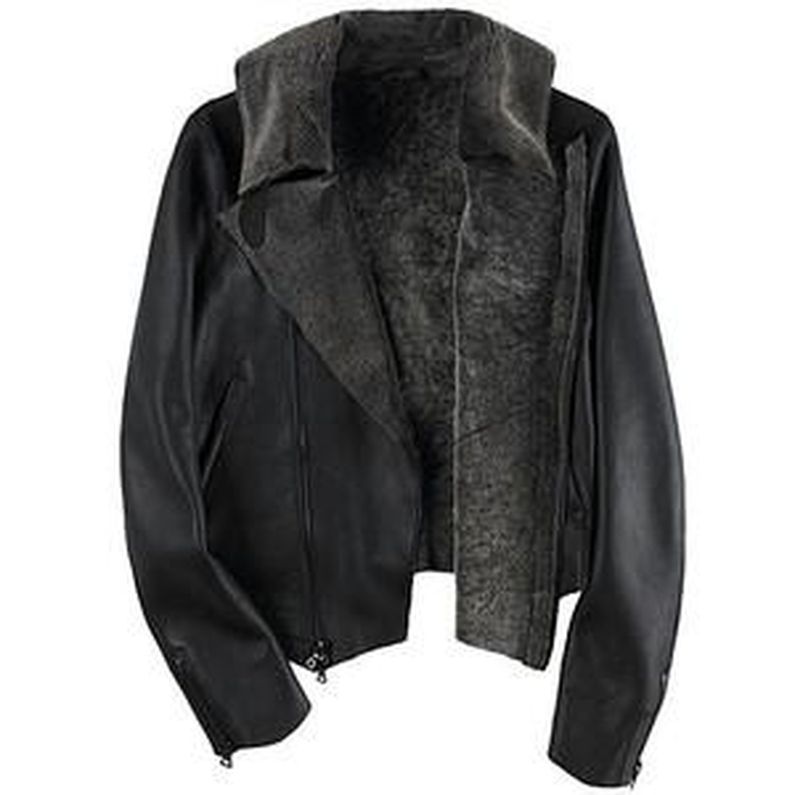
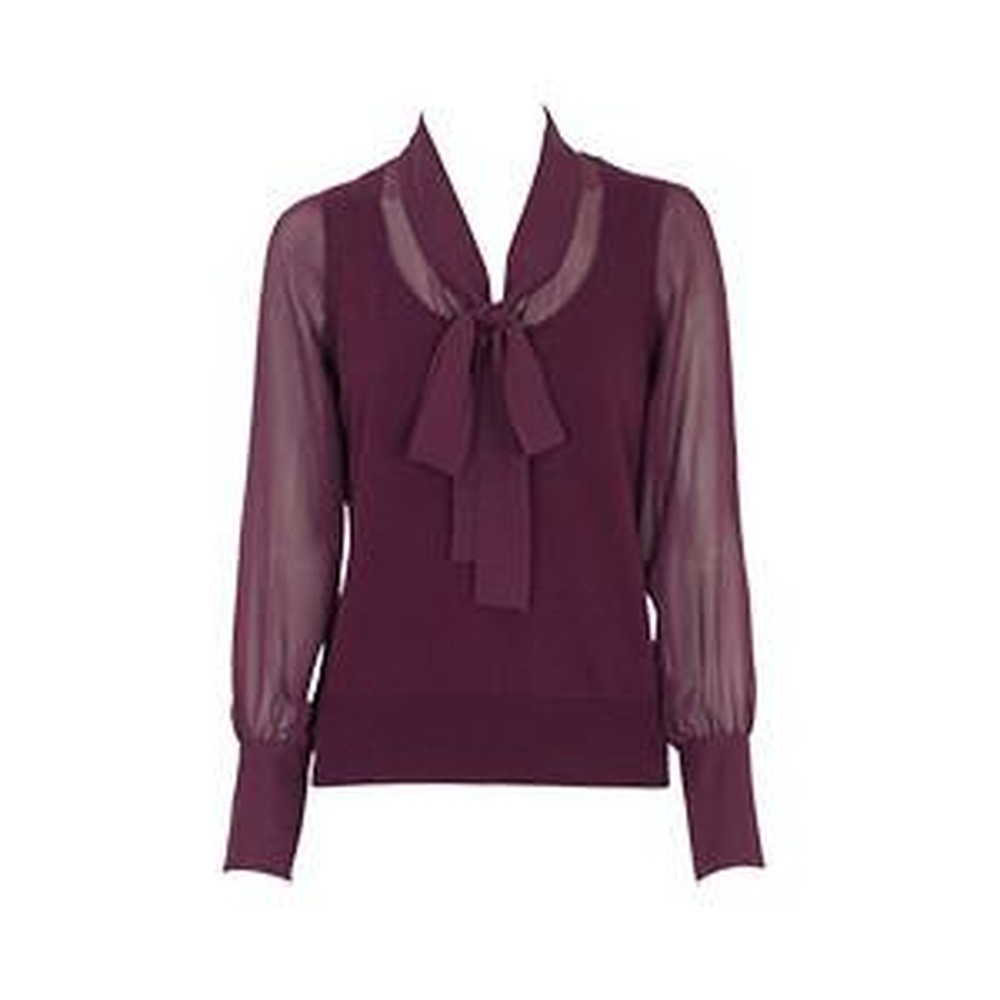
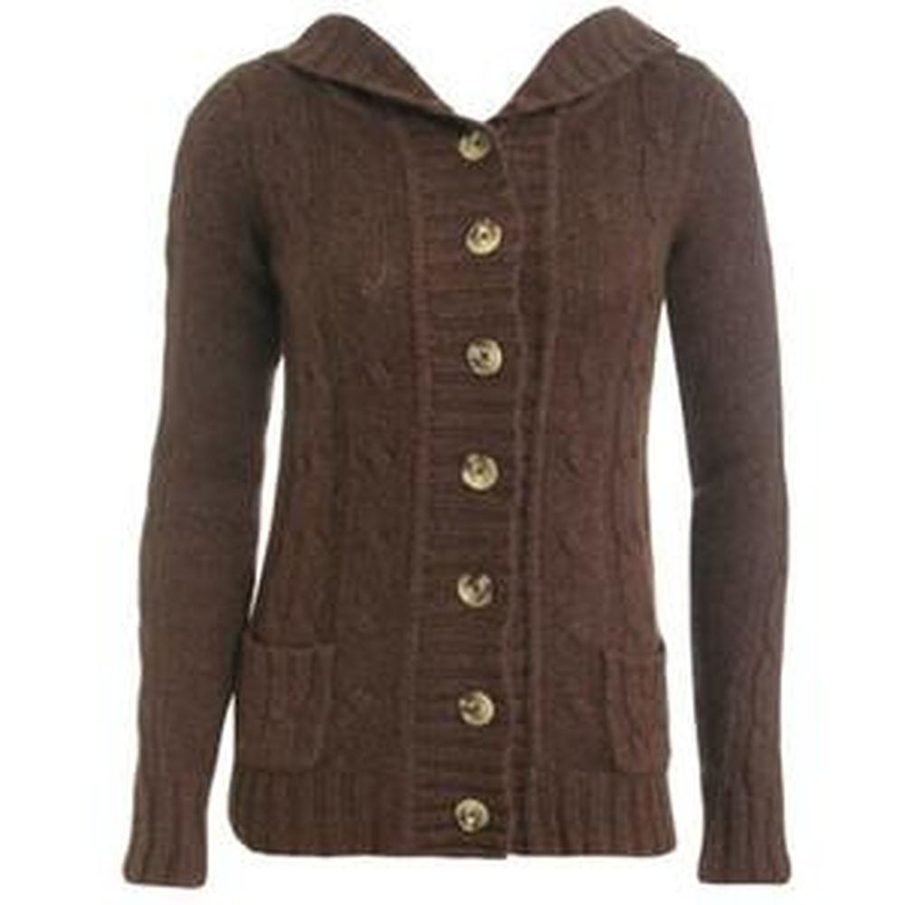
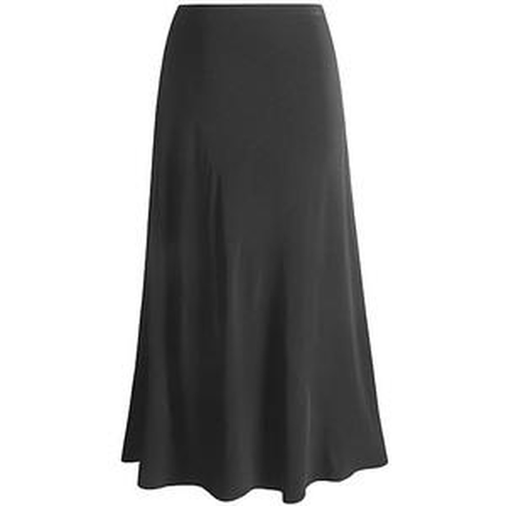
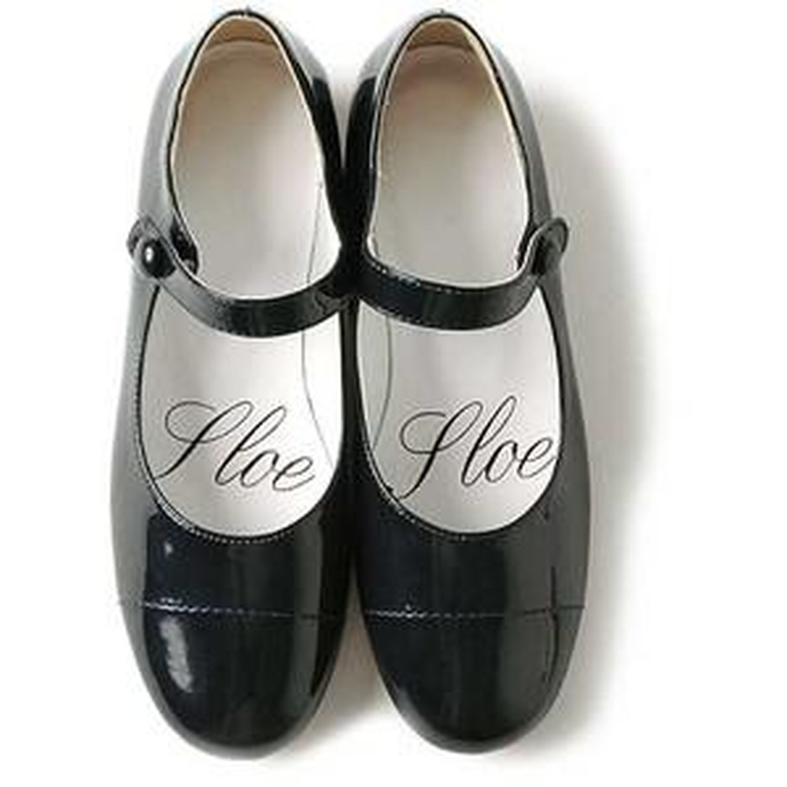

# Text-Conditioned Outfit Recommendation With Hybrid Attention Layer

**URL**: https://www.semanticscholar.org/paper/40e20b40ef3e7afb21b49e0ef782113a0c5b5d77
**作者**: Xin Wang; Yueqi Zhong
**引用次数**: 3
使用模型: deepseek-v3-1-terminus

## 1. 核心思想总结
这是一份针对论文《Text-Conditioned Outfit Recommendation With Hybrid Attention Layer》的第一轮总结，按四个部分组织。

**1. Background (背景)**
*   本文的研究领域是基于文本描述的整套穿搭推荐。该任务的目标是推荐一套既满足内部单品间兼容性，又符合用户给定的文本条件（如“热带天堂假期”或“60年代风格”）的完整时尚穿搭。
*   使用文本描述作为条件，为用户提供了一种灵活且精确的检索和推荐时尚单品的方式，但现有研究对此问题探索不足。

**2. Problem (问题)**
*   该任务面临的一个核心挑战是如何有效地编码并融合两种信息：1) 代表整体风格的**套装文本描述**，以及2) 代表具体单品的**时尚物品图像和文本信息**。
*   模型需要同时保证推荐单品之间的**内部兼容性** 以及与文本条件的**条件符合度**。

**3. Method (高层次方法)**
*   本文提出一个新颖的框架，其核心是一个**混合注意力层**。该层同时建模两种关系：1) 套装文本描述与时尚单品之间的关系（用于确保条件符合度）；2) 时尚单品相互之间的关系（用于确保内部兼容性）。
*   为了高效编码单品特征，该方法采用预训练的**FashionCLIP模型**作为特征提取器，与从零开始训练CNN的方法相比，大幅减少了可训练参数量。
*   整体穿搭的生成过程是**迭代式**的：基于一个给定的不完整初始套装，逐步添加兼容的单品来构建完整穿搭。

**4. Contribution (贡献)**
*   **模型创新**：提出了一个包含混合注意力层的框架，专门用于解决文本条件下的穿搭推荐问题，能同时处理兼容性和条件符合度。
*   **性能优势**：在Polyvore数据集上的实验表明，该方法在多项关键指标上均显著优于现有先进方法，包括**兼容性预测AUC**（相对提升3%）、**填空准确率**（相对提升5%）和**互补物品检索召回率**（平均相对提升19%）。
*   **有效性验证**：通过实验证明了该方法能够成功推荐出既具备内部兼容性，又贴合文本描述的完整穿搭。

## 2. 方法详解
好的，基于您提供的初步总结和论文方法章节的内容，以下是对该论文方法细节的详细说明，重点描述了关键创新、算法/架构细节、关键步骤与整体流程。

### 论文方法细节详解

该方法的核心目标是解决**文本条件下的整套穿搭推荐**问题，即推荐一套既满足单品间**内部兼容性**，又符合用户提供的**文本描述**（如“商务会议”）的完整穿搭。

#### 一、 关键创新

1.  **混合注意力层：** 这是本文最核心的创新点。传统方法可能只关注单品间的兼容性，而本文提出的混合注意力层**同时、协同地建模两种关键关系**：
    *   **条件注意力：** 专注于每个时尚单品与给定文本描述之间的相关性，确保推荐的单品符合用户指定的风格或场景。
    *   **兼容性注意力：** 专注于套装内所有单品之间的两两兼容性，确保推荐的单品搭配和谐。
    该层不是简单地将两种信息拼接，而是通过注意力机制让它们动态地相互作用，例如，一个单品的兼容性判断会受到文本条件的影响（比如，对于“海滩度假”的文本，拖鞋和西装短裤的兼容性权重会与“商务会议”下的权重截然不同）。

2.  **高效的FashionCLIP特征提取：** 该方法没有选择从零开始训练卷积神经网络来提取图像特征，而是利用了一个强大的预训练模型——**FashionCLIP**。FashionCLIP是一个在庞大时尚数据上训练的模型，能够将图像和文本映射到同一个共享的语义空间中。这使得模型可以直接获得高质量的、与文本对齐的单品特征表示，**极大地减少了需要训练的参数数量**，提高了模型的训练效率和泛化能力。

3.  **迭代式穿搭生成流程：** 整个推荐过程是**自回归的**。模型从一个“不完整的穿搭”开始（例如，用户先选定了一件上衣），然后逐步、迭代地推荐下一个兼容的单品（如下装、鞋子等），直到形成一套完整的穿搭。这个过程更符合用户实际的购物或搭配习惯。

#### 二、 算法/架构细节

整个模型的架构可以清晰地分为三个主要阶段，其整体流程如下图所示：

**阶段一：特征提取与编码**

1.  **单品特征编码：**
    *   **输入：** 每个单品（如上衣、裤子）有其**图像**和**文本描述**（如标题、属性）。
    *   **处理：** 分别使用FashionCLIP的**图像编码器**和**文本编码器**进行处理。这两个编码器将图像和文本投影到同一个高维语义空间。
    *   **输出：** 生成一个融合的、密集的**单品特征向量**。论文中可能将图像和文本特征拼接或取平均后作为最终的单品表示。对于一套包含N个单品的（不完整）套装，我们得到一个特征集合 `{v1, v2, ..., vN}`。

2.  **套装文本条件编码：**
    *   **输入：** 用户提供的文本描述 `T`（如“热带天堂假期”）。
    *   **处理：** 首先通过一个可学习的嵌入层将文本中的每个词转换为词向量。然后，使用一个**Transformer编码器**来捕捉词语间的上下文关系，生成一个能够代表整体风格或场景的、上下文丰富的**条件特征向量** `c`。

**阶段二：混合注意力层**

这是模型的核心，其目的是为每个单品生成一个**上下文感知的特征表示**，该表示既包含了文本条件信息，也包含了与其他单品的兼容性信息。

1.  **条件注意力：**
    *   **目的：** 计算每个单品与文本条件 `c` 的相关性权重。
    *   **计算：** 使用注意力机制，将文本条件 `c` 作为Query，将所有单品特征 `{v_i}` 作为Key和Value。计算过程如下：
        *   `α_i^cond = softmax( c^T * W_c * v_i )`
        *   其中 `W_c` 是一个可学习的权重矩阵。`α_i^cond` 表示第i个单品与文本条件的相关度分数。
    *   **输出：** 根据权重 `α_i^cond` 对所有单品特征进行加权求和，得到一个“条件上下文向量”。

2.  **兼容性注意力：**
    *   **目的：** 计算套装内单品之间的两两兼容性权重。
    *   **计算：** 这类似于Transformer中的自注意力机制。每个单品特征 `v_i` 都作为Query，去与其他所有单品特征（包括自己）计算兼容度。
        *   `β_ij = softmax( (W_q * v_i)^T * (W_k * v_j) )`
        *   其中 `W_q` 和 `W_k` 是可学习的权重矩阵。`β_ij` 表示在搭配第i个单品时，第j个单品的重要程度。
    *   **输出：** 对于每个单品 `v_i`，根据权重 `β_ij` 对其他单品特征进行加权求和，得到一个“兼容性上下文向量”。

3.  **特征融合与更新：**
    *   将原始单品特征 `v_i`、其对应的条件上下文向量和兼容性上下文向量进行**拼接**。
    *   然后将拼接后的向量通过一个**前馈神经网络**，并可能加入残差连接和层归一化，最终输出更新后的、富含上下文信息的单品特征 `h_i`。

**阶段三：推荐与迭代生成**

1.  **候选单品匹配：**
    *   假设当前不完整套装的特征集合为 `{h1, h2, ..., hN}`，条件特征为 `c`。
    *   模型需要从整个商品库中挑选出下一个最合适的单品。对于候选单品 `v_j`，模型会计算一个匹配分数 `s_j`。这个分数通常是套装特征、条件特征和候选单品特征的函数，例如：
        *   `s_j = f( {h1, h2, ..., hN}, c, v_j )`
        *   函数 `f` 的具体形式可能包括再次使用注意力机制或简单的点积操作。

2.  **迭代选择：**
    *   模型选择匹配分数 `s_j` 最高的候选单品，将其加入到当前套装中。
    *   然后，流程跳转回**阶段一**，用更新后的（N+1个单品）套装重新提取特征，并再次通过混合注意力层，为下一轮推荐做准备。
    *   此过程循环进行，直到推荐出预定类别数量（如上衣、下装、鞋子、配饰）的全部单品，形成一套完整的穿搭。

#### 三、 关键步骤与整体流程总结

1.  **输入：** 一个不完整的初始套装（单品集合） + 一个文本条件描述。
2.  **特征编码：** 利用FashionCLIP编码单品，利用Transformer编码器编码文本条件。
3.  **混合注意力计算：** 将编码后的特征输入混合注意力层，分别计算条件注意力和兼容性注意力，并融合生成上下文感知的单品特征。
4.  **评分与选择：** 基于更新后的特征，为候选池中的单品计算匹配分数，并选择分数最高的单品加入套装。
5.  **迭代循环：** 重复步骤2-4，直到套装完整。
6.  **输出：** 最终推荐的一套完整的、既满足内部兼容性又符合文本条件的时尚穿搭。

通过这种设计，论文成功地将文本条件深度整合到了穿搭兼容性建模的过程中，实现了灵活而精准的个性化推荐。

## 3. 最终评述与分析
好的，基于前两轮提供的关于论文《Text-Conditioned Outfit Recommendation With Hybrid Attention Layer》的初步总结、方法详述以及结论部分的信息，现给出最终的综合评估如下：

### 最终综合评估

**1. Overall Summary (整体摘要)**
本文针对“文本条件下的整套穿搭推荐”这一新兴且具有挑战性的任务，提出了一个创新性的解决方案。该方案的核心是引入了一个**混合注意力层**，能够协同建模**单品与文本条件之间的相关性**以及**单品之间的内部兼容性**。通过利用预训练的**FashionCLIP模型**进行高效的特征提取，并结合**迭代式生成**的推荐流程，该框架成功实现了根据用户灵活的自然语言描述（如“海滩度假”），推荐出既风格统一又搭配和谐的完整时尚穿搭。实验结果表明，该方法在多个核心评价指标上显著超越了现有先进方法。

**2. Strengths (优势)**
*   **创新性模型架构**：提出的混合注意力层是本文的核心亮点，它并非简单拼接不同模态信息，而是通过注意力机制让文本条件动态地影响兼容性判断，实现了两种信息的深度、交互式融合，建模方式更为精细和有效。
*   **卓越的性能表现**：在公开基准数据集（Polyvore）上的实验证明了该方法的有效性。其在**兼容性预测**、**填空准确率**和**互补物品检索**等关键任务上均取得显著提升，特别是互补物品检索的召回率平均相对提升达19%，具有很强的说服力。
*   **高效且实用的工程设计**：采用预训练的FashionCLIP模型，避免了从零训练大型CNN的开销，大幅减少了可训练参数量，提高了模型的训练效率和可行性。迭代式的生成过程也更符合用户实际搭配习惯，增强了方法的实用价值。
*   **任务定位精准**：成功抓住了现有研究中对“文本作为灵活条件”这一需求探索不足的空白，将自然语言理解的灵活性引入到穿搭推荐中，提升了系统的个性化和易用性。

**3. Weaknesses / Limitations (弱点/局限性)**
*   **数据集依赖与泛化性**：模型的性能高度依赖于Polyvore数据集的质量和规模。该数据集可能无法涵盖所有可能的时尚风格、文化背景或新兴趋势，因此模型在迁移到其他平台或更广泛、更多元的数据时，泛化能力有待进一步验证。
*   **可解释性不足**：尽管混合注意力机制本身能提供一定的权重解释（如哪些单品与文本更相关），但对于最终推荐结果的生成逻辑，其可解释性仍然相对较弱。普通用户可能难以理解模型为何推荐某件单品而非另一件。
*   **静态推荐与动态用户偏好**：模型主要处理静态的、一次性的套装推荐，未能考虑用户的动态偏好、历史行为、实时上下文（如天气、地点）或对推荐结果的反馈进行实时调整。
*   **计算复杂度**：迭代式的生成过程虽然符合直觉，但需要多次调用模型进行推理，相比于一次性生成所有单品的方法，在推荐效率上可能存在瓶颈，尤其是在面对大规模商品库时。

**4. Potential Applications / Implications (潜在应用/影响)**
*   **电子商务与个性化零售**：可集成到在线时尚电商平台，为用户提供基于自然语言搜索的智能穿搭推荐服务，显著提升购物体验和转化率。例如，用户可以直接搜索“适合年终派对的亮眼穿搭”来获取个性化推荐。
*   **虚拟衣柜与个人造型助手**：应用于个人虚拟衣柜管理App，帮助用户根据特定场合（如“周一商务会议”、“周末野餐”）智能搭配已有的衣物，促进可持续时尚。
*   **时尚设计灵感生成**：为时尚设计师和爱好者提供灵感工具，通过输入抽象的风格概念（如“赛博朋克未来感”、“复古学院风”）来生成配套的穿搭方案。
*   **研究方向启发**：本研究为多模态（视觉-文本）交互推荐系统提供了有价值的范式。其核心思想——使用混合注意力协同建模外部条件与内部关系——可启发其他领域的推荐任务，如文景匹配的旅游路线推荐、条件式室内设计等。未来的工作可以在此基础上，融入用户画像、知识图谱等信息，进一步深化个性化程度。

---
**结论**：总体而言，该论文是一项扎实且具有创新性的工作。它针对一个明确的技术问题，提出了一个新颖、有效且高效的解决方案，并通过充分的实验验证了其优越性。尽管存在一些常见的局限性，但其在方法上的创新性和明确的实用价值，使其对学术研究和工业应用都具有重要的贡献和潜力。

---

# 附录：论文图片

## 图 1

## 图 2

## 图 3

## 图 4

## 图 5

## 图 6

## 图 7

## 图 8

## 图 9

## 图 10

