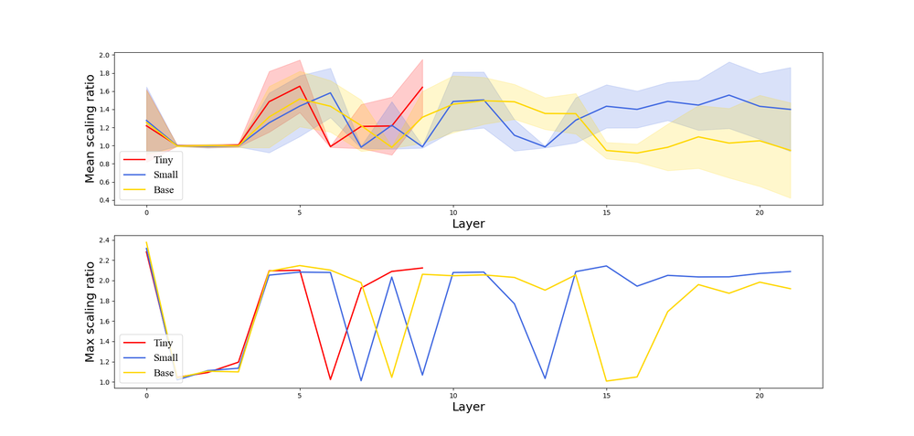
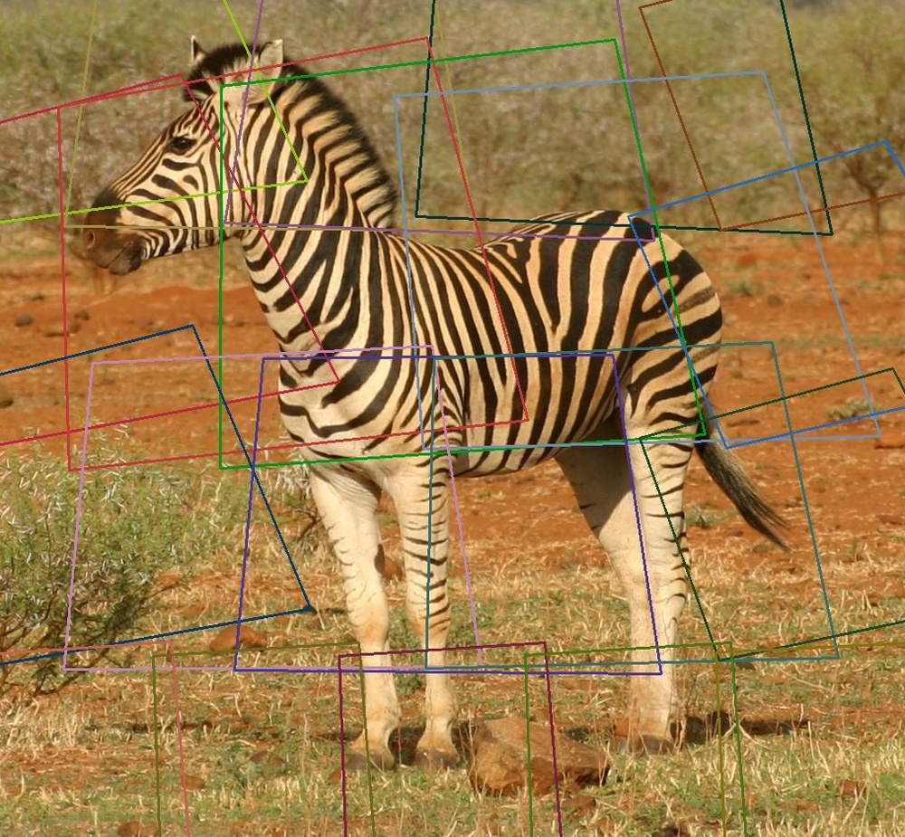
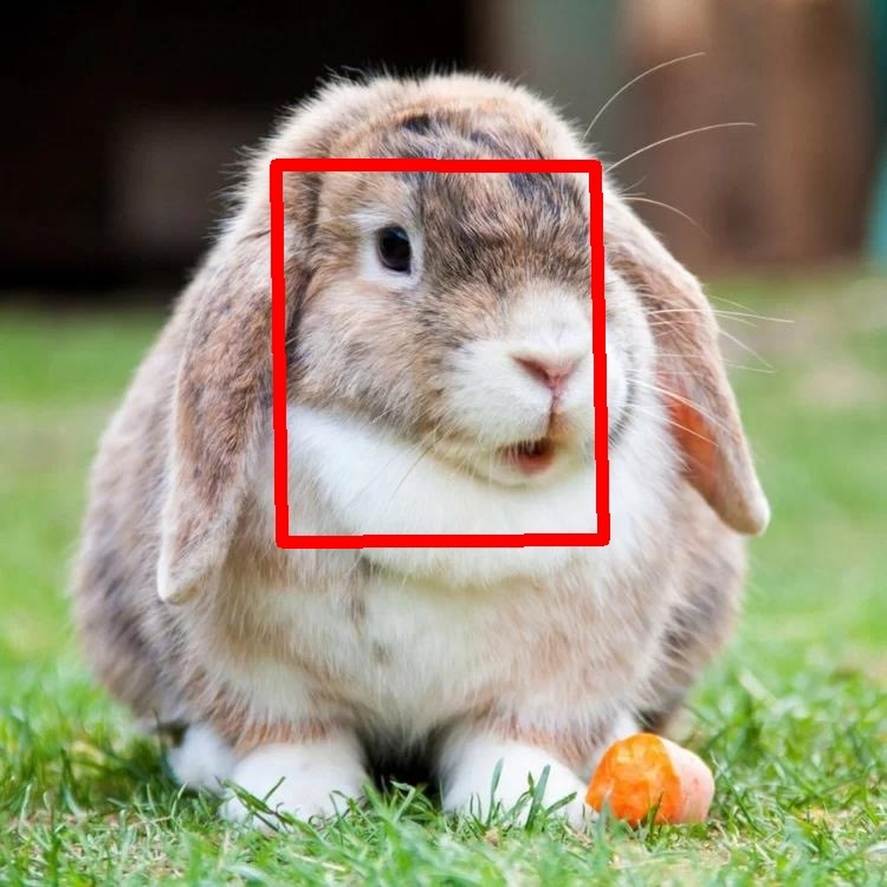
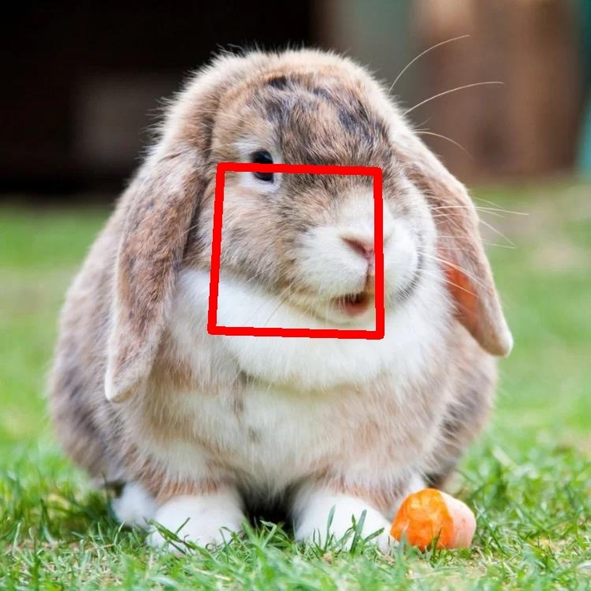
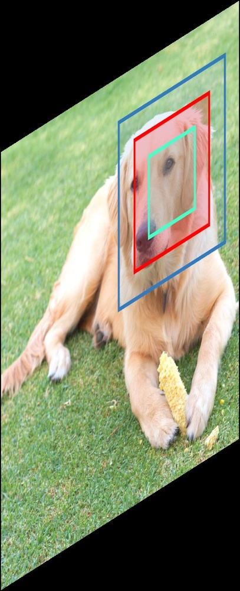

# Vision Transformer with Quadrangle Attention

**ArXiv ID**: 2303.15105v1
**URL**: http://arxiv.org/abs/2303.15105v1
**提交日期**: 2023-03-27
**作者**: Qiming Zhang; Jing Zhang; Yufei Xu; Dacheng Tao
**引用次数**: NULL
使用模型: deepseek-v3-1-terminus

## 1. 核心思想总结
好的，这是一份根据您提供的论文标题、摘要和引言内容整理的简洁第一轮总结。

**论文标题：** Vision Transformer with Quadrangle Attention

**第一轮总结**

*   **Background (背景):**
    基于窗口的自注意力机制因其在视觉Transformer中表现出的优异性能、较低的计算复杂度和内存占用而广受欢迎。然而，现有的窗口通常是手工设计、固定不变的。

*   **Problem (问题):**
    这种与数据无关的手工设计窗口，限制了Transformer模型适应不同尺寸、形状和方向的目标物体的灵活性。固定的窗口难以有效建模现实视觉场景中物体的多样性。

*   **Method (方法 - 高层概述):**
    本文提出了一种新颖的**四边形注意力** 方法。该方法的核心是一个端到端可学习的四边形回归模块，该模块能够预测一个变换矩阵，将默认的方形窗口转换为任意形状的四边形区域，用于后续的令牌采样和注意力计算。通过这种方式，模型可以动态地调整注意力区域，以适应不同目标的几何特性。作者将此法集成到视觉Transformer中，构建了名为**QFormer**的新架构。

*   **Contribution (贡献):**
    1.  提出了**四边形注意力**，将窗口注意力推广到更通用的四边形形式，使模型能自适应地关注不同形状和方向的目标。
    2.  构建了**QFormer**模型，该模型仅需少量代码修改，且引入的额外计算成本可忽略不计。
    3.  在多个公开基准数据集上的实验表明，QFormer在图像分类、目标检测、语义分割和姿态估计等多项视觉任务上均优于现有代表性视觉Transformer模型。

## 2. 方法详解
好的，基于您提供的初步总结和论文方法章节的内容，以下是对该论文方法细节的详细说明。

### 论文方法详细说明

#### 1. 核心思想与关键创新

**核心思想：** 将视觉Transformer中传统的、固定大小的方形窗口注意力，升级为**动态可变形、任意形状的四边形注意力**。这使得模型能够根据输入图像内容，自适应地调整注意力区域的范围、形状和方向，从而更精准地聚焦于不规则或倾斜的物体。

**关键创新：** 主要创新点是一个轻量级的、端到端可学习的**四边形回归模块**。该模块的核心任务是预测一个**仿射变换矩阵**，这个矩阵能够将预设的规则方形窗口“扭曲”成一个任意四边形。这个动态生成的四边形区域，而非固定的方形窗口，被用作后续计算自注意力的基础。

#### 2. 整体流程与架构

该方法的整体流程可以概括为以下几个关键步骤，其核心架构（QFormer Block）如下图所示：

```
+-------------------------------------+
|          输入特征图 (H, W, C)        |
+-------------------------------------+
                   |
         +---------v---------+
         | 标准自注意力或前馈网络   |  // 例如，用于生成查询Q
         +---------+---------+
                   |
         +---------v---------+
         |  四边形回归模块      |  // 核心创新：预测仿射变换矩阵θ
         +---------+---------+
                   |
         +---------v---------+
         | 可变形令牌采样器     |  // 根据θ对四边形区域内的令牌进行采样
         +---------+---------+
                   |
         +---------v---------+
         |  四边形自注意力      |  // 在采样的不规则令牌上计算注意力
         +---------+---------+
                   |
+-------------------------------------+
|          输出特征图 (H, W, C)        |
+-------------------------------------+
```

**流程详解：**

1.  **输入处理：** 将输入图像分割成令牌（Patches），并经过线性投影和位置编码后，形成特征图 `X`（尺寸为 H × W × C）。
2.  **查询生成：** 对于特征图中的每一个空间位置（即每一个令牌），通过一个标准的线性层或一个小型网络生成其对应的**查询向量**。
3.  **四边形回归：** 将每个查询向量输入到**四边形回归模块**中。该模块通常由一个小型多层感知机实现，其输出是一个6维向量，代表一个**仿射变换矩阵 θ** 的6个参数（排除了平移等固定参数）。这个矩阵 θ 定义了如何将一个单位正方形（即默认窗口）变换到目标四边形。
4.  **可变形令牌采样：** 利用预测出的变换矩阵 θ，对默认方形窗口内的网格点进行坐标变换，得到目标四边形区域内的采样点坐标。由于这些坐标通常是浮点数，需要通过**双线性插值**从原始特征图 `X` 中采样出对应的特征值。这些采样到的特征构成了当前查询令牌的**上下文令牌集合**。
5.  **四边形自注意力计算：** 将查询令牌的特征与采样得到的上下文令牌的特征（作为键和值）一起，计算标准的**多头自注意力**。这样，每个令牌的注意力计算都基于一个为其“量身定制”的四边形区域。

#### 3. 关键步骤与算法细节

**a. 四边形回归模块**

*   **输入：** 每个查询令牌对应的特征向量。
*   **输出：** 一个仿射变换矩阵 θ 的参数。仿射变换可以表示如下，其中 (x, y) 是原始方形窗口内的归一化坐标，(x', y') 是变换后四边形内的坐标：
    ```
    [x']   [θ11 θ12 θ13] [x]
    [y'] = [θ21 θ22 θ23] [y]
    [1 ]   [0   0   1  ] [1]
    ```
*   **实现：** 通常是一个简单的MLP（例如，两层全连接层，中间包含激活函数如GELU）。回归模块的参数在所有空间位置和注意力头之间**共享**，以保持轻量性。为了防止训练初期梯度不稳定，通常会对输出的变换矩阵施加约束，例如限制其行列式接近1，以避免极端缩放。

**b. 可变形令牌采样器**

*   **采样网格生成：** 首先，在默认的方形窗口内定义一个规则的采样网格（例如，对于7x7的窗口，有49个点）。然后，使用预测的变换矩阵 θ 对这个网格中的每个点进行变换，得到目标四边形区域内的浮点坐标。
*   **双线性插值：** 由于变换后的坐标是连续的，无法直接对应到特征图的离散像素位置。因此，需要利用双线性插值从原始特征图的四个最近邻点计算该位置的特征值。这个过程是可微分的，允许梯度通过采样坐标回传到四边形回归模块，从而实现端到端训练。

**c. 与现有方法的区别**

*   **与Deformable Attention的区别：** 经典的Deformable DETR中的可变形注意力为每个查询预测一组**偏移量**，直接对参考点进行平移。而四边形注意力预测的是一个**完整的仿射变换矩阵**，这不仅包含了平移，还包含了**旋转、缩放和错切**，因此能建模更复杂的几何变换，形成任意方向的平行四边形区域，表达能力更强。
*   **与Swin Transformer等固定窗口的区别：** Swin Transformer的窗口是固定的、与内容无关的方形。QFormer的窗口是动态的、与内容相关的四边形，能更好地适应物体形状。

#### 4. 优势总结

1.  **几何适应性：** 能够适应不同尺寸、长宽比、方向的物体，对于处理自然场景中非规则物体尤为有效。
2.  **计算高效：** 四边形回归模块非常轻量，增加的参数量和计算量可以忽略不计。注意力计算的范围（即四边形内的令牌数量）与固定窗口方法（如Swin）保持一致，因此复杂度仍然是线性或二次方于图像尺寸，而非全局注意力。
3.  **即插即用：** 该方法可以作为一个通用模块，相对容易地集成到现有的基于窗口的视觉Transformer架构（如Swin, PVT）中，只需替换其核心的自注意力层即可，最小化代码改动。

综上所述，论文通过引入一个简单而强大的四边形回归机制，成功地将静态窗口注意力推广为动态四边形注意力，在不显著增加计算负担的前提下，显著提升了模型对视觉对象几何变化的建模能力。

## 3. 最终评述与分析
好的，这是结合了论文标题、摘要、引言、方法详述以及结论部分信息后，给出的最终综合评估。

### **关于《Vision Transformer with Quadrangle Attention》的最终综合评估**

#### 1) 总体摘要

本论文针对当前主流视觉Transformer中固定、刚性的方形窗口注意力机制灵活性不足的问题，提出了一种名为**四边形注意力**的创新性解决方案。该方法的核心是引入一个轻量级的、端到端可学习的**四边形回归模块**，该模块能够为每个查询令牌动态预测一个仿射变换矩阵，从而将标准的方形窗口转换为任意形状的**四边形注意力区域**。基于此，作者构建了名为**QFormer**的新模型。大量实验表明，QFormer在图像分类、目标检测、实例分割、语义分割和人体姿态估计等多种核心计算机视觉任务上，均取得了优于现有代表性ViT模型（如Swin Transformer和Deformable DETR）的性能，同时仅增加了可忽略不计的计算开销。这项工作将窗口注意力的概念从静态方形推广到了动态四边形，显著增强了对物体几何变换的建模能力。

#### 2) 优势

1.  **强大的几何适应性：** 这是最核心的优势。四边形注意力能够动态适应目标物体的尺寸、长宽比、方向和形状，尤其擅长处理自然场景中常见的非规则、拉长或倾斜的物体（如交通标志、躺倒的人体、工具等），克服了固定方形窗口的局限性。
2.  **卓越的性能提升：** 论文在多个公开基准数据集（如ImageNet、COCO、ADE20K）上进行了全面验证，结果表明QFormer在多项任务上均实现了显著的性能提升，证明了该方法的有效性和普适性。
3.  **高效性与轻量化：** 尽管引入了动态机制，但其核心的四边形回归模块设计得非常轻量（一个小型MLP），参数在所有空间位置和注意力头间共享。因此，该方法引入的额外计算成本和参数量微乎其微，保持了模型的高效性。
4.  **即插即用的模块化设计：** 四边形注意力可以被视为一个通用的构建模块，能够相对容易地集成到现有的基于窗口的ViT架构中（如替换Swin Transformer中的窗口注意力），只需少量代码修改，具有良好的可扩展性和易用性。
5.  **更强的表达能力：** 与仅预测偏移量的可变形注意力（Deformable Attention）相比，预测完整的仿射变换矩阵能够建模更复杂的几何变换（旋转、缩放、错切），从而形成更具表达力的平行四边形注意力区域。

#### 3) 弱点 / 局限性

1.  **训练稳定性与收敛性：** 论文的方法部分提到，在训练初期，回归模块预测的变换矩阵可能不稳定，导致梯度爆炸或难以收敛。作者通过施加约束（如限制变换矩阵的行列式）来缓解此问题，但这表明该方法对训练技巧和超参数可能比固定窗口方法更敏感。
2.  **理论保证的缺乏：** 该方法依赖于模型自主学习如何生成“最优”的四边形区域。虽然结果优异，但缺乏理论上的解释或保证，说明为何某个四边形区域对于特定任务是最佳的。其可解释性相对较弱。
3.  **对极端形状的泛化能力：** 虽然方法针对不规则形状设计，但论文中的实验主要基于常见的视觉任务和数据集。对于极其特殊或罕见的几何形状，其泛化能力仍需在更专有的数据集上进行验证。
4.  **潜在的过拟合风险：** 由于模型具有更强的拟合能力，在数据量较小或分布较为单一的任务上，可能存在过拟合的风险，需要更仔细的正则化或数据增强策略。
5.  **与最前沿模型的对比：** 尽管论文对比了Swin Transformer和Deformable DETR等代表性模型，但ViT领域发展迅速。其性能相较于同期或之后出现的其他更复杂的动态注意力或状态空间模型（如Mamba）的优劣，需要进一步的对比分析。

#### 4) 潜在应用 / 意义

1.  **应用前景：**
    *   **自动驾驶与遥感图像分析：** 非常适合处理场景中大量存在的、方向各异的物体，如不同角度和位置的车辆、建筑物、道路标志等。
    *   **医学图像处理：** 可用于分析具有不规则形状的医学目标，如肿瘤区域、器官切片、血管网络等，提升分割和检测的精度。
    *   **文档智能与场景文本识别：** 对检测和识别任意方向、透视变换后的文本区域具有天然优势。
    *   **工业质检与机器人视觉：** 有助于精准定位和检查具有特定朝向和形状的工业零件。

2.  **学术意义：**
    *   **范式推广：** 成功地将视觉注意力机制从“静态窗口”推向了“动态几何窗口”，为ViT架构的设计开辟了新的思路，证明了内容感知的几何自适应是提升模型性能的有效途径。
    *   **启发后续研究：** 这项工作可能会激励更多研究探索超越四边形（如更复杂的多边形或曲线边界）的动态注意力区域，或者将类似思想应用于视频理解（时空立方体注意力）、多模态学习等领域。
    *   **效率与性能的平衡：** 它再次证明了通过精巧的算法设计，可以在不显著增加计算负担的前提下，大幅提升模型性能，这对推动ViT在资源受限环境下的应用具有积极意义。

**总结而言，** 《Vision Transformer with Quadrangle Attention》是一篇高质量、创新性强的研究。它通过一个简洁而有力的核心思想，有效地解决了现有ViT模型的一个关键痛点，并在性能、效率和通用性之间取得了出色的平衡，具有重要的学术价值和广阔的应用潜力。


---

# 附录：论文图片

## 图 1


## 图 2


## 图 3


## 图 4


## 图 5


## 图 6


## 图 7


## 图 8


## 图 9


## 图 10


