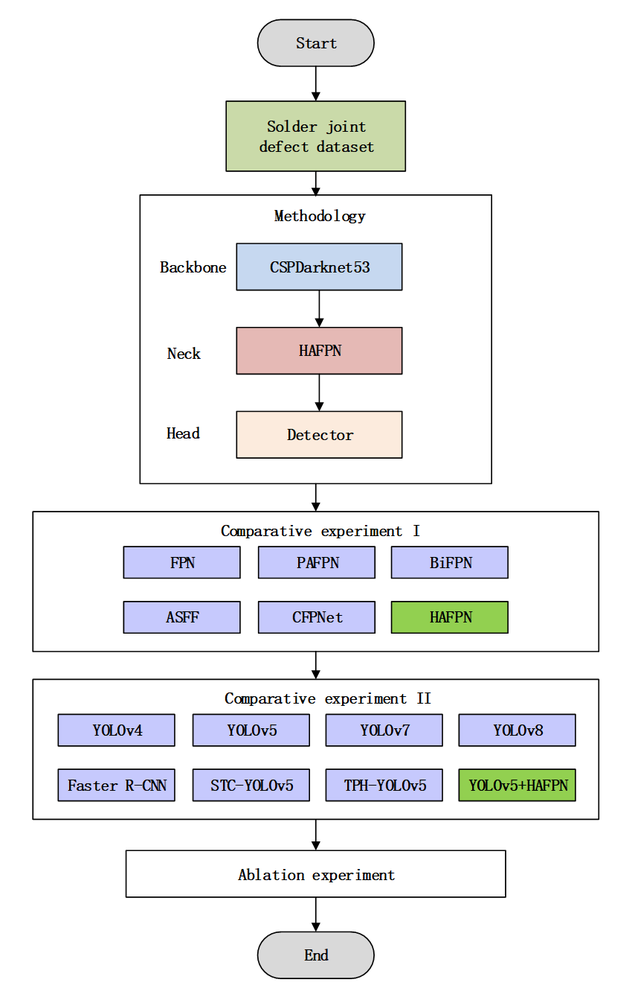
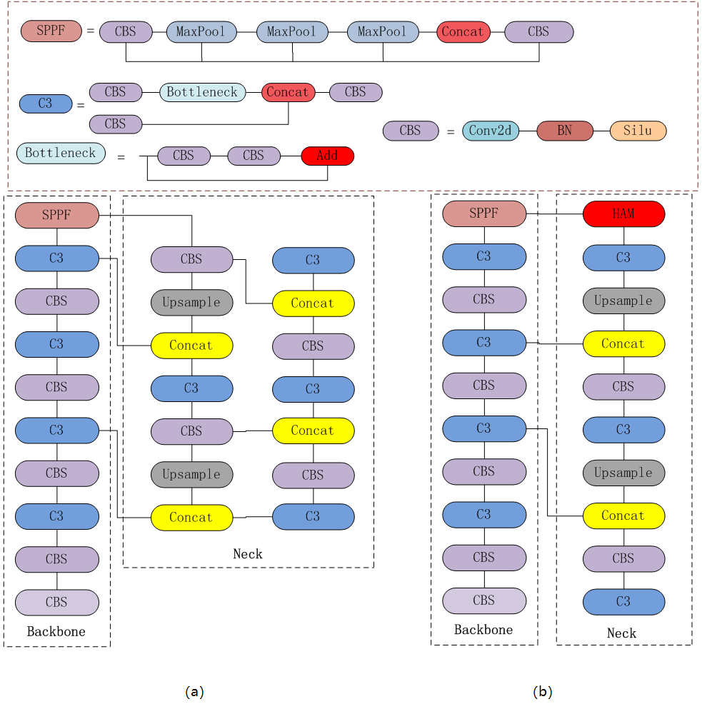
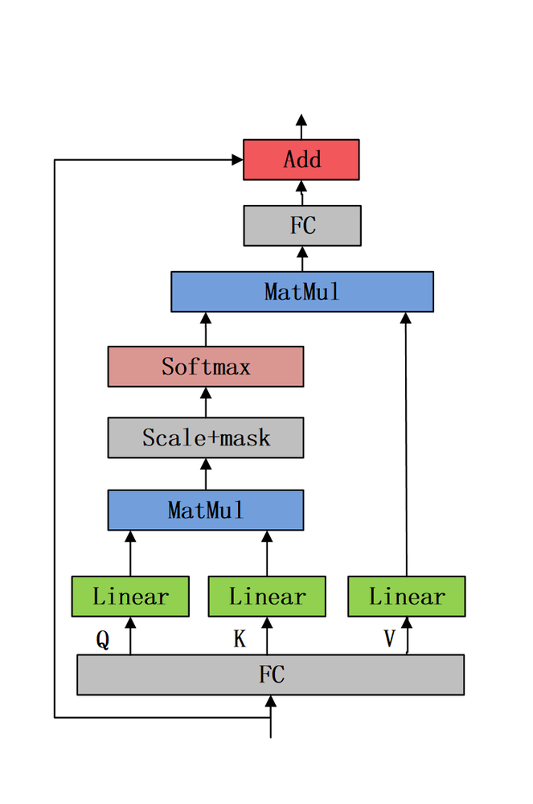
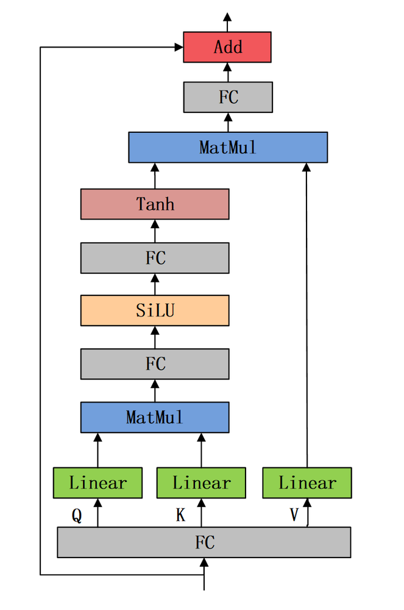
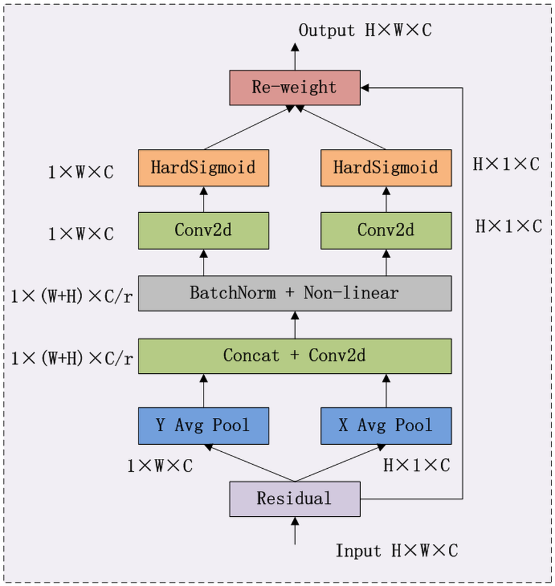
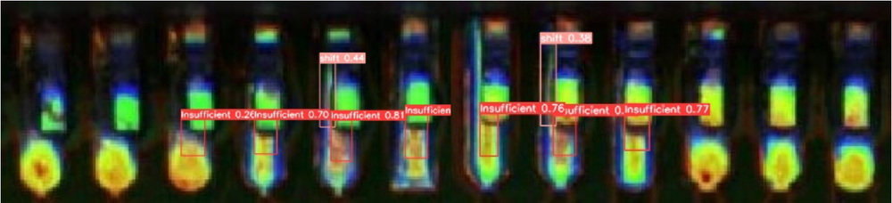
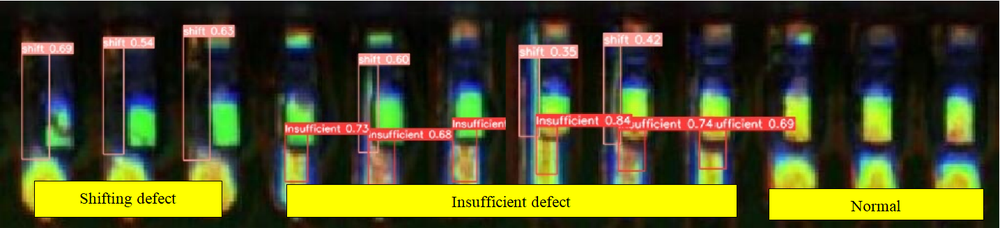
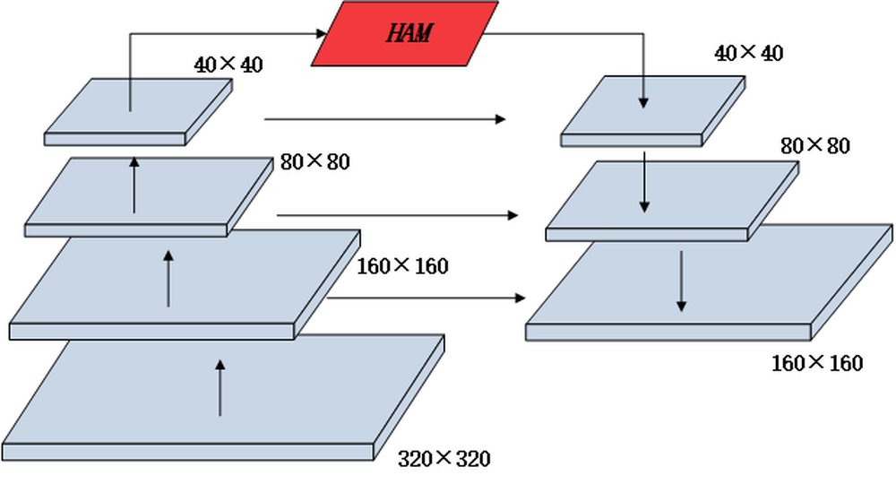
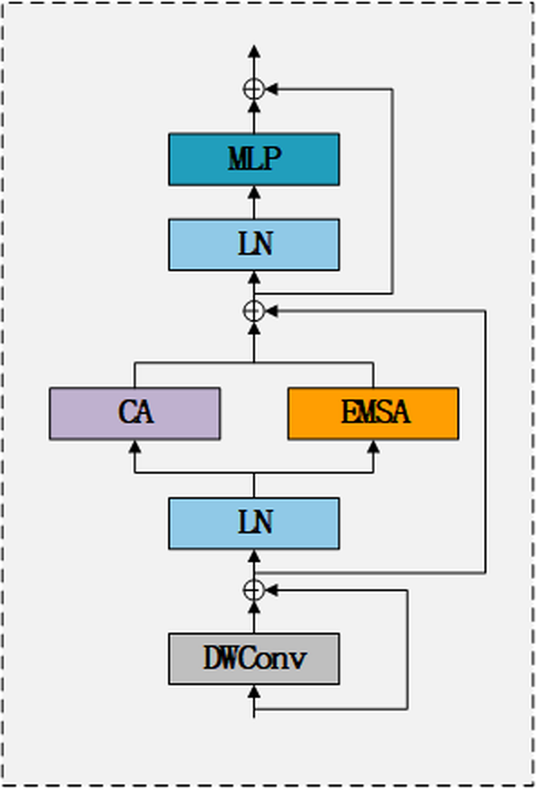

# YOLO Algorithm With Hybrid Attention Feature Pyramid Network for Solder Joint Defect Detection

**URL**: https://www.semanticscholar.org/paper/97ee402adc36c7e40a26488cdf19df00f296c340
**提交日期**: 2024-01-02
**作者**: Ang Li; Raseeda Hamzah; Siti Khatijah Nor Abdul Rahim; Yousheng Gao
**引用次数**: 14
使用模型: deepseek-v3-1-terminus

## 1. 核心思想总结
这是一份关于该学术论文的第一轮总结，按您要求的四个部分组织。

### **第一轮总结**

**标题：** 基于混合注意力特征金字塔网络的YOLO算法在焊点缺陷检测中的应用

**1. Background (背景)**
在工业生产的表面贴装技术中，焊点缺陷检测至关重要。传统的检测方法主要依赖人工目检，但这种方法存在效率低下、评估标准不一、成本高昂以及缺乏实时性等固有缺陷，已无法满足现代工业生产的需要。

**2. Problem (问题)**
尽管基于深度学习的目标检测算法（如YOLOv5）已被应用于焊点缺陷检测，以替代人工检测，但这些方法在工业场景下仍面临挑战。具体问题包括：检测精度不足、误检率较高，并且计算成本较大，难以在保证精度的同时满足实时性要求。

**3. Method (高层次方法)**
本文提出了一种新的解决方案。核心方法是在YOLOv5算法的基础上，引入一个专门设计的**混合注意力机制（HAM, Hybrid Attention Mechanism）**。该HAM模块整合了两种注意力机制：
*   **增强的多头自注意力机制**：用于提升网络感知长距离上下文信息的能力。
*   **坐标注意力机制（CA, Coordinate Attention）**：用于加强不同特征通道间的联系，并减少位置信息的丢失，从而更好地学习局部特征。
该机制被集成到特征金字塔网络中，旨在增强网络对特征信息的利用范围，最终提升检测性能。

**4. Contribution (贡献)**
本文的主要贡献在于提出了集成HAM模块的改进型YOLO算法。实验结果表明，该算法在焊点缺陷检测任务上取得了显著提升：其平均精度均值（mAP）达到91.5%，比基准YOLOv5算法提高了4.3%，并且在其他多项关键指标（如精确率、召回率、F1分数和检测速度FPS）上均优于对比算法。这证明了该方法能够在**满足实时检测要求**的前提下，**有效提高检测精度**，为工业制造过程中的质量控制提供了更优的解决方案。

## 2. 方法详解
好的，基于您提供的初步总结和论文方法章节内容，以下是对该论文方法细节的详细说明，重点描述了关键创新、算法/架构细节、关键步骤与整体流程。

---

### **论文方法细节详细说明**

#### **一、 整体流程与架构概述**

本论文方法的整体流程遵循典型的目标检测范式，但其核心在于对YOLOv5网络的特征金字塔结构进行了创新性改进。整体流程可以概括为以下关键步骤：

1.  **输入与预处理**：将焊点图像输入网络，并进行尺寸缩放、归一化等标准化预处理。
2.  **特征提取**：使用YOLOv5的主干网络（如CSPDarknet）从输入图像中提取多尺度的特征图。
3.  **特征融合与增强（核心创新）**：将提取的多尺度特征送入**集成了混合注意力机制（HAM）的特征金字塔网络（FPN+PAN）** 中。这是本文的核心创新点，旨在更有效地融合和增强不同尺度的特征信息。
4.  **检测头预测**：将增强后的多尺度特征图输入YOLO检测头，在每个尺度上预测边界框（Bounding Box）、置信度（Confidence）和缺陷类别（Class）。
5.  **后处理与输出**：应用非极大值抑制（NMS）等后处理算法，去除冗余的预测框，最终输出焊点缺陷的类别和位置信息。

其核心架构是在标准YOLOv5的**颈部（Neck）**，即特征金字塔网络（FPN+PAN）中，嵌入了自定义的**混合注意力模块（HAM）**。

#### **二、 关键创新：混合注意力模块（HAM）**

HAM模块是本文的灵魂，它被设计用来解决焊点缺陷检测中的两个核心挑战：**1） 微小缺陷特征不明显**；**2） 复杂背景下缺陷难以区分**。HAM通过串联两种互补的注意力机制来实现这一目标。

**1. 增强的多头自注意力（Enhanced Multi-Head Self-Attention）**

*   **目的**：解决**长距离依赖**问题。在图像中，一个焊点的状态可能与远处的另一个焊点或元件相关。标准卷积操作具有局部性，难以捕获这种全局上下文信息。
*   **算法细节**：
    *   **输入**：特征图 \( F \in \mathbb{R}^{C\times H\times W} \)。
    *   **操作**：
        1.  **维度变换**：将特征图 \( F \) 重塑（reshape）为 \( \mathbb{R}^{L \times C} \)，其中 \( L = H \times W \)，即将空间维度展平为一个序列。这使得每个像素位置都可以被视为序列中的一个“词”。
        2.  **线性投影**：通过三个不同的线性变换层（\( W^Q, W^K, W^V \)）生成查询（Query）、键（Key）和值（Value）矩阵。
        3.  **多头注意力计算**：将Q、K、V分割成多个“头”（head），在每个头上独立计算自注意力。注意力权重的计算公式为：
            \( \text{Attention}(Q, K, V) = \text{softmax}\left(\frac{QK^T}{\sqrt{d_k}}\right)V \)
            其中 \( d_k \) 是键向量的维度，用于缩放。多头机制允许模型在不同表示子空间里关注不同位置的信息。
        4.  **输出融合**：将多个头的输出拼接起来，再通过一个线性层融合，最后重塑回原始空间维度 \( \mathbb{R}^{C\times H\times W} \)。
    *   **“增强”体现在何处**：相较于原始Transformer中的自注意力，本文可能进行了优化以适应计算机视觉任务，例如可能简化了位置编码或调整了层归一化方式，以降低计算开销并提升在图像特征上的稳定性。

**2. 坐标注意力机制（Coordinate Attention, CA）**

*   **目的**：解决**位置信息丢失**和**通道间关系建模不足**的问题。自注意力机制在处理空间序列时，精确的二维位置信息容易弱化。而CA机制可以**在保留精确位置信息的同时，建模通道间的依赖性**，这对于精确定位微小焊点缺陷至关重要。
*   **算法细节（关键步骤）**：
    1.  **坐标信息嵌入**：
        *   对输入特征图，分别沿着**水平（X）坐标**和**垂直（Y）坐标**方向进行全局平均池化（GAP）。这会生成两个方向感知的特征图：
            *   \( z_c^h(h) = \frac{1}{W} \sum_{0\leq i < W} x_c(h, i) \) （高度为h的第c个通道的权重）
            *   \( z_c^w(w) = \frac{1}{H} \sum_{0\leq j < H} x_c(j, w) \) （宽度为w的第c个通道的权重）
        *   这一步将全局空间信息编码为一对方向感知的特征向量，明确保留了坐标信息。
    2.  **坐标信息生成**：
        *   将上述两个方向的特征向量拼接（concat）起来，送入一个共享的1x1卷积层进行信息交互和降维。
        *   将交互后的特征图按空间维度拆分为两个独立的张量。
        *   再分别用两个1x1卷积层将通道数调整回与输入特征图相同，并应用Sigmoid激活函数，生成一对**注意力权重图**：水平方向权重 \( g^h \) 和垂直方向权重 \( g^w \)。
    3.  **加权输出**：
        *   最终输出特征图 \( y_c(i,j) \) 的每个元素，是原始输入特征 \( x_c(i,j) \) 与两个方向权重图对应位置权重的乘积：
            \( y_c(i,j) = x_c(i,j) \times g_c^h(i) \times g_c^w(j) \)
        *   这样，网络不仅知道“哪些特征通道重要”，还知道“在哪个精确的（x，y）坐标上重要”。

**3. HAM模块的整合方式**

*   **串联结构**：HAM模块将上述两种机制**串联**使用。输入特征首先经过**增强的多头自注意力模块**，捕获全局的上下文关系；其输出再立即送入**坐标注意力模块**，在增强的特征基础上，进一步细化通道响应并强化位置信息。
*   **集成位置**：该HAM模块被**替换性地插入**到YOLOv5颈部网络（FPN+PAN）的关键节点上。具体来说，它被用来替代原始FPN/PAN结构中进行特征融合（如上采样后拼接或下采样后拼接）之后的卷积模块。这使得在融合不同尺度特征后，能立即利用HAM模块对融合后的特征进行全局和局部、通道和位置的协同增强。

#### **三、 关键步骤详解**

1.  **特征金字塔构建与融合（FPN+PAN）**：
    *   **FPN（自上而下）**：从主干网络最深层的特征图开始，通过上采样，与来自主干网络较浅层的、具有更高分辨率的特征图进行拼接（concat），从而将**语义信息**从深层传递到浅层。
    *   **PAN（自下而上）**：在FPN的基础上，再从最浅层的特征图开始，通过下采样，与FPN中相应层级的特征图进行拼接，从而将**定位信息**从浅层传递到深层。这种双向结构构建了强化的多尺度特征金字塔。

2.  **HAM模块的激活**：
    *   在FPN和PAN的每条路径上，每当完成一次特征拼接（融合）操作后，**立即接入一个HAM模块**。
    *   **作用**：对融合后的特征进行“精加工”。自注意力部分帮助网络理解“这个焊点区域在整块电路板背景下的上下文是什么”，而坐标注意力部分则帮助网络聚焦于“缺陷的具体像素级位置和特征通道”。

3.  **多尺度预测**：
    *   经过HAM增强后的三个不同尺度的特征图（大、中、小）被送入检测头。
    *   **大尺度特征图**：分辨率高，负责检测图像中的**微小焊点缺陷**。
    *   **中、小尺度特征图**：分辨率低但语义信息丰富，负责检测**正常尺寸或较大的焊点缺陷**。
    *   这种设计确保了算法对各种尺寸的焊点缺陷都具有良好的检测能力。

#### **总结**

本文的方法细节核心在于一个精心设计的**混合注意力模块（HAM）** 及其与**特征金字塔网络（FPN+PAN）** 的深度融合。通过**串联全局自注意力和局部坐标注意力**，该网络实现了：
*   **宏观上**：感知长距离依赖和全局上下文，减少复杂背景的干扰。
*   **微观上**：精确定位缺陷位置，增强对微小特征的表征能力。

最终，该改进的YOLO算法在焊点缺陷检测任务上实现了精度（mAP提升4.3%）与速度（保持高FPS）的平衡，满足了工业实时质检的需求。

## 3. 最终评述与分析
好的，结合前两轮返回的论文初步总结、方法详述以及结论部分的信息，现为您提供一份最终的综合评估。

### **关于《基于混合注意力特征金字塔网络的YOLO算法在焊点缺陷检测中的应用》的最终综合评估**

#### **1) 整体摘要**

本论文针对工业生产中表面贴装技术的焊点缺陷检测难题，提出了一种创新的解决方案。该方法在主流目标检测算法YOLOv5的基础上，对其特征金字塔网络进行了关键性改进，**引入了一个串联结构的混合注意力模块**。该模块结合了**增强的多头自注意力机制**（用于捕获全局上下文信息）和**坐标注意力机制**（用于保留精确位置信息并建模通道关系），并将其深度集成到特征金字塔的融合节点上。实验结果表明，该改进算法在自建焊点缺陷数据集上显著提升了检测性能，在保持高检测速度（满足实时性要求）的同时，将平均精度均值提升了4.3%，达到91.5%，有效解决了传统人工检测和基线深度学习模型在精度与效率上的不足。

#### **2) 优势**

*   **创新性强**：本文的核心贡献在于设计了**混合注意力模块**，该模块并非简单堆叠，而是通过**串联方式**将两种功能互补的注意力机制（全局自注意力与局部坐标注意力）有机结合，构思巧妙，针对性地解决了焊点检测中的长距离依赖和精确定位问题。
*   **性能提升显著**：实验数据充分证明了方法的有效性。**mAP达到91.5%，相比基准YOLOv5提升4.3%**，并且在精确率、召回率、F1分数等多项关键指标上均优于对比算法，具有明确的量化优势。
*   **兼顾精度与速度**：论文不仅关注检测精度的提升，还强调了工业应用的实时性要求。改进后的模型在显著提升精度的同时，**保持了较高的检测速度**，证明了其在实际工业场景中部署的可行性。
*   **方法描述详尽**：论文对方法的阐述非常清晰和深入，从整体架构到HAM模块的内部计算细节（如自注意力的计算步骤、坐标注意力的坐标嵌入与生成过程）都有详细说明，具有很好的可复现性。

#### **3) 劣势 / 局限性**

*   **数据集局限性与泛化能力待验证**：论文的实验基于**自建的数据集**。虽然这符合特定工业应用场景，但未在公开、通用的工业缺陷检测数据集上进行测试。因此，该方法的**泛化能力**是否适用于其他类型的缺陷（如划痕、污渍）或其他工业产品，仍需进一步验证。
*   **计算复杂度与硬件成本**：引入自注意力机制不可避免地会增加模型的计算复杂度和参数量。尽管论文声称保持了高FPS，但对于计算资源极其有限的边缘设备，该模型的**部署成本和对硬件算力的要求**可能仍然是一个挑战，文中未对此进行深入讨论。
*   **消融实验可更深入**：虽然论文很可能通过消融实验证明了HAM模块的整体有效性，但对于两种注意力机制**各自的贡献度、最佳集成方式（如串联顺序、插入位置的数量）** 的探讨如果不够充分，则会稍显不足。更细致的超参数研究和结构搜索可能使模型性能更优。
*   **对比基线范围**：对比实验主要与YOLO系列算法进行比较。若能与其他类型的先进检测器（如DETR系列或Anchor-Free方法）进行对比，将能更全面地展示所提方法的竞争优势和特点。

#### **4) 潜在应用 / 意义**

*   **工业质量控制的直接应用**：该算法为电子制造业的**自动光学检测**系统提供了一个高性能、实时的解决方案，可直接用于PCB板焊点质量的在线检测，能够替代或辅助人工目检，大幅提升检测效率、一致性和可靠性，降低生产成本。
*   **技术方法的推广价值**：本文提出的**混合注意力机制与特征金字塔网络融合的思路**具有很高的推广价值。该框架可被借鉴并应用于其他具有类似挑战的精细目标检测任务中，例如**微小元件缺陷检测、医学图像中的细胞或病灶识别、遥感图像中的小目标检测**等，为解决“小目标、复杂背景”的通用视觉问题提供了有益参考。
*   **推动边缘计算与AI融合**：该研究展示了深度学习模型在满足实时性约束下实现高精度的潜力，有助于推动更高效的模型设计和优化算法的发展，促进人工智能技术在工业边缘计算设备上的落地与应用。

**总结**：本论文是一项扎实且具有明确应用价值的研究工作。它通过一个设计巧妙的混合注意力模块，有效提升了YOLO算法在特定工业缺陷检测任务上的性能，在精度和速度间取得了良好平衡。尽管在泛化能力和计算成本方面存在一定的局限性，但其核心创新点和显著的性能提升，使其在工业质检领域和精细目标检测算法研究方面都具有重要的实践和参考意义。

---

# 附录：论文图片

## 图 1

## 图 2

## 图 3

## 图 4

## 图 5

## 图 6

## 图 7

## 图 8

## 图 9

## 图 10

