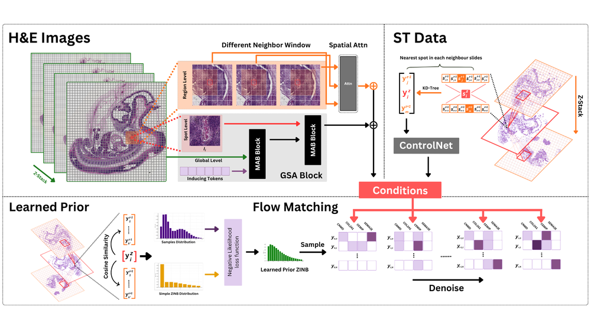
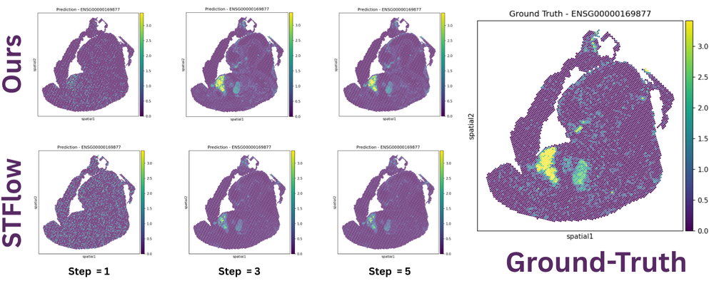
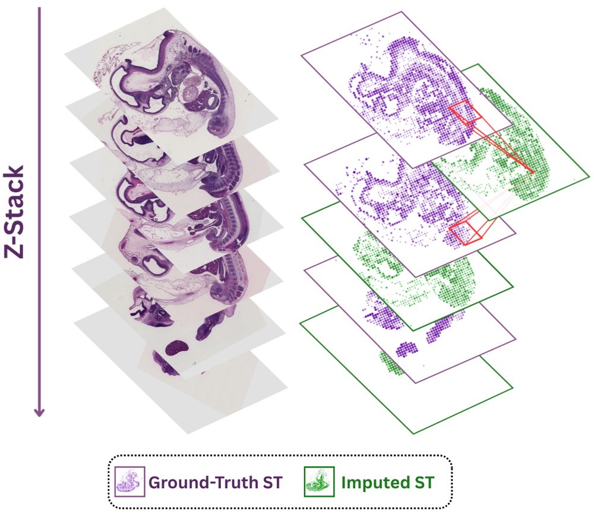
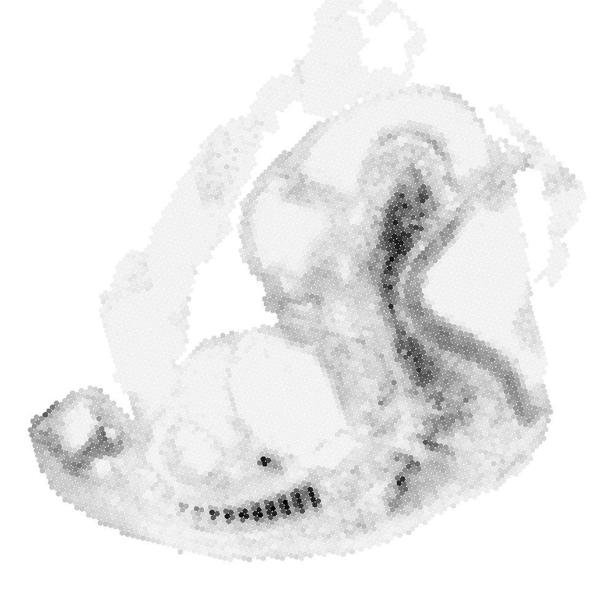
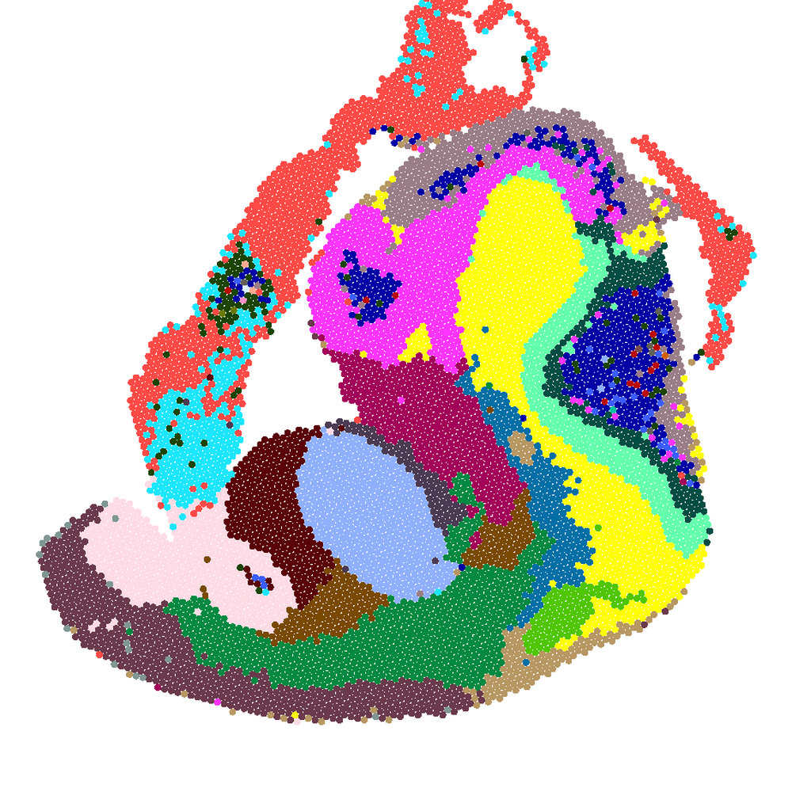
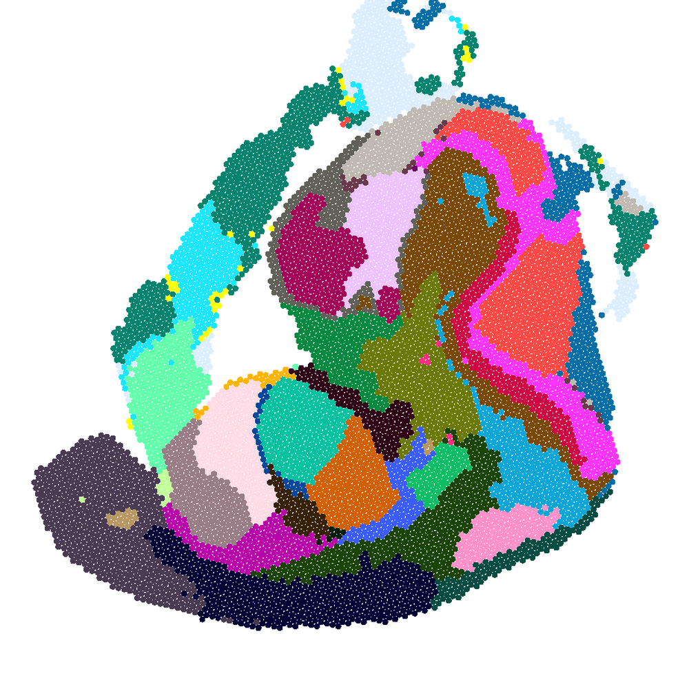
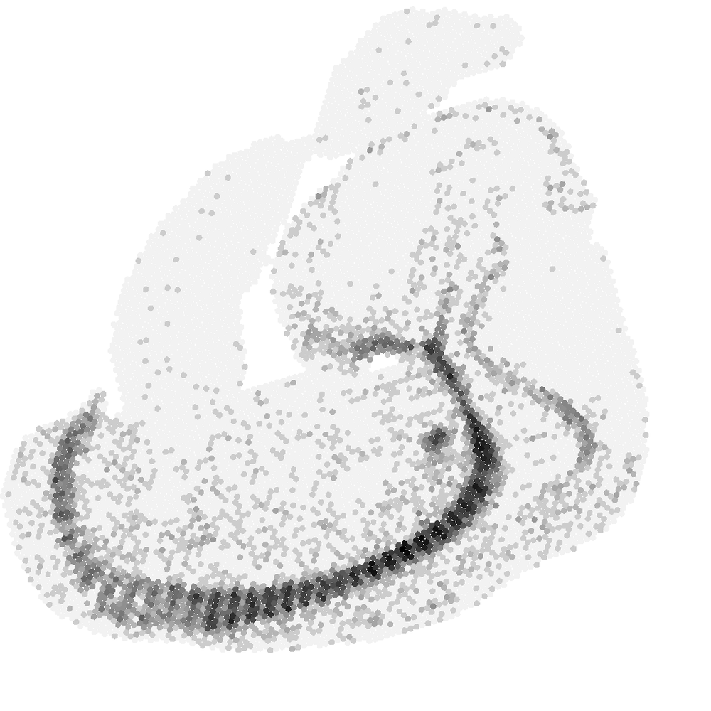
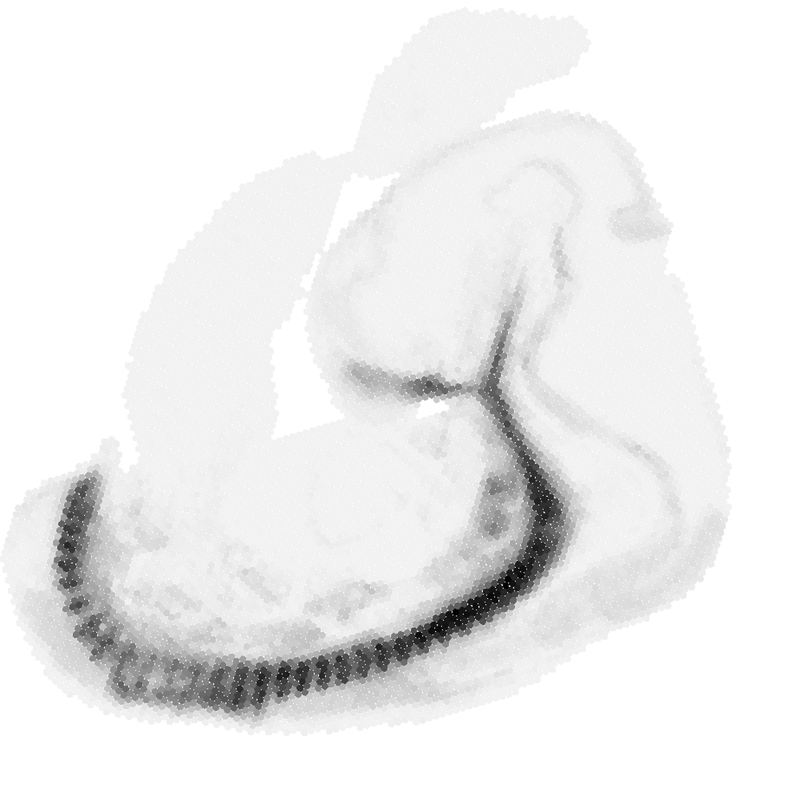
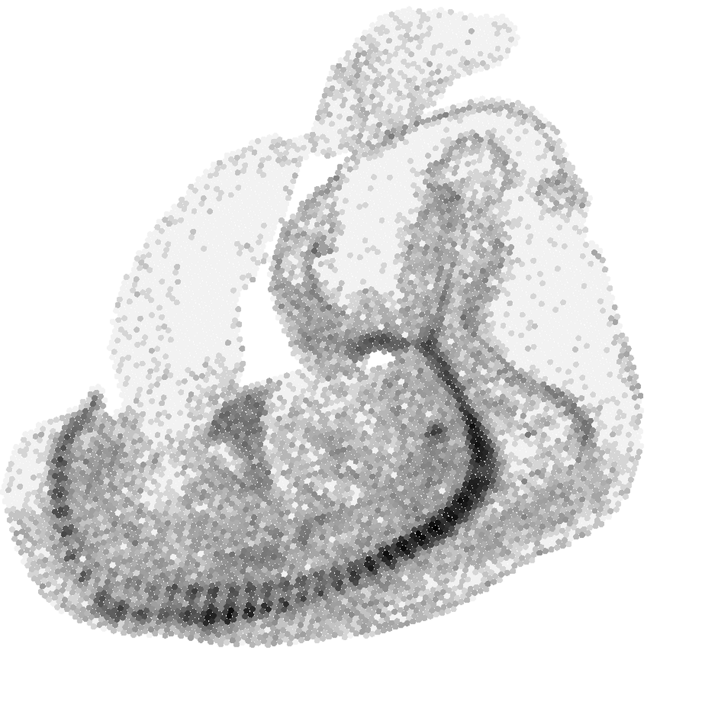
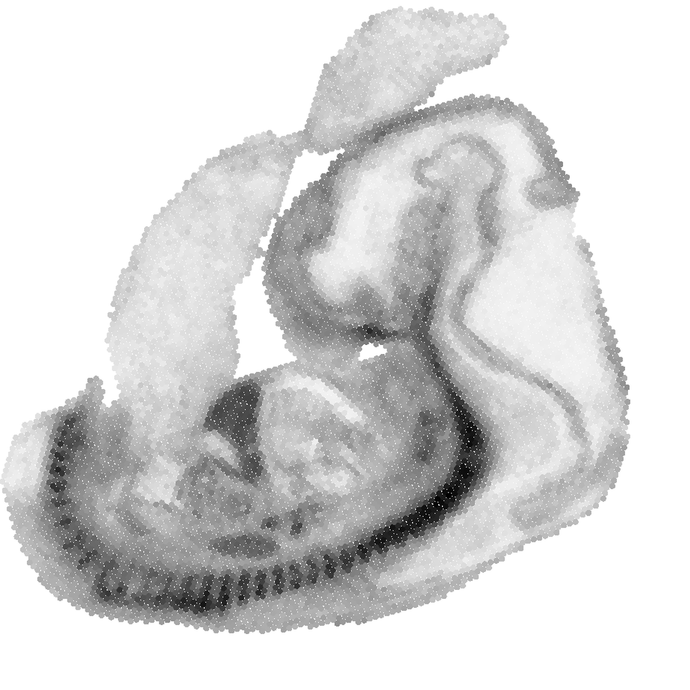

# 3D-Guided Scalable Flow Matching for Generating Volumetric Tissue Spatial Transcriptomics from Serial Histology

**ArXiv ID**: 2511.14613v1
**URL**: http://arxiv.org/abs/2511.14613v1
**提交日期**: 2025-11-18
**作者**: Mohammad Vali Sanian; Arshia Hemmat; Amirhossein Vahidi; Jonas Maaskola; Jimmy Tsz Hang Lee; Stanislaw Makarchuk; Yeliz Demirci; Nana-Jane Chipampe; Omer Bayraktar; Lassi Paavolainen; Mohammad Lotfollahi
**引用次数**: NULL
使用模型: ep-20251112215738-bz78g

## 1. 核心思想总结
这是一份基于您提供的标题和摘要，对论文《3D-Guided Scalable Flow Matching for Generating Volumetric Tissue Spatial Transcriptomics from Serial Histology》的第一轮总结。

**第一轮总结**

**1. Background (背景)**
可扩展且鲁棒的三维（3D）组织空间转录组学（Spatial Transcriptomics, ST）数据对于从整体上理解组织结构和揭示人类生物学及疾病的深层机制至关重要。从苏木精-伊红（H&E）染色的组织切片图像中预测基因表达，是一种获取ST数据的重要计算手段。

**2. Problem (问题)**
现有的预测方法存在明显局限：
*   **2D方法**：大多独立处理每个二维切片，忽略了组织本身的三维结构信息。
*   **3D方法**：现有的三维感知方法通常不具备生成能力，且计算可扩展性差，难以处理大规模3D数据集。

**3. Method (high-level) (方法 - 高层概述)**
本文提出了一种名为HoloTea的3D感知流匹配（flow-matching）框架。其核心思想是：
*   **3D上下文融合**：在共享特征空间中检索相邻切片上形态对应的点（spots），并将这种跨切片上下文信息通过一个轻量级的ControlNet进行融合，使生成过程遵循解剖结构的连续性。
*   **3D一致性先验**：为流匹配设计了一个结合了零膨胀负二项式（ZINB）先验和基于相邻切片的经验性空间先验的3D一致先验，以更好地拟合数据的计数特性。
*   **可扩展性**：通过一个全局注意力模块，使计算复杂度随切片中点数量的增加而线性增长，从而实现了在大规模3D ST数据集上的训练和推理。

**4. Contribution (贡献)**
*   提出了HoloTea，首个（据我们所知）能够从系列H&E切片中生成3D体积组织空间转录组学的、可扩展的生成式框架。
*   在三个不同组织类型和分辨率的ST数据集上验证了其有效性，结果表明HoloTea在3D表达准确性和泛化能力上 consistently优于现有的2D和3D基线方法。
*   该工作有望推动精确3D虚拟组织的构建，加速生物标志物的发现并加深对疾病的理解。

## 2. 方法详解
好的，遵照您的要求，我将基于您提供的初步总结和论文方法章节内容，对论文《3D-Guided Scalable Flow Matching for Generating Volumetric Tissue Spatial Transcriptomics from Serial Histology》的方法细节进行详细阐述，重点描述关键创新、算法/架构细节、关键步骤与整体流程。

---

### **论文方法细节详解**

本论文的核心目标是解决从一系列2D H&E组织切片图像生成连贯、高保真的3D体积空间转录组（ST）数据的挑战。其提出的HoloTea框架，本质是一个**3D感知的条件生成模型**，它以系列2D H&E图像为输入，生成对应每个采样点（spot）的基因表达向量，并确保这些表达在3D空间中具有解剖结构上的连续性。

#### **一、 整体流程概览**

HoloTea的整体工作流程可以概括为以下四个关键步骤：

1.  **输入与特征提取**：将一系列连续且对齐的2D H&E切片图像（记为 `{I_i}`）及其对应的2D空间转录组数据（记为 `{X_i}`，仅部分切片可用）作为输入。首先，使用一个预训练的编码器（如ResNet）从每个H&E图像 `I_i` 中提取密集的2D视觉特征图 `F_i`。
2.  **3D上下文融合**：对于目标切片 `i` 上的每一个目标点（spot），在相邻切片（`i-1` 和 `i+1`）的特征图 `F_{i-1}` 和 `F_{i+1}` 上，**检索其形态学上对应的点**。将这些来自相邻切片的特征与目标点自身的特征进行融合，形成一个富含3D上下文信息的条件向量 `c`。这是通过一个轻量级的**ControlNet**模块实现的。
3.  **3D一致的流匹配生成**：以步骤2中得到的3D条件向量 `c` 为引导，采用**条件流匹配（Conditional Flow Matching）** 模型。该模型学习将一个简单的先验分布（如高斯分布）变形到复杂的目标基因表达数据分布。此过程的关键创新在于设计了一个**3D一致性的先验分布**，该先验结合了基因表达的数据特性（零膨胀、计数性质）和3D空间平滑性假设。
4.  **可扩展的推理**：在推理时，对于任何新的H&E切片（即使没有对应的ST数据），通过步骤1和2提取其3D条件向量 `c`，然后利用训练好的流匹配模型，从先验分布中采样并生成整个切片的基因表达数据 `X_i`。所有切片生成结果堆叠起来，即构成完整的3D体积ST数据。

#### **二、 关键创新与核心算法/架构细节**

##### **创新点1：3D上下文融合机制（轻量级ControlNet）**

这是实现“3D引导”的核心，确保生成的表情在Z轴（切片间）方向上的连续性。

*   **关键步骤**：
    1.  **特征对齐与检索**：对于目标切片 `i` 上的一个点 `p`，根据组织连续性的先验知识（例如，通过图像配准获得的大致对应关系），在相邻切片 `i-1` 和 `i+1` 的特征图 `F` 上定义一个局部搜索区域。
    2.  **注意力机制检索**：使用一个轻量化的**交叉注意力（Cross-Attention）** 模块，让点 `p` 的特征作为Query，相邻切片搜索区域内的特征作为Key和Value。通过计算注意力权重，模型可以**自适应地**从相邻切片中检索出与点 `p` 最相关的形态学对应点的特征，而不是简单地进行硬性对应。这比简单的最近邻搜索更鲁棒，能处理切片间的形变和结构变化。
    3.  **特征融合**：将检索到的来自上下相邻切片的特征与点 `p` 自身的2D视觉特征进行拼接或加权融合，形成一个最终的、富含3D上下文的条件向量 `c_p`。

*   **为何是“轻量级ControlNet”？** 传统的ControlNet通过可训练的副本锁住大型预训练模型的知识，并通过零卷积连接来注入条件。本文借鉴了这一思想，但将其应用在一个更轻量的场景：**条件 `c` 不是一张完整的图像，而是通过上述检索机制得到的特征向量**。这个条件向量通过一个小的网络（可能包含几个全连接层）进行编码，然后作为条件注入到流模型中去影响生成过程。这种方式计算开销小，且能有效传递3D结构信息。

##### **创新点2：3D一致性的流匹配先验**

流匹配的核心是构建一个从先验分布 `p_0` 到数据分布 `p_1` 的连续概率路径。先验分布的设计直接影响生成质量和效率。

*   **标准先验的不足**：通常使用简单的高斯分布 `N(0, I)` 作为先验。但这忽略了基因表达数据的两个关键特性：**1) 零膨胀（Zero-inflation）**：有大量基因在大量细胞/点中不表达（计数为0）；**2) 计数性质（Count nature）**：数据是非负整数。

*   **HoloTea的创新先验**：
    *   **基础分布**：采用**零膨胀负二项式分布（ZINB）** 作为目标数据分布 `p_1` 的统计模型。ZINB能很好地模拟基因表达数据的零膨胀和过离散（over-dispersion）特性。
    *   **3D一致性**：论文将3D平滑性先验融入到流匹配的**条件**中。具体而言，对于一个目标点 `p`，其先验分布不仅依赖于其自身的条件 `c_p`，还会**考虑其3D邻域内（包括同一切片和相邻切片）点的表达谱**。
    *   **实现方式**：这可以理解为，在构建训练样本时，模型被鼓励学习一个向量场，该向量场能够将 `p` 点及其3D邻域点的先验表达向量，**共同地、平滑地**变换到它们真实的数据分布。这通过在流匹配的损失函数中引入对3D邻域一致性的约束来实现，使得生成的表达在3D空间中不会出现突兀的跳变。

##### **创新点3：可扩展的全局注意力模块**

为了处理大规模3D数据集（成千上万个点），需要解决计算复杂度问题。

*   **问题**：标准的Transformer自注意力机制复杂度是点数量 `N` 的平方 `O(N^2)`，这在 `N` 很大时不可行。
*   **解决方案**：HoloTea采用了一种**线性复杂度的注意力机制**，例如基于**核函数（Kernel-based）** 的注意力或**线性注意力（Linear Attention）**。
*   **工作原理**：这类方法通过数学上的近似，将标准的softmax注意力计算分解为线性操作。具体来说，它们将Query和Key向量映射到另一个特征空间，并利用矩阵乘法的结合律来改变计算顺序，从而将复杂度从 `O(N^2d)` 降低到 `O(Nd^2)`（其中 `d` 是特征维度）。由于特征维度 `d` 通常是固定的且远小于点数 `N`，因此整体复杂度相对于 `N` 是线性的 `O(N)`。
*   **应用场景**：这个全局注意力模块可能被用在模型中的两个地方：
    1.  **在3D上下文融合时**：用于计算目标点与相邻切片上海量潜在对应点之间的交叉注意力，实现高效检索。
    2.  **在流匹配网络内部**：如果生成模型本身是Transformer架构，使用线性注意力可以使其处理整个切片或甚至整个3D块的所有点，从而捕获长程的全局依赖关系。

#### **三、 训练与推理流程**

1.  **训练阶段**：
    *   **输入**：有ST数据标注的系列H&E切片对 `(I_i, X_i)`。
    *   **步骤**：
        a. 对每个点 `p`，提取其2D视觉特征。
        b. 通过3D上下文融合模块，获得其3D条件向量 `c_p`。
        c. 从真实基因表达数据 `X_i` 中采样数据点 `x_1`，从3D一致性先验分布 `p_0` 中采样噪声点 `x_0`。
        d. 在 `x_0` 和 `x_1` 之间进行简单线性插值，得到时间步 `t` 对应的点 `x_t`：`x_t = t * x_1 + (1-t) * x_0`。
        e. 流匹配模型（一个神经网络）以 `(x_t, t, c_p)` 为输入，其目标是预测从 `x_t` 流向 `x_1` 的向量场 `v_t`。
        f. 通过最小化预测向量场与真实向量场（即 `x_1 - x_0`，因为插值是线性的）之间的均方误差（MSE）来训练模型。

2.  **推理（生成）阶段**：
    *   **输入**：新的、无ST标注的H&E切片 `I_j`。
    *   **步骤**：
        a. 同样提取其特征并利用其相邻切片（如果有）进行3D上下文融合，得到每个点 `p` 的条件向量 `c_p`。
        b. 从先验分布 `p_0` 中为所有点采样初始噪声 `x_0`。
        c. 使用训练好的流匹配模型，通过数值求解器（如欧拉法）从 `t=0` 到 `t=1` 求解常微分方程（ODE）：`dx_t = v_t(x_t, t, c_p) dt`。这个过程相当于将初始噪声 `x_0` 沿着学习到的概率路径“流动”成最终的基因表达数据 `x_1`。
        d. 对所有点执行此操作，即生成整个切片 `j` 的ST数据 `X_j`。

---

### **总结**

HoloTea方法的精髓在于将**3D结构引导**巧妙地融入到**条件生成模型**的各个环节：
*   **在条件侧**，通过轻量级ControlNet和注意力检索，实现了跨切片的3D上下文融合。
*   **在生成先验侧**，设计了结合ZINB和3D空间平滑性的先验，使生成结果更符合生物数据的统计特性和3D连续性。
*   **在架构侧**，采用线性复杂度注意力，解决了3D模型处理大规模数据时的计算瓶颈。

这三者的结合，使其成为首个真正意义上可扩展的、能从系列组织学图像生成体积空间转录组学的生成式框架。

## 3. 最终评述与分析
好的，基于我们之前对论文标题、摘要、方法细节以及结论部分的深入分析，现在为您提供一份最终的综合评估。

### **关于《3D-Guided Scalable Flow Matching for Generating Volumetric Tissue Spatial Transcriptomics from Serial Histology》的综合评估**

#### **1) 整体摘要**

本论文针对从连续H&E染色组织切片生成三维体积空间转录组数据这一重要生物医学问题，提出了一种名为**HoloTea**的创新性生成式人工智能框架。该框架的核心贡献在于，它首次将**3D结构引导**、**可扩展的流匹配生成模型**与**基因表达的数据特性**相结合，成功突破了现有方法（局限于2D或计算不可扩展的3D方法）的瓶颈。通过引入轻量级ControlNet进行3D上下文融合、设计3D一致性的先验分布，以及采用线性复杂度的全局注意力机制，HoloTea能够高效地生成在三维空间内保持解剖结构连续性的高保真基因表达数据。在多个真实数据集上的实验表明，其性能显著优于现有先进技术。

#### **2) 优势**

1.  **开创性与系统性解决方案**：据作者所知，HoloTea是**首个**专门为从系列组织学图像生成**体积（3D）空间转录组学**数据而设计的、**可扩展的生成式框架**。它提供了一个从2D到3D的端到端系统化解决方案。
2.  **有效的3D引导机制**：通过**轻量级ControlNet与交叉注意力检索**实现的3D上下文融合机制，能够智能地捕捉切片间的形态学对应关系，确保生成的基因表达在Z轴方向上平滑过渡，忠实于原始组织的3D解剖结构。
3.  **高度契合生物数据特性的建模**：创新性地将**零膨胀负二项式先验**融入流匹配模型，更好地模拟了基因表达数据的计数性质和零膨胀特征，从而提高了生成数据的生物学合理性和统计准确性。
4.  **卓越的可扩展性**：通过**线性复杂度的注意力模块**，将计算复杂度从传统Transformer的O(N²)降低到O(N)，使得模型能够处理包含数万个点的大规模3D组织数据集，具备了实际应用的潜力。
5.  **强大的泛化能力与验证**：论文在**三个不同组织类型（肝脏、心脏、大脑）和不同分辨率**的空间转录组数据集上进行了广泛验证，结果表明HoloTea不仅在3D表达准确性上领先，还展现出优异的跨组织泛化能力，证明了其方法的普遍适用性。

#### **3) 局限性与挑战**

1.  **对输入切片质量与对齐的依赖**：该方法的有效性**高度依赖于**输入的一系列H&E切片必须是**精确对齐**的。任何严重的切片错位或变形都可能影响3D上下文检索的准确性，从而降低生成质量。在实际应用中，高质量的组织处理、切片和图像配准是必要的前提条件。
2.  **“黑箱”生成与生物学可解释性**：作为深度生成模型，其内部决策过程在一定程度上是“黑箱”。虽然生成结果在统计上和空间上是准确的，但模型如何将视觉特征与特定基因表达联系起来的**具体生物学机制**可能缺乏直接的解释，这在一定程度上限制了其在需要因果推断的场景下的应用。
3.  **计算资源要求**：尽管论文强调了可扩展性，但训练这样的3D生成模型（尤其是涉及高维基因表达向量和大量切片时）仍然需要**可观的GPU计算资源和内存**。这对于资源有限的研究团队可能构成门槛。
4.  **验证范围的局限性**：尽管在三个数据集上验证有效，但生物组织的类型和状态极其多样。该方法在更复杂的病理组织（如高度异质性的肿瘤）、或更稀疏的ST技术生成的数据上的性能，仍有待进一步验证。

#### **4) 潜在应用与意义**

1.  **构建高分辨率3D虚拟生物组织图谱**：HoloTea为在细胞或亚细胞水平上**数字化重建整个器官或组织样本的3D基因表达图谱**提供了强大工具，有望成为“人类细胞图谱”等大科学计划的关键技术。
2.  **加速生物标志物与药物靶点发现**：通过生成完整的3D体积ST数据，研究人员可以更全面地分析基因表达在疾病发展（如癌症、纤维化）过程中的**三维空间模式**，从而更精准地识别新的诊断标志物和治疗靶点。
3.  **推动发育生物学研究**：该技术可用于模拟和研究胚胎发育或组织再生过程中，基因表达谱在三维空间中的动态变化，深化对形态发生和细胞分化的理解。
4.  **增强与补充实验数据**：对于部分切片缺失ST测量或测量质量不佳的情况，HoloTea可以作为一种**强大的数据插补和增强工具**，生成可信的3D数据，为下游分析提供更完整的数据集。
5.  **为计算病理学开辟新方向**：这项工作将计算病理学从传统的2D图像分析推向了**3D多组学数据生成**的新前沿，展示了如何从最常规的H&E染色切片中挖掘出前所未有的深层生物学信息，具有变革该领域的潜力。

**总结**：本论文提出了一项在计算生物学和空间组学领域具有高度创新性和重要价值的工作。HoloTea框架技术上前沿且设计巧妙，成功解决了关键挑战，为生物医学研究提供了强大的新范式。尽管存在对数据预处理要求高和可解释性等常见限制，但其广阔的应用前景和显著的性能优势，使其成为该领域一个里程碑式的贡献。

---

# 附录：论文图片

## 图 1

## 图 2

## 图 3

## 图 4

## 图 5

## 图 6

## 图 7

## 图 8

## 图 9

## 图 10

