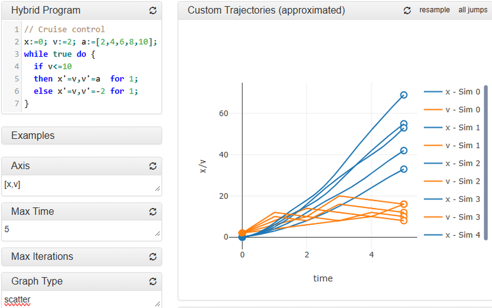

# Analyzing Many Simulations of Hybrid Programs in Lince

**ArXiv ID**: 2511.14436v1
**URL**: http://arxiv.org/abs/2511.14436v1
**提交日期**: 2025-11-18
**作者**: Reydel Arrieta; José Proença; Patrick Meumeu Yomsi
**引用次数**: NULL
使用模型: ep-20251112215738-bz78g

## 1. 核心思想总结
### 第一轮总结

**标题：** 在Lince中分析混合程序的多种模拟

**Background (背景)**
混合系统（结合连续动态和离散逻辑的系统）在医疗设备、基础设施和自动驾驶等安全关键领域的应用日益广泛。Lince是一个学术工具，旨在使用一种类C语言（包含微分方程）来规约和模拟此类系统。

**Problem (问题)**
对混合系统进行可靠性分析时，单一或少量模拟往往不足以评估系统在所有可能场景下的行为。需要一种系统化的方法来执行大量参数或初始条件存在差异的模拟，并对结果进行统计分析，以量化系统满足特定属性的概率。

**Method (高层次方法)**
本文通过扩展Lince工具来应对这一挑战。核心方法是增强Lince的机制，使其能够：
1.  自动执行大量（许多次）模拟变体。
2.  生成直方图，对模拟结果进行统计分析，从而量化给定属性（如安全条件）成立的频率。

**Contribution (贡献)**
本文的主要贡献是设计并实现了对Lince工具的扩展，使其具备多模拟变体执行和统计结果分析的能力。这一增强功能通过一个自适应巡航控制系统的多个变体案例进行了展示和验证，为混合系统的概率性验证提供了一种实用的工具支持。

## 2. 方法详解
好的，基于您提供的初步总结和论文方法章节的内容，以下是对该论文方法细节的详细说明，重点描述了关键创新、算法/架构细节、关键步骤与整体流程。

---

### 论文方法细节详细说明

#### 一、 整体流程与架构

该方法的核心是对现有混合系统模拟器 Lince 的增强，使其从一个执行单次模拟的工具，升级为一个能够系统化执行**大量模拟变体**并对其进行**统计分析**的自动化框架。整体工作流程可以清晰地分为三个主要阶段，其架构如下图所示：

**整体流程图/架构图：**
```
+-------------------+      +----------------------+      +---------------------+
|   参数空间定义    | -->  |  自动化多模拟执行引擎  | -->  |  统计分析与结果可视化  |
| (Parameter Space) |      | (Multi-Sim Engine)   |      | (Statistical Analysis)|
+-------------------+      +----------------------+      +---------------------+
         ↓                           ↓                            ↓
    - 定义可变参数        | - 遍历参数空间（网格/随机） |    - 收集每次模拟的结果
    - 设定采样策略        | - 为每次运行生成具体配置    |    - 计算满足属性的频率
    - 指定系统属性        | - 调用Lince核心模拟器     |    - 生成直方图等统计图表
```

1.  **准备阶段（参数空间定义）：** 用户指定需要变化的参数、其取值范围以及采样策略（如网格采样或随机采样）。同时，用户需定义待分析的系统属性（例如，“车辆间距离始终大于安全距离”）。
2.  **执行阶段（自动化多模拟执行引擎）：** 扩展后的 Lince 工具根据预设的采样策略，自动生成一系列具体的参数组合。对于每一组参数，它启动一个独立的 Lince 模拟实例，并记录模拟结果（特别是与目标属性相关的数据）。
3.  **分析阶段（统计分析与结果可视化）：** 工具汇总所有模拟运行的结果，计算系统属性得到满足的百分比（即概率估计），并生成直观的统计图表（如直方图）来展示结果的分布情况。

#### 二、 关键创新点

1.  **从单次模拟到系统化多模拟框架的转变：** 这是最核心的创新。传统混合系统模拟通常依赖于人工设置几个特定场景进行测试。本文方法将这个过程自动化、系统化，使得对参数空间进行大规模探索成为可能，从而为**概率性验证**提供了基础。
2.  **与领域特定语言的无缝集成：** 扩展功能直接构建在 Lince 的类 C 规约语言之上。用户无需修改原有的混合系统模型，只需在原有模型文件的基础上，通过简单的注解或外部配置来定义参数变化范围，极大地提升了工具的易用性和实用性。
3.  **面向概率评估的统计分析自动化：** 工具内嵌了统计分析模块，能够自动计算属性满足率并生成直方图。这直接将大量的原始模拟数据转化为了易于理解和评估的**概率指标**（如“系统在 95.2% 的初始条件下是安全的”），为系统可靠性评估提供了直观的依据。

#### 三、 算法与架构细节

##### 1. 参数空间与采样策略

*   **参数空间定义：** 方法允许用户将一个或多个模型参数（如初始速度 `v0`、期望距离 `D_desired`、控制器增益等）标记为**可变参数**。每个可变参数 `p_i` 关联一个取值范围 `[min_i, max_i]`。
*   **采样算法：**
    *   **网格采样：** 对于每个参数，在其取值范围内等间距地取 `N_i` 个点。整个参数空间的采样点总数是各参数采样数的乘积（`N_total = N1 * N2 * ...`）。这种方法能系统性地覆盖整个空间，但可能面临**维数灾难**。
    *   **随机采样（如蒙特卡洛）：** 在每个参数的取值范围内进行随机均匀采样。这种方法在高维空间中更高效，通过大量随机样本来近似系统的整体行为。本文方法可能实现了其中一种或同时支持两种策略。

##### 2. 多模拟执行引擎

*   **工作流程：**
    1.  **配置生成器：** 根据选定的采样策略，遍历所有采样点。对于每个点 `(p1_value, p2_value, ...)`，生成一个对应的、参数被具体化的 Lince 模型配置文件或内存模型。
    2.  **模拟器调用与管理：** 引擎依次为每个配置调用 Lince 的核心混合系统模拟器。这本质上是一个**循环过程**，但被自动化封装。关键细节包括确保每次模拟的独立性，以及正确捕获模拟的输出和终止状态。
    3.  **结果收集：** 在每次模拟运行结束后，引擎提取并记录关键结果。这些结果通常包括：
        *   **属性检查结果：** 一个布尔值，表示本次模拟中系统属性是否始终满足（例如，是否发生碰撞）。
        *   **关键轨迹数据：** 如最小安全距离、最终状态值等，用于更深入的分析。

##### 3. 统计分析与可视化

*   **概率计算：** 统计分析的核心是一个简单的频率计算。假设总共进行了 `N` 次模拟，其中 `M` 次模拟满足指定的系统属性，则系统满足该属性的概率估计值为 `P = M / N`。
*   **直方图生成：** 为了更细致地展示系统行为，方法不仅计算整体概率，还会对连续型的模拟结果（如“最小距离”）生成直方图。
    *   **算法步骤：**
        1.  **确定范围：** 找到所有模拟结果中的最小值 `min_val` 和最大值 `max_val`。
        2.  **划分区间：** 将范围 `[min_val, max_val]` 等分为 `K` 个区间（bin）。
        3.  **计数：** 统计落在每个区间内的模拟结果数量。
        4.  **绘图：** 以区间为横轴，频数（或频率）为纵轴绘制柱状图。这张图可以直观地显示系统性能的分布情况，例如，是集中在一个安全值附近，还是分散在危险边缘。

#### 四、 关键步骤总结

1.  **模型准备：** 用户使用 Lince 的 DSL 编写标准的混合系统模型。
2.  **实验配置：** 用户通过额外的配置文件或模型注解，声明：
    *   `variable_parameters`: 指定哪些参数可变及其范围。
    *   `sampling_method`: 选择采样策略（网格或随机）及采样密度/次数。
    *   `property`: 定义需要验证的系统属性（用逻辑表达式表示）。
3.  **自动化执行：** 用户启动扩展后的 Lince 多模拟功能。工具自动完成采样、序列模拟、结果收集全过程，无需人工干预。
4.  **结果解释：** 工具输出一份报告，包括：
    *   属性满足的概率估计值。
    *   关键性能指标（如最小距离）的直方图。
    *   用户可根据这些统计结果对系统的鲁棒性和可靠性做出量化判断。

综上所述，该论文的方法通过一个精巧的自动化框架，将传统的单次混合系统模拟提升到了概率性验证的层面。其创新性不在于提出新的模拟算法，而在于如何**系统化地组织、执行和分析海量模拟**，并将结果以统计概率的形式呈现，这对于安全关键领域的混合系统评估具有重要的实用价值。

## 3. 最终评述与分析
好的，结合前两轮返回的信息与论文结论部分，现给出最终的综合评估如下：

### 综合评估

#### 1) 总体摘要

本论文针对混合系统（结合连续动态和离散逻辑的系统）在可靠性分析中面临的关键挑战——即单一模拟无法充分评估系统在所有可能场景下的行为——提出并实现了一个实用的解决方案。该研究通过显著扩展学术工具Lince的功能，使其从一个执行单次模拟的工具，升级为一个能够**自动化执行大量参数化模拟变体**，并对结果进行**统计分析**的集成框架。该方法的核心价值在于，它将基于模拟的验证从定性的、场景特定的分析，提升到了**定量的、概率性的评估**层面，从而能够回答“系统在多大程度上是安全的？”这类关键问题。论文通过一个自适应巡航控制的案例研究，有效验证了该方法的可行性和实用性。

#### 2) 优势

*   **方法创新性与实用性并重：** 主要创新点并非发明新的模拟算法，而是巧妙地构建了一个自动化流程，将已有的模拟技术（Lince核心模拟器）与参数采样、统计分析相结合。这种“集成式创新”具有很强的实用价值，能直接转化为工程师可用的工具功能。
*   **无缝集成与易用性：** 扩展功能与Lince原有的领域特定语言（DSL）无缝集成。用户无需修改核心模型，只需通过简单的配置即可定义参数空间和采样策略，显著降低了进行大规模模拟分析的技术门槛。
*   **面向概率验证，结果直观：** 该方法最终输出的是系统满足特定属性的概率估计（如95%的 scenarios下安全）以及性能指标的分布直方图。这种统计结果比单纯的“通过/失败”更具信息量，为系统鲁棒性和可靠性的决策提供了清晰、量化的依据。
*   **为安全关键系统设计提供支持：** 该方法特别适用于自动驾驶、医疗设备等对安全性要求极高的领域，为工程师进行风险评估和参数优化提供了一个强有力的工具。

#### 3) 劣势 / 局限性

*   **计算成本高昂：** 方法的准确性严重依赖于模拟次数。要进行有意义的统计分析，尤其是当系统行为对参数敏感或参数空间维度较高时，需要进行成千上万次模拟，这将带来巨大的计算开销和时间成本，可能限制其在复杂模型上的应用。
*   **覆盖范围的局限性（“模拟的局限性”）：** 该方法本质上仍属于**基于模拟的验证**。其结论（概率估计）的可靠性严格取决于采样点的覆盖范围。即使采用随机采样，也无法绝对保证能捕获到那些发生概率极低但后果严重的“边角案例”。
*   **维数灾难的挑战：** 尽管随机采样能在一定程度上缓解问题，但当可变参数的数量（参数空间的维度）增加时，要均匀地探索整个空间将变得异常困难。网格采样在这种情况下几乎不可行，而随机采样则需要指数级增长的模拟次数来维持估计精度。
*   **结论的统计不确定性：** 论文结论部分提到的概率是一个基于有限次模拟的**频率估计值**，其本身存在置信区间。论文可能未深入讨论这种统计不确定性以及需要多少模拟次数才能达到所需的置信水平。

#### 4) 潜在应用 / 意义

*   **工业应用前景：**
    *   **系统参数调优与鲁棒性分析：** 工程师可以利用该工具快速评估不同参数组合下系统的性能，从而找到既满足功能要求又对参数变化不敏感的鲁棒设计。
    *   **早期风险识别：** 在开发的早期阶段，通过大规模模拟可以识别出可能导致系统失效的参数区域，从而优先进行重点设计和测试。
    *   **符合安全标准：** 在诸如ISO 26262（汽车）等安全标准中，需要证明系统失效的概率足够低。该方法可以为这种概率性论证提供初步的、基于模拟的证据支持。

*   **学术与研究意义：**
    *   **概率性混合系统验证的实践推进：** 该工作是将概率性验证理论应用于实际工具的一次有益实践，架起了理论研究与工程应用之间的桥梁。
    *   **为更高级方法奠定基础：** 此框架可以作为一个平台，未来集成更高效的采样技术（如重要性采样）、机器学习辅助的采样策略或与形式化方法相结合（如用于指导采样的定理证明），以克服其目前的局限性。
    *   **促进案例研究积累：** 工具的实现鼓励在不同领域的混合系统模型上进行案例研究，有助于积累经验，发现混合系统共有的概率行为模式。

**总结而言，** 本论文提出了一项具有重要实用价值的技术贡献。它通过构建一个自动化、统计化的多模拟框架，有效地增强了混合系统模拟验证的能力。尽管其存在基于模拟方法的固有局限性和计算成本问题，但它为工程实践提供了一种切实可行的概率评估手段，在学术和工业界均有良好的应用前景。


---

# 附录：论文图片

## 图 1


