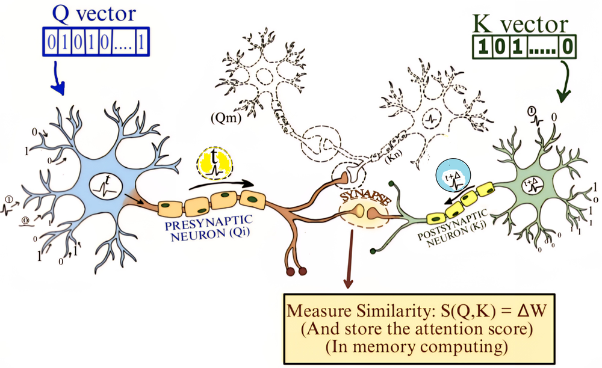
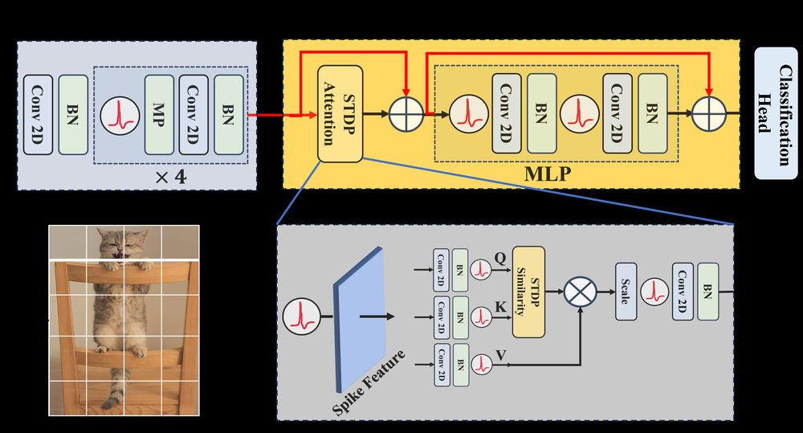
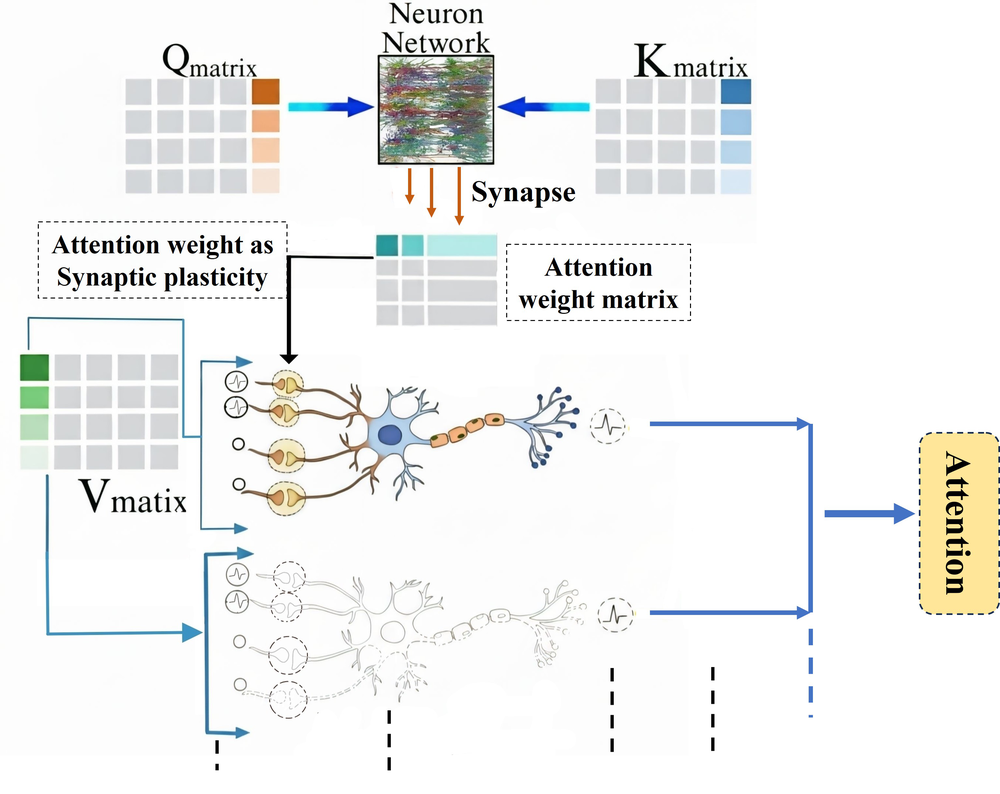
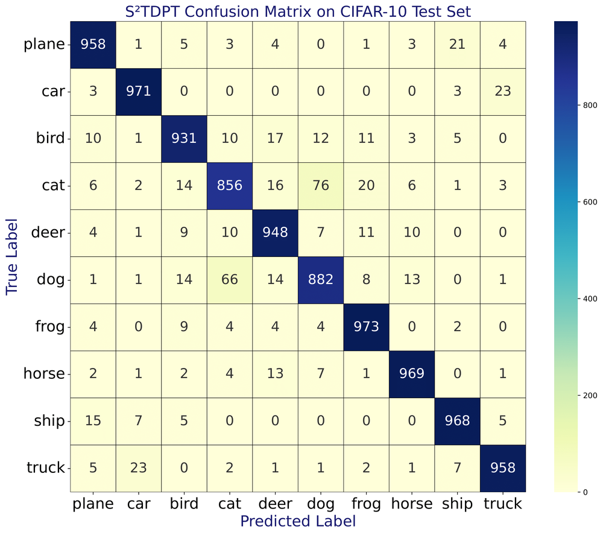
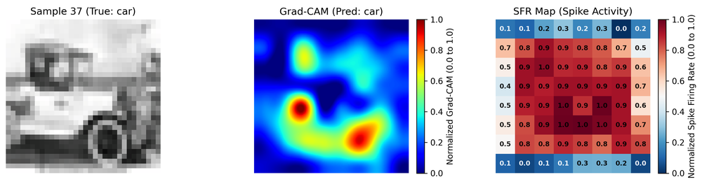
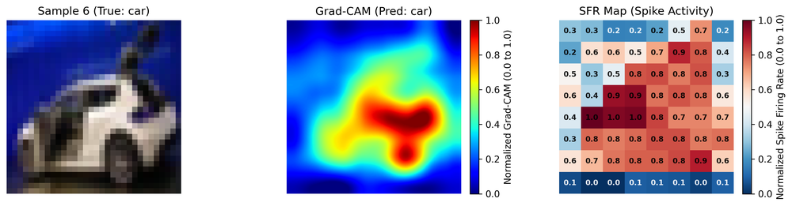
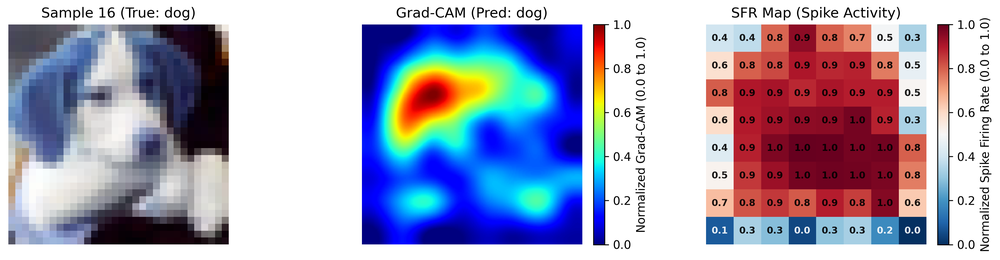
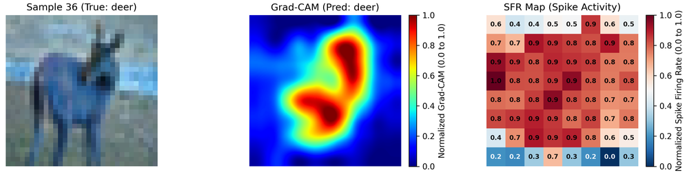
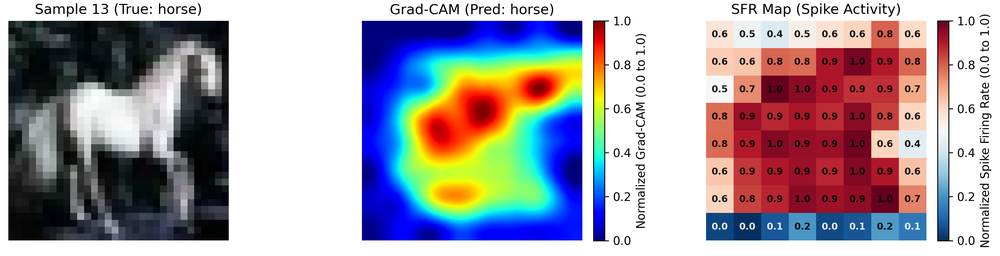

# Attention via Synaptic Plasticity is All You Need: A Biologically Inspired Spiking Neuromorphic Transformer

**ArXiv ID**: 2511.14691v1
**URL**: http://arxiv.org/abs/2511.14691v1
**提交日期**: 2025-11-18
**作者**: Kallol Mondal; Ankush Kumar
**引用次数**: NULL
使用模型: ep-20251112215738-bz78g

## 1. 核心思想总结
这是一份根据您提供的标题和摘要整理的学术论文第一轮总结，按四个部分组织如下：

**1. Background (背景)**
现代Transformer模型中的注意力机制灵感来源于大脑选择性聚焦的生物能力。该类模型已成为大语言模型（如GPT）的核心，但其巨大的训练和推理能耗带来了高碳足迹问题。另一方面，受大脑启发的神经形态计算，特别是脉冲神经网络（SNNs），为实现高能效智能提供了一条有前景的路径。

**2. Problem (问题)**
尽管已有研究尝试构建基于注意力的脉冲Transformer，但其核心的注意力层本身并非真正的神经形态实现。现有脉冲注意力方法存在三个主要问题：(i) 依赖适合浮点运算而非脉冲事件驱动的点积或元素级相似度计算；(ii) 需要存储注意力矩阵，受限于冯·诺依曼瓶颈，难以实现内存计算；(iii) 其计算方式与大脑的实际工作原理仍有差距。

**3. Method (high-level) (方法 - 高层概述)**
为解决上述问题，本文提出了一种名为Spiking STDP Transformer (S²TDPT)的神经形态Transformer模型。其核心创新在于利用**脉冲时序依赖可塑性（STDP）**——一种大脑中学习和记忆的核心生物机制——来实现自注意力功能。该模型将查询（Query）和键（Key）的相关性直接嵌入到突触权重中，从而替代了传统的点积注意力计算。

**4. Contribution (贡献)**
本文的主要贡献是提出了S²TDPT模型，它展示了：
*   **高能效性**：在CIFAR-10和CIFAR-100数据集上取得了高精度，同时能耗极低（在CIFAR-100上能耗比标准ANN Transformer降低88.47%）。
*   **硬件友好性**：基于STDP的注意力机制天然支持非冯·诺依曼架构和内存计算。
*   **生物合理性与可解释性**：模型更贴近大脑的计算方式，并通过Grad-CAM可视化表明其能关注语义相关区域，增强了模型的可解释性。

## 2. 方法详解
好的，遵照您的要求，我将基于您提供的初步总结和论文方法章节内容，对这篇论文的方法细节进行详细说明，重点描述其关键创新、算法/架构细节、关键步骤与整体流程。

---

### **论文方法细节详细说明**

本论文的核心目标是构建一个完全基于脉冲神经网络的、具有生物合理性的Transformer模型，其最大的创新点在于用**脉冲时序依赖可塑性（Spike-Timing-Dependent Plasticity， STDP）** 这一生物可塑性规则来替代传统Transformer中高能耗的、非神经形态的**点积注意力（Dot-Product Attention）** 机制。

#### **一、 关键创新：STDP驱动的注意力机制**

传统Transformer的注意力计算流程为：`Query (Q) × Key (K)^T -> Softmax -> × Value (V)`。这一过程涉及大规模的矩阵乘法，需要高精度浮点运算，且生成的注意力矩阵需要被存储，导致高能耗和内存瓶颈。

本文提出的 **S²TDPT模型** 的关键创新在于，**将注意力权重的动态计算过程，转化为基于脉冲事件的突触权重长期演化过程**。

*   **核心思想**： 在一个神经网络中，如果某个神经元A（代表`Query`）的脉冲反复在另一个神经元B（代表`Key`）的脉冲之前出现，那么从A到B的突触连接就会根据STDP规则得到增强。这种增强意味着，当类似的`Query`模式再次出现时，神经元B（代表`Key`）会更容易被激活。这本质上等同于在`Query`和`Key`之间建立了一种强相关性。
*   **实现方式**： 模型不再显式计算`Q`和`K`的点积，而是将`Q`和`K`的脉冲序列分别输入到一组“STDP突触”中。这些突触的权重会根据其前后神经元脉冲的精确时序动态更新。经过训练后，稳定的突触权重就编码了`Query`和`Key`之间的注意力关系。

#### **二、 算法/架构细节**

**1. 整体模型架构**

S²TDPT模型遵循标准Transformer的编码器（Encoder）结构，但每一层都被替换为脉冲神经形态版本：

*   **输入编码层**： 将静态图像像素值转换为脉冲序列。通常采用频率编码或泊松编码，即像素亮度越高，对应的脉冲神经元发放频率越高。
*   **脉冲自注意力层（核心创新层）**： 这是用STDP规则实现注意力功能的核心模块。
*   **脉冲多层感知机层**： 由全连接的前馈脉冲神经网络构成，通常使用积分发放（Leaky Integrate-and-Fire， LIF）神经元。
*   **残差连接与层归一化**： 同样被适配为适用于脉冲信号的版本，例如使用基于事件的归一化方法。

**2. 脉冲自注意力层的详细工作流程**

该层是方法的核心，其内部流程可以分解为以下关键步骤：

*   **步骤1： 线性投影与脉冲生成**
    *   输入脉冲序列首先通过三组不同的可训练权重矩阵 \(W_Q\), \(W_K\), \(W_V\) 进行线性投影，分别生成`Query`， `Key`， `Value`的膜电位。
    *   这些膜电位被输入到LIF神经元中，生成相应的脉冲序列 \(S_Q\), \(S_K\), \(S_V\)。至此，`Q, K, V`都变成了事件驱动的稀疏二进制信号。

*   **步骤2： STDP注意力权重演化（替代点积Softmax）**
    *   **关键结构**： 引入一个“STDP注意力模块”。该模块包含一组突触，其权重 \(W_{STDP}\) 不是通过梯度下降学习，而是通过STDP规则进行局部、无监督的更新。
    *   **工作流程**：
        1.  `Query`脉冲序列 \(S_Q\) 作为突触前输入，`Key`脉冲序列 \(S_K\) （或其衍生信号）作为突触后目标或调制信号。
        2.  当一个`Query`神经元发放脉冲（突触前事件）后，紧接着一个`Key`神经元发放脉冲（突触后事件），则连接它们的突触权重会根据STDP的“长时程增强（LTP）”规则增加。这表示“`Query`引起了`Key`的响应”，相关性高。
        3.  反之，如果`Key`脉冲先于`Query`脉冲发生，则权重会根据“长时程抑制（LTD）”规则减小。这表示两者相关性弱。
    *   **结果**： 在整个训练过程中，\(W_{STDP}\) 动态地演化，最终收敛到一个稳定状态。这个稳定的 \(W_{STDP}\) 矩阵就等价于传统注意力机制中通过Softmax计算出的注意力权重图 \(A = \text{Softmax}(QK^T/\sqrt{d_k})\)。它编码了不同位置（Token）之间的关联强度。

*   **步骤3： 注意力加权求和（基于脉冲的事件驱动）**
    *   `Value`的脉冲序列 \(S_V\) 通过演化后的STDP注意力权重 \(W_{STDP}\) 进行加权。
    *   由于所有信号都是二进制的脉冲，这个“加权求和”操作可以高效地通过事件驱动的脉冲传播来实现，而无需进行密集的浮点矩阵乘法。具体来说，当一个`Value`脉冲到达突触时，它会根据当前突触权重 \(W_{STDP}\) 的大小来调制后神经元的膜电位。
    *   最终，被调制后的膜电位积分产生输出脉冲序列，作为自注意力层的输出。

**3. 训练算法**

模型的训练通常采用混合方式：
*   **STDP规则**： 用于无监督地、在线地更新注意力模块中的突触权重 \(W_{STDP}\)。这是局部规则，仅依赖于前后神经元的脉冲时序。
*   **梯度下降算法（如BPTT的脉冲版本）**： 用于监督地训练模型中的其他参数，包括线性投影的权重 \(W_Q, W_K, W_V\)、FFN层的权重以及输入输出层的权重。误差信号通过时间反向传播来调整这些参数。

#### **三、 整体流程总结**

1.  **前向传播**：
    *   输入图像被编码为脉冲序列。
    *   脉冲序列经过多层脉冲Transformer编码器。
    *   在每个脉冲自注意力层中：`Q, K, V`脉冲生成 -> STDP权重动态调制`V`脉冲的传播 -> 输出脉冲。
    *   最后的输出脉冲序列被解码为分类结果（如通过膜电位积分或脉冲计数）。

2.  **权重更新**：
    *   **在每个时间步**： STDP规则根据当前时刻的`Q`和`K`脉冲时序，在线、局部地更新注意力突触权重 \(W_{STDP}\)。
    *   **在每个训练批次/epoch后**： 基于最终的分类损失，使用梯度下降法（如BPTT）全局更新模型中所有**非STDP**的可训练参数（如 \(W_Q, W_K, W_V\) 等）。

#### **四、 方法优势的根源**

*   **高能效**： 避免了点积和Softmax等密集浮点运算，核心计算变为稀疏的二进制脉冲事件处理和基于STDP的简单权重更新（加/减）。
*   **硬件友好**： 二进制脉冲和局部STDP规则非常适合在非冯·诺依曼架构（如神经形态芯片）上实现内存计算，数据无需在处理器和内存间频繁搬运。
*   **生物合理与可解释**： STDP是大脑学习的基础机制之一，因此该模型的工作方式更接近生物神经网络。通过观察STDP权重 \(W_{STDP}\) 的分布，可以直接“看到”模型学习了哪些特征关联，从而增强可解释性。

综上所述，S²TDPT模型通过将Transformer的全局注意力计算巧妙地映射到SNN的局部STDP学习规则上，在算法层面实现了根本性的创新，为构建下一代高能效、生物启发的智能计算模型提供了重要思路。

## 3. 最终评述与分析
好的，这是结合您提供的初步总结、方法详述以及结论部分，对这篇关于“Spiking STDP Transformer (S²TDPT)”论文的最终综合评估。

---

### **关于Spiking STDP Transformer (S²TDPT) 论文的最终综合评估**

#### **1. 整体摘要**

本论文针对当前基于Transformer的大语言模型存在的高能耗问题，以及现有脉冲Transformer中注意力机制仍非真正神经形态实现的局限性，提出了一种名为**Spiking STDP Transformer (S²TDPT)** 的创新模型。该模型的核心突破在于，利用大脑中一种基础的学习机制——**脉冲时序依赖可塑性（STDP）**——来完全替代传统Transformer中高计算复杂度的点积注意力机制。通过在CIFAR-10和CIFAR-100等标准数据集上的实验验证，S²TDPT不仅实现了与人工神经网络（ANN）Transformer相媲美的高精度，更重要的是，其能耗显著降低了超过88%，成功地将Transformer架构的强大能力与脉冲神经网络（SNN）的极致能效结合了起来。

#### **2. 优势**

1.  **革命性的能效提升**：这是论文最核心的优势。通过用基于事件的STDP规则取代密集的浮点矩阵乘法（点积），S²TDPT将计算复杂度从二次方级别大幅降低，实现了极低的训练和推理能耗，为解决AI的碳足迹问题提供了切实可行的技术路径。
2.  **高度的硬件友好性**：模型完全基于二进制脉冲事件和局部学习规则（STDP），天然契合非冯·诺依曼架构和内存计算范式。这使其在下一代神经形态硬件（如英特尔的Loihi、清华大学的天机芯）上具有巨大的部署潜力，能够从根本上克服冯·诺依曼瓶颈。
3.  **增强的生物合理性与可解释性**：与大多数“黑箱”AI模型不同，S²TDPT的设计原理更贴近大脑的工作方式。论文中通过Grad-CAM等可视化技术表明，模型学习到的注意力模式（由STDP权重体现）能够聚焦于图像的语义相关区域，这不仅增强了模型决策过程的透明度，也为从神经科学角度理解人工智能提供了新的视角。
4.  **有效的性能表现**：论文在具有挑战性的图像分类任务上证明了S²TDPT的有效性，其性能超越了多种SNN和ANN基线模型，展示了该创新架构在处理复杂任务上的潜力。

#### **3. 局限性与挑战**

1.  **任务复杂度与可扩展性待验证**：当前实验仅在相对小规模的图像分类数据集（CIFAR）上进行。S²TDPT架构能否有效扩展到大规模、序列到序列的复杂任务（如自然语言理解、大规模图像识别），是其面临的主要挑战。STDP机制在处理长序列依赖关系时的效率仍需进一步探究。
2.  **训练复杂性与收敛性**：模型采用了STDP（无监督、局部）与BPTT（有监督、全局）相结合的混合训练范式。这种混合训练策略可能比训练标准Transformer更为复杂，其收敛速度、稳定性和超参数敏感性需要更深入的研究和优化。
3.  **与最先进模型的性能差距**：虽然论文展示了相对于基线模型的优势，但其绝对精度与当前最先进的（非脉冲）Transformer模型（如ViT的大型变体）相比可能仍有差距。这需要在保持能效优势的同时，持续提升模型性能。
4.  **硬件实现的工程挑战**：尽管架构是硬件友好的，但将S²TDPT高效地映射到实际的神经形态芯片上，并处理脉冲编码、路由、时序同步等一系列工程问题，仍是一个需要克服的挑战。

#### **4. 潜在应用与深远影响**

1.  **边缘计算与嵌入式AI**：极低的能耗使S²TDPT非常适合部署在资源受限的边缘设备上，如智能手机、自动驾驶汽车、物联网传感器和可穿戴设备，实现持续在线的智能感知与决策。
2.  **绿色可持续AI**：为降低大型AI模型的训练和运行成本及环境负担提供了关键技术支持，有助于推动AI产业向更可持续的方向发展。
3.  **神经形态计算生态的推动**：作为一项算法层面的突破性工作，S²TDPT为神经形态硬件提供了“杀手级”的算法应用范例，将加速神经形态计算从研究走向实际应用的进程。
4.  **脑科学与AI的交叉融合**：该模型架起了计算神经科学与人工智能之间新的桥梁。通过构建更接近大脑的智能模型，不仅可能催生更强大的AI，也可能反过来帮助我们理解大脑中注意、学习和记忆等高级认知功能的神经基础。

**总结**：本论文提出的S²TDPT模型是一项具有前瞻性和重要价值的研究工作。它不仅在技术上巧妙地解决了脉冲Transformer的核心难题，更在理念上推动了AI向高能效、生物启发和硬件友好的方向发展。尽管在可扩展性和实际部署方面仍面临挑战，但其开创性的思路为未来低功耗智能系统的设计指明了富有潜力的方向。

---

# 附录：论文图片

## 图 1

## 图 2

## 图 3

## 图 4

## 图 5

## 图 6

## 图 7

## 图 8

## 图 9

