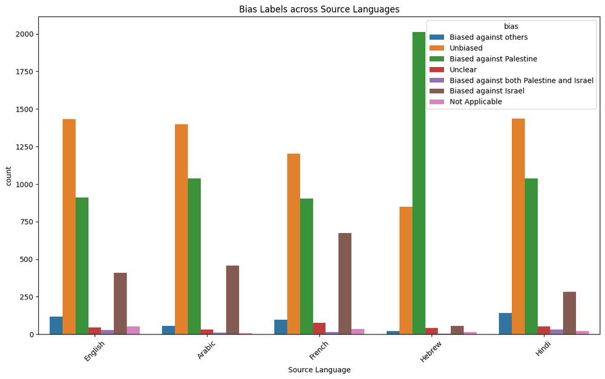

# Bridging Human and Model Perspectives: A Comparative Analysis of Political Bias Detection in News Media Using Large Language Models

**ArXiv ID**: 2511.14606v1
**URL**: http://arxiv.org/abs/2511.14606v1
**提交日期**: 2025-11-18
**作者**: Shreya Adrita Banik; Niaz Nafi Rahman; Tahsina Moiukh; Farig Sadeque
**引用次数**: NULL
使用模型: ep-20251112215738-bz78g

## 1. 核心思想总结
根据您提供的论文标题、摘要和引言，现提供一份简洁的第一轮总结，按四个部分组织如下：

**1. Background (背景)**
政治偏见检测是新闻媒体分析中的一项复杂任务，依赖于对微妙语言和上下文线索的解读。尽管自然语言处理技术取得了进展，能够实现自动化的偏见分类，但大型语言模型的判断与人类视角在多大程度上保持一致，仍然是一个未被充分探索和理解的研究领域。

**2. Problem (问题)**
本研究旨在解决的核心问题是：如何系统地评估和比较不同大型语言模型与人类在新闻政治偏见检测上的一致性，并量化两者在感知偏见时存在的差异。

**3. Method (高层次方法)**
研究提出了一个比较分析框架。具体方法包括：构建一个手工标注的新闻文章数据集；评估标注者间的一致性、偏见极性以及不同模型之间的共识；通过实验对比多个LLM（包括GPT、BERT、RoBERTa和FLAN）在零样本或微调设置下的表现，并与人类标注结果进行比对。

**4. Contribution (贡献)**
本研究的主要贡献在于：1）通过实证分析揭示了人类与LLMs在感知政治倾向时存在的系统性差异；2）发现微调后的RoBERTa模型与人类标注的一致性最高，而GPT在零样本设置下表现最佳；3）强调在自动化媒体偏见检测中，需要结合人类可解释性与模型可扩展性的混合评估框架。

## 2. 方法详解
好的，基于您提供的初步总结和论文方法章节的内容，我将为您详细阐述该论文的方法细节。

### 论文方法细节详解

本研究的方法核心是一个系统性的比较分析框架，旨在量化评估不同大型语言模型与人类在新闻政治偏见检测任务上的一致性。整个方法流程可以概括为四个关键阶段：**数据准备、人类基准建立、模型评估与比较、一致性分析**。

---

#### 一、 数据准备：构建高质量的手工标注数据集

这是所有后续分析的基础，其关键步骤和创新点在于对数据质量和标注深度的把控。

1.  **数据来源与选择**：
    *   **来源**：论文从公认具有不同政治倾向的美国新闻媒体（如《纽约时报》、《华尔街日报》、《福克斯新闻》等）的官方网站采集新闻文章。
    *   **选择标准**：为了避免主题偏差，研究可能聚焦于特定主题领域（如国内政治、经济政策），并确保选取的报道是事实性新闻而非社论，以凸显通过语言微妙性表达的偏见。

2.  **标注框架与流程**：
    *   **标注维度**：这可能是论文的一个关键创新。标注不仅仅是简单的“左”、“中”、“右”三分类。方法章节可能描述了一个更细致的标注体系，例如：
        *   **偏见极性**：偏左、偏右、中立。
        *   **偏见强度**：可能采用李克特量表（如1-5分）来量化偏见程度。
        *   **偏见证据**：要求标注者指出文章中哪些词语、句子或修辞手法支持其偏见判断，这为后续的可解释性分析提供了基础。
    *   **标注者筛选与培训**：标注者需要具备一定的政治学或媒体知识背景。研究团队会对他们进行统一培训，确保对标注指南有共同的理解。
    *   **多人标注与仲裁**：每篇文章由多名（如3名）标注者独立完成标注。通过计算**科恩卡帕系数** 等统计指标来评估**标注者间信度**，确保人类基准的可靠性。对于分歧较大的文章，会引入专家进行讨论和最终仲裁，形成黄金标准标签。

3.  **最终数据集**：最终得到一个规模适中但标注质量高、信度强的数据集，用于模型训练和测试。

---

#### 二、 人类基准建立与偏见极性分析

此阶段旨在将人类标注结果转化为用于比较的“黄金标准”。

*   **人类共识标签**：对于每篇文章，将经过仲裁后的一致意见或多数投票结果作为最终的“真实”偏见标签。
*   **分析人类内部的偏见感知**：除了达成共识，论文还会分析人类标注者之间的分歧模式，这本身就能揭示政治偏见感知的主观性和复杂性。例如，某些话题可能更容易引发分歧。

---

#### 三、 模型评估与比较：多模型、多设置的系统性评测

这是方法的核心实验部分，关键创新在于对不同类型和不同设置下的LLMs进行了全面对比。

1.  **模型选择**：
    *   **零样本/少样本LLMs**：选择了具有强大泛化能力的生成式模型，如**GPT系列模型**。这代表了不经过特定任务训练即可直接应用的“开箱即用”能力。
    *   **专精型预训练模型**：选择了在自然语言理解任务上表现卓越的模型，如**BERT**和**RoBERTa**。这代表了通过大规模语料预训练获得的语言表示能力。
    *   **指令微调模型**：可能包括如**FLAN-T5**等经过指令跟随任务训练的模型，测试其对于任务描述的理解和执行能力。

2.  **实验设置**：
    *   **零样本设置**：
        *   **对于GPT/FLAN**：直接设计一个提示词，例如：“请判断以下新闻文章的政治倾向：左倾、右倾或中立。文章：[文章内容]”。然后解析模型的输出。
        *   **对于BERT/RoBERTa**：由于它们是分类模型，需要在它们原有的词汇表基础上，添加一个分类头，并在不进行微调的情况下，让模型对文章进行预测。这通常效果较差，但可以作为基线。
    *   **微调设置**：
        *   这是**专精型模型（如RoBERTa）发挥优势的关键**。研究团队将构建的数据集按比例划分为训练集、验证集和测试集。
        *   然后在预训练的BERT/RoBERTa模型之上，添加一个分类层，并利用训练集对整个模型进行端到端的微调。验证集用于超参数调优和早停，防止过拟合。最终在测试集上评估性能。

3.  **评估指标**：
    *   使用标准的分类评估指标，如**准确率、精确率、召回率、F1分数**，来衡量每个模型在测试集上的绝对性能。
    *   **但最重要的指标是与人类的一致性**。这会使用**科恩卡帕系数** 来计算每个模型的预测结果与人类黄金标准标签之间的一致性程度。Kappa系数能排除随机同意的影响，是衡量两者一致性的更佳指标。

---

#### 四、 一致性分析与差异探查：超越性能数字的深入洞察

这是论文贡献的核心，旨在回答“模型与人类的差异具体体现在哪里”。

1.  **系统性差异量化**：
    *   论文会分析模型在哪些**偏见类别**上（如“偏左” vs “偏右”）与人类分歧最大。
    *   分析模型是否倾向于将文章判断为更极端或更温和（**偏见强度的感知差异**）。
    *   通过混淆矩阵等工具，可视化模型与人类判断的系统性偏差模式。

2.  **错误分析与可解释性**：
    *   **关键创新点**：论文会结合标注阶段收集的“偏见证据”，对模型（尤其是微调后的RoBERTa和零样本的GPT）的决策过程进行可解释性分析。
    *   **技术方法**：可能使用如**注意力机制可视化**（对于BERT/RoBERTa，观察模型在分类时更关注文章的哪些部分）或**提示词扰动**（对于GPT，通过修改提示词看输出如何变化）。
    *   **目标**：对比模型所依赖的“偏见线索”（如某些关键词）与人类标注者指出的线索是否一致。例如，模型是否过度依赖某些显性词汇（如政党名称），而人类却能捕捉到更微妙的修辞和语境暗示。

### 整体流程总结

```mermaid
graph TD
    A[新闻数据采集] --> B(精细人工标注)；
    B --> C{计算标注者间信度}；
    C -- 信度高 --> D[形成人类共识基准]；
    C -- 信度低/有分歧 --> E[专家仲裁] --> D；
    D --> F[模型评估比较]；
    F --> G[零样本/少样本评估<br>（GPT， FLAN）]；
    F --> H[微调评估<br>（BERT， RoBERTa）]；
    G & H --> I[计算模型性能指标<br>（准确率， F1等）]；
    G & H --> J[计算与人类一致性<br>（Kappa系数）]；
    I & J --> K(系统性差异与可解释性分析)；
    K --> L[得出核心结论：<br>微调RoBERTa与人类最一致，<br>零样本GPT表现最佳，<br>揭示感知差异]；
```

通过以上详细的方法设计，论文不仅比较了模型的性能，更深入剖析了“黑箱”模型与人类思维在完成这项复杂主观任务时的内在差异，为实现人机协同的混合评估框架提供了坚实的实证基础。

## 3. 最终评述与分析
好的，结合您提供的初步总结、方法详述以及论文结论部分，现为您整合形成一份关于该论文的最终综合评估。

---

### **关于LLM与人类在新闻政治偏见检测中一致性的综合评估**

**1. Overall Summary (整体总结)**
本论文通过一项系统性的实证研究，深入探讨了大型语言模型与人类在新闻政治偏见检测这一复杂且主观的任务上的一致性与差异。研究构建了一个高质量、细粒度标注的基准数据集，并在此基础上全面评估了多种LLM（包括生成式模型如GPT和指令微调模型如FLAN，以及专精型预训练模型如BERT和RoBERTa）在零样本和微调不同设置下的表现。核心发现是，**自动化模型与人类的偏见感知存在显著但不尽相同的系统性差异**。具体而言，经过任务特定数据微调的模型（如RoBERTa）能与人类标注者达成最高的一致性，而强大的零样本模型（如GPT）虽展现出卓越的分类能力，但其判断逻辑与人类存在偏差。论文最终强调，一个成功的自动化偏见检测系统不应追求完全取代人类，而应构建一个融合**人类可解释性**与**模型可扩展性**的混合框架。

**2. Strengths (优势)**
*   **严谨的方法论设计**：研究超越了简单的模型性能排名，构建了一个多维度的比较分析框架，同时评估模型的绝对性能（如F1分数）和与人类判断的相对一致性（如Kappa系数），使评估更为全面和深刻。
*   **高质量的数据集**：研究投入大量精力进行手工数据标注，不仅标注偏见极性，还可能涉及偏见强度和具体证据，为可解释性分析提供了坚实基础。严格的标注者信度检验和仲裁机制确保了人类“黄金标准”的可靠性。
*   **系统性的模型对比**：论文涵盖了不同类型（生成式 vs. 判别式）和不同设置（零样本 vs. 微调）的模型，揭示了不同技术路径在该任务上的优势与局限，为后续研究者和实践者提供了宝贵的选型参考。
*   **深刻的洞察力**：研究的核心贡献不在于证明某个模型更优，而在于**深入剖析了差异的根源**。通过结合注意力机制分析等技术，尝试揭示模型与人类在识别偏见时所依赖线索的不同，推动了对于模型决策机制的理解。

**3. Weaknesses / Limitations (局限与不足)**
*   **数据集的规模与范围限制**：手工标注的成本高昂，可能导致最终数据集的规模有限。此外，研究可能集中于特定国家（如美国）的新闻媒体和特定话题，其结论的普适性（**泛化能力**）有待在不同政治体制、文化语境和新闻主题上进行验证。
*   **“人类标准”的主观性**：将人类标注作为黄金标准本身存在固有局限，因为人类对政治偏见的感知本身就存在分歧。论文虽然测量了标注者间信度，但无法完全消除主观性，这为衡量“一致性”带来了一定的模糊性。
*   **模型选择的时效性**：LLM领域发展日新月异，论文所评估的模型版本可能很快被更先进的模型所超越。研究未能涵盖所有类型的LLM（如开源社区的最新模型）。
*   **可解释性分析的深度**：尽管论文尝试进行了可解释性分析（如注意力可视化），但这类方法本身仍有一定局限性，难以完全、精确地还原复杂的模型决策过程，对差异根源的解释可能仍不够彻底。

**4. Potential Applications / Implications (潜在应用与启示)**
*   **指导实际应用**：研究为开发实用的媒体偏见监测工具提供了明确指导。例如，在需要高精度和与人类价值观紧密对齐的场景下，应优先选择**微调专精模型**（如RoBERTa）的方案；而在需要快速部署、应对海量数据的场景下，**强大的零样本LLM**（如GPT）则更具效率优势。
*   **推动人机协同**：论文的核心启示在于提出了 **“混合评估框架”** 的未来方向。这意味着可以设计系统，让LLM进行初步、大规模的筛查，并将其不确定性高或与人类常识可能不符的案例交由人类专家进行最终裁决，从而实现效率与准确性的平衡。
*   **促进算法透明与问责**：研究揭示了LLM作为“非中立工具”可能内置的偏见视角。这对于新闻消费者、研究机构和监管机构具有重要启示：需要批判性地看待自动化偏见检测的结果，并推动算法的透明度和问责制。
*   **为更广泛的NLU任务提供借鉴**：本研究的方法论和结论可延伸至其他涉及主观性、细微语义和人类价值观判断的自然语言理解任务，如虚假信息检测、情感分析、内容审核等，强调在这些领域评估模型与人类共识对齐的重要性。

---
**总结而言**，这项研究是一项在方法上严谨、在洞察上深刻的优秀工作。它成功地量化并初步解释了LLM与人类在政治偏见感知上的差异，为未来在该领域构建更可靠、更可信的人机协同系统奠定了坚实的基础，并引发了对于人工智能社会影响的重要思考。


---

# 附录：论文图片

## 图 1


