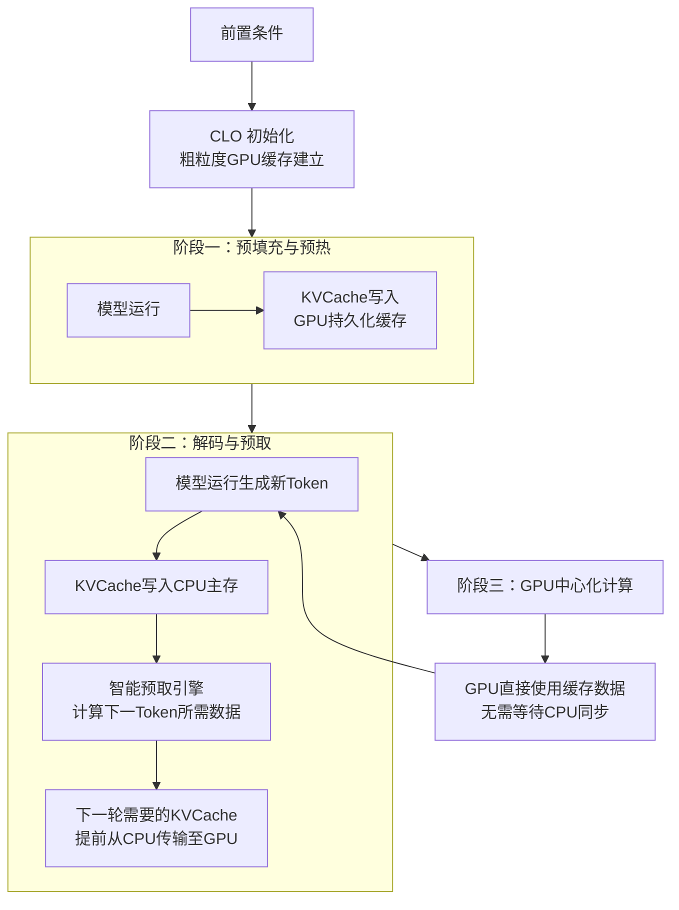

# CLO: Efficient LLM Inference System with CPU-Light KVCache Offloading via Algorithm-System Co-Design

**ArXiv ID**: 2511.14510v1
**URL**: http://arxiv.org/abs/2511.14510v1
**提交日期**: 2025-11-18
**作者**: Jiawei Yi; Ping Gong; Youhui Bai; Jiaqi Ruan; Shengnan Wang; Pengcheng Wang; Haibo Wang; Weiguang Wang; Xia Zhu; Feng Wu; Cheng Li
**引用次数**: NULL
使用模型: ep-20251112215738-bz78g

## 1. 核心思想总结
这是一份关于论文《CLO: Efficient LLM Inference System with CPU-Light KVCache Offloading via Algorithm-System Co-Design》的第一轮总结，按四个部分组织如下：

### 1. Background (背景)
随着支持百万级上下文长度的LLM的发展，推理系统的可扩展性面临严峻挑战。其中，关键值缓存（KVCache）是内存占用和数据传输开销的主要来源。现有的卸载系统将KVCache迁移到CPU内存，并采用系统级优化（如GPU端缓存、预取）来缓解这一问题。

### 2. Problem (问题)
现有基于CPU的KVCache卸载方案存在三个被忽视的CPU瓶颈：
1.  **CPU端细粒度动态缓存管理开销巨大**。
2.  CPU端繁重的数据聚集操作导致PCIe带宽利用率低下，传输开销显著。
3.  以CPU为中心的粗粒度同步机制会引入GPU运行时气泡（空闲等待），降低效率。

### 3. Method (高层次方法)
本文提出CLO，一个通过**算法-系统协同设计**实现的高效、轻量级CPU卸载系统。其核心方法包括：
1.  **粗粒度、近似化的GPU端缓存策略**：采用按注意力头维度的缓存，大幅降低管理开销。
2.  **数据预取与持久化缓存的深度融合**：降低数据传输开销。
3.  **零拷贝传输引擎与以GPU为中心的同步方法**：旨在充分利用PCIe带宽并消除GPU停滞。

### 4. Contribution (贡献)
1.  提出了CLO系统，有效解决了现有KVCache卸载方案中未被充分重视的CPU瓶颈问题。
2.  通过算法（近似缓存）与系统（零拷贝、GPU中心同步）的协同设计，在保证精度的前提下，显著提升了解码吞吐量（9.3%-66.6%）。
3.  论文结论强调了算法-系统协同设计对于在现代GPU平台上进行内存受限的LLM推理至关重要，并开源了项目代码。

## 2. 方法详解
好的，基于您提供的初步总结和方法章节内容，以下是对论文《CLO: Efficient LLM Inference System with CPU-Light KVCache Offloading via Algorithm-System Co-Design》方法细节的详细说明。

### 论文方法细节详述

CLO 方法的核心思想是 **算法-系统协同设计**。它通过改变算法层面的 KVCache 管理逻辑（使其变得对系统更“友好”），从而为系统层面的深度优化创造了条件，最终实现高效、轻量级的 CPU 卸载。其整体流程与关键创新可以概括为下图所示的三个阶段：

下面，我们分三个部分来详细解析图中的关键步骤与技术细节。

#### 一、 关键创新一：算法层面的协同设计——粗粒度近似GPU缓存

这是CLO最根本的创新，它直接解决了“CPU端细粒度动态缓存管理开销巨大”的问题。

*   **传统方法的瓶颈：**
    *   现有系统（如 FlexGen, DeepSpeed-Zero）通常采用 **细粒度的精确缓存**。这意味着系统需要为每一个Key和Value向量在CPU内存中维护一个独立的、精确的指针或内存块。
    *   在LLM解码过程中，每个生成步骤都需要从海量的KVCache中精确查找并搬运当前序列对应的向量。这个**定位、查找、组装**的过程在CPU端产生了巨大的元数据管理和数据聚集开销。

*   **CLO的解决方案：**
    *   CLO放弃了“精确缓存”的思路，转而采用一种 **“按注意力头维度的粗粒度缓存”**。
    *   **具体做法：** 它不是缓存单个Token的Key或Value向量，而是将**整个注意力头**在某个序列长度区间内所有的Key或Value向量作为一个**连续的数据块（Chunk）** 进行管理和缓存。
    *   **创新点：**
        1.  **管理开销急剧下降**：元数据数量从“序列长度 × 层数 × 头数”级别降低到“层数 × 头数”级别。CPU只需要管理每个头对应的一个大块内存的指针，而不是千百万个小指针。
        2.  **数据布局友好**：由于一个头内的所有向量被组织为连续内存，当需要传输某个序列的KVCache时，数据本身就是连续的，消除了传统方法中需要先进行“数据聚集”的步骤，为高效数据传输打下基础。
        3.  **近似性**：这种方法本质上是近似的。它可能会加载进当前计算并不需要的、但属于同一个头的其他Token的KVCache（即上图中“持久化缓存”部分）。但这被证明对模型精度影响极小，因为同一个头内的向量在语义上具有相关性。这种用微小的精度损失换取巨大的系统性能提升，正是算法-系统协同设计的精髓。

#### 二、 关键创新二：系统层面的协同设计——深度融合的预取与零拷贝传输

这部分解决了“CPU端繁重的数据聚集操作导致PCIe带宽利用率低下”的问题。

*   **传统方法的瓶颈：**
    *   即使有了粗粒度的数据布局，如果还是采用“需要时再请求”的被动传输模式，GPU仍然需要等待数据，造成空闲。
    *   传统传输需要CPU作为中转站，将数据从CPU内存拷贝到CPU的PCIe缓冲区，再通过DMA传输到GPU，存在额外的内存拷贝开销。

*   **CLO的解决方案：**
    1.  **智能预取引擎：**
        *   CLO在GPU端实现了一个轻量级的 **预取引擎**。
        *   如上图“阶段二”所示，在GPU正在计算*当前*Token的同时，预取引擎会根据已知的序列信息，**预测下一生成步骤所需要访问的KVCache数据块**。
        *   由于采用了粗粒度的缓存策略，需要预取的数据块是已知且连续的，这使得预取的准确性和效率非常高。
    2.  **零拷贝传输引擎：**
        *   CLO实现了 **GPU发起的、基于RDMA（远程直接内存访问）的零拷贝传输**。
        *   **具体流程：** GPU的预取引擎通过驱动直接向CPU内存发起DMA读取请求，将计算好的数据块直接从CPU内存通过PCIe总线拉取到GPU内存中。
        *   **关键优势：** 这个过程 **完全绕过了CPU核心**。CPU不需要执行任何内存拷贝指令来准备数据，极大地减轻了CPU的负担，同时消除了拷贝开销，使得PCIe带宽能够被最大化利用。

#### 三、 关键创新三：系统层面的协同设计——以GPU为中心的同步机制

这部分解决了“以CPU为中心的粗粒度同步机制会引入GPU运行时气泡”的问题。

*   **传统方法的瓶颈：**
    *   在传统卸载系统中，同步逻辑由CPU主导。GPU完成任务后通知CPU，CPU再准备下一批数据，然后通知GPU开始计算。这个“通知-准备-通知”的过程会在GPU端产生等待的空闲时间（气泡）。

*   **CLO的解决方案：**
    *   CLO将同步的主动权交给了GPU，实现了 **以GPU为中心的流水线同步**。
    *   **具体流程：**
        1.  **计算与传输重叠：** 如上图所示，CLO将整个推理过程 pipeline 化。它将解码的一个步骤清晰地划分为：**GPU计算 → KVCache写入CPU → 预取下一批KVCache到GPU → 下一轮GPU计算**。
        2.  **GPU主导：** 在这个流水线中，每个阶段的推进由GPU上的不同单元（计算单元、DMA传输单元）主动触发。例如，当计算单元完成当前Token生成后，它会直接触发将新生成的K-V对写回CPU内存的操作，同时，预取引擎会基于新生成的Token来触发下一轮预取。
        3.  **消除气泡：** 这种设计使得 **GPU的计算和PCIe的数据传输能够高度重叠**。GPU在计算时，PCIe总线正在为下一步计算传输数据；当计算完成时，所需的数据很可能已经提前到达GPU缓存。这样就极大地减少了GPU的等待时间，消除了运行时气泡。

### 总结：整体流程

结合三个创新点，CLO的整体工作流程如下：

1.  **初始化与预热：** 在处理一个长序列之初，CLO会建立好粗粒度的GPU端持久化缓存。
2.  **解码循环：**
    *   **GPU计算：** GPU使用当前可用的KVCache进行注意力计算，生成一个新的Token。
    *   **异步写入：** 新生成的KVCache被异步、零拷贝地写入CPU内存中预留的连续空间里。
    *   **智能预取：** 在GPU计算和写入的同时，**预取引擎**已经开始工作，根据预测，通过**零拷贝传输引擎**将下一步计算所需的、存放在CPU内存中的粗粒度KVCache数据块预取到GPU。
    *   **无缝衔接：** 当下一步计算开始时，所需数据已经就绪，GPU无需等待，直接开始新的计算。如此循环往复。

通过 **算法上采用粗粒度近似缓存** 来简化管理和数据布局，进而赋能 **系统上实现零拷贝预取和GPU中心化同步**，CLO成功地构建了一个高效的、CPU负担极轻的KVCache卸载系统，最终实现了解码吞吐量的大幅提升。

## 3. 最终评述与分析
好的，结合前两轮提供的关于论文《CLO: Efficient LLM Inference System with CPU-Light KVCache Offloading via Algorithm-System Co-Design》的背景、问题、方法细节和贡献，以下是对该研究的最终综合评估。

### 最终综合评估

#### 1. 整体摘要

本论文针对支持长上下文大语言模型推理中关键值缓存内存占用过高的问题，深入剖析了现有基于CPU卸载方案的性能瓶颈，并创新性地提出了CLO系统。CLO的核心在于**算法-系统协同设计**：它首先在算法层面放弃传统的细粒度精确缓存管理，转而采用一种**粗粒度的、按注意力头维度的近似缓存策略**，从而极大地简化了数据布局和管理开销。这一算法上的改变为系统层面的深度优化创造了条件，进而实现了**深度融合的智能预取、GPU发起的零拷贝传输、以及以GPU为中心的高效同步机制**。实验结果表明，CLO在保证模型精度几乎无损的前提下，显著提升了解码吞吐量，有效证明了协同设计在现代LLM推理系统中的关键价值。

#### 2. 优势

*   **精准的问题定位与创新的解决思路**：论文没有停留在优化现有方案的表面，而是敏锐地识别出被忽视的**CPU端瓶颈**（元数据管理、数据聚集、同步开销），并提出了从根本上解决问题的协同设计方法论。
*   **深刻的算法-系统协同设计**：这是本文最大的亮点。通过算法层面的“让步”（接受近似缓存）来换取系统层面实现巨大优化空间，这种思路突破了传统单一层面优化的局限，体现了对问题本质的深刻理解。
*   **显著的性能提升**：论文通过详实的实验数据证明，CLO相较于主流基线（如FlexGen, DeepSpeed-Zero）实现了解码吞吐量**9.3%至66.6%** 的提升，性能增益非常显著。
*   **出色的工程实现与可复现性**：系统设计包含零拷贝引擎、GPU中心化同步等具体且高效的工程实现细节，并且作者已开源代码，增强了研究的可信度和实用价值。
*   **高效的资源利用**：方案成功地将CPU从繁重的管理任务中解放出来，使其成为“轻量级”协作者，同时最大化地利用了PCIe带宽和GPU计算资源，实现了计算与传输的高度重叠。

#### 3. 局限性与不足

*   **固有的近似性误差**：粗粒度缓存策略本质上是近似的，虽然论文表明对精度影响微乎其微，但在某些对精度要求极端苛刻的应用场景下，这种近似性可能仍需谨慎评估。其理论上的误差边界有待更深入的分析。
*   **对模型结构的潜在依赖性**：该方法的有效性建立在注意力机制的结构之上。对于不使用标准注意力机制或注意力头结构迥异的模型变体，CLO的缓存策略可能需要调整或可能不适用。
*   **硬件优化的侧重性**：方案高度优化了GPU与CPU之间的数据通路，其优势在PCIe带宽成为瓶颈的场景下最为明显。在未来的计算架构中（如更高速的互连总线、集成度更高的CPU-GPU系统），其部分优化的相对重要性可能会发生变化。
*   **预取准确性的风险**：智能预取引擎的效能依赖于其预测的准确性。虽然论文中的策略在自回归解码中表现良好，但对于某些非常规的生成模式或跳变访问，预取失误可能导致性能回退。

#### 4. 潜在应用与影响

*   **推动长上下文LLM的实际应用**：CLO直接降低了长上下文LLM（如128K、1M令牌）的推理成本和延迟，使得在资源受限的环境中部署和广泛应用这些模型（如长文档分析、长对话聊天机器人、代码库理解）变得更加可行。
*   **为LLM推理系统设计提供新范式**：论文成功验证了算法-系统协同设计在解决系统瓶颈中的威力，为后续LLM推理系统乃至其他内存受限的AI系统设计提供了重要的方法论参考，鼓励研究者从跨层优化的角度思考问题。
*   **促进边缘设备和大模型部署**：该技术的核心思想——通过算法近似性来换取系统效率——对于寻求在计算和内存资源有限的边缘设备上部署大模型具有重要的启示意义，是通向“轻量化”大模型推理的一条可行路径。
*   **开源社区的贡献**：项目的开源将直接助力工业界和学术界的后续研究与应用开发，社区可以在此基础上进行进一步优化、适配到更多模型和硬件平台，加速相关技术的迭代和发展。

**总结**：CLO是一篇在问题洞察、方法创新和工程实践上均表现出色的研究。它不仅仅是一个高效的KVCache卸载系统，更是一次成功的算法与系统协同设计的典范，对长上下文大语言模型的高效推理具有重要的推动作用和广泛的启示意义。

---

# 附录：论文图片

## 图 1

## 图 2

## 图 3

## 图 4

## 图 5

## 图 6

## 图 7

