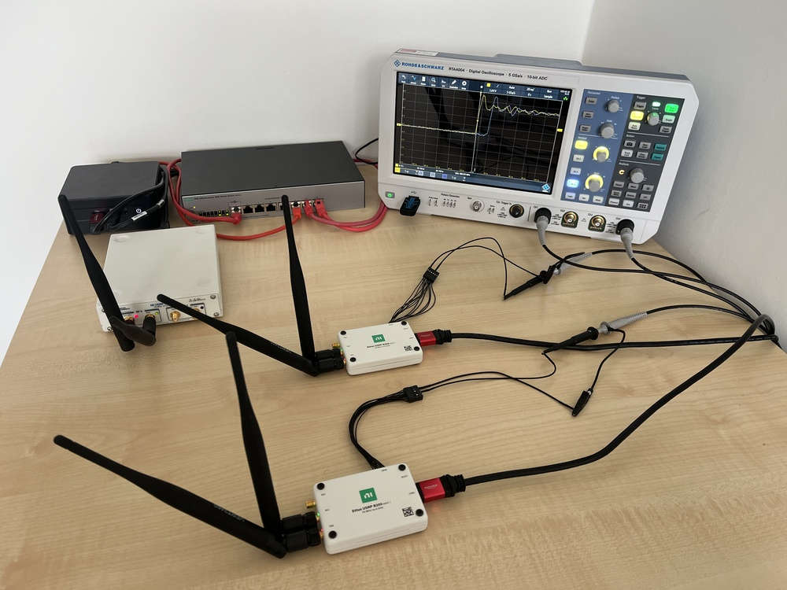
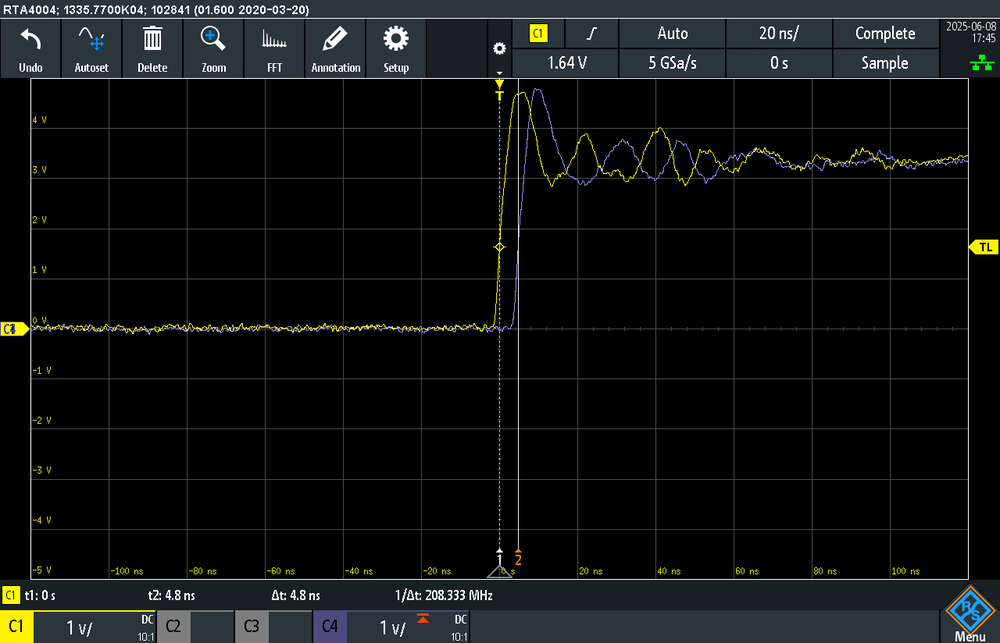

# Cracking the Microsecond: An Efficient and Precise Time Synchronization Scheme for Hybrid 5G-TSN Networks

**ArXiv ID**: 2511.14462v1
**URL**: http://arxiv.org/abs/2511.14462v1
**提交日期**: 2025-11-18
**作者**: Michael Gundall; Hans D. Schotten
**引用次数**: NULL
使用模型: ep-20251112215738-bz78g

## 1. 核心思想总结
这是一份针对论文《Cracking the Microsecond: An Efficient and Precise Time Synchronization Scheme for Hybrid 5G-TSN Networks》的第一轮总结，按四个部分组织如下：

**1. Background (背景)**
在工业物联网（IIoT）和5G网络中，许多关键应用（如工业自动化）要求亚微秒级的高精度时间同步。时间敏感网络（TSN）是实现有线网络高精度同步的标准，而将5G无线网络与TSN网络融合（形成5G-TSN混合网络）是实现柔性工业互联网的关键趋势。然而，当前5G无线侧缺乏专为IIoT设计的高精度同步硬件支持。

**2. Problem (问题)**
由于IIoT市场规模远小于消费电子市场，芯片厂商缺乏动力在5G设备中集成专用的高精度时间同步功能。这种“IIoT增强功能”在硬件层面缺失的现状短期内难以改变。因此，迫切需要一种能够利用现有商用基础设施（而非依赖定制硬件）来实现高精度无线时间同步的替代解决方案。

**3. Method (高层次方法)**
本文提出一种软件定义的同步方案。其核心思想是：在用户设备（UE）之间运行一种协议，将其中一个通过有线连接到工厂TSN网络的UE设为主节点（Master），该主节点可充当整个工厂网络的边界时钟。其他UE通过无线链路与主UE同步，而5G核心网和基站则可以通过连接到工厂网络或主UE来实现同步。该方案在由OpenAirInterface（OAI）和软件定义无线电（SDR）组成的硬件测试平台上实现，并采用移动平均滤波器（重点分析了1024的窗口大小）来分析和补偿时间偏移与时钟漂移。

**4. Contribution (贡献)**
本文的主要贡献在于提出并实证验证了一种高效、精确的同步方案。该方案的优势在于：**a）可行性**：不依赖尚未商用的专用硬件，能利用现有基础设施；**b）高性能**：在实验室受控环境下，实现了UE间±50纳秒的同步精度，为实际部署留有充足误差余量，同时确保亚微秒级精度；**c）系统性**：提供了一种端到端的5G-TSN混合网络同步框架，涵盖了UE、基站和核心网。实验结果证明了该协议能满足严苛工业用例的同步需求。

## 2. 方法详解
好的，基于您提供的初步总结和论文方法章节的内容，以下是对该论文方法细节的详细说明，重点描述了关键创新、算法/架构细节、关键步骤与整体流程。

---

### 论文《Cracking the Microsecond: ...》方法细节详解

本文的核心方法是设计一个**软件定义的、基于协议的同步方案**，以克服5G无线侧缺乏专用高精度同步硬件的限制。该方法不修改5G物理层或基站硬件，而是在应用层/用户层面实现，具有很高的实用性和可部署性。

#### 一、 关键创新

1.  **主从UE协同的无线边界时钟：**
    *   **核心创新点：** 将TSN网络中的**边界时钟**概念引入到无线域。传统TSN中，边界时钟通常是有线网络设备。本文创新性地将一个通过有线连接到TSN网络的用户设备（UE）指定为**主UE（Master UE）**，使其充当整个无线侧的“无线边界时钟”。
    *   **意义：** 主UE从有线TSN网络（如通过IEEE 802.1AS协议）获取高精度时间基准，然后通过无线链路将这个时间基准分发给其他**从UE（Slave UEs）**。这避免了让每个UE都直接与基站或核心网进行复杂同步，简化了流程并将同步误差源局部化在最后一跳的无线链路上。

2.  **基于软件定义的精密时钟补偿协议：**
    *   **核心创新点：** 设计了一套运行在主从UE之间的精密时间同步协议。该协议的核心不仅仅是测量时间偏移，更重要的是**持续估计和补偿时钟漂移**。
    *   **意义：** 晶体振荡器的频率偏差（时钟漂移）是导致同步误差随时间累积的根本原因。通过动态估计漂移率并进行补偿，该方案能够维持长期的、稳定的高精度同步，而不仅仅是瞬时的同步。

3.  **针对无线环境优化的移动平均滤波：**
    *   **核心创新点：** 在处理原始的时间戳数据时，明确采用了**移动平均滤波器**，并重点分析了**1024的窗口大小**这一参数。这不是一个简单的选择，而是经过权衡的优化策略。
    *   **意义：** 无线信道存在抖动和噪声。移动平均滤波能有效平滑这些短期波动，提供更稳定的时钟偏移和漂移估计。选择较大的窗口（如1024）虽然会引入一些延迟，但能极大地提高估计值的稳定性和精度，这对于亚微秒级同步至关重要。

#### 二、 算法/架构细节

##### 1. 系统架构

整个5G-TSN混合网络的同步架构分为三个层次，如附图所示：

*   **TSN有线网络：** 作为终极时间源，提供全局的、高精度的时间基准（Grandmaster Clock）。
*   **5G核心网与基站（gNB）：** 它们通过有线连接（例如，通过TSN网络或直接连接到主UE）从TSN网络同步其时间。在本文方案中，gNB和核心网主要作为**数据传输的通道**，而非时间同步的主处理者，这降低了对无线基础设施的同步要求。
*   **UE层：**
    *   **主UE：** 通过有线（如以太网）连接到TSN网络，运行边界时钟功能。它拥有两个时间基准：本地硬件时钟和从TSN获取的精确时间。它的任务是将其本地时钟校准到TSN时间，并作为参考源服务于从UE。
    *   **从UE：** 完全通过无线链路与主UE同步。

##### 2. 核心同步协议与算法

主从UE之间运行的同步协议类似于精密时间协议（PTP）的简化与优化版本，但其算法核心是针对无线环境和软件实现而设计的。

**a. 双向延迟交换与偏移/漂移计算**

协议通过周期性地交换同步消息来工作，每个周期包含以下关键步骤：

1.  **Sync 和 Follow_Up 消息：** 主UE在时间 \(T_1\) 发送一个Sync消息。由于软件处理延迟，精确的发送时间戳 \(T_1\) 可能无法在消息中携带，因此通常在一个紧随其后的Follow_Up消息中携带 \(T_1\)。
2.  **Delay_Req 和 Delay_Resp 消息：** 从UE在收到Sync消息后（时间 \(T_2\)），在时间 \(T_3\) 发送一个Delay_Req消息给主UE。主UE在时间 \(T_4\) 收到该消息，并将时间戳 \(T_4\) 通过Delay_Resp消息返回给从UE。

通过这一组时间戳 \(T_1, T_2, T_3, T_4\)，从UE可以计算：

*   **链路延迟：** \(delay = \frac{(T_2 - T_1) + (T_4 - T_3)}{2}\)
*   **时钟偏移：** \(offset = T_2 - T_1 - delay\)

然而，单纯的偏移计算没有考虑时钟漂移。因此，关键在于**连续测量**。

**b. 时钟漂移估计与补偿**

1.  **漂移率估计：** 从UE会连续记录多个周期计算出的 `offset`。通过观察 `offset` 随时间的变化率，可以估计出主从UE时钟之间的漂移率。例如，如果每个周期测得的 `offset` 都稳定增加（或减少）一个微小值，这个变化率就是漂移率。
2.  **移动平均滤波：** 在计算每个周期的 `offset` 和 `delay` 之后，原始数据会送入一个**移动平均滤波器**（文中重点提到窗口大小为1024）。这个步骤至关重要，它滤除了无线信道波动和操作系统调度带来的时间戳噪声，从而得到平滑、可靠的偏移和延迟估计值，为精确的漂移率计算打下基础。
3.  **时钟调整：** 从UE不再仅仅是简单地“跳变”自己的时钟来纠正 `offset`。而是采用一种**频率调整**和**相位调整**相结合的方式：
    *   **频率补偿：** 根据估计出的漂移率，微调从UE本地时钟的“滴答”速度（例如，通过调整软件时钟的计数频率），使其与主UE时钟频率保持一致。
    *   **相位补偿：** 在频率同步的基础上，再进行一次性的相位偏移校正，将时钟对齐。

这种“先驯服频率，再对齐相位”的方法，是实现长期稳定亚微秒同步的关键。

#### 三、 关键步骤与整体流程

整个方案的端到端流程可以概括为以下步骤：

1.  **网络初始化：**
    *   TSN网络内部通过IEEE 802.1AS等协议实现同步。
    *   5G核心网和gNB通过网络接口从TSN网络获取时间，完成自身同步。
    *   将一个UE通过有线连接到TSN网络，并将其配置为**主UE**。主UE与TSN网络同步，使其本地时钟成为无线侧的权威时间源。

2.  **无线同步建立阶段：**
    *   从UE通过5G无线网络接入。
    *   从UE与主UE之间建立连接，并开始运行上述的**精密同步协议**。
    *   初始阶段，从UE会收集多个周期（如1024个）的时间戳数据，通过滤波和计算，得到一个稳定的初始时钟偏移和漂移率估计。

3.  **连续同步与跟踪阶段：**
    *   同步协议持续运行。每个周期，从UE都会：
        a.  与主UE完成一次双向消息交换，获取新的时间戳 \(T_1\) 至 \(T_4\)。
        b.  计算本周期的原始偏移和延迟。
        c.  使用**移动平均滤波器**（窗口大小为1024）对原始数据进行平滑处理。
        d.  基于滤波后的数据，更新对时钟漂移率的估计。
        e.  应用新的频率和相位补偿值到本地时钟。
    *   这个闭环控制过程能够持续跟踪和补偿由于温度变化、设备老化等因素引起的时钟漂移变化。

4.  **端到端同步实现：**
    *   最终，所有从UE都与主UE保持高精度同步。
    *   由于主UE与TSN网络同步，而gNB/核心网也同步于TSN网络，因此整个5G-TSN混合网络（有线TSN设备、gNB、核心网、所有UE）都共享一个统一的、亚微秒精度的时间基准。

---

### 总结

本文的方法精髓在于**“软件定义”**和**“协议创新”**。它通过巧妙地将TSN的边界时钟概念无线化，设计了一套包含精密滤波和漂移补偿的软件协议，从而在现有的、未修改的5G商用硬件平台上，实现了以往需要专用硬件才能达到的亚微秒级时间同步精度。实验中使用OAI和SDR平台验证其达到±50纳秒的精度，强有力地证明了该方案的可行性和高效性。

## 3. 最终评述与分析
好的，结合前两轮返回的信息与论文的结论部分，现提供最终的综合评估如下：

### 论文《Cracking the Microsecond: An Efficient and Precise Time Synchronization Scheme for Hybrid 5G-TSN Networks》综合评估

**1. Overall Summary (整体总结)**

本论文针对5G与时间敏感网络（TSN）融合场景下，工业物联网（IIoT）应用对亚微秒级时间同步的迫切需求，提出了一个创新的软件定义解决方案。该方案的核心在于，它绕过了5G无线侧缺乏专用高精度同步硬件的限制，通过将一个有线连接至TSN网络的用户设备（UE）设为“主UE”，使其充当无线边界时钟，并设计了一套运行在主从UE之间的精密同步协议。该协议利用移动平均滤波（如1024点窗口）和动态时钟漂移补偿算法，在由OpenAirInterface和软件定义无线电构建的测试平台上，实现了用户设备间±50纳秒的同步精度。论文通过实证研究表明，该方案能够在不改变现有商用5G基础设施的前提下，为5G-TSN混合网络提供端到端的高精度时间同步能力。

**2. Strengths (优势)**

*   **创新性与实用性并重：** 提出的“无线边界时钟”概念和软件定义的协议层解决方案极具创新性，巧妙地将有线网络的成熟同步理念扩展到无线域。其最大的优势在于不依赖尚未普及的专用硬件，基于现有基础设施即可部署，实用价值高，落地路径清晰。
*   **高精度性能：** 在受控实验环境中达到了±50纳秒的同步精度，远超亚微秒级的要求，为实际部署中的各种不确定因素留下了充足的误差余量，性能表现卓越。
*   **系统性与端到端视角：** 方案设计涵盖了从TSN有线网络、5G核心网/基站到用户设备的整个链条，提供了一个完整的端到端同步框架，而非仅仅关注单个节点。
*   **对关键挑战的有效应对：** 方案明确针对并有效解决了时钟漂移这一导致同步误差累积的核心问题，通过动态估计和补偿机制，确保了长期同步的稳定性。同时，采用移动平均滤波有效抑制了无线信道抖动和软件时间戳噪声。
*   **实证支持有力：** 研究并非停留在仿真层面，而是基于OAI和SDR的硬件测试平台进行验证，增强了结论的可信度和说服力。

**3. Weaknesses / Limitations (局限性与不足)**

*   **实验环境的局限性：** 论文承认其±50纳秒的精度是在“实验室受控环境”下取得的。真实工业场景中的多径衰落、同频干扰、网络负载波动以及UE移动性等因素，可能对同步精度和稳定性带来挑战，其在实际复杂环境下的表现仍需进一步验证。
*   **可扩展性存疑：** 方案依赖于单个主UE作为同步源。当网络规模扩大（从UE数量显著增加）时，主UE可能成为性能和可靠性的瓶颈。大量从UE同时与主UE进行同步消息交换可能引发无线资源竞争和网络拥塞，其大规模部署下的可扩展性需要更深入的分析。
*   **对主UE的依赖与单点故障风险：** 主UE是整个无线同步系统的核心，其故障将导致整个无线侧同步失效。方案需要配套的高可用性机制（如主UE备份、快速切换）来应对这一单点故障风险，但这在论文中可能未充分探讨。
*   **资源开销：** 持续运行同步协议并进行高窗口大小的移动平均滤波，可能会增加UE的计算和通信开销，对电池供电的设备可能不适用。文中可能未详细分析其对设备能耗和系统总体资源消耗的影响。

**4. Potential Applications / Implications (潜在应用与意义)**

*   **工业自动化与工业4.0：** 该技术可直接应用于需要严格时序控制的场景，如高速运动控制、多机器人协同作业、闭环控制系统的无线化等，是实现柔性制造和“无线工厂”的关键使能技术。
*   **智能交通系统（ITS）与车联网（V2X）：** 为车辆间、车与基础设施间的高精度协同感知和决策提供统一的时间基准，提升交通安全与效率。
*   **智能电网：** 可用于电力系统的同步相量测量、故障定位与保护，提高电网的智能化水平和可靠性。
*   **学术与产业影响：** 为解决更广泛的无线高精度同步问题提供了新的思路（软件定义/协议层方案），减轻了对硬件升级的依赖，对后续研究和标准制定（如未来5G-Advanced/6G中的同步标准）具有重要的启发意义。它证明了在现有条件下实现极致性能的可能性，推动了5G与垂直行业的深度融合。

---
**最终评估总结：**
本论文是一项高质量、具有重要实践意义的研究。它针对一个明确且迫切的产业难题，提出了一个巧妙、创新且经过实证的解决方案。尽管其在真实环境下的鲁棒性、可扩展性和可靠性仍需在未来工作中进一步验证，但其核心思想、已达到的性能指标以及清晰的实用化路径，使其在5G-TSN融合领域乃至更广泛的无线高精度同步领域，都是一项突出的贡献。

---

# 附录：论文图片

## 图 1

## 图 2

## 图 3

## 图 4

