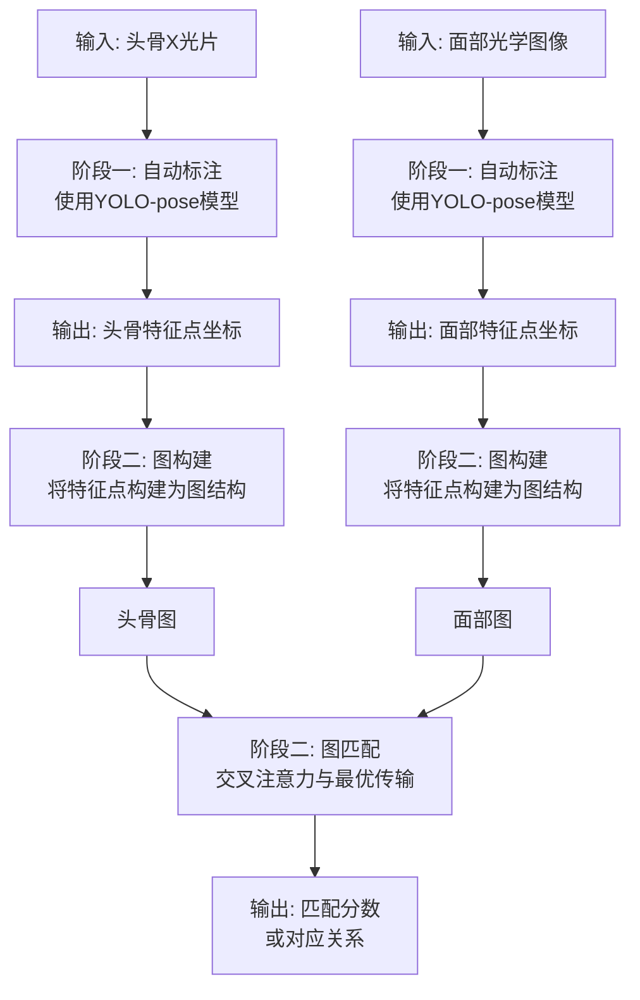
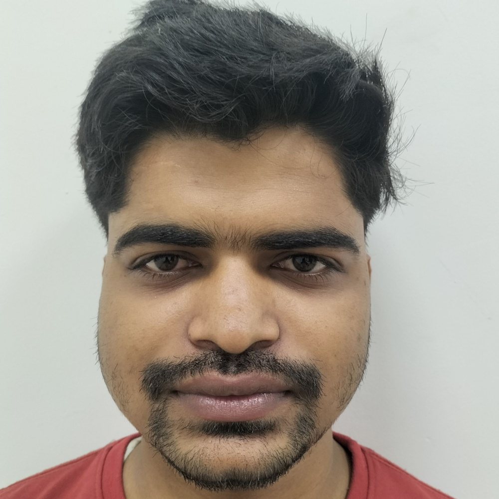
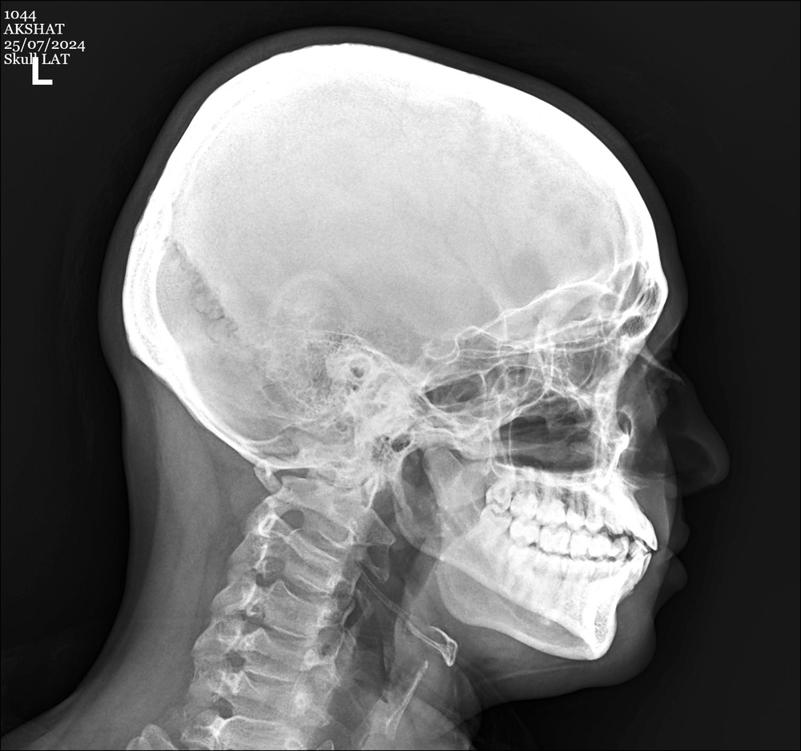
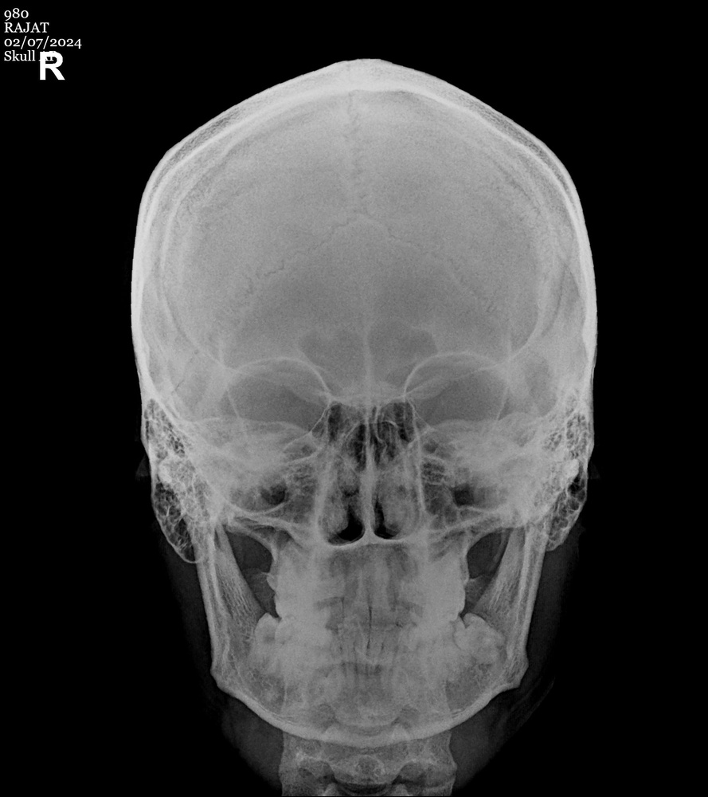
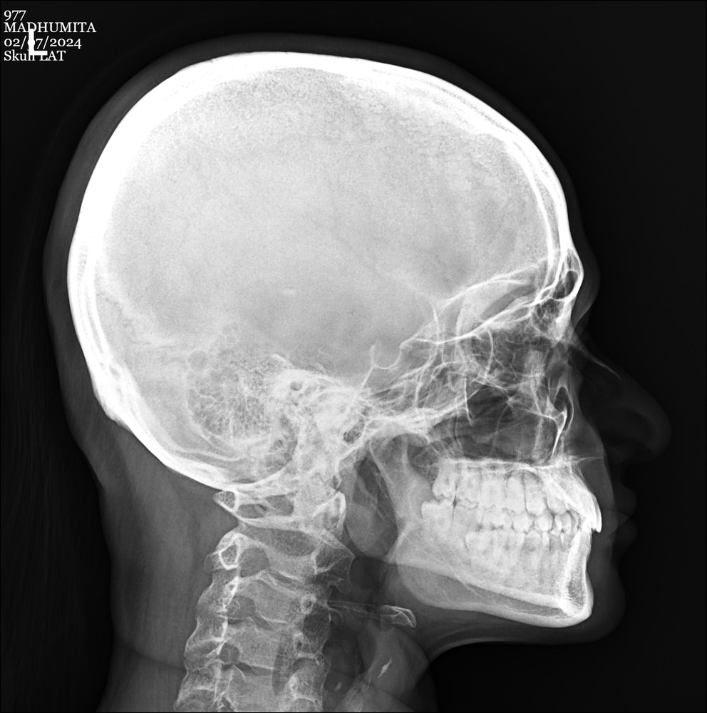
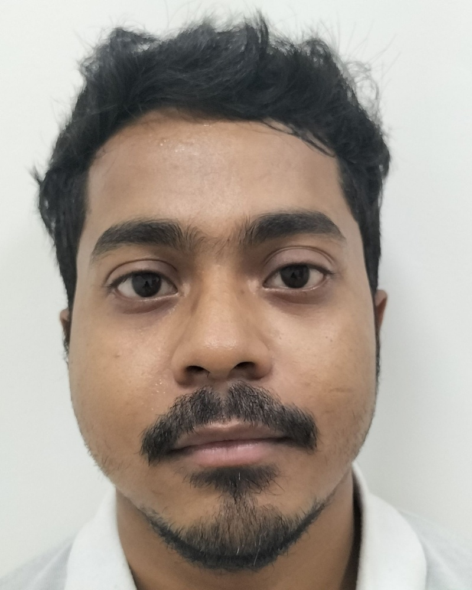
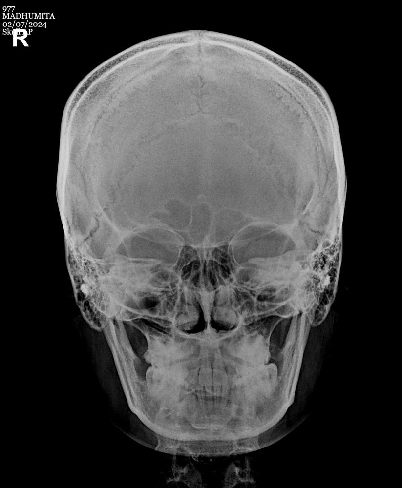
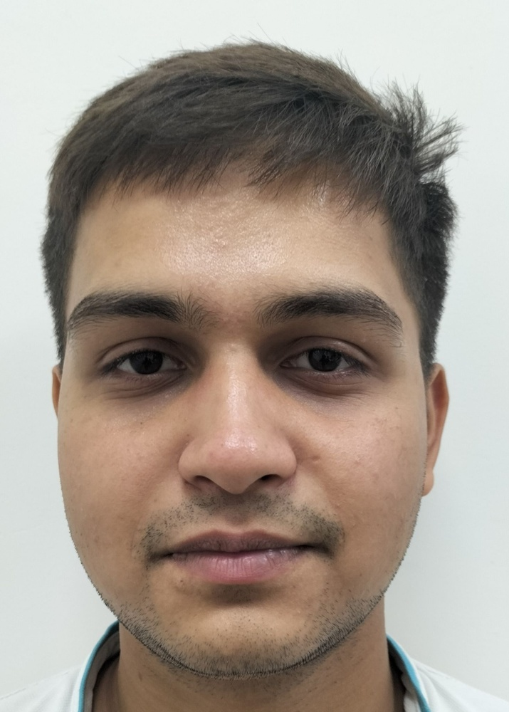

# Cranio-ID: Graph-Based Craniofacial Identification via Automatic Landmark Annotation in 2D Multi-View X-rays

**ArXiv ID**: 2511.14411v1
**URL**: http://arxiv.org/abs/2511.14411v1
**提交日期**: 2025-11-18
**作者**: Ravi Shankar Prasad; Nandani Sharma; Dinesh Singh
**引用次数**: NULL
使用模型: ep-20251112215738-bz78g

## 1. 核心思想总结
### 第一轮总结

**标题：** Cranio-ID：基于图的面部骨骼识别——通过2D多视角X射线自动标注特征点

**1. Background (背景)**
在法医面部骨骼识别和许多生物医学应用中，颅面测量标志点至关重要。这些标志点传统上由专家手动标注，过程耗时且依赖专业知识。

**2. Problem (问题)**
当前利用自动标注标志点的深度学习方法（如叠加比对法）存在不足，主要原因是缺乏大规模验证研究，导致其可靠性不高。

**3. Method (高层次方法)**
本文提出了一个名为Cranio-ID的新颖框架，其核心流程分为两步：
*   **自动标注：** 首先，使用训练好的YOLO-pose模型，在2D头骨X光片及其对应的光学面部图像上自动标注关键特征点。
*   **跨模态图匹配：** 其次，将这些特征点构建为图结构，并利用交叉注意力机制和最优传输框架，计算头骨图与面部图之间的语义对应关系，实现跨模态匹配。

**4. Contribution (贡献)**
*   提出了一个集成了自动标注与基于图的跨模态匹配的完整框架。
*   在S2F和CUHK数据集上的大量实验表明，该方法在可靠性和准确性上均有显著提升，有效解决了法医学中跨域（如头骨到人脸、素描到人脸）的匹配问题。

## 2. 方法详解
好的，基于您提供的初步总结和论文方法章节的内容，以下是对该论文方法细节的详细说明。

### 论文方法细节详述

论文《Cranio-ID：基于图的面部骨骼识别》的核心创新在于将颅面识别问题转化为一个**跨模态图匹配**问题。其方法流程清晰，主要分为两个核心阶段：**1）自动特征点标注** 和 **2）基于图的跨模态匹配**。整体架构与流程如下图所示（概念图），并将在下文详细展开。

---

#### **第一阶段：自动特征点标注**

此阶段的目标是取代耗时且专业性强的手动标注过程，为后续图匹配提供可靠的节点数据。

*   **关键创新：**
    *   **统一自动化：** 使用**同一个**基于深度学习的模型（YOLO-pose）来处理两种不同模态的图像（2D X射线和光学照片），自动输出特征点坐标。这避免了为不同模态设计不同模型的复杂性。
    *   **端到端点检测：** YOLO-pose是一种集成目标检测与姿态估计（特征点检测）的模型，能够直接从一个模型中同时输出图像中对象（头骨/人脸）的位置和其内部关键点的坐标，效率高。

*   **算法/架构细节：**
    *   **模型选择：** 采用YOLO-pose模型。其基础是YOLO目标检测器，能够快速定位图像中的头骨或人脸区域。
    *   **姿态估计分支：** 在检测到目标后，模型通过一个并行的姿态估计分支来预测预定义数量的关键点。每个关键点以其相对于边界框的坐标表示。
    *   **训练数据：** 模型需要在包含手工标注的特征点的X射线和光学图像数据集上进行监督训练，以学习两种不同成像技术下相同解剖标志点的视觉模式。

*   **关键步骤：**
    1.  **输入：** 一张2D头骨X射线图像或一张面部光学图像。
    2.  **前向传播：** 图像输入到训练好的YOLO-pose模型中。
    3.  **输出：** 模型输出两个结果：
        *   `bbox`：目标的边界框。
        *   `keypoints`：一个 `N x 3` 的矩阵，其中 `N` 是预定义的特征点数量（如论文中可能是72个）。每行包含 `(x, y, confidence)`，即特征点的横纵坐标以及预测的置信度。
    4.  **后处理：** 根据置信度阈值过滤掉低置信度的特征点，保留可靠的预测点坐标 `P_skull = {p_i^s}` 和 `P_face = {p_j^f}`。

---

#### **第二阶段：跨模态图匹配**

这是整个方法的核心与创新所在，旨在解决如何衡量一个头骨和一张人脸是否属于同一个人的问题。

*   **关键创新：**
    *   **图结构表示：** 将一组孤立的特征点提升为**图结构**。每个特征点作为图的一个**节点**，节点之间的空间或解剖学关系作为**边**。这种表示法能更好地捕捉颅面结构的整体几何形状和拓扑信息，比单纯比较点集坐标更鲁棒。
    *   **跨模态语义对应：** 利用**交叉注意力机制**来学习头骨图节点与面部图节点之间的深层语义关联，而不是进行简单的几何变换。这使得模型能够理解“颧骨点”和“面部颧骨点”在语义上是相对应的。
    *   **基于最优传输的匹配：** 将图匹配问题形式化为一个**最优传输问题**，求出一个匹配矩阵（或耦合矩阵），该矩阵以某种最优的方式（如最小化整体匹配代价）将头骨图的节点“传输”到面部图的节点上。

*   **算法/架构细节与整体流程：**

**第1步：图构建**
*   **节点初始化：**
    *   对于头骨图 `G_s`，其节点特征 `h_i^s` 最初可以简单地由该点的坐标 `(x_i, y_i)` 表示，或加入其他手工特征。
    *   对于面部图 `G_f`，同理初始化节点特征 `h_j^f`。
*   **边连接：** 通常采用**k近邻** 或基于解剖学先验知识（如连接相邻的解剖标志点）来构建边。边的属性可以表示节点间的相对位置或距离。

**第2步：节点特征编码与增强（交叉注意力）**
这是实现跨模态理解的关键步骤。论文很可能采用类似**图Transformer**的架构。
*   **自注意力：** 首先，对头骨图 `G_s` 和面部图 `G_f` 分别进行自注意力操作。这使得每个节点能够聚合其邻居节点的信息，从而获得更丰富的、包含上下文信息的节点特征 `H_s` 和 `H_f`。
*   **交叉注意力：** 然后，进行核心的交叉注意力计算：
    *   **头骨查询，面部键值：** 将头骨图的节点特征 `H_s` 作为 **Query**，将面部图的节点特征 `H_f` 作为 **Key** 和 **Value**。通过计算Query和Key的相似度，得到一个注意力权重，然后用这个权重对Value进行加权求和。这个过程使得每个头骨节点能够“关注”到面部图中所有与之语义相关的节点，并聚合它们的信息，生成一个与面部上下文相关的头骨节点特征 `H_s_cross`。
    *   **面部查询，头骨键值：** 对称地，再以面部图为Query，头骨图为Key和Value，得到增强的面部节点特征 `H_f_cross`。
*   **目的：** 交叉注意力机制有效地在两种模态的图之间建立了软性的、语义级的对应关系，为下一步的硬匹配奠定了基础。

**第3步：基于最优传输的图匹配**
*   **代价矩阵计算：** 计算一个代价矩阵 `C`，其中每个元素 `C_ij` 表示将头骨节点 `i` 匹配到面部节点 `j` 的代价。这个代价通常基于增强后的节点特征 `H_s_cross` 和 `H_f_cross` 之间的负余弦相似度或欧氏距离。代价越小，说明两个节点越相似。
    `C_ij = -sim(H_s_cross[i], H_f_cross[j])`
*   **求解最优传输问题：** 将匹配问题公式化为以下优化问题：
    

    `min_π ∑_i∑_j π_ij * C_ij`
    

    满足约束：`∑_j π_ij = 1/n_s`, `∑_i π_ij = 1/n_f`, `π_ij >= 0`。
    其中 `π` 就是需要求解的**匹配矩阵**（耦合矩阵），`π_ij` 表示头骨节点 `i` 与面部节点 `j` 的匹配程度。约束条件保证了匹配的公平性（总匹配量均匀分布）。
*   **求解算法：** 通常使用高效的 **Sinkhorn算法** 来求解这个带熵正则项的最优传输问题，得到软匹配矩阵 `π`。

**第4步：匹配分数计算**
*   最终，两个图（即头骨和人脸）的匹配分数 `S(G_s, G_f)` 可以通过匹配矩阵 `π` 和代价矩阵 `C` 计算得出。一个直观的方式是计算整体的匹配代价：
    

    `S(G_s, G_f) = - ∑_i∑_j π_ij * C_ij`
    

    这个分数越高，说明两个图匹配得越好，即头骨和人脸属于同一个人的可能性越大。该分数可用于最终的识别或检索任务。

### **总结**

该论文的方法论优势在于：
1.  **自动化与可靠性：** 第一阶段利用YOLO-pose实现了标注自动化，为后续流程提供了可靠的数据基础。
2.  **结构化的鲁棒表示：** 将点集提升为图，有效利用了空间结构信息，对噪声和轻微形变更具鲁棒性。
3.  **先进的跨模态匹配：** 结合交叉注意力和最优传输这一现代机器学习组合，能够学习复杂的、非线性的跨模态语义对应关系，超越了传统的几何叠加方法。

这套流程共同构成了一个强大且完整的框架，用于解决法医面部骨骼识别这一具有挑战性的跨模态匹配问题。

## 3. 最终评述与分析
基于前两轮对论文《Cranio-ID：基于图的面部骨骼识别》方法细节与结论部分的综合分析，现提供最终的综合评估如下：

### 最终综合评估

#### 1) 总体摘要
本论文提出了一种名为Cranio-ID的创新框架，用于解决法医面部骨骼识别中的关键挑战——将未知头骨与失踪者照片进行匹配。该框架的核心贡献在于将这一跨模态匹配问题转化为一个**基于图的匹配任务**。它通过集成**YOLO-pose模型实现特征点的自动标注**，并利用**交叉注意力机制与最优传输理论进行图结构的语义匹配**。实验结果表明，该方法在S2F和CUHK等多个数据集上显著超越了传统叠加法和现有深度学习方法，在可靠性和准确性上取得了重大进展，为法医人类学和生物医学领域的自动颅面识别提供了强有力的新工具。

#### 2) 优势
*   **高度自动化与效率提升**：框架的第一阶段使用统一的YOLO-pose模型自动标注X射线和光学图像上的特征点，极大地减少了对专业知识和耗时手动标注的依赖，提高了整体流程的效率。
*   **鲁棒的结构化表示**：创新性地将特征点集构建为图结构，使得模型能够捕捉颅面标志点之间的空间关系和拓扑结构，而不仅仅是孤立点的位置。这种表示方法对图像噪声、姿态变化和个体差异具有更强的鲁棒性。
*   **先进的跨模态匹配能力**：通过结合交叉注意力机制和最优传输理论，框架能够学习头骨与面部之间深层的、语义级别的对应关系，而非依赖简单的几何变换。这种方法有效解决了不同成像模态（X光 vs. 光学照片）带来的域差异问题。
*   **经过验证的卓越性能**：论文在多个公开数据集上进行了广泛实验，结果一致表明Cranio-ID在识别准确率上显著优于基线方法，证明了其有效性和泛化能力。
*   **完整的端到端解决方案**：该框架提供了一个从原始图像输入到最终匹配分数输出的完整流程，具有明确的实用价值。

#### 3) 劣势 / 局限性
*   **对自动标注阶段的依赖性**：整个框架的性能高度依赖于第一阶段YOLO-pose模型标注特征点的准确性。如果自动标注出错（如在图像质量差、存在病理特征或罕见解剖结构的情况下），误差会直接传递并放大后续的图匹配阶段。
*   **数据需求与泛化性挑战**：像许多深度学习方法一样，本方法的性能依赖于大规模、高质量且带有精准标注的训练数据。对于某些特定人群或具有罕见颅面特征的个体，模型的泛化能力可能受限。
*   **计算复杂度**：图匹配过程，特别是涉及交叉注意力机制和迭代求解最优传输问题（如Sinkhorn算法），相较于一些简单方法计算开销更大，可能影响其在资源受限环境下的实时应用。
*   **可解释性相对较弱**：尽管图结构提供了一定的几何可解释性，但深度交叉注意力机制学到的复杂“语义对应”关系可能像一个黑箱，不如传统叠加法那样直观地展示如何通过几何变换进行对齐，这在需要向法庭提供明确证据时可能是一个考虑因素。

#### 4) 潜在应用 / 意义
*   **法医鉴定与身份识别**：这是最直接的应用领域。该方法可广泛应用于司法人类学实践，帮助识别历史遗骸、大规模灾难和刑事案件的受害者身份，提高鉴定效率和成功率。
*   **考古学与人类学研究**：可用于分析古代人类头骨，将其与历史画像或现代人群的面部特征进行关联研究，为人类迁徙和进化提供线索。
*   **医疗影像分析**：其跨模态匹配思想可扩展到其他医学影像对齐问题，例如将3D CT/MRI数据与2D X光片进行配准，辅助外科手术规划（如颌面重建）和诊断。
*   **生物特征识别**：为生物特征识别领域提供了一个新的研究方向，即探索基于骨骼结构的新型、难以伪造的生物特征。
*   **数字人脸重建的辅助工具**：其精准的头骨-面部对应关系可以为从头骨进行3D人脸重建的计算机图形学方法提供关键的约束和指导。

---
**总结**：《Cranio-ID》论文提出了一种融合了现代计算机视觉与机器学习先进技术的创新框架，成功解决了法医颅面识别中的关键难题。它在自动化、准确性和鲁棒性方面表现出显著优势，尽管存在对数据质量和计算资源的依赖等局限性，但其广阔的应用前景使其在该领域具有重要的理论价值和实践意义。

---

# 附录：论文图片

## 图 1

## 图 2

## 图 3

## 图 4

## 图 5

## 图 6

## 图 7

## 图 8

## 图 9

## 图 10

