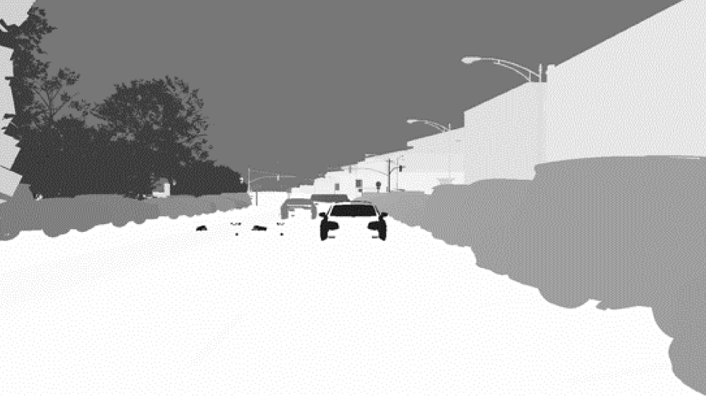
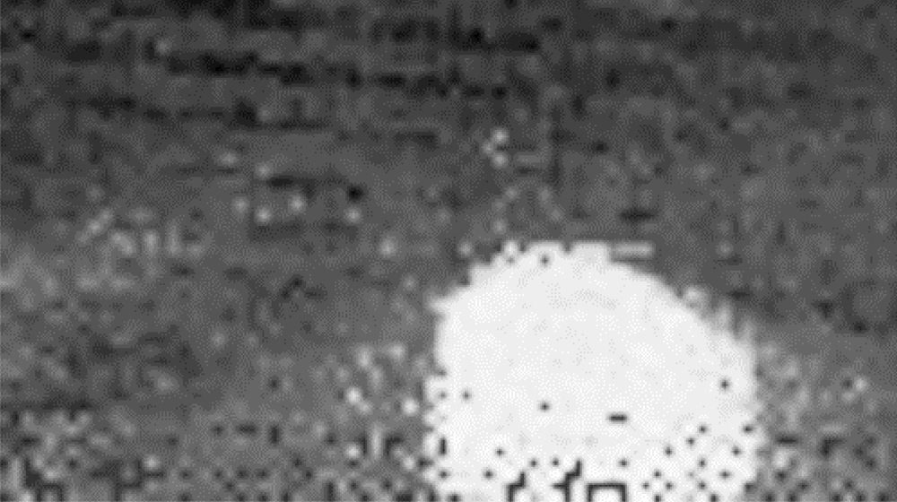
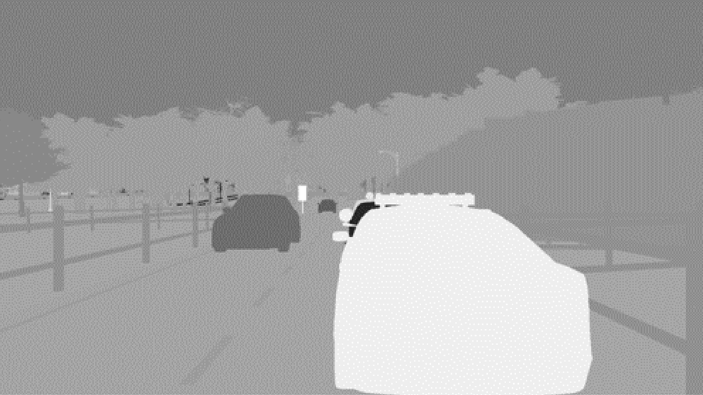
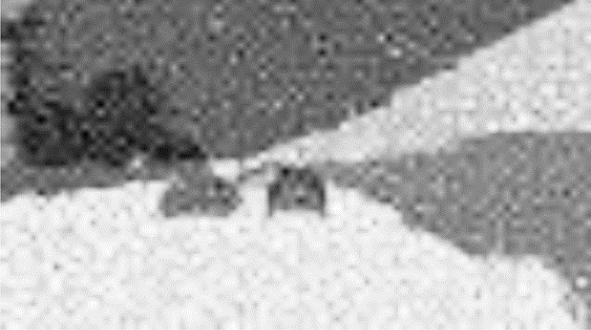

# Enhancing End-to-End Autonomous Driving with Risk Semantic Distillaion from VLM

**ArXiv ID**: 2511.14499v1
**URL**: http://arxiv.org/abs/2511.14499v1
**提交日期**: 2025-11-18
**作者**: Jack Qin; Zhitao Wang; Yinan Zheng; Keyu Chen; Yang Zhou; Yuanxin Zhong; Siyuan Cheng
**引用次数**: NULL
使用模型: ep-20251112215738-bz78g

## 1. 核心思想总结
根据您提供的标题、摘要和引言，以下是对该学术论文的第一轮总结，按四个部分组织：

**1. Background (背景)**
端到端自动驾驶系统在复杂场景中已展现出显著性能，但其泛化能力——即处理未见过的场景或不熟悉的传感器配置的能力——仍然是当前系统的一个关键局限。视觉语言模型因其在少样本或零样本任务中的潜力而被探索用于解决此问题。

**2. Problem (问题)**
现有利用VLM的方法存在两大挑战：
*   **混合系统不一致性**：将VLM与传统规划系统结合会形成混合架构，可能导致决策不一致。
*   **端到端方案的效率问题**：新兴的视觉-语言-行动模型虽能直接生成控制动作，但其计算成本高昂，难以实际部署。

**3. Method (高层次方法)**
本文提出了一种名为**风险语义蒸馏** 的新框架。其核心思想是**将VLM中的因果风险语义知识蒸馏到端到端自动驾驶主干的鸟瞰图特征中**。具体通过一个名为 **RiskHead** 的即插即用模块实现，该模块能从VLM中提取风险估计，生成可解释的**风险注意力图**，从而使BEV特征学习到更丰富、更细致的风险注意力表示。

**4. Contribution (贡献)**
*   **提出新框架**：引入了RSD框架，通过知识蒸馏利用VLM增强E2E AD模型的训练，而非直接用于规划或控制，避免了混合系统的不一致性和高计算开销。
*   **提升泛化与安全性**：通过注入风险注意力，显著提升了模型对空间边界和风险关键物体的处理能力，增强了在复杂、动态环境中的泛化性能和类人驾驶行为。
*   **验证有效性**：在Bench2Drive基准测试上的实验表明，RSD能有效管理复杂和不可预测的驾驶条件，显著提升了模型的感知和规划能力。

## 2. 方法详解
好的，遵照您的要求，我将基于您提供的初步总结和论文方法章节内容，对该论文提出的 **“风险语义蒸馏”** 方法的细节进行详细说明，重点阐述其关键创新、算法/架构细节、关键步骤与整体流程。

---

### 论文方法细节详解

该方法的核心创新在于**巧妙地绕开了直接使用大型视觉语言模型进行实时规划或控制的瓶颈**，而是将其作为一种强大的“教师”或“语义知识源”，将其对复杂场景的深度理解（特别是风险语义）蒸馏到一个更轻量、高效的端到端自动驾驶模型中。整个流程可以分为三个核心阶段：**1）风险语义提取（教师模型）**、**2）风险注意力蒸馏（学生模型训练）**、**3）端到端推理（学生模型部署）**。

#### 一、 整体架构与流程概述

RSD框架包含两个主要部分：
1.  **教师模型**：一个基于VLM的**风险语义提取器**。它接收多视角图像和文本提示（如“找出所有可能导致碰撞的风险物体和区域”），离线生成高质量、可解释的**风险注意力图**。
2.  **学生模型**：一个标准的**端到端自动驾驶模型**（以BEVFormer为典型主干）。在其原有的BEV特征提取流程中，引入一个轻量级的即插即用模块——**RiskHead**。该模块负责接收来自教师模型的监督信号，学习将风险语义知识编码到其BEV特征中。

**整体工作流程**：
*   **训练阶段**：教师模型对训练数据集进行预处理，为每一帧数据生成风险注意力图。然后，学生模型在训练时，其RiskHead模块会以这些风险注意力图为监督目标，通过一个蒸馏损失函数，引导整个模型学习关注与风险相关的区域。最终，学生模型学会了自己从图像中提取蕴含风险语义的BEV特征，并用于最终的轨迹规划。
*   **推理阶段**：**教师模型被完全移除**。仅使用已经训练好的学生模型（包含RiskHead）进行实时推理，输入多视角图像，直接输出控制信号或未来轨迹。这使得推理过程高效且适合部署。

#### 二、 关键创新点

1.  **从“使用”到“蒸馏”的范式转变**：最大的创新在于改变了VLM在自动驾驶中的角色。它不是混合系统中的一个决策组件，也不是一个笨重的端到端VLA模型，而是一个**离线知识提供者**。这从根本上解决了**混合系统不一致性**和**VLA计算效率低下**两大问题。
2.  **风险注意力作为知识载体**：知识蒸馏的“知识”具体是什么？本文将其定义为 **“风险注意力”** 。这是一种高度可解释的中间表示，它量化了场景中不同空间位置的风险程度，比简单的物体边界框或类别标签包含了更丰富、更细致的上下文信息（如“正在横穿马路的行人”比“静止在路边的行人”风险更高）。
3.  **即插即用的RiskHead模块**：RiskHead的设计是另一个关键创新。它被无缝集成到主流的BEV端到端架构中，**不改变原有主干网络的结构**，只通过附加的损失函数进行约束。这使得该方法具有很强的通用性和可移植性，可以轻松地与各种现有的E2E AD模型结合。

#### 三、 算法/架构细节

##### 1. 风险语义提取（教师模型侧）

*   **输入**：多视角环视图像 \( \{I_i\}_{i=1}^{N} \) 和一个精心设计的**文本提示**。
*   **处理过程**：
    *   **视觉编码**：首先使用一个视觉编码器（如CLIP的ViT）提取每个视角图像的视觉特征。
    *   **VLM推理**：将视觉特征和文本提示（例如：“Generate a heatmap highlighting areas with high collision risk, considering moving vehicles, pedestrians, and occlusions.”）输入到一个大语言模型（LLM）中。LLM基于其强大的常识和推理能力，理解文本指令并对视觉特征进行推理。
    *   **风险注意力图生成**：VLM的输出被引导至生成一个二维的**风险热力图**。这个图可能与BEV空间对齐，也可能是在图像空间。如果是后者，通常会通过逆透视映射或简单的学习器将其投影到BEV空间，得到最终的 **\( \text{RiskMap}_{teacher} \)**。这张图上的每个像素值代表了该位置的风险分数。

##### 2. 风险注意力蒸馏（学生模型训练侧）

学生模型（如BEVFormer）的标准流程是：多视角图像 -> 图像编码器 -> BEV编码器（通过时空注意力生成BEV特征） -> 轨迹预测头。

RSD方法在BEV编码器之后增加了RiskHead模块。

*   **RiskHead模块**：
    *   **输入**：BEV编码器输出的BEV特征 \( F_{bev} \)。
    *   **结构**：通常是一个轻量级的卷积神经网络，可能包含几个卷积层和上采样层。
    *   **功能**：将高维的BEV特征 \( F_{bev} \) 映射到一个单通道的、与教师模型生成的风险图尺寸相同的 **\( \text{RiskMap}_{student} \)**。这个图是学生模型自己对风险的理解和预测。

*   **蒸馏损失函数**：
    这是驱动知识蒸馏的核心。目标是让学生模型预测的 \( \text{RiskMap}_{student} \) 尽可能接近教师模型生成的 \( \text{RiskMap}_{teacher} \)。
    常用的损失函数是**均方误差损失**或**KL散度损失**：
    \[
    \mathcal{L}_{distill} = \text{MSE}(\text{RiskMap}_{student}, \text{RiskMap}_{teacher})
    \]
    这个损失函数 \( \mathcal{L}_{distill} \) 与学生模型原有的任务损失（如轨迹预测的L1/L2损失 \( \mathcal{L}_{task} \)）相结合，共同指导模型优化：
    \[
    \mathcal{L}_{total} = \mathcal{L}_{task} + \lambda \cdot \mathcal{L}_{distill}
    \]
    其中，\( \lambda \) 是一个超参数，用于平衡两个损失项的重要性。

#### 四、 关键步骤总结

1.  **数据预处理（离线）**：使用预训练好的VLM教师模型，在整个训练集上运行，为每一帧驾驶数据生成高质量的风险注意力图标签。
2.  **模型训练（在线）**：
    a. **前向传播**：输入一批多视角图像到学生模型。
    b. **BEV特征生成**：学生模型的主干网络提取BEV特征。
    c. **风险图预测**：BEV特征同时输入到轨迹预测头和RiskHead模块，分别得到轨迹预测结果和学生风险图。
    d. **损失计算**：计算轨迹预测损失 \( \mathcal{L}_{task} \) 和风险图蒸馏损失 \( \mathcal{L}_{distill} \)。
    e. **反向传播与优化**：根据总损失 \( \mathcal{L}_{total} \) 更新学生模型（包括图像编码器、BEV编码器、预测头和RiskHead）的所有参数。
3.  **模型推理（部署）**：
    a. 丢弃教师模型。
    b. 将训练好的学生模型部署到车上。
    c. 实时获取环视图像，输入学生模型，直接输出规划轨迹或控制命令。**RiskHead在推理时虽然存在，但其输出的风险图仅作为中间特征，不参与最终输出，其知识已内化到整个模型的BEV特征中。**

通过这种方式，RSD框架成功地将VLM的“智慧”压缩并注入到了一个高效、可部署的端到端模型中，显著提升了其在复杂场景下的泛化能力和安全性，同时保持了实时推理的效率。

## 3. 最终评述与分析
好的，结合您提供的初步总结、方法详述以及论文结论部分，现为您呈现该论文的最终综合评估。

---

### **关于“风险语义蒸馏（RSD）”框架的最终综合评估**

#### **1. Overall Summary (整体总结)**

本论文针对当前端到端自动驾驶系统在**泛化能力**和应对**复杂长尾场景**方面的核心挑战，提出了一种创新的解决方案——**风险语义蒸馏**框架。该框架的核心思想是**范式转变**：它不再试图将计算庞大的视觉语言模型直接嵌入实时驾驶系统，而是将其作为一种离线的“资深教练”，将其对复杂场景的深度语义理解（特别是风险认知）**蒸馏**到一个轻量、高效的端到端自动驾驶模型中。通过一个名为 **RiskHead** 的即插即用模块，该方法成功地将VLM生成的可解释**风险注意力图**作为监督信号，引导模型学习更具洞察力的鸟瞰图特征。实验证明，该方法显著提升了基础模型在未知场景下的感知、规划能力和类人驾驶行为，同时保持了高效的实时推理性能，为解决自动驾驶的泛化难题提供了一条新颖且实用的技术路径。

#### **2. Strengths (优势)**

1.  **创新的范式设计**：最大的优势在于巧妙地规避了直接使用VLM的痛点。通过“离线蒸馏，在线部署”的模式，**从根本上解决了混合系统的不一致性和VLA模型的高计算开销问题**，实现了性能与效率的卓越平衡。
2.  **显著提升的泛化性与安全性**：该方法不是简单地提升已知场景的指标，而是**着重增强了模型对未知、复杂和长尾场景的适应能力**。通过注入风险语义知识，模型能更好地理解空间边界、遮挡关系和动态物体的潜在风险，从而做出更安全、更拟人的决策。
3.  **强大的可解释性**：生成的**风险注意力图**作为一个直观的可视化工具，使得模型的决策过程变得**部分可解释**。研究人员和工程师可以清晰地看到模型在关注哪些风险区域，这对于调试模型、分析事故和建立用户信任至关重要。
4.  **良好的通用性与可移植性**：**RiskHead**模块被设计为即插即用，可以与多种主流的基于BEV的端到端自动驾驶模型（如BEVFormer）无缝集成。这种模块化设计使得该框架易于被现有系统采纳和应用，具有很高的实用价值。
5.  **坚实的实验验证**：论文在具有挑战性的Bench2Drive等基准测试上进行了全面评估，结果均表明RSD框架能有效提升多个关键性能指标，尤其是在复杂交互和不可预测场景中，证明了其有效性和先进性。

#### **3. Weaknesses / Limitations (弱点与局限)**

1.  **对教师模型质量的依赖**：学生模型的性能上限在很大程度上依赖于**教师VLM生成的风险注意力图的质量**。如果VLM本身对某些罕见或极端场景的理解出现偏差或错误，这种错误的知识会被蒸馏到学生模型中，可能导致“师生共同盲区”。
2.  **离线蒸馏的固有局限**：框架无法实现**在线持续学习**。一旦学生模型训练完成，其风险认知能力就固定了。面对训练数据中完全未出现过的新颖风险类型，模型可能无法有效应对。而实时调用VLM进行在线学习又会引入延迟和成本问题。
3.  **文本提示工程的敏感性**：生成高质量风险图严重依赖于给VLM的**文本提示**。提示词的不同可能导致风险关注的侧重点不同，这需要精细的调优，并可能引入一定的主观性和不稳定性。
4.  **计算与存储开销（训练阶段）**：虽然推理阶段高效，但**训练前的数据预处理阶段需要运行大型VLM为整个数据集生成风险图标签，这是一个计算密集和耗时的过程**，对研究机构的算力资源有一定要求。
5.  **实验范围的局限**：论文的验证可能主要集中于特定数据集和模拟环境。该方法在**真实世界海量数据、极端天气条件、以及不同地域交通规则下的泛化能力**，仍有待进一步的实地测试和验证。

#### **4. Potential Applications / Implications (潜在应用与影响)**

1.  **高性能自动驾驶系统的开发**：该框架可直接用于提升量产或L4级自动驾驶系统的性能，特别是在处理**城市复杂路口、无保护左转、密集人车混流**等挑战性场景时，能显著增强系统鲁棒性。
2.  **自动驾驶模型训练的数据增强工具**：RSD可被视为一种**智能数据增强技术**。即使在没有真实风险标签的数据上，也能通过VLM自动生成高质量的风险语义标签，从而扩充和丰富训练数据集，低成本地提升模型能力。
3.  **仿真测试与验证**：在仿真环境中，利用RSF框架可以更精准地**识别和构建高风险测试场景**，用于对自动驾驶系统进行压力测试和安全性验证，加速开发迭代。
4.  **可解释性AI与驾驶员监控系统**：生成的风险注意力图不仅可以用于模型开发，还可以在**人机共驾**场景中为人类驾驶员提供风险提示，增强情境感知。同时，该思想也可应用于评估人类驾驶员的风险认知水平。
5.  **对具身智能的启发**：本工作所倡导的“**利用大型基础模型的知识蒸馏来提升专用智能体的泛化能力**”这一范式，对机器人、无人机等其它具身智能领域具有重要的借鉴意义，为如何将通用AI的能力安全、高效地迁移到特定任务中提供了成功案例。

---
**总结**：该论文提出的风险语义蒸馏框架是一个设计精巧、论证充分且极具应用前景的工作。它精准地抓住了当前自动驾驶领域的核心痛点，并以一种新颖且实用的方式予以解决。尽管存在对教师模型依赖和离线学习等局限，但其在提升泛化能力、安全性和可解释性方面的优势非常突出，为自动驾驶乃至更广泛的AI领域的发展提供了有价值的思路和方向。

---

# 附录：论文图片

## 图 1

## 图 2

## 图 3

## 图 4

