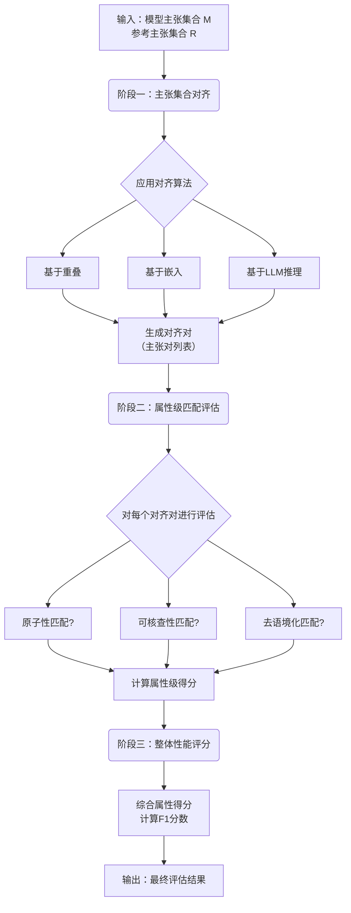

# Examining the Metrics for Document-Level Claim Extraction in Czech and Slovak

**ArXiv ID**: 2511.14566v1
**URL**: http://arxiv.org/abs/2511.14566v1
**提交日期**: 2025-11-18
**作者**: Lucia Makaiová; Martin Fajčík; Antonín Jarolím
**引用次数**: NULL
使用模型: ep-20251112215738-bz78g

## 1. 核心思想总结
这是一份关于文档级主张提取评估方法论文的第一轮总结，按四个部分组织如下：

**1. Background (背景)**
文档级主张提取是事实核查领域一个尚未解决的挑战。当前，用于评估所提取主张质量的方法研究有限，尤其是在处理捷克语和斯洛伐克语这类非正式语言、强本地语境且紧密相关的语言时，现有评估方法的局限性更加突出。

**2. Problem (问题)**
核心问题是如何可靠地评估文档级主张提取模型的性能。具体而言，即缺乏有效的方法来比较模型提取的主张集合与人工标注的参考集合之间的相似性，并准确衡量关键主张属性（如原子性、可核查性和去语境化）的匹配程度。

**3. Method (high-level) (方法 - 高层次)**
本文提出了一种评估框架，其核心思想是通过“对齐”技术来匹配两个主张集合（如模型输出与人工标注），并计算它们的对齐分数作为相似性度量。作者系统性地探索了不同的对齐和评估技术，并在一个新收集的捷克语和斯洛伐克语新闻评论数据集上进行了实验验证。

**4. Contribution (贡献)**
主要贡献包括：
*   提出了一个用于评估文档级主张提取性能的、基于主张集合对齐的通用框架。
*   该框架不仅能评估模型性能，还可用于衡量标注者间的一致性。
*   通过实验揭示了当前评估方法在处理复杂语言特性时的不足，强调了开发更能捕捉语义相似性和关键主张属性的高级评估方法的必要性。

## 2. 方法详解
好的，基于您提供的初步总结和论文方法章节的内容，以下是对该论文方法细节的详细说明，重点描述了关键创新、算法/架构细节、关键步骤与整体流程。

### 论文方法细节详述

该方法的核心是一个**基于集合对齐的评估框架**，其根本思想是：评估文档级主张提取模型的性能，等同于衡量模型输出的主张集合与人工标注的参考主张集合之间的相似度。实现这一目标的关键在于如何精准地“对齐”两个集合中的主张。

#### 一、 关键创新

1.  **主张集合对齐的评估范式**：将评估问题从传统的“分类正确率”转变为“集合相似度比较”。这更符合文档级主张提取的任务本质，因为一个文档可能存在多个有效主张，且模型提取的主张在表述和数量上可能与人工标注不完全一致。
2.  **系统化的对齐技术探索**：论文没有局限于单一的对齐方法，而是系统地探索和比较了三种不同复杂度的对齐技术，从基于词汇重叠的简单方法到基于语义嵌入的复杂方法，揭示了不同方法在不同评估维度上的优劣。
3.  **多维度属性匹配**：在成功对齐主张对之后，框架不仅进行简单的“匹配/不匹配”判断，而是进一步分解并评估三个关键主张属性（原子性、可核查性、去语境化）的匹配程度，提供了更细粒度的性能分析。

#### 二、 算法/架构细节与关键步骤

整个评估流程可以分解为三个主要阶段，其整体架构与流程如下图所示：

**阶段一：主张集合对齐**

此阶段的目标是建立模型主张集合 \( M \) 和参考主张集合 \( R \) 之间的映射关系。论文探索了三种算法：

1.  **基于重叠的对齐**
    *   **细节**：这是一种基于词汇的精确匹配方法。首先，对每个主张进行预处理（如分词、去除停用词、词形还原）。然后，使用集合交集运算（如Jaccard相似度）或字符串匹配（如Levenshtein距离）来计算主张之间的表面相似度。最后，采用贪心算法或匈牙利算法来寻找一个全局最优的匹配方案，使得所有匹配对的相似度总和最大。
    *   **关键步骤**：文本预处理 -> 计算主张间相似度矩阵 -> 应用分配算法求解最优对齐。

2.  **基于嵌入的对齐**
    *   **细节**：这种方法捕捉语义相似性。首先，使用一个预训练的多语言句子嵌入模型（例如，Sentence-BERT）将每个主张编码为一个高维向量。然后，计算主张向量之间的余弦相似度，形成一个相似度矩阵。与基于重叠的方法类似，最后使用分配算法（如匈牙利算法）找到最优的语义对齐。
    *   **关键步骤**：使用Sentence-BERT生成主张向量 -> 计算余弦相似度矩阵 -> 应用分配算法求解最优对齐。
    *   **创新点**：能够处理表述不同但语义相近的主张（如“市长说税收会下降” vs. “据市长称，税率将被降低”），优于单纯的词汇匹配。

3.  **基于大型语言模型推理的对齐**
    *   **细节**：这是最复杂且最智能的方法。利用LLM（如GPT-4）的推理能力来判断两个主张是否表达了相同的核心事实。具体做法是，将一对主张 \( (m_i, r_j) \) 连同详细的指令提示（Prompt）一起输入LLM。指令会要求模型判断这两个主张在语义上是否匹配，并可能要求其解释理由。
    *   **关键步骤**：构建针对对齐任务的复杂Prompt -> 将候选主张对批量送入LLM -> 解析LLM的输出（如“是”/“否”）作为匹配结果。由于LLM调用成本高，通常会先使用一种更便宜的方法（如基于嵌入的方法）筛选出高潜力的候选对，再交由LLM做精确判断。
    *   **创新点**：理论上这是最强大的对齐方式，因为它能理解语言中的细微差别、隐含信息和上下文依赖。

**阶段二：属性级匹配评估**

在获得对齐的主张对 \( (m, r) \) 之后，需要对每一对进行精细评估。这是框架的核心评估环节。

*   **评估维度**：针对每个关键属性进行评估：
    *   **原子性匹配**：模型提取的主张 \( m \) 是否与参考主张 \( r \) 一样是原子性的？即，它是否只包含一个核心断言？还是错误地将多个主张合并或拆分？
    *   **可核查性匹配**：模型提取的主张 \( m \) 是否与 \( r \) 一样具备可核查性？即，它是否是一个客观的、可被证据证实或证伪的陈述？
    *   **去语境化匹配**：模型提取的主张 \( m \) 是否与 \( r \) 一样被正确地去语境化？即，在不依赖原文上下文的情况下，它是否仍然含义清晰、无歧义？
*   **评估方法**：这个评估过程通常由人工或强大的LLM（再次作为评判员）来执行。对于每个对齐对 \( (m, r) \) 和每个属性，评判员会给出一个分数（例如，匹配为1，不匹配为0）。

**阶段三：整体性能评分**

最后，将属性级的匹配结果汇总，得到模型的整体性能分数。

*   **细节**：采用类似分类任务中精确率、召回率和F1分数的计算方式。
    *   **精确率**：在所有被模型提取出的主张中，有多少是“好的”（即与参考主张在属性上匹配）？计算时，分子是匹配成功的属性总数，分母是模型输出的主张总数乘以3（因为有三个属性）。
    *   **召回率**：在参考数据集中的所有理想属性中，模型成功找回了多少？计算时，分子同样是匹配成功的属性总数，分母是参考主张的总数乘以3。
    *   **F1分数**：精确率和召回率的调和平均数，作为最终的单一性能指标。

#### 三、 整体流程总结

1.  **输入**：待评估的模型输出主张集合 \( M \) 和人工标注的参考主张集合 \( R \)。
2.  **对齐**：使用选定的对齐算法（重叠/嵌入/LLM）建立 \( M \) 与 \( R \) 之间主张的一一对应关系。
3.  **属性评估**：对每个对齐的主张对，评估其在原子性、可核查性和去语境化三个属性上是否匹配。
4.  **聚合评分**：基于所有属性的匹配结果，计算模型在精确率、召回率和F1分数上的综合表现。
5.  **输出**：得到模型性能的量化评估结果，并可进一步分析模型在特定属性上的弱点。

通过这个详细、多层次的评估框架，论文为文档级主张提取，尤其是在复杂语言场景下的评估，提供了一个强大、可靠和可解释的工具。

## 3. 最终评述与分析
好的，基于前两轮提供的关于论文背景、问题、方法细节以及结论部分的信息，现为您提供最终的综合评估。

### **关于文档级主张提取评估方法的综合评估**

**1. 整体摘要 (Overall Summary)**

本论文针对事实核查领域中“文档级主张提取”这一关键但尚未解决的问题，系统地提出并验证了一个新颖的评估框架。该框架的核心创新在于将评估问题定义为**主张集合的相似性比较**，而非传统的分类任务。通过系统探索从词汇到语义再到基于LLM推理的多种**集合对齐技术**，该框架能够量化模型输出的主张集合与人工标注的参考集合之间的相似度，并对其进行细粒度的**属性级匹配评估**（包括原子性、可核查性、去语境化）。论文在具有挑战性的捷克语和斯洛伐克语数据集上的实验表明，该框架不仅能有效评估模型性能，还能揭示现有简单评估方法的不足，强调了开发更智能评估工具的必要性。

**2. 优势 (Strengths)**

*   **范式创新性**：成功地将评估焦点从“逐个主张分类的正确性”转向“整个主张集合的语义相似性”，这更符合文档级主张提取任务的实际需求，因为对于同一文档，可能存在多个有效的主张表述和集合。
*   **方法系统性与层次性**：论文没有满足于单一方法，而是构建了一个包含“对齐->属性评估->评分”三阶段的完整框架，并系统比较了三种不同复杂度的对齐算法，为后续研究提供了清晰的技术路径和对比基线。
*   **针对性强与实用价值**：专门针对资源较少、语言特性复杂（非正式、强本地语境）的捷克语和斯洛伐克语，解决了现有评估方法（如ROUGE）在此类语言上的局限性，增强了研究成果在现实多语言事实核查应用中的实用价值。
*   **评估维度全面**：超越简单的表面匹配，深入评估主张的三个关键质量属性（原子性、可核查性、去语境化），提供了更深刻、更具解释性的模型诊断能力，有助于指导模型改进。
*   **双重应用场景**：该框架不仅可用于评估自动化模型，还可用于衡量标注者间的一致性，是一个通用性较强的评估工具。

**3. 局限性与弱点 (Weaknesses / Limitations)**

*   **计算成本与可扩展性**：框架中最强大的对齐方法（基于LLM推理）需要调用大型语言模型API（如GPT-4），其计算成本高昂且耗时，可能不利于大规模数据集上的快速迭代和广泛使用。
*   **对LLM作为评判员的依赖**：在属性匹配评估环节，若使用LLM作为评判员，其判断的准确性和可靠性本身可能成为一个新的变量。LLM可能存在潜在的偏见或错误，这需要仔细设计提示词并进行验证，否则会影响评估结果的公正性。
*   **语言范围的局限性**：尽管论文成功解决了捷克语和斯洛伐克语的问题，但该方法的普适性在其他语言（尤其是与欧洲语言谱系差异较大的语言）上的有效性尚未经过验证。不同语言的语法结构和表达习惯可能需要对方法进行适配。
*   **数据集规模与领域**：论文所使用数据集的规模和领域（新闻评论）可能有限。评估框架在更大规模、更多样化文本类型（如社交媒体、科学文献）上的鲁棒性有待进一步检验。
*   **主观性的残留**：主张的“原子性”、“去语境化”等属性的定义和评估本身带有一定的主观性。尽管框架试图标准化这一过程，但依然无法完全消除主观判断的影响。

**4. 潜在应用与影响 (Potential Applications / Implications)**

*   **推动事实核查技术发展**：为文档级主张提取模型提供了一个可靠、细粒度的评估基准，将直接促进更高质量、更鲁棒的主张提取模型的研发与比较。
*   **赋能多语言与低资源场景**：为在资源较少的语言环境中构建事实核查系统提供了关键的评估工具，有助于打击全球范围内的 misinformation，特别是在本地化语境中。
*   **指导标注准则优化**：通过分析标注者间的一致性和常见错误模式，该框架可以反过来用于指导和优化人工标注的准则与流程，提高参考数据集的质量。
*   **作为NLP评估的范式参考**：这种基于集合对齐和语义相似度的评估思想，可被借鉴到其他自然语言生成任务中，其中输出是元素的集合而非单一序列（如关键词提取、多文档摘要的要点评估等）。
*   **促进评估方法本身的研究**：论文明确指出了当前自动评估指标的不足，并指明了未来方向（如需要更好的语义相似度度量），将激励社区开发更高效、更准确的下一代NLP评估方法。

