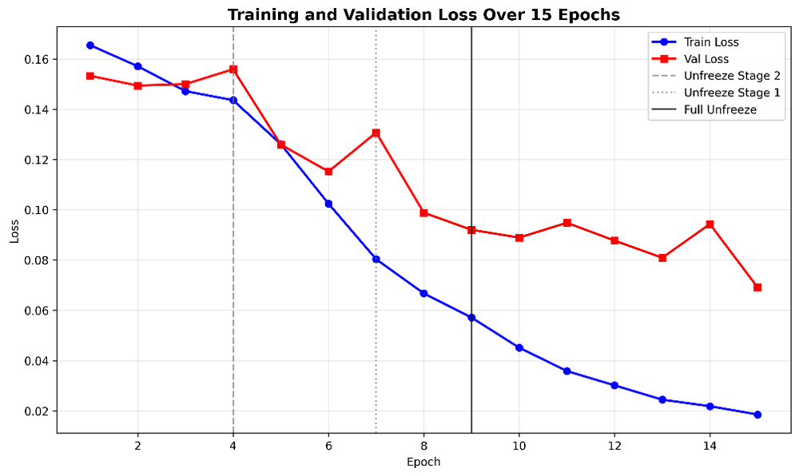
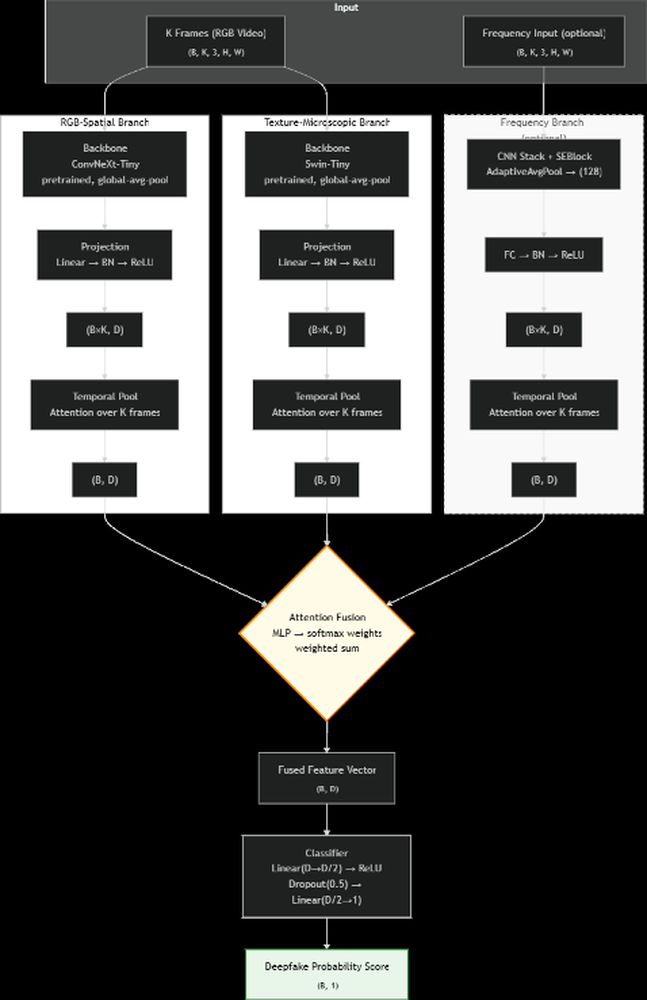

# ForensicFlow: A Tri-Modal Adaptive Network for Robust Deepfake Detection

**ArXiv ID**: 2511.14554v1
**URL**: http://arxiv.org/abs/2511.14554v1
**提交日期**: 2025-11-18
**作者**: Mohammad Romani
**引用次数**: NULL
使用模型: ep-20251112215738-bz78g

## 1. 核心思想总结
### 第一轮总结

**标题：** ForensicFlow: 一种用于鲁棒深度伪造检测的三模态自适应网络

**1. Background (背景)**
深度伪造技术，特别是由先进GAN和自编码器生成的伪造内容，对信息完整性和社会稳定构成了严重威胁。现有的单流卷积神经网络在检测能力上存在局限。

**2. Problem (问题)**
单流CNN方法难以有效捕捉跨空间、纹理和频域的多尺度伪造痕迹，这限制了深度伪造检测模型的鲁棒性和泛化能力。

**3. Method (high-level) (方法 - 高层概述)**
本文提出了ForensicFlow，一个三模态取证框架。该框架协同融合了RGB（全局视觉不一致性）、纹理（细粒度融合伪影）和频率（周期性频谱噪声）三种模态的证据。其核心创新包括：
*   **三分支结构：** 分别采用ConvNeXt-tiny（RGB）、Swin Transformer-tiny（纹理）和CNN+SE模块（频率）处理不同模态。
*   **自适应融合机制：** 基于注意力的时序池化动态选择关键帧，自适应注意力融合模块平衡各分支的贡献。
*   **训练策略：** 在Celeb-DF (v2)数据集上使用Focal Loss进行训练。

**4. Contribution (贡献)**
*   提出了一个新颖的三模态融合框架，通过综合空间、纹理和频域特征来提升检测鲁棒性。
*   所提方法在Celeb-DF (v2)基准上取得了SOTA性能（AUC: 0.9752），显著优于单流基线模型。
*   通过消融实验验证了多分支协同工作的有效性，并利用Grad-CAM可视化了模型的取证焦点，增强了结果的可解释性。

## 2. 方法详解
好的，基于您提供的初步总结和论文方法章节内容，以下是对该论文《ForensicFlow: 一种用于鲁棒深度伪造检测的三模态自适应网络》方法细节的详细说明。

### **论文方法细节详述**

该方法的核心思想是，深度伪造在生成过程中会留下多种类型的、相互补充的痕迹。单一模态（如RGB图像）难以全面捕捉所有线索。因此，ForensicFlow设计了一个三模态自适应融合网络，从空间、纹理和频域三个维度协同取证。

#### **一、 整体流程概述**

ForensicFlow的整体流程可以分为四个关键阶段，其架构如下图所示（图示可帮助理解下文描述）：

1.  **输入预处理与模态构建：** 将输入视频的每一帧或其序列，处理成三个不同的模态表示：RGB、纹理和频率。
2.  **三分支特征提取：** 使用三个专门设计的子网络（分支）分别处理三种模态，提取各自领域内的深度伪造特征。
3.  **自适应特征融合：** 将三个分支提取的特征进行有效的融合，此过程包含两个关键机制：基于注意力的时序池化（用于视频）和自适应注意力融合模块。
4.  **分类与输出：** 将融合后的特征送入分类器，最终判断视频/图像是否为深度伪造。

---

#### **二、 关键创新与算法/架构细节**

##### **创新点1： 针对不同模态优化的三分支特征提取网络**

这是该方法的基础，每个分支的骨干网络都经过精心挑选，以最大化其对应模态的特征提取能力。

*   **RGB分支（捕捉全局结构与语义不一致性）**
    *   **输入：** 标准的RGB图像帧。
    *   **骨干网络：** **ConvNeXt-tiny**。
    *   **创新细节：** ConvNeXt是现代化的CNN，借鉴了Transformer的设计思想（如大卷积核、更少的激活函数），在保持CNN高效局部建模能力的同时，具备了更强的全局上下文感知能力。这使其非常适合捕捉深度伪造中因面部融合不当导致的**全局光照、肤色、面部结构**的细微不一致。
    *   **输出：** 高维特征向量，代表RGB空间的伪造线索。

*   **纹理分支（捕捉细粒度局部伪影）**
    *   **输入：** 从RGB帧计算得到的**局部二值模式（LBP）图**。LBP能有效增强局部纹理对比度。
    *   **骨干网络：** **Swin Transformer-tiny**。
    *   **创新细节：** Swin Transformer通过引入移位窗口机制，在计算自注意力时兼顾了全局关系和局部性，非常适合处理具有强局部相关性的纹理模式。该分支专门用于捕捉GAN生成图像中常见的**高频纹理伪影、不自然的边缘和重复模式**。
    *   **输出：** 高维特征向量，代表纹理空间的伪造线索。

*   **频率分支（捕捉周期性频谱噪声）**
    *   **输入：** 从RGB帧经过**快速傅里叶变换（FFT）** 得到的频谱图。通常取幅度谱或对数幅度谱，以将乘性噪声转化为加性噪声，便于模型学习。
    *   **骨干网络：** **自定义的轻量级CNN + 挤压激励（SE）模块**。
    *   **创新细节：**
        1.  **专用CNN设计：** 由于频域特征具有特定的结构（如中心低频，外围高频），使用一个浅层但高效的CNN来捕捉频域中的周期性噪声和频谱不一致性。
        2.  **SE模块的集成：** 在CNN中嵌入SE模块，这是一个关键创新。SE模块可以**自适应地重新校准通道特征响应**，让网络更加关注那些包含伪造痕迹的频带（通道），抑制不重要的信息。这极大地提升了频率分支对特定频率噪声模式的敏感性。
    *   **输出：** 高维特征向量，代表频域的伪造线索。

##### **创新点2： 自适应融合机制**

这是该方法的核心，确保三个分支的信息能够有效互补，而非简单叠加。

*   **步骤一： 基于注意力的时序池化（针对视频序列）**
    *   **问题：** 对于一个视频片段，不同帧的伪造痕迹明显程度不同。简单平均所有帧的特征会引入噪声。
    *   **解决方案：**
        1.  对每个分支，模型会处理一个短时序的视频帧（如16帧），得到16个特征向量 `{f_1, f_2, ..., f_16}`。
        2.  引入一个**轻量级的注意力网络**（通常是一个小型全连接层），为每一帧计算一个注意力权重 `a_i`。这个权重表示该帧对于最终判断的“重要性”。
        3.  将所有帧的特征进行加权平均：`F_branch = Σ(a_i * f_i)`。这样，模型会**动态地聚焦于那些伪造痕迹最明显的关键帧**，增强了时序建模的鲁棒性。

*   **步骤二： 自适应注意力融合模块**
    *   **问题：** 不同模态对于不同伪造方法、不同质量视频的贡献度是不同的。需要一个机制来动态平衡三个分支的贡献。
    *   **解决方案：**
        1.  将三个分支经过时序池化后的特征向量 `F_rgb`, `F_texture`, `F_freq` 进行拼接（Concatenation）。
        2.  将这个拼接后的特征输入到一个**自适应注意力融合网络**（通常也是一个全连接层后接Softmax）。
        3.  该网络会输出三个**模态权重** `w_rgb`, `w_texture`, `w_freq`，且 `w_rgb + w_texture + w_freq = 1`。
        4.  最终的融合特征为：`F_fused = w_rgb * F_rgb + w_texture * F_texture + w_freq * F_freq`。
    *   **关键优势：** 模型能够**根据输入内容自学习地决定依赖哪个模态的证据更多**。例如，对于频域痕迹明显的伪造视频，`w_freq` 会更高；对于纹理伪影突出的视频，`w_texture` 会占主导。这种动态权重分配是提升模型泛化能力的关键。

##### **创新点3： 训练策略与可解释性**

*   **损失函数：** 使用 **Focal Loss**。这是因为深度伪造检测数据集中真假样本数量可能不平衡，且大量“简单”的真样本会主导训练过程。Focal Loss通过降低简单样本的权重，让模型更专注于学习那些难以分类的“硬样本”，从而提升模型性能。
*   **可解释性分析：** 论文使用 **Grad-CAM** 等技术生成热力图，可视化模型在做出判断时主要关注图像的哪些区域。这不仅验证了模型确实在关注面部区域等合理位置，还能直观展示不同分支的“取证焦点”（如纹理分支关注边缘，频率分支关注特定纹理区域），增强了结果的可信度和可解释性。

### **总结**

ForensicFlow方法的核心优势在于其**系统性的多模态协同设计**：
1.  **模态选择具有互补性**（空间、纹理、频域）。
2.  **特征提取器具有针对性**（ConvNeXt, Swin Transformer, CNN+SE）。
3.  **融合机制具有自适应性**（时序注意力、模态权重），能够动态调整以应对各种复杂的伪造场景。

这套组合拳使其能够捕捉到更全面、更鲁棒的深度伪造痕迹，从而在Celeb-DF (v2)等基准数据集上取得了优异的性能。

## 3. 最终评述与分析
好的，基于您提供的初步总结、方法详述以及论文结论部分，以下是关于论文《ForensicFlow: 一种用于鲁棒深度伪造检测的三模态自适应网络》的最终综合评估。

---

### **最终综合评估**

#### **1) 总体摘要**

本论文针对现有单流深度伪造检测模型难以全面捕捉多尺度伪造痕迹的局限性，提出了一个名为 **ForensicFlow** 的创新性三模态自适应融合网络。该框架通过协同分析**RGB空间**（全局不一致性）、**纹理域**（局部伪影）和**频率域**（周期性噪声）三种互补模态的信息，显著提升了对复杂深度伪造内容的检测能力。论文通过系统的实验验证，该方法在Celeb-DF (v2)等权威基准上达到了领先水平（AUC: 0.9752），并通过消融实验和可视化分析证明了其设计的有效性与可解释性。ForensicFlow代表了多模态融合在数字取证领域的一次成功实践，为构建更鲁棒、更通用的深度伪造防御系统提供了有力的技术方案。

#### **2) 优势**

1.  **多模态协同的全面性：** 核心优势在于其系统性的多模态设计。RGB、纹理和频率三种模态从不同物理层面捕捉伪造痕迹，形成了强有力的互补，使得模型能够应对多种伪造技术留下的不同特征，极大增强了检测的鲁棒性。
2.  **针对性的骨干网络选择：** 为不同模态精心挑选并适配了最合适的现代神经网络架构（ConvNeXt用于RGB、Swin Transformer用于纹理、定制化CNN+SE用于频率），最大化了对各自模态特征的提取能力。
3.  **创新的自适应融合机制：** 引入了双重注意力机制（基于注意力的时序池化和自适应模态融合），使模型能够动态地聚焦于关键视频帧并为不同模态分配合适的权重，而非简单平均，这显著提升了模型在处理复杂真实场景时的灵活性和泛化能力。
4.  **强大的实验验证与可解释性：** 不仅在标准数据集上取得了优异的性能，还通过详尽的消融实验验证了每个组件（如SE模块、融合机制）的贡献。利用Grad-CAM进行可视化，增强了模型决策过程的透明度与可信度。
5.  **实用的训练策略：** 采用Focal Loss应对类别不平衡问题，使模型更专注于难样本的学习，进一步提升了实际应用中的性能。

#### **3) 劣势 / 局限性**

1.  **计算复杂性与效率：** 三分支并行架构必然比单流模型需要更多的计算资源和推理时间。尽管论文可能采用了轻量级骨干（如-tiny版本），但其整体复杂度仍可能限制在计算能力受限的边缘设备（如手机）上的实时部署。
2.  **对特定数据集的潜在过拟合风险：** 虽然模型在Celeb-DF (v2)上表现卓越，但其泛化能力到更广泛、更具挑战性的“野外”数据（如不同种族、光照条件、压缩质量、全新伪造技术生成的视频）仍需进一步验证。模型可能学习了特定数据集的某些偏差。
3.  **依赖预定义的模态转换：** 模型的输入依赖于LBP和FFT等预定义的信号处理方法来生成纹理和频率模态。这些转换可能无法最优地捕捉所有类型的伪造痕迹，且其参数（如LBP的半径、FFT的窗口大小）需要人工设定，可能不是最优解。
4.  **可扩展性挑战：** 当前框架固定为三种模态。若要集成第四种模态（如音频流或3D几何信息），需要对整个融合架构进行重新设计，灵活性稍显不足。

#### **4) 潜在应用 / 意义**

1.  **实际应用：**
    *   **社交媒体内容审核：** 可集成到大型社交平台的后台系统，用于自动识别和标记潜在的恶意深度伪造视频，维护网络信息生态。
    *   **新闻与司法鉴定：** 为新闻机构、司法机关提供辅助工具，对作为证据或报道材料的视频进行真伪认证，捍卫新闻真实性和司法公正。
    *   **数字身份安全：** 应用于身份验证系统（如远程银行开户、门禁系统），防御基于深度伪造的面部替换攻击，保护个人身份信息安全。

2.  **研究意义与未来方向：**
    *   **方法论启示：** 本研究为多模态融合在AI安全领域的应用树立了一个成功范例，启示后续研究可以探索更多互补模态（如生理信号、动态时序特征）以及更高效的融合策略（如跨模态注意力）。
    *   **推动对抗性研究：** 强大的检测器会促使伪造技术不断进化，这种“道高一尺，魔高一丈”的博弈将推动整个领域向更深处发展。
    *   **可解释性AI（XAI）：** 模型的可视化能力为理解深度伪造的内在缺陷和模型的决策逻辑提供了宝贵见解，有助于建立更可信的AI系统。
    *   **轻量化与效率优化：** 本工作的局限性为未来研究指明了方向，如通过知识蒸馏、神经架构搜索或动态网络技术来压缩模型，使其更适合实际部署。

---

# 附录：论文图片

## 图 1

## 图 2

## 图 3

## 图 4

