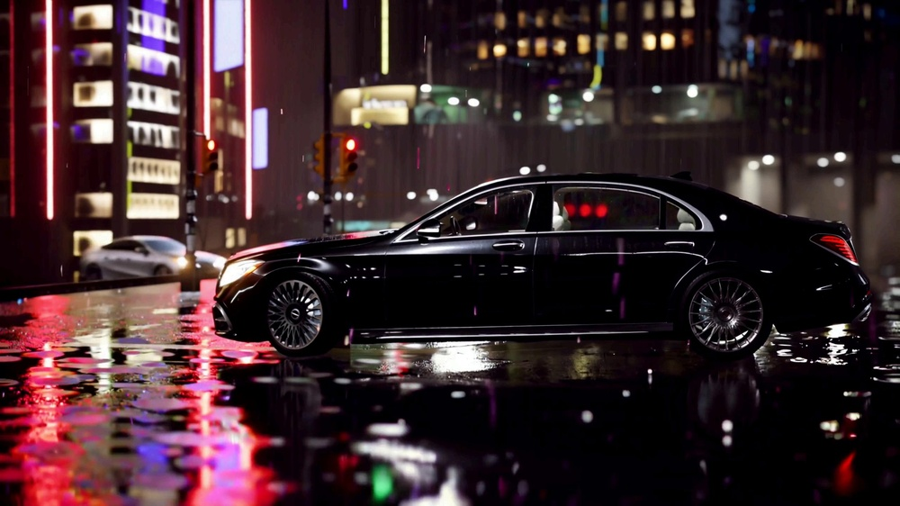
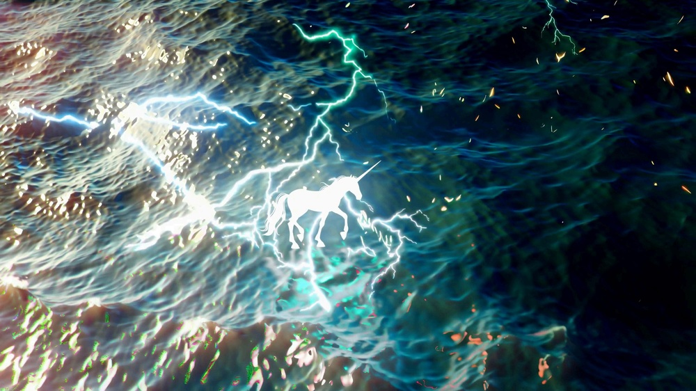
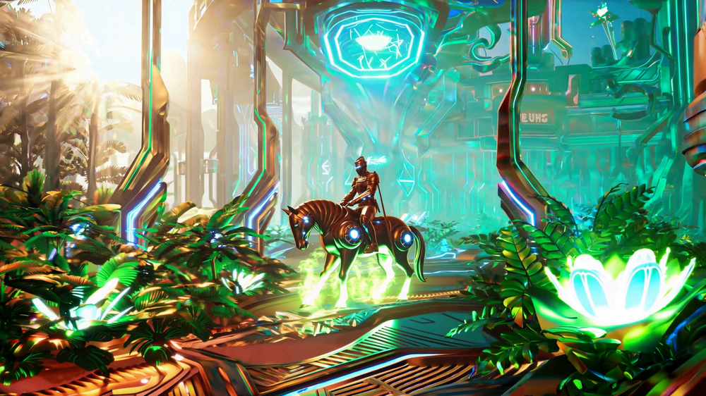

# FreeSwim: Revisiting Sliding-Window Attention Mechanisms for Training-Free Ultra-High-Resolution Video Generation

**ArXiv ID**: 2511.14712v1
**URL**: http://arxiv.org/abs/2511.14712v1
**提交日期**: 2025-11-18
**作者**: Yunfeng Wu; Jiayi Song; Zhenxiong Tan; Zihao He; Songhua Liu
**引用次数**: NULL
使用模型: ep-20251112215738-bz78g

## 1. 核心思想总结
这是一份关于论文《FreeSwim: Revisiting Sliding-Window Attention Mechanisms for Training-Free Ultra-High-Resolution Video Generation》的第一轮总结，按四个部分组织。

**1. Background (背景)**
现代基于Transformer的视频生成模型（如视频扩散模型）在处理超高分辨率视频时面临巨大挑战。其核心组件——注意力机制——具有二次方的时间和内存复杂度，使得对超高分辨率视频进行端到端训练的成本极其高昂，甚至无法实现。

**2. Problem (问题)**
如何在不进行任何额外训练或模型微调的情况下，直接利用现有预训练好的标准分辨率视频生成模型，来合成视觉保真度高、细节丰富且具有全局一致性的超高分辨率视频。简单地应用局部窗口注意力机制虽然能降低计算成本，但往往会导致生成内容重复且缺乏全局连贯性。

**3. Method (高层次方法)**
本文提出了一种名为FreeSwim的训练免费方法。其核心是**一种向内的滑动窗口注意力机制**，关键在于保持每个查询词在训练时所具有的感受野尺度，以维持视觉细节。为了克服局部注意力导致的全局不一致问题，作者设计了一个**双路径流程**：
*   **主路径**：使用向内滑动窗口注意力生成细节。
*   **辅助路径**：提供一个全局感受野，通过一种**新颖的交叉注意力覆盖策略**来引导主路径的语义内容，确保整体一致性。
*   此外，通过**交叉注意力缓存策略**来优化辅助路径的效率，避免频繁计算耗时的全局3D注意力。

**4. Contribution (贡献)**
*   提出了一种**无需训练**的范式，能够将预训练视频生成模型直接应用于超高分辨率视频合成。
*   引入了**向内滑动窗口注意力与双路径引导机制**，在保持细节的同时确保了生成视频的全局连贯性。
*   通过大量实验证明，该方法能高效生成具有精细视觉细节的超高分辨率视频，在VBench基准测试上甚至优于需要额外训练的替代方法，同时保持了有竞争力或更优的效率。

## 2. 方法详解
好的，基于您提供的初步总结和论文方法章节内容，以下是对该论文方法细节的详细说明。

### **论文方法详述：FreeSwim**

FreeSwim 的核心目标是解决一个现实难题：**如何在不进行任何额外训练或微调的情况下，直接利用现有的、为较低分辨率（如256x256或512x512）训练的预训练视频扩散模型，来生成视觉上连贯、细节丰富且无重复瑕疵的超高分辨率（如1024x1024或更高）视频。**

#### **一、 关键创新与核心思想**

FreeSwim 的成功建立在三个关键创新之上，它们共同解决了超高分辨率生成中的“细节”与“一致性”矛盾：

1.  **向内滑动窗口注意力**： 这是生成高质量细节的基础。与传统的、感受野受限的局部窗口注意力不同，该设计旨在**为每个查询位置保持其在模型原始训练分辨率下的有效感受野尺度**。
2.  **双路径生成流程**： 这是确保全局一致性的架构核心。通过分离“细节生成”（主路径）和“全局引导”（辅助路径）两个任务，实现了分工协作。
3.  **交叉注意力覆盖与缓存策略**： 这是连接双路径、并保证效率的关键技术。它利用辅助路径的全局语义信息来“指导”主路径的生成过程，同时通过缓存机制避免了巨大的计算开销。

#### **二、 算法/架构细节与关键步骤**

FreeSwim 的整体流程可以被清晰地分解为以下几个关键步骤：

##### **步骤1：问题定义与输入准备**

*   **目标**： 生成一个超高分辨率视频 `V_high ∈ R^(F×H×W×C)`，其中 H, W 远大于模型训练时的分辨率。
*   **可用资源**： 一个预训练的视频扩散模型（如 Stable Video Diffusion），其 U-Net 编码器设计为处理分辨率 `R^(F×h×w×C)` (h<<H, w<<W)。
*   **挑战**： 直接在 `V_high` 的全尺寸特征图上计算自注意力，其复杂度为 O((F×H×W)²)，在计算上是不可行的。

##### **步骤2：引入向内滑动窗口注意力（主路径的核心）**

这是 FreeSwim 方法中最基础且关键的算法创新。

*   **传统滑动窗口的问题**： 如果简单地将高分辨率特征图分割成不重叠的、大小为 `(F, h, w)` 的局部窗口（与模型训练时的时空尺寸匹配），并在每个窗口内独立计算注意力，虽然计算成本降低了，但每个窗口的感受野被限制在 `(h, w)` 内。这会导致生成的局部块内部细节可能尚可，但块与块之间缺乏语义联系，从而出现内容重复、物体断裂、全局光照不一致等问题。
*   **FreeSwim的解决方案**： **向内滑动窗口**。
    *   **操作**： 对于高分辨率特征图上的一个目标位置（查询点），其对应的“窗口”并不是从该点向外扩展的一个固定方块，而是**将整个高分辨率特征图视为“大窗口”**，然后通过滑动窗口操作，**逐步向内裁剪到一个与模型原始训练分辨率相匹配的、以查询点为中心的区域**。
    *   **直观理解**： 想象一下你站在一幅巨大壁画前，想看清某个细节（查询点）的笔触。你不是拿一个小放大镜（传统窗口）贴上去看，而是逐步后退，直到你的整个视野（窗口）恰好能容纳下与画家作画时看到的相同范围的场景（训练时的感受野）。这个“后退裁剪”的过程就是“向内滑动”。
    *   **关键优势**： 通过这种方式，**每个查询点在进行注意力计算时，其所能“看到”的上下文区域（Key/Value）在时空尺度上与模型训练时是一致的**。这意味着模型调用的是它已经学会的、在该尺度下生成合理细节的知识，从而保证了生成内容的视觉保真度。

##### **步骤3：双路径流程与交叉注意力覆盖（确保全局一致性）**

仅靠主路径的向内滑动窗口注意力，虽然能生成优质细节，但窗口之间的协调性仍然不足。为此，作者引入了双路径流程。

*   **主路径**：
    *   **职责**： 负责生成**高频率的视觉细节**。
    *   **操作**： 如步骤2所述，使用向内滑动窗口注意力对高分辨率特征图进行去噪和细化。

*   **辅助路径**：
    *   **职责**： 提供一个**低频率的、全局的语义蓝图**，用于指导主路径。
    *   **操作**：
        1.  将原始的高分辨率潜在表示 `z_high` **下采样**到一个较低的分辨率（例如，模型训练时的基础分辨率）。
        2.  在这个下采样的、全局的潜在表示上，**运行一次标准的、全局的3D自注意力**。由于分辨率已降低，这个计算是可承受的。
        3.  这次全局注意力计算捕获了整个视频序列的宏观结构、物体布局和运动趋势，生成了一个**全局一致的语义特征图**。

*   **交叉注意力覆盖策略**：
    *   **这是连接双路径的桥梁**。
    *   **操作**： 在主路径的每个向内滑动窗口内，除了计算窗口内的自注意力，还引入一个**交叉注意力模块**。这个模块的**查询来自主路径的当前窗口**，而**键和值则来自辅助路径的全局语义特征图**。
    *   **作用机制**：
        1.  主路径的窗口（查询）会“询问”辅助路径的全局特征（键/值）：“在我的这个位置，宏观的语义背景是什么？应该生成什么内容？”
        2.  辅助路径的全局信息会“回答”并“覆盖”到主路径的局部生成过程中，确保该窗口内的内容与视频的整体语义保持一致。
        3.  例如，即使两个窗口在空间上相隔很远，但通过交叉注意力覆盖，它们都能从辅助路径获知“背景是蓝天，前景有一辆从左向右行驶的汽车”，从而生成协调一致的天空颜色和汽车运动方向。

##### **步骤4：交叉注意力缓存策略（优化效率）**

双路径流程的一个潜在效率瓶颈是：辅助路径的全局特征需要在每个去噪步骤中为**每一个**主路径窗口计算一次交叉注意力，这仍然非常耗时。

*   **解决方案**： **交叉注意力缓存**。
*   **关键观察**： 在扩散模型的去噪过程中，**潜在表示的语义内容在早期步骤中就基本确定，后续步骤主要是对细节进行细化**。因此，辅助路径生成的全局语义特征在去噪的早期阶段之后就会变得相对稳定。
*   **操作**：
    1.  在去噪过程开始的少数几步（例如，前10%的步骤）中，**动态计算**辅助路径的全局特征以及其与主路径的交叉注意力。
    2.  一旦语义内容稳定，**将辅助路径的键和值张量缓存起来**。
    3.  在后续大量的去噪步骤中，主路径的每个窗口直接使用**缓存的键和值**来进行交叉注意力计算，而无需再次运行耗时的辅助路径全局注意力。
*   **效果**： 这一策略极大地减少了计算开销，使 FreeSwim 的整体效率变得非常有竞争力，因为最耗时的全局3D注意力计算只发生在最初的几个步骤中。

#### **三、 整体流程总结**

1.  **初始化**： 给定文本提示和目标超高分辨率，初始化噪声潜在表示 `z_high`。
2.  **循环去噪**： 对于每个去噪时间步 `t`：
    a. **双路径并行**：
        *   **主路径**： 在 `z_high` 上应用向内滑动窗口注意力。
        *   **辅助路径**： 将 `z_high` 下采样，计算全局3D自注意力，得到全局语义特征。
    b. **路径融合**： 在主路径的每个滑动窗口内，将其特征与辅助路径的全局特征通过**交叉注意力覆盖**进行融合，使局部细节受全局语义引导。
    c. **缓存判断**： 如果当前是去噪早期步骤，则动态计算并更新缓存；否则，直接使用**缓存的**辅助路径键和值。
    d. **去噪更新**： 根据融合后的特征更新 `z_high`。
3.  **解码**： 去噪循环结束后，将最终的高分辨率潜在表示 `z_high` 通过VAE解码器，生成像素级的超高分辨率视频。

通过这一系列精心设计的步骤，FreeSwim 成功地实现了 **“训练免费”** 的超高分辨率视频生成，在保持预训练模型原始能力（细节生成）的同时，通过算法创新解决了全局一致性问题，并利用缓存策略保证了实用性。

## 3. 最终评述与分析
好的，结合前两轮提供的关于论文《FreeSwim: Revisiting Sliding-Window Attention Mechanisms for Training-Free Ultra-High-Resolution Video Generation》的背景、方法详述和结论部分，以下是最终的综合评估。

---

### **最终综合评估**

#### **1. Overall Summary (整体总结)**

本论文针对现有预训练视频生成模型难以直接应用于超高分辨率视频合成的核心瓶颈——注意力机制的二次方复杂度问题，提出了一种名为 **FreeSwim** 的创新性、**完全无需训练**的解决方案。该方法的核心思想是**通过算法层面的精巧设计，而非增加模型参数或进行微调，来解锁预训练模型的超高分辨率生成能力**。其技术基石在于：1）**向内滑动窗口注意力机制**，旨在为每个查询位置保持其在原始训练分辨率下的感受野，从而保证生成细节的质量；2）**双路径生成流程**，通过一个独立的辅助路径提供全局语义引导，再通过**交叉注意力覆盖策略**将全局一致性信息注入到负责生成细节的主路径中，有效解决了局部窗口方法常见的重复和不一致问题；3）**交叉注意力缓存策略**，大幅提升了方法的计算效率。实验结果表明，FreeSwim 能够高效地生成视觉保真度高、细节丰富且全局连贯的超高分辨率视频，其性能甚至优于一些需要额外训练的方法，展现出强大的实用潜力。

#### **2. Strengths (优势)**

*   **训练免费的核心优势**： 这是该方法最突出的优点。它无需对预训练模型进行任何微调或额外训练，极大地降低了资源门槛和应用难度，使得任何拥有基础分辨率视频生成模型的研究者或开发者都能立即将其用于超高分辨率内容创作。
*   **出色的性能表现**： 论文通过大量实验证明，FreeSwim 在生成视频的视觉质量、细节丰富度和时间一致性方面表现优异。在 VBench 等客观评估基准上，其效果甚至超越了某些需要昂贵训练成本的替代方案，证明了纯算法设计的强大效力。
*   **创新的技术设计**： 向内滑动窗口注意力的概念巧妙地平衡了计算效率与感受野保持的需求。双路径架构与交叉注意力覆盖的策略，从系统层面清晰地分离并协同解决了“细节生成”和“全局协调”这两个关键子问题，设计非常优雅且有效。
*   **高计算效率与实用性**： 通过交叉注意力缓存策略，该方法避免了在每一个去噪步骤中都进行昂贵的全局注意力计算，使其整体计算开销处于可接受的范围，具备了实际应用的可行性。
*   **良好的通用性与兼容性**： FreeSwim 作为一种通用框架，理论上可以应用于任何基于 Transformer/注意力机制的预训练视频扩散模型（如 Stable Video Diffusion），具有良好的普适性。

#### **3. Weaknesses / Limitations (弱点/局限性)**

*   **对预训练模型质量的依赖**： FreeSwim 的性能上限在很大程度上依赖于其所基于的预训练模型本身的能力。如果基础模型在特定类别（如人物动作、复杂场景）上的生成质量不佳，那么 FreeSwim 生成的超高分辨率视频也可能继承这些缺陷。
*   **潜在的内存开销**： 虽然论文强调了其时间效率，但处理超高分辨率视频时，双路径流程以及缓存大型特征图可能会带来显著的内存开销。这对于硬件资源（特别是GPU显存）仍然是一个挑战，可能限制了其生成分辨率的上限或视频长度。
*   **超参数敏感性**： 方法中可能涉及一些超参数，例如向内滑动窗口的具体策略、双路径融合的强度、缓存开始的时机等。这些参数的设置可能会影响最终结果，需要一定的经验和调试。
*   **极限场景下的性能边界**： 对于极其复杂、动态剧烈的场景，或者要求极长视频序列的生成，FreeSwim 能否始终保证完美的全局一致性，可能需要更进一步的验证。局部窗口方法固有的局限性可能在极端情况下被放大。
*   **缺乏严格的实时性**： 尽管效率得到优化，但生成超高分辨率视频仍然是一个耗时的过程，可能无法满足实时交互应用的需求。这更多是当前生成式模型的普遍限制。

#### **4. Potential Applications / Implications (潜在应用/意义)**

*   **高质量视频内容创作**： 为电影、广告、游戏和动画行业提供了强大的工具，能够直接生成可用于预览甚至最终成品的高分辨率、高帧率视频素材，显著降低制作成本和时间。
*   ** democratization of High-Res Video Generation (超高分辨率视频生成的民主化)**： 由于其“训练免费”的特性，FreeSwim 使得更多的学术实验室、小型公司和独立艺术家能够接触并利用最先进的视频生成技术，促进了该领域的创新和普及。
*   **推动相关算法研究**： 这项工作为“训练免费适应”范式树立了一个优秀的典范，证明了通过改进推理过程而非模型本身也能取得巨大突破。这可能会激励更多研究关注于推理阶段的算法创新，以释放大模型的潜力。
*   **教育和模拟**： 可用于生成高分辨率的教学视频、科学模拟可视化（如流体动力学、天体物理过程）等，为教育和科研提供直观的素材。
*   **未来模型的基石**： FreeSwim 的核心思想（如保持训练时感受野、双路径引导）可以被未来的视频生成模型在设计时直接吸收，成为其处理高分辨率内容的标准模块之一，具有长远的影响力。

---

# 附录：论文图片

## 图 1

## 图 2

## 图 3

## 图 4

## 图 5

## 图 6

## 图 7

## 图 8

## 图 9

## 图 10

