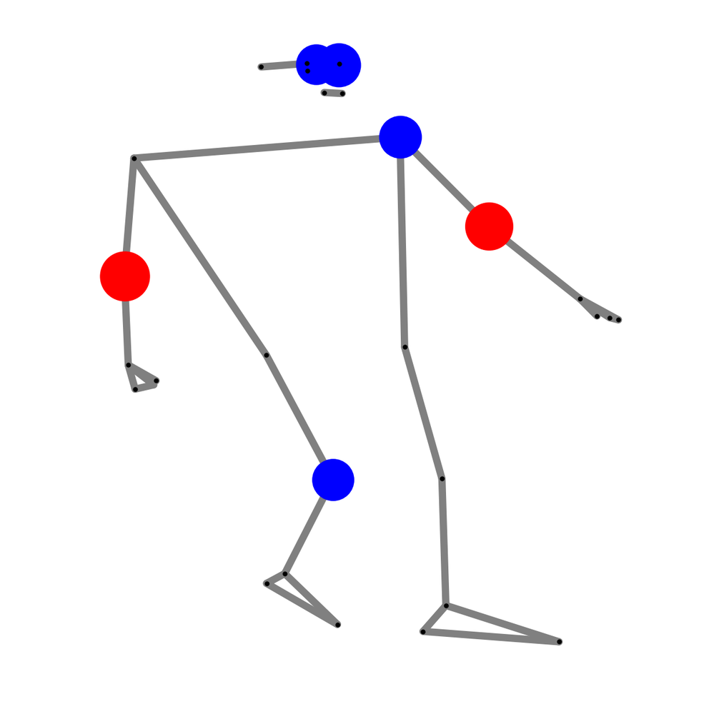
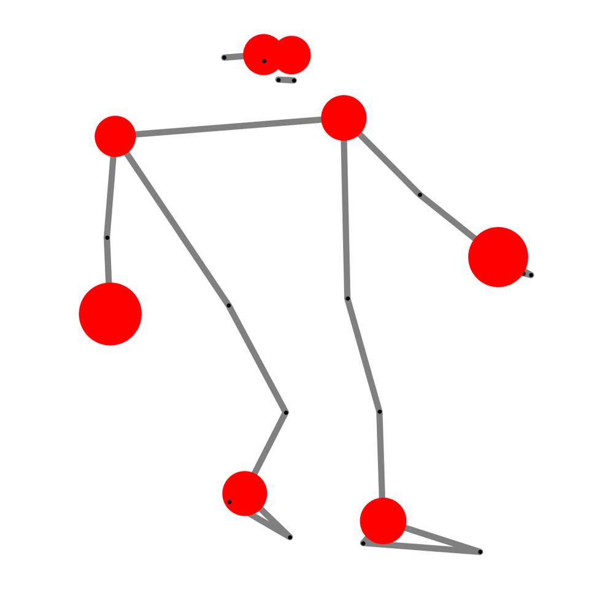
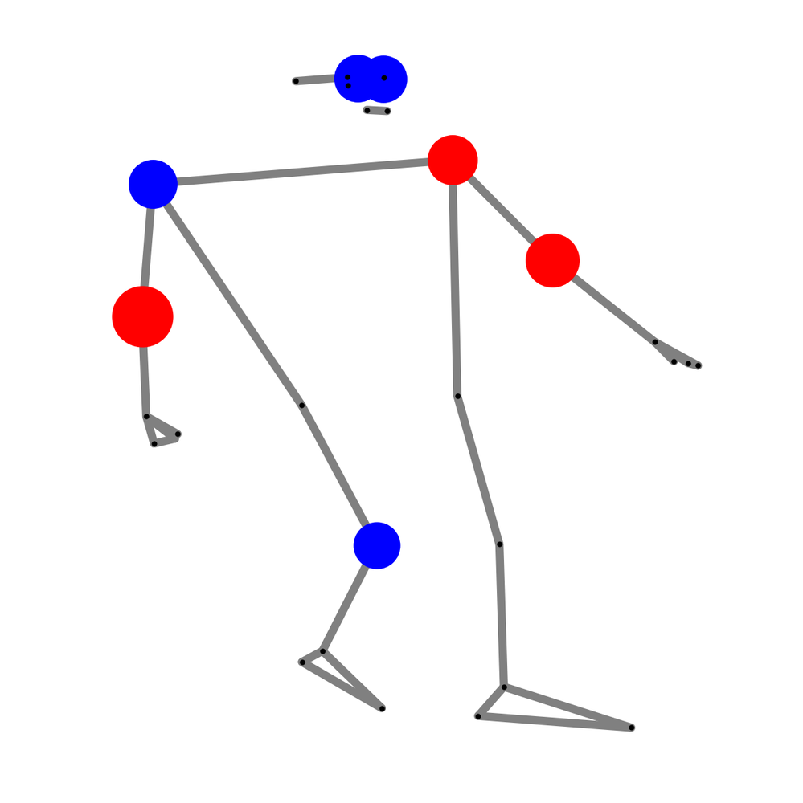
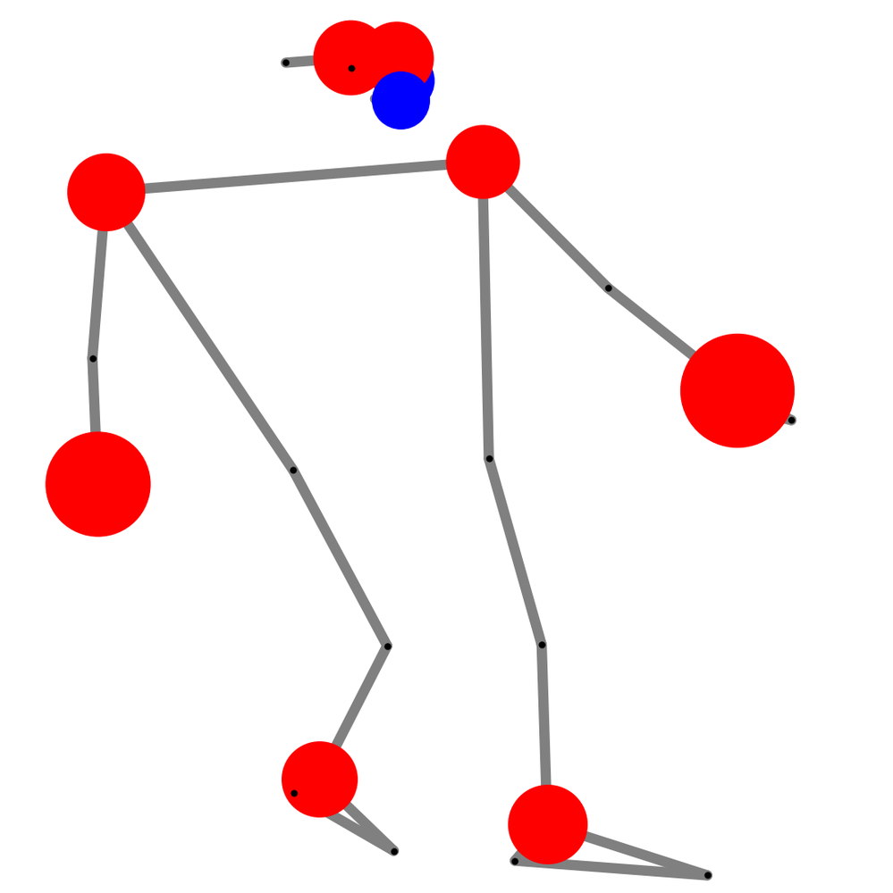
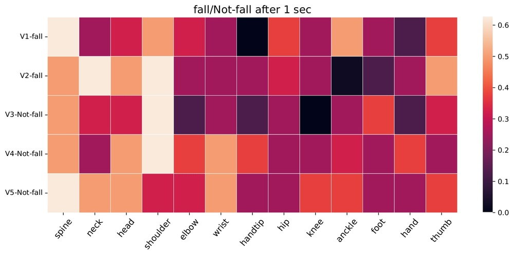
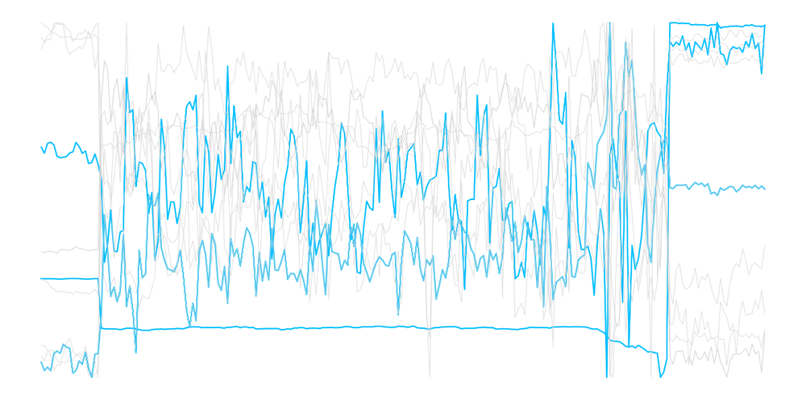

# Fusing Biomechanical and Spatio-Temporal Features for Fall Prediction: Characterizing and Mitigating the Simulation-to-Reality Gap

**ArXiv ID**: 2511.14620v1
**URL**: http://arxiv.org/abs/2511.14620v1
**提交日期**: 2025-11-18
**作者**: Md Fokhrul Islam; Sajeda Al-Hammouri; Christopher J. Arellano; Kavan Hazeli; Heman Shakeri
**引用次数**: NULL
使用模型: ep-20251112215738-bz78g

## 1. 核心思想总结
这是一份基于您提供的标题、摘要和引言（假设引言内容与摘要主旨一致）的简洁第一轮总结，按四个部分组织。

### **第一轮总结**

**1. Background (背景)**
跌倒是老年人受伤和丧失独立生活能力的主要原因。基于视觉的跌倒预测系统提供了一种非侵入性解决方案，可在跌倒发生前几秒进行预警，但其发展受到真实跌倒数据稀缺的严重制约。

**2. Problem (问题)**
本研究旨在解决两个核心问题：
*   **主要问题**：如何利用稀缺的真实数据开发有效的跌倒预测模型。
*   **核心挑战**：现有模型严重依赖模拟数据（如特技演员）进行训练，这导致了巨大的“模拟-现实差距”。模型在模拟数据上表现优异，但在零样本条件下泛化到真实世界的老年人时，性能急剧下降。

**3. Method (高层次方法)**
本研究提出了一种名为**生物力学时空图卷积网络 (BioST-GCN)** 的双流模型。该模型通过交叉注意力融合机制，结合了人体的**姿态信息**（空间-时间特征）和**生物力学信息**（如关节角度、速度）。此外，论文还提出了**个性化策略**和隐私保护数据管道，作为弥合模拟-现实差距的潜在解决方案。

**4. Contribution (贡献)**
*   **提出新模型**：开发了BioST-GCN模型，在模拟数据集上超越了基线模型，并提供了通过注意力机制的可解释性。
*   **揭示关键挑战**：系统地揭示并量化了跌倒预测中严重的模拟-现实性能差距（如性能从89.0%降至35.9%），强调了针对脆弱老年人群体开发有效系统的紧迫性。
*   **指明未来方向**：提出了个性化建模和隐私保护数据收集等具体途径，为弥合这一差距、推动系统走向现实应用提供了重要思路。

## 2. 方法详解
好的，根据您提供的初步总结和论文方法章节的内容，现对其方法细节进行详细说明。

### **论文方法细节详述**

本论文的核心方法是提出**生物力学时空图卷积网络（BioST-GCN）**，这是一个旨在更有效地从人体动作中学习跌倒前兆特征的双流架构。其整体流程与关键创新主要体现在对**两种互补信息源（姿态与生物力学）的融合**以及对**时空依赖性**的建模上。

#### **一、 整体流程概述**

方法的整体流程可以概括为以下四个关键步骤：

1.  **输入数据预处理**：从原始视频中提取人体2D或3D关键点（姿态），并基于这些关键点计算出一系列生物力学特征。
2.  **双流特征提取**：
    *   **姿态流**：将人体关键点序列构建为时空图，利用ST-GCN捕捉关节在空间和时间上的动态变化模式。
    *   **生物力学流**：将计算出的生物力学特征序列（如关节角度、速度）作为时间序列，利用时序卷积网络（TCN）捕捉其演变规律。
3.  **特征融合**：通过一个**交叉注意力融合模块**，将姿态流和生物力学流的特征进行深度融合，使两者能够相互补充和增强。
4.  **预测与优化**：将融合后的特征输入分类器（如全连接层），输出跌倒或非跌倒的预测概率，并通过损失函数（如交叉熵损失）对整个网络进行端到端的训练。

#### **二、 关键创新与核心组件细节**

##### **创新点1：双流输入设计——姿态与生物力学的结合**

这是该方法的核心创新，旨在解决单纯依赖关节坐标位置信息的局限性。

*   **姿态流输入**：
    *   **数据**：人体关键点的坐标序列（例如，使用OpenPose等工具提取的17个关节点）。
    *   **表示**：`N个关节 x T个时间帧 x C个坐标维度（如x, y）`。这是一种低层次、几何化的描述。
*   **生物力学流输入**：
    *   **数据**：从关键点坐标推导出的生物力学特征序列。论文中明确提到了：
        *   **关节角度**：反映肢体姿态和弯曲程度，例如膝关节角度是判断下蹲、站立的关键指标。
        *   **关节速度**：反映运动的剧烈程度，例如重心的垂直速度急剧变化可能预示失稳。
    *   **表示**：`K个生物力学特征 x T个时间帧`。这是一种更高层次、更具物理意义的描述，直接关联到人体的运动稳定性。

**为什么这种结合是创新的？** 姿态信息告诉模型“身体各部分在哪里移动”，而生物力学信息则告诉模型“这样的运动在物理上意味着什么（是否稳定）”。两者结合为模型提供了更丰富、更具判别性的信息。

##### **创新点2：基于时空图卷积（ST-GCN）的骨架建模**

论文采用ST-GCN作为姿态流的主干网络，这是对传统时序模型（如LSTM）的改进，能更自然地表达人体结构。

*   **空间图构建**：
    *   将每一帧的人体关键点视为一个**图**，节点是关节，边是骨骼连接。
    *   ST-GCN通过在**人体自然拓扑结构**（如左手腕-左肘-左肩构成的链条）上进行图卷积，来聚合局部关节间的信息，从而更好地学习肢体部分的协同运动。
*   **时间动态建模**：
    *   在时间维度上，网络通过沿时间轴进行一维卷积，来捕捉关节运动的时序模式（例如，从行走过渡到绊倒的连续过程）。
*   **关键步骤**：ST-GCN交替进行空间图卷积和时间卷积，逐步从局部肢体动作中提取出全局的、复杂的动作模式特征。

##### **创新点3：交叉注意力融合机制**

这是双流架构的“大脑”，负责智能地整合两路信息，而非简单拼接。这是方法中的另一个关键创新。

*   **工作流程**：
    1.  **特征映射**：分别将姿态流（ST-GCN输出）和生物力学流（TCN输出）的特征通过全连接层映射到同一个特征空间，得到特征向量 \( F_{pose} \) 和 \( F_{bio} \)。
    2.  **计算注意力权重**：
        *   将 \( F_{bio} \) 作为**查询（Query）**，将 \( F_{pose} \) 作为**键（Key）和值（Value）**。
        *   通过计算Query和Key的相似度，生成一个**注意力权重矩阵**。这个权重矩阵表示“对于每一个生物力学特征，需要关注姿态特征中的哪些部分”。
    3.  **加权融合**：利用注意力权重对 \( F_{pose} \)（Value）进行加权求和，得到一个经过生物力学信息“引导”和“增强”后的姿态特征。
    4.  **最终融合**：将增强后的姿态特征与原始的生物力学特征进行拼接或相加，得到最终的融合特征。

*   **优势**：
    *   **可解释性**：注意力权重可以揭示模型决策的依据。例如，模型可能在学习预测跌倒时，对“大腿角度”这一生物力学特征赋予了高权重，并相应地关注了“髋关节”和“膝关节”的姿态变化。
    *   **自适应融合**：不同于固定权重的融合，交叉注意力能根据具体的输入样本动态地调整两路信息的贡献度。

#### **三、 应对“模拟-现实差距”的潜在策略**

方法章节还提到了应对核心挑战（模拟-现实差距）的潜在方案，虽非核心算法，但却是方法完整性的重要组成部分。

*   **个性化策略**：提出可以为新用户建立一个小的、本地的**校准集**（包含少量其本人的日常活动视频）。然后通过**迁移学习**或**领域自适应**技术，利用这个校准集对预训练好的BioST-GCN模型进行微调，使其适应特定用户的运动模式，从而缩小差距。
*   **隐私保护数据管道**：强调在整个数据处理流程中（从视频中提取关键点后），后续所有操作都基于**抽象的关键点坐标和生物力学特征**，而不再需要原始视频图像。这既保护了用户隐私，也为在真实环境中部署扫清了障碍。

### **总结**

该论文的方法细节可以清晰地归纳为：**一个以双流（姿态+生物力学）输入为基础，以ST-GCN和TCN分别作为时空和时序特征提取器，并通过创新的交叉注意力机制进行深度融合的端到端跌倒预测框架**。其技术优势在于通过引入生物力学先验知识和先进的图模型及融合机制，实现了对跌倒前更细微、更物理本质的特征捕捉，为后续的个性化适配以弥合模拟-现实差距奠定了模型基础。

## 3. 最终评述与分析
好的，结合前两轮返回的信息（初步总结与方法详述）以及论文的结论部分，现给出最终的综合评估如下：

### **最终综合评估**

#### **1. Overall Summary (整体总结)**
本研究直面老年人跌倒预测领域的核心瓶颈——**真实跌倒数据稀缺导致的“模拟-现实差距”**。论文创新性地提出了**生物力学时空图卷积网络（BioST-GCN）**，这是一个通过交叉注意力机制深度融合人体**姿态信息**与**生物力学信息**（如关节角度、速度）的双流模型。实验表明，该模型在模拟数据上超越了基线方法，并具备一定的可解释性。然而，研究最关键、也最具警示意义的发现是：即使在模拟数据上表现优异的模型，在**零样本条件下直接应用于真实老年人数据时，性能会出现灾难性下降**（如从89.0%骤降至35.9%）。基于此，论文不仅提出了一个先进的模型，更重要的是系统地揭示并量化了这一严峻的泛化挑战，并指明了**个性化建模**和**隐私保护数据管道**作为未来弥合这一差距、推动技术走向现实应用的可行路径。

#### **2. Strengths (优势)**
*   **创新性的模型设计**：将**生物力学特征**引入基于视觉的跌倒预测模型是一大亮点。这种双流设计（姿态+生物力学）使模型能够同时捕捉“身体如何动”和“动作的物理意义”，超越了仅依赖关节坐标的传统方法，理论上能学习到更本质的失稳特征。
*   **先进的技术融合**：模型巧妙地结合了**时空图卷积网络（ST-GCN）** 和**交叉注意力机制**。ST-GCN能有效建模人体骨架的拓扑结构和时序动态，而交叉注意力则实现了两路信息的自适应、智能化融合，增强了模型的可解释性。
*   **问题意识深刻，贡献超越模型本身**：研究的最大优势在于其强烈的现实问题导向。它没有停留在追求模拟数据上的更高指标，而是勇于揭示并量化了阻碍该领域发展的根本性挑战——模拟-现实差距，这对整个研究社区具有重要的警示和指导意义。
*   **系统性与前瞻性**：论文不仅提出了问题，还构建了完整的解决方案框架（BioST-GCN），并前瞻性地提出了应对核心挑战的务实策略（个性化、隐私保护），为后续研究提供了清晰的方向。

#### **3. Weaknesses / Limitations (局限与不足)**
*   **核心局限：模拟-现实差距尚未根本解决**：尽管BioST-GCN模型设计先进，但论文坦承其**未能有效克服模拟-现实泛化难题**。这是本研究目前最主要的局限性，表明仅靠模型结构创新不足以应对真实世界的复杂性。最终的预测性能在真实场景下仍不理想，离实际应用有较大距离。
*   **真实数据规模与多样性有限**：结论中可能指出，用于测试的真实世界老年人数据（尤其是包含跌倒前瞬间的数据）在数量和多样性上仍然不足，这限制了模型泛化能力的全面评估，也凸显了数据收集的极端困难。
*   **个性化策略尚未充分验证**：论文提出的个性化微调方案是一个有前景的方向，但该方法在结论部分可能仍处于**概念或初步验证阶段**，缺乏大规模、长期的真实世界实验来证明其有效性和实用性。
*   **对复杂环境的适应性待考**：模型基于关键点，对遮挡、光照变化、不同着装等现实环境中常见的视觉挑战的鲁棒性，可能未在结论中充分讨论或验证。

#### **4. Potential Applications / Implications (潜在应用与启示)**
*   **学术启示**：
    *   **研究方向转变**：本研究强烈呼吁该领域的研究重点应从“在模拟数据上刷榜”转向**如何弥合模拟-现实差距**这一更具挑战性的任务上。
    *   **方法论借鉴**：其提出的**生物力学特征增强**和**个性化适配**思路，为后续研究提供了可直接借鉴的技术框架。
    *   **数据共享倡议**：研究结论可能隐含地推动建立更安全、更规范的**真实世界跌倒数据共享平台**（基于隐私保护特征），以促进社区共同进步。

*   **实际应用前景**：
    *   **智能养老与健康监护**：长期来看，该技术成熟后可用于养老院、医院或独居老人家庭，实现**非侵入、主动式的跌倒风险预警**，极大提升老年人安全与独立生活能力。
    *   **康复医疗与运动分析**：模型的核心技术（生物力学动作分析）可扩展应用于**步态分析、康复训练评估、运动损伤预警**等领域，分析人体的运动模式和稳定性。
    *   **隐私保护技术的示范**：其提出的从视频到关键点的数据处理管道，为其他需要在敏感区域（如家庭）部署的视觉感知应用提供了一个**隐私保护的范例**。

**总结而言，这项研究是一项具有高度现实意义和学术价值的工作。它如同一位诚实的“探路者”，不仅绘制了一份更精细的“地图”（BioST-GCN模型），更重要的是，它清晰地标出了前进道路上最大的“鸿沟”（模拟-现实差距），并提供了搭建“桥梁”（个性化、隐私保护）的初步方案，为后续研究者指明了攻坚克难的正确方向。**

---

# 附录：论文图片

## 图 1

## 图 2

## 图 3

## 图 4

## 图 5

## 图 6

## 图 7

## 图 8

