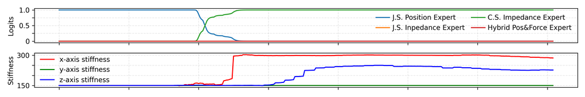
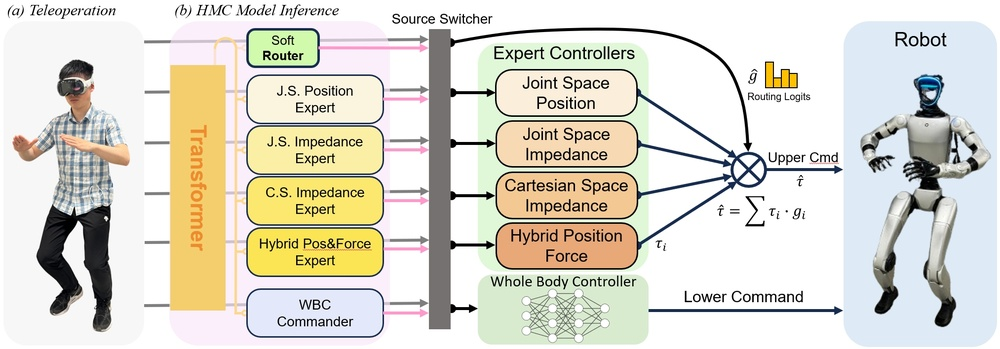
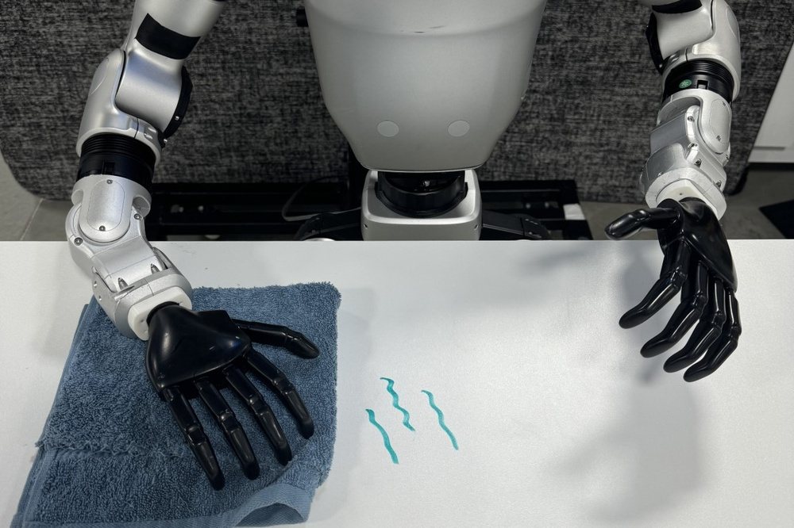
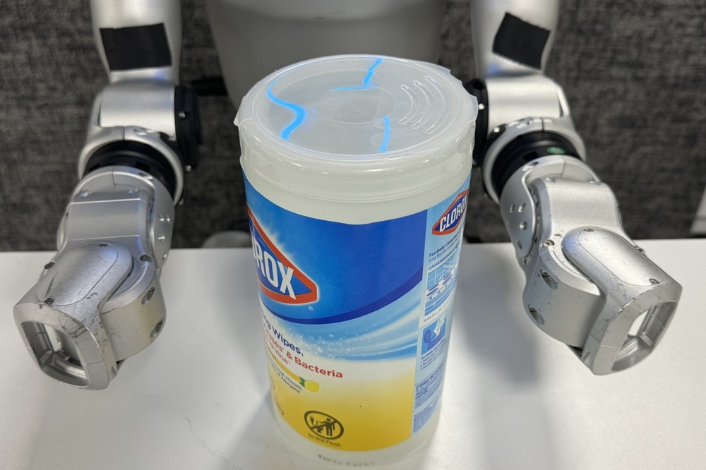
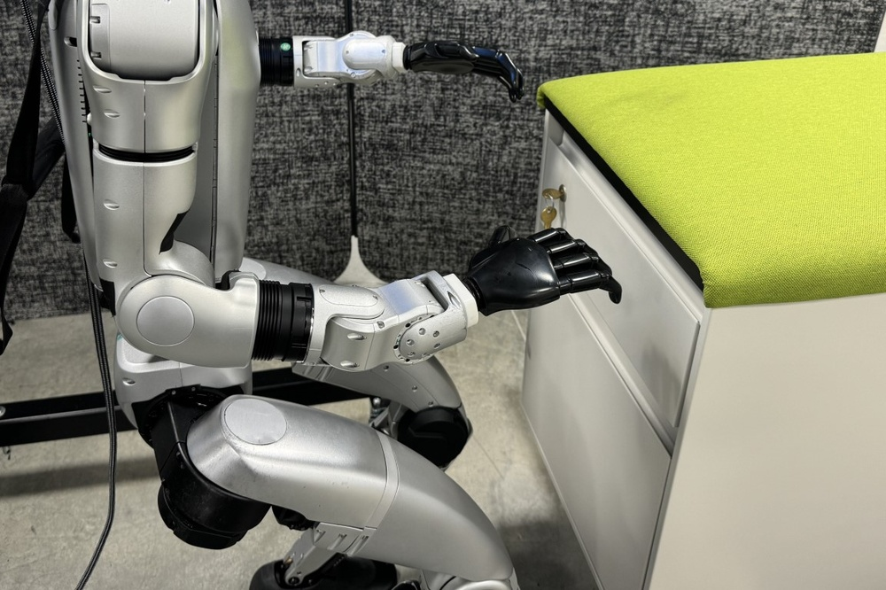
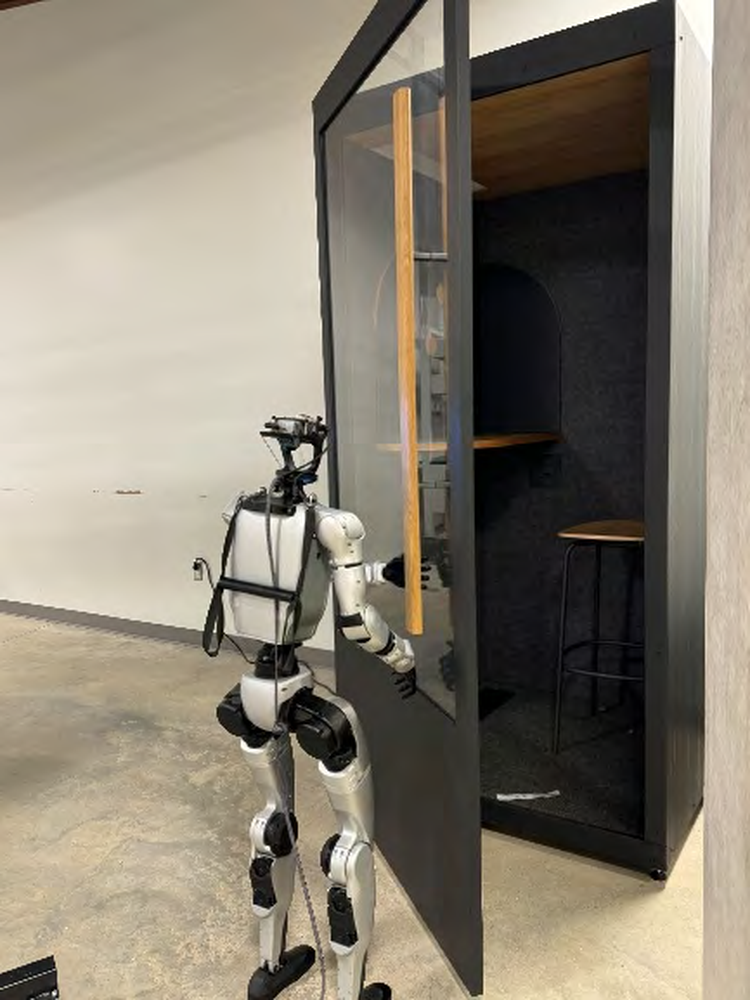
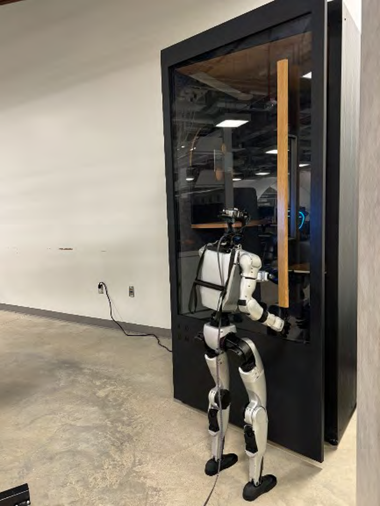
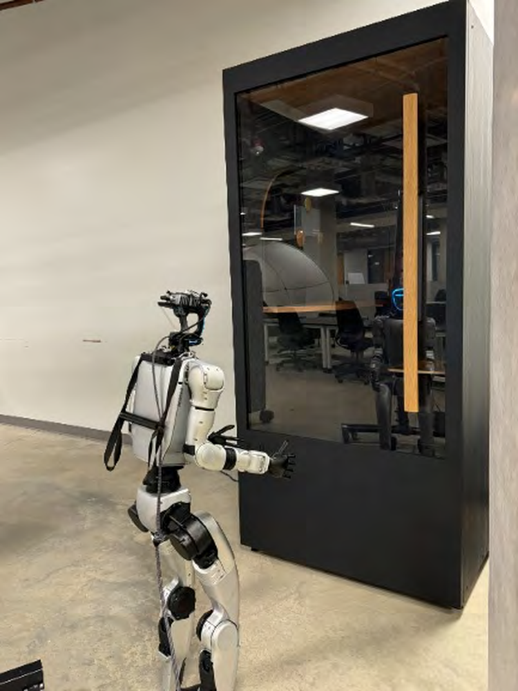
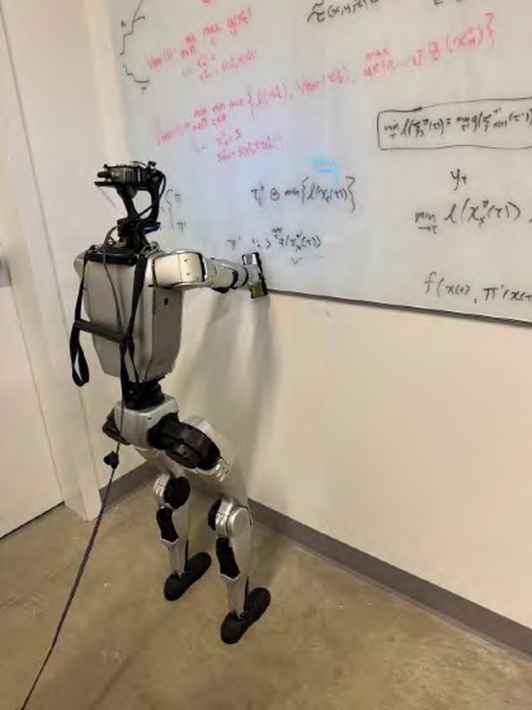

# HMC: Learning Heterogeneous Meta-Control for Contact-Rich Loco-Manipulation

**ArXiv ID**: 2511.14756v1
**URL**: http://arxiv.org/abs/2511.14756v1
**提交日期**: 2025-11-18
**作者**: Lai Wei; Xuanbin Peng; Ri-Zhao Qiu; Tianshu Huang; Xuxin Cheng; Xiaolong Wang
**引用次数**: NULL
使用模型: ep-20251112215738-bz78g

## 1. 核心思想总结
（第一轮总结）

**Background (背景)**
在机器人学习领域，通过真实世界演示来教导机器人执行复杂任务具有巨大潜力。然而，现实环境中的交互动力学具有高度复杂性和可变性（如接触状态变化、负载变化），这使得传统的纯位置控制器在处理需要丰富接触的移动-操作任务时表现不佳。

**Problem (问题)**
当前基于学习的机器人控制方法，特别是纯粹的位置控制策略，难以有效应对需要精细力交互的移动-操作任务。它们在处理接触、适应可变负载以及实现柔顺控制方面存在局限性。

**Method (high-level) (方法 - 高层概述)**
本文提出了一个名为**异构元控制** 的框架。其核心思想是自适应地融合多种控制模式（位置控制、阻抗控制、力-位置混合控制），而非依赖单一模式。
1.  **HMC-Controller**: 设计了一个控制器接口，能够在力矩空间无缝地混合来自不同控制模式的动作，支持遥操作与策略部署。
2.  **HMC-Policy**: 提出了一种学习策略，采用**混合专家** 的路由架构，从大规模纯位置数据和高精度力感知演示中学习，以生成鲁棒的、力感知的控制指令。

**Contribution (贡献)**
1.  提出了一个统一的HMC框架，用于解决接触丰富的移动-操作任务。
2.  设计了能够自适应融合多种控制模式的控制器接口和学习策略。
3.  在真实人形机器人上的实验验证表明，该方法在具有挑战性的任务（如柔顺桌面擦拭、抽屉开启）上，性能相对于基线有超过50%的相对提升，证明了其有效性。

## 2. 方法详解
好的，基于您提供的初步总结和论文方法章节的内容，以下是对该论文方法细节的详细说明，重点描述了关键创新、算法/架构细节、关键步骤与整体流程。

### 论文方法细节详解

#### 1. 核心思想与关键创新

**核心思想：**
论文的核心思想是摒弃传统单一的控制模式（如纯位置控制），转而采用一种**自适应、可融合**的异构控制框架。该框架能够根据任务当前的需求，动态地选择和组合最合适的控制模式（如位置控制、阻抗控制、力控制），从而在复杂接触任务中实现鲁棒且柔顺的性能。

**关键创新：**
1.  **异构控制模式的统一与融合：** 这是最根本的创新。论文没有将不同的控制模式视为独立的、互斥的选择，而是设计了一个统一的接口（HMC-Controller）和决策机制（HMC-Policy），使它们可以在**力矩控制空间** 进行无缝融合。这使得机器人可以同时追求位置精度和力交互的柔顺性。
2.  **基于混合专家架构的策略学习：** 论文将控制模式的选择与动作生成问题建模为一个**混合专家模型**。其中，每个“专家”网络擅长处理一种特定的交互模态（如自由运动、接触约束），而一个“门控”网络负责根据当前环境状态（观测）自适应地加权组合这些专家的输出。这是一种非常优雅地将高层决策（用什么控制模式）与底层控制（生成具体指令）结合在一起的机器学习架构。
3.  **从异构演示数据中学习：** 该方法能够有效地利用两种不同来源和精度的演示数据进行训练：
    *   **大规模纯位置演示数据：** 易于获取，但缺乏力感知。
    *   **小规模高精度力感知演示数据：** 获取成本高，但包含了关键的力交互信息。
    MoE架构天然适合这种场景，门控网络可以学会在缺乏力信息的情况下依赖位置专家，而在需要精细力控时信任力控专家。

#### 2. 算法/架构细节

整个HMC框架由两个核心部分组成：**HMC-Controller** 和 **HMC-Policy**。

##### 2.1 HMC-Controller（控制器接口）

**功能：** 作为一个底层执行器，接收来自HMC-Policy的异构控制指令，并将其融合转化为最终发送给机器人关节的扭矩命令。

**支持的控制模式（专家）及其数学表示：**
假设机器人的状态为关节位置 \(q\)、速度 \(\dot{q}\)，期望状态为 \(q_d\), \(\dot{q}_d\)，期望接触力为 \(F_d\)。

1.  **位置控制专家：**
    *   **目标：** 驱动机器人到达目标位置，忽略接触力。
    *   **扭矩计算：** 使用PD控制律。
        \[
        \tau_{pos} = K_p (q_d - q) + K_d (\dot{q}_d - \dot{q})
        \]
    *   \(K_p\), \(K_d\) 为比例和微分增益。

2.  **阻抗控制专家：**
    *   **目标：** 调节机器人与环境之间的动态交互关系，表现为一个弹簧-阻尼系统。当发生接触时，会产生顺应性的运动。
    *   **扭矩计算：**
        \[
        \tau_{imp} = M(\ddot{q}_d + K_d (\dot{q}_d - \dot{q}) + K_p (q_d - q)) + Coriolis/Gravity
        \]
    *   其中 \(M\) 是惯性矩阵，\(Coriolis/Gravity\) 项用于动力学补偿。它本质上是在位置控制的基础上增加了惯性项，使得响应更“柔顺”。

3.  **力-位置混合控制专家：**
    *   **目标：** 在任务空间的不同方向上分别进行位置控制和力控制。例如，在插销任务中，垂直于插销的方向进行力控（保持接触），沿插销轴的方向进行位控（插入）。
    *   **扭矩计算：** 首先在任务空间（Cartesian Space）计算：
        \[
        F_{hybrid} = S \cdot F_{pos} + (I - S) \cdot F_{force}
        \]
    *   其中 \(S\) 是一个选择矩阵，用于指定哪些方向是位置控制，哪些是力控制。\(F_{pos}\) 是基于位置误差计算的任务空间力，\(F_{force}\) 是直接指定的期望力。然后通过机器人的雅可比矩阵转置 \(J^T\) 将任务空间力映射回关节扭矩：
        \[
        \tau_{hybrid} = J^T F_{hybrid}
        \]

**融合机制：**
HMC-Controller 接收来自HMC-Policy的指令，该指令不仅包含每个专家的期望目标（\(q_d, F_d\) 等），还包含每个专家的**权重** \(w_i\)。最终作用于机器人的总扭矩是所有专家扭矩的加权和：
\[
\tau_{cmd} = w_{pos} \cdot \tau_{pos} + w_{imp} \cdot \tau_{imp} + w_{hybrid} \cdot \tau_{hybrid}
\]
这种在力矩空间的融合确保了不同控制模式指令的平滑过渡与协同作用。

##### 2.2 HMC-Policy（学习策略）

**功能：** 作为一个高层决策器，根据当前的观测（如关节状态、视觉信息、力传感器读数）产生两样东西：1）每个控制专家的目标参数；2）每个专家的融合权重。

**架构：混合专家（MoE）**
1.  **专家网络：** 每个专家网络（\(E_i\)）是一个神经网络，它接收观测状态 \(o_t\)，并输出其对应控制模式所需的**目标参数** \(a_t^i\)。例如：
    *   位置专家输出：目标关节位置 \(q_d\)。
    *   力-位置混合专家输出：任务空间期望力 \(F_d\) 和选择矩阵 \(S\)。
2.  **门控网络：** 门控网络（\(G\)）是另一个神经网络，它也接收相同的观测状态 \(o_t\)，并输出一个**概率分布（权重向量）** \(w_t = [w_{pos}, w_{imp}, w_{hybrid}]\)。该权重表示在当前状态下，每个专家输出的相对重要性。通常使用Softmax函数确保权重之和为1。
    \[
    w_t = \text{Softmax}(G(o_t))
    \]

**策略的输出：**
HMC-Policy 的最终输出是所有专家输出的加权组合：
\[
a_t = \sum_{i} w_t^i \cdot a_t^i
\]
这个组合后的动作 \(a_t\) 就包含了发送给HMC-Controller的所有必要信息（即各专家的目标参数和其权重）。

**训练过程：**
论文采用**模仿学习**，很可能使用了**行为克隆** 或 **DAgger** 等算法。训练数据来自人类的遥操作演示。损失函数通常包含两部分：
1.  **动作重建损失：** 鼓励策略输出的融合动作 \(a_t\) 与专家演示的动作 \(a_t^*\) 接近。
2.  **专家 specialization 损失（可选）：** 鼓励每个专家网络在其擅长的交互模式下（由演示数据中的上下文暗示）表现得更好，同时鼓励门控网络做出正确的路由选择。

#### 3. 关键步骤与整体流程

整个系统在部署时的运行流程可以概括为以下闭环步骤：

1.  **状态观测：** 机器人从传感器（编码器、摄像头、力/力矩传感器等）获取当前环境状态 \(o_t\)。
2.  **策略推理：**
    *   将 \(o_t\) 同时输入到HMC-Policy的门控网络 \(G\) 和所有专家网络 \(E_i\)。
    *   门控网络计算得出权重向量 \(w_t\)。
    *   每个专家网络并行计算其控制目标 \(a_t^i\)。
3.  **动作融合：** 在策略内部，根据权重 \(w_t\) 对各个专家的输出 \(a_t^i\) 进行加权融合，形成最终的动作指令 \(a_t\)。
4.  **控制执行：**
    *   HMC-Controller 接收动作指令 \(a_t\)（其中包含了各专家的目标参数和权重）。
    *   HMC-Controller 根据各专家的目标，分别计算出对应的关节扭矩 \(\tau_{pos}, \tau_{imp}, \tau_{hybrid}\)。
    *   HMC-Controller 按照收到的权重 \(w_t\)，对这些扭矩进行加权求和，得到最终的命令扭矩 \(\tau_{cmd}\)。
5.  **驱动机器人：** 将 \(\tau_{cmd}\) 发送给机器人的底层驱动器，驱动关节运动。
6.  **状态更新：** 机器人执行动作后，环境状态发生变化，回到步骤1，开始下一个控制循环。

**总结而言，** 该论文的方法通过一个精心设计的MoE学习策略（HMC-Policy）和一个统一的力矩融合控制器（HMC-Controller），实现了对多种控制模式的**自适应、在线、细粒度**的融合。这使得机器人能够像人类一样，在面对复杂任务时灵活地切换和组合不同的控制策略，从而显著提升了在接触丰富的移动-操作任务中的鲁棒性和性能。

## 3. 最终评述与分析
好的，结合前两轮返回的详细信息与论文结论部分，现给出最终的综合评估如下：

### 关于“异构元控制（HMC）”框架的最终综合评估

#### 1. 总体摘要

本论文针对机器人学习领域中的一个核心挑战——如何在复杂、接触丰富的移动-操作任务中实现鲁棒且柔顺的控制——提出了一个创新的解决方案。论文指出，传统的单一控制模式（如纯位置控制）在处理动态接触、可变负载等现实不确定性时存在固有局限。为此，作者提出了**异构元控制** 框架，其核心思想是**自适应地融合多种基础控制模式（位置、阻抗、力-位置混合控制）**，而非依赖单一模式。该框架通过一个统一的力矩空间控制器（HMC-Controller）和一个基于混合专家架构的学习策略（HMC-Policy），实现了根据任务上下文动态选择并融合最优控制策略的能力。在真实人形机器人上进行的一系列挑战性任务实验表明，该方法性能显著优于基线（相对提升超过50%），有效证明了其解决复杂接触问题的强大潜力。

#### 2. 优势

*   **创新性强：** 提出了“异构控制融合”这一核心概念，跳出了传统单一控制模式的思维定式。将混合专家模型用于控制模式的选择与融合，是算法层面一个优雅而高效的创新。
*   **实用性与泛化能力突出：** 方法不局限于仿真，在真实机器人上得到了验证，能够处理擦拭、开门、插销等需要精细力交互的实际任务。其自适应融合机制使其能泛化到训练数据未完全覆盖的动态变化环境（如负载变化）。
*   **数据利用效率高：** HMC-Policy的架构能够同时利用易于获取的大规模纯位置演示数据和稀缺但精确的力感知演示数据，降低了高质量数据集的收集成本，更符合实际应用场景。
*   **性能卓越：** 实验结果表明，该方法在成功率和控制质量（如柔顺性、鲁棒性）上均大幅领先于纯位置控制、阻抗控制等基线方法，定量结果具有说服力。
*   **系统设计完整：** 框架包含了从高层策略（HMC-Policy）到底层执行（HMC-Controller）的完整闭环，设计清晰，具有较好的工程可实现性。

#### 3. 局限性与不足

*   **对演示数据的依赖性：** 作为一款基于模仿学习的方法，其性能上限在很大程度上依赖于演示数据的质量和多样性。如果演示未能覆盖所有关键的任务场景或故障模式，策略可能无法很好地泛化。
*   **计算复杂度与实时性：** 混合专家模型需要并行运行多个专家网络和一个门控网络，相较于单一策略，计算开销更大。这对控制器的实时运行频率提出了更高要求，可能在计算资源受限的机器人平台上成为瓶颈。
*   **理论分析深度可能不足：** 论文主要侧重于工程实现和实验验证，对于不同控制模式融合后的闭环系统稳定性、收敛性等理论性质的分析可能相对有限。
*   **任务范围的局限性：** 尽管在所选任务上表现优异，但该方法在更极端或未见过的情况下的泛化能力（例如，面对全新的物体形状或完全不同的接触动力学）仍需在更广泛的任务集中进行测试。
*   **参数调优的复杂性：** 框架中涉及多个网络结构和控制参数（如各控制模式的增益），虽然部分可以通过学习获得，但整体的训练和调优过程可能较为复杂。

#### 4. 潜在应用与启示

*   **潜在应用：**
    *   **工业自动化：** 适用于需要柔顺装配、精密打磨、线束插接等复杂接触任务的工业机器人。
    *   **家政与服务机器人：** 可用于擦窗、洗碗、整理物品等家庭环境中的移动-操作任务。
    *   **医疗机器人：** 在需要与人进行安全、柔顺交互的手术辅助或康复训练场景中具有应用潜力。
    *   **太空与极限环境机器人：** 用于在不确定环境中进行设备维护、采样等任务，其鲁棒性至关重要。

*   **研究启示：**
    *   **范式转变：** 为机器人控制研究提供了一个新思路，即从设计“单一最优控制器”转向设计“能智能融合多种控制器的元控制器”。
    *   **模仿学习与强化学习的结合：** 该框架可以自然地与强化学习结合，通过在线交互进一步优化门控网络和专家策略，减少对完美演示数据的依赖。
    *   **基础模型与机器人控制：** 这种“路由”和“融合”的思想可借鉴于基于大语言模型或视觉语言模型的机器人控制，让模型决策调用不同的底层控制技能包。

**总结：** 本论文提出的异构元控制框架是一个在机器人学习领域兼具创新性、实用性和影响力的工作。它有效地解决了接触丰富任务中的控制难题，虽然存在一些依赖于数据和计算资源的局限性，但其核心思想、强大的实验表现以及广阔的应用前景，使其成为推动机器人走向更复杂、更动态真实环境的重要一步。

---

# 附录：论文图片

## 图 1

## 图 2

## 图 3

## 图 4

## 图 5

## 图 6

## 图 7

## 图 8

## 图 9

## 图 10

