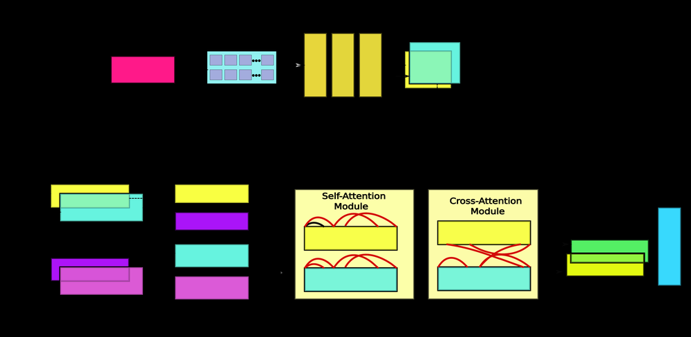
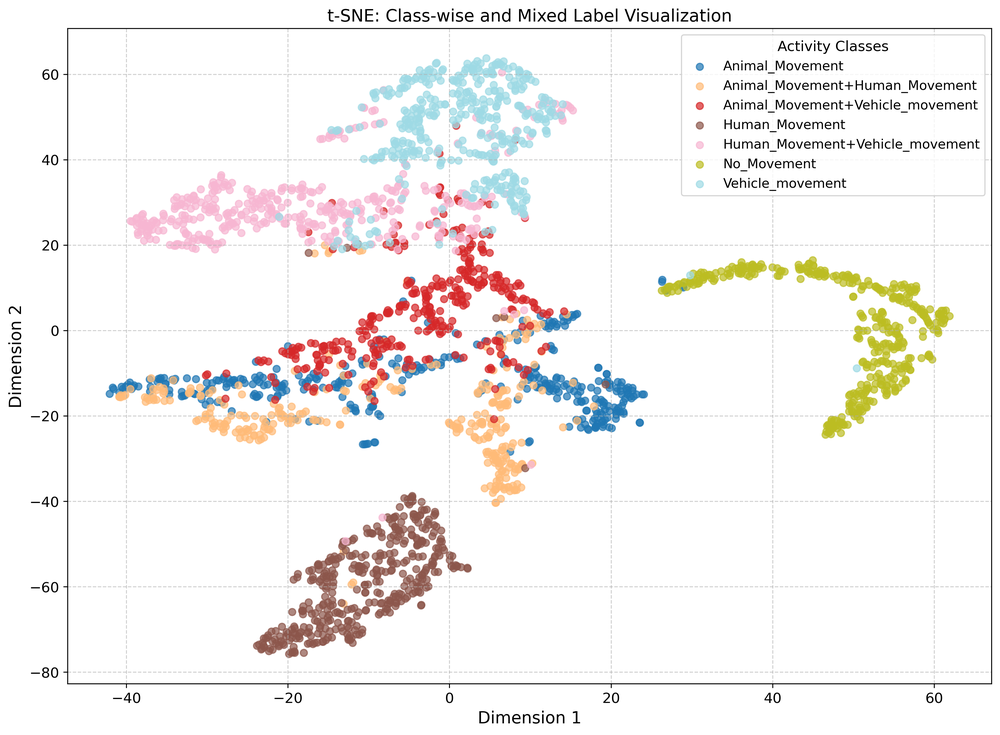
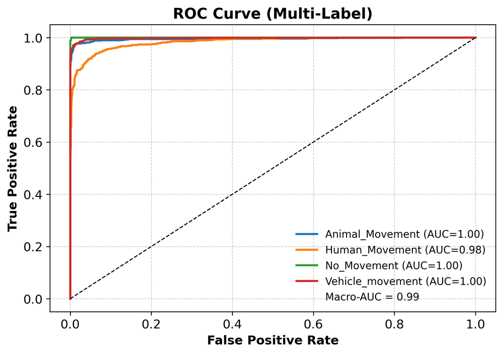
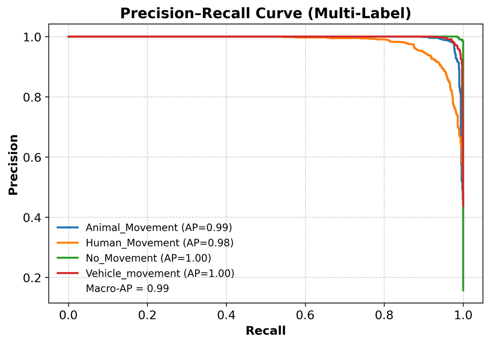
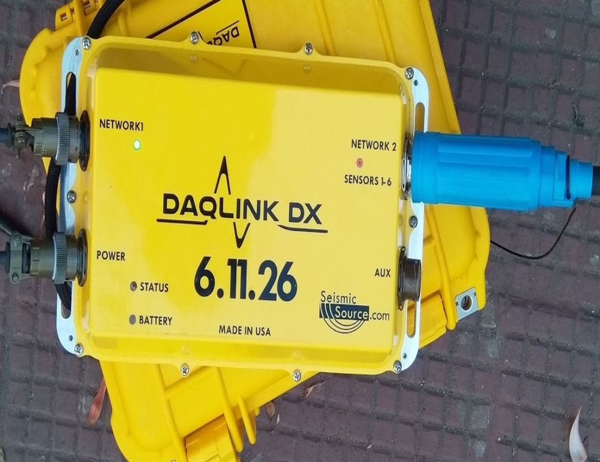
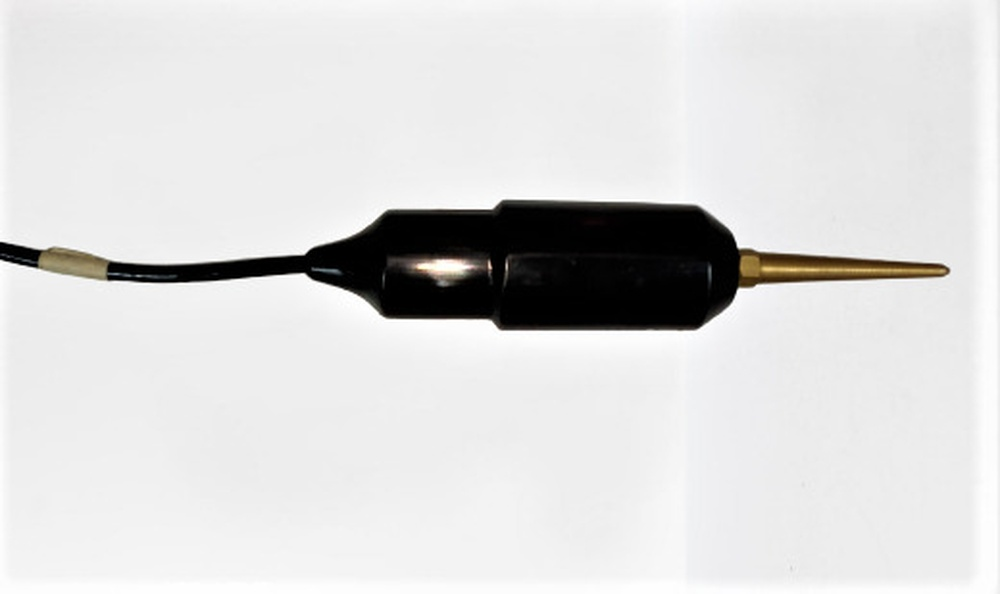

# HyMAD: A Hybrid Multi-Activity Detection Approach for Border Surveillance and Monitoring

**ArXiv ID**: 2511.14698v1
**URL**: http://arxiv.org/abs/2511.14698v1
**提交日期**: 2025-11-18
**作者**: Sriram Srinivasan; Srinivasan Aruchamy; Siva Ram Krisha Vadali
**引用次数**: NULL
使用模型: ep-20251112215738-bz78g

## 1. 核心思想总结
**第一轮总结**

**标题：** HyMAD：一种用于边境监视与监控的混合多活动检测方法

**1. Background (背景)**
地震传感技术因其传感器（可埋于地下、难以被察觉和破坏）的隐蔽性优势，已成为边境监视与监控领域一种有前景的解决方案，优于可见度高的摄像头或围栏。

**2. Problem (问题)**
当前面临的主要挑战在于，由于地震信号复杂且含有噪声，难以准确检测和区分**同时发生、相互重叠的活动**（如人员入侵、动物移动和车辆行驶）。这种重叠会导致误分类、漏检以及对态势的误判，严重降低了监控系统的可靠性。

**3. Method (高层次方法)**
本文提出HyMAD，一种基于**空时特征融合**的深度神经网络架构。该方法的核心是：
*   **特征提取与融合**：结合使用SincNet提取频谱特征，以及循环神经网络（RNN）建模时间依赖性。
*   **表征增强**：采用自注意力层来加强模态内的特征表征。
*   **多模态融合**：通过一个跨模态融合模块，实现鲁棒的**多标签分类**，以识别同时发生的多个活动。

**4. Contribution (贡献)**
*   提出了HyMAD框架，专门用于解决地震信号中**复杂、同步活动**的检测与分类难题。
*   在真实边境监控场景下收集的数据集上进行评估，证明了该方法能有效泛化到人、动物、车辆同时存在的复杂场景，性能具有竞争力。
*   提供了一个模块化框架，为现实世界安全应用中的地震活动识别提供了可扩展的基础。

## 2. 方法详解
好的，基于您提供的初步总结和论文方法章节内容，以下是对HyMAD方法细节的详细说明，重点描述了其关键创新、算法/架构细节、关键步骤与整体流程。

### **论文方法详述：HyMAD混合多活动检测框架**

#### **一、 核心问题与关键创新**

*   **核心挑战**： 传统方法难以处理地震信号中**同时发生、相互重叠的多种活动**。这些信号在时域和频域上相互交织，导致单一标签分类模型（即一个时间段内只识别一种活动）失效，造成误报和漏报。
*   **关键创新**：
    1.  **多标签分类框架**： 将问题定义为**多标签分类任务**，即模型可以为一个时间段的信号预测多个标签（如`[人， 动物]`），从而直接解决同步活动检测问题。
    2.  **空时特征融合的混合架构**： 设计了一个精心组合的深度学习流水线，分别从**频域（空）** 和**时域（时）** 提取并融合特征，以全面捕捉信号的静态特性和动态演化。
    3.  **模态内与模态间双重增强**： 引入**自注意力机制**来增强**模态内**的特征表征，并设计**跨模态注意力融合模块**来实现**模态间**的有效信息交互，这是实现高精度多标签识别的关键。

#### **二、 整体流程与架构细节**

HyMAD的整体架构是一个端到端的深度学习模型，其流程主要分为四个核心阶段，如下图所示（图示说明）：

`[原始地震信号输入] -> [特征提取模块] -> [模态内表征增强模块] -> [跨模态融合与多标签分类模块] -> [多标签活动输出]`

下面我们详细拆解每个阶段：

**阶段一： 双分支空时特征提取**

此阶段的目标是从原始波形中提取最基础且互补的两类特征。

1.  **输入**： 原始的一维地震信号时间序列，被分割成固定长度的段（例如，几秒长的信号段）。
2.  **SincNet分支（空/频域特征提取）**：
    *   **目的**： 提取与活动源物理特性（如脚步频率、引擎震动频率）直接相关的**频域特征**。SincNet的优势在于其第一层使用参数化的Sinc函数（可理解为带通滤波器）进行卷积，能更直接、更高效地学习到有意义的滤波器组，优于标准的卷积层。
    *   **关键步骤**：
        *   **Sinc卷积**： 输入信号通过SincNet的第一层卷积，该层学习的是多个带通滤波器的截止频率。
        *   **多层CNN**： 随后通过多层标准的卷积层、池化层和非线性激活函数，逐步抽象出高级的频谱特征。最终输出一个特征向量，我们称之为 **“空域特征向量 F_s”**。

3.  **RNN分支（时域特征提取）**：
    *   **目的**： 捕捉地震信号中固有的**时间动态和依赖关系**。例如，人行走的脚步声是有规律的周期性事件，RNN擅长建模这种序列模式。
    *   **关键步骤**：
        *   **特征预处理**： 原始信号可能先经过一个或多个一维卷积层进行初步的特征变换，或将信号分帧，以更好地输入RNN。
        *   **RNN建模**： 处理后的序列被输入到循环神经网络（如GRU或LSTM）中。RNN按时间步处理序列，并利用其隐藏状态记忆历史信息。
        *   **特征汇总**： 通常取RNN最后一个时间步的隐藏状态，或对所有时间步的隐藏状态进行池化，作为整个序列的时域特征表示，我们称之为 **“时域特征向量 F_t”**。

**阶段二： 模态内表征增强（自注意力层）**

*   **目的**： 在将两个模态的特征融合之前，先分别对它们进行“精炼”。自注意力机制可以让特征向量内部的不同部分进行交互，从而**突出那些对分类更关键的信息，抑制次要或噪声信息**。
*   **关键步骤**：
    *   将 `F_s` 和 `F_t` 分别通过一个自注意力层。
    *   自注意力层会为特征向量的每个维度计算一个权重得分，得分高的维度代表其重要性更高。
    *   将原始特征向量与这些权重相乘，得到增强后的特征向量 `F_s_att` 和 `F_t_att`。

**阶段三： 跨模态融合与多标签分类**

这是整个方法最核心的创新点，目的是让空域和时域特征“对话”，共同决策存在哪些活动。

1.  **跨模态注意力融合模块**：
    *   **目的**： 实现一种**非对称的、有指导的融合**。它不是简单地将两个特征向量拼接或相加，而是让一个模态的特征去“查询”另一个模态，找出与之最相关的信息。
    *   **关键步骤（以“空域查询时域”为例）**：
        *   **计算注意力权重**： 将增强后的空域特征 `F_s_att` 作为`Query`，将时域特征 `F_t_att` 作为`Key`，计算一个注意力分布。这个分布表示，对于当前的空域特征，时域特征的哪些部分最相关。
        *   **生成上下文向量**： 使用上述注意力权重对 `F_t_att`（作为`Value`）进行加权求和，得到一个浓缩的、与空域特征相关的时域上下文向量。
        *   **特征融合**： 将原始的 `F_s_att` 与计算出的时域上下文向量进行融合（例如，拼接后再通过一个全连接层降维），生成一个**融合特征向量 F_fused**。这个过程同样可以反向进行（时域查询空域），最终将两个方向的融合结果进一步结合。

2.  **多标签分类输出层**：
    *   **目的**： 根据融合后的特征 `F_fused`，预测每个活动类别存在的概率。
    *   **关键步骤**：
        *   将 `F_fused` 输入到一个或多个全连接层。
        *   最终输出层使用 **Sigmoid 激活函数**（而非Softmax），其神经元数量等于活动类别的数量（如3个：人、车、动物）。
        *   每个输出神经元的Sigmoid值是一个介于0和1之间的独立概率，表示对应活动存在的置信度。通过设置一个阈值（如0.5），即可得到多标签预测结果（例如，`[人: 0.9, 动物: 0.6, 车辆: 0.05] -> 预测为 [人， 动物]`）。

#### **三、 关键步骤总结**

1.  **数据预处理**： 收集原始地震信号，进行去噪、分段、归一化等预处理。
2.  **双路特征提取**： 并行使用SincNet（CNN）和RNN，分别从输入信号段中提取频域静态特征和时域动态特征。
3.  **特征自增强**： 分别对两个特征向量应用自注意力机制，提升其特征判别力。
4.  **跨模态融合**： 利用跨模态注意力机制，让空域和时域特征进行交互，生成一个信息更全面的联合特征表示。
5.  **多标签预测**： 将融合特征输入全连接网络，利用Sigmoid输出层独立预测每个活动标签的概率，完成最终分类。

#### **四、 核心优势**

*   **端到端可训练**： 整个架构可以从原始数据直接学习到最终的多标签输出，无需繁琐的手工特征工程。
*   **物理可解释性**： SincNet的使用使模型学习的滤波器具有明确的物理意义（频率带宽），增加了模型的可解释性。
*   **鲁棒性与判别性**： 通过空时特征融合和双重注意力机制，模型能有效聚焦于信号中最具判别性的部分，对噪声和信号重叠有更强的鲁棒性。

综上所述，HyMAD通过其创新的混合架构和精心设计的融合策略，为解决地震信号中复杂同步活动的检测难题提供了一个强大而有效的解决方案。

## 3. 最终评述与分析
基于前两轮提供的论文背景、方法详述及结论部分，现给出对HyMAD方法的最终综合评估如下：

### **最终综合评估**

#### **1. Overall Summary (总体总结)**
本论文针对边境监控中地震传感信号**复杂、同步、重叠活动**难以准确检测的核心挑战，提出了一种名为**HyMAD**的混合多活动检测方法。该方法创新性地构建了一个基于深度学习的多标签分类框架，其核心在于通过**双分支网络（SincNet + RNN）** 分别提取信号的频域（空）和时域特征，并先后利用**自注意力机制**和**跨模态注意力融合模块**来增强模态内表征并实现模态间的有效信息交互。最终，模型能够为一个时间段的信号预测多个活动标签（如同时存在人员和动物）。在真实边境场景数据集上的实验表明，HyMAD能够有效处理信号重叠问题，其性能优于传统方法，为构建更可靠、智能的隐蔽式边境监控系统提供了有力的技术方案。

#### **2. Strengths (优势)**
*   **问题定位精准，创新性强**： 直面现实监控场景中“多活动同步发生”这一关键难题，将问题定义为**多标签分类**，而非传统的单一标签分类，这在方法论上是一个重要且务实的创新。
*   **架构设计精巧且全面**： 提出的混合架构（SincNet + RNN）综合考虑了信号的静态频谱特性和动态时间演化规律，特征提取全面。引入的**双重注意力机制**（自注意力 + 跨模态注意力）是模型高性能的关键，能有效聚焦于判别性特征并促进信息融合。
*   **性能优越，实用性强**： 在真实场景数据集上验证了其有效性和泛化能力，证明了其相对于基线方法的竞争优势，显示出直接应用于实际边境监控系统的潜力。
*   **一定的可解释性**： 采用SincNet作为特征提取器，其学习的滤波器参数与频率直接相关，相比“黑箱”程度更高的标准卷积层，为模型决策提供了一定的物理可解释性。
*   **模块化与可扩展性**： 论文指出其框架是模块化的，便于未来集成其他传感器模态（如声学）或替换更先进的子模块（如用Transformer替代RNN），为后续研究奠定了基础。

#### **3. Weaknesses / Limitations (劣势/局限性)**
*   **数据依赖性与泛化能力**： 模型的性能高度依赖于训练数据的质量和代表性。在不同于训练数据地理环境（如土壤成分、地形）或活动类型（如新型交通工具）的新场景中，其泛化能力可能需要进一步验证，可能存在性能下降的风险。
*   **计算复杂度**： 结合了多种深度学习组件（双分支网络、注意力机制），模型可能具有较高的计算复杂度和内存需求，这对部署在资源受限的边缘设备（如边境现场的嵌入式传感器节点）上构成了挑战，实时性可能需要优化。
*   **对信号重叠程度的极限挑战**： 虽然论文表明能处理同步活动，但对于信号强度悬殊极大或完全时频重叠的极端情况，模型的检测精度极限未作深入探讨，其鲁棒性边界尚不明确。
*   **实验评估的局限性**： 结论部分可能未包含与更广泛的最新先进方法的对比，也未进行详尽的消融研究以量化每个创新组件（尤其是跨模态注意力）的确切贡献度，这在一定程度上影响了对其核心创新点效力的绝对评估。

#### **4. Potential Applications / Implications (潜在应用/意义)**
*   **核心应用：智能边境监控系统**： HyMAD可直接用于提升现有地震传感边境监控系统的自动化水平和可靠性，实现对入侵人员、野生动物干扰和正常巡逻车辆的高精度、低误报识别，减轻人工监控负担，增强边境安全。
*   **扩展到其他安防场景**： 该技术可推广至关键基础设施保护（如机场周界、核电站围栏）、重要区域安保（如军事基地、工业园区）等需要隐蔽监控的场合。
*   **作为多模态融合的基础框架**： 其模块化设计和跨模态融合思想为**地震-声学**等多模态传感器信息融合提供了可扩展的框架，有望通过融合互补信息进一步提升复杂环境下的检测性能。
*   **方法论启示**： 该方法为解决其他领域类似的“多源混合信号分离与识别”问题（如医疗EEG/ECG信号分析、机械故障诊断、环境声音场景分析）提供了有价值的参考范式。

**总结**： HyMAD是一项目标明确、设计新颖、性能显著的研究，成功解决了边境监控地震信号分析中的一个实际痛点。尽管在泛化性、计算效率和实验深度方面存在一定的局限性，但其强大的潜在应用价值和方法论启示使其成为该领域一个重要的贡献，为未来更鲁棒、更智能的感知系统的发展指明了有前景的方向。

---

# 附录：论文图片

## 图 1

## 图 2

## 图 3

## 图 4

## 图 5

## 图 6

