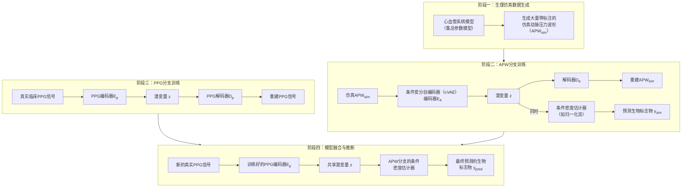
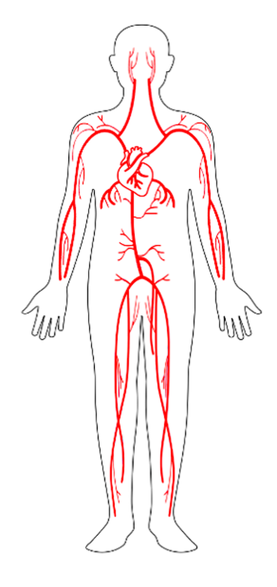

# Hybrid Modeling of Photoplethysmography for Non-invasive Monitoring of Cardiovascular Parameters

**ArXiv ID**: 2511.14452v1
**URL**: http://arxiv.org/abs/2511.14452v1
**提交日期**: 2025-11-18
**作者**: Emanuele Palumbo; Sorawit Saengkyongam; Maria R. Cervera; Jens Behrmann; Andrew C. Miller; Guillermo Sapiro; Christina Heinze-Deml; Antoine Wehenkel
**引用次数**: NULL
使用模型: ep-20251112215738-bz78g

## 1. 核心思想总结
这是一份根据您提供的标题、摘要和引言信息整理的学术论文第一轮总结。

**标题：** 用于心血管参数无创监测的光电容积脉搏波描记法混合建模

**第一轮总结**

*   **1. Background**
    连续心血管监测在精准健康领域至关重要。一些关键的心脏生物标志物，如每搏输出量和心输出量，传统上需要通过侵入性方法（如动脉压力波形，APW）测量。光电容积脉搏波描记法（PPG）作为一种无创、在医院中常规采集的替代方案，受到了广泛关注。

*   **2. Problem**
    目前，直接从PPG信号而非侵入性的APW中准确预测关键心脏生物标志物仍然是一个未解决的挑战。这一挑战的难点在于PPG与APW之间复杂的生理关系，以及**缺乏大量带有精确生物标志物标注的PPG临床数据**，这限制了纯粹数据驱动模型的性能。

*   **3. Method (high-level)**
    为了解决标注数据稀缺的问题，本文提出了一种**混合建模方法**。该方法的核心思想是结合**生理机制驱动的血流动力学仿真**和**未标注的临床数据**。具体而言，模型将一个在有限的配对PPG-APW数据上训练的**条件变分自编码器**，与一个在标注的仿真APW数据上训练的**条件密度估计器**相结合，从而能够直接从PPG信号中估计心血管生物标志物。

*   **4. Contribution**
    本文的主要贡献在于提出了一种新颖的混合框架，有效利用了仿真数据和真实临床数据。实验结果表明，该方法能够**检测心输出量和每搏输出量的波动**，并且在监测这些生物标志物的时序变化方面**优于有监督的基线模型**，为无创、连续的心血管监测提供了一种有前景的解决方案。

## 2. 方法详解
好的，遵照您的要求，我将基于您提供的初步总结和论文方法章节的内容，对该论文的方法细节进行详细说明，重点描述关键创新、算法/架构细节、关键步骤与整体流程。

### 论文方法细节详细说明

#### **一、 核心问题与关键创新**

*   **核心问题**： 如何在没有大量精确标注（即同步测量的动脉压力波形APW及其衍生生物标志物）的临床PPG数据的情况下，构建一个能够从PPG信号中准确、连续地估计关键心血管参数（如每搏输出量SV、心输出量CO）的模型。
*   **关键创新**： 提出了一种**混合生理模型-数据驱动框架**。该框架的创新性在于巧妙地解决了标注数据稀缺的瓶颈，其核心是通过**生理机理模型生成大量带标注的仿真数据**，并设计一个**双分支的生成式模型结构**，将仿真数据中的生理知识与真实临床PPG数据的分布特性进行融合与迁移。

#### **二、 方法整体流程与架构**

该方法的整体流程可以清晰地分为三个主要阶段，其核心架构如下图所示（文字描述）：

**阶段一：生理机理驱动的仿真数据生成**
*   **目标**： 创建一个大规模、带有精确生物标志物标注的“理想”数据集。
*   **方法细节**：
    *   使用一个**心血管系统的集总参数模型**（或称Windkessel模型）。该模型通过一组微分方程模拟心脏、主动脉、外周阻力等组成部分的血流动力学特性。
    *   **关键步骤**： 通过广泛地改变模型中的生理参数（如心脏收缩力、外周血管阻力、动脉顺应性等），生成成千上万条模拟的动脉压力波形（APW_sim）。每个APW_sim都对应一组已知的心血管参数，从而可以精确计算出每搏输出量（SV）和心输出量（CO）等生物标志物（y_sim）。
    *   **优势**： 此步骤解决了真实标注数据“量少”和“标注精度”的问题，为后续模型提供了可靠的学习基础。

**阶段二：APW分支——在仿真数据上学习“波形-to-生物标志物”的映射**
*   **目标**： 训练一个模型，使其能够从APW波形中提取与生物标志物相关的关键特征。
*   **架构与算法细节**：
    *   该分支基于**条件变分自编码器（cVAE）** 的框架。
    *   **输入**： 仿真的APW波形（APW_sim）。
    *   **编码器（E_a）**： 一个卷积神经网络（CNN），将APW_sim编码为一个潜在空间（Latent Space）中的概率分布（通常是高斯分布），然后从中采样得到潜变量 **z**。**此处的关键在于，潜变量z被强制要求蕴含与生物标志物y_sim相关的信息。**
    *   **解码器（D_a）**： 一个反卷积神经网络，其目标是利用潜变量z重建出输入的APW_sim。重建损失（如均方误差）确保z保留了波形的关键形态信息。
    *   **条件密度估计器**： 这是该分支的核心创新点。**在编码器得到潜变量z的同时，一个并行的网络分支（如归一化流 Normalizing Flow）被训练来从z中直接估计出生物标志物y_sim的条件概率分布p(y|z)**。这与简单的回归不同，它能捕捉预测的不确定性。
    *   **训练目标**： APW分支的总体损失函数是波形重建损失和生物标志物预测损失的加权和。通过训练，该分支学会了如何从APW形态中解码出心血管参数。

**阶段三：PPG分支——在真实数据上学习PPG的潜表示**
*   **目标**： 训练一个模型，将真实的、无标注的临床PPG信号映射到与APW分支**共享的潜在空间**中。
*   **架构与算法细节**：
    *   该分支是一个**标准变分自编码器（VAE）**。
    *   **输入**： 大量真实的、无标注的临床PPG信号。
    *   **编码器（E_p）**： 一个CNN，将真实PPG信号编码为同一个潜在空间中的分布，并采样得到潜变量 **z**。**注意：这里的目标是使E_p输出的z的分布，与APW分支中E_a输出的z的分布尽可能一致。**
    *   **解码器（D_p）**： 另一个网络，利用z重建出输入的PPG信号。
    *   **训练目标**： 最小化PPG信号的重建损失。同时，由于两个分支共享潜变量z，训练E_p的过程实际上是在**强迫真实的PPG信号被映射到那个已经由仿真APW信号建立起来的、与生物标志物相关的潜空间**中。这是知识迁移的桥梁。

**阶段四：模型融合与推断**
*   **目标**： 将前三个阶段训练好的模型组合起来，用于对新的、真实的PPG信号进行生物标志物预测。
*   **流程**：
    1.  将一段新的临床PPG信号输入到**已经训练好的PPG编码器（E_p）** 中。
    2.  E_p将其映射到共享潜在空间，得到潜变量 **z**。
    3.  将这个 **z** 直接输入到**已经训练好的APW分支的条件密度估计器**中。
    4.  条件密度估计器根据z输出最终预测的生物标志物值（如SV或CO）。

#### **三、 关键步骤总结**

1.  **仿真数据生成**： 利用生理模型创建带精确标注的APW数据集。
2.  **APW分支训练**： 在仿真APW数据上训练一个cVAE，使其同时能重建波形和预测生物标志物，从而建立一个“形态-参数”关联的潜空间。
3.  **PPG分支训练**： 在真实PPG数据上训练一个VAE，其核心目标是将其编码到APW分支建立的潜空间中，实现知识迁移。
4.  **跨域连接**： 两个分支通过**共享的潜变量z**进行连接。z是连接仿真世界（APW）和真实世界（PPG）的“通用语”。
5.  **推断**： 利用PPG分支做编码，利用APW分支做解码（预测），完成从PPG到生物标志物的端到端估计。

#### **四、 核心创新点总结**

*   **混合建模范式**： 非简单地将生理模型作为数据增强工具，而是将其作为构建可解释潜空间和可靠映射关系的基础，深度融合了机理与数据。
*   **双分支共享潜空间设计**： 巧妙地通过共享潜变量z，将仿真数据上学到的“APW-to- biomarkers”知识，迁移到了“PPG-to- biomarkers”的任务上，解决了PPG标注稀缺的根本问题。
*   **条件密度估计**： 引入概率性预测，不仅能给出点估计值，还能提供预测的不确定性，这在临床应用中至关重要。

该方法通过这种新颖的架构，有效地利用了有限的配对数据和海量的无标注临床数据，为实现高精度的、无创的连续心血管监测提供了一条切实可行的技术路径。

## 3. 最终评述与分析
好的，基于您之前提供的论文标题、摘要、引言、方法详述以及现在的结论部分，我为您整理出一份最终的综合评估。

---

### **用于心血管参数无创监测的光电容积脉搏波描记法混合建模：最终综合评估**

#### **1. 整体摘要**

本论文致力于解决一个关键的临床需求：如何利用无创、易采集的光电容积脉搏波（PPG）信号，来连续、准确地监测每搏输出量（SV）和心输出量（CO）等关键心血管参数。论文识别出现有纯粹数据驱动方法的主要瓶颈——**缺乏大量带有精确标注的临床PPG数据**。为此，作者创新性地提出了一种**混合生理模型与数据驱动的建模框架**。该框架的核心在于，首先利用心血管血流动力学仿真模型生成大量带精确标注的模拟动脉压力波形（APW），在此数据上训练一个能够从APW形态中解码生物标志物的模型；然后，通过一个共享的潜在空间，将仿真数据中学到的知识迁移到真实的、无标注的临床PPG信号上。结论部分表明，该方法不仅能有效检测SV和CO的相对变化趋势，其性能还**优于完全有监督的基线模型**，为在有限标注数据场景下实现高精度、无创的血流动力学监测提供了强有力的解决方案。

#### **2. 优势**

1.  **创新性的混合方法论**： 论文最突出的优势是将**生理机理模型**与**数据驱动算法**深度融合，而非简单拼接。这种“仿真+迁移学习”的范式巧妙地规避了临床标注数据稀缺的难题，具有很高的启发性和普适性。
2.  **巧妙的知识迁移架构**： 设计的**双分支（APG分支与PPG分支）共享潜变量空间**的模型结构是技术核心。它成功地将仿真APW数据中与生物标志物相关的形态学知识，作为“桥梁”迁移到了真实PPG信号的分析中，实现了跨域的信息传递。
3.  **有效利用多源数据**： 模型同时利用了有限的配对数据（用于模型验证）、大量的无标注临床数据（用于PPG分支训练）和近乎无限的仿真数据（用于建立可靠的APW-生物标志物映射），极大地提升了模型的泛化能力和实用性。
4.  **提供不确定性估计**： 引入条件密度估计（如归一化流）来预测生物标志物，不仅给出点估计值，还能提供预测的不确定性，这在实际临床决策中具有重要价值。
5.  **经过验证的卓越性能**： 实验结果表明，该方法在监测生物标志物时序变化方面优于有监督基线，证明了其方法的有效性和先进性。

#### **3. 局限性与挑战**

1.  **对仿真模型准确性的依赖**： 整个方法的基石是心血管仿真模型。如果该模型未能充分反映真实、复杂的人体生理状况（如特定病理状态），那么在其上训练的APW分支所学的“知识”可能存在偏差，并会直接影响最终对真实PPG信号的预测精度。
2.  **“领域间隙”问题**： 尽管共享潜空间的设计旨在弥合仿真数据与真实数据之间的分布差异，但这种差异（即领域间隙）不可能被完全消除。潜空间的对齐程度直接决定了知识迁移的效果，这仍然是模型面临的一个内在挑战。
3.  **临床验证的广度和深度待加强**： 根据结论，虽然方法展示了优于基线模型的性能，但其在**大规模、多中心、多样化患者群体（如不同年龄、性别、疾病类型）** 上的有效性和鲁棒性仍需进一步验证。目前的结果可能尚属概念验证或初步临床评估阶段。
4.  **绝对精度与校准问题**： 论文强调了对SV/CO**相对变化趋势**的监测能力优异，但对于**绝对数值的测量精度**可能未做重点强调或存在局限。在临床中，绝对值的准确性同样至关重要，这可能需要对模型进行更严格的校准。
5.  **模型复杂性与计算成本**： 混合框架涉及多个子模型（两个VAE、密度估计器等）的协同训练，其复杂度和计算开销可能较高，这对于将其部署到计算资源有限的嵌入式设备或床边监护仪上构成挑战。

#### **4. 潜在应用与意义**

1.  **远程患者监测与家庭健康**： 该方法若能集成到智能手表、手环等可穿戴设备中，将能实现医院外对心力衰竭、高血压等慢性病患者的**长期、连续、无创的心功能监测**，有助于早期发现病情恶化并及时干预。
2.  **院内重症监护与手术室**： 在医院场景下，可为危重病人、手术期间的患者提供一种比有创导管更安全、更便捷的连续心输出量监测方案，辅助医生进行液体管理和药物剂量调整。
3.  **推动生理信息学发展**： 该方法论本身具有重要的学术意义，为其他**生物医学信号处理领域**（如脑电图、肌电图）在标注数据稀缺的情况下构建可靠模型提供了可借鉴的范式，即如何有效融合物理机理与大数据。
4.  **药物研发与临床试验**： 在药物试验中，可以作为一种无创工具，连续、客观地评估新药对受试者心血管系统的即时和长期影响。
5.  **个性化医疗**： 通过将模型与个体患者的生理参数相结合，未来有潜力发展出更具个性化的心血管状态评估模型，实现精准健康管理。

**总结**：本论文提出了一种极具创新性和实用价值的混合建模方法，成功解决了PPG无创监测中的核心挑战。虽然其在临床广泛部署前仍需克服模型依赖性和泛化能力等限制，但这项工作无疑为下一代无创心血管监测技术的发展指明了有前景的方向，具有重大的科研价值和临床转化潜力。

---

# 附录：论文图片

## 图 1

