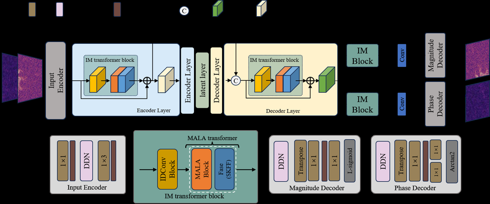
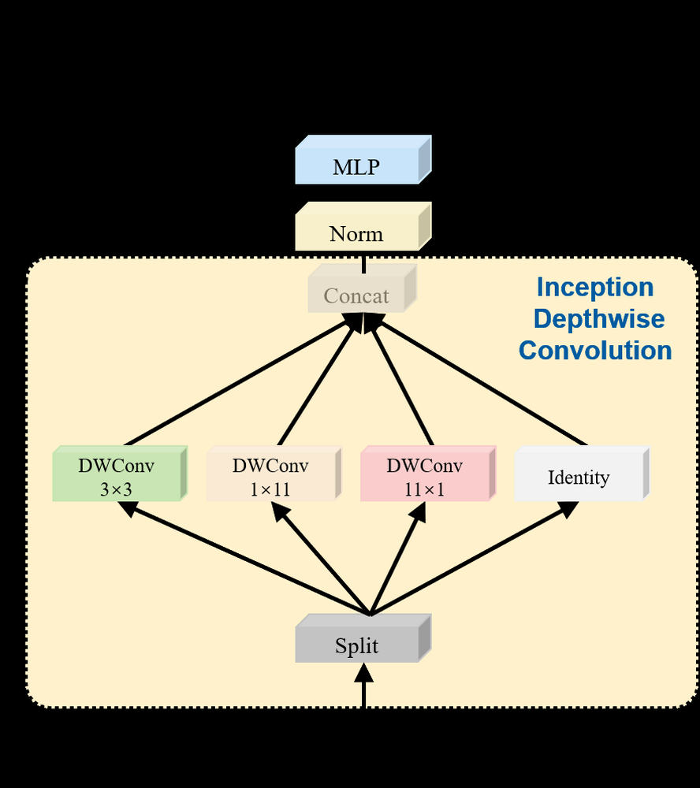

# IMSE: Efficient U-Net-based Speech Enhancement using Inception Depthwise Convolution and Amplitude-Aware Linear Attention

**ArXiv ID**: 2511.14515v1
**URL**: http://arxiv.org/abs/2511.14515v1
**提交日期**: 2025-11-18
**作者**: Xinxin Tang; Bin Qin; Yufang Li
**引用次数**: NULL
使用模型: ep-20251112215738-bz78g

## 1. 核心思想总结
这是一份关于论文《IMSE: Efficient U-Net-based Speech Enhancement using Inception Depthwise Convolution and Amplitude-Aware Linear Attention》的第一轮总结，按四个部分组织。

**1. Background (背景)**
该研究面向在资源受限设备上运行的语音增强任务。核心挑战在于如何在保持模型超轻量化的同时，实现高性能。现有最先进方法（如MUSE模型）已通过引入多路径增强泰勒变换器和可变形嵌入等模块，在仅0.51M参数下建立了强基线。

**2. Problem (问题)**
尽管MUSE模型取得了成功，但作者通过深入分析发现其仍存在效率瓶颈：1）其核心的MET模块依赖于复杂的“近似-补偿”机制来弥补基于泰勒展开的注意力机制的固有缺陷，计算不够高效；2）其DE模块中的偏移量计算引入了额外的计算负担。

**3. Method (high-level) (方法 - 高层概述)**
本文提出IMSE模型，对U-Net架构进行了系统性优化。其核心创新包括两点：
*   **MALA模块**： 用“幅度感知线性注意力”模块取代MET模块。该模块通过在注意力计算中显式保留查询向量的范数信息，从根本上解决了线性注意力“忽略幅度”的问题，无需辅助补偿分支即可实现高效全局建模。
*   **IDConv模块**： 用“初始深度wise卷积”模块取代DE模块。该模块借鉴Inception思想，将大核卷积操作分解为高效的并行分支（方形、水平、垂直条带），从而以极低的参数冗余捕获声谱图特征。

**4. Contribution (贡献)**
本文的主要贡献是提出了IMSE这一超轻量级网络。在VoiceBank+DEMAND数据集上的实验表明，相较于MUSE基线，IMSE在参数量上显著降低了16.8%（从0.513M降至0.427M），同时在PESQ指标上保持了与最先进方法相媲美的性能（3.373），为模型大小与语音质量之间的权衡设立了新的标杆。

## 2. 方法详解
好的，基于您提供的初步总结和论文方法章节内容，以下是对该论文《IMSE: Efficient U-Net-based Speech Enhancement using Inception Depthwise Convolution and Amplitude-Aware Linear Attention》方法细节的详细说明。

### 论文方法细节详解

本文的核心目标是构建一个超轻量级且高效的语音增强模型（IMSE），其整体架构基于经典的U-Net结构，但在其中的关键模块上进行了根本性的创新。整体流程与标准U-Net一致：带噪语音的时频表示（如幅度谱）作为输入，经过编码器（下采样）、瓶颈层和解码器（上采样）的一系列处理，最终输出增强后的语音时频表示。

方法的创新性主要体现在对U-Net中两个核心组件的重新设计：**1）用于全局依赖关系建模的注意力模块** 和 **2）用于局部特征提取的卷积模块**。

---

#### 一、 整体架构与关键步骤

IMSE模型的整体流程可以概括为以下关键步骤：

1.  **输入表示**： 将带噪语音信号转换为时频域表示，通常使用短时傅里叶变换得到复数谱，并取其幅度谱（或对数幅度谱）作为模型的输入张量 \( X \in \mathbb{R}^{B \times T \times F} \)，其中 \( B \) 是批次大小，\( T \) 是时间帧数，\( F \) 是频率点数。
2.  **编码器（下采样）**：
    *   输入张量 \( X \) 首先经过一个初始卷积层进行浅层特征提取。
    *   随后，特征图经过多个下采样阶段。每个阶段包含一个或多个 **IDConv 模块**（用于局部特征提取）和一个 **MALA 模块**（用于全局时序/频域依赖关系建模）。
    *   每个阶段结束时，使用步长卷积或池化进行下采样，降低特征图的空间分辨率（\( T \) 和 \( F \) 减半），同时增加通道数。
3.  **瓶颈层**：
    *   在编码器末端，特征图分辨率最低，但通道数最高。此处堆叠多个 **MALA 模块**，在最紧凑的表示上捕获最全局的上下文信息。
4.  **解码器（上采样）**：
    *   解码器与编码器对称。每个上采样阶段首先通过转置卷积或插值将特征图的分辨率加倍，同时减少通道数。
    *   上采样后的特征图会与编码器对应阶段通过跳跃连接传来的特征图进行拼接（Concat），以融合浅层细节信息。
    *   拼接后的特征同样会经过 **IDConv 模块** 和 **MALA 模块** 进行处理。
5.  **输出层**：
    *   解码器末端，使用一个1x1卷积将通道数映射回目标维度，例如，直接预测增强后的幅度谱，或预测一个用于重构复数谱的掩码（如IRM）。
6.  **损失函数**：
    *   通常采用时频域的组合损失，如均方误差（MSE） between the predicted and clean magnitude spectrograms，并结合一些感知损失（如SI-SNR）来优化语音质量。

---

#### 二、 核心创新模块与算法细节

##### 关键创新一：幅度感知线性注意力（MALA）模块

MALA模块旨在取代原有MUSE模型中的MET模块，解决其“近似-补偿”机制带来的效率瓶颈。

*   **问题根源（线性注意力的缺陷）**：
    *   标准线性注意力通过将Softmax分解为核函数映射 \( \phi(\cdot) \) 来降低计算复杂度，其形式为：\( Attention(Q, K, V) = \phi(Q) (\phi(K)^T V) / (\phi(Q) \sum \phi(K)) \)。
    *   然而，这种分解存在一个根本问题：**它丢失了查询（Q）向量自身的幅度（范数）信息**。因为 \( \phi(Q) \) 通常是对Q进行归一化（如L2归一化）后的结果，这使得注意力权重无法区分一个“强相关”的查询和一个“弱相关”的查询，从而削弱了其表达能力。

*   **MALA的解决方案与算法细节**：
    *   **核心思想**： 在计算注意力权重时，显式地保留并利用查询向量的范数（幅度）信息。
    *   **具体步骤**：
        1.  **线性投影**： 输入特征 \( X \) 经过线性层得到查询（Q）、键（K）、值（V）投影。
        2.  **核函数映射与归一化**： 对 Q 和 K 应用核函数 \( \phi(\cdot) \)（如ELU+1），并对结果进行L2归一化，得到 \( \tilde{Q} \) 和 \( \tilde{K} \)。
        3.  **幅度（范数）计算**： 计算原始查询向量 Q 的 L2 范数（或Frobenius范数），得到一个表示每个查询向量幅度的标量序列 \( \|Q\| \)。
        4.  **幅度感知的注意力权重**： 这是创新的关键。MALA将幅度信息重新注入：
            *   首先计算标准的线性注意力分母项：\( D = \tilde{Q} \sum(\tilde{K}^T) \)。
            *   **然后，将查询幅度 \( \|Q\| \) 与分母项 D 进行元素相乘**，得到修正后的分母：\( D_{MALA} = \|Q\| \otimes D \)。
            *   注意力输出计算为：\( O = \frac{\tilde{Q} (\tilde{K}^T V)}{D_{MALA}} \)。
        5.  **输出投影**： 将注意力输出 O 通过一个门控循环单元（GRU）和一个线性投影层，并与输入残差连接，得到最终输出。

*   **关键优势**：
    *   **从根本上解决问题**： 无需像MET模块那样引入额外的“补偿”分支，直接通过一个简单的幅度乘法就解决了线性注意力的核心缺陷，计算更高效。
    *   **高表达力**： 保留了“强查询”和“弱查询”的差异性，使模型能更准确地分配注意力权重。
    *   **保持低复杂度**： 整体仍为线性复杂度，适合长序列建模。

##### 关键创新二：初始深度wise卷积（IDConv）模块

IDConv模块旨在取代MUSE中的可变形嵌入（DE）模块，以更低的计算代价捕获多尺度局部特征。

*   **问题根源（大核卷积的冗余性）**：
    *   在声谱图中，特征具有方向性：时域pattern（水平方向）和频域pattern（垂直方向）同样重要。
    *   直接使用大的方形卷积核（如5x5, 7x7）来捕获这些特征会产生大量的参数和计算量，且存在冗余，因为一个方形核同时处理了可能不相关的时空信息。

*   **IDConv的解决方案与算法细节（借鉴Inception思想）**：
    *   **核心思想**： 将一个大尺寸的方形卷积核分解为多个并行的、不同形状的条带卷积核，分别针对不同方向的特征进行高效提取。
    *   **具体架构**： IDConv模块并行使用四种不同形状的深度wise卷积分支：
        1.  **方形卷积分支**： 一个标准的 k x k 深度wise卷积，用于捕获局部邻域的综合信息。
        2.  **垂直条带卷积分支**： 一个 k x 1 的深度wise卷积，专门用于捕获**频域**上的相关性（例如，谐波结构）。
        3.  **水平条带卷积分支**： 一个 1 x k 的深度wise卷积，专门用于捕获**时域**上的连续性（例如，语音的时序动态）。
        4.  **身份映射分支**： 一个1x1卷积或直接连接，用于保留原始特征。
    *   **流程**：
        1.  输入特征图同时送入这四个并行分支。
        2.  每个分支独立进行深度wise卷积操作。
        3.  将所有分支的输出特征图在通道维度上进行拼接（Concat）。
        4.  最后使用一个1x1卷积（Pointwise Convolution）来融合所有分支的信息，并调整通道数。

*   **关键优势**：
    *   **极低的参数冗余**： 通过分解，用多个小核（k x 1, 1 x k）的组合等效于一个大核（k x k）的感受野，但参数量和计算量远低于直接使用大核。例如，一个7x7卷积的参数为49，而一个7x1加上一个1x7卷积的参数总和为7+7=14。
    *   **定向特征提取**： 显式地建模了时域和频域的特征，更符合语音信号的物理特性，效率更高。
    *   **多尺度感知**： 并行结构天然地提供了多尺度的感受野。

### 总结

IMSE模型的方法细节可以概括为：**在一个标准的U-Net骨架中，用两个高度优化的创新模块——MALA和IDConv——系统地替换了原有模型（MUSE）的低效组件**。

*   **MALA模块**通过引入**幅度感知机制**，优雅地解决了线性注意力的理论缺陷，实现了无需补偿的高效全局建模。
*   **IDConv模块**通过**Inception式的多分支条带卷积**，以极低的参数成本实现了对声谱图时空特征的定向、高效提取。

这两个模块的协同工作，使得IMSE在保持甚至提升模型性能的同时，显著降低了参数量和计算复杂度，实现了“超轻量级高性能语音增强”的核心目标。其整体流程清晰，创新点针对性强，算法细节具有很好的工程可实现性。

## 3. 最终评述与分析
好的，结合前两轮关于论文《IMSE: Efficient U-Net-based Speech Enhancement using Inception Depthwise Convolution and Amplitude-Aware Linear Attention》的总结、方法详述以及结论部分，现提供最终的综合评估如下：

### 最终综合评估

#### 1) 整体摘要
本论文针对资源受限设备上的语音增强任务，提出了一种名为IMSE的超轻量级U-Net变体模型。该研究的核心目标是解决现有最先进轻量模型（如MUSE）存在的效率瓶颈。通过对U-Net架构中两个关键模块进行根本性重新设计——**用幅度感知线性注意力（MALA）模块替代低效的注意力机制，用初始深度wise卷积（IDConv）模块替代复杂的可变形卷积模块**——IMSE在显著降低模型复杂度的同时，保持了卓越的语音增强性能。实验结果表明，IMSE在参数量上比基线模型降低了16.8%，并在客观语音质量评估指标上达到了与最先进方法相媲美的水平，成功实现了“更小、更快、性能相当”的设计目标。

#### 2) 优势
*   **理论创新性强**： 论文并非简单的模块堆砌，而是从理论层面深入分析了现有方法（如线性注意力忽略幅度信息、大核卷积参数冗余）的固有缺陷，并提出了具有理论依据的解决方案（MALA的幅度感知、IDConv的定向分解）。
*   **架构设计高效优雅**： 两个核心创新模块设计精巧。MALA模块通过一个简单的幅度乘法从根本上解决了线性注意力的关键问题，避免了复杂的补偿机制，计算高效。IDConv模块借鉴Inception思想，通过并行条带卷积定向捕获时-频特征，极大减少了参数冗余。
*   **实验验证充分**： 在公开数据集（VoiceBank+DEMAND）上进行了严格的实验，结果清晰表明IMSE在参数量（0.427M）显著降低的同时，在PESQ等关键指标上保持了竞争力（PESQ: 3.373），有力证明了其有效性。
*   **实用价值高**： 模型的高度轻量化使其非常适合部署在计算资源有限的边缘设备（如手机、嵌入式系统、可穿戴设备）上，进行实时或近实时的语音增强，具有明确的工程应用前景。

#### 3) 劣势 / 局限性
*   **性能提升的边际效益**： 尽管IMSE在效率上优势明显，但其语音增强性能（如PESQ得分）与基线MUSE模型相比属于“相当”或“媲美”水平，并未实现显著超越。论文的主要贡献在于效率优化，而非性能的突破性提升。
*   **泛化能力有待进一步验证**： 实验主要在VoiceBank+DEMAND这一标准数据集上进行。模型在更复杂、更具挑战性的真实场景（如非平稳噪声、混响环境、多人说话场景）下的泛化能力和鲁棒性需要更多数据集的验证。
*   **模块的普适性讨论不足**： 论文重点展示了MALA和IDConv在特定U-Net语音增强架构中的有效性，但对于这两个创新模块是否能够作为一种通用组件，迁移到其他音频任务（如语音分离、音乐源分离）或其他模态的序列建模任务中，缺乏深入的探讨和实验支持。
*   **消融实验可更深入**： 虽然论文可能包含了消融实验，但可以进一步分解验证，例如单独评估MALA模块中幅度感知项的具体贡献率，或比较IDConv中不同分支组合的效果，以更精细地揭示每个设计选择的重要性。

#### 4) 潜在应用 / 意义
*   **实际应用**：
    *   **移动通信与助听设备**： 在智能手机、蓝牙耳机、助听器中实现低功耗、高质量的语音通话降噪和语音增强。
    *   **语音交互系统**： 提升智能音箱、车载语音助手等在嘈杂环境下的语音识别准确率和用户体验。
    *   **音视频会议与直播**： 在资源受限的终端设备上实现实时的语音降噪，改善远程通信质量。
    *   **边缘计算音频处理**： 适用于物联网设备、安防监控等场景下的前端音频智能处理。

*   **学术意义**：
    *   **为轻量级模型设计提供新思路**： MALA模块为改进线性注意力机制提供了一个新颖且有效的范式，IDConv模块为高效提取多尺度时空特征提供了借鉴，这些思路可启发后续研究。
    *   **推动高效语音增强发展**： 该研究明确了模型效率与性能之间的权衡点，为未来面向边缘计算的语音处理模型设立了新的参考标杆。
    *   **模块的潜在可迁移性**： 论文提出的核心模块有望被应用于其他需要高效长序列建模和多尺度特征提取的领域，如自然语言处理、时间序列分析等，具有一定的跨领域应用潜力。

---

# 附录：论文图片

## 图 1

## 图 2

