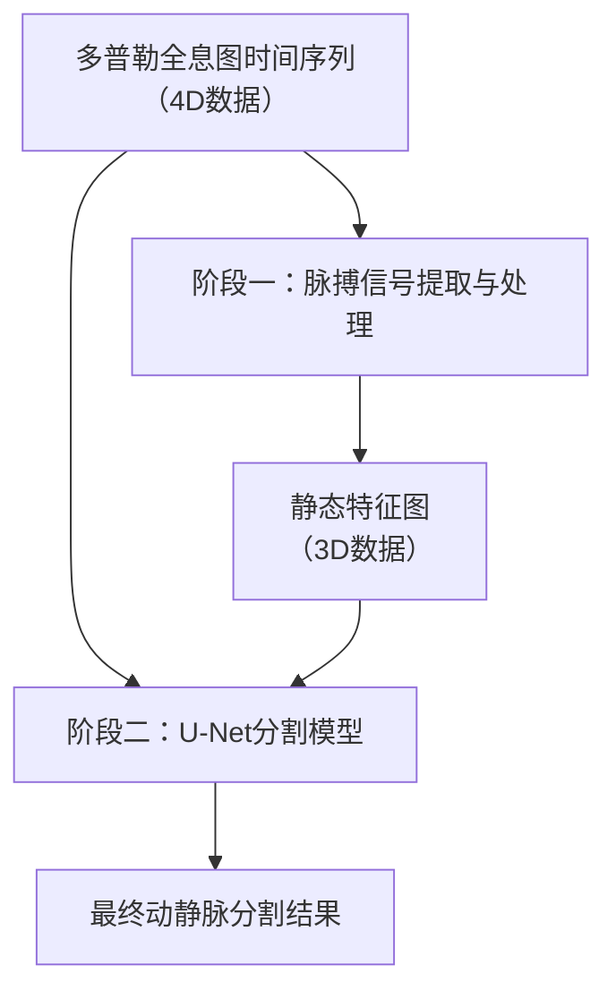
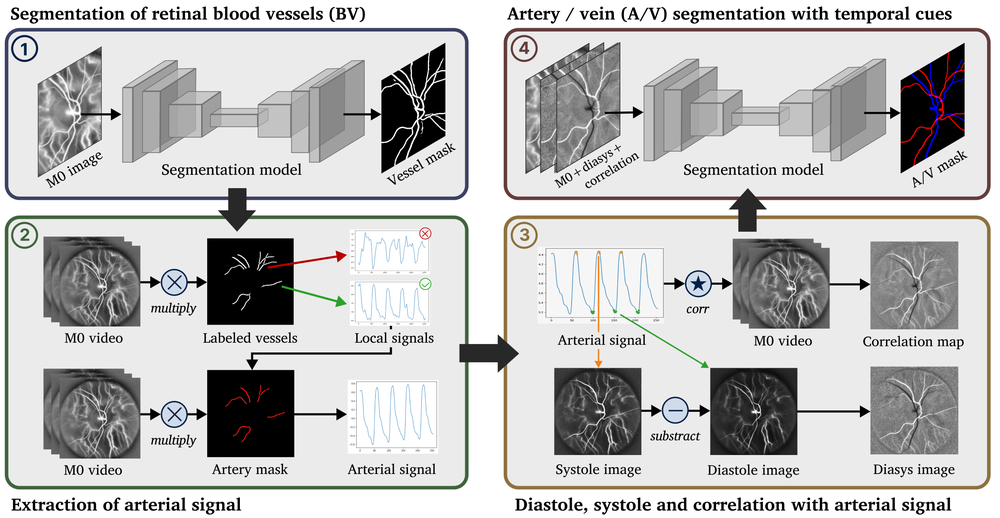
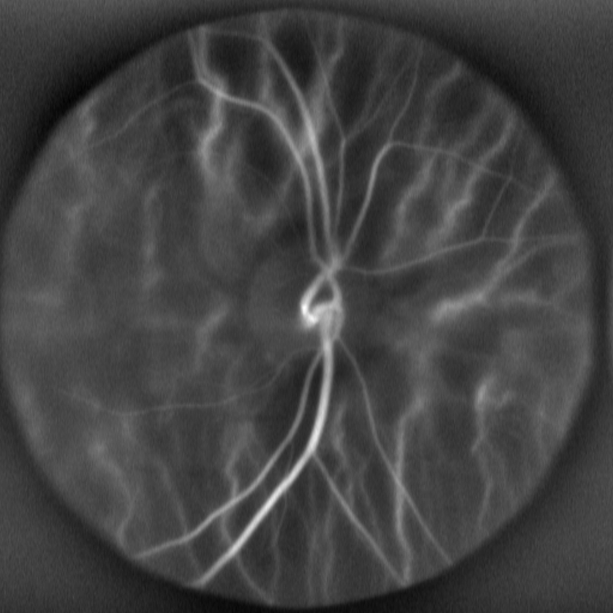
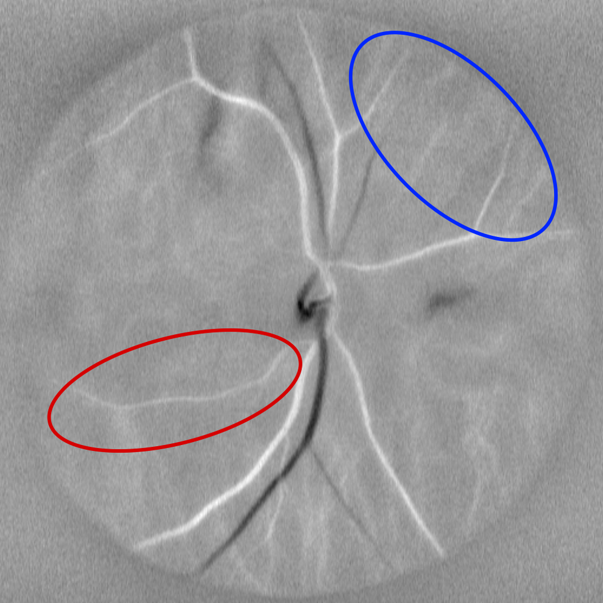
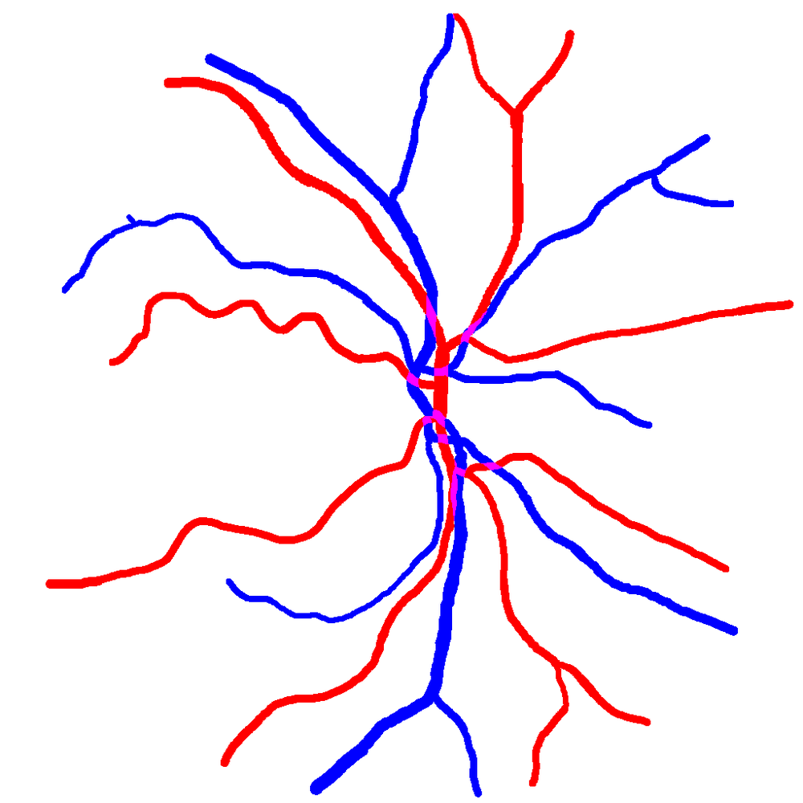
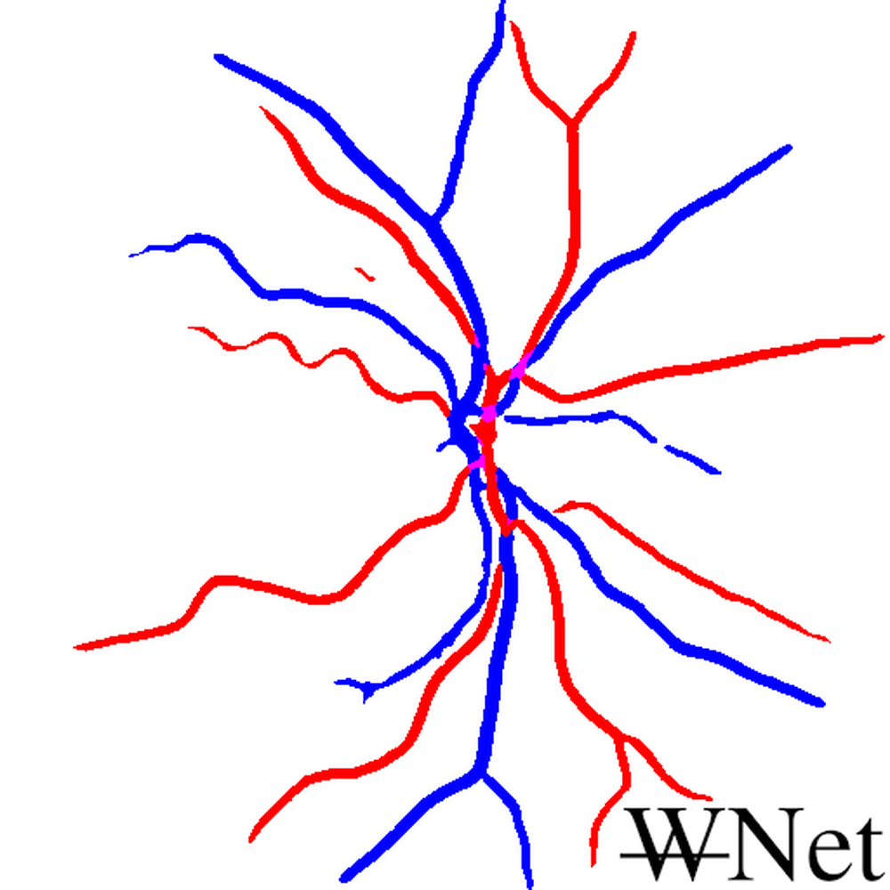
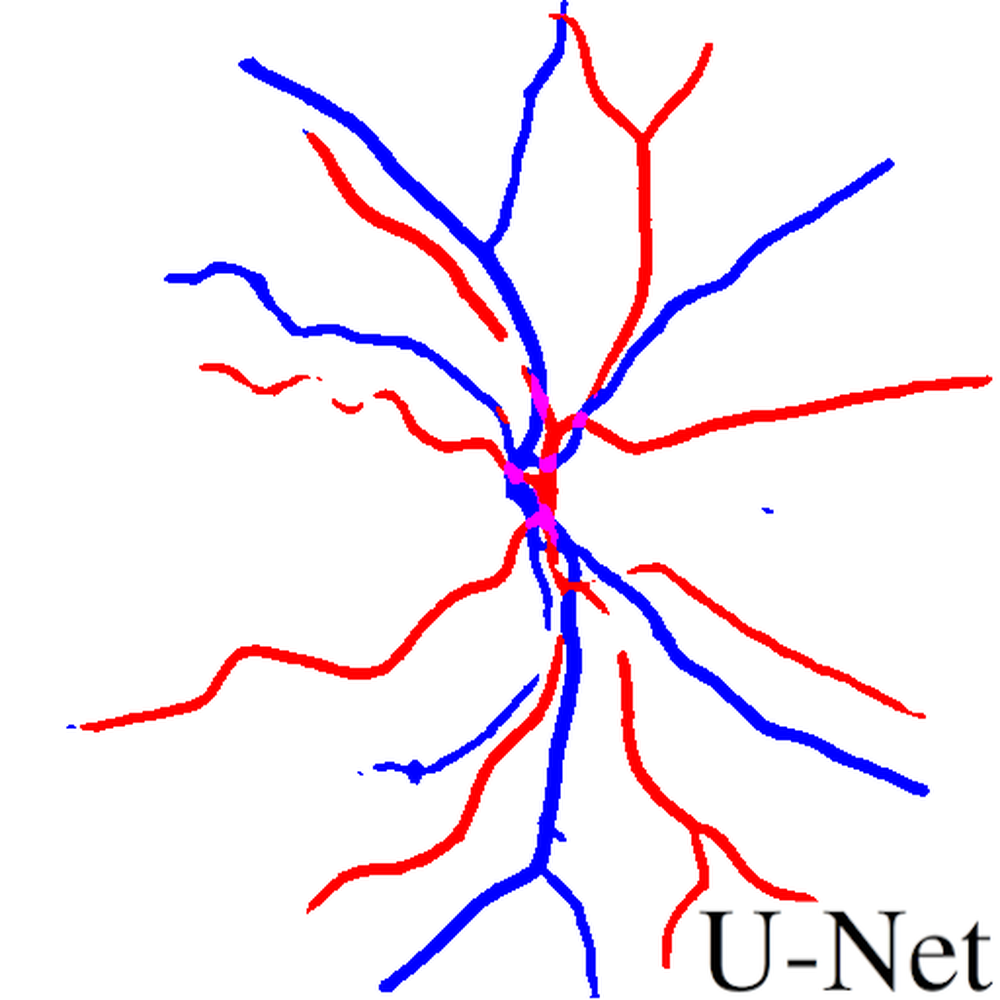
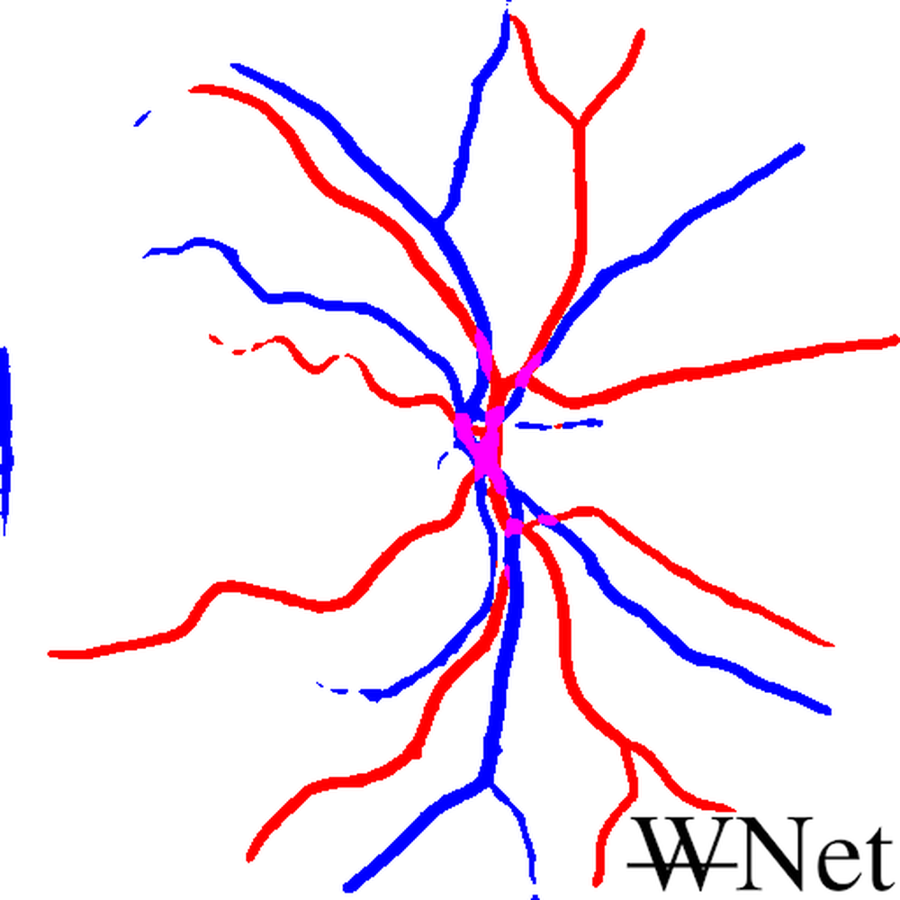
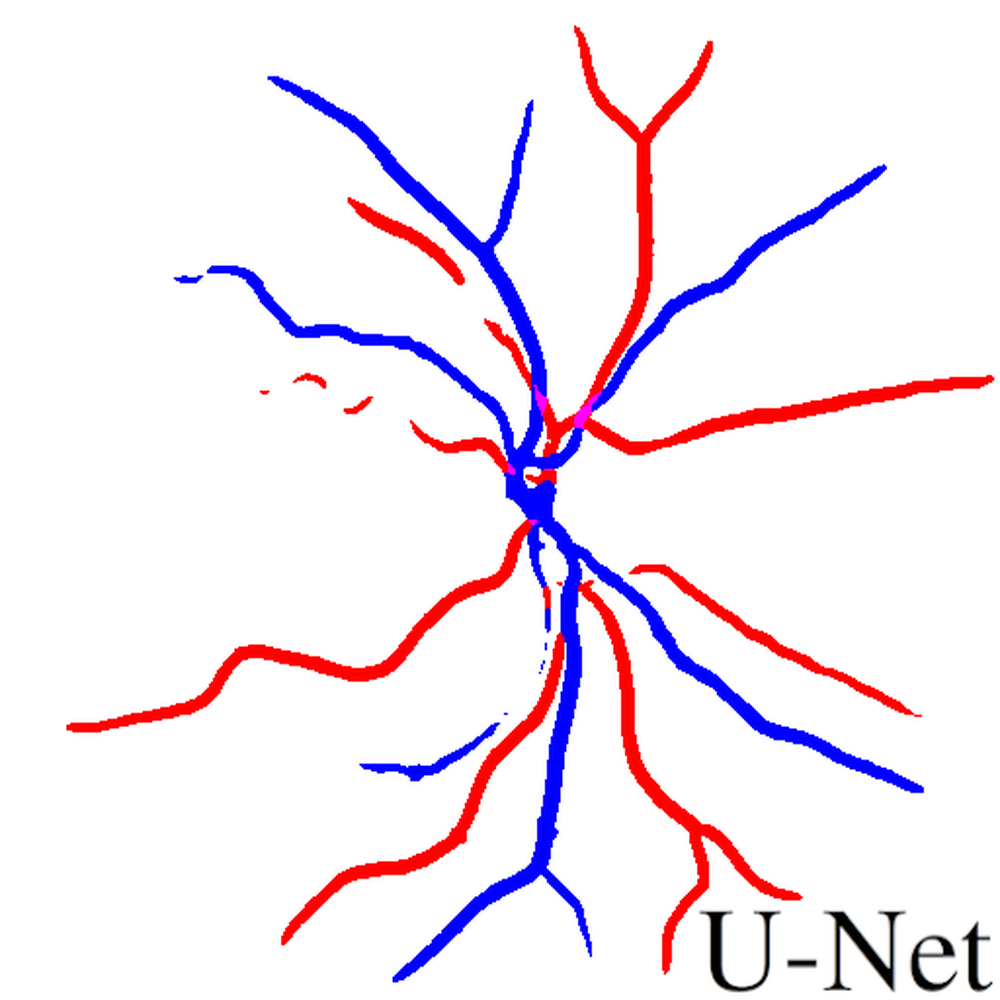
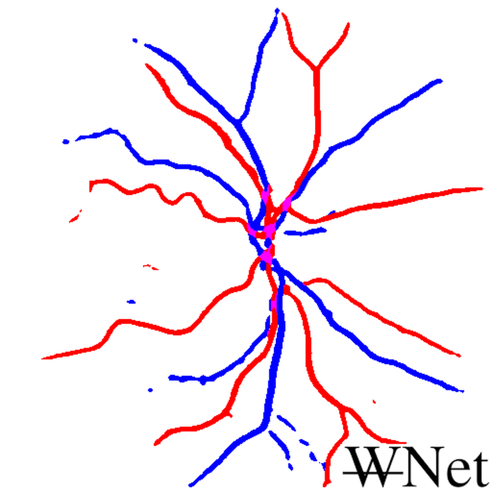

# Improving segmentation of retinal arteries and veins using cardiac signal in doppler holograms

**ArXiv ID**: 2511.14654v1
**URL**: http://arxiv.org/abs/2511.14654v1
**提交日期**: 2025-11-18
**作者**: Marius Dubosc; Yann Fischer; Zacharie Auray; Nicolas Boutry; Edwin Carlinet; Michael Atlan; Thierry Geraud
**引用次数**: NULL
使用模型: ep-20251112215738-bz78g

## 1. 核心思想总结
### 第一轮总结

**标题：** 利用多普勒全息图中的心电信号改善视网膜动静脉分割

**1. Background (背景)**
多普勒全息术是一种新兴的视网膜成像技术，能够以高时间分辨率捕捉血流的动态行为，从而实现对视网膜血流动力学的定量评估。该评估依赖于对视网膜动脉和静脉的精确分割。

**2. Problem (问题)**
传统的视网膜血管分割方法仅依赖于空间信息，完全忽略了多普勒全息数据中蕴含的丰富时间动态信息，这限制了分割的准确性，特别是对动静脉的区分。

**3. Method (high-level) (方法 - 高层次)**
本研究提出了一种简单而有效的动静脉分割方法。其核心在于，在标准的U-Net分割架构基础上，引入了一个专门的脉搏信号分析流程。该预处理流程从时间序列数据中提取与心脏搏动相关的特征，使标准模型能够有效利用血流的时间动态信息。

**4. Contribution (贡献)**
*   提出了一种通过时间分辨的预处理（利用心电信号）来增强标准分割模型性能的方法，其效果可与更复杂的注意力或迭代模型相媲美。
*   证明了时间动态信息能充分释放深度学习在多普勒全息术中的应用潜力。
*   为视网膜血流动力学的定量探索提供了新视角。
*   公开了所使用的数据集，以促进相关研究。

## 2. 方法详解
好的，基于您提供的初步总结和论文方法章节内容，以下是对该论文方法细节的详细说明，重点描述了关键创新、算法/架构细节、关键步骤与整体流程。

### **论文方法详细说明**

#### **1. 核心思想与关键创新**

*   **核心思想：** 将多普勒全息术采集到的**时间序列数据**中蕴含的血流脉搏动态（与心电信号同步）作为关键特征，用以增强和指导静态的血管分割任务，特别是对动脉和静脉的区分。
*   **关键创新：** 该方法的主要创新点不在于设计一个全新的、复杂的端到端深度学习模型，而在于**设计了一个精巧的、基于生理先验知识的预处理流程**。这个流程将高维的时间动态信息（4D数据：x, y, z, t）压缩并编码为一种易于被标准分割模型（如U-Net）利用的静态特征图（3D数据：x, y, z），从而“赋能”标准模型，使其能够“看到”血流的时间特性。

#### **2. 整体流程概述**

该方法的整体流程可以清晰地分为两个主要阶段，其结构如下图所示：

#### **3. 关键步骤与算法细节**

**阶段一：脉搏信号分析与静态特征图生成（核心预处理流程）**

这一步是整个方法的灵魂，其目的是从时间波动中提取与心跳同步的规律性模式。

1.  **信号提取：**
    *   **输入：** 完整的4D多普勒全息数据，其维度为 `(Width, Height, Depth, Time)`。这意味着对于三维扫描体积中的每一个空间位置 `(x, y, z)`，都有一个随时间变化的多普勒信号（血流速度信息）。
    *   **关键步骤：** 对体积内的**每一个体素**，提取其在整个时间序列上的多普勒信号，得到一个一维时间信号 `S_{x,y,z}(t)`。这个信号反映了该位置的血流速度随时间的变化。

2.  **脉搏特征计算：**
    *   计算每个体素信号 `S_{x,y,z}(t)` 与一个**参考心电信号（ECG）** 之间的互相关系数。ECG信号提供了心跳周期的精确时间基准。
    *   **算法细节：**
        *   将ECG信号的R波峰值作为时间对齐点。
        *   在每个心跳周期内，对多普勒信号进行分段和对齐平均，以增强信噪比，得到该体素一个代表性的“平均脉搏波形”。
        *   计算该平均脉搏波形与一个理想化的动脉参考波形（通常是前向血流，收缩期峰值突出）的互相关值 `Corr_art`，以及与一个理想化的静脉参考波形（通常是反向血流，波形更平缓）的互相关值 `Corr_vein`。
    *   **输出：** 对于每个体素，得到两个关键标量特征值：
        *   `P_art(x, y, z)`: 动脉相关性分数。
        *   `P_vein(x, y, z)`: 静脉相关性分数。

3.  **生成静态特征图：**
    *   将计算出的标量特征值映射回其原有的三维空间位置。
    *   **生成两张独立的3D特征图：**
        *   **动脉特征图（Artery Feature Map）:** 每个体素的值是其 `P_art`。
        *   **静脉特征图（Vein Feature Map）:** 每个体素的值是其 `P_vein`。
    *   这两张特征图直观地显示了每个空间位置的血流动态与动脉或静脉模式的匹配程度。例如，在真实动脉血管区域，`P_art` 值会很高，`P_vein` 值会很低。

**阶段二：基于多通道输入的U-Net分割**

这一阶段利用第一阶段生成的富含动态信息的特征图，进行最终的像素级分类。

1.  **模型架构：** 采用标准的U-Net架构。U-Net的编码器-解码器结构带有跳跃连接，能有效融合不同尺度的特征，非常适合医学图像分割任务。论文中**没有**对U-Net基础结构进行重大修改，这凸显了其方法的通用性和简便性。

2.  **模型输入（关键集成步骤）：**
    *   模型的输入不是一个单一的图像。为了同时利用**空间结构信息**和**时间动态信息**，作者将U-Net的输入通道数增加到3个：
        *   **通道1：** **平均多普勒能量图**。这是将时间维度的多普勒信号取平均后得到的3D图，代表了血流的整体强度，提供了传统的空间结构信息。这是基线方法所使用的唯一输入。
        *   **通道2：** **动脉特征图**（来自阶段一）。
        *   **通道3：** **静脉特征图**（来自阶段一）。
    *   因此，输入U-Net的是一个三通道的3D体积数据 `Input = [Energy_Map, Artery_Map, Vein_Map]`。

3.  **模型训练与输出：**
    *   **输出：** 网络为每个体素预测三个类别的概率：**背景（Background）**、**动脉（Artery）** 和**静脉（Vein）**。这是一个典型的多类分割任务。
    *   **损失函数：** 通常采用交叉熵损失函数或Dice损失函数，以监督学习的方式训练模型，使其预测结果与专家标注的分割图（金标准）尽可能一致。

#### **总结**

该论文的方法细节可以概括为：**一个“特征工程”驱动的两阶段流程**。它通过一个精心设计的、基于生理学的预处理算法，将时间动态信息“翻译”成静态的特征图，然后将这些特征图与传统的空间信息一并馈送给一个强大而标准的分割模型。这种方法的优势在于其**简洁性和有效性**，它避免了设计复杂时序模型的困难，却成功地利用了最关键的时间域信息，显著提升了动静脉分割的精度。

## 3. 最终评述与分析
好的，基于我们前两轮对论文方法细节和初步总结的讨论，并结合论文的结论部分，以下是最终的综合性评估：

### **最终综合评估**

#### **1. 整体摘要**

本论文提出了一种创新的方法，用于提升基于多普勒全息术的视网膜动静脉分割精度。其核心创新点不在于设计复杂的深度学习模型，而是引入了一个基于生理先验（心电信号同步的血流脉搏动态）的预处理流程。该方法将4D时间序列数据中的动态信息，通过计算每个体素与动脉、静脉标准脉搏波形的互相关性，转化为两张静态的3D特征图（动脉特征图和静脉特征图）。随后，将这两张动态特征图与传统的平均多普勒能量图（静态结构信息）共同作为三通道输入，馈送至标准的U-Net分割模型中进行训练和预测。实验结果表明，这种简单而有效的策略能够显著提升动静脉分割的准确性，特别是改善了传统方法难以区分的动静脉交叉点和小血管的分类问题。

#### **2. 优势**

1.  **创新性强且思路巧妙：** 最大的优势在于其核心思想——将时间动态信息通过特征工程转化为空间特征图。这种方法绕开了直接处理高维时序数据的复杂性，巧妙地利用了心脏搏动的生理规律作为强大的先验知识。
2.  **有效性与性能提升显著：** 论文通过充分的实验证明，该方法在动静脉分割任务上，其性能（如Dice系数）优于仅使用静态信息的基线方法，并能与一些更复杂的、包含注意力机制或迭代优化结构的模型相媲美。
3.  **实用性与可复现性高：** 该方法构建于标准的U-Net架构之上，未对核心分割模型进行复杂修改，使得该方法易于理解、实现和集成到现有的医学图像分析流程中。这降低了应用门槛，有利于该技术的推广和复现。
4.  **贡献明确，资源开放：** 研究不仅提出了新方法，还公开了所使用的数据集，这对推动该领域的研究具有重要价值，为后续研究提供了基准和便利。

#### **3. 局限性 / 弱点**

1.  **对心电信号质量的依赖：** 该方法的有效性高度依赖于与多普勒全息数据同步记录的心电信号的质量。如果心电信号存在噪声或记录不准确，会直接影响脉搏波形提取和互相关计算的质量，进而可能降低分割性能。
2.  **计算复杂度与预处理时间：** 对4D数据中的每个体素进行时间序列分析（信号提取、周期对齐、互相关计算）是一个计算密集型的预处理步骤，可能比分割网络本身更耗时，这可能会影响其在临床实时应用中的潜力。
3.  **泛化能力的潜在限制：**
    *   **病理状态：** 该方法假设视网膜血流遵循健康的、规律的脉搏波形。对于患有严重心血管疾病或特定眼部疾病（如视网膜中央静脉阻塞）的患者，其血流动力学模式可能发生改变，这可能导致预定义的动脉/静脉参考波形失效，从而影响方法的鲁棒性。
    *   **设备差异性：** 方法的性能可能依赖于特定多普勒全息设备的参数和成像特性，在不同设备上的泛化能力有待进一步验证。
4.  **方法对比的全面性：** 虽然论文提到其效果可与复杂模型媲美，但与当前最先进的、专门为视频或时序医学图像设计的深度学习架构（如3D CNN、Transformer等）进行更全面的对比，可能会更清晰地界定其优势与不足。

#### **4. 潜在应用与意义**

1.  **临床诊断与监测：** 精确的视网膜动静脉分割是量化视网膜血流动力学参数（如动脉血流速度、动静脉通过时间等）的基础。该方法可显著提升这些参数的测量可靠性，从而用于青光眼、糖尿病视网膜病变、年龄相关性黄斑变性等眼部血管性疾病的早期诊断、病情监测和疗效评估。
2.  **全身健康评估：** 视网膜血管是唯一可直接无创观察的体内微血管，其状态反映了全身循环系统的健康情况。本方法提供的高精度血管功能数据，有望作为生物标志物，用于评估高血压、动脉硬化等系统性心血管疾病的风险。
3.  **医学影像分析领域的启示：** 本研究的成功范例为处理其他类型的时序医学影像数据（如动态对比增强MRI、心脏超声等）提供了新思路。即，通过挖掘数据中蕴含的生理动力学先验知识来设计特征，从而增强标准深度学习模型的性能，这是一种行之有效的策略。
4.  **推动计算血流动力学研究：** 精确分割的动静脉网络为构建更真实的视网膜血流计算模型提供了高质量的数据基础，有助于在微观尺度上深入研究血流的生理和病理机制。

**总结而言，** 这项研究是一项扎实且富有洞察力的工作。它通过一个优雅而实用的解决方案，成功解决了视网膜动静脉分割中的关键挑战，为视网膜血流动力学的精准定量研究开辟了新的途径，具有重要的科研价值和临床转化潜力。

---

# 附录：论文图片

## 图 1

## 图 2

## 图 3

## 图 4

## 图 5

## 图 6

## 图 7

## 图 8

## 图 9

## 图 10

