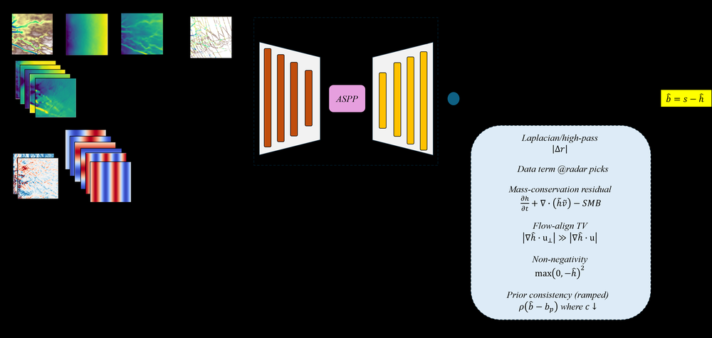
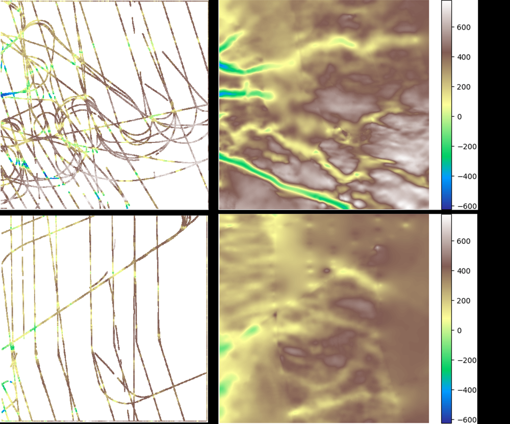
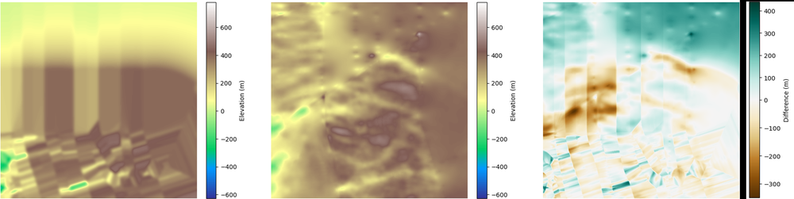
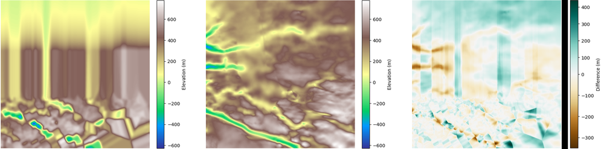
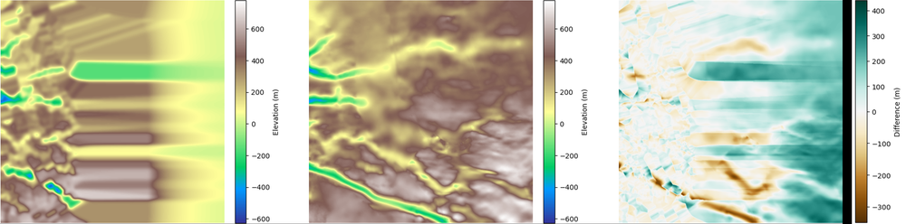
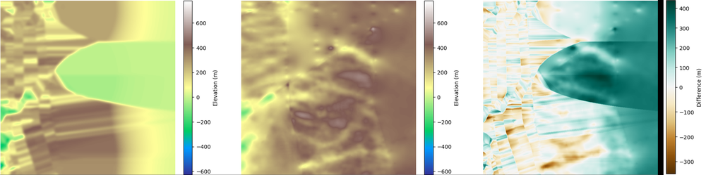
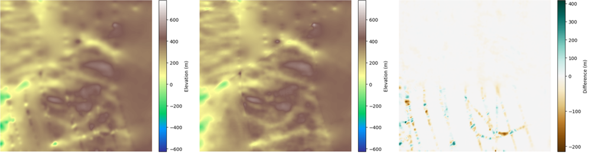
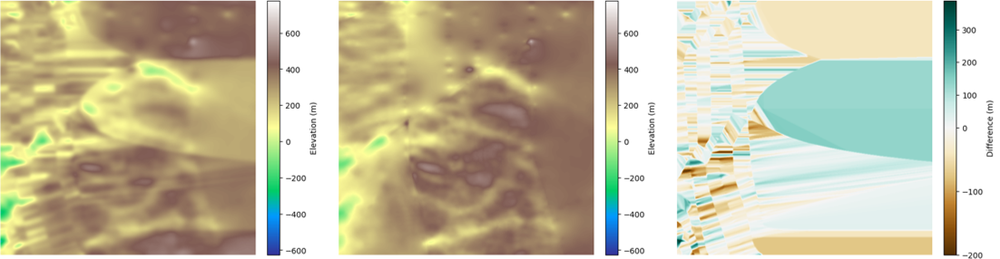
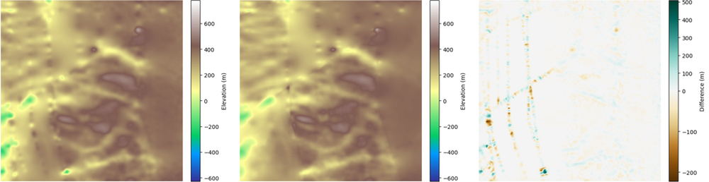

# Learning Subglacial Bed Topography from Sparse Radar with Physics-Guided Residuals

**ArXiv ID**: 2511.14473v1
**URL**: http://arxiv.org/abs/2511.14473v1
**提交日期**: 2025-11-18
**作者**: Bayu Adhi Tama; Jianwu Wang; Vandana Janeja; Mostafa Cham
**引用次数**: NULL
使用模型: ep-20251112215738-bz78g

## 1. 核心思想总结
这是一份关于论文《Learning Subglacial Bed Topography from Sparse Radar with Physics-Guided Residuals》的第一轮总结，按四个部分组织如下：

### 1. Background (研究背景)
准确获取冰下床地形对于冰盖建模和预测海平面上升至关重要。目前，主要的观测手段是机载雷达探测，但这些探测数据通常非常稀疏且分布不均，难以直接重建出连续、可靠的地形图。

### 2. Problem (研究问题)
如何从稀疏且不均匀的雷达观测数据中，重建出高精度、且物理上合理的冰下床地形。这是一个典型的“稀疏数据插值/重建”问题，其挑战在于既要忠实于有限的观测数据，又要保证生成的地形在空间上连贯并符合物理规律（如质量守恒），以应对实际应用中存在的领域偏移（domain shift）问题。

### 3. Method (高层次方法)
本文提出了一种**物理引导的残差学习框架**。其核心思想是：
*   **残差学习**：模型不直接预测完整的地形，而是预测一个相对于现有先验模型（如BedMachine）的**厚度残差**，从而简化学习任务。
*   **深度学习架构**：采用基于标准编码器（如ResNet-50）和DeepLabV3+解码器的卷积神经网络。
*   **物理约束引导**：在训练损失函数中巧妙地融入了多种轻量级的物理约束，包括多尺度质量守恒、沿流向的总变差、拉普拉斯平滑、厚度非负性等，以确保结果的空间连贯性和物理合理性。同时，也包含了对稀疏雷达观测数据的拟合项。

### 4. Contribution (主要贡献)
1.  **提出新颖框架**：将**残差学习**与**物理引导**相结合，有效利用了先验知识并通过物理约束弥补数据稀疏性。
2.  **实现优越性能**：在格陵兰冰盖两个子区域的实验中，该方法在严格的“防泄漏”区块式验证集上，其测试精度和结构保真度均显著优于U-Net、Attention U-Net、FPN和普通CNN等主流模型。
3.  **具备实际应用潜力**：该方法能够生成空间连贯、物理上可信的冰下地形，特别适用于存在领域偏移的实际操作制图场景。

## 2. 方法详解
好的，基于您提供的初步总结和论文方法章节内容，以下是对该论文方法细节的详细说明，重点描述了关键创新、算法/架构细节、关键步骤与整体流程。

### 方法详细说明

本论文的核心方法是**一个融合了深度学习与物理约束的残差学习框架**，旨在解决从稀疏雷达数据重建高精度、物理合理的冰下地形这一挑战。其整体流程可以概括为“**先验修正，物理约束**”。

#### 一、 关键创新与核心思想

1.  **残差学习范式**：
    *   **核心思想**： 模型不直接预测绝对的地形高程，而是预测一个**残差场** \(\delta H\)，即对现有先验模型（如 BedMachine）输出的冰厚度 \(H_{prior}\) 的修正量。
    *   **数学表达**： 最终预测的冰厚度为 \(H_{pred} = H_{prior} + \delta H\)，相应的床地形为 \(b_{pred} = s - H_{pred}\)，其中 \(s\) 是已知的冰面高程。
    *   **创新优势**：
        *   **简化学习任务**： 先验模型（如 BedMachine）已经包含了大量专家知识和插值结果，直接学习其“误差”或“修正量”比从零学习整个复杂地形要容易得多。
        *   **降低对数据量的需求**： 残差通常比原始信号更简单、变化更平缓，使得模型即使在稀疏数据下也能快速收敛。
        *   **充分利用领域知识**： 将成熟的物理模型或制图产品作为基础，让深度学习专注于学习其未能捕捉的精细结构或系统性偏差。

2.  **轻量级物理引导的损失函数**：
    *   **核心思想**： 不将物理模型作为不可微分的“黑箱”嵌入网络，而是将关键的物理规律（如质量守恒、平滑性）转化为可微的**损失项**，与数据拟合损失共同指导模型训练。
    *   **创新优势**：
        *   **计算高效**： 避免了复杂的物理正演模拟，训练速度快。
        *   **灵活可控**： 可以根据不同区域的物理特性（如快速流动冰河与稳定冰盖）调整不同物理损失项的权重（\(\lambda_1, \lambda_2, ...\)）。
        *   **弥补数据稀疏性**： 在缺乏雷达观测数据的区域，物理约束成为模型预测的主要指导原则，确保生成的地形在物理上是合理的。

#### 二、 算法/架构细节

**1. 网络架构**
*   **主干网络**： 采用 **ResNet-50** 作为编码器（Encoder）。其残差连接结构能有效缓解深层网络的梯度消失问题，有利于学习复杂的特征。
*   **解码器**： 采用 **DeepLabV3+** 的解码器模块。DeepLabV3+ 的核心优势是其**空洞空间金字塔池化（ASPP）** 模块，它能在多个尺度上捕获上下文信息，这对于理解地形这种多尺度结构（如大的山谷与小的起伏）至关重要。
*   **输入与输出**：
    *   **输入**： 一个多通道的栅格数据层，至少包括：
        1.  **先验冰厚度** \(H_{prior}\)
        2.  **冰面高程** \(s\)
        3.  **雷达观测点掩膜**： 一个二值图像，指示哪些像素有真实的雷达观测数据。
        可能还包括其他辅助信息，如表面流速等，以提供更多上下文。
    *   **输出**： 一个单通道的图像，即预测的**冰厚度残差** \(\delta H\)。

**2. 物理引导的损失函数（核心组件）**

总损失函数是多个损失项的加权和：
\(\mathcal{L}_{total} = \mathcal{L}_{data} + \lambda_1 \mathcal{L}_{MC} + \lambda_2 \mathcal{L}_{TV} + \lambda_3 \mathcal{L}_{Lap} + \lambda_4 \mathcal{L}_{non-neg} + ...\)

*   **a. 数据拟合损失 (\(\mathcal{L}_{data}\))**：
    *   **目的**： 确保在拥有雷达观测数据的像素点上，预测结果与真实值尽可能接近。
    *   **实现**： 通常使用 **L1 损失（平均绝对误差）** 或 **Huber 损失**。仅在有雷达数据的像素上计算。公式为： \(\mathcal{L}_{data} = \frac{1}{N} \sum_{i \in \Omega_{obs}} |H_{pred}^{(i)} - H_{true}^{(i)}|\)，其中 \(\Omega_{obs}\) 是观测点集合。

*   **b. 多尺度质量守恒损失 (\(\mathcal{L}_{MC}\))**：
    *   **物理原理**： 在稳态假设下，流入一个区域冰量应等于流出的冰量。对于地形而言，这意味着冰厚度应沿流向平滑变化，避免不合理的剧烈起伏。
    *   **实现**： 论文巧妙地将其转化为一个**正则化项**。它计算预测厚度在**多个尺度（即图像金字塔的不同层）** 上的**梯度**的范数。通过在不同尺度（使用不同大小的高斯核进行下采样）上最小化梯度，鼓励模型生成从局部到全局都平滑且连贯的地形，避免出现“棋盘格”伪影或不合理的陡坡。公式本质上是： \(\mathcal{L}_{MC} = \sum_{scales} || \nabla H_{pred}^{(scale)} ||^2\)。

*   **c. 沿流向的总变差损失 (\(\mathcal{L}_{TV}\))**：
    *   **物理原理**： 冰的流动方向是主要的物质输运方向。沿流向的地形变化应比垂直流向的变化更平滑、更连续。
    *   **实现**： 这是一种**各向异性**的平滑约束。它利用已知的冰流方向场 \(\vec{v}\)，计算预测厚度沿流向方向的导数，并最小化其绝对值。这允许地形在垂直流向方向存在更陡峭的变化（如山谷侧壁），而沿流向保持平滑。公式为： \(\mathcal{L}_{TV} = \frac{1}{N} \sum | \nabla H_{pred} \cdot \vec{v} |\)。

*   **d. 拉普拉斯平滑损失 (\(\mathcal{L}_{Lap}\))**：
    *   **目的**： 作为一个基础的平滑项，惩罚预测地形的曲率，进一步促进全局平滑。
    *   **实现**： 计算预测厚度场的拉普拉斯算子（二阶导数）的范数。\(\mathcal{L}_{Lap} = || \Delta H_{pred} ||^2\)。

*   **e. 非负性约束 (\(\mathcal{L}_{non-neg}\))**：
    *   **物理原理**： 冰厚度必须大于或等于零。
    *   **实现**： 通过一个损失项来惩罚预测厚度为负值的情况，例如使用 **ReLU 的变体**或直接对负值部分施加惩罚： \(\mathcal{L}_{non-neg} = \frac{1}{N} \sum max(0, -H_{pred})\)。

#### 三、 关键步骤与整体流程

整个方法的流程如下图所示（概念性描述），可分为训练和推理两个阶段：

```mermaid
flowchart TD
    A[多通道输入网格<br>（先验厚度，冰面高程，观测掩膜等）] --> B[深度卷积神经网络<br>（ResNet-50 + DeepLabV3+）]
    B --> C[预测输出：厚度残差 δH]
    C --> D[计算最终预测厚度<br>H_pred = H_prior + δH]
    
    subgraph “训练阶段独有的反馈循环”
        D --> E[计算多目标损失函数<br>L_total = L_data + λ1 L_MC + ...]
        E -- 反向传播/梯度下降 --> B
    end
    
    D --> F[输出物理合理的<br>冰下地形图]
```

**训练阶段：**
1.  **数据准备**： 准备训练区域的输入网格（先验厚度、冰面高程、观测掩膜等）和对应的真实厚度标签（仅用于有雷达数据的点进行评估）。
2.  **前向传播**： 将输入数据送入网络，得到预测的残差 \(\delta H\)，再与先验厚度 \(H_{prior}\) 相加得到 \(H_{pred}\)。
3.  **损失计算**： 计算总损失 \(\mathcal{L}_{total}\)。该损失综合评估了：
    *   在观测点上的数据拟合精度 (\(\mathcal{L}_{data}\))。
    *   整个区域的地形物理合理性与平滑性 (\(\mathcal{L}_{MC}, \mathcal{L}_{TV}, \mathcal{L}_{Lap}\))。
    *   物理可行性 (\(\mathcal{L}_{non-neg}\))。
4.  **反向传播与优化**： 利用梯度下降算法（如Adam）最小化总损失，更新网络权重。通过这个过程，网络学会在稀疏观测数据的指导下，生成一个既符合数据又满足物理约束的残差场。

**推理/预测阶段：**
1.  **数据准备**： 对于新的、需要预测的区域，准备其相应的输入网格（必须包含先验厚度和冰面高程）。
2.  **前向传播**： 将输入数据送入训练好的网络，直接得到预测的残差 \(\delta H\) 和最终厚度 \(H_{pred}\)。
3.  **地形计算**： 根据公式 \(b_{pred} = s - H_{pred}\) 得到最终的冰下床地形图。由于模型在训练中已被物理约束“调教”过，因此即使在完全没有雷达数据的区域，其预测结果也具有很高的空间连贯性和物理可信度。

### 总结

该方法的技术精髓在于**“分解”与“融合”**：
*   **分解**： 通过**残差学习**将复杂的地形预测问题分解为学习一个相对简单的修正量。
*   **融合**： 通过**物理引导的损失函数**将领域知识无缝地融合到数据驱动的深度学习模型中，使模型不再是纯粹的“黑箱”，而是一个被物理规律引导的、可信的推理工具。这种设计使其特别适合于数据稀疏、且对结果物理合理性要求极高的科学应用场景。

## 3. 最终评述与分析
根据您提供的初步总结、方法详述以及论文结论部分的信息，现给出该论文的最终综合评估如下：

### 1. 整体摘要 (Overall Summary)

本论文针对从稀疏且分布不均的机载雷达数据中高精度重建冰下床地形这一关键科学问题，提出了一种创新的**物理引导残差学习框架**。该框架的核心在于，不直接预测复杂的地形，而是利用深度学习模型（ResNet-50 + DeepLabV3+）预测一个相对于现有先验模型（如BedMachine）的**厚度残差**，从而简化学习任务。更重要的是，该方法通过设计一个包含多尺度质量守恒、沿流向总变差等**轻量级物理约束的损失函数**，在训练过程中强力引导模型生成空间连贯且物理合理的结果。在格陵兰冰盖的实验表明，该方法在精度和结构保真度上显著优于多种主流深度学习模型，展现出解决实际冰盖制图中领域偏移问题的强大潜力。

### 2. 优势 (Strengths)

1.  **创新性的框架设计**：成功将**残差学习**与**物理引导**深度融合。残差学习有效利用了成熟的先验知识，降低了学习难度和对数据量的需求；物理引导则巧妙地将领域知识转化为可微的损失项，弥补了数据稀疏性的不足。
2.  **卓越的性能表现**：在严格防止数据泄漏的评估设置下，该方法在测试区域不仅实现了更高的数值精度（更低的误差），更重要的是生成了**结构保真度更好**的地形，更接近真实情况，证明了其超越纯数据驱动方法的优越性。
3.  **强大的实用性与泛化能力**：论文结论强调，该方法的核心优势在于其处理**领域偏移** 的能力。即，当模型应用于与训练数据分布不同的新区域时，其内置的物理约束能有效保证预测结果的合理性，这对于实际的大范围冰盖测绘至关重要。
4.  **计算高效性**：与将复杂物理模型作为模拟器嵌入网络的方法相比，本文采用的“物理约束作为损失项”的策略**计算效率更高**，更易于训练和部署。

### 3. 局限性与未来工作 (Weaknesses / Limitations)

1.  **对先验模型的依赖性**：该方法的性能在一定程度上依赖于所选先验模型（如BedMachine）的质量。如果先验模型在某个区域存在重大系统性偏差，可能会影响残差学习的最终效果。
2.  **物理约束的简化**：论文中采用的物理约束（如基于稳态假设的质量守恒）是相对简化的模型。对于冰流动力学复杂、变化剧烈的区域（如冰流快速变动的区域），这些简化假设可能不够充分，未来可能需要引入更动态的物理过程。
3.  **超参数调优的挑战**：损失函数中多个物理约束项的权重（λ1, λ2, ...）需要精心调整，以在不同地理环境下平衡数据拟合与物理合理性。这可能增加模型应用的复杂性。
4.  **验证范围的局限性**：尽管论文进行了严格的区块验证，但结论也指出，未来需要在**更广阔和更多样化**的地理区域上进行测试，以进一步验证其泛化能力和鲁棒性。

### 4. 潜在应用与意义 (Potential Applications / Implications)

1.  **提升海平面预测精度**：该技术能生成更准确、物理可信的冰下地形图，作为冰盖动力学模型的关键输入，将直接有助于**改进对冰盖演化及全球海平面上升的预测**，具有重要的科学和社会意义。
2.  **革新冰盖测绘实践**：该方法为处理稀疏遥感数据提供了新范式，可显著**提高冰下地形测绘的效率和可靠性**。未来或可集成到操作性的制图流程中，指导更高效的雷达航测路线规划，优化有限观测资源的使用。
3.  **推动科学驱动的人工智能发展**：本工作为**物理引导的机器学习** 在地球科学领域的应用提供了一个成功范例。其“轻量级物理约束”的思路可推广至其他地球物理参数的反演问题（如地下水、地质结构等），促进AI与物理模型的深度融合。
4.  **支持极地研究**：生成的高质量冰下地形数据将极大促进对冰盖-基岩相互作用、冰下水文、古气候等领域的机理研究。

**总结而言，这项研究是一项将人工智能与物理规律紧密结合的优秀工作，它不仅在特定科学问题上取得了突破性进展，其方法论本身也对解决更多数据稀疏的科学难题具有广泛的启示意义。**


---

# 附录：论文图片

## 图 1


## 图 2


## 图 3


## 图 4


## 图 5


## 图 6


## 图 7


## 图 8


## 图 9


## 图 10


