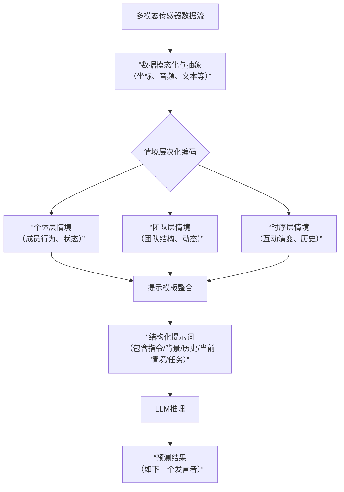
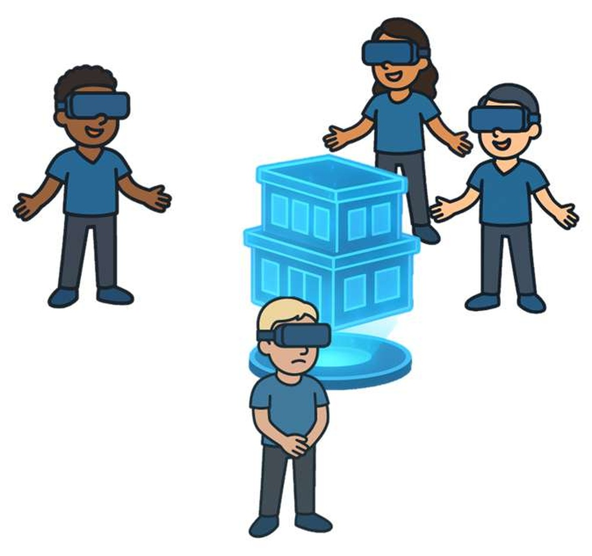
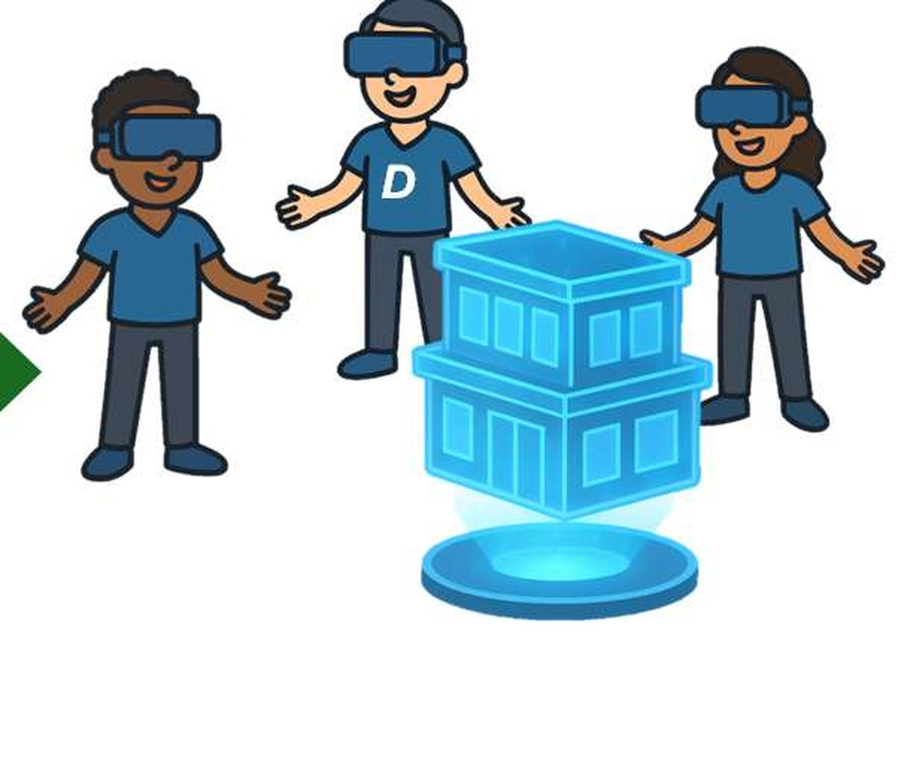
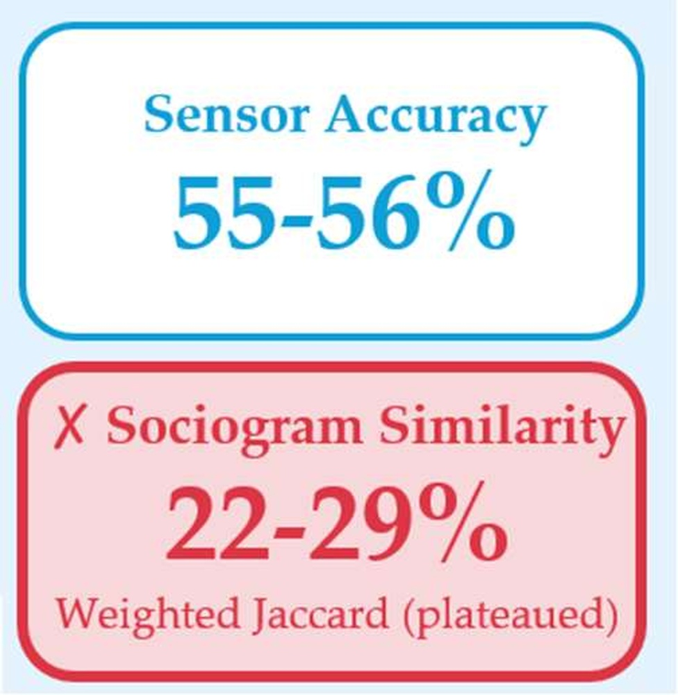
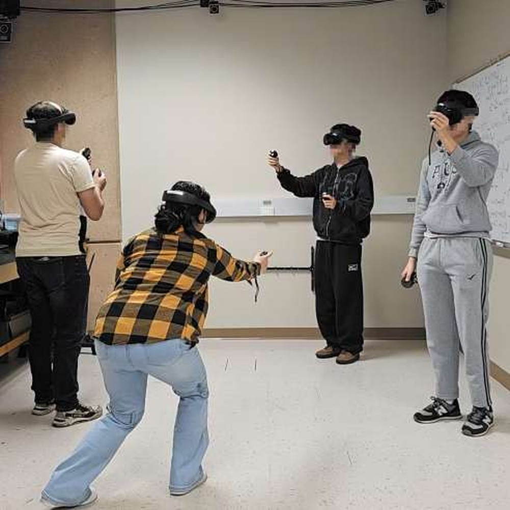
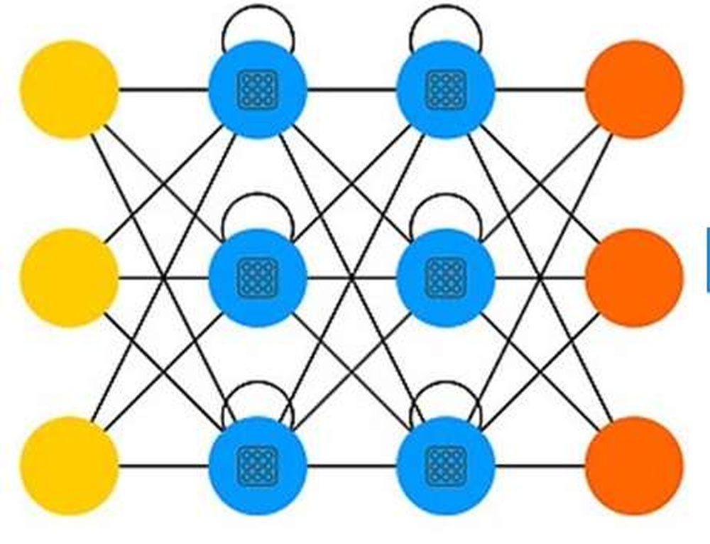
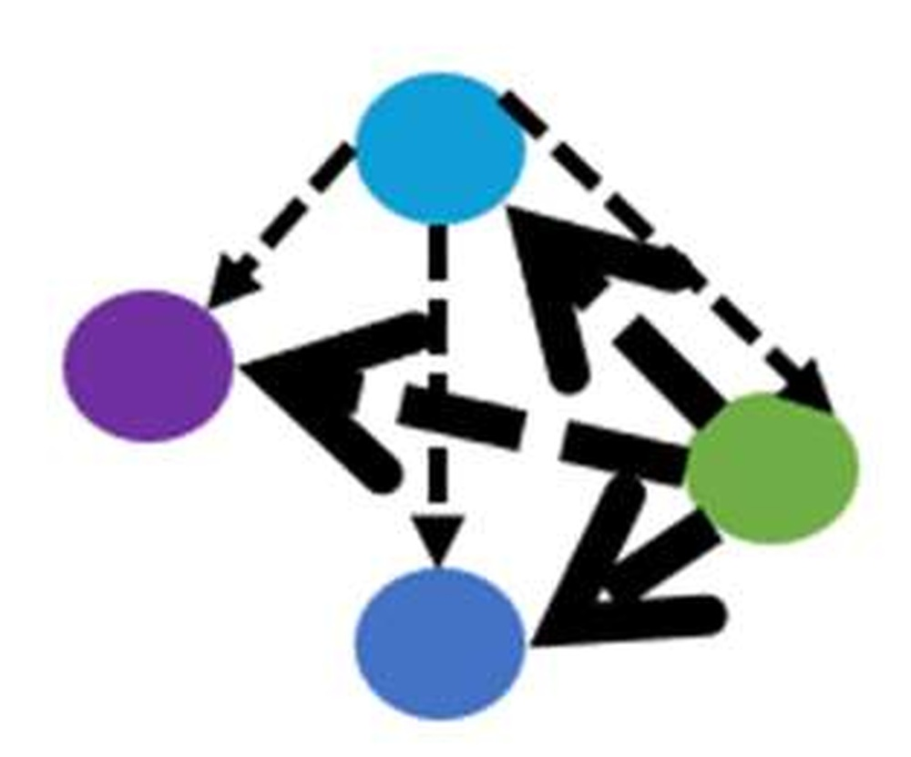

# M-CALLM: Multi-level Context Aware LLM Framework for Group Interaction Prediction

**ArXiv ID**: 2511.14661v1
**URL**: http://arxiv.org/abs/2511.14661v1
**提交日期**: 2025-11-18
**作者**: Diana Romero; Xin Gao; Daniel Khalkhali; Salma Elmalaki
**引用次数**: NULL
使用模型: ep-20251112215738-bz78g

## 1. 核心思想总结
这是一份关于论文《M-CALLM: Multi-level Context Aware LLM Framework for Group Interaction Prediction》的第一轮总结，按四个部分组织。

**1. Background (背景)**
本文的研究背景是混合现实环境下的团队协作。在这种环境中，理解并预测团队成员之间的互动模式对于构建智能协作系统至关重要。传统上，这类任务通常依赖于统计模型。

**2. Problem (问题)**
现有基于统计模型的方法在预测团队协作模式时，其性能似乎遇到了瓶颈。如何有效利用多层次的情境信息（如个体行为、团队结构和时序动态）来更准确地预测团队互动，是一个关键挑战。

**3. Method (high-level) (方法 - 高层次概述)**
作者提出了一个名为 M-CALLM 的框架。其核心思想是将来自多模态传感器的数据流，转化为层次化的、以自然语言描述的情境信息，然后利用大语言模型进行预测。该研究评估了三种LLM应用范式：零样本提示、少样本学习以及监督微调，并在两种模式（实时干预模式和自回归模拟模式）下与统计基线模型进行了比较。

**4. Contribution (贡献)**
*   **主要贡献：** 证明了将多层次情境信息编码为自然语言，可以使LLM在团队互动预测任务上突破传统统计模型的性能上限，特别是在实时对话预测中达到了96%的准确率，远超LSTM基线。
*   **关键发现：** 深入分析了不同信息模态的作用与模型局限，例如，揭示了自回归模拟模式下因误差累积导致的性能急剧下降，以及模型在处理“共享注意力”模态时的完全失效，为未来研究指明了方向。
*   **框架价值：** 提出的M-CALLM框架为构建平衡语义推理能力与系统基本约束的智能协作感知系统提供了新思路和实践基础。

## 2. 方法详解
好的，基于您提供的初步总结和论文方法章节的内容，以下是对该论文《M-CALLM: Multi-level Context Aware LLM Framework for Group Interaction Prediction》方法细节的详细说明。

### 论文方法细节详解

M-CALLM 框架的核心创新在于将复杂的、多模态的团队协作数据**结构化地编码为层次化的自然语言描述**，从而将团队互动预测问题转化为一个适合大语言模型处理的文本推理任务。其整体流程可以概括为“**数据模态化 -> 情境层次化 -> 提示结构化 -> LLM 推理**”。

#### 一、 关键创新与核心思想

1.  **情境的层次化自然语言编码**：这是最根本的创新。传统方法通常将原始数据（如坐标、时间戳）直接输入模型。M-CALLM 则设计了一套模板，将低层数据**升维**为富含语义的自然语言描述，并明确划分为三个层次：
    *   **个体层**：描述每个成员的具体行为（如“正在说话”、“指向白板”）。
    *   **团队层**：描述团队的整体状态和结构（如“形成了圆桌讨论布局”、“存在一个主导发言者”）。
    *   **时序层**：描述互动模式的演变（如“讨论焦点从主题A转移到了主题B”）。
    这种编码方式将“数据特征”变成了“情境故事”，极大地释放了LLM在理解语义和上下文关联方面的优势。

2.  **将LLM作为情境感知的推理引擎**：该框架并非简单地将LLM用作分类器，而是将其视为一个能够综合多层次情境信息并进行因果、逻辑推理的“智能体”。LLM的任务是基于对过去和当前情境的理解，预测未来的互动模式。

#### 二、 整体流程与关键步骤

整个M-CALLM框架的运作遵循下图所示的流程，其核心是将多模态传感器数据转化为结构化的自然语言提示词，最终利用LLM生成预测结果：

具体来说，流程包含以下四个关键阶段：

**步骤1：数据模态化与抽象**
*   **输入**：来自混合现实环境传感器的多模态数据流，包括：
    *   **空间数据**：成员的头戴设备位置、姿态、视线方向。
    *   **音频数据**：多通道语音录音。
    *   **文本数据**：语音识别转换后的对话文本。
*   **处理**：对原始数据进行初步计算和抽象，提取出有意义的特征。例如：
    *   从空间数据计算成员间的**距离**、**朝向角度**，从而判断是否在“面对面”交流。
    *   从音频数据通过语音活动检测确定**谁在何时说话**。
    *   从文本数据识别**讨论的关键词或主题**。

**步骤2：多层次情境编码（核心步骤）**
*   将步骤1中抽象出的特征，通过预定义的自然语言模板，转化为三个层次的情境描述。这是信息得以被LLM有效理解的关键。
    *   **个体层情境编码**：
        *   **内容**：描述每个成员在特定时间点的行为状态。
        *   **示例**：`“<T1> Alice is speaking. Her gaze is directed towards the shared whiteboard. She is gesturing.”` （T1时刻：Alice正在说话，她看向共享白板，并伴有手势。）
    *   **团队层情境编码**：
        *   **内容**：描述团队的整体属性。
        *   **示例**：`“The team is in a ‘Discussion’ state. The formation is semi-circular. Alice is the dominant speaker.”` （团队处于“讨论”状态，队形是半圆形，Alice是主导发言者。）
    *   **时序层情境编码**：
        *   **内容**：描述最近一段时间内（如过去K个时间步）互动模式的变化序列，提供历史背景。
        *   **示例**：`“In the past 3 turns: Bob was speaking about task allocation, then Alice took the floor to clarify the requirements.”` （过去三轮中：Bob在讨论任务分配，随后Alice接话澄清需求。）

**步骤3：结构化提示构建**
*   将编码好的多层次情境信息，按照严格的逻辑顺序整合到一个完整的提示中。这个提示通常包含以下几个部分：
    1.  **系统指令/角色设定**：定义LLM的角色（如“一个团队行为分析专家”）和任务目标。
    2.  **背景信息**：说明场景的基本设置（如团队人数、任务目标）。
    3.  **历史情境**：嵌入**时序层情境编码**，描述之前发生了什么。
    4.  **当前情境**：嵌入**个体层**和**团队层情境编码**，描述现在正在发生什么。
    5.  **任务指令**：明确要求LLM执行的预测任务（如“基于以上信息，预测下一个发言者是谁？”）。
    6.  **输出格式**：规定LLM的回答格式（如“只需输出成员名字”）。

**步骤4：LLM推理与输出**
*   将构建好的结构化提示输入给LLM。论文中评估了三种LLM应用范式：
    *   **零样本提示**：直接使用预训练的LLM（如GPT-4），不提供任何任务示例。
    *   **少样本学习**：在提示中额外提供几个（输入情境，正确输出）的示例，以引导LLM。
    *   **监督微调**：在特定任务的训练数据上对较小的LLM（如LLaMA）进行参数微调，使其专门化。

#### 三、 评估模式与基线对比

论文在两种模式下评估了框架性能，这体现了其方法的实用性：

1.  **实时干预模式**：
    *   **任务**：给定直到当前时刻 `t` 的真实情境信息，预测下一个瞬间 `t+1` 的互动（如下一个发言者）。
    *   **特点**：由于每一步预测都基于真实历史数据，没有误差累积，能最好地评估模型的**情境理解与即时推理能力**。
    *   **结果**：在此模式下，M-CALLM（特别是采用强大基座模型如GPT-4时）取得了96%的极高准确率，远超LSTM等统计基线。

2.  **自回归模拟模式**：
    *   **任务**：给定初始情境，让模型逐步预测未来的互动。模型在 `t` 时刻的预测输出，会作为 `t+1` 时刻情境输入的一部分，从而模拟整个互动过程的演变。
    *   **特点**：此模式更具挑战性，能测试模型的**长期推理和动态模拟能力**，但预测误差会随着模拟步长增加而累积。
    *   **结果**：正如初步总结中指出的，所有模型在此模式下性能都急剧下降，这暴露了当前方法在长期动态预测上的局限性，是一个重要的研究发现。

### 总结

M-CALLM 方法的核心精髓在于其**信息处理范式**的转变。它通过精心设计的层次化自然语言编码，将传统的数据驱动预测问题，巧妙地转化为一个LLM擅长的语义推理问题。这不仅在实时预测任务上取得了突破性性能，其框架本身也为如何将LLM与具身化、多模态的智能系统结合提供了一个可复用的蓝图。同时，论文对模型局限性的分析（如自回归误差、对“共享注意力”等抽象情境的处理困难）也为后续研究指明了改进方向。

## 3. 最终评述与分析
好的，结合前两轮返回的信息与论文结论部分，以下是关于论文《M-CALLM: Multi-level Context Aware LLM Framework for Group Interaction Prediction》的最终综合评估。

---

### 最终综合评估

#### 1) 总体摘要

本论文针对混合现实环境中团队协作互动预测的挑战，提出了一个创新性的框架 **M-CALLM**。该框架的核心思想是将来自多模态传感器的低层数据，**结构化地编码为富含语义的多层次自然语言描述**（个体层、团队层、时序层），从而将互动预测问题转化为大语言模型擅长的文本推理任务。论文通过系统性的实验表明，该方法在**实时干预模式**下（即基于真实历史数据预测下一时刻互动）取得了突破性的性能（准确率高达96%），显著超越了传统统计基线模型（如LSTM）。同时，论文也坦诚地分析了框架在**自回归模拟模式**下因误差累积导致的性能局限，以及对某些抽象情境信息（如“共享注意力”）处理能力的不足，为未来研究提供了清晰的指引。

#### 2) 优势

*   **范式创新性强**：最大的优势在于实现了**信息处理范式的根本转变**。它不是简单地将LLM用作分类器，而是通过层次化的自然语言编码，将LLM提升为一个能够进行深度语义理解和情境推理的“智能体”，巧妙地利用了LLM的核心能力。
*   **实时预测性能卓越**：在最具实用价值的实时干预预测任务上，框架展现了近乎完美的准确率，证明了该方法在理解和预测即时团队互动方面的巨大潜力，为解决该领域的性能瓶颈提供了有效的方案。
*   **框架通用且可解释**：所提出的M-CALLM框架是一个通用的蓝图，其“数据模态化→情境层次化→提示结构化→LLM推理”的流程可扩展到其他多模态情境感知任务中。同时，自然语言的情境描述使得模型的决策依据更具可解释性，便于人类理解和调试。
*   **分析全面深入**：论文没有仅仅展示成功的一面，而是对三种LLM应用范式（零样本、少样本、微调）和两种评估模式（实时、自回归）进行了全面对比，并深入分析了不同信息模态的贡献与模型的失效情况，体现了严谨的科学态度。

#### 3) 劣势 / 局限性

*   **长期动态预测能力不足**：论文明确指出，在自回归模拟模式下，所有模型（包括M-CALLM）的性能都会急剧下降。这暴露了当前方法一个关键局限：**无法有效应对预测误差的累积**，导致其在模拟长期团队互动演变时可靠性不高。
*   **对抽象情境的编码与理解存在挑战**：论文发现模型在处理如“共享注意力”这类需要更高层次推理的模态时完全失效。这表明，**如何将某些复杂、抽象的团队动态精准地编码为LLM可理解的自然语言**，仍是一个未解决的难题。
*   **依赖大型LLM与提示工程**：框架的最佳性能依赖于GPT-4等强大的闭源模型，这可能带来成本、延迟和数据隐私问题。同时，提示词模板的设计需要大量人工精心构建，其最优形式可能需要反复试验，影响了方法的便捷性。
*   **计算开销与实时性权衡**：虽然实时预测准确率高，但使用大型LLM进行推理的计算开销和延迟可能比传统统计模型大得多，在需要极低延迟的实时应用中可能面临挑战。

#### 4) 潜在应用 / 意义

*   **智能协作系统**：该框架可直接用于开发更智能的混合现实协作平台，实现诸如**智能会议助手**（自动识别讨论焦点、预测发言权转换）、**协作流程引导**（在团队陷入僵局时适时提示）等功能，显著提升团队效率。
*   **人机交互与机器人学**：使智能体或机器人能够更深入地理解人类团队的动态，从而实现**更自然、更上下文感知的人机协作**。例如，让机器人能够预测团队需求并主动提供帮助，或更好地融入人类团队扮演特定角色。
*   **团队培训与评估**：在教育培训领域，该技术可用于**分析和评估团队表现**，为团队成员提供关于其沟通模式和协作效率的量化反馈，用于领导力培训、急救演练等场景。
*   **方法论启示**：本论文为如何将LLM与具身智能、多模态感知领域结合提供了一个成功范例。其“**将低层数据升维为语义情境**”的核心思路，对解决其他需要复杂情境推理的AI问题（如智能交通、智能家居）具有重要的借鉴意义。论文指出的局限性也为后续研究指明了重点方向，如如何提高模型的长期预测鲁棒性、如何更好地编码抽象概念等。

---
**总结**：论文《M-CALLM》提出了一项具有高度创新性和实用价值的研究。它不仅在特定任务上取得了性能突破，更重要的是开创了一种利用LLM处理多层次情境感知问题的新范式。尽管在长期预测和某些抽象概念处理上存在局限，但其清晰的框架、卓越的实时性能以及深入的分析，使其成为智能协作系统和LLM应用领域的一项重要贡献，具有广阔的应用前景和深远的研究启示。

---

# 附录：论文图片

## 图 1

## 图 2

## 图 3

## 图 4

## 图 5

## 图 6

## 图 7

## 图 8

## 图 9

## 图 10

