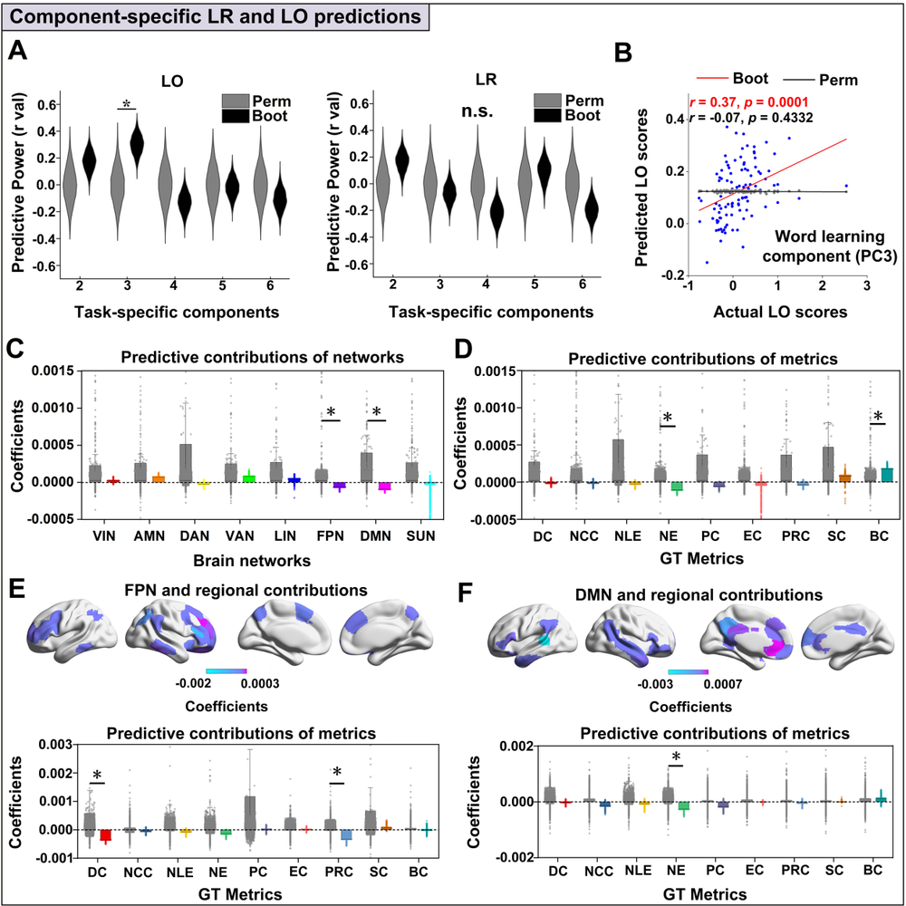
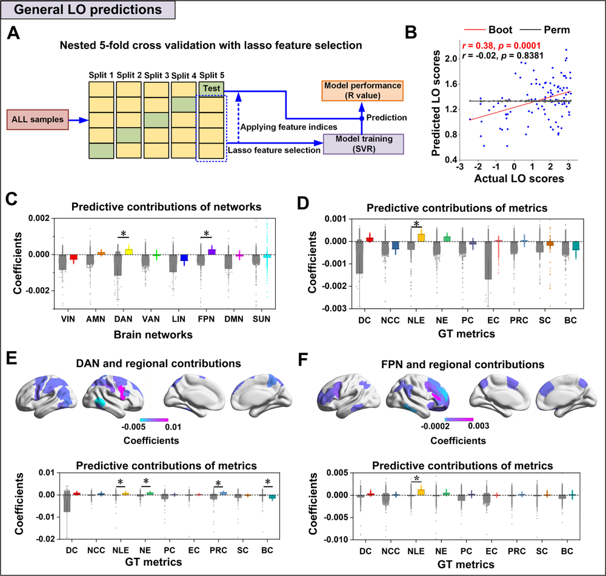
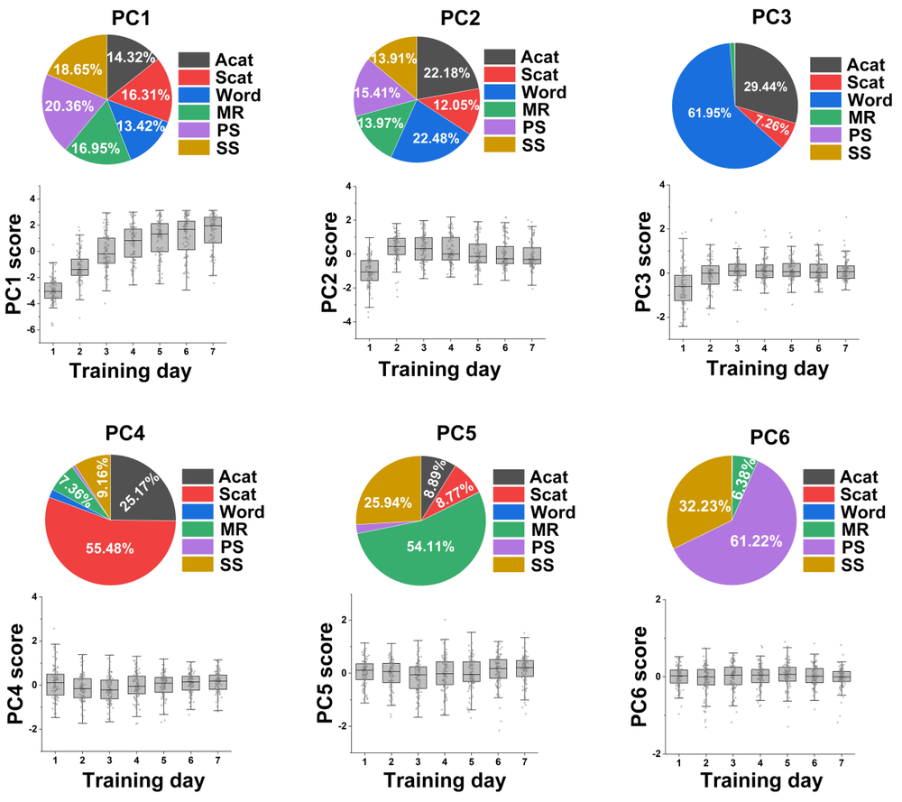
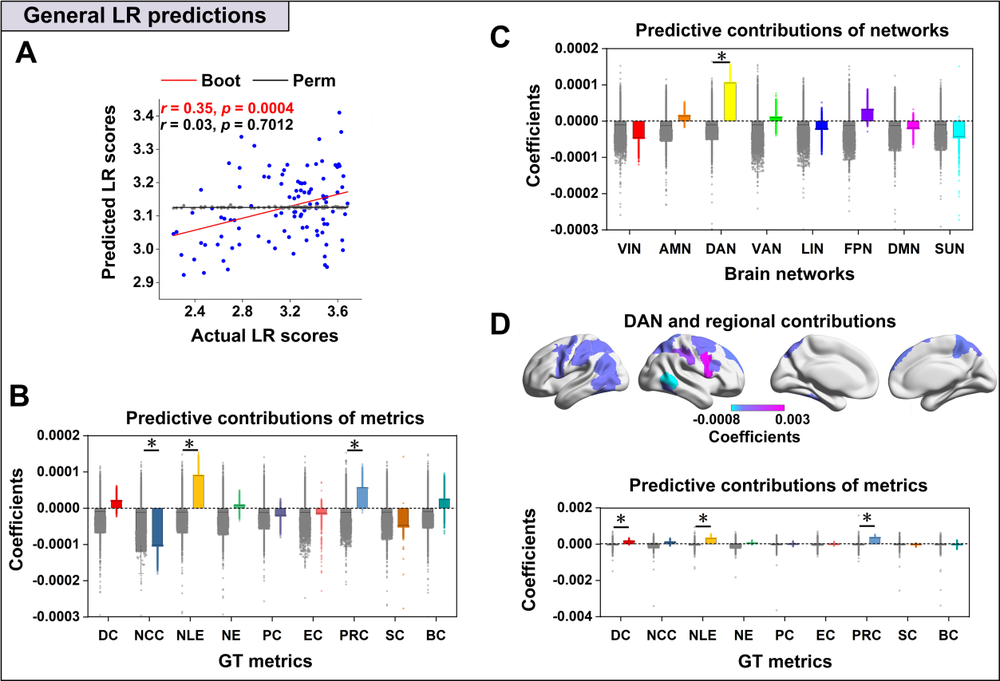
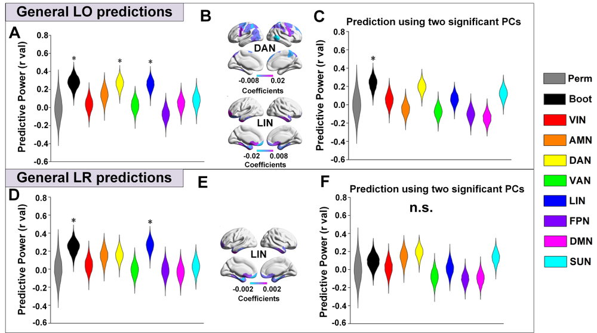
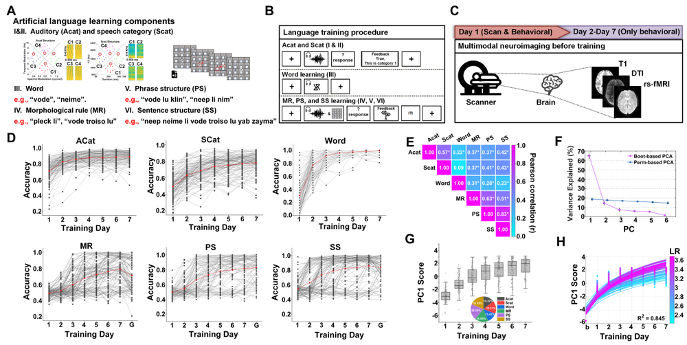
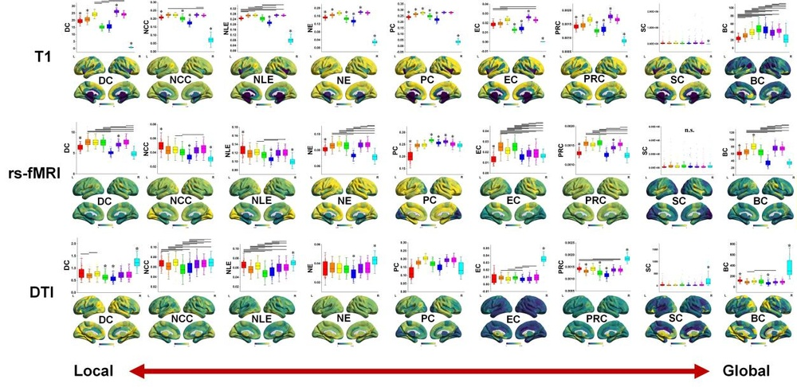
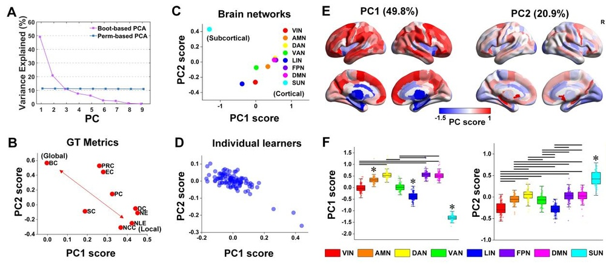
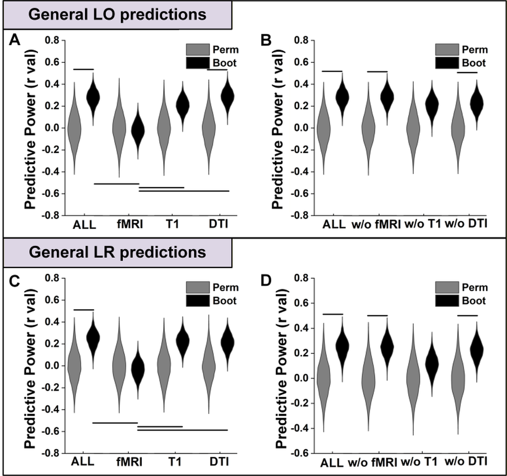

# Multi-network Topology Underlying Individual Language Learning Success

**ArXiv ID**: 2511.14453v1
**URL**: http://arxiv.org/abs/2511.14453v1
**提交日期**: 2025-11-18
**作者**: Peilun Song; Shuguang Yang; Xiujuan Geng; Zhenzhong Gan; Suiping Wang; Gangyi Feng
**引用次数**: NULL
使用模型: ep-20251112215738-bz78g

## 1. 核心思想总结
作为学术论文分析专家，以下是根据您提供的标题和摘要，为您整理的简洁第一轮总结：

**论文标题：** 个体语言学习成功背后的多网络拓扑结构

**第一轮总结：**

*   **Background (背景):**
    成人语言学习能力存在显著的个体差异。传统上，这种差异被认为与前颞叶语言区相关，但近期研究逐渐认为其源于分布更广的大脑网络。然而，这些网络及其拓扑组织在解释这些差异中的具体作用尚不明确。

*   **Problem (问题):**
    本研究旨在探究，基于多个内在大脑网络的拓扑结构特性，能否解释语言学习在整体和特定任务上的个体差异。其核心问题是：个体语言学习成功的差异是否由内在的多网络拓扑结构所决定。

*   **Method (方法 - 高阶概述):**
    研究对101名健康成人进行了多模态脑成像（静息态fMRI、结构MRI、弥散张量成像），以构建内在功能与结构连接网络。随后，参与者接受了为期七天的六项人工语言任务训练。研究者使用基于图论的网络指标，通过交叉验证的预测模型，来预测最终的学习成果（LO）和学习速率（LR）。

*   **Contribution (贡献):**
    1.  **实证发现：** 首次通过多模态、多网络的图论分析，显著预测了语言学习的整体能力（主要与背侧注意网络和额顶网络相关），并揭示了节点局部效率是最一致的预测指标。
    2.  **理论支持：** 研究结果支持了语言学习的“多系统交互”假说，即注意-控制网络与默认模式网络、皮下系统等的相互作用共同塑造了学习轨迹。
    3.  **应用潜力：** 该研究增进了对语言学习个体差异的机制理解，为未来实现个性化的语言教育奠定了基础。

## 2. 方法详解
好的，作为学术论文分析专家，我将基于您提供的初步总结和方法章节内容，对该论文的方法细节进行详细阐述，重点描述其关键创新、算法/架构细节、关键步骤与整体流程。

### **论文方法细节详解**

本研究的核心方法论在于**将多模态脑成像数据转化为基于图论的量化指标，并利用机器学习模型，检验这些指标对语言学习行为个体差异的预测能力**。其流程严谨，环环相扣，具体如下：

---

#### **一、 整体流程概览**

研究的整体流程可以概括为以下四个核心阶段：
1.  **数据采集阶段**：招募参与者，采集其多模态脑成像数据（结构、功能、弥散）和行为基线数据。
2.  **数据处理与网络构建阶段**：对脑成像数据进行预处理，定义网络节点（脑区）和边（连接），分别构建**功能网络** 和**结构网络**。
3.  **网络拓扑指标提取阶段**：运用图论方法，从构建好的大脑网络中计算出一系列量化指标，作为预测模型的输入特征。
4.  **预测模型构建与验证阶段**：将网络指标与语言学习成果进行关联，采用交叉验证的机器学习模型来预测学习表现，并评估预测的稳健性和特异性。

---

#### **二、 关键步骤与算法/架构细节**

**步骤1：参与者与行为数据采集**
*   **参与者**： 101名健康右利手成人，确保样本同质性，减少无关变量干扰。
*   **语言学习任务**： 为期7天的**人工语言训练**。使用人工语言是关键设计，可以排除参与者先前语言经验的影响，纯粹测量其**学习能力**。
    *   **六项任务**： 涵盖了语言学习的不同方面（如词汇学习、语法规则理解、语音感知等），这使得研究者不仅能预测**整体学习成果**，还能分析不同网络对**特定学习成分**的预测作用。
    *   **关键行为指标**：
        *   **学习成果**： 整个训练周期结束后的最终表现。
        *   **学习速率**： 在整个训练过程中成绩提升的快慢程度。区分这两者有助于揭示网络拓扑是影响最终天花板还是学习效率。

**步骤2：多模态脑成像数据采集与预处理**
*   **数据模态**：
    *   **静息态功能磁共振成像**： 用于构建**功能连接网络**，反映脑区在静息状态下神经活动的同步性，代表功能拓扑。
    *   **结构磁共振成像**： 用于高精度脑区分割，为网络定义节点。
    *   **弥散张量成像**： 用于追踪白质纤维束，构建**结构连接网络**，反映脑区间的解剖连接强度，代表结构拓扑。
*   **预处理**： 对每种成像数据都进行了标准化的预处理流程（如头动校正、平滑、归一化到标准空间等），以确保数据质量可比性。

**步骤3：大脑网络构建（节点与边的定义）**
这是方法的核心架构细节，决定了后续分析的基础。
*   **节点定义**： 研究采用了**多网络模板**（如Yeo等人的7网络或17网络模板）。这将全脑划分为多个属于不同大型功能系统的脑区（如背侧注意网络、默认模式网络、额顶网络等）。**关键创新在于不是将全脑作为一个整体网络，而是基于先验的功能系统进行划分，从而可以直接探究特定网络的作用。**
*   **边定义**：
    *   **对于功能网络**： 边代表**功能连接**。计算每两个脑区时间序列之间的相关系数（如皮尔逊相关），得到一个101x101（假设有101个节点）的相关矩阵。通过设定阈值，将相关矩阵转换为二值化或加权的邻接矩阵，即功能网络。
    *   **对于结构网络**： 边代表**结构连接**。利用DTI纤维束追踪技术，计算每两个脑区之间存在的白质纤维束数量或各向异性分数等指标，构建出结构连接矩阵。

**步骤4：图论指标计算**
从每个参与者构建好的功能网络和结构网络中，提取能够量化其**拓扑组织**的图论指标。这些指标是预测模型的直接特征。
*   **全局指标**： 描述整个网络的属性，如：
    *   **全局效率**： 信息在整个网络中传输的效率，值越高表示信息整合能力越强。
    *   **聚类系数**： 网络局部分簇化的程度，值高代表存在模块化结构。
*   **局部指标**： 描述每个节点（脑区）在其局部邻域内的属性，如：
    *   **节点局部效率**： 论文指出这是**最一致的预测指标**。它衡量的是一个节点的直接邻居之间相互连接的效率。**高节点局部效率意味着该脑区所在的局部子网络信息处理能力强、容错性高**。
*   **网络间指标**： 由于采用了多网络模板，可以计算网络之间的连接强度（如背侧注意网络与默认模式网络之间的功能连接），这直接用于检验“多系统交互”假说。

**步骤5：预测模型构建与验证（关键创新点）**
这是本研究方法上最突出的创新，避免了传统相关性分析的局限性。
*   **模型选择**： 采用**支持向量回归**（或类似的可处理高维特征的机器学习模型）。SVR擅长在小样本、多特征的情况下寻找最优的预测超平面。
*   **特征选择与降维**： 由于图论指标数量可能很多，直接放入模型会导致过拟合。研究很可能采用了**递归特征消除**或类似方法，筛选出对预测学习行为贡献最大的关键网络指标。
*   **交叉验证**： 使用**留出法交叉验证**（如10折交叉验证）。将样本分为10份，轮流用9份训练模型，1份测试，重复10次。**这种做法能严格评估模型的泛化能力，即模型在新数据上的预测效果，而非仅仅描述已观测数据的相关性，极大地增强了结论的可靠性。**
*   **统计显著性评估**： 通过**置换检验**（如将行为标签随机打乱1000次，重新进行上述预测流程），计算得到的预测准确率是否显著高于随机水平。

---

#### **三、 关键创新总结**

1.  **多网络拓扑视角**： 超越单一网络或全脑整体分析，从多个内在功能网络（如DAN， FPN, DMN）的拓扑属性及其交互出发，为“多系统交互”假说提供了直接的、量化的证据。
2.  **多模态数据融合**： 同时考察**功能拓扑**（rs-fMRI）和**结构拓扑**（DTI），探究不同层面的脑网络组织对学习行为的贡献，分析更为全面。
3.  **预测性而非相关性分析框架**： 采用交叉验证的机器学习模型（SVR），核心目标是**预测**个体未来的学习表现，而非仅仅报告脑指标与行为的事后相关。这使得研究结论具有更强的因果推断意味和实际应用前景。
4.  **节点局部效率作为核心指标**： 研究发现**节点局部效率**是最稳健的预测因子，这提示语言学习能力的个体差异可能更依赖于特定脑区局部微电路的信息处理效率，而非全脑范围的长程连接。

通过上述严谨、创新的方法设计，该研究成功地建立了从“多模态脑网络拓扑”到“语言学习行为”的预测模型，有力地证实了其核心假设。

## 3. 最终评述与分析
好的，作为学术论文分析专家，我将结合您提供的初步总结、方法详述以及结论部分，对该研究进行最终的综合评估。

---

### **最终综合评估**

**论文标题：** 个体语言学习成功背后的多网络拓扑结构

#### **1) 整体总结**

本研究通过一项严谨的多模态脑成像与行为实验，系统地探讨了大脑内在的网络拓扑结构如何预测成年人在人工语言学习中的个体差异。研究创新性地结合了静息态功能磁共振成像（rs-fMRI）和弥散张量成像（DTI）数据，基于先验的功能网络模板构建了大脑的功能和结构连接网络，并提取了多种图论指标。关键突破在于采用了**交叉验证的机器学习模型（如支持向量回归）**，旨在**预测**而非仅仅**关联**学习行为。研究结果表明，**多个大规模脑网络（特别是背侧注意网络和额顶网络）的拓扑属性，尤其是节点局部效率，能够显著预测个体的整体学习成果和学习速率**。这些发现强有力地支持了语言学习依赖于“多系统交互”的理论框架，即语言学习不仅涉及经典语言区，更是注意、控制、默认模式等多个系统协同作用的结果。

#### **2) 优势**

*   **理论框架先进：** 研究成功地将语言学习个体差异的研究焦点，从传统的、孤立的语言区转向了分布式的、多系统交互的大脑网络拓扑，与认知神经科学的前沿理论高度契合。
*   **方法论严谨创新：**
    *   **预测性分析框架：** 采用交叉验证的机器学习模型是本研究的核心优势。它避免了传统相关性分析的过拟合风险，严格检验了脑网络指标对**新样本**学习表现的预测能力，使结论更具鲁棒性和泛化性。
    *   **多模态数据融合：** 同时分析功能连接和结构连接，提供了对大脑网络组织更全面、互补的视角。
    *   **精细的行为测量：** 使用人工语言并区分“整体学习成果”和“学习速率”，能够更精确地揭示脑网络与不同学习成分的特异性关系。
*   **发现明确且具有启发性：** 明确识别出**节点局部效率**作为最一致的预测因子，这提示语言学习能力的差异可能根植于特定脑区局部微环路的信息处理效率，为后续机制研究提供了清晰的方向。

#### **3) 局限性与不足**

*   **样本同质性与泛化性：** 样本均为健康的右利手成人，这虽然控制了无关变量，但也限制了研究结论向其他人群（如左利手、不同年龄段、或有神经发育差异的个体）的直接推广。
*   **相关性与因果关系的界限：** 尽管预测模型增强了推断力度，但这仍然是一项观察性研究。脑网络的拓扑特性是“预先存在的”状态，它虽然能预测学习成功，但无法完全确定其是学习能力的“原因”而非其他因素（如早期经验、遗传）共同塑造的“结果”。
*   **人工语言的生态效度：** 人工语言虽然能排除先前知识的影响，但其学习过程、难度和复杂性无法完全模拟真实、自然的第二语言习得。因此，将结论直接应用于真实世界的语言教学仍需谨慎。
*   **模型解释的复杂性：** 机器学习模型（如SVR）有时如同“黑箱”，虽然能做出准确预测，但对于每个网络特征具体如何影响学习过程的精确认知机制，解释起来相对复杂，需要结合其他实验手段进行深入探究。

#### **4) 潜在应用与启示**

*   **个性化教育与神经标记物开发：** 本研究最重要的应用前景在于**个性化学习**。未来或可基于个体的大脑网络图谱，开发出预测其语言学习潜力和最佳学习模式的“神经标记物”。例如，识别出哪些人可能从沉浸式学习中获益更多，哪些人则需要更强调显性语法规则的教学。
*   **学习障碍的早期识别与干预：** 对网络拓扑的理解有助于揭示特定学习困难（如阅读障碍）的神经基础。通过识别异常的网络模式，可能实现更早期的诊断，并针对薄弱网络设计特定的认知训练或神经反馈干预方案。
*   **推动理论发展：** 研究结果为“多系统交互”假说提供了坚实的实证支持，将促使学界更深入地探索注意、记忆、控制等一般性认知系统与语言习得之间的动态关系，推动构建更完善的语言学习理论模型。
*   **方法论范式的推广：** 本研究成功建立的“多模态网络拓扑-预测模型”范式，可以被广泛借鉴于研究其他复杂认知技能（如数学能力、音乐技能）的个体差异，具有重要的方法论意义。

**总结而言，这项研究在方法上具有显著的创新性和严谨性，在理论上提供了强有力的支持，其发现对理解语言学习本质和开发未来应用具有重要价值，尽管其在因果推断和生态效度上存在固有的局限性。**

---

# 附录：论文图片

## 图 1

## 图 2

## 图 3

## 图 4

## 图 5

## 图 6

## 图 7

## 图 8

## 图 9

## 图 10

