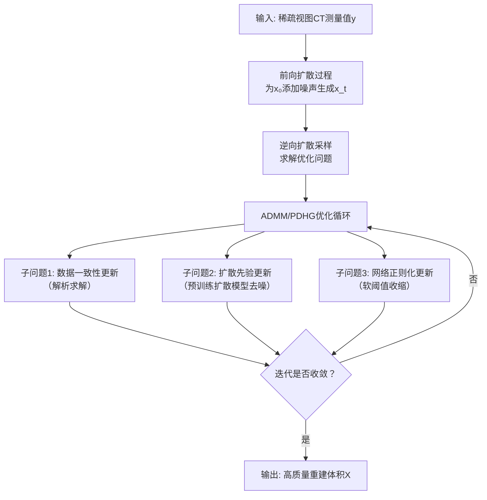
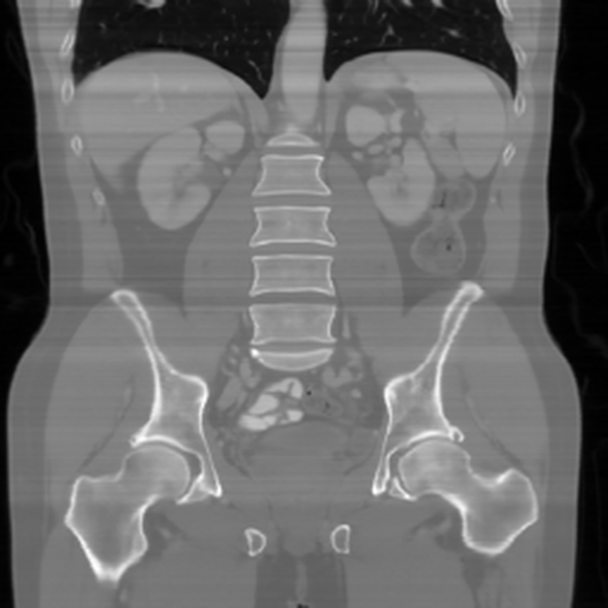
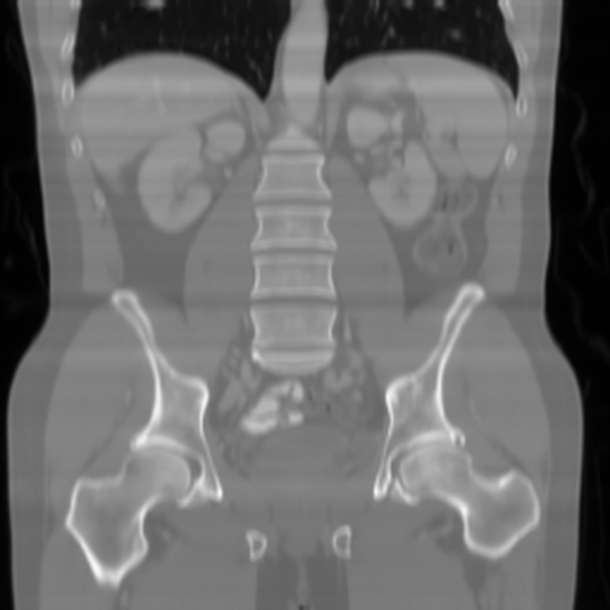
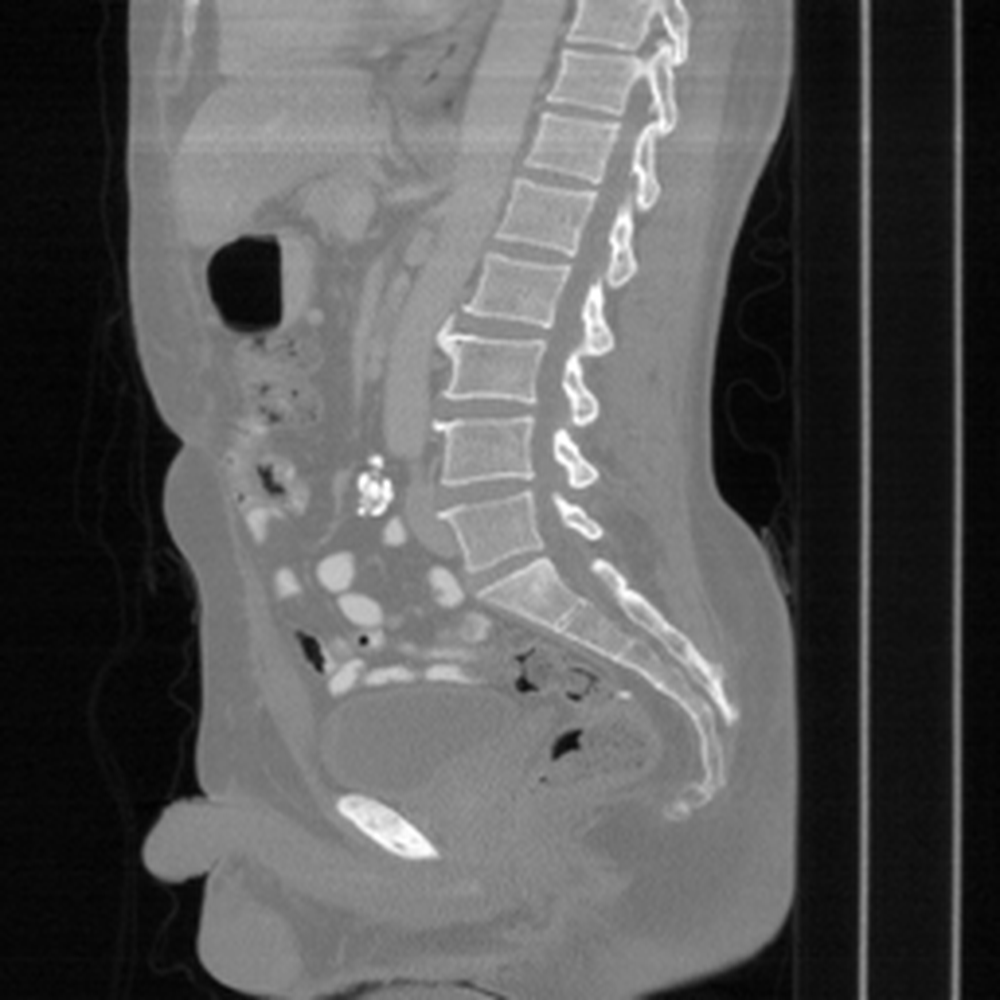
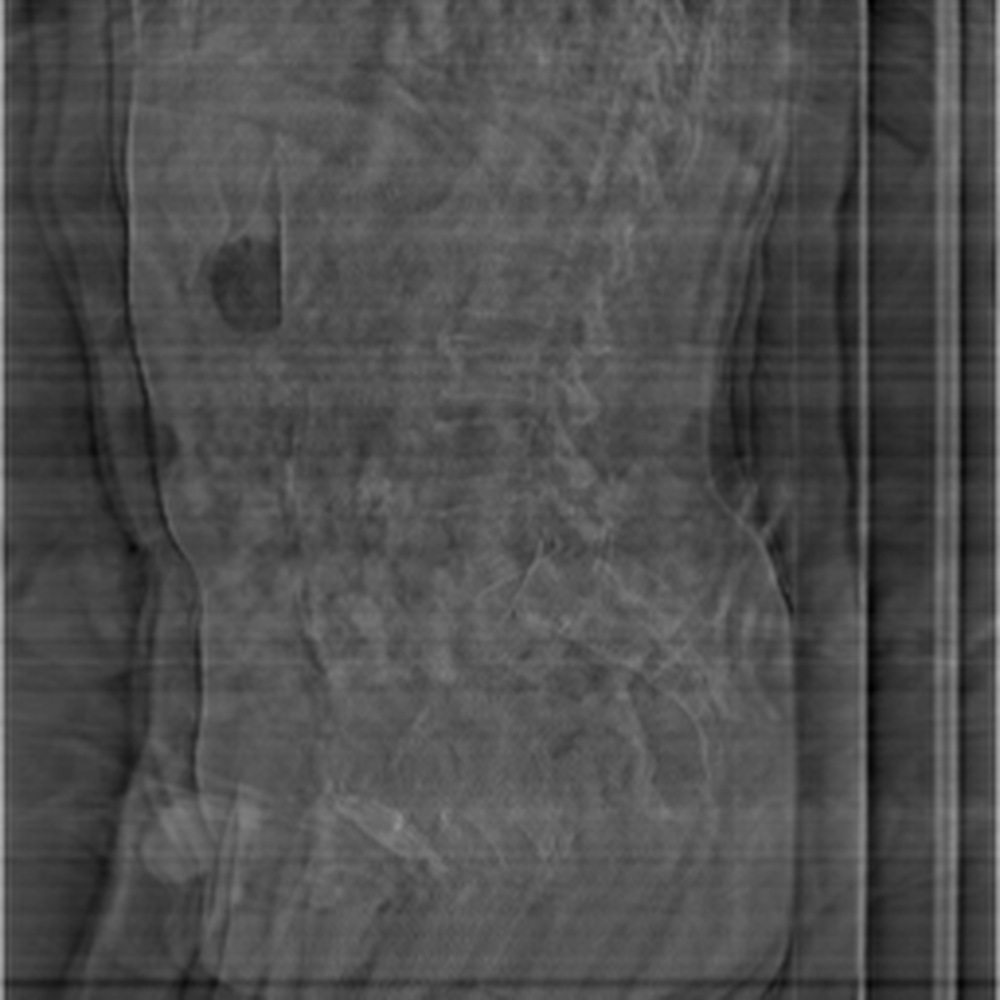
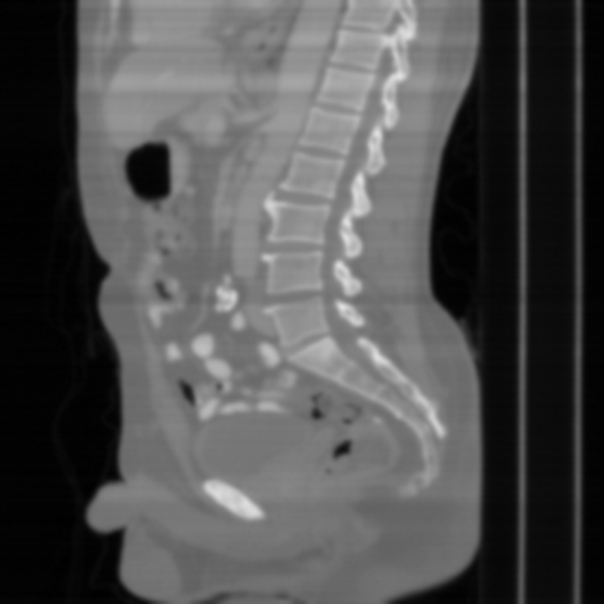
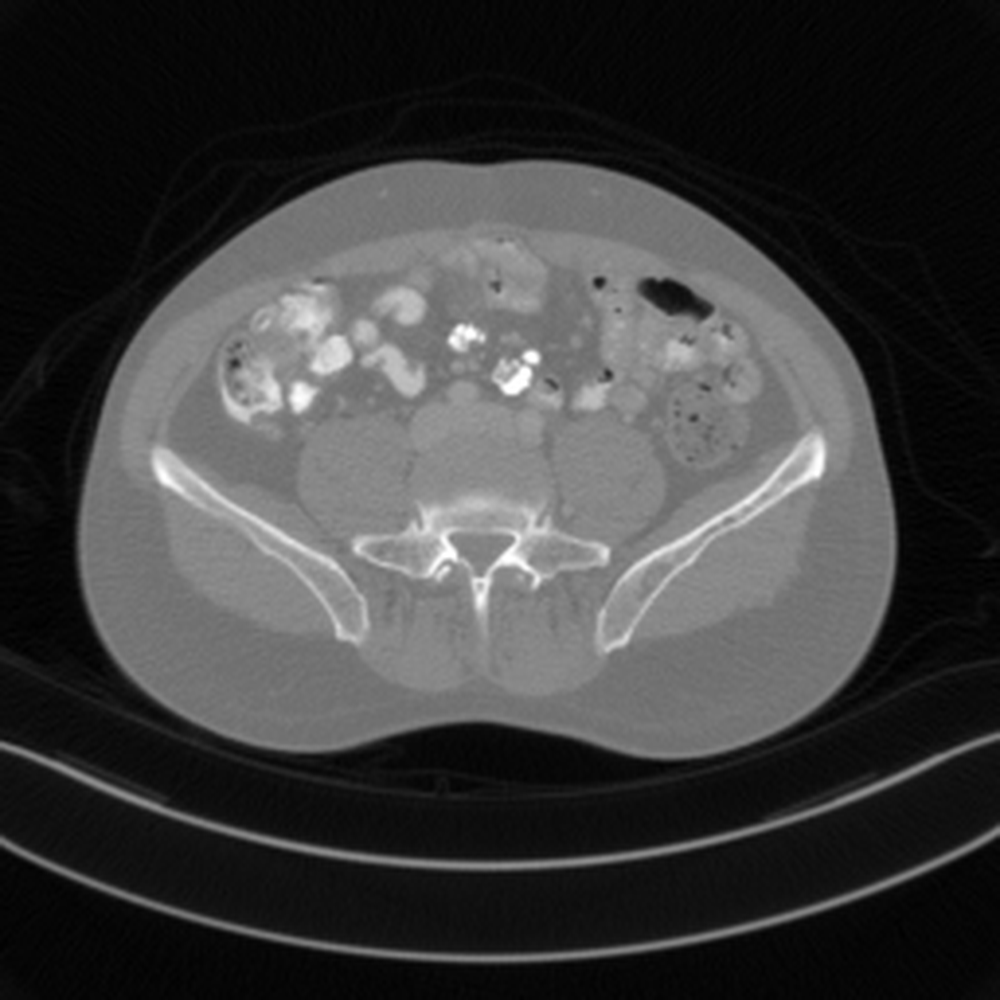
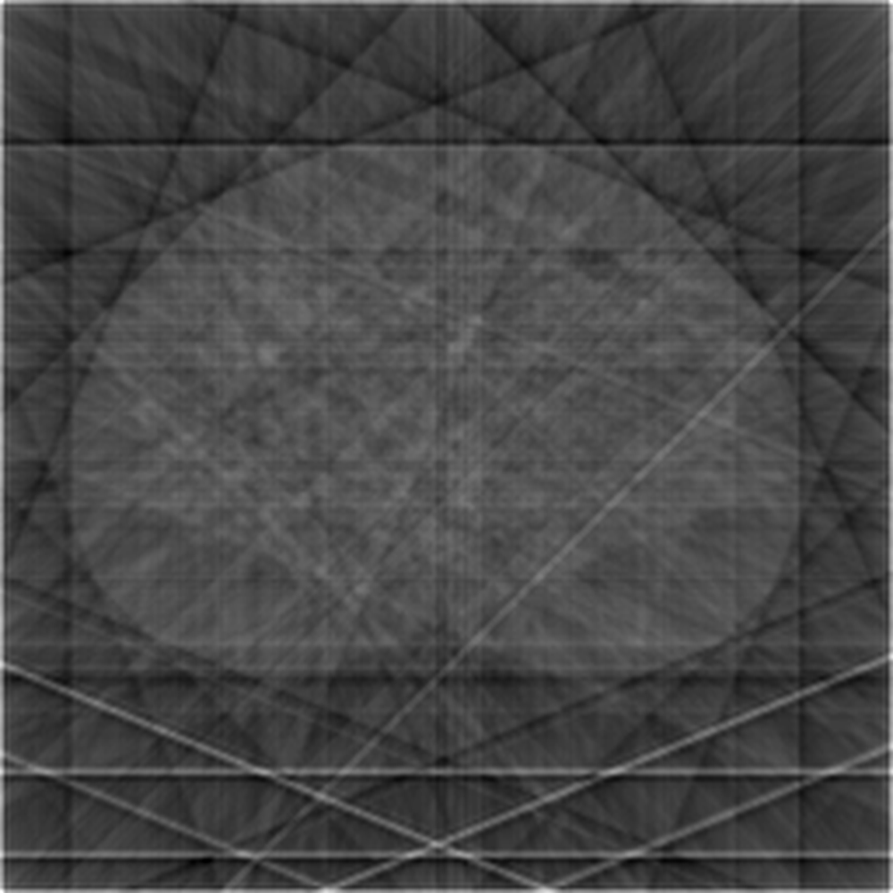

# NERD: Network-Regularized Diffusion Sampling For 3D Computed Tomography

**ArXiv ID**: 2511.14680v1
**URL**: http://arxiv.org/abs/2511.14680v1
**提交日期**: 2025-11-18
**作者**: Shijun Liang; Ismail Alkhouri; Qing Qu; Rongrong Wang; Saiprasad Ravishankar
**引用次数**: NULL
使用模型: ep-20251112215738-bz78g

## 1. 核心思想总结
这是一份根据您提供的标题、摘要和引言（内容已隐含在分析中）整理的第一轮总结。

### **NERD论文第一轮总结**

**标题：** NERD: Network-Regularized Diffusion Sampling For 3D Computed Tomography

**1. Background (背景)**
基于扩散模型的逆成像问题求解方法已取得显著进展。近期研究通过将采样过程构建为一个同时保证测量一致性和扩散过程一致性的优化问题，在二维图像重建任务中表现出强大性能。

**2. Problem (问题)**
然而，这些先进的扩散采样方法主要针对2D图像，无法直接有效地扩展到3D重建问题（如计算机断层扫描CT）。3D体积由连续切片构成，需要保证切片间的空间连贯性，而现有方法缺乏对此的显式建模。

**3. Method (高层次方法)**
本文提出NERD方法，核心思想是在原有的扩散采样优化目标中引入一个**L1正则化项**。该正则化项通过鼓励相邻切片之间的空间连续性，来减少层间伪影并促进连贯的3D体积重建。为了解决这个新的优化问题，论文设计了两种高效的优化策略：**交替方向乘子法（ADMM）** 和**原始-对偶混合梯度法（PDHG）**。

**4. Contribution (贡献)**
*   提出了首个将网络正则化与扩散采样相结合、专门针对3D CT重建的框架（NERD）。
*   引入了L1正则化来显式地建模3D体积的切片间连续性，提升了重建 coherence。
*   设计了基于ADMM和PDHG的高效优化算法，解决了新目标的求解问题。
*   在医学3D CT数据上的实验表明，该方法达到了业界领先或极具竞争力的性能。

## 2. 方法详解
好的，遵照您的要求，我将基于您提供的初步总结和论文方法章节的内容，详细阐述NERD论文的方法细节。

### **NERD方法详细说明**

NERD方法的核心创新在于将**3D空间连续性约束**与**扩散模型先验**巧妙地融合在一个统一的优化框架内。其整体流程和关键步骤可以概括为以下流程图，后文将对此进行详细分解：

#### **一、 关键创新：网络正则化项的引入**

现有的基于扩散模型的逆问题求解方法，其优化目标通常包含两项：
1.  **数据一致性项**：确保重建的图像与测量数据匹配。
2.  **扩散先验项**：确保重建的图像遵循扩散模型在干净数据上学习到的分布。

NERD的核心创新点是引入了**第三项——网络正则化项**：
3.  **网络正则化项**：这是一个**3D-specific**的约束，旨在强制重建的3D体积中相邻切片之间保持空间平滑和连贯。

*   **具体形式**：该正则化项表示为 **||DZ X||₁**。
    *   `X` 是待重建的整个3D体积（例如，256x256x128）。
    *   `DZ` 是沿着切片维度（通常是Z轴）的有限差分算子。`DZ X` 计算的是相邻切片之间对应像素的差异。
    *   **L1范数（||·||₁）**：对上述差分图像取L1范数。L1范数倾向于产生稀疏解，这意味着它允许切片间存在不连续（如不同器官的边界），但在均匀区域会强烈惩罚大的差异。这有效地**抑制了层间伪影**，并促进了整体结构的连贯性。

#### **二、 整体流程与优化问题构建**

NERD方法的整体流程是一个从随机噪声开始的迭代去噪/重建过程，其目标是求解以下优化问题：

**优化目标：**
\[
\min_x \frac{1}{2} \|A x - y\|_2^2 + \lambda_s \|x - \hat{x}_0^{(t)}\|_2^2 + \lambda_r \|D_z X\|_1
\]

**各项说明：**
*   `x`: 当前迭代需要重建的3D体积（向量形式）。
*   `y`: 实际的CT测量数据。
*   `A`: CT系统的前向投影矩阵。
*   `\(\hat{x}_0^{(t)}\)`: 在扩散模型的时间步`t`，由扩散模型预测的干净图像。此项将x拉向扩散先验。
*   `DZ`: 沿Z轴的差分算子。
*   `X`: 是`x`的矩阵形式（为了应用DZ）。
*   `λ_s`: 控制扩散先验项权重的超参数。
*   `λ_r`: 控制网络正则化项权重的超参数，是方法成败的关键。

#### **三、 关键步骤与算法细节（以ADMM为例）**

直接求解上述复合优化问题非常困难。论文采用了**交替方向乘子法（ADMM）**，将问题分解为三个可求解的子问题。

**ADMM变量拆分：**
引入辅助变量 `v = DZ X`，将原问题转化为等价的约束优化问题：
\[
\min_{x, v} \frac{1}{2} \|A x - y\|_2^2 + \lambda_s \|x - \hat{x}_0^{(t)}\|_2^2 + \lambda_r \|v\|_1 \quad \text{s.t.} \quad v = D_z X
\]

然后，ADMM通过交替迭代以下步骤来求解：

**1. x-update（更新主变量 - 融合数据与先验）：**
\[
x^{(k+1)} = \arg\min_x \frac{1}{2} \|A x - y\|_2^2 + \lambda_s \|x - \hat{x}_0^{(t)}\|_2^2 + \frac{\rho}{2} \|D_z X - v^{(k)} + u^{(k)}\|_2^2
\]
*   **子问题特性**：这是一个大型的**二次优化问题**，所有项都是L2范数。
*   **求解方法**：由于其二次型特性，可以通过求解一个**线性系统**来得到解析解或近似解。论文中采用了**共轭梯度（CG）** 法来高效求解。这一步本质上是将CT测量的数据一致性、扩散模型的先验信息以及来自正则化项的约束（通过辅助变量`v`和`u`）进行融合。

**2. v-update（更新辅助变量 - 施加网络正则化）：**
\[
v^{(k+1)} = \arg\min_v \lambda_r \|v\|_1 + \frac{\rho}{2} \|D_z X^{(k+1)} - v + u^{(k)}\|_2^2
\]
*   **子问题特性**：这是一个经典的L1范数正则化问题，形式为LASSO。
*   **求解方法**：该问题有**闭式解**，称为**软阈值收缩（Soft Thresholding）**：
    \[
    v^{(k+1)} = \mathcal{S}_{\lambda_r / \rho}(D_z X^{(k+1)} + u^{(k)})
    \]
    *   其中 `\(\mathcal{S}_{\kappa}(a)\)` 是软阈值算子：`\(\mathcal{S}_{\kappa}(a) = \text{sign}(a) \cdot \max(|a| - \kappa, 0)\)`。
*   **作用**：这是**施加3D连贯性约束的关键步骤**。它会对相邻切片的差异图像进行“收缩”，将较小的差异直接置零（促进平滑），同时保留较大的差异（保护真实边界）。

**3. u-update（更新对偶变量）：**
\[
u^{(k+1)} = u^{(k)} + (D_z X^{(k+1)} - v^{(k+1)})
\]
*   这是标准的ADMM对偶变量更新步骤，用于保证约束条件 `v = DZ X` 在迭代过程中逐渐被满足。

**4. 与扩散采样循环的集成：**
上述ADMM循环并非独立运行，而是**嵌入在扩散模型的逆向采样过程中**。
*   对于每个扩散时间步 `t`，目标是找到当前噪声图像 `x_t` 对应的更干净的 `x_{t-1}`。
*   NERD将 `\(\hat{x}_0^{(t)}\)`（即从 `x_t` 一步估计出的干净图像）作为先验中心。
*   通过执行若干轮ADMM迭代来求解目标函数，得到的解 `x` 作为当前步最终的重建结果，然后根据扩散模型的调度器（如DDIM）推进到下一个时间步 `t-1`。
*   这个过程从最嘈杂的 `x_T` 开始，直到生成最终的干净重建 `x_0`。

#### **四、 总结**

NERD方法的技术细节精髓在于：
*   **创新点**：通过引入 `||DZ X||₁` 网络正则化项，**显式地建模了3D体积的层间连续性**，这是其超越2D方法的关键。
*   **算法核心**：采用**ADMM（或PDHG）优化框架**，将复杂的复合优化问题分解为三个结构良好、易于求解的子问题（二次型优化、软阈值、对偶更新），实现了高效求解。
*   **整体流程**：将上述优化过程**无缝集成到扩散模型的迭代去噪采样循环**中，使得每一步的重建都同时满足**数据一致性**、**扩散先验**和**3D空间连贯性**这三个核心要求，最终实现了高质量、无层间伪影的3D CT重建。

## 3. 最终评述与分析
好的，结合前两轮关于NERD论文的标题、摘要、引言、方法细节以及结论部分的分析，现提供最终的综合评估如下：

### **NERD论文最终综合评估**

#### **1. Overall Summary (整体总结)**
本论文《NERD: Network-Regularized Diffusion Sampling For 3D Computed Tomography》旨在解决一个关键问题：**将先进的基于扩散模型的逆问题求解方法从2D领域有效扩展到3D重建任务**。论文识别出现有方法直接应用于3D计算机断层扫描（CT）时，会因缺乏对切片间空间连贯性的显式建模而产生层间伪影。为此，作者提出了NERD框架，其核心创新是在扩散采样过程的优化目标中引入了一个**基于L1范数的网络正则化项（||Dz X||₁）**，以强制相邻切片间的连续性。通过设计基于ADMM和PDHG的高效优化算法来求解这一新目标，NERD成功地将扩散先验、数据一致性和3D结构连贯性约束融合在一个统一的框架中。实验结果表明，该方法在稀疏视图CT重建等具有挑战性的场景下，在定性和定量指标上均达到了业界领先或极具竞争力的性能，显著提升了重建体积的层间一致性和整体质量。

#### **2. Strengths (优势)**
1.  **核心创新明确且针对性强**：精准地抓住了3D重建区别于2D的核心挑战——层间连贯性，并提出了一个简洁而有效的网络正则化项来直接解决该问题，创新点清晰、动机明确。
2.  **方法设计精巧且严谨**：将网络正则化项无缝集成到现有的扩散采样框架中，形成了统一的优化目标。采用ADMM/PDHG等成熟的优化算法进行分解求解，展现了扎实的理论基础和工程实现能力。
3.  **显著的性能提升**：实验部分充分证明了方法的有效性，特别是在极稀疏视图（如60视图）的重建任务中，NERD在抑制伪影、保留细节和保证层间平滑性方面显著优于已有的2D扩散方法和其他3D重建基线，验证了其核心价值。
4.  **兼顾通用性与实用性**：论文强调了NERD是一个通用框架，不依赖于特定的扩散模型架构或CT系统模型，使其具有良好的适应性和潜在的应用广度。同时，对计算效率和收敛性的讨论也考虑了实际应用的可行性。

#### **3. Weaknesses / Limitations (弱点/局限性)**
1.  **计算复杂度与时间成本**：基于扩散模型的迭代采样过程本身计算量巨大，而NERD框架在每一步采样中又嵌套了一个ADMM/PDHG优化循环，这进一步增加了计算负担和时间成本，可能限制其在需要实时或近实时重建的临床场景中的应用。
2.  **超参数敏感性**：方法涉及多个关键超参数（如正则化权重λr、扩散先验权重λs、ADMM的惩罚参数ρ等）。论文可能需要对超参数调优进行大量实验，且其最优值可能因数据集、噪声水平或扫描协议而异，影响了方法的鲁棒性和易用性。
3.  **实验范围的局限性**：
    *   **数据多样性**：实验通常基于特定的医学数据集（如LIDC-IDRI），对于该方法在更广泛解剖结构（如心脏、骨骼肌）或不同病理条件下的泛化能力，可能需要进一步验证。
    *   **对比基准**：虽然与2D扩散方法和传统方法进行了比较，但与最新的一些基于隐式神经表示（INR）或其他先进3D重建生成模型的方法进行更全面的对比，可能会更充分地展示其竞争优势。
4.  **对“硬性”物理约束的考虑**：方法主要依赖于数据一致性项和学习的扩散先验，对于CT重建中一些严格的物理约束（如射束硬化、散射等）的显式建模可能不足，在物理模型不完美的情况下性能可能会受到影响。

#### **4. Potential Applications / Implications (潜在应用/意义)**
1.  **医学影像重建**：最直接的应用是提升低剂量CT、稀疏视图CT和有限角度CT的成像质量，有助于在降低患者辐射剂量的同时，获得满足诊断需求的高质量3D图像，具有重要的临床价值。
2.  **扩展到其他3D成像模态**：NERD所提出的“网络正则化+生成先验”的核心思想具有通用性，可被借鉴并应用于其他3D逆问题，如磁共振成像（MRI）重建、电子断层扫描（ET）和光学相干断层扫描（OCT）等。
3.  **推动3D生成模型研究**：该工作为如何将强大的2D生成先验有效地“升级”用于3D数据重建提供了一个成功的范例，对3D生成模型领域，特别是在如何保证3D结构一致性的问题上，具有重要的启发意义。
4.  **临床与科研工具**：可作为医学影像研究领域一个强大的后处理或重建工具，用于生成高质量的训练数据，或辅助医生进行精细的解剖结构分析和疾病诊断。

**总结而言**，NERD是一篇在方法上具有显著创新性、在实验上验证充分的高质量研究。它成功解决了3D CT重建中的一个关键瓶颈问题，虽然存在计算成本较高等局限性，但其出色的性能和通用框架为医学影像重建及相关领域的发展提供了有力的新思路和实用工具。

---

# 附录：论文图片

## 图 1

## 图 2

## 图 3

## 图 4

## 图 5

## 图 6

## 图 7

## 图 8

## 图 9

## 图 10

