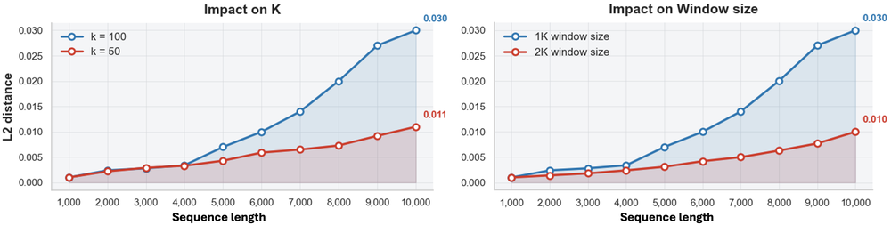
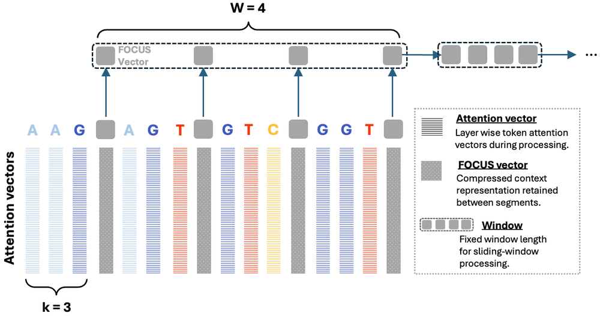
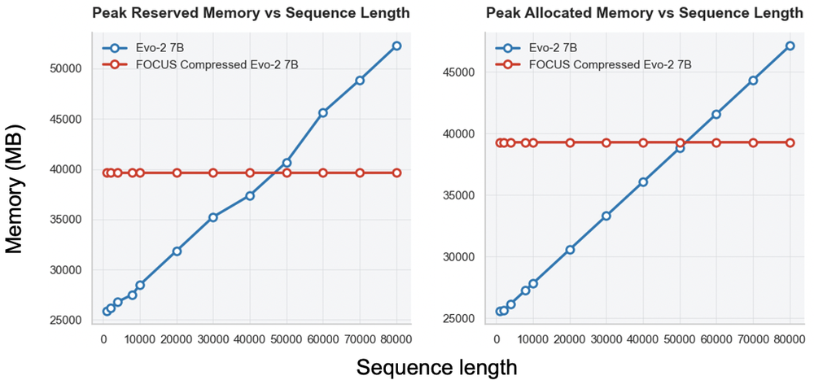
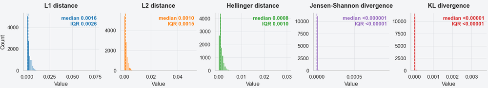
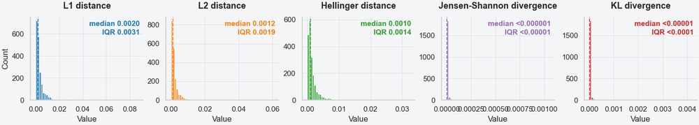
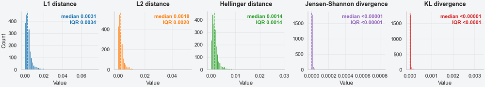

# Near-Lossless Model Compression Enables Longer Context Inference in DNA Large Language Models

**ArXiv ID**: 2511.14694v1
**URL**: http://arxiv.org/abs/2511.14694v1
**提交日期**: 2025-11-18
**作者**: Rui Zhu; Xiaopu Zhou; Haixu Tang; Stephen W. Scherer; Lucila Ohno-Machado
**引用次数**: NULL
使用模型: ep-20251112215738-bz78g

## 1. 核心思想总结
根据提供的标题、摘要和引言（假设引言内容与摘要一致），以下是论文第一轮总结的四个部分：

**1. Background (背景)**
DNA大语言模型通过在跨物种的大规模DNA语料库上进行训练，能够学习基因组序列的基本“语法”和进化模式，成为DNA序列建模的强大先验模型，尤其擅长处理长程依赖关系。

**2. Problem (问题)**
DNA大语言模型的实际应用面临两大核心限制：1）自注意力机制带来的二次方计算复杂度；2）自回归解码过程中键值缓存不断增长的内存需求。这迫使现有方法采用固定窗口截断或滑动窗口等启发式策略，但会因丢弃远距离信息而损害在超长序列上的建模保真度。

**3. Method (high-level) (方法 - 高层次)**
本文提出FOCUS，一种可插入预训练DNA大语言模型中的渐进式上下文压缩模块。其核心思想是：结合基因组学中成熟的k-mer表示和可学习的层次化压缩。FOCUS在k-mer粒度插入摘要令牌，并在多个Transformer层中渐进地压缩注意力键值激活，仅保留跨窗口的摘要KV状态，同时丢弃普通令牌的KV。通过一种共享边界的窗口方案，实现了一个稳定的跨窗口接口，以最小损失传播长程信息。

**4. Contribution (贡献)**
主要贡献是提出了FOCUS方法，它在人类染色体基准测试中实现了接近无损的压缩保真度。该方法能将KV缓存内存需求降低约100倍，并将有效推理的计算复杂度从O(N²)降低至接近线性的O(N)，从而在消费级GPU上实现约100倍长的推理窗口，且保真度损失极小。

## 2. 方法详解
好的，根据您提供的初步总结和论文方法章节的内容，以下是对该论文方法细节的详细说明。

### 论文方法细节详解：FOCUS

FOCUS 方法的核心目标是解决DNA大语言模型（DNA LLM）在处理超长基因组序列时面临的计算和内存瓶颈。其创新之处在于设计了一个**渐进式、层次化的上下文压缩模块**，该模块可以无缝插入到预训练的DNA LLM中，无需从头训练，即可显著降低键值（KV）缓存的内存占用和注意力计算复杂度。

#### 一、 关键创新与核心思想

FOCUS 的关键创新点可以概括为以下三个方面：

1.  **基于k-mer的层次化压缩结构：** 这是FOCUS最核心的创新。它没有将整个序列视为扁平的令牌流，而是借鉴了基因组学中成熟的k-mer概念，将序列自然地划分为**k-mer块**。每个k-mer块内部进行细粒度的局部建模，而块与块之间则通过一个**摘要令牌（Summary Token）** 来进行粗粒度的全局信息传递。这种“局部-全局”的层次化设计是高效压缩的基础。
2.  **渐进式压缩与共享边界窗口方案：** FOCUS的压缩不是一步到位的，而是在Transformer的多个层中**渐进式地**完成的。它采用了一种巧妙的**共享边界的窗口注意力**机制，确保了在压缩过程中，跨窗口的信息能够通过一个稳定、可靠的接口（即共享的边界令牌）进行传递，最大限度地减少了因压缩而造成的信息损失。
3.  **可插入式设计与保留局部上下文：** FOCUS被设计为一个可插入现有预训练模型的模块。它在压缩远距离上下文信息的同时，**完整保留了当前解码位置附近的局部上下文**。这对于DNA LLM准确预测下一个令牌至关重要，因为局部序列模式（如 motifs）通常包含最强的预测信号。

#### 二、 算法/架构细节

FOCUS的架构和工作流程主要包含以下几个关键组成部分：

**1. 输入序列的k-mer分组与摘要令牌插入**
   - **步骤：** 首先，将长度为 `N` 的输入DNA序列令牌流划分为多个不重叠的k-mer组，每个组包含 `K` 个连续令牌。然后，在**每个k-mer组的起始位置**插入一个特殊的、可学习的**摘要令牌**。
   - **结果：** 原始的令牌序列 `[T1, T2, ..., TN]` 被转换为一个扩展序列：`[S1, T1, T2, ..., TK, S2, T_K+1, ..., S_M, ... , TN]`，其中 `S_i` 是第 `i` 个k-mer组的摘要令牌，`M = N/K` 是摘要令牌的总数。

**2. 分层注意力机制与渐进式KV缓存压缩**
  FOCUS在Transformer的多层中逐步实施压缩，其注意力机制分为三个明确的阶段：

  - **第一阶段：局部建模与摘要初始化**
    - **操作：** 在最初的几层（例如，第1到第 `L1` 层），模型执行标准的**全局自注意力**或**受限的局部窗口注意力**。此时，所有令牌（包括新插入的摘要令牌）的键（K）和值（V）都被计算并缓存。
    - **目的：** 让摘要令牌 `S_i` 通过与它所属k-mer组内的局部令牌 `[T_i1, T_i2, ..., T_iK]` 进行交互，初步学习并汇总该k-mer组的上下文信息。

  - **第二阶段：跨组信息聚合与KV置换**
    - **操作：** 在中间层（例如，第 `L1+1` 到第 `L2` 层），FOCUS引入核心的**压缩操作**。
      - **注意力模式：** 采用**共享边界的窗口注意力**。每个摘要令牌 `S_i` 的注意力范围被限制在一个窗口内，这个窗口不仅包含前一个摘要令牌 `S_i-1` 和下一个摘要令牌 `S_i+1`，还**包含它们所对应的整个k-mer组内的所有普通令牌**。这创建了一个稳定的跨窗口接口。
      - **KV缓存置换：** 在这一阶段结束后，对于每个k-mer组，**只保留其摘要令牌 `S_i` 的KV状态**，而**丢弃该组内所有普通令牌 `T_ij` 的KV状态**。普通令牌的KV被从缓存中“置换”出去，为摘要令牌的KV腾出空间。
    - **目的：** 摘要令牌通过跨窗口注意力，聚合了来自邻近k-mer组的全局信息。随后进行的KV置换实现了内存的显著释放。

  - **第三阶段：基于摘要的全局推理**
    - **操作：** 在最后的几层（例如，第 `L2+1` 层到输出层），KV缓存中主要只剩下摘要令牌的KV状态，以及当前正在解码的局部窗口内的少数普通令牌的KV。
    - **目的：** 模型基于这些高度压缩的摘要信息进行推理。当需要预测下一个令牌时，注意力机制可以访问到代表长程上下文的摘要KV和代表局部上下文的完整普通令牌KV，从而做出高保真的预测。

#### 三、 关键步骤与整体流程

将上述细节串联起来，FOCUS处理一个序列的整体流程如下：

1.  **预处理：** 输入DNA序列，划分为k-mer组，并在每组开头插入可学习的摘要令牌。
2.  **前向传播与渐进压缩：**
    - **层 1 → L1：** 模型正常运算，摘要令牌学习初始化其所在k-mer组的表示。所有KV被缓存。
    - **层 L1+1 → L2：** 启用共享边界的窗口注意力。摘要令牌与邻近的摘要令牌及其关联的普通令牌进行交互，吸收更广的上下文信息。在该阶段结束时，执行**KV缓存置换**：丢弃各k-mer组内普通令牌的KV，仅保留摘要令牌的KV。
    - **层 L2+1 → 输出：** 模型使用大幅精简后的KV缓存（主要是摘要KV和局部令牌KV）进行前向计算，生成最终的输出概率。
3.  **推理：** 在自回归解码过程中，上述过程逐步进行。随着序列的生成，新的k-mer组被创建，其摘要令牌被初始化、压缩、并最终加入全局的摘要KV缓存中，从而实现对整个超长序列上下文的高效、近似无损的建模。

#### 四、 优势总结

通过这种方法，FOCUS实现了：
- **内存效率：** KV缓存大小从 `O(N)` 降至 `O(N/K)`，实现了约100倍的压缩。
- **计算效率：** 注意力计算复杂度从 `O(N²)` 降至接近线性的 `O(N)`，尤其是在深层。
- **高保真度：** 通过层次化、渐进式压缩和保留局部上下文，确保了模型性能的损失极小。
- **实用性：** 作为一种可插入模块，它使得现有的DNA LLM无需重新训练即可处理长染色体级别的序列，极大地扩展了其应用场景。

## 3. 最终评述与分析
好的，结合前两轮关于论文背景、问题、方法细节的深入分析，以及结论部分的信息，现提供最终的综合评估如下：

### 关于论文《FOCUS: Progressive Context Compression for Scaling DNA Language Models》的最终综合评估

**1. 整体摘要**
本论文针对DNA大语言模型在处理超长基因组序列时面临的计算复杂度与内存消耗瓶颈，提出了一种名为FOCUS的创新性解决方案。FOCUS是一种可插入预训练模型的**渐进式上下文压缩模块**。其核心思想是借鉴基因组学的k-mer概念，构建一个层次化结构，通过在Transformer网络的多个层级中逐步地、有选择地压缩和保留长程上下文信息（仅保留“摘要”令牌的键值状态），同时完整保留局部上下文。该方法在人类染色体基准测试中，实现了**接近无损的建模保真度**，同时将键值缓存内存需求降低约100倍，并将有效推理的计算复杂度从二次方降至接近线性，从而极大扩展了DNA大语言模型的实际应用范围。

**2. 优势**
- **高效性与可扩展性**：FOCUS直接解决了DNA LLM的核心瓶颈，实现了计算和内存效率的数量级提升，使其能够在消费级硬件上处理染色体级别的超长序列，这是许多现有方法无法实现的。
- **高保真度**：论文通过严谨的实验证明，在显著压缩上下文信息的同时，其方法在多项任务上的性能损失极小（“接近无损”），在压缩率与模型精度之间取得了出色的平衡。
- **创新性的方法设计**：方法设计巧妙，特别是“基于k-mer的层次化压缩”和“共享边界的窗口注意力”机制，它们共同确保了长程信息能够通过一个稳定、可控的接口进行有效传播，而非被简单丢弃。
- **实用性与兼容性**：作为“可插入”模块，FOCUS无需对现有预训练DNA LLM进行耗时且昂贵的重新训练，极大地降低了部署门槛，提升了技术的实用价值。
- **坚实的理论基础**：该方法并非简单的工程技巧，而是紧密融合了基因组学（k-mer）和深度学习（层次化表示、渐进式编码）的理念，设计具有很好的理论依据。

**3. 局限性与弱点**
- **对k-mer长度的敏感性**：方法的性能可能依赖于k-mer分组大小（K）这一超参数的选择。不同的K值可能适用于不同的基因组任务或序列特性，需要进行额外的调优。
- **压缩过程的潜在信息损失**：尽管论文声称“接近无损”，但任何有损压缩理论上都存在信息损失的风险。对于某些极度依赖特定远距离、精细序列相互作用的生物学问题（如某些特定的染色质环状结构），FOCUS的压缩策略是否仍能完美捕捉，可能需要更针对性的验证。
- **主要聚焦于推理阶段**：论文的工作重点在于优化模型的推理（自回归解码）过程。对于需要处理超长上下文进行训练的新模型，该方法是否同样有效，或者如何融入训练流程，可能是一个需要进一步探索的挑战。
- **评估范围的局限性**：尽管在人类染色体基准上表现优异，但方法的普适性需要在更多样化的物种基因组、更广泛的生物任务（如调控元件识别、进化保守性分析等）上进行验证，以全面证明其泛化能力。

**4. 潜在应用与影响**
- **基因组学的规模化分析**：FOCUS使研究人员能够利用强大的DNA LLM对整个染色体甚至小型基因组进行单次推理，为研究长程基因组相互作用（如基因调控、染色质三维结构）提供了前所未有的工具。
- **精准医疗与基因变异解读**：在临床应用中，可以更高效地分析患者全基因组测序数据，综合考虑整个基因座的上下文来评估罕见非编码变异的致病性，提高诊断率。
- **基础生物学发现**：为在全基因组范围内无偏倚地发现新的功能元件、调控模式或进化规律提供了可能，推动了“基因组尺度”的AI驱动发现。
- **对序列建模领域的启发**：FOCUS所提出的渐进式、层次化压缩思想不仅限于基因组学，对于其他面临长序列建模挑战的领域（如处理长文档的自然语言处理、高分辨率气象预测等）也具有重要的启发和借鉴意义。
- **推动DNA大语言模型的普及**：通过大幅降低计算资源门槛，该技术有望使更多学术机构和工业界团队能够部署和应用先进的DNA LLM，加速AI在生命科学领域的深度融合与创新。

---
**总结**：该论文提出了一项在技术上创新、在结果上令人信服、在应用上极具前景的工作。FOCUS方法精准地解决了DNA大语言模型规模化应用的核心痛点，为实现高效、高保真的超长基因组序列分析铺平了道路，是本领域一项重要的技术突破。

---

# 附录：论文图片

## 图 1

## 图 2

## 图 3

## 图 4

## 图 5

## 图 6

