# Nonlinear Coherence for Vector Time Series: Defining Region-to-Region Functional Brain Connectivity

**ArXiv ID**: 2511.14417v1
**URL**: http://arxiv.org/abs/2511.14417v1
**提交日期**: 2025-11-18
**作者**: Paolo Victor Redondo; Raphaël Huser; Hernando Ombao
**引用次数**: NULL
使用模型: ep-20251112215738-bz78g

## 1. 核心思想总结
**第一轮总结**

**标题：** 非线性向量相干性：定义脑区到脑区的功能连接

**1. Background (背景)**
功能脑连接的改变是阿尔茨海默病（AD）和额颞叶痴呆（FTD）等神经退行性疾病的特征。脑电图（EEG）作为一种非侵入性且成本低廉的技术，因其在AD和FTD的早期检测和鉴别诊断中识别可靠生物标志物的潜力而受到越来越多的关注。

**2. Problem (问题)**
传统的功能连接分析方法多基于“通道到通道”的线性相干性，存在局限性。它无法充分捕捉不同脑区之间振荡活动的非线性相互作用，并且由于忽略了相邻EEG通道信号的相似性，未能提供一个更符合生理基础的“脑区到脑区”的连接分析框架。

**3. Method (high-level) (方法 - 高层次)**
本文提出了一种新的频谱依赖性度量方法——**非线性向量相干性（NVC）**。该方法将每个脑区视为一个整体，通过分析来自不同脑区的两个多元（多通道）时间序列，来捕捉它们之间超越线性的相互作用。此外，论文还引入了一种基于秩的推断方法，用于快速、无分布假设地估计NVC，并提供了一个完全非参数化的频谱独立性检验方法。

**4. Contribution (贡献)**
*   **方法论贡献：** 提出了NVC度量，定义了频域中更自然的“脑区到脑区”功能连接分析新框架，能够揭示非线性相互作用。
*   **推断工具贡献：** 开发了配套的快速、无分布假设的统计推断流程。
*   **应用价值：** 实证研究表明，应用该方法的静息态EEG数据分析能够揭示具有鉴别诊断意义的独特连接模式，有效区分健康个体、AD患者和FTD患者。

## 2. 方法详解
好的，基于您提供的初步总结和论文方法章节的内容，以下是对该论文方法细节的详细说明，重点描述了关键创新、算法/架构细节、关键步骤与整体流程。

### 论文方法细节详细说明

#### 一、 核心问题与关键创新

**1. 核心问题：**
传统EEG功能连接分析（如线性相干性）存在两大缺陷：
*   **线性局限：** 仅能捕捉脑区之间基于线性的相位同步，无法有效揭示更复杂的非线性耦合机制。
*   **空间模糊：** 基于“通道到通道”的分析，忽略了同一脑区内多个电极信号的固有空间相关性，导致连接定义不符合神经生理学的“脑区”概念，且结果易受参考电极选择和容积传导效应的影响。

**2. 关键创新：**
本论文的核心创新是提出了 **“非线性向量相干性”（Nonlinear Vector Coherence, NVC）** 这一全新的度量方法及其统计推断框架。
*   **创新点1（度量创新）：** 将分析单元从**单变量时间序列（通道）** 提升为**多元（向量值）时间序列（脑区）**。每个脑区由其覆盖的多个EEG通道信号共同表示，从而实现了真正意义上的“脑区到脑区”的功能连接分析。
*   **创新点2（模型创新）：** 采用**向量自回归（Vector Autoregression, VAR）模型**来拟合每个脑区的多元信号。VAR模型能够捕捉脑区内各通道之间以及时间点之间的线性依赖关系。
*   **创新点3（非线性捕捉）：** 关键的创新在于，NVC不是直接分析原始EEG信号，而是分析VAR模型的**残差（或创新）序列**。理论表明，如果两个脑区之间存在未被VAR模型描述的、非线性的相互作用，那么这两个脑区的残差序列将是相互依赖的。因此，通过检验残差序列的独立性，即可间接而有效地捕捉脑区间的非线性连接。
*   **创新点4（推断创新）：** 配套提出了一个**完全非参数化、基于秩的统计推断流程**，用于计算NVC的显著性，该方法不依赖于残差分布的具体形式，稳健性强。

#### 二、 算法/架构细节与关键步骤

整个NVC方法的流程可以清晰地分为四个主要阶段，其架构如下图所示：

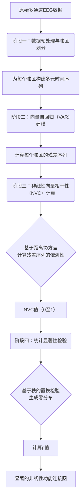

**阶段一：数据预处理与脑区划分**

1.  **数据预处理：** 对原始EEG数据进行标准预处理，包括滤波、去噪、剔除伪影等，得到干净的、多通道的EEG时间序列。
2.  **脑区定义：** 根据先验的脑图谱（如AAL图谱），将头皮电极分配给特定的脑区（例如，左侧前额叶、右侧顶叶等）。一个脑区可能包含一个或多个EEG电极。至此，每个脑区的数据被表示为一个多元时间序列 \(X_t \in \mathbb{R}^p\)，其中 \(p\) 是该脑区的通道数。

**阶段二：向量自回归建模与残差提取**

1.  **VAR模型拟合：** 为每个脑区各自的多元时间序列 \(X_t\) 拟合一个独立的VAR模型。一个阶数为 \(L\) 的VAR模型表示为：
    \( X_t = \sum_{l=1}^{L} \Phi_l X_{t-l} + \epsilon_t \)
    其中，\(\Phi_l\) 是系数矩阵，\(\epsilon_t\) 是残差向量，代表了模型无法解释的部分（即排除了脑区内线性自相关后的“新息”）。

2.  **残差序列获取：** 完成模型拟合后，得到每个时间点 \(t\) 的残差向量 \(\epsilon_t\)。对于两个待研究的脑区 \(A\) 和 \(B\)，我们得到了它们的残差序列 \(\{\epsilon_t^A\}\) 和 \(\{\epsilon_t^B\}\)。

**阶段三：非线性向量相干性计算**

1.  **核心思想：** 检验脑区 \(A\) 和 \(B\) 的残差序列 \(\{\epsilon_t^A\}\) 和 \(\{\epsilon_t^B\}\) 在频域上是否独立。如果它们不独立，则表明两脑区之间存在超越VAR模型（即超越线性）的相互作用。
2.  **频域变换：** 对每个脑区的残差序列进行傅里叶变换，得到频域表示 \(E^A(\lambda)\) 和 \(E^B(\lambda)\)，其中 \(\lambda\) 是频率。
3.  **应用距离协方差：** 论文采用**距离协方差（Distance Covariance, DCOV）** 的频域版本来量化两个复值向量序列 \(E^A(\lambda)\) 和 \(E^B(\lambda)\) 之间的依赖性。DCOV的关键优势在于它能捕捉任何形式的依赖性（线性或非线性），而不仅仅是相关性。
4.  **标准化与NVC值：** 将计算出的距离协方差进行标准化，得到**非线性向量相干性（NVC）** 值：
    \( \text{NVC}_{A,B}(\lambda) = \frac{\text{dCov}(E^A(\lambda), E^B(\lambda))}{\sqrt{\text{dVar}(E^A(\lambda)) \cdot \text{dVar}(E^B(\lambda))}} \)
    NVC值介于0和1之间。值为0表示两个脑区的残差在频率 \(\lambda\) 上完全独立（即无显著非线性连接）；值越大表示非线性功能连接越强。

**阶段四：统计显著性检验（基于秩的置换检验）**

1.  **零假设：** 脑区 \(A\) 和 \(B\) 的残差序列在频率 \(\lambda\) 上独立。
2.  **生成零分布：**
    *   为了摆脱对数据分布的假设，论文采用**置换检验**。具体做法是：随机打乱两个残差序列其中一个的时间点顺序（例如，打乱 \(\{\epsilon_t^B\}\) 的时间标签），从而破坏它们之间任何潜在的依赖性，但保留各自的边际分布。
    *   基于打乱后的数据，重复阶段三的计算，得到一个在零假设下的NVC值。
    *   将此置换过程重复大量次数（如1000次），生成一个零假设下的NVC值分布（零分布）。
3.  **计算p值：** 将实际观测到的NVC值与零分布进行比较。p值定义为零分布中大于或等于实际观测值的比例。
4.  **显著性判断：** 经过多重比较校正后，如果p值小于显著性水平（如0.05），则拒绝零假设，认为两个脑区在该频率上存在显著的非线性向量相干性。

#### 三、 整体流程总结

该论文的方法流程是一个严谨的、层层递进的管道：

1.  **从“信号”到“脑区”：** 通过脑区划分，将通道空间映射到生理意义的脑区空间。
2.  **从“线性”到“非线性”：** 利用VAR模型作为“线性过滤器”，提取残差，将分析目标从原始信号中蕴含的混合依赖关系，聚焦于残差中纯净的**非线性依赖关系**。
3.  **从“时域”到“频域”：** 在残差的基础上进行频域分析，得以考察不同振荡频率（如θ, α, β波）上的非线性连接。
4.  **从“度量”到“推断”：** 通过稳健的非参数统计检验，确保发现的连接模式不是由随机噪声引起的，从而得到统计上显著的功能连接网络。

综上所述，该方法通过巧妙的模型设计（VAR+残差分析）和先进的依赖度量（频域距离协方差），并结合严谨的统计推断，成功地定义并量化了一种新颖的、更符合生理的“脑区到脑区”非线性功能连接，为神经科学研究和临床诊断提供了强大的新工具。

## 3. 最终评述与分析
根据您提供的论文初步总结、方法详述以及结论部分，现对该研究进行最终的综合评估如下：

### 最终综合评估

**1. 整体总结**
本研究针对当前脑电图功能连接分析中的核心局限——即传统线性、通道级方法无法有效捕捉脑区间的非线性相互作用且空间特异性不足——提出了一个创新的解决方案。论文引入了一种名为**非线性向量相干性（NVC）** 的全新度量方法及其完整的统计推断框架。该方法通过将每个脑区视为一个多元（向量值）实体，先利用向量自回归（VAR）模型滤除脑区内线性自相关，再基于残差序列的频域距离协方差来量化脑区间的非线性依赖关系。实证研究证实，NVC能够从静息态脑电图数据中提取出具有高度鉴别力的连接模式，成功区分了健康对照组、阿尔茨海默病（AD）患者和额颞叶痴呆（FTD）患者。这项工作标志着在构建更符合神经生理学基础的功能连接分析工具方面取得了重要进展。

**2. 优势**
*   **理论创新性强：** NVC的核心思想（VAR滤波 + 残差非线性分析）非常巧妙，将复杂的“脑区间非线性连接”问题转化为更易处理的“残差序列独立性检验”问题，在方法论上具有显著的原创性。
*   **生理意义明确：** 真正实现了从“通道到通道”到“脑区到脑区”的范式转变，其分析单元更贴近大脑的实际功能组织方式，有助于减少容积传导效应和参考电极选择带来的干扰，提高了结果的可解释性。
*   **技术稳健全面：** 提出的方法框架完整且严谨。它不仅定义了新的度量，还配套开发了完全非参数化、基于秩的置换检验进行统计推断，该方案不依赖于特定的数据分布假设，增强了方法的普适性和稳健性。
*   **应用价值突出：** 实证结果极具说服力，表明NVC在识别神经退行性疾病特异的生物标志物方面潜力巨大，为AD和FTD的早期鉴别诊断提供了新的、强有力的计算工具。

**3. 局限性与未来方向**
*   **计算复杂度：** 与传统的双变量线性方法相比，NVC涉及为每个脑区拟合VAR模型以及大量的置换检验，计算成本显著更高，这可能限制其对大规模数据集或高密度脑电图设备的实时或准实时分析能力。
*   **模型依赖性与假设：** NVC的有效性在一定程度上依赖于VAR模型能否充分捕捉脑区内的线性动态。如果VAR模型设定不当（如阶数选择不准确），可能会影响残差的质量，进而对NVC的估计产生偏差。
*   **参数选择：** 方法中包含一些需要预先设定的参数，如VAR模型的阶数（L）和置换检验的次数。这些参数的选择可能需要依赖经验或通过额外的计算来确定，其敏感性需进一步评估。
*   **泛化能力待验证：** 尽管在AD和FTD的鉴别中表现出色，但NVC方法在其他神经系统疾病（如癫痫、精神分裂症）或不同认知任务状态下的普适性和有效性仍需在未来研究中广泛验证。
*   **脑区划分的先验性：** 方法依赖于先验的脑图谱进行脑区划分，这可能会引入偏差。不同分区方案对结果的影响有待探索。

**4. 潜在应用与启示**
*   **临床诊断与鉴别：** NVC最主要的应用前景在于作为辅助诊断工具，特别是在症状相似的神经退行性疾病（如AD与FTD）的早期鉴别中，提供客观的、量化的电生理生物标志物。
*   **疾病机制探索：** 通过揭示不同疾病状态下特异的非线性功能连接模式，NVC有助于神经科学家更深入地理解AD、FTD等疾病的病理生理机制，特别是与大脑网络水平功能障碍相关的机制。
*   **治疗监测与疗效评估：** 该方法可用于追踪疾病进展或评估药物、非药物干预（如神经反馈、经颅磁刺激）对大脑网络功能的影响，为个性化治疗提供依据。
*   **认知神经科学研究：** 超越临床领域，NVC为研究健康大脑在执行各种认知任务时，其大规模脑网络之间如何通过非线性相互作用支持复杂认知功能，提供了一个强大的新工具。
*   **推动方法学发展：** 本研究所提出的“先线性滤波，后非线性分析”的范式，对神经信号分析乃至其他领域的多元时间序列依赖性分析都具有重要的启发和借鉴意义。

---
**结论：**
该论文是一项高质量的研究，其在方法学上的创新性、技术上的严谨性以及应用上的巨大潜力均十分突出。尽管存在计算复杂度和模型依赖性等挑战，但其成功地将功能连接分析推向了一个新的水平，为神经科学和临床神经病学的研究与实践提供了极具价值的新视角和新工具。未来的工作重点应放在优化计算效率、验证泛化能力以及探索更广泛的应用场景上。

---

# 附录：论文图片

## 图 1
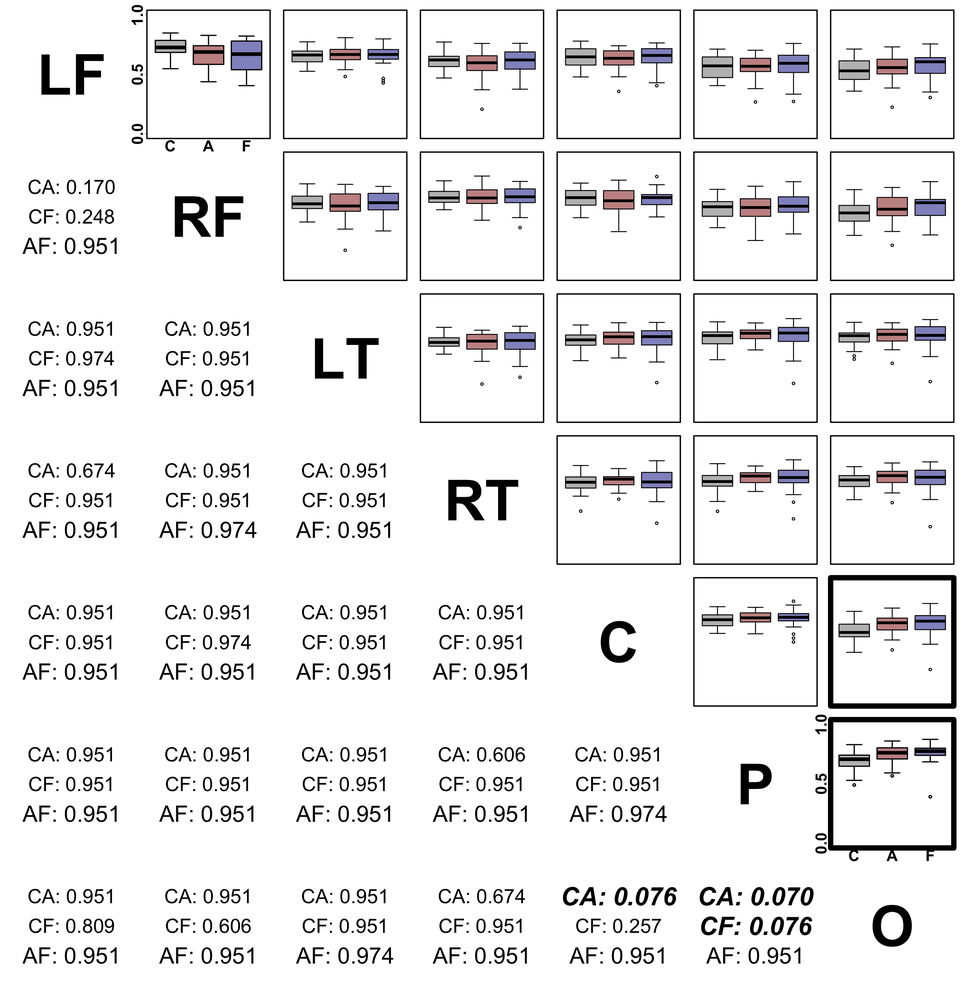

## 图 2
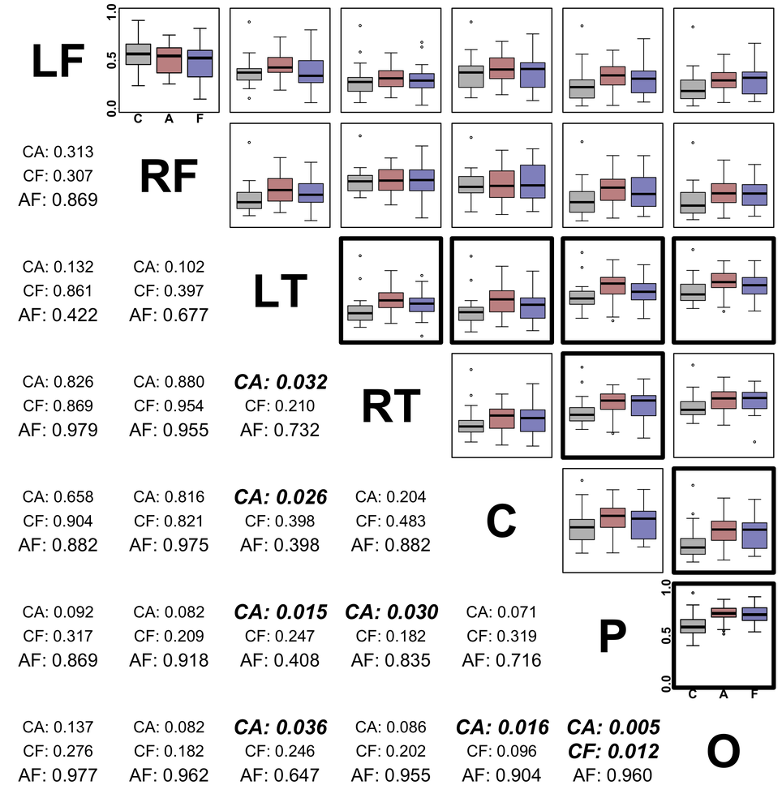

## 图 3
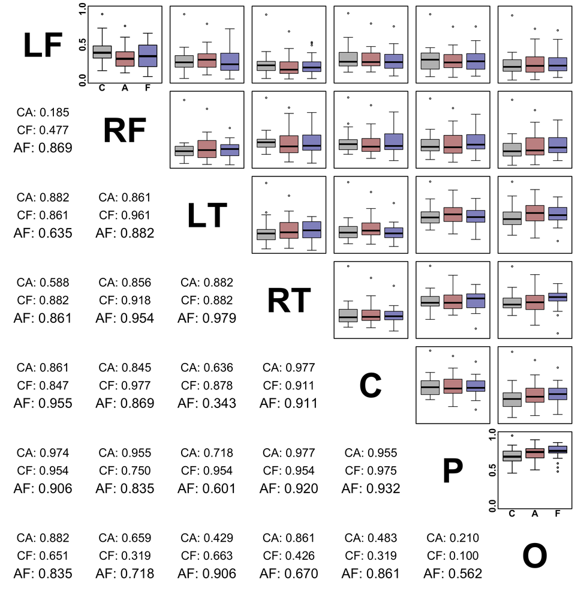

## 图 4
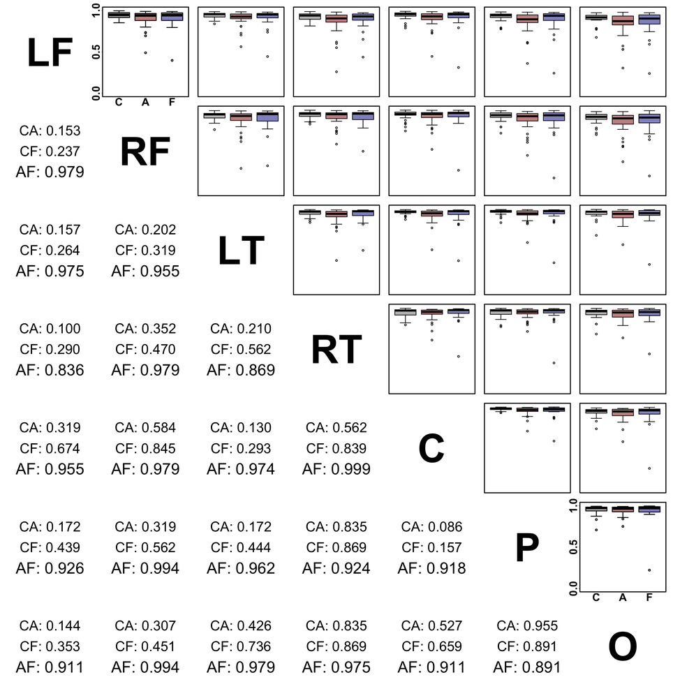

## 图 5
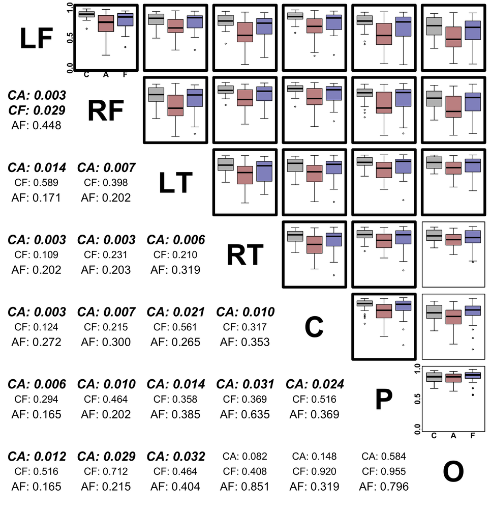

## 图 6
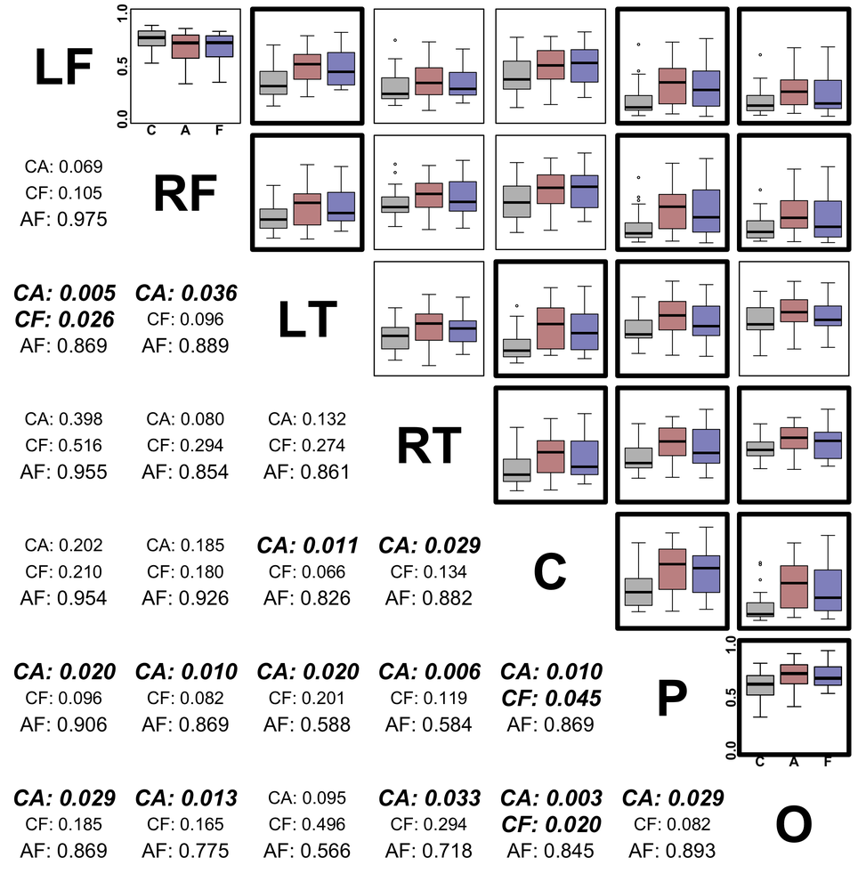

## 图 7
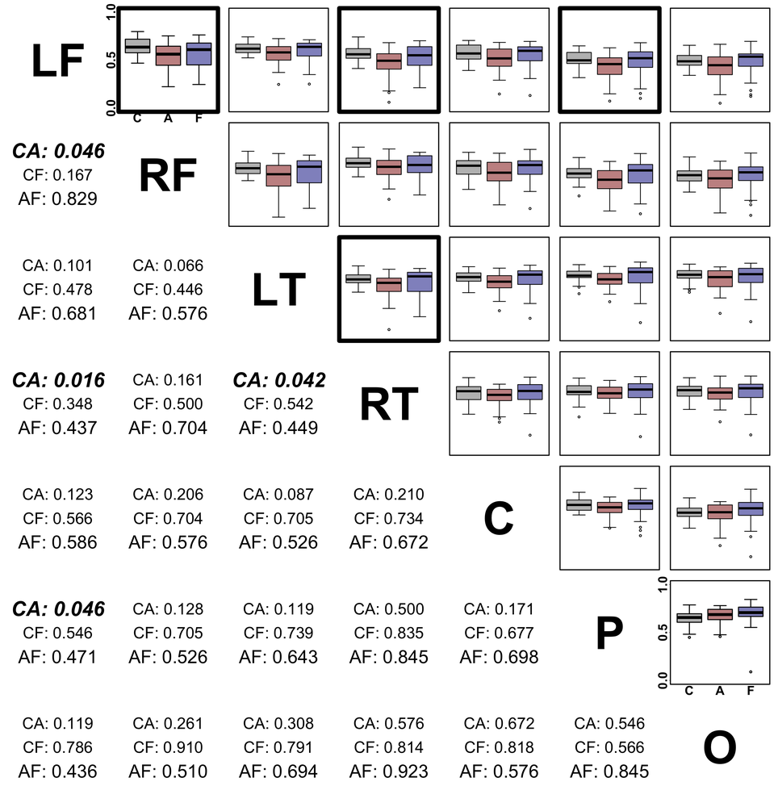

## 图 8
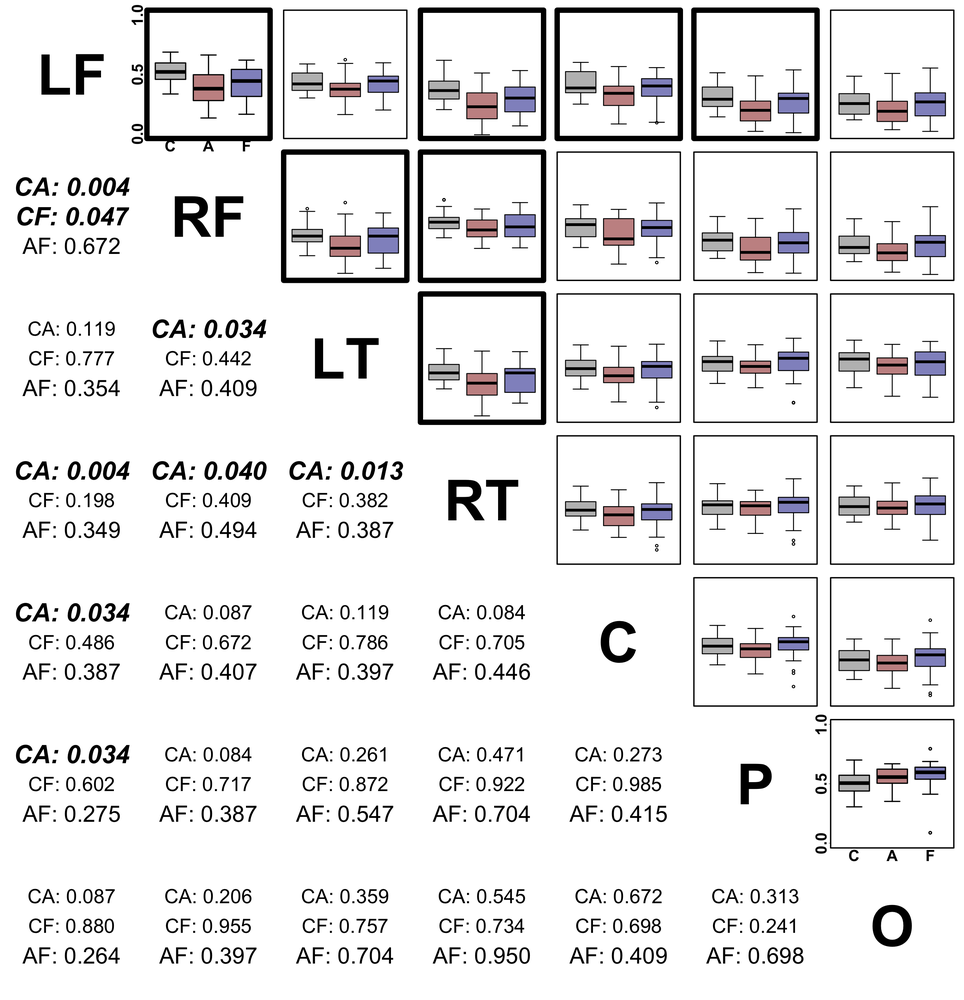

## 图 9
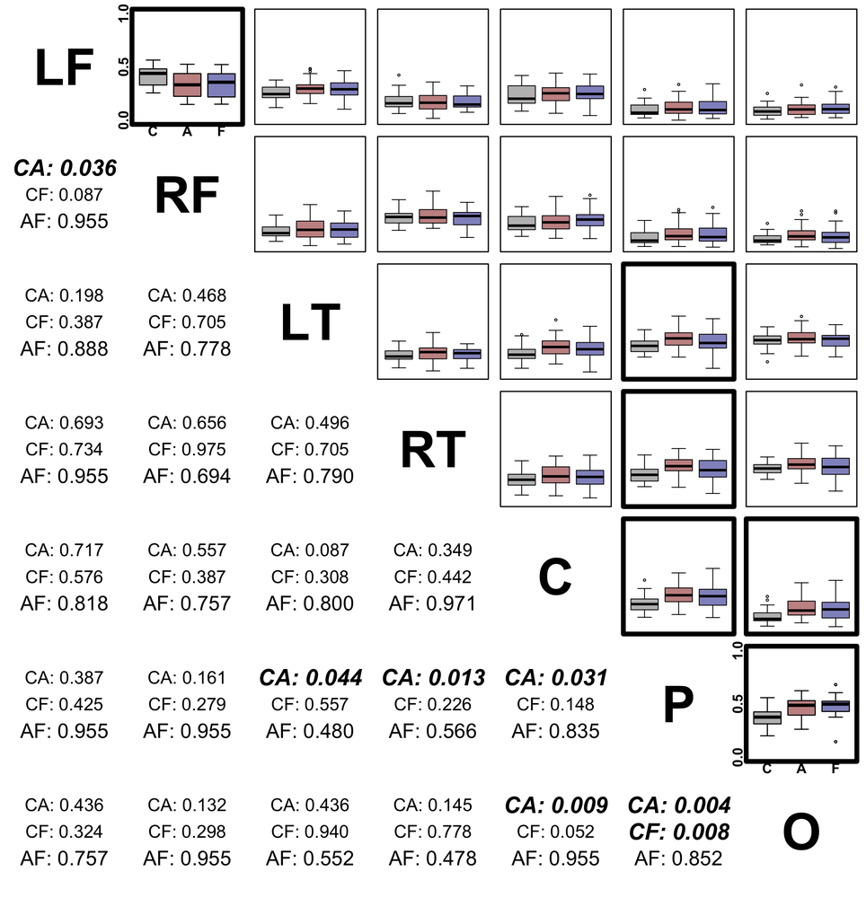

## 图 10
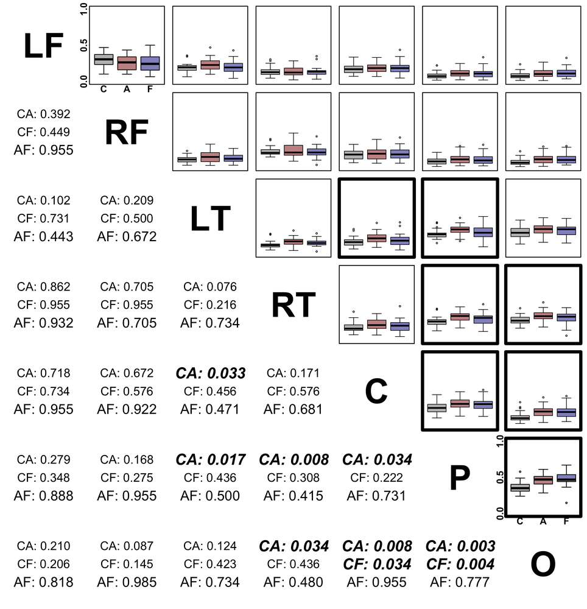

