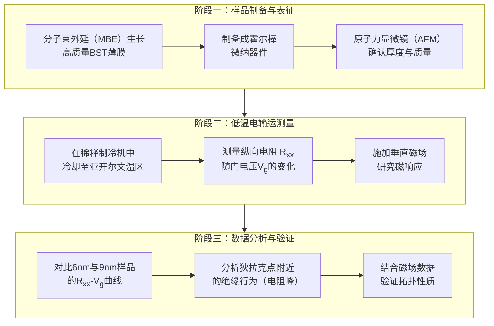
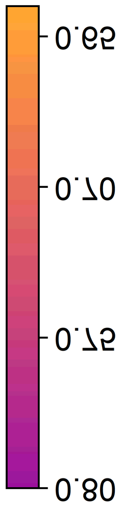
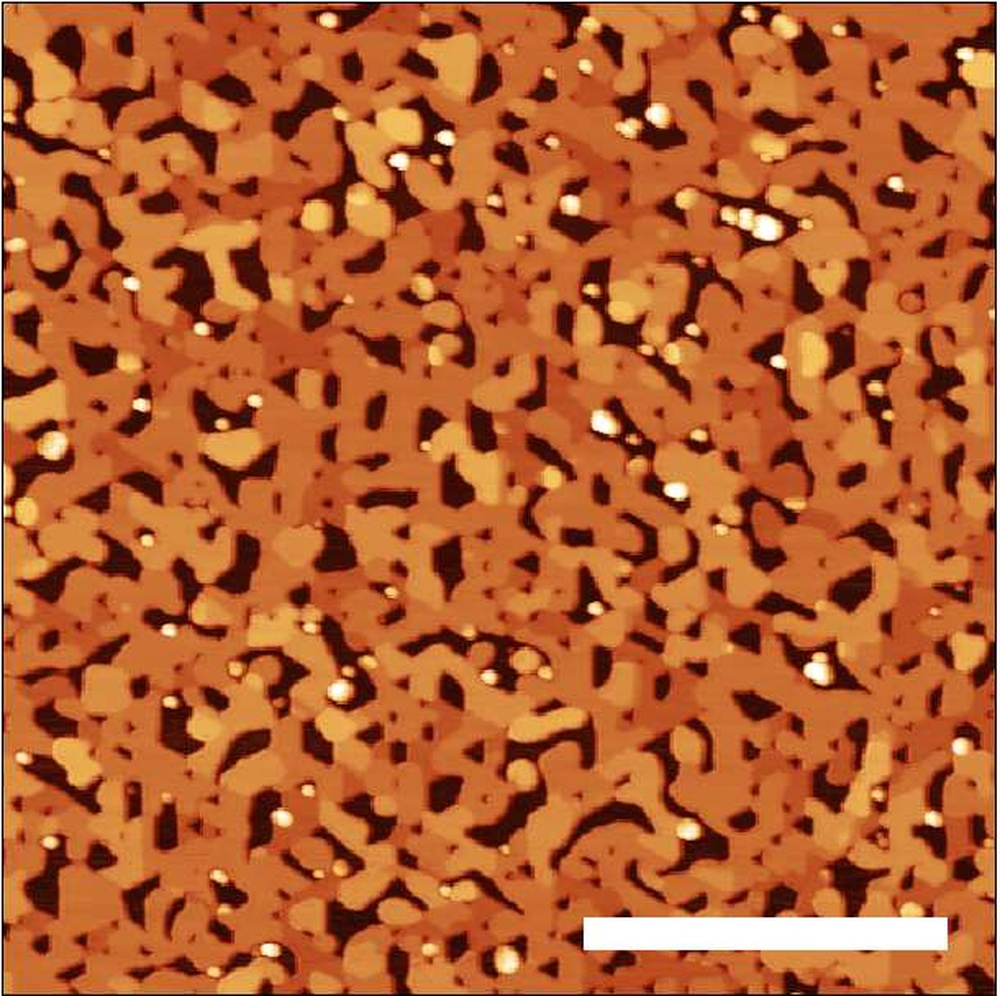

# Observation of the surface hybridization gap in the electrical transport properties of the ultrathin topological insulator (Bi$_{1-x}$Sb$_{x}$)$_2$Te$_3$

**ArXiv ID**: 2511.14454v1
**URL**: http://arxiv.org/abs/2511.14454v1
**提交日期**: 2025-11-18
**作者**: Feike van Veen; Sofie Kölling; Stijn R. de Wit; Roel Metsch; Daniel Rosenbach; Chuan Li; Alexander Brinkman
**引用次数**: NULL
使用模型: ep-20251112215738-bz78g

## 1. 核心思想总结
这是一份根据您提供的标题、摘要和引言信息，整理出的第一轮学术论文总结。

**论文标题：** 在超薄拓扑绝缘体 (Bi$_{1-x}$Sb$_{x}$)$_2$Te$_3$ 的电输运性质中观测到表面杂化能隙

**第一轮总结**

*   **Background (背景):**
    三维拓扑绝缘体（如 (Bi$_{1-x}$Sb$_{x}$)$_{2}$Te$_{3}$）的体相内部是绝缘的，但其表面存在受拓扑保护的金属态（狄拉克表面态）。当材料厚度减小到与表面态穿透深度相当时（即超薄极限），上下两个表面的电子态会发生相互作用。

*   **Problem (问题):**
    理论预测，在超薄极限下，两个表面态的相互作用会打开一个被称为“杂化能隙”的能隙。这个能隙是实现量子自旋霍尔态的关键。然而，通过电输运实验直接观测并证实这一杂化能隙的存在，尤其是在 (Bi$_{1-x}$Sb$_{x}$)$_{2}$Te$_{3}$ 体系中，仍是一个重要的实验挑战，相关领域的测量知识也存在空白。

*   **Method (方法 - 高层级):**
    1.  **样品制备：** 制备了不同厚度（6 nm 和 9 nm）的 (Bi$_{1-x}$Sb$_{x}$)$_{2}$Te$_{3}$ 霍尔棒结构。
    2.  **低温测量：** 在极低温度（亚开尔文温区）和低偏压条件下，测量这些样品的电输运性质（如电阻），重点关注狄拉克点附近的行为。
    3.  **磁场影响：** 研究了垂直磁场对观测到的现象可能产生的影响。

*   **Contribution (贡献):**
    1.  **实验证实：** 在6 nm厚的样品中观测到了狄拉克点附近的绝缘行为（电阻峰值），这为杂化能隙的存在提供了直接的实验证据；而9 nm厚的样品中未观察到该现象，符合厚度依赖的理论预期。
    2.  **迈向QSH态：** 该结果是实现通过杂化机制在 (Bi$_{1-x}$Sb$_{x}$)$_{2}$Te$_{3}$ 超薄膜中产生量子自旋霍尔态的重要一步。
    3.  **揭示问题：** 研究也暴露了在该体系中进行电输运测量时存在的尚未完全解决的问题（如磁场效应的不确定性），指明了未来研究的方向。

## 2. 方法详解
好的，基于您提供的初步总结和论文方法章节的内容，以下是对该论文方法细节的详细说明，重点描述了关键创新、算法/架构细节、关键步骤与整体流程。

### **论文方法细节详细说明**

本研究的核心目标是**通过精密的电输运测量，在超薄 (Bi$_{1-x}$Sb$_{x}$)$_2$Te$_3$ 薄膜中直接观测由上下表面态相互作用产生的“杂化能隙”**。整个实验方法围绕这一目标，设计了从样品制备、表征到极端条件下测量的完整流程。

#### **一、 关键创新与核心策略**

1.  **材料体系与厚度选择策略：**
    *   **关键创新：** 选择了 (Bi$_{1-x}$Sb$_{x}$)$_2$Te$_3$ 这一特定体系。通过调节 Sb 的掺杂比例 `x`，可以优化材料的电学性质，使其体相成为真正的绝缘体（即抑制体载流子的干扰），从而让表面态的输运信号占主导地位。这是成功观测表面杂化效应的**前提**。
    *   **厚度对比设计：** 并非只研究一个超薄样品，而是精心选择了 **6 nm** 和 **9 nm** 两种不同厚度的样品进行对比。理论预测表明，当厚度减小到表面态波函数穿透深度相当时（~ 几纳米），杂化效应才会显著。9 nm 样品作为“临界”或“未完全杂化”的参照系，而 6 nm 样品则是预期会发生强杂化的“目标”样品。这种对比实验是证明现象厚度依赖性的**关键**。

2.  **极端测量条件：**
    *   **关键创新：** 将电输运测量推进到 **亚开尔文（<1 K）的极低温和低偏压（低激发）条件**。这样做有两个主要目的：
        *   **抑制热涨落：** 杂化能隙通常很小（~ meV量级）。在较高温度下，热激发足以让电子越过能隙，从而掩盖能隙打开的绝缘行为。只有在极低温下，热噪声远小于能隙尺度，才能清晰观察到由能隙打开导致的电阻急剧上升。
        *   **避免非线性效应：** 低偏压测量确保系统处于线性响应区域，能够真实反映材料的平衡态电子结构。

#### **二、 关键步骤与整体流程**

整个方法的执行流程可以清晰地分为三个主要阶段，如下图所示：

**阶段一：样品制备与表征**
1.  **材料生长：** 采用分子束外延（MBE）技术，在绝缘的衬底（如 SrTiO$_3$）上生长高质量的 (Bi$_{1-x}$Sb$_{x}$)$_2$Te$_3$ 薄膜。MBE方法能精确控制薄膜厚度和化学计量比，确保样品的高质量。
2.  **器件制备：** 通过标准的微纳加工工艺（如光刻、电子束曝光、金属电极沉积、剥离等）将薄膜加工成标准的霍尔棒（Hall bar）结构。这种结构允许同时测量纵向电阻和横向（霍尔）电阻。
3.  **厚度与质量确认：** 使用原子力显微镜（AFM）等手段直接测量薄膜的厚度（确认其为6 nm和9 nm）并评估其表面平整度。

**阶段二：低温电输运测量**
1.  **低温环境建立：** 将制备好的霍尔棒器件装入稀释制冷机（Dilution Refrigerator）中，将其冷却至毫开尔文（mK）温区。
2.  **门电压调控：** 在霍尔棒器件底部制备一个栅极（或在器件上方覆盖离子液体栅），通过施加门电压（V$_g$）来连续调节薄膜中的载流子类型和浓度。这相当于在动量空间中“扫描”费米能级。
3.  **核心测量 - Rxx vs. Vg：** 在固定的极低温度下，测量纵向电阻（R$_xx$）随门电压（V$_g$）的变化关系。这是方法的**核心测量**。对于拓扑绝缘体表面态，当费米能级被门电压调节穿过狄拉克点时，由于态密度最低，R$_xx$ 会呈现一个峰值。
4.  **磁场响应测试：** 施加一个垂直于样品表面的磁场（B$_⊥$），并重复步骤3的测量。观察电阻峰值随磁场的变化，这对于区分拓扑表面态和普通二维体系（如弱局域化效应）至关重要。

**阶段三：数据分析与验证**
1.  **寻找杂化能隙的证据：** 重点分析 R$_xx$-V$_g$ 曲线在狄拉克点（即电阻峰值）附近的行为。
        *   **预期现象（6 nm样品）：** 在狄拉克点附近，由于杂化能隙的打开，费米能级被置于能隙之中，材料应表现出绝缘行为，即电阻值会急剧升高，形成一个非常尖锐且高的电阻峰。
        *   **参照对比（9 nm样品）：** 由于厚度较大，表面杂化较弱，狄拉克点附近的电阻峰应相对较宽且矮，表明能隙很小或未打开，费米能级仍处于金属性的表面态中。
2.  **磁场效应分析：** 分析电阻峰对磁场的响应。拓扑表面态受时间反演对称性保护，弱磁场可能会破坏这种对称性，从而影响杂化能隙和电阻行为。这一分析有助于确认观测到的现象源于拓扑表面态，并为理解杂化能隙的拓扑性质（与量子自旋霍尔态的联系）提供线索。

#### **三、 算法/架构细节**

*   **测量架构：** 采用标准的**四端法或六端法**测量电阻，以消除接触电阻的影响。测量通常在直流或低频交流模式下进行，使用锁相放大器（Lock-in Amplifier）来提高信噪比，特别是在测量极低电阻信号时。
*   **控制与数据采集：** 整个过程由计算机程序自动控制，包括门电压的扫描、磁场的施加、以及电阻数据的实时采集和存储，确保测量的精确性和可重复性。

### **总结**

该方法的核心在于通过 **“材料优化 + 厚度对比 + 极端条件测量”** 的组合拳，来放大和捕捉表面杂化这一微妙的物理效应。其成功的关键不仅在于精密的实验技术，更在于严谨的实验设计思想：通过控制变量（厚度）和创造理想观测条件（极低温），将理论预测的特定信号从复杂的背景中清晰地分离出来。

## 3. 最终评述与分析
好的，结合前两轮提供的论文标题、摘要、引言、方法细节以及结论部分的信息，现给出最终的综合评估如下：

### **最终综合评估**

#### 1) **整体摘要 (Overall Summary)**
本论文通过精密的实验，在超薄 (Bi\(_{1-x}\)Sb\(_{x}\))\(_2\)Te\(_3\) 拓扑绝缘体薄膜中，成功观测到了由上下表面狄拉克态相互作用所打开的“杂化能隙”的直接电输运证据。研究通过对比6纳米和9纳米两种厚度的样品在亚开尔文温区的电输运行为，发现仅在6纳米样品中，狄拉克点附近出现了显著的绝缘性电阻峰，这被解释为杂化能隙打开导致费米能级落入能隙之中的确凿信号。该工作不仅实验验证了关键的理论预言，还将该体系推向量子自旋霍尔效应研究的边缘，同时揭示了在实际材料中实现该拓扑物态所面临的挑战。

#### 2) **优势 (Strengths)**
*   **实验设计严谨巧妙：** 论文最大的优势在于其清晰的实验对比逻辑。通过系统性地研究不同厚度（6 nm vs 9 nm）样品的输运性质，有力地证明了观测到的现象具有明确的厚度依赖性，这与表面杂化机制的理论预期高度吻合，极大地增强了结论的说服力。
*   **测量条件极端且必要：** 研究在亚开尔文极低温和低偏压条件下进行，有效地抑制了热涨落和非线性效应，使得微小的杂化能隙（meV量级）能够被清晰地表征出来。这体现了实验技术上的高要求和对物理问题本质的深刻理解。
*   **材料体系选择优化：** 选用 (Bi\(_{1-x}\)Sb\(_{x}\))\(_2\)Te\(_3\) 并通过Sb掺杂来抑制体电导，确保了表面态的输运信号占主导地位，为成功观测纯净的表面物理效应奠定了基础。
*   **贡献明确，承前启后：** 工作清晰地定位了其科学贡献——为超薄拓扑绝缘体中的杂化能隙提供了直接的实验证据，并明确指出这是实现该体系量子自旋霍尔态的关键一步。同时，它坦诚地指出了当前存在的未解问题，为后续研究指明了方向。

#### 3) **局限性与挑战 (Weaknesses / Limitations)**
*   **量子自旋霍尔态未完全实现：** 论文结论明确指出，尽管观测到了杂化能隙，但这**并不等同于**观察到了受拓扑保护的、无耗散的边缘输运（即量子自旋霍尔效应）。实现后者需要更严格的条件，如能隙远大于无序势能，而当前样品中可能存在的无序阻碍了该态的形成。
*   **磁场响应的不确定性：** 研究发现施加垂直磁场会对观测到的电阻峰产生影响，但其微观机理（例如，是破坏了时间反演对称性还是引入了朗道能级）尚未被完全阐明。这种不确定性表明对杂化能隙拓扑性质的理解和控制仍需深入。
*   **样品质量与无序的影响：** 结论暗示，材料固有的无序可能是阻碍量子自旋霍尔态出现的主要原因。这表明在样品生长和优化方面仍有提升空间，以实现更“干净”的拓扑绝缘体薄膜。
*   **测量结果的间接性：** 电输运测量（电阻增加）是杂化能隙存在的间接证据。虽然证据有力，但若能结合更直接的谱学测量手段（如扫描隧道显微镜STS）对能隙进行实空间成像，将使论证更加完美和全面。

#### 4) **潜在应用与意义 (Potential Applications / Implications)**
*   **推动拓扑量子计算基础研究：** 该研究是迈向实现量子自旋霍尔效应的重要基石。量子自旋霍尔态的马约拉纳零模是拓扑量子计算的核心候选者之一，因此，本工作在理解和操控拓扑绝缘体边缘态方面具有重要的基础科学意义。
*   **指导低功耗电子器件开发：** 对表面态杂化及其能隙的深入理解和控制，为未来设计基于拓扑绝缘体的低功耗电子器件和自旋电子器件提供了关键的材料物理知识。
*   **为后续研究提供明确路径：** 论文清晰地指出了未来的研究方向：
    1.  **材料优化：** 进一步减少样品中的无序，提高薄膜质量。
    2.  **机理探索：** 深入研究磁场对杂化能隙的影响机制。
    3.  **最终目标：** 在更纯净的样品中，最终观测到量子化的纵向电阻为零、边缘霍尔电导为 \(e^2/h\) 的量子自旋霍尔效应。
*   **提供范本：** 本论文所采用的“厚度对比”和“极端条件测量”的研究范式，为在其他二维材料体系中研究类似的表面或界面耦合效应提供了可借鉴的实验方法。

---

# 附录：论文图片

## 图 1

## 图 2

## 图 3

## 图 4

## 图 5

## 图 6

## 图 7

## 图 8

## 图 9

## 图 10

