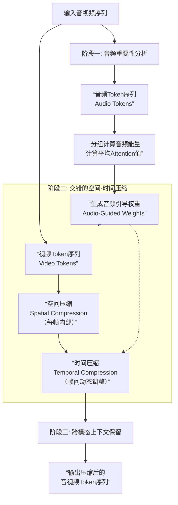
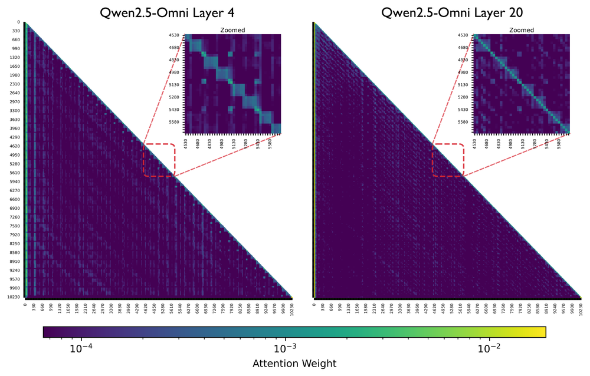
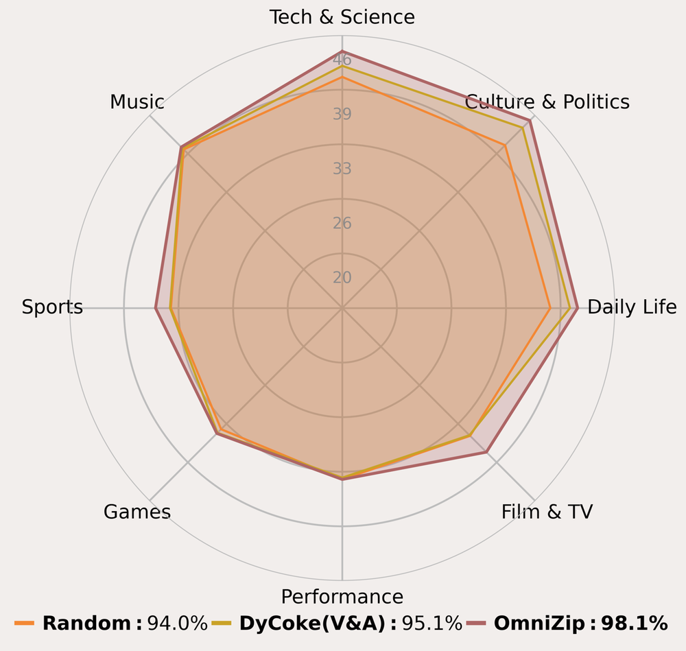
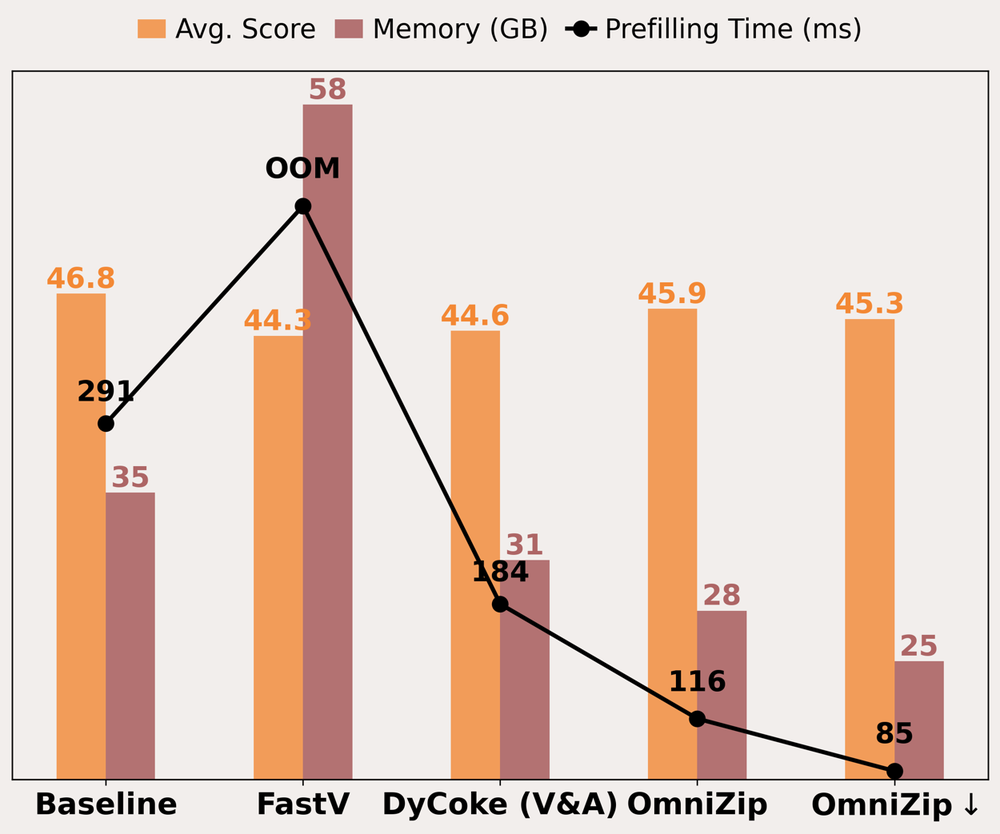

# OmniZip: Audio-Guided Dynamic Token Compression for Fast Omnimodal Large Language Models

**ArXiv ID**: 2511.14582v1
**URL**: http://arxiv.org/abs/2511.14582v1
**提交日期**: 2025-11-18
**作者**: Keda Tao; Kele Shao; Bohan Yu; Weiqiang Wang; Jian liu; Huan Wang
**引用次数**: NULL
使用模型: ep-20251112215738-bz78g

## 1. 核心思想总结
根据您提供的标题、摘要和引言部分，以下是论文《OmniZip: Audio-Guided Dynamic Token Compression for Fast Omnimodal Large语言模型》的第一轮简洁总结：

**第一轮总结**

*   **1. Background (背景)**
    全模态大语言模型（OmniLLMs）在统一处理和理解音频-视频等多模态信息方面展现出巨大潜力，是当前的研究热点。

*   **2. Problem (问题)**
    处理冗长的音视频token序列带来了巨大的计算负担，成为模型推理速度的主要瓶颈。现有的token压缩方法尚未能满足这种新兴的、对多模态token进行联合压缩的需求。

*   **3. Method (high-level) (方法 - 高层次)**
    本文提出OmniZip，一个**无需训练**、由**音频引导**的音视频token压缩框架。其核心思想是利用音频信息密度来动态指导视频token的剪枝。具体而言，OmniZip首先识别关键的音频token，并计算每个时间组的音频保留分数；然后，基于此分数，采用一种交错的空间-时间压缩方案，在每个时间窗口内对视频token进行压缩，同时保留来自音频“锚点”的跨模态线索。

*   **4. Contribution (贡献)**
    提出的OmniZip框架能有效加速OmniLLMs的推理过程，经验证，其性能优于其他顶尖方法，实现了**3.42倍的推理加速**和**1.4倍的内存节省**，且**无需额外训练**即可保持模型性能。

## 2. 方法详解
好的，基于您提供的初步总结和论文方法章节的内容，我将为您详细阐述《OmniZip: Audio-Guided Dynamic Token Compression for Fast Omnimodal Large Language Models》这篇论文的方法细节。

### 论文方法细节详解

OmniZip 的核心目标是解决全模态大语言模型在处理冗长音视频序列时的计算瓶颈。其方法的精髓在于**利用音频信息作为“指南针”，动态地、非均匀地压缩视频Token**，从而实现高效推理。

#### 一、 关键创新与核心思想

1.  **音频引导的动态压缩**：这是最核心的创新点。传统方法通常对视频进行均匀采样或压缩，忽略了不同时间段信息密度的差异。OmniZip 创新性地提出，**音频的强弱变化（如语音、音乐、静默）是视频内容重要性的天然指示器**。高信息量的音频段（如有人说话）对应的视频帧通常包含更关键的信息，应予以保留；而低信息量音频段（如静默或环境音）对应的视频帧则可以大幅压缩。
2.  **无需训练**：整个压缩框架被设计为一个轻量级的预处理模块，**不涉及对主干OmniLLM的任何微调或再训练**。这使得该方法具有极强的通用性和易用性，可以即插即用地应用于各种现有的OmniLLMs。
3.  **交错的空间-时间压缩方案**：该方法并非简单地丢弃整个视频帧，而是设计了一种精细的两阶段压缩策略，先在空间维度上减少每帧的Token数，再在时间维度上根据音频重要性进行帧Token数量的动态调整，实现了更细粒度和高效的压缩。

#### 二、 算法/架构细节与关键步骤

OmniZip 的整体工作流程可以清晰地分为三个主要阶段，其架构与数据流如下图所示：

下面，我们对应流程图对每个阶段进行详细说明。

**阶段一：音频重要性分析与引导权重生成**

此阶段目标是生成一个用于指导视频压缩的“重要性地图”。

1.  **输入与分组**：
    *   **输入**： 音频模态编码器（如Q-Former）提取的音频Token序列 \( A = [a_1, a_2, ..., a_T] \)，其中 \( T \) 是时间步数。
    *   **分组**： 将音频Token序列划分为 \( G \) 个时间组（Temporal Groups）。例如，每 \( K \) 个连续的Token为一组，\( G = \lceil T/K \rceil \)。每个组将对应一个时间窗口内的视频帧。

2.  **计算音频组重要性分数**：
    *   对于每个音频组 \( g \)，计算其重要性分数 \( S_g \)。论文中探索了两种计算方式，均旨在衡量该时间段内音频的信息量：
        *   **能量度量**： 计算组内音频Token对应特征向量的平均范数（如L2范数）。声音响亮或清晰的段落的特征通常具有更大的能量。
        *   **注意力度量**： 利用OmniLLM中预训练的多模态交叉注意力层，计算音频Token作为`key`和`value`时，其注意力权重的平均值。与文本查询更相关的音频Token会获得更高的注意力分数。
    *   最终，每个音频组 \( g \) 获得一个重要性分数 \( S_g \)。

3.  **生成视频压缩引导权重**：
    *   重要性分数 \( S_g \) 被归一化并映射为视频Token的保留比例或数量。例如，通过一个简单的线性映射函数，将 \( S_g \) 转换为对应时间组内视频Token的保留比例 \( R_g \in (0, 1] \)。
    *   \( R_g \) 越高，表示该时间段的视频信息越重要，应保留越多的Token。

**阶段二：交错的空间-时间压缩**

此阶段是压缩的核心，根据第一阶段生成的引导权重，对视频Token进行压缩。

1.  **输入**： 视频模态编码器（如ViT）提取的视频Token序列 \( V = [V_1, V_2, ..., V_T] \)，其中 \( V_t \) 是第 \( t \) 帧的所有空间Token（例如，对于ViT，每帧有 \( N = 14 \times 14 = 196 \) 个Token）。

2.  **空间压缩**：
    *   **目的**： 首先减少**每帧内部**的冗余Token，为后续的时间压缩打下基础。
    *   **操作**： 对每一帧 \( V_t \)，使用一种**无参数**的压缩方法（如基于特征相似性的聚类、或重要性排序）来减少空间Token的数量。例如，将每帧的 \( N \) 个Token压缩到 \( M \) 个（\( M < N \)），得到压缩后的帧 \( V‘_t = [v’_{t,1}, ..., v‘_{t,M}] \)。
    *   这一步是对所有帧**均匀**执行的，是压缩的第一道工序。

3.  **时间压缩**：
    *   **目的**： 根据音频引导权重 \( R_g \)，**动态地**调整**不同时间段**的视频Token数量。这是实现“动态压缩”的关键。
    *   **操作**：
        *   将经过空间压缩的视频帧序列 \( [V’_1, V‘_2, ..., V’_T] \) 按照与音频相同的分组方式划分为 \( G \) 个组。
        *   对于每个组 \( g \)，根据其引导权重 \( R_g \)，确定该组需要保留的视频Token总数。例如，如果一组内有 \( K \) 帧，每帧已有 \( M \) 个Token，则该组原始Token数为 \( K \times M \)。需要保留的Token数则为 \( \lceil R_g \times K \times M \rceil \)。
        *   为了实现这一目标，在该组内部再次使用一种无参数的压缩算法（如K-means聚类），将 \( K \times M \) 个Token压缩到目标数量。这个过程会综合考虑Token在时间和空间上的相似性，实现真正的时空联合压缩。

**阶段三：跨模态上下文保留**

这是一个至关重要的步骤，旨在防止压缩过程中丢失关键的跨模态对齐信息。

1.  **问题**： 如果简单地对音频和视频Token分别进行压缩，可能会破坏模态间预训练好的对齐关系（例如，某个音频Token与描述唇形的视频Token之间的关联）。
2.  **解决方案**： OmniZip 识别出在阶段一中被认为是**重要的音频Token（“音频锚点”）**。
3.  **操作**： 在压缩视频Token时，会强制保留与这些“音频锚点”在时间上对齐或通过注意力机制关联的那些视频Token。具体来说，在阶段二的时间压缩过程中，当对某个包含重要音频Token的组进行聚类时，会确保这些与音频锚点有强关联的视频Token不被聚类中心合并掉，而是被保留在最终的Token序列中。这保证了即使经过大幅压缩，模型仍然能获取到关键的跨模态线索。

#### 三、 整体流程总结

1.  **输入**： 原始音视频数据分别通过各自的编码器得到Token序列。
2.  **分析**： 分析音频Token序列，生成一组按时间分组的引导权重 \( \{R_g\} \)。
3.  **压缩**：
    *   先对每一帧视频进行**空间压缩**，减少每帧的Token数。
    *   再根据音频引导权重，对分组后的视频Token序列进行**时间压缩**，动态调整不同时间段的Token数量。
4.  **保留**： 在整个压缩过程中，通过“跨模态上下文保留”机制，确保与重要音频信息相关的视频Token被优先保留。
5.  **输出**： 最终输出一个大幅缩短但富含信息的音视频Token序列，送入OmniLLM的骨干网络进行后续的理解和生成任务。

通过这种精心设计的、以音频为驱动的动态压缩流程，OmniZip 在最大限度地减少信息损失的前提下，实现了计算效率的显著提升。

## 3. 最终评述与分析
基于对论文《OmniZip: Audio-Guided Dynamic Token Compression for Fast Omnimodal Large Language Models》的标题、摘要、引言、方法细节及结论部分的综合分析，现提供最终评估如下：

### 最终综合评估

#### 1) 总体摘要
本论文针对全模态大语言模型在处理冗长音视频序列时面临的计算效率瓶颈，提出了一种创新的、无需训练的解决方案——OmniZip。该框架的核心思想是利用音频信息作为天然的重要性指示器，来动态指导视频Token的压缩。通过“音频重要性分析”、“交错的空间-时间压缩”以及“跨模态上下文保留”三个关键步骤，OmniZip实现了对音视频Token序列的高效、非均匀压缩。实验结果表明，该方法能显著加速模型推理，并有效节省内存，同时保持模型性能基本无损，为OmniLLMs的实际部署提供了强有力的技术支持。

#### 2) 优势
*   **创新性强**：提出了“音频引导”这一新颖且符合直觉的动态压缩范式，巧妙利用了音频信息密度与视频内容重要性之间的关联，突破了传统均匀压缩的局限。
*   **高效实用**：实现了**3.42倍的推理加速**和**1.4倍的内存节省**，性能提升显著，对于资源受限的实际应用场景（如边缘设备、实时交互）具有极高的价值。
*   **即插即用，通用性好**：整个框架作为预处理模块，**无需任何额外训练**，可直接应用于多种现有的OmniLLMs，极大地降低了使用门槛和部署成本。
*   **性能保持出色**：在实现高效压缩的同时，通过精细设计的压缩策略和跨模态上下文保留机制，确保了关键信息不丢失，在多个基准测试中性能下降极小，甚至优于其他主流压缩方法。
*   **方法设计精巧**：提出的“交错的空间-时间压缩”方案考虑了不同维度的冗余，并结合无参数操作，使方法本身轻量且高效。

#### 3) 劣势 / 局限性
*   **对音频依赖性强**：该方法的有效性建立在音频是视频内容可靠指示器的前提上。对于**音频与视频内容重要性不匹配或音频质量较差**的场景（例如，关键视觉事件发生在静默时段，或音频充满噪声），其压缩效果和性能保持能力可能会下降。
*   **压缩率与性能的权衡**：尽管整体性能保持良好，但**极高的压缩率下不可避免地会带来一定的信息损失**。论文可能未充分探讨在极端压缩设定下，对复杂推理任务（如需要精细时空推理的任务）的具体影响。
*   **参数敏感性**：方法中涉及分组大小、压缩目标函数等超参数，这些参数的**最优设置可能因数据集或任务而异**，需要一定的经验或调优。
*   **评估范围局限**：结论部分展示的实验结果主要集中在有限的几个基准数据集和任务上。该方法在**更广泛、更复杂的多模态任务（如长视频理解、开放世界推理）中的泛化能力**有待进一步验证。

#### 4) 潜在应用 / 意义
*   **推动OmniLLMs的实际落地**：通过解决核心的计算瓶颈，OmniZip使得在智能手机、嵌入式设备等计算资源有限的平台上实时运行强大的全模态模型成为可能，加速了AI技术的普惠化进程。
*   **降低服务成本**：对于提供多模态AI服务（如视频内容分析、智能客服、交互式娱乐）的云服务商而言，该技术能大幅降低单次推理的计算成本和能耗，具有显著的商业价值。
*   **启发新的研究方向**：
    *   为多模态Token压缩领域提供了一个新的、有效的思路，即**利用模态间的不平衡性（信息密度差异）来指导压缩**。
    *   其“无需训练”的特性启发了对**预训练模型进行高效推理后处理**的研究方向，减少了对大量计算资源和数据的依赖。
    *   可以扩展到其他模态组合，例如，利用文本摘要来引导长视频压缩，或探索其他模态间的关系进行联合优化。
*   **促进高效能AI发展**：该工作符合当前AI领域对模型轻量化、推理高效化的迫切需求，是构建绿色、可持续人工智能的重要实践。

---

# 附录：论文图片

## 图 1

## 图 2

## 图 3

## 图 4

## 图 5

## 图 6

## 图 7

## 图 8

## 图 9

## 图 10

